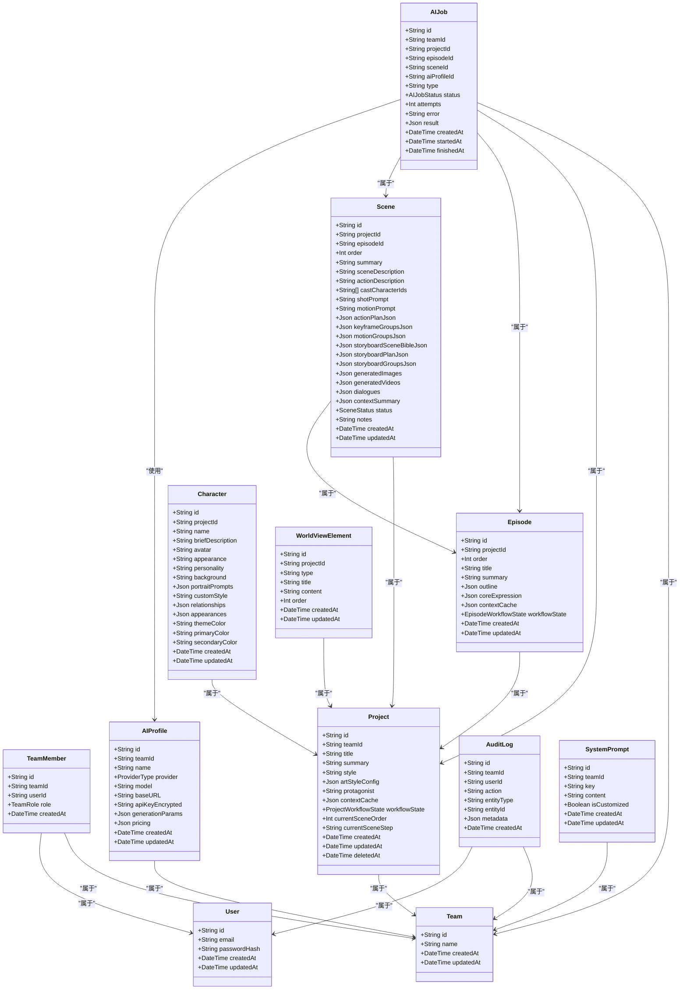

# 数据库设计

<cite>
**本文引用的文件**
- [apps/api/prisma/schema.prisma](file://apps/api/prisma/schema.prisma)
- [apps/api/prisma/migrations/000_init/migration.sql](file://apps/api/prisma/migrations/000_init/migration.sql)
- [apps/api/prisma/migrations/20251214144332_ai_profile_pricing/migration.sql](file://apps/api/prisma/migrations/20251214144332_ai_profile_pricing/migration.sql)
- [apps/api/prisma/migrations/20260107190000_add_action_beats/migration.sql](file://apps/api/prisma/migrations/20260107190000_add_action_beats/migration.sql)
- [apps/api/prisma/migrations/20260121225000_add_scene_generated_videos/migration.sql](file://apps/api/prisma/migrations/20260121225000_add_scene_generated_videos/migration.sql)
- [apps/api/src/prisma/prisma.service.ts](file://apps/api/src/prisma/prisma.service.ts)
- [apps/api/src/prisma/prisma.module.ts](file://apps/api/src/prisma/prisma.module.ts)
- [apps/api/src/projects/projects.service.ts](file://apps/api/src/projects/projects.service.ts)
- [apps/api/src/episodes/episodes.service.ts](file://apps/api/src/episodes/episodes.service.ts)
- [apps/api/src/scenes/scenes.service.ts](file://apps/api/src/scenes/scenes.service.ts)
- [apps/api/src/characters/characters.service.ts](file://apps/api/src/characters/characters.service.ts)
- [apps/api/src/world-view/world-view.service.ts](file://apps/api/src/world-view/world-view.service.ts)
- [apps/api/src/system-prompts/system-prompts.service.ts](file://apps/api/src/system-prompts/system-prompts.service.ts)
- [apps/api/src/jobs/jobs.service.ts](file://apps/api/src/jobs/jobs.service.ts)
</cite>

## 目录

1. [简介](#简介)
2. [项目结构](#项目结构)
3. [核心组件](#核心组件)
4. [架构总览](#架构总览)
5. [详细组件分析](#详细组件分析)
6. [依赖分析](#依赖分析)
7. [性能考量](#性能考量)
8. [故障排查指南](#故障排查指南)
9. [结论](#结论)
10. [附录](#附录)

## 简介

本文件面向AIXSSS数据库设计，围绕基于Prisma ORM的数据模型进行系统化技术说明。内容涵盖实体关系与字段定义、索引策略与查询优化、迁移管理与版本控制、数据访问模式与缓存策略、数据生命周期与归档、安全与隐私及访问控制，以及实际操作示例与最佳实践。

## 项目结构

数据库模型由Prisma Schema集中定义，并通过NestJS模块注入到服务层；迁移文件记录数据库演进历史；各业务模块（项目、场景、角色、AI作业等）通过Prisma Service进行数据访问。

图表来源

- [apps/api/prisma/schema.prisma](file://apps/api/prisma/schema.prisma#L1-L351)
- [apps/api/src/prisma/prisma.module.ts](file://apps/api/src/prisma/prisma.module.ts#L1-L12)
- [apps/api/src/prisma/prisma.service.ts](file://apps/api/src/prisma/prisma.service.ts#L1-L16)
- [apps/api/prisma/migrations/000_init/migration.sql](file://apps/api/prisma/migrations/000_init/migration.sql#L1-L202)

章节来源

- [apps/api/prisma/schema.prisma](file://apps/api/prisma/schema.prisma#L1-L351)
- [apps/api/src/prisma/prisma.module.ts](file://apps/api/src/prisma/prisma.module.ts#L1-L12)
- [apps/api/src/prisma/prisma.service.ts](file://apps/api/src/prisma/prisma.service.ts#L1-L16)

## 核心组件

- 模型与枚举：用户、团队、成员、项目、叙事因果链版本、剧集、场景、角色、世界观元素、AI配置、审计日志、AI作业、系统提示。
- 关系与约束：一对一/一对多、外键级联删除、唯一索引、复合索引、JSON字段存储非结构化数据。
- 索引策略：按团队维度排序查询、按时间倒序检索、按唯一顺序组合键保证有序性。
- 查询优化：批量统计、事务内一致性、避免重复请求错误、分页与排序结合。

章节来源

- [apps/api/prisma/schema.prisma](file://apps/api/prisma/schema.prisma#L75-L351)

## 架构总览

下图展示数据库模型之间的关系与典型查询路径。

图表来源

- [apps/api/prisma/schema.prisma](file://apps/api/prisma/schema.prisma#L75-L351)

## 详细组件分析

### 项目（Project）

- 结构要点
  - 团队归属、工作流状态、当前场景序号与步骤、软删除字段、上下文缓存JSON。
  - 索引：团队+更新时间倒序，便于按团队列出最新项目。
- 典型操作
  - 列表：按团队过滤、按更新时间倒序。
  - 创建：事务内同时创建默认剧集。
  - 更新：支持部分字段更新与叙事因果链变更检测，必要时写入版本。
  - 统计：批量计算剧集数量、含核心表达式剧节数、场景总数与已完成数。
- 查询优化
  - 使用事务保证项目与默认剧集的一致创建。
  - 统计查询采用聚合与计数，避免N+1。

图表来源

- [apps/api/src/projects/projects.service.ts](file://apps/api/src/projects/projects.service.ts#L112-L139)
- [apps/api/src/projects/projects.service.ts](file://apps/api/src/projects/projects.service.ts#L62-L102)

章节来源

- [apps/api/src/projects/projects.service.ts](file://apps/api/src/projects/projects.service.ts#L1-L215)
- [apps/api/prisma/schema.prisma](file://apps/api/prisma/schema.prisma#L116-L141)

### 场景（Scene）

- 结构要点
  - 属于项目与剧集，顺序唯一，状态枚举驱动工作流，多阶段生成JSON字段（动作拆解、关键帧、运动、故事板、生成图像/视频、对白、上下文摘要）。
  - 索引：剧集+顺序、项目+剧集+顺序，保障排序与范围查询效率。
- 典型操作
  - 列表：默认剧集或指定剧集下的场景按顺序排列。
  - 创建/更新：支持多阶段JSON字段与状态切换。
  - 删除：若存在未完成的AI作业则拒绝删除。
  - 重排：同一剧集内批量更新顺序，事务保证原子性。
- 查询优化
  - 通过唯一顺序索引快速定位与范围扫描。
  - 删除前检查AI作业状态，避免并发冲突。

图表来源

- [apps/api/src/scenes/scenes.service.ts](file://apps/api/src/scenes/scenes.service.ts#L255-L280)

章节来源

- [apps/api/src/scenes/scenes.service.ts](file://apps/api/src/scenes/scenes.service.ts#L1-L365)
- [apps/api/prisma/schema.prisma](file://apps/api/prisma/schema.prisma#L197-L233)

### 剧集（Episode）

- 结构要点
  - 属于项目，顺序唯一，核心表达式与大纲JSON，工作流状态。
  - 索引：项目+顺序，唯一约束保证顺序唯一性。
- 典型操作
  - 列表/获取/创建/更新：按项目维度查询与更新。
  - 删除：若包含场景且存在未完成AI作业则拒绝删除。
- 错误处理
  - 唯一约束冲突转换为友好错误消息。

章节来源

- [apps/api/src/episodes/episodes.service.ts](file://apps/api/src/episodes/episodes.service.ts#L1-L146)
- [apps/api/prisma/schema.prisma](file://apps/api/prisma/schema.prisma#L176-L195)

### 角色（Character）

- 结构要点
  - 属于项目，多维人物设定JSON字段，按更新时间倒序索引。
- 典型操作
  - 列表/创建/更新/删除：按项目维度管理角色。

章节来源

- [apps/api/src/characters/characters.service.ts](file://apps/api/src/characters/characters.service.ts#L1-L118)
- [apps/api/prisma/schema.prisma](file://apps/api/prisma/schema.prisma#L235-L257)

### 世界观（WorldViewElement）

- 结构要点
  - 属于项目，类型/标题/内容/顺序，唯一顺序索引。
- 典型操作
  - 列表/创建/更新/删除/重排：重排采用两阶段更新避免唯一约束冲突。

章节来源

- [apps/api/src/world-view/world-view.service.ts](file://apps/api/src/world-view/world-view.service.ts#L1-L129)
- [apps/api/prisma/schema.prisma](file://apps/api/prisma/schema.prisma#L259-L273)

### 系统提示（SystemPrompt）

- 结构要点
  - 团队+键唯一，支持自定义标记。
- 典型操作
  - 初始化默认提示、查询合并默认与自定义内容、更新提示并标记是否自定义。

章节来源

- [apps/api/src/system-prompts/system-prompts.service.ts](file://apps/api/src/system-prompts/system-prompts.service.ts#L1-L85)
- [apps/api/prisma/schema.prisma](file://apps/api/prisma/schema.prisma#L337-L350)

### AI作业（AIJob）

- 结构要点
  - 关联团队/项目/剧集/场景/AI配置，类型与状态枚举，重试次数与结果JSON。
  - 索引：团队+创建时间倒序、状态索引，便于队列与状态查询。
- 典型操作
  - 入队多种作业类型（规划、生成、细化等），设置重试与清理策略。
  - 获取作业并从队列事件补充进度信息。

图表来源

- [apps/api/src/jobs/jobs.service.ts](file://apps/api/src/jobs/jobs.service.ts#L101-L149)
- [apps/api/src/jobs/jobs.service.ts](file://apps/api/src/jobs/jobs.service.ts#L378-L418)

章节来源

- [apps/api/src/jobs/jobs.service.ts](file://apps/api/src/jobs/jobs.service.ts#L1-L800)
- [apps/api/prisma/schema.prisma](file://apps/api/prisma/schema.prisma#L311-L335)

### 审计日志（AuditLog）

- 结构要点
  - 记录团队、用户、动作、实体类型与ID、元数据、时间戳。
  - 索引：团队+时间倒序、用户索引，便于审计查询。

章节来源

- [apps/api/prisma/schema.prisma](file://apps/api/prisma/schema.prisma#L294-L309)

### AI配置（AIProfile）

- 结构要点
  - 团队归属、提供商与模型、基础URL、加密密钥、生成参数、定价JSON。
  - 索引：团队+更新时间倒序，便于按团队检索最新配置。

章节来源

- [apps/api/prisma/schema.prisma](file://apps/api/prisma/schema.prisma#L275-L292)

## 依赖分析

- 模块耦合
  - 所有业务服务依赖PrismaService，PrismaModule全局导出，降低重复注入成本。
  - 业务服务之间无直接耦合，通过Prisma模型与关系间接关联。
- 外部依赖
  - PostgreSQL作为数据源，Prisma Client JS生成运行时类型。
  - BullMQ用于异步作业队列，与AIJob模型配合实现工作流编排。
- 循环依赖
  - 未发现循环依赖迹象，Prisma Service单向被业务服务依赖。

图表来源

- [apps/api/src/prisma/prisma.module.ts](file://apps/api/src/prisma/prisma.module.ts#L1-L12)
- [apps/api/src/prisma/prisma.service.ts](file://apps/api/src/prisma/prisma.service.ts#L1-L16)
- [apps/api/src/jobs/jobs.service.ts](file://apps/api/src/jobs/jobs.service.ts#L1-L800)

章节来源

- [apps/api/src/prisma/prisma.module.ts](file://apps/api/src/prisma/prisma.module.ts#L1-L12)
- [apps/api/src/prisma/prisma.service.ts](file://apps/api/src/prisma/prisma.service.ts#L1-L16)
- [apps/api/src/jobs/jobs.service.ts](file://apps/api/src/jobs/jobs.service.ts#L1-L800)

## 性能考量

- 索引策略
  - 团队维度+时间倒序索引：项目列表、AI作业列表、审计日志列表。
  - 唯一顺序索引：场景与剧集的顺序唯一性，确保稳定排序与去重。
  - 状态索引：AI作业状态查询与调度。
- 查询优化
  - 批量统计：在业务服务中使用聚合与计数减少往返。
  - 事务一致性：创建项目时同时创建默认剧集，避免中间态。
  - 唯一约束冲突转换：将数据库错误映射为语义化错误，提升用户体验。
- 缓存策略
  - 上下文缓存（contextCache）用于跨阶段共享数据，避免重复计算。
  - 建议在应用层对热点查询结果进行短期缓存（如LRU），注意与数据库一致性同步。
- IO与吞吐
  - 对大JSON字段（如生成结果）建议按需加载与分页，避免全量传输。
  - 队列作业的重试与清理策略限制历史数据规模，保持查询性能。

[本节为通用性能指导，无需特定文件引用]

## 故障排查指南

- 常见错误与处理
  - 唯一约束冲突：剧集顺序重复时转换为友好错误。
  - 删除保护：场景/剧集存在未完成AI作业时拒绝删除。
  - 项目不可计划：缺少全局配置时拒绝入队相关作业。
- 排查步骤
  - 检查AI作业状态与错误字段，确认是否需要重试或取消。
  - 核对项目工作流状态与当前步骤，确保流程顺序正确。
  - 审计日志追踪关键操作，定位异常时间点与责任人。
- 日志与监控
  - 在业务服务中捕获并记录Prisma已知请求错误，便于前端提示。

章节来源

- [apps/api/src/episodes/episodes.service.ts](file://apps/api/src/episodes/episodes.service.ts#L74-L79)
- [apps/api/src/scenes/scenes.service.ts](file://apps/api/src/scenes/scenes.service.ts#L263-L276)
- [apps/api/src/jobs/jobs.service.ts](file://apps/api/src/jobs/jobs.service.ts#L77-L86)

## 结论

本数据库设计以Prisma为核心，围绕项目-剧集-场景的创作工作流构建模型，辅以AI作业队列与系统提示、角色与世界观管理，形成完整的叙事生成基础设施。通过合理的索引与事务策略、清晰的错误处理与审计能力，满足高并发与可维护性的需求。建议持续完善缓存与归档策略，结合监控与备份方案，保障生产环境的稳定性与可恢复性。

[本节为总结性内容，无需特定文件引用]

## 附录

### 数据模型类图（代码级）

图表来源

- [apps/api/prisma/schema.prisma](file://apps/api/prisma/schema.prisma#L75-L351)

### 迁移管理与版本控制

- 初始结构
  - 通过000_init迁移创建基础表、枚举与索引。
- 增量演进
  - 新增AI配置定价字段、场景动作分层与关键帧/运动分组、场景生成视频字段等。
- 版本锁定
  - 使用migration_lock.toml固定迁移提供者与数据库类型，避免多人协作冲突。

图表来源

- [apps/api/prisma/migrations/000_init/migration.sql](file://apps/api/prisma/migrations/000_init/migration.sql#L1-L202)
- [apps/api/prisma/migrations/20251214144332_ai_profile_pricing/migration.sql](file://apps/api/prisma/migrations/20251214144332_ai_profile_pricing/migration.sql#L1-L3)
- [apps/api/prisma/migrations/20260107190000_add_action_beats/migration.sql](file://apps/api/prisma/migrations/20260107190000_add_action_beats/migration.sql#L1-L7)
- [apps/api/prisma/migrations/20260121225000_add_scene_generated_videos/migration.sql](file://apps/api/prisma/migrations/20260121225000_add_scene_generated_videos/migration.sql#L1-L4)
- [apps/api/prisma/migrations/migration_lock.toml](file://apps/api/prisma/migrations/migration_lock.toml#L1-L3)

章节来源

- [apps/api/prisma/migrations/000_init/migration.sql](file://apps/api/prisma/migrations/000_init/migration.sql#L1-L202)
- [apps/api/prisma/migrations/20251214144332_ai_profile_pricing/migration.sql](file://apps/api/prisma/migrations/20251214144332_ai_profile_pricing/migration.sql#L1-L3)
- [apps/api/prisma/migrations/20260107190000_add_action_beats/migration.sql](file://apps/api/prisma/migrations/20260107190000_add_action_beats/migration.sql#L1-L7)
- [apps/api/prisma/migrations/20260121225000_add_scene_generated_videos/migration.sql](file://apps/api/prisma/migrations/20260121225000_add_scene_generated_videos/migration.sql#L1-L4)
- [apps/api/prisma/migrations/migration_lock.toml](file://apps/api/prisma/migrations/migration_lock.toml#L1-L3)

### 数据访问模式与缓存策略

- 访问模式
  - 服务层统一通过PrismaService进行CRUD与复杂查询。
  - 使用事务保证跨表一致性（如创建项目时初始化默认剧集）。
- 缓存策略
  - 应用层对热点查询（如项目统计、系统提示）进行短期缓存。
  - 注意缓存失效与数据库变更的同步，避免脏读。

[本节为通用指导，无需特定文件引用]

### 数据生命周期管理、保留策略与归档

- 软删除
  - 项目支持deletedAt软删除，业务查询默认排除已删除项。
- 作业清理
  - 队列作业配置removeOnComplete/RemoveOnFail上限，控制历史数据规模。
- 归档建议
  - 对历史项目与完成的作业定期归档至冷存储，保留关键元数据与摘要。
  - 定期清理过期的上下文缓存与临时生成物，释放空间。

[本节为通用指导，无需特定文件引用]

### 数据安全、隐私与访问控制

- 访问控制
  - 所有查询均强制绑定teamId，确保资源隔离。
  - 成员角色（Owner/Admin/Member）在UI与后端共同体现权限差异。
- 审计日志
  - 记录关键操作与实体变更，支持追溯与合规审查。
- 敏感信息
  - AI配置中的API Key进行加密存储，避免明文泄露。
  - 生成结果（图像/视频）建议通过鉴权直链或私有存储访问。

章节来源

- [apps/api/prisma/schema.prisma](file://apps/api/prisma/schema.prisma#L102-L114)
- [apps/api/prisma/schema.prisma](file://apps/api/prisma/schema.prisma#L294-L309)
- [apps/api/prisma/schema.prisma](file://apps/api/prisma/schema.prisma#L275-L292)

### 实际操作示例与最佳实践

- 示例：创建项目并初始化默认剧集
  - 使用ProjectsService的创建方法，内部通过事务完成。
- 示例：批量统计项目进度
  - 在业务层聚合剧集与场景统计，避免多次数据库往返。
- 最佳实践
  - 严格遵循唯一顺序约束，避免跨剧集移动场景导致的顺序冲突。
  - 删除前检查AI作业状态，防止破坏工作流。
  - 合理使用索引与分页，避免全表扫描。
  - 对大JSON字段按需加载，控制网络与内存占用。

章节来源

- [apps/api/src/projects/projects.service.ts](file://apps/api/src/projects/projects.service.ts#L112-L139)
- [apps/api/src/projects/projects.service.ts](file://apps/api/src/projects/projects.service.ts#L62-L102)
- [apps/api/src/scenes/scenes.service.ts](file://apps/api/src/scenes/scenes.service.ts#L309-L338)
