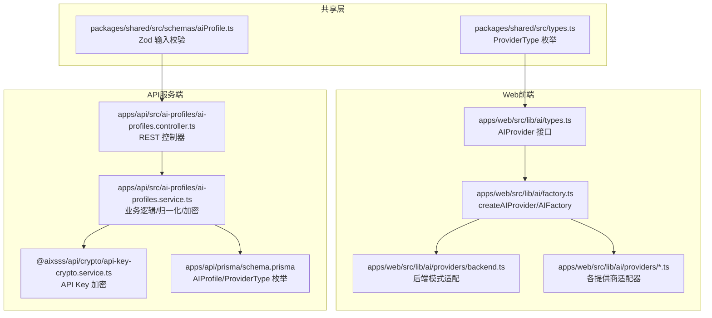
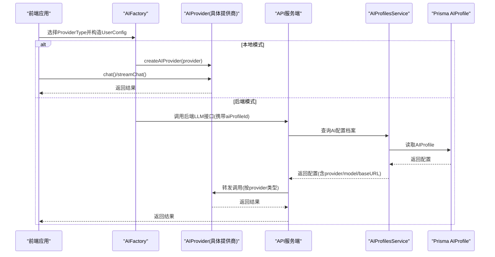
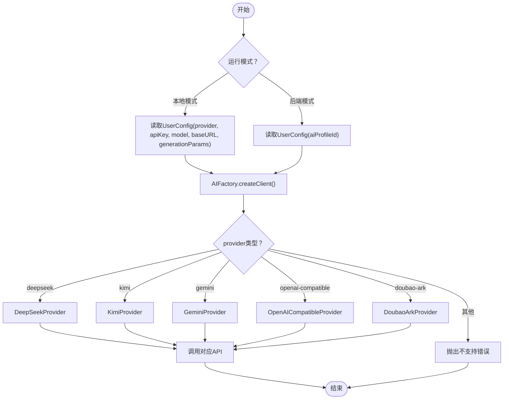
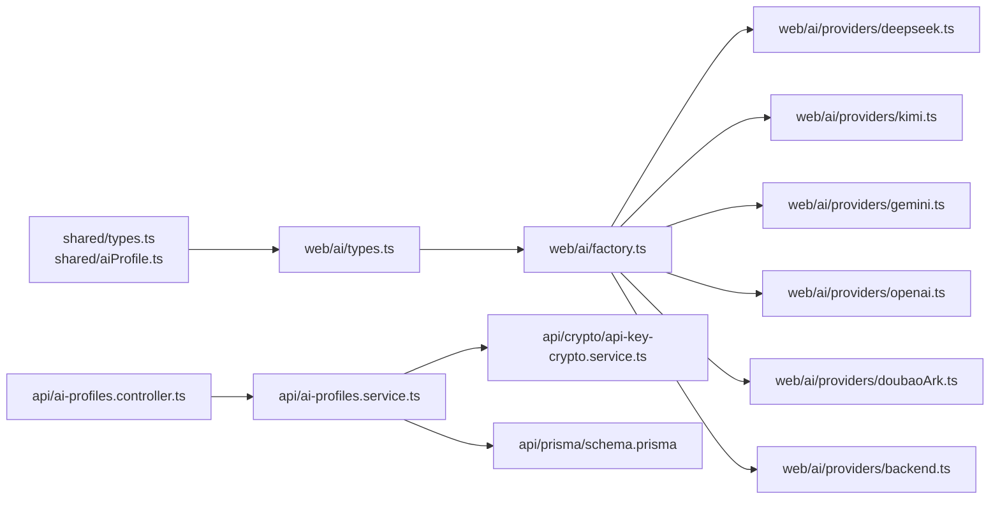

# AI提供商标识

<cite>
**本文档引用的文件**
- [apps/api/src/ai-profiles/ai-profiles.service.ts](file://apps/api/src/ai-profiles/ai-profiles.service.ts)
- [apps/api/src/ai-profiles/ai-profiles.controller.ts](file://apps/api/src/ai-profiles/ai-profiles.controller.ts)
- [apps/api/src/ai-profiles/ai-profiles.module.ts](file://apps/api/src/ai-profiles/ai-profiles.module.ts)
- [apps/api/prisma/schema.prisma](file://apps/api/prisma/schema.prisma)
- [apps/web/src/lib/ai/types.ts](file://apps/web/src/lib/ai/types.ts)
- [apps/web/src/lib/ai/factory.ts](file://apps/web/src/lib/ai/factory.ts)
- [apps/web/src/lib/ai/providers/backend.ts](file://apps/web/src/lib/ai/providers/backend.ts)
- [apps/web/src/lib/ai/providers/deepseek.ts](file://apps/web/src/lib/ai/providers/deepseek.ts)
- [apps/web/src/lib/ai/providers/kimi.ts](file://apps/web/src/lib/ai/providers/kimi.ts)
- [apps/web/src/lib/ai/providers/gemini.ts](file://apps/web/src/lib/ai/providers/gemini.ts)
- [apps/web/src/lib/ai/providers/openai.ts](file://apps/web/src/lib/ai/providers/openai.ts)
- [apps/web/src/lib/ai/providers/doubaoArk.ts](file://apps/web/src/lib/ai/providers/doubaoArk.ts)
- [packages/shared/src/schemas/aiProfile.ts](file://packages/shared/src/schemas/aiProfile.ts)
- [packages/shared/src/types.ts](file://packages/shared/src/types.ts)
- [apps/web/src/types/index.ts](file://apps/web/src/types/index.ts)
- [apps/web/src/lib/ai/providers/providers.test.ts](file://apps/web/src/lib/ai/providers/providers.test.ts)
</cite>

## 目录

1. [简介](#简介)
2. [项目结构](#项目结构)
3. [核心组件](#核心组件)
4. [架构总览](#架构总览)
5. [详细组件分析](#详细组件分析)
6. [依赖关系分析](#依赖关系分析)
7. [性能考量](#性能考量)
8. [故障排查指南](#故障排查指南)
9. [结论](#结论)
10. [附录](#附录)

## 简介

本文件面向AIXSSS AI系统中的“AI提供商标识模型”，系统性阐述ProviderType枚举的设计理念、各AI服务提供商的支持现状与差异、AI配置档案（AIProfile）与提供商标识的关联方式、多供应商支持的架构设计与切换机制，并提供提供商选择指南、配置示例与最佳实践，以及新提供商集成的扩展指南。

## 项目结构

围绕AI提供商标识与配置档案，代码主要分布在以下模块：

- 类型与共享校验：packages/shared（ProviderType、Zod输入校验）
- Web前端AI适配层：apps/web/src/lib/ai（工厂、适配器、请求封装）
- API服务端AI配置管理：apps/api/src/ai-profiles（控制器、服务、加密）
- 数据库模型：apps/api/prisma/schema.prisma（AIProfile、ProviderType枚举）



图表来源

- [packages/shared/src/types.ts](file://packages/shared/src/types.ts#L3-L4)
- [packages/shared/src/schemas/aiProfile.ts](file://packages/shared/src/schemas/aiProfile.ts#L1-L51)
- [apps/web/src/lib/ai/types.ts](file://apps/web/src/lib/ai/types.ts#L1-L30)
- [apps/web/src/lib/ai/factory.ts](file://apps/web/src/lib/ai/factory.ts#L1-L98)
- [apps/web/src/lib/ai/providers/backend.ts](file://apps/web/src/lib/ai/providers/backend.ts#L1-L25)
- [apps/api/src/ai-profiles/ai-profiles.controller.ts](file://apps/api/src/ai-profiles/ai-profiles.controller.ts#L1-L38)
- [apps/api/src/ai-profiles/ai-profiles.service.ts](file://apps/api/src/ai-profiles/ai-profiles.service.ts#L1-L202)
- [apps/api/prisma/schema.prisma](file://apps/api/prisma/schema.prisma#L53-L59)

章节来源

- [packages/shared/src/types.ts](file://packages/shared/src/types.ts#L3-L4)
- [packages/shared/src/schemas/aiProfile.ts](file://packages/shared/src/schemas/aiProfile.ts#L1-L51)
- [apps/web/src/lib/ai/types.ts](file://apps/web/src/lib/ai/types.ts#L1-L30)
- [apps/web/src/lib/ai/factory.ts](file://apps/web/src/lib/ai/factory.ts#L1-L98)
- [apps/web/src/lib/ai/providers/backend.ts](file://apps/web/src/lib/ai/providers/backend.ts#L1-L25)
- [apps/api/src/ai-profiles/ai-profiles.controller.ts](file://apps/api/src/ai-profiles/ai-profiles.controller.ts#L1-L38)
- [apps/api/src/ai-profiles/ai-profiles.service.ts](file://apps/api/src/ai-profiles/ai-profiles.service.ts#L1-L202)
- [apps/api/prisma/schema.prisma](file://apps/api/prisma/schema.prisma#L53-L59)

## 核心组件

- ProviderType枚举：统一定义所有受支持的AI提供商标识，确保前后端一致。
- AIProvider接口：抽象各提供商的聊天与流式聊天能力，便于工厂动态创建。
- AIFactory/createAIProvider：根据ProviderType创建具体适配器实例，或在后端模式下使用BackendProvider。
- AIProfilesService：负责AI配置档案的增删改查、API Key加密、模型与生成参数归一化、与数据库ProviderType的映射。
- Prisma AIProfile模型：持久化存储团队的AI配置档案，包含provider、model、baseURL、generationParams、pricing等字段。
- Zod输入校验：在API层对创建/更新AI配置档案进行严格校验。

章节来源

- [packages/shared/src/types.ts](file://packages/shared/src/types.ts#L3-L4)
- [apps/web/src/lib/ai/types.ts](file://apps/web/src/lib/ai/types.ts#L17-L30)
- [apps/web/src/lib/ai/factory.ts](file://apps/web/src/lib/ai/factory.ts#L13-L28)
- [apps/api/src/ai-profiles/ai-profiles.service.ts](file://apps/api/src/ai-profiles/ai-profiles.service.ts#L56-L72)
- [apps/api/prisma/schema.prisma](file://apps/api/prisma/schema.prisma#L275-L292)
- [packages/shared/src/schemas/aiProfile.ts](file://packages/shared/src/schemas/aiProfile.ts#L13-L41)

## 架构总览

多供应商支持采用“适配器+工厂”的架构，前端通过AIFactory根据ProviderType创建对应AIProvider实例；在后端模式下，前端通过BackendProvider将请求转发至API服务端，由AIProfilesService统一处理配置与调用。



图表来源

- [apps/web/src/lib/ai/factory.ts](file://apps/web/src/lib/ai/factory.ts#L77-L96)
- [apps/web/src/lib/ai/providers/backend.ts](file://apps/web/src/lib/ai/providers/backend.ts#L8-L14)
- [apps/api/src/ai-profiles/ai-profiles.controller.ts](file://apps/api/src/ai-profiles/ai-profiles.controller.ts#L19-L34)
- [apps/api/src/ai-profiles/ai-profiles.service.ts](file://apps/api/src/ai-profiles/ai-profiles.service.ts#L81-L132)
- [apps/api/prisma/schema.prisma](file://apps/api/prisma/schema.prisma#L275-L292)

## 详细组件分析

### ProviderType枚举与数据库映射

- 枚举值：deepseek、kimi、gemini、openai-compatible、doubao-ark
- 数据库层ProviderType枚举与前端/共享层保持一致，服务端在入库/出库时进行映射转换，确保兼容不同命名风格（如openai_compatible与openai-compatible）。

```mermaid
classDiagram
class ProviderType {
<<enum>>
"deepseek"
"kimi"
"gemini"
"openai-compatible"
"doubao-ark"
}
class PrismaProviderType {
<<enum>>
"deepseek"
"kimi"
"gemini"
"openai_compatible"
"doubao_ark"
}
class Mapping {
+toDbProvider(provider) PrismaProviderType
+fromDbProvider(dbStr) ProviderType
}
ProviderType <.. Mapping : "映射"
PrismaProviderType <.. Mapping : "映射"
```

图表来源

- [packages/shared/src/types.ts](file://packages/shared/src/types.ts#L3-L4)
- [apps/api/prisma/schema.prisma](file://apps/api/prisma/schema.prisma#L53-L59)
- [apps/api/src/ai-profiles/ai-profiles.service.ts](file://apps/api/src/ai-profiles/ai-profiles.service.ts#L56-L72)

章节来源

- [packages/shared/src/types.ts](file://packages/shared/src/types.ts#L3-L4)
- [apps/api/prisma/schema.prisma](file://apps/api/prisma/schema.prisma#L53-L59)
- [apps/api/src/ai-profiles/ai-profiles.service.ts](file://apps/api/src/ai-profiles/ai-profiles.service.ts#L56-L72)

### AI配置档案（AIProfile）与提供商标识关联

- 存储字段：teamId、name、provider、model、baseURL、apiKeyEncrypted、generationParams、pricing
- 服务端处理：
  - API Key加密存储，读取时解密
  - 模型名称归一化（如doubao-ark的接入点/模型ID）
  - 生成参数归一化（如doubao-ark移除不支持的惩罚项，规范化imageModel/videoModel）
  - provider字段与数据库枚举映射
- 前端使用：
  - 本地模式：直接使用UserConfig（provider、apiKey、model、baseURL、generationParams）
  - 后端模式：通过aiProfileId绑定服务端档案，前端不持有apiKey

章节来源

- [apps/api/prisma/schema.prisma](file://apps/api/prisma/schema.prisma#L275-L292)
- [apps/api/src/ai-profiles/ai-profiles.service.ts](file://apps/api/src/ai-profiles/ai-profiles.service.ts#L101-L132)
- [apps/web/src/lib/ai/providers/backend.ts](file://apps/web/src/lib/ai/providers/backend.ts#L9-L13)
- [apps/web/src/types/index.ts](file://apps/web/src/types/index.ts#L647-L657)

### 多供应商支持与切换机制

- 工厂模式：AIFactory.createClient根据UserConfig.provider创建对应AIProvider实例
- 后端模式：若检测到aiProfileId，则强制使用BackendProvider，内部调用API服务端完成实际调用
- 适配器职责：各Provider实现chat/streamChat，屏蔽不同API的差异（URL、认证头、消息格式、流式协议等）



图表来源

- [apps/web/src/lib/ai/factory.ts](file://apps/web/src/lib/ai/factory.ts#L13-L28)
- [apps/web/src/lib/ai/factory.ts](file://apps/web/src/lib/ai/factory.ts#L77-L96)
- [apps/web/src/lib/ai/providers/deepseek.ts](file://apps/web/src/lib/ai/providers/deepseek.ts#L4-L139)
- [apps/web/src/lib/ai/providers/kimi.ts](file://apps/web/src/lib/ai/providers/kimi.ts#L6-L163)
- [apps/web/src/lib/ai/providers/gemini.ts](file://apps/web/src/lib/ai/providers/gemini.ts#L4-L171)
- [apps/web/src/lib/ai/providers/openai.ts](file://apps/web/src/lib/ai/providers/openai.ts#L171-L383)
- [apps/web/src/lib/ai/providers/doubaoArk.ts](file://apps/web/src/lib/ai/providers/doubaoArk.ts#L103-L185)

章节来源

- [apps/web/src/lib/ai/factory.ts](file://apps/web/src/lib/ai/factory.ts#L13-L28)
- [apps/web/src/lib/ai/factory.ts](file://apps/web/src/lib/ai/factory.ts#L77-L96)

### 各提供商适配器特性与差异

#### DeepSeek

- 认证：Authorization: Bearer {apiKey}
- URL：默认 https://api.deepseek.com/v1/chat/completions
- 参数：temperature、top_p、max_tokens、presence_penalty、frequency_penalty
- 流式：SSE，逐块解析choices.delta.content

章节来源

- [apps/web/src/lib/ai/providers/deepseek.ts](file://apps/web/src/lib/ai/providers/deepseek.ts#L7-L72)
- [apps/web/src/lib/ai/providers/deepseek.ts](file://apps/web/src/lib/ai/providers/deepseek.ts#L74-L139)

#### Kimi（Moonshot）

- 认证：Authorization: Bearer {apiKey}
- URL：https://api.moonshot.cn/v1/chat/completions
- 特性：思考类模型自动调整temperature与max_tokens；流式解析delta.content
- 注意：当model包含“thinking”时，温度与最大tokens会按策略调整

章节来源

- [apps/web/src/lib/ai/providers/kimi.ts](file://apps/web/src/lib/ai/providers/kimi.ts#L4-L74)
- [apps/web/src/lib/ai/providers/kimi.ts](file://apps/web/src/lib/ai/providers/kimi.ts#L76-L163)

#### Gemini

- 认证：x-goog-api-key: {apiKey}
- URL：默认 https://generativelanguage.googleapis.com/v1beta/models/{model}:generateContent
- 流式：/v1beta/models/{model}:streamGenerateContent?alt=sse
- 消息格式：将messages转换为contents.parts结构，系统消息转为用户消息前缀
- 使用量：usageMetadata（promptTokenCount/candidatesTokenCount/totalTokenCount）

章节来源

- [apps/web/src/lib/ai/providers/gemini.ts](file://apps/web/src/lib/ai/providers/gemini.ts#L7-L106)
- [apps/web/src/lib/ai/providers/gemini.ts](file://apps/web/src/lib/ai/providers/gemini.ts#L108-L171)

#### OpenAI-Compatible

- 认证：Authorization: Bearer {apiKey}
- URL：默认 https://api.openai.com/v1/chat/completions
- 智能路由：根据模型名判断是否优先使用Responses API（/v1/responses），并做参数兼容与降级
- 参数：temperature、top_p、presence_penalty、frequency_penalty、max_tokens/max_completion_tokens、reasoning.effort
- 流式：SSE；对于优先走Responses的模型，streamChat会回退为非流式chat再yield结果

章节来源

- [apps/web/src/lib/ai/providers/openai.ts](file://apps/web/src/lib/ai/providers/openai.ts#L34-L57)
- [apps/web/src/lib/ai/providers/openai.ts](file://apps/web/src/lib/ai/providers/openai.ts#L197-L308)
- [apps/web/src/lib/ai/providers/openai.ts](file://apps/web/src/lib/ai/providers/openai.ts#L310-L383)

#### Doubao/ARK

- 认证：Authorization: Bearer {apiKey}
- URL：默认 https://ark.cn-beijing.volces.com/api/v3/responses
- 模型/接入点归一化：优先提取ep-...接入点ID，否则去除空白字符
- 参数：temperature、top_p、max_output_tokens
- 注意：Responses API不支持presence/frequency惩罚，且流式能力有限，必要时回退为非流式

章节来源

- [apps/web/src/lib/ai/providers/doubaoArk.ts](file://apps/web/src/lib/ai/providers/doubaoArk.ts#L29-L51)
- [apps/web/src/lib/ai/providers/doubaoArk.ts](file://apps/web/src/lib/ai/providers/doubaoArk.ts#L132-L185)

### AI配置档案API与校验

- 控制器：提供列表、创建、更新、删除接口，均基于JWT鉴权
- 输入校验：CreateAIProfileInputSchema/UpdateAIProfileInputSchema，覆盖name/provider/apiKey/model/baseURL/generationParams/pricing
- 服务端：对apiKey进行加密存储；对model与generationParams进行归一化处理；provider与数据库枚举映射

章节来源

- [apps/api/src/ai-profiles/ai-profiles.controller.ts](file://apps/api/src/ai-profiles/ai-profiles.controller.ts#L1-L38)
- [packages/shared/src/schemas/aiProfile.ts](file://packages/shared/src/schemas/aiProfile.ts#L13-L41)
- [apps/api/src/ai-profiles/ai-profiles.service.ts](file://apps/api/src/ai-profiles/ai-profiles.service.ts#L101-L132)

## 依赖关系分析

- 前端依赖共享类型与适配器实现，工厂与适配器之间为松耦合
- 服务端依赖Prisma模型与加密服务，对ProviderType进行映射与归一化
- 控制器仅负责参数解析与路由转发，业务逻辑集中在服务层



图表来源

- [packages/shared/src/types.ts](file://packages/shared/src/types.ts#L3-L4)
- [packages/shared/src/schemas/aiProfile.ts](file://packages/shared/src/schemas/aiProfile.ts#L1-L51)
- [apps/web/src/lib/ai/types.ts](file://apps/web/src/lib/ai/types.ts#L1-L30)
- [apps/web/src/lib/ai/factory.ts](file://apps/web/src/lib/ai/factory.ts#L1-L98)
- [apps/web/src/lib/ai/providers/\*.ts](file://apps/web/src/lib/ai/providers/deepseek.ts#L1-L140)
- [apps/api/src/ai-profiles/ai-profiles.controller.ts](file://apps/api/src/ai-profiles/ai-profiles.controller.ts#L1-L38)
- [apps/api/src/ai-profiles/ai-profiles.service.ts](file://apps/api/src/ai-profiles/ai-profiles.service.ts#L1-L202)
- [apps/api/prisma/schema.prisma](file://apps/api/prisma/schema.prisma#L275-L292)

章节来源

- [apps/web/src/lib/ai/factory.ts](file://apps/web/src/lib/ai/factory.ts#L1-L98)
- [apps/api/src/ai-profiles/ai-profiles.service.ts](file://apps/api/src/ai-profiles/ai-profiles.service.ts#L1-L202)

## 性能考量

- 流式输出：优先使用SSE流式接口，减少首字节延迟；对不支持流式的提供商（如Doubao/ARK Responses、部分OpenAI-Compatible模型）采用非流式回退
- 参数优化：根据模型特性自动调整temperature与maxTokens（如Kimi思考模型），避免不必要的超大请求
- 令牌统计：统一映射usage字段，便于成本与性能分析
- 网络重试与超时：建议在上层增加指数退避与超时控制（当前适配器主要依赖fetch的信号与原生错误处理）

## 故障排查指南

- 认证错误
  - DeepSeek/Kimi/Gemini/OpenAI-Compatible：检查Authorization头与API Key格式（移除Bearer前缀与多余空格）
  - Doubao/ARK：确认使用“方舟控制台”生成的API Key，不要包含Bearer前缀或换行
- URL与BaseURL
  - OpenAI-Compatible：避免baseURL重复包含/v1导致/v1/v1路径
  - DeepSeek：默认baseURL末尾斜杠会被清理
- 模型/接入点
  - Doubao/ARK：模型或接入点ID需去除空白；优先提取ep-...接入点ID
- 生成参数
  - Doubao/ARK Responses API不支持presence/frequency惩罚，会被自动剔除
  - OpenAI-Compatible在走Responses API时会忽略部分chat-completions参数并转换为responses参数
- 后端模式
  - 确保aiProfileId存在且有效；前端不持有apiKey，由服务端统一调用

章节来源

- [apps/web/src/lib/ai/providers/deepseek.ts](file://apps/web/src/lib/ai/providers/deepseek.ts#L12-L27)
- [apps/web/src/lib/ai/providers/kimi.ts](file://apps/web/src/lib/ai/providers/kimi.ts#L53-L61)
- [apps/web/src/lib/ai/providers/gemini.ts](file://apps/web/src/lib/ai/providers/gemini.ts#L41-L56)
- [apps/web/src/lib/ai/providers/openai.ts](file://apps/web/src/lib/ai/providers/openai.ts#L34-L57)
- [apps/web/src/lib/ai/providers/openai.ts](file://apps/web/src/lib/ai/providers/openai.ts#L139-L169)
- [apps/web/src/lib/ai/providers/doubaoArk.ts](file://apps/web/src/lib/ai/providers/doubaoArk.ts#L106-L130)
- [apps/web/src/lib/ai/providers/doubaoArk.ts](file://apps/web/src/lib/ai/providers/doubaoArk.ts#L47-L51)
- [apps/web/src/lib/ai/providers/backend.ts](file://apps/web/src/lib/ai/providers/backend.ts#L9-L13)

## 结论

AIXSSS AI通过统一的ProviderType枚举与适配器工厂，实现了对多家AI提供商的一致接入与灵活切换；配合服务端AI配置档案（AIProfile）与严格的输入校验、API Key加密与参数归一化，既保证了易用性，又兼顾了安全性与可维护性。对于新增提供商，遵循现有适配器模式与工厂注册流程即可快速集成。

## 附录

### 提供商选择指南

- 通用与兼容性强：优先考虑openai-compatible，便于对接多种兼容OpenAI生态的服务
- 中文场景与长文本：Kimi在中文理解与长上下文方面表现良好
- 多模态与推理：Gemini适合需要多模态与结构化输出的场景
- 高性价比与稳定：DeepSeek在性价比与稳定性方面表现突出
- 方舟/ARK生态：Doubao/ARK适合需要其特定接入点与能力的场景

### 配置示例（路径指引）

- 创建AI配置档案（REST）：POST /ai-profiles
  - 请求体字段：name、provider、apiKey、model、baseURL、generationParams、pricing
  - 参考校验：CreateAIProfileInputSchema
- 更新AI配置档案（REST）：PATCH /ai-profiles/:profileId
  - 支持部分字段更新（含清空pricing）
- 前端使用（本地模式）：UserConfig包含provider、apiKey、model、baseURL、generationParams
- 前端使用（后端模式）：UserConfig包含aiProfileId，不包含apiKey

章节来源

- [apps/api/src/ai-profiles/ai-profiles.controller.ts](file://apps/api/src/ai-profiles/ai-profiles.controller.ts#L14-L34)
- [packages/shared/src/schemas/aiProfile.ts](file://packages/shared/src/schemas/aiProfile.ts#L13-L41)
- [apps/web/src/types/index.ts](file://apps/web/src/types/index.ts#L647-L657)

### 最佳实践

- 将API Key加密存储于服务端AI配置档案，前端仅使用aiProfileId
- 对模型与接入点ID进行归一化处理，避免用户输入差异导致的调用失败
- 根据模型特性自动调整生成参数（如Kimi思考模型的温度与最大tokens）
- 对不支持流式的提供商采用非流式回退策略，保证可用性
- 使用统一的usage映射，便于成本与性能分析

### 新提供商集成扩展指南

- 定义ProviderType枚举值（共享层）
- 在工厂中注册createAIProvider分支
- 实现AIProvider接口（chat/streamChat），处理URL构建、认证头、消息格式、流式协议与错误处理
- 如需特殊参数归一化或模型ID处理，在服务端AIProfilesService中扩展normalize\*函数
- 在API层添加输入校验规则（如需要）
- 编写单元测试覆盖典型场景与边界条件

章节来源

- [packages/shared/src/types.ts](file://packages/shared/src/types.ts#L3-L4)
- [apps/web/src/lib/ai/factory.ts](file://apps/web/src/lib/ai/factory.ts#L13-L28)
- [apps/web/src/lib/ai/types.ts](file://apps/web/src/lib/ai/types.ts#L17-L30)
- [apps/api/src/ai-profiles/ai-profiles.service.ts](file://apps/api/src/ai-profiles/ai-profiles.service.ts#L24-L54)
- [apps/web/src/lib/ai/providers/providers.test.ts](file://apps/web/src/lib/ai/providers/providers.test.ts#L1-L797)
