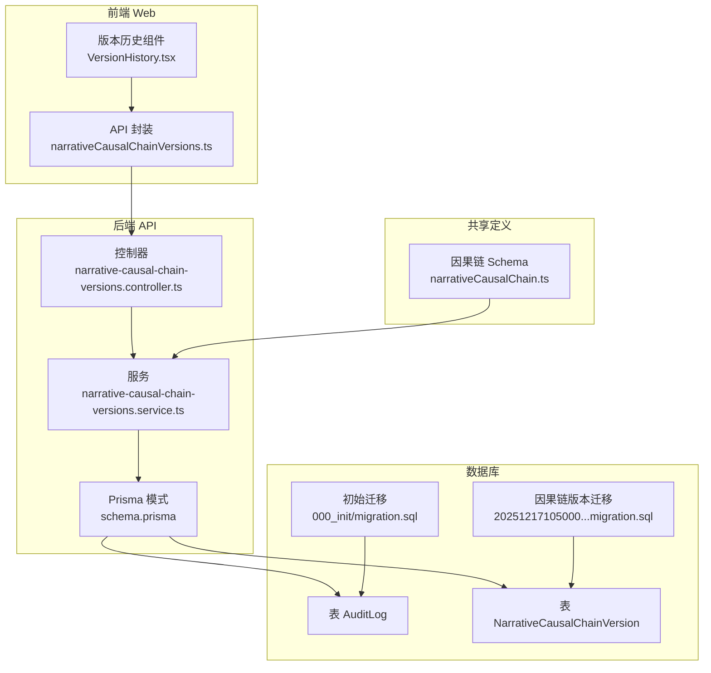
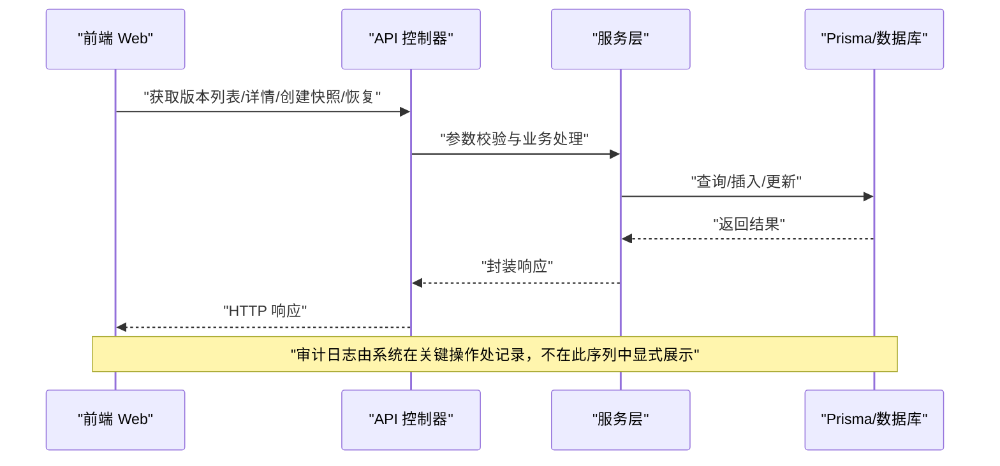
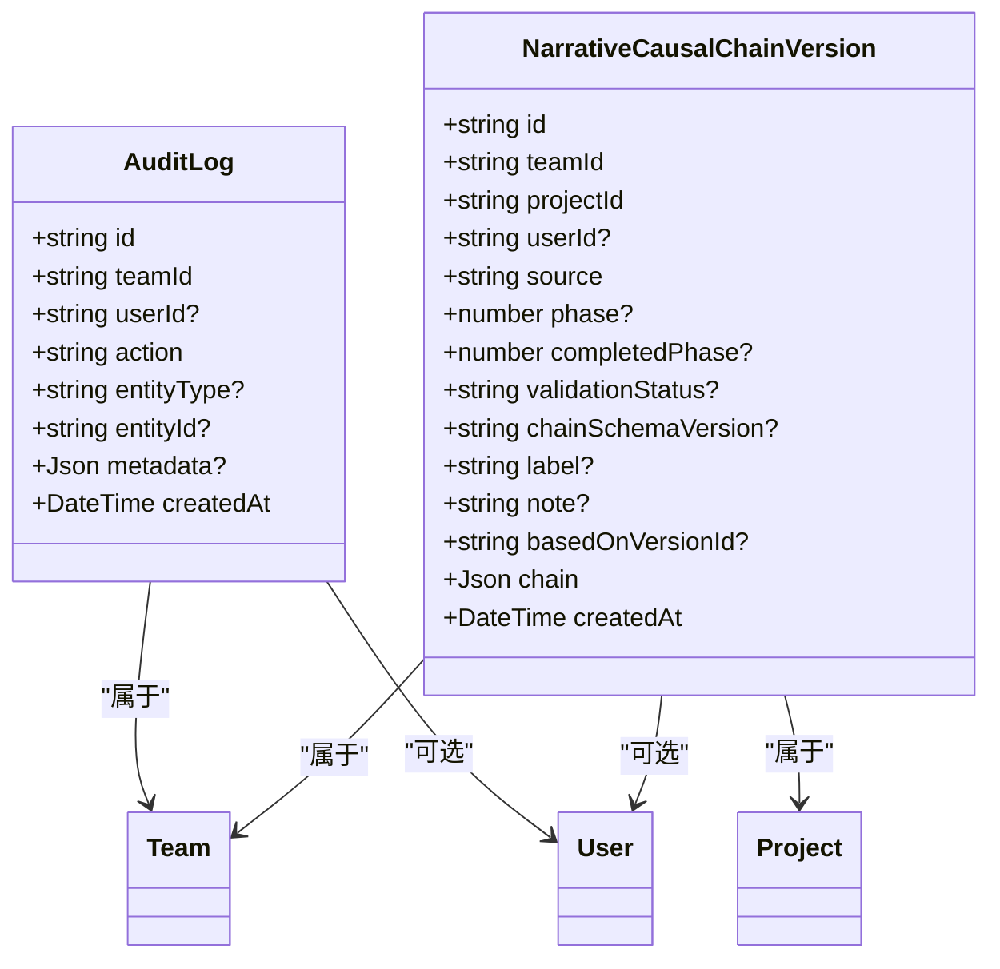
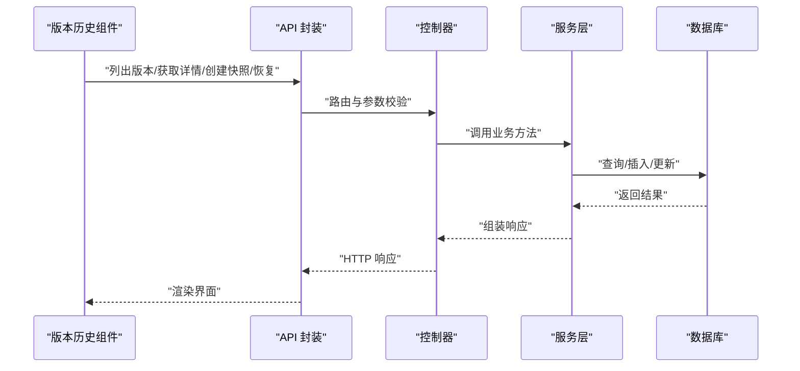
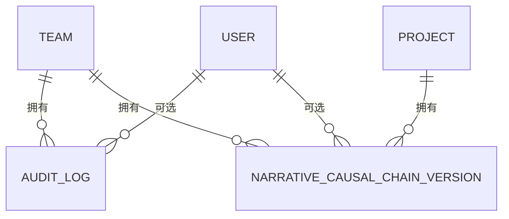

# 审计与叙事模型

<cite>
**本文引用的文件**
- [apps/api/prisma/schema.prisma](file://apps/api/prisma/schema.prisma)
- [apps/api/prisma/migrations/000_init/migration.sql](file://apps/api/prisma/migrations/000_init/migration.sql)
- [apps/api/prisma/migrations/20251217105000_add_causal_chain_versions/migration.sql](file://apps/api/prisma/migrations/20251217105000_add_causal_chain_versions/migration.sql)
- [apps/api/src/projects/narrative-causal-chain-versions.controller.ts](file://apps/api/src/projects/narrative-causal-chain-versions.controller.ts)
- [apps/api/src/projects/narrative-causal-chain-versions.service.ts](file://apps/api/src/projects/narrative-causal-chain-versions.service.ts)
- [apps/web/src/lib/api/narrativeCausalChainVersions.ts](file://apps/web/src/lib/api/narrativeCausalChainVersions.ts)
- [apps/web/src/components/editor/VersionHistory.tsx](file://apps/web/src/components/editor/VersionHistory.tsx)
- [packages/shared/src/schemas/narrativeCausalChain.ts](file://packages/shared/src/schemas/narrativeCausalChain.ts)
</cite>

## 目录

1. [简介](#简介)
2. [项目结构](#项目结构)
3. [核心组件](#核心组件)
4. [架构总览](#架构总览)
5. [详细组件分析](#详细组件分析)
6. [依赖分析](#依赖分析)
7. [性能考虑](#性能考虑)
8. [故障排查指南](#故障排查指南)
9. [结论](#结论)
10. [附录](#附录)

## 简介

本技术文档聚焦于 AIXSSS 中与“审计与叙事”相关的两类核心模型：审计日志（AuditLog）与叙事因果链版本（NarrativeCausalChainVersion）。前者用于记录团队与用户在系统中的关键操作，支撑合规审计与问题溯源；后者用于对项目级叙事因果链进行版本化管理，支持快照、恢复与版本对比，保障创作过程的可追溯性与可回滚性。

## 项目结构

围绕审计与叙事模型的相关代码分布在后端 API 层（NestJS）、数据库模式与迁移脚本、前端 Web 层以及共享 Schema 定义中。下图给出与本文主题直接相关的文件与模块关系概览。

图表来源

- [apps/api/src/projects/narrative-causal-chain-versions.controller.ts](file://apps/api/src/projects/narrative-causal-chain-versions.controller.ts#L1-L84)
- [apps/api/src/projects/narrative-causal-chain-versions.service.ts](file://apps/api/src/projects/narrative-causal-chain-versions.service.ts#L1-L339)
- [apps/api/prisma/schema.prisma](file://apps/api/prisma/schema.prisma#L294-L350)
- [apps/api/prisma/migrations/000_init/migration.sql](file://apps/api/prisma/migrations/000_init/migration.sql#L107-L164)
- [apps/api/prisma/migrations/20251217105000_add_causal_chain_versions/migration.sql](file://apps/api/prisma/migrations/20251217105000_add_causal_chain_versions/migration.sql#L1-L40)
- [apps/web/src/lib/api/narrativeCausalChainVersions.ts](file://apps/web/src/lib/api/narrativeCausalChainVersions.ts#L1-L57)
- [apps/web/src/components/editor/VersionHistory.tsx](file://apps/web/src/components/editor/VersionHistory.tsx#L1-L230)
- [packages/shared/src/schemas/narrativeCausalChain.ts](file://packages/shared/src/schemas/narrativeCausalChain.ts#L1-L268)

章节来源

- [apps/api/prisma/schema.prisma](file://apps/api/prisma/schema.prisma#L1-L351)
- [apps/api/prisma/migrations/000_init/migration.sql](file://apps/api/prisma/migrations/000_init/migration.sql#L1-L202)
- [apps/api/prisma/migrations/20251217105000_add_causal_chain_versions/migration.sql](file://apps/api/prisma/migrations/20251217105000_add_causal_chain_versions/migration.sql#L1-L40)
- [apps/api/src/projects/narrative-causal-chain-versions.controller.ts](file://apps/api/src/projects/narrative-causal-chain-versions.controller.ts#L1-L84)
- [apps/api/src/projects/narrative-causal-chain-versions.service.ts](file://apps/api/src/projects/narrative-causal-chain-versions.service.ts#L1-L339)
- [apps/web/src/lib/api/narrativeCausalChainVersions.ts](file://apps/web/src/lib/api/narrativeCausalChainVersions.ts#L1-L57)
- [apps/web/src/components/editor/VersionHistory.tsx](file://apps/web/src/components/editor/VersionHistory.tsx#L1-L230)
- [packages/shared/src/schemas/narrativeCausalChain.ts](file://packages/shared/src/schemas/narrativeCausalChain.ts#L1-L268)

## 核心组件

- 审计日志（AuditLog）
  - 记录团队与用户的关键操作，包含操作类型、实体类型与标识、附加元数据等，支持按团队与时间排序查询。
  - 数据库层面提供按团队+时间降序与用户索引，便于高效检索。
- 叙事情感链版本（NarrativeCausalChainVersion）
  - 对项目级叙事因果链进行版本化管理，支持手动快照、AI 自动生成、恢复派生三种来源类型。
  - 提供版本列表、详情查询、创建快照、恢复版本等能力，并内置版本上限裁剪，避免无限增长。

章节来源

- [apps/api/prisma/schema.prisma](file://apps/api/prisma/schema.prisma#L294-L350)
- [apps/api/prisma/migrations/20251217105000_add_causal_chain_versions/migration.sql](file://apps/api/prisma/migrations/20251217105000_add_causal_chain_versions/migration.sql#L1-L40)
- [apps/api/src/projects/narrative-causal-chain-versions.controller.ts](file://apps/api/src/projects/narrative-causal-chain-versions.controller.ts#L1-L84)
- [apps/api/src/projects/narrative-causal-chain-versions.service.ts](file://apps/api/src/projects/narrative-causal-chain-versions.service.ts#L1-L339)

## 架构总览

下图展示从前端到后端 API，再到数据库的调用与数据流路径，重点体现审计日志与叙事因果链版本的交互。

图表来源

- [apps/web/src/lib/api/narrativeCausalChainVersions.ts](file://apps/web/src/lib/api/narrativeCausalChainVersions.ts#L1-L57)
- [apps/api/src/projects/narrative-causal-chain-versions.controller.ts](file://apps/api/src/projects/narrative-causal-chain-versions.controller.ts#L1-L84)
- [apps/api/src/projects/narrative-causal-chain-versions.service.ts](file://apps/api/src/projects/narrative-causal-chain-versions.service.ts#L1-L339)
- [apps/api/prisma/schema.prisma](file://apps/api/prisma/schema.prisma#L294-L350)

## 详细组件分析

### 审计日志（AuditLog）模型

- 字段定义
  - id：唯一标识
  - teamId：所属团队
  - userId：执行用户（可空）
  - action：操作动作（字符串）
  - entityType/entityId：被操作实体类型与标识（可空）
  - metadata：附加元数据（JSON）
  - createdAt：创建时间
- 索引策略
  - 团队+时间降序索引：支持按团队快速检索最新审计记录
  - 用户索引：支持按用户检索其操作历史
- 查询优化
  - 使用复合索引进行范围扫描与过滤，避免全表扫描
  - 在高并发场景下，建议按团队维度分页查询并限制返回条数
- 合规性要点
  - 严格遵循最小必要原则，避免记录敏感字段
  - 对异常与高风险操作增加审计日志
  - 审计日志应具备不可篡改性与可追溯性

章节来源

- [apps/api/prisma/schema.prisma](file://apps/api/prisma/schema.prisma#L294-L350)
- [apps/api/prisma/migrations/000_init/migration.sql](file://apps/api/prisma/migrations/000_init/migration.sql#L107-L164)

### 叙事情感链版本（NarrativeCausalChainVersion）模型

- 字段定义
  - id、teamId、projectId、userId：关联关系
  - source：来源类型（ai/manual/restore）
  - phase：触发生成的阶段号（1-4，手动快照可为空）
  - completedPhase：快照时已完成阶段（0-4）
  - validationStatus：自洽校验状态（pass/needs_revision/incomplete）
  - chainSchemaVersion：因果链 schema 版本（如 2.0.0）
  - label/note：用户可读标签与备注
  - basedOnVersionId：恢复/派生时的来源版本 ID（不做外键约束）
  - chain：完整的叙事因果链 JSON
  - createdAt：创建时间
- 索引策略
  - 项目+时间降序索引：支持按项目快速获取最新版本
  - 团队+时间降序索引：支持跨项目按团队检索
  - 用户索引：支持按用户检索其创建的版本
- 版本管理策略
  - 手动快照：由用户主动创建，携带 label/note
  - AI 自动生成：在因果链变更时 best-effort 记录，不影响主流程
  - 恢复派生：基于某版本恢复后生成的新版本，标记来源
  - 版本上限：每个项目最多保留固定数量（裁剪更旧版本）

图表来源

- [apps/api/prisma/schema.prisma](file://apps/api/prisma/schema.prisma#L294-L350)
- [apps/api/prisma/migrations/20251217105000_add_causal_chain_versions/migration.sql](file://apps/api/prisma/migrations/20251217105000_add_causal_chain_versions/migration.sql#L1-L40)

章节来源

- [apps/api/prisma/schema.prisma](file://apps/api/prisma/schema.prisma#L143-L174)
- [apps/api/prisma/migrations/20251217105000_add_causal_chain_versions/migration.sql](file://apps/api/prisma/migrations/20251217105000_add_causal_chain_versions/migration.sql#L1-L40)

### API 工作流与版本对比

- API 能力
  - 列表：按项目与团队查询版本，支持 limit 参数
  - 详情：按版本 ID 查询完整版本信息
  - 创建快照：从当前项目上下文提取因果链并创建版本
  - 恢复版本：将目标版本写回项目上下文，并生成一条恢复来源的版本记录
- 前端集成
  - 提供统一的 API 封装与版本历史组件，支持标签、备注、恢复等操作
  - 版本对比通过前端展示不同版本的快照差异

图表来源

- [apps/web/src/components/editor/VersionHistory.tsx](file://apps/web/src/components/editor/VersionHistory.tsx#L1-L230)
- [apps/web/src/lib/api/narrativeCausalChainVersions.ts](file://apps/web/src/lib/api/narrativeCausalChainVersions.ts#L1-L57)
- [apps/api/src/projects/narrative-causal-chain-versions.controller.ts](file://apps/api/src/projects/narrative-causal-chain-versions.controller.ts#L1-L84)
- [apps/api/src/projects/narrative-causal-chain-versions.service.ts](file://apps/api/src/projects/narrative-causal-chain-versions.service.ts#L1-L339)

章节来源

- [apps/api/src/projects/narrative-causal-chain-versions.controller.ts](file://apps/api/src/projects/narrative-causal-chain-versions.controller.ts#L1-L84)
- [apps/api/src/projects/narrative-causal-chain-versions.service.ts](file://apps/api/src/projects/narrative-causal-chain-versions.service.ts#L65-L172)
- [apps/web/src/lib/api/narrativeCausalChainVersions.ts](file://apps/web/src/lib/api/narrativeCausalChainVersions.ts#L22-L56)
- [apps/web/src/components/editor/VersionHistory.tsx](file://apps/web/src/components/editor/VersionHistory.tsx#L59-L74)

### 版本对比与恢复策略

- 版本对比
  - 前端通过展示不同版本的快照（chain）差异实现对比
  - 支持按阶段、校验状态、schema 版本等元信息辅助判断差异
- 恢复策略
  - 恢复会将目标版本写回项目上下文缓存，并生成一条带来源标记的新版本
  - 恢复时可自动生成 label（如“恢复：原标签”或短 ID 前缀）
- 最佳实践
  - 恢复前建议导出备份
  - 对关键版本添加标签与备注，便于后续审计与追溯

章节来源

- [apps/api/src/projects/narrative-causal-chain-versions.service.ts](file://apps/api/src/projects/narrative-causal-chain-versions.service.ts#L207-L253)
- [apps/web/src/components/editor/VersionHistory.tsx](file://apps/web/src/components/editor/VersionHistory.tsx#L76-L87)

### 审计日志查询示例

- 按团队与时间范围查询
  - 使用团队 ID 与 createdAt 范围进行过滤，利用团队+时间索引提升性能
- 按用户查询
  - 使用用户 ID 与 createdAt 排序，定位特定用户的操作轨迹
- 示例流程（概念性）
  - 输入：团队 ID、起止时间、用户 ID、分页参数
  - 处理：按索引扫描，过滤条件，排序返回
  - 输出：审计记录列表（含操作动作、实体信息、元数据）

章节来源

- [apps/api/prisma/schema.prisma](file://apps/api/prisma/schema.prisma#L294-L350)
- [apps/api/prisma/migrations/000_init/migration.sql](file://apps/api/prisma/migrations/000_init/migration.sql#L160-L164)

### 版本对比功能

- 前端展示
  - 通过版本历史组件展示不同版本的快照预览，支持展开查看详情
- 后端支持
  - 通过版本详情接口返回完整 chain，前端自行对比差异
- 建议
  - 对于大体量 JSON，建议采用增量对比或摘要展示，避免前端渲染压力

章节来源

- [apps/web/src/components/editor/VersionHistory.tsx](file://apps/web/src/components/editor/VersionHistory.tsx#L165-L176)
- [apps/api/src/projects/narrative-causal-chain-versions.service.ts](file://apps/api/src/projects/narrative-causal-chain-versions.service.ts#L118-L172)

### 合规性要求

- 审计边界
  - 敏感字段（如 API Key）仅在必要环节解密使用，其他场景避免记录明文
  - 审计日志最小化采集，避免冗余与敏感信息泄露
- 数据保留与删除
  - 审计日志与版本记录应遵循数据保留策略，到期清理需满足合规要求
- 可追溯性
  - 版本恢复与来源标记清晰，确保可追溯与可审计

章节来源

- [apps/api/src/projects/narrative-causal-chain-versions.service.ts](file://apps/api/src/projects/narrative-causal-chain-versions.service.ts#L240-L252)

## 依赖分析

- 组件耦合
  - 控制器依赖服务层；服务层依赖 Prisma；前端通过 API 封装调用控制器
  - 审计日志与叙事因果链版本分别独立，但都依赖团队与用户维度进行权限与范围控制
- 外部依赖
  - Prisma 客户端与 PostgreSQL
  - NestJS 框架与 JWT 认证
- 潜在循环依赖
  - 未发现直接循环依赖；若后续扩展，需避免控制器与服务互相导入

图表来源

- [apps/web/src/lib/api/narrativeCausalChainVersions.ts](file://apps/web/src/lib/api/narrativeCausalChainVersions.ts#L1-L57)
- [apps/api/src/projects/narrative-causal-chain-versions.controller.ts](file://apps/api/src/projects/narrative-causal-chain-versions.controller.ts#L1-L84)
- [apps/api/src/projects/narrative-causal-chain-versions.service.ts](file://apps/api/src/projects/narrative-causal-chain-versions.service.ts#L1-L339)

章节来源

- [apps/api/src/projects/narrative-causal-chain-versions.controller.ts](file://apps/api/src/projects/narrative-causal-chain-versions.controller.ts#L1-L84)
- [apps/api/src/projects/narrative-causal-chain-versions.service.ts](file://apps/api/src/projects/narrative-causal-chain-versions.service.ts#L1-L339)

## 性能考虑

- 审计日志
  - 利用团队+时间索引进行范围查询，避免全表扫描
  - 对高频查询设置合理的分页与条数限制
- 叙事情感链版本
  - 使用项目+时间索引快速定位最新版本
  - 插入版本时进行上限裁剪，避免无限增长导致查询变慢
  - JSONB 存储大体量因果链，建议在前端做差异对比与懒加载

章节来源

- [apps/api/prisma/schema.prisma](file://apps/api/prisma/schema.prisma#L171-L173)
- [apps/api/src/projects/narrative-causal-chain-versions.service.ts](file://apps/api/src/projects/narrative-causal-chain-versions.service.ts#L305-L317)

## 故障排查指南

- 版本查询失败
  - 现象：版本列表或详情返回空或报错
  - 排查：确认项目是否存在、是否已迁移版本表、索引是否生效
  - 处理：检查迁移脚本执行情况与数据库连接
- 创建快照失败
  - 现象：提示因果链为空或数据库未迁移
  - 排查：确认项目上下文缓存中存在因果链，且版本表已创建
- 恢复版本异常
  - 现象：恢复成功但未生成版本记录
  - 排查：检查版本表迁移与插入逻辑，确认 best-effort 失败日志

章节来源

- [apps/api/src/projects/narrative-causal-chain-versions.service.ts](file://apps/api/src/projects/narrative-causal-chain-versions.service.ts#L111-L115)
- [apps/api/src/projects/narrative-causal-chain-versions.service.ts](file://apps/api/src/projects/narrative-causal-chain-versions.service.ts#L167-L171)
- [apps/api/src/projects/narrative-causal-chain-versions.service.ts](file://apps/api/src/projects/narrative-causal-chain-versions.service.ts#L203-L204)
- [apps/api/src/projects/narrative-causal-chain-versions.service.ts](file://apps/api/src/projects/narrative-causal-chain-versions.service.ts#L250-L252)
- [apps/api/src/projects/narrative-causal-chain-versions.service.ts](file://apps/api/src/projects/narrative-causal-chain-versions.service.ts#L331-L334)

## 结论

本方案通过审计日志与叙事因果链版本两大模型，实现了对团队与用户行为的合规记录与对创作过程的版本化管理。审计日志提供细粒度的操作轨迹，而叙事因果链版本则保障了创作成果的可追溯与可回滚。配合合理的索引策略与前端对比能力，整体具备良好的可维护性与扩展性。

## 附录

- 数据模型关系图（基于 Prisma 模式）

图表来源

- [apps/api/prisma/schema.prisma](file://apps/api/prisma/schema.prisma#L75-L100)
- [apps/api/prisma/schema.prisma](file://apps/api/prisma/schema.prisma#L294-L350)
- [apps/api/prisma/schema.prisma](file://apps/api/prisma/schema.prisma#L143-L174)
