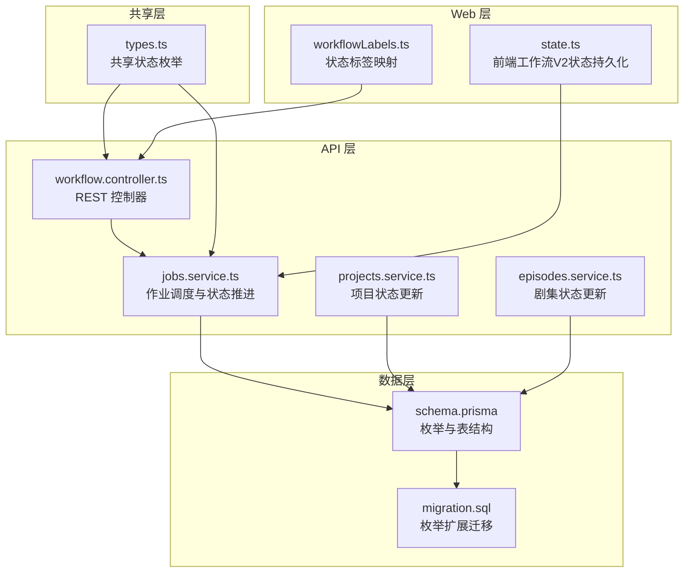
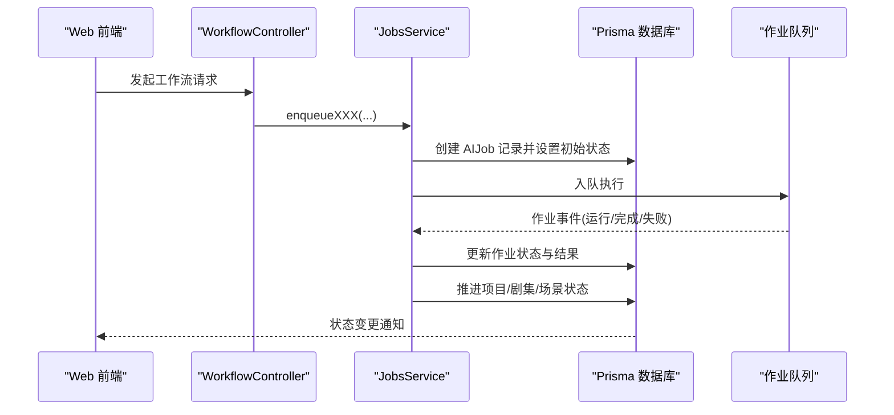
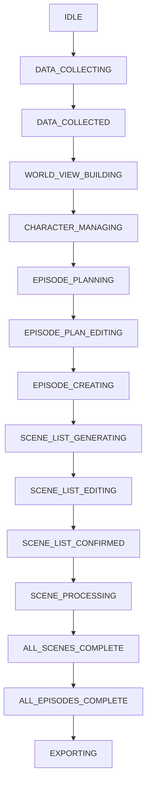
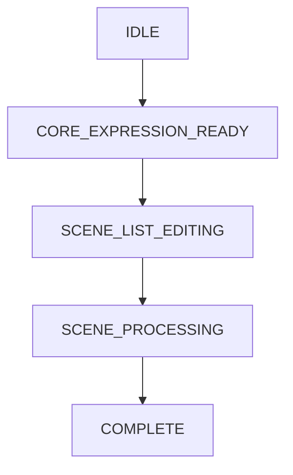
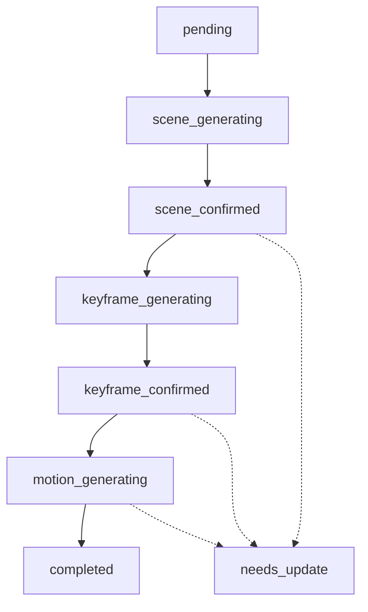
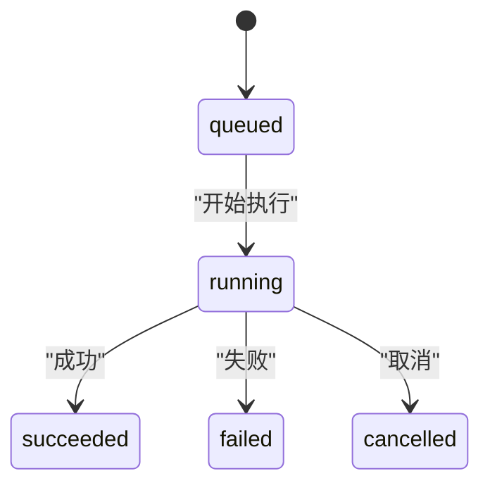
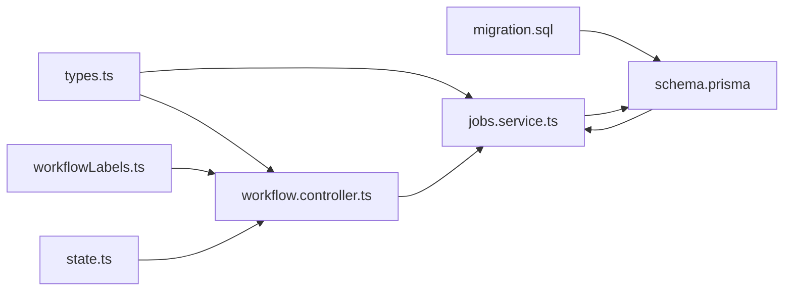

# 工作流状态枚举

<cite>
**本文引用的文件**
- [schema.prisma](file://apps/api/prisma/schema.prisma)
- [migration.sql](file://apps/api/prisma/migrations/20251215203000_add_episode_planning/migration.sql)
- [types.ts](file://packages/shared/src/types.ts)
- [workflowLabels.ts](file://apps/web/src/lib/workflowLabels.ts)
- [jobs.service.ts](file://apps/api/src/jobs/jobs.service.ts)
- [workflow.controller.ts](file://apps/api/src/jobs/workflow.controller.ts)
- [projects.service.ts](file://apps/api/src/projects/projects.service.ts)
- [episodes.service.ts](file://apps/api/src/episodes/episodes.service.ts)
- [state.ts](file://apps/web/src/lib/workflowV2/state.ts)
- [episode-planning-workflow.md](file://docs/prd/episode-planning-workflow.md)
- [episodeStore.ts](file://apps/web/src/stores/episodeStore.ts)
- [common.ts](file://apps/worker/src/tasks/common.ts)
</cite>

## 目录

1. [简介](#简介)
2. [项目结构](#项目结构)
3. [核心组件](#核心组件)
4. [架构总览](#架构总览)
5. [详细组件分析](#详细组件分析)
6. [依赖关系分析](#依赖关系分析)
7. [性能考量](#性能考量)
8. [故障排查指南](#故障排查指南)
9. [结论](#结论)
10. [附录](#附录)

## 简介

本文件系统性梳理 AIXSSS 工作流状态枚举的设计与实现，涵盖项目级工作流状态（ProjectWorkflowState）、剧集工作流状态（EpisodeWorkflowState）、场景状态（SceneStatus）、AI 作业状态（AIJobStatus）。文档从设计理念、取值含义、业务场景、状态转换条件与触发事件出发，解释状态机在创作流程中的作用与状态持久化策略，并阐述状态变更的日志与审计机制。最后提供状态转换图、状态流转示例与最佳实践，以及扩展与维护指南。

## 项目结构

围绕工作流状态的核心代码分布在以下模块：

- 数据模型与枚举定义：数据库 Prisma Schema 与迁移脚本
- 共享类型：前端与后端共享的状态枚举与工具类型
- 控制器与服务：工作流入口、作业调度与状态推进
- Web 层：工作流标签映射与前端状态持久化
- 文档与 PRD：状态机设计说明与实现改动点

图表来源

- [workflow.controller.ts](file://apps/api/src/jobs/workflow.controller.ts#L45-L265)
- [jobs.service.ts](file://apps/api/src/jobs/jobs.service.ts#L37-L149)
- [projects.service.ts](file://apps/api/src/projects/projects.service.ts#L34-L198)
- [episodes.service.ts](file://apps/api/src/episodes/episodes.service.ts#L27-L143)
- [schema.prisma](file://apps/api/prisma/schema.prisma#L16-L67)
- [migration.sql](file://apps/api/prisma/migrations/20251215203000_add_episode_planning/migration.sql#L3-L39)
- [types.ts](file://packages/shared/src/types.ts#L6-L47)
- [workflowLabels.ts](file://apps/web/src/lib/workflowLabels.ts#L1-L22)
- [state.ts](file://apps/web/src/lib/workflowV2/state.ts#L87-L138)

章节来源

- [schema.prisma](file://apps/api/prisma/schema.prisma#L16-L67)
- [migration.sql](file://apps/api/prisma/migrations/20251215203000_add_episode_planning/migration.sql#L3-L39)
- [types.ts](file://packages/shared/src/types.ts#L6-L47)
- [workflowLabels.ts](file://apps/web/src/lib/workflowLabels.ts#L1-L22)
- [jobs.service.ts](file://apps/api/src/jobs/jobs.service.ts#L37-L149)
- [projects.service.ts](file://apps/api/src/projects/projects.service.ts#L34-L198)
- [episodes.service.ts](file://apps/api/src/episodes/episodes.service.ts#L27-L143)
- [state.ts](file://apps/web/src/lib/workflowV2/state.ts#L87-L138)

## 核心组件

- 项目工作流状态（ProjectWorkflowState）：贯穿全局创作流程的主状态机，覆盖数据收集、世界构建、角色管理、剧集规划、分镜生成与细化、导出等阶段。
- 剧集工作流状态（EpisodeWorkflowState）：针对单集的创作状态，从核心表达就绪到分镜编辑、细化与完成。
- 场景状态（SceneStatus）：面向具体场景的细粒度状态，覆盖场景描述、关键帧提示、动作提示、对白等步骤的生成与确认。
- AI 作业状态（AIJobStatus）：作业生命周期状态，包括排队、运行、成功、失败、取消，配合队列事件进行追踪。

章节来源

- [schema.prisma](file://apps/api/prisma/schema.prisma#L16-L67)
- [types.ts](file://packages/shared/src/types.ts#L6-L47)

## 架构总览

工作流状态贯穿“控制器 -> 服务 -> 数据库”的调用链路，同时前端通过上下文缓存（contextCache）持久化工作流 V2 的中间状态，形成前后端一致的状态视图。

图表来源

- [workflow.controller.ts](file://apps/api/src/jobs/workflow.controller.ts#L45-L265)
- [jobs.service.ts](file://apps/api/src/jobs/jobs.service.ts#L101-L149)
- [schema.prisma](file://apps/api/prisma/schema.prisma#L16-L67)

## 详细组件分析

### 项目工作流状态（ProjectWorkflowState）

- 设计理念：以“阶段化推进”为核心，确保创作流程可控、可观测、可回溯。
- 关键状态与业务场景：
  - IDLE：项目刚创建，等待基础设定。
  - DATA_COLLECTING/DATA_COLLECTED：收集基础设定并完成校验。
  - WORLD_VIEW_BUILDING：构建世界观。
  - CHARACTER_MANAGING：角色管理与完善。
  - EPISODE_PLANNING/EPISODE_PLAN_EDITING/EPISODE_CREATING：剧集规划、编辑与单集创作。
  - SCENE_LIST_GENERATING/SCENE_LIST_EDITING/SCENE_LIST_CONFIRMED：分镜列表生成、编辑与确认。
  - SCENE_PROCESSING：细化分镜（场景描述、关键帧提示、动作提示、对白等）。
  - ALL_SCENES_COMPLETE/ALL_EPISODES_COMPLETE：分镜与剧集全部完成。
  - EXPORTING：导出阶段。
- 状态转换条件与触发事件：
  - 控制器根据请求类型调用服务，服务在创建 AIJob 后尝试推进项目状态（例如进入“剧集规划中”、“单集创作中”、“细化分镜中”等），并设置当前场景步骤与序号。
  - 服务在更新项目时，若检测到叙事因果链版本发生推进，自动写入版本快照，保证审计与可追溯。
- 前端展示：通过状态标签映射将枚举值翻译为中文，提升可读性。

图表来源

- [schema.prisma](file://apps/api/prisma/schema.prisma#L16-L32)
- [episode-planning-workflow.md](file://docs/prd/episode-planning-workflow.md#L1054-L1099)
- [workflowLabels.ts](file://apps/web/src/lib/workflowLabels.ts#L1-L22)

章节来源

- [schema.prisma](file://apps/api/prisma/schema.prisma#L16-L32)
- [jobs.service.ts](file://apps/api/src/jobs/jobs.service.ts#L101-L149)
- [projects.service.ts](file://apps/api/src/projects/projects.service.ts#L141-L198)
- [workflowLabels.ts](file://apps/web/src/lib/workflowLabels.ts#L1-L22)
- [episode-planning-workflow.md](file://docs/prd/episode-planning-workflow.md#L1054-L1099)

### 剧集工作流状态（EpisodeWorkflowState）

- 设计理念：聚焦单集创作闭环，从核心表达就绪到分镜编辑与细化完成。
- 关键状态与业务场景：
  - IDLE：默认初始态。
  - CORE_EXPRESSION_READY：核心表达生成完成，准备进入分镜列表生成。
  - SCENE_LIST_EDITING：编辑分镜列表（增删改排序）。
  - SCENE_PROCESSING：细化分镜（逐个场景推进）。
  - COMPLETE：单集创作完成。
- 状态转换条件与触发事件：
  - 服务在创建 AIJob（如生成核心表达、分镜列表）后，会更新剧集 workflowState。
  - 前端通过 contextCache 的 workflowV2 字段记录各“制品”（artifact）状态，支持锁定、更新时间等元信息。

图表来源

- [schema.prisma](file://apps/api/prisma/schema.prisma#L34-L40)
- [jobs.service.ts](file://apps/api/src/jobs/jobs.service.ts#L193-L231)
- [state.ts](file://apps/web/src/lib/workflowV2/state.ts#L87-L138)

章节来源

- [schema.prisma](file://apps/api/prisma/schema.prisma#L34-L40)
- [jobs.service.ts](file://apps/api/src/jobs/jobs.service.ts#L193-L231)
- [state.ts](file://apps/web/src/lib/workflowV2/state.ts#L87-L138)

### 场景状态（SceneStatus）

- 设计理念：以步骤化推进场景内容生成，覆盖场景描述、关键帧提示、动作提示、对白等。
- 关键状态与业务场景：
  - pending：待处理。
  - scene_generating：生成场景描述。
  - scene_confirmed：场景描述确认。
  - keyframe_generating：生成关键帧提示。
  - keyframe_confirmed：关键帧提示确认。
  - motion_generating：生成动作提示。
  - completed：场景全部完成。
  - needs_update：需要更新。
- 状态转换条件与触发事件：
  - 服务在创建对应 AIJob 后，同步更新场景状态（如进入“生成场景描述中”、“生成关键帧提示中”、“生成动作提示中”），并推进项目状态与当前步骤。

图表来源

- [schema.prisma](file://apps/api/prisma/schema.prisma#L42-L51)
- [jobs.service.ts](file://apps/api/src/jobs/jobs.service.ts#L378-L418)

章节来源

- [schema.prisma](file://apps/api/prisma/schema.prisma#L42-L51)
- [jobs.service.ts](file://apps/api/src/jobs/jobs.service.ts#L378-L418)

### AI 作业状态（AIJobStatus）

- 设计理念：统一作业生命周期状态，便于队列监控与 UI 展示。
- 状态定义：
  - queued：排队中
  - running：运行中
  - succeeded：成功
  - failed：失败
  - cancelled：取消
- 状态转换：
  - 控制器接收请求后，服务创建 AIJob 并置为 queued。
  - Worker 执行后更新为 running，再根据结果更新为 succeeded/failed/cancelled。
  - 队列事件与进度信息可用于前端反馈与审计。

图表来源

- [schema.prisma](file://apps/api/prisma/schema.prisma#L61-L67)
- [jobs.service.ts](file://apps/api/src/jobs/jobs.service.ts#L88-L99)

章节来源

- [schema.prisma](file://apps/api/prisma/schema.prisma#L61-L67)
- [jobs.service.ts](file://apps/api/src/jobs/jobs.service.ts#L88-L99)

### 状态持久化策略

- 数据库持久化：
  - 项目、剧集、场景、AIJob 表均包含对应状态字段，使用 Prisma 枚举类型进行约束。
  - 项目状态更新时，服务会尝试推进状态并记录当前步骤与序号，便于断点续跑与进度展示。
- 前端持久化（工作流V2）：
  - 通过 contextCache 的 workflowV2 字段记录各制品状态、更新时间与锁定时间，支持跨页面刷新保持状态一致性。
  - 提供构建制品补丁的方法，原子性地更新指定制品状态。

章节来源

- [schema.prisma](file://apps/api/prisma/schema.prisma#L176-L195)
- [state.ts](file://apps/web/src/lib/workflowV2/state.ts#L87-L138)

### 审计与日志机制

- 项目状态推进与版本快照：
  - 当项目更新导致叙事因果链版本推进时，服务自动写入版本快照，记录来源（AI/手动/恢复）、阶段、标签与备注，便于审计与回溯。
- 作业与任务审计：
  - 作业表记录创建、开始、结束时间与进度，结合队列事件与 Token 使用统计，形成完整的执行轨迹。
- 前端日志桥接：
  - 前端在发起 AI 调用时记录日志条目，包含技能名、模板、消息、系统提示键等，便于问题定位与复盘。

章节来源

- [projects.service.ts](file://apps/api/src/projects/projects.service.ts#L170-L196)
- [episodeStore.ts](file://apps/web/src/stores/episodeStore.ts#L438-L461)
- [common.ts](file://apps/worker/src/tasks/common.ts#L4-L17)

## 依赖关系分析

- 枚举定义与迁移：
  - Prisma 枚举定义位于 schema 中，迁移脚本安全地扩展项目状态枚举并新增剧集状态枚举。
- 控制器与服务：
  - 控制器负责参数解析与作业入队；服务负责业务校验、状态推进与数据库操作。
- 共享类型与前端：
  - 共享类型提供前后端一致的枚举定义；前端标签映射与工作流V2状态持久化增强用户体验与一致性。

图表来源

- [types.ts](file://packages/shared/src/types.ts#L6-L47)
- [workflow.controller.ts](file://apps/api/src/jobs/workflow.controller.ts#L45-L265)
- [jobs.service.ts](file://apps/api/src/jobs/jobs.service.ts#L37-L149)
- [schema.prisma](file://apps/api/prisma/schema.prisma#L16-L67)
- [migration.sql](file://apps/api/prisma/migrations/20251215203000_add_episode_planning/migration.sql#L3-L39)
- [workflowLabels.ts](file://apps/web/src/lib/workflowLabels.ts#L1-L22)
- [state.ts](file://apps/web/src/lib/workflowV2/state.ts#L87-L138)

章节来源

- [types.ts](file://packages/shared/src/types.ts#L6-L47)
- [workflow.controller.ts](file://apps/api/src/jobs/workflow.controller.ts#L45-L265)
- [jobs.service.ts](file://apps/api/src/jobs/jobs.service.ts#L37-L149)
- [schema.prisma](file://apps/api/prisma/schema.prisma#L16-L67)
- [migration.sql](file://apps/api/prisma/migrations/20251215203000_add_episode_planning/migration.sql#L3-L39)
- [workflowLabels.ts](file://apps/web/src/lib/workflowLabels.ts#L1-L22)
- [state.ts](file://apps/web/src/lib/workflowV2/state.ts#L87-L138)

## 性能考量

- 队列重试与退避：作业配置指数退避与最大重试次数，降低瞬时失败影响。
- 结果清理：完成/失败作业保留数量限制，避免历史堆积。
- 前端状态缓存：通过 contextCache 减少重复请求与状态查询开销。
- Token 统计：作业结果中聚合 prompt/completion/total，便于成本与性能分析。

章节来源

- [jobs.service.ts](file://apps/api/src/jobs/jobs.service.ts#L136-L146)
- [common.ts](file://apps/worker/src/tasks/common.ts#L4-L17)

## 故障排查指南

- 项目不可规划：
  - 服务在入队前校验项目基础设定是否完整，缺失字段将抛出错误，需先补齐基础设定。
- 删除剧集失败：
  - 若剧集内存在正在排队或运行中的场景作业，删除会被拒绝，需先取消相关作业。
- 状态推进异常：
  - 检查控制器是否正确调用服务推进状态；确认数据库连接与事务执行情况。
- 前端状态不同步：
  - 确认 contextCache 的 workflowV2 是否正确更新；检查制品状态补丁构建逻辑。

章节来源

- [jobs.service.ts](file://apps/api/src/jobs/jobs.service.ts#L77-L86)
- [episodes.service.ts](file://apps/api/src/episodes/episodes.service.ts#L124-L139)
- [state.ts](file://apps/web/src/lib/workflowV2/state.ts#L87-L138)

## 结论

AIXSSS 的工作流状态体系以“阶段化推进+步骤化细化”为核心，通过数据库枚举、共享类型、控制器/服务编排与前端上下文缓存，实现了创作流程的可控、可观测与可审计。项目、剧集、场景与作业状态相互协同，配合版本快照与 Token 统计，为质量与稳定性提供了坚实保障。

## 附录

### 状态流转示例

- 从“基础设定完成”到“分镜列表确认”：
  - 项目状态：DATA_COLLECTED → SCENE_LIST_GENERATING → SCENE_LIST_EDITING → SCENE_LIST_CONFIRMED
  - 场景状态：pending → scene_generating → scene_confirmed → keyframe_generating → keyframe_confirmed → motion_generating → completed
- 从“核心表达就绪”到“单集完成”：
  - 剧集状态：CORE_EXPRESSION_READY → SCENE_LIST_EDITING → SCENE_PROCESSING → COMPLETE

章节来源

- [jobs.service.ts](file://apps/api/src/jobs/jobs.service.ts#L305-L347)
- [schema.prisma](file://apps/api/prisma/schema.prisma#L42-L51)

### 状态管理最佳实践

- 严格遵循“先校验、后入队、再推进”的顺序，确保前置条件满足。
- 在 UI 层提供“锁定”状态以防止并发覆盖，利用 updatedAt/lockedAt 辅助冲突检测。
- 对关键节点（如版本推进、状态切换）增加审计日志，便于回溯。
- 对长耗时作业提供进度上报与可视化反馈，提升体验。

章节来源

- [state.ts](file://apps/web/src/lib/workflowV2/state.ts#L87-L138)
- [projects.service.ts](file://apps/api/src/projects/projects.service.ts#L170-L196)

### 扩展与维护指南

- 新增枚举值：
  - 在 Prisma schema 中添加新值并重建类型；在共享类型中同步更新；在前端标签映射中补充中文标签。
- 状态机演进：
  - 通过迁移脚本安全扩展枚举，避免破坏现有数据；必要时引入“阶段号/版本号”字段辅助演进。
- 审计与监控：
  - 增加作业 Token 使用统计与耗时分布，持续优化性能与成本。

章节来源

- [schema.prisma](file://apps/api/prisma/schema.prisma#L16-L67)
- [migration.sql](file://apps/api/prisma/migrations/20251215203000_add_episode_planning/migration.sql#L3-L39)
- [types.ts](file://packages/shared/src/types.ts#L6-L47)
- [workflowLabels.ts](file://apps/web/src/lib/workflowLabels.ts#L1-L22)
- [episode-planning-workflow.md](file://docs/prd/episode-planning-workflow.md#L558-L566)
