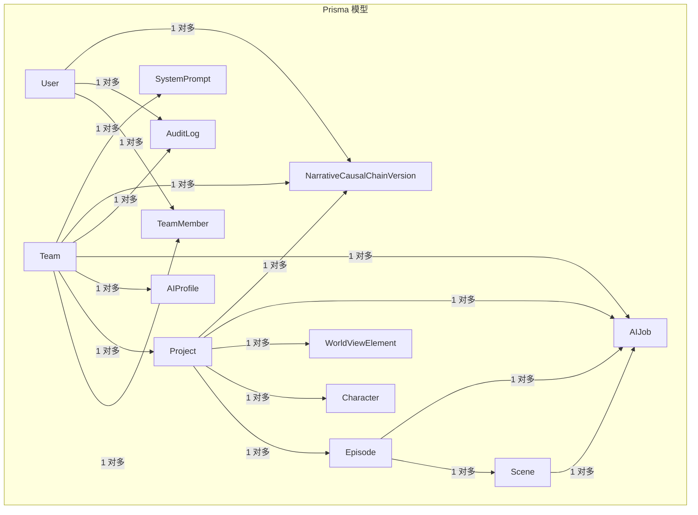
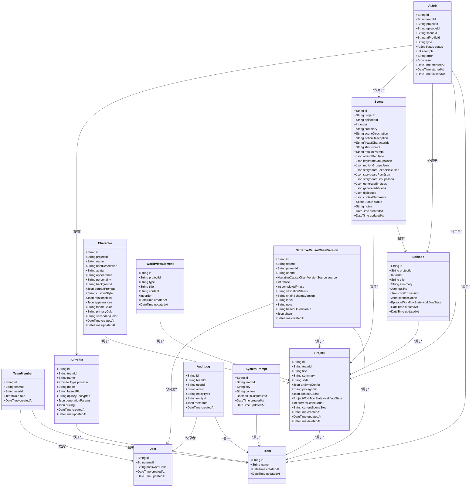
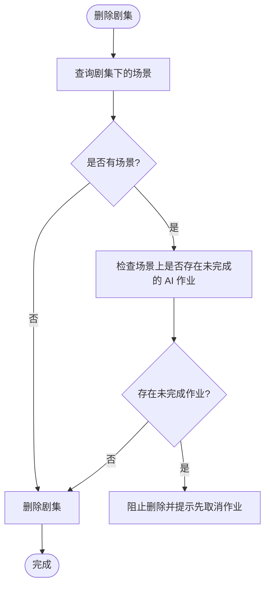

# 数据模型

<cite>
**本文引用的文件**
- [schema.prisma](file://apps/api/prisma/schema.prisma)
- [000_init/migration.sql](file://apps/api/prisma/migrations/000_init/migration.sql)
- [001_ai_job_profile/migration.sql](file://apps/api/prisma/migrations/001_ai_job_profile/migration.sql)
- [20251214144332_ai_profile_pricing/migration.sql](file://apps/api/prisma/migrations/20251214144332_ai_profile_pricing/migration.sql)
- [20260107190000_add_action_beats/migration.sql](file://apps/api/prisma/migrations/20260107190000_add_action_beats/migration.sql)
- [20260121225000_add_scene_generated_videos/migration.sql](file://apps/api/prisma/migrations/20260121225000_add_scene_generated_videos/migration.sql)
- [projects.service.ts](file://apps/api/src/projects/projects.service.ts)
- [scenes.service.ts](file://apps/api/src/scenes/scenes.service.ts)
- [characters.service.ts](file://apps/api/src/characters/characters.service.ts)
- [episodes.service.ts](file://apps/api/src/episodes/episodes.service.ts)
</cite>

## 目录

1. [简介](#简介)
2. [项目结构](#项目结构)
3. [核心组件](#核心组件)
4. [架构总览](#架构总览)
5. [详细组件分析](#详细组件分析)
6. [依赖分析](#依赖分析)
7. [性能考虑](#性能考虑)
8. [故障排查指南](#故障排查指南)
9. [结论](#结论)
10. [附录](#附录)

## 简介

本文件系统性梳理 AIXSSS 基于 Prisma ORM 的核心数据模型，覆盖用户(User)、团队(Team)、项目(Project)、场景(Scene)、角色(Character)、剧集(Episode)、AI作业(AIJob)等主要实体，明确各模型的主键、外键关系、索引策略与约束条件；解释项目工作流状态(ProjectWorkflowState)、场景状态(SceneStatus)、AI作业状态(AIJobStatus)等枚举的设计理念；阐述模型间关联关系与级联删除策略；并结合服务层使用示例，给出业务规则约束、最佳实践与性能优化建议。

## 项目结构

数据模型由 Prisma Schema 定义，并通过迁移脚本在 PostgreSQL 中落地。服务层通过 Prisma Service 访问模型，体现业务规则与约束。

图表来源

- [schema.prisma](file://apps/api/prisma/schema.prisma#L75-L351)

章节来源

- [schema.prisma](file://apps/api/prisma/schema.prisma#L1-L351)

## 核心组件

本节从数据模型角度逐个解析关键实体，包括主键、外键、索引与约束，以及与业务流程的映射。

- 用户(User)
  - 主键: id (String, cuid)
  - 字段: email(String, 唯一), passwordHash(String), createdAt/updatedAt(DateTime)
  - 关系: 与 TeamMember(多对一)、AuditLog(多对一)、NarrativeCausalChainVersion(多对一)
  - 约束: email 唯一
  - 索引: 无显式索引，但唯一约束会建立索引
  - 章节来源
    - [schema.prisma](file://apps/api/prisma/schema.prisma#L75-L85)

- 团队(Team)
  - 主键: id (String, cuid)
  - 字段: name(String), createdAt/updatedAt(DateTime)
  - 关系: 与 TeamMember(一对多)、Project(一对多)、AIProfile(一对多)、SystemPrompt(一对多)、AuditLog(一对多)、AIJob(一对多)、NarrativeCausalChainVersion(一对多)
  - 约束: 无
  - 索引: 无
  - 章节来源
    - [schema.prisma](file://apps/api/prisma/schema.prisma#L87-L100)

- 团队成员(TeamMember)
  - 主键: id (String, cuid)
  - 字段: teamId(String), userId(String), role(TeamRole, 默认 MEMBER), createdAt(DateTime)
  - 关系: 与 Team/Cascade、User/Cascade
  - 约束: 唯一索引 (teamId, userId)，索引(userId)
  - 章节来源
    - [schema.prisma](file://apps/api/prisma/schema.prisma#L102-L114)
    - [000_init/migration.sql](file://apps/api/prisma/migrations/000_init/migration.sql#L142-L146)

- 项目(Project)
  - 主键: id (String, cuid)
  - 字段: teamId(String), title(String), summary/style(String), artStyleConfig(Json?), protagonist(String), contextCache(Json?), workflowState(ProjectWorkflowState, 默认 DATA_COLLECTING), currentSceneOrder(Int), currentSceneStep(String?), createdAt/updatedAt(DateTime), deletedAt(DateTime?)
  - 关系: 与 Team/Cascade、NarrativeCausalChainVersion、Episode、Scene、Character、WorldViewElement、AIJob
  - 约束: 索引(teamId, updatedAt desc)
  - 章节来源
    - [schema.prisma](file://apps/api/prisma/schema.prisma#L116-L141)
    - [000_init/migration.sql](file://apps/api/prisma/migrations/000_init/migration.sql#L148-L149)

- 剧集(Episode)
  - 主键: id (String, cuid)
  - 字段: projectId(String), order(Int), title/summary/outline/coreExpression/contextCache(Json?), workflowState(EpisodeWorkflowState, 默认 IDLE), createdAt/updatedAt(DateTime)
  - 关系: 与 Project/Cascade、Scene
  - 约束: 唯一索引 (projectId, order)，索引 (projectId, order)
  - 章节来源
    - [schema.prisma](file://apps/api/prisma/schema.prisma#L176-L195)
    - [000_init/migration.sql](file://apps/api/prisma/migrations/000_init/migration.sql#L151-L152)

- 场景(Scene)
  - 主键: id (String, cuid)
  - 字段: projectId(String), episodeId(String), order(Int), summary/sceneDescription/actionDescription(String), castCharacterIds(String[]), shotPrompt/motionPrompt(String), actionPlanJson/keyframeGroupsJson/motionGroupsJson/storyboard\*Json(Json?), generatedImages/generatedVideos(Json?), dialogues/contextSummary(Json?), status(SceneStatus, 默认 pending), notes(String), createdAt/updatedAt(DateTime)
  - 关系: 与 Project/Cascade、Episode/Cascade、AIJob
  - 约束: 唯一索引 (episodeId, order)，索引 (episodeId, order)、(projectId, episodeId, order)
  - 章节来源
    - [schema.prisma](file://apps/api/prisma/schema.prisma#L197-L233)
    - [000_init/migration.sql](file://apps/api/prisma/migrations/000_init/migration.sql#L151-L152)
    - [20260107190000_add_action_beats/migration.sql](file://apps/api/prisma/migrations/20260107190000_add_action_beats/migration.sql#L1-L7)
    - [20260121225000_add_scene_generated_videos/migration.sql](file://apps/api/prisma/migrations/20260121225000_add_scene_generated_videos/migration.sql#L1-L4)

- 角色(Character)
  - 主键: id (String, cuid)
  - 字段: projectId(String), name(String), briefDescription/avatar(String?), appearance/personality/background(String), portraitPrompts/customStyle(Json?)、relationships/appearances(Json?)、themeColor/primaryColor/secondaryColor(String?)
  - 关系: 与 Project/Cascade
  - 约束: 索引 (projectId, updatedAt desc)
  - 章节来源
    - [schema.prisma](file://apps/api/prisma/schema.prisma#L235-L257)

- 世界观元素(WorldViewElement)
  - 主键: id (String, cuid)
  - 字段: projectId(String), type/title/content(String), order(Int)
  - 关系: 与 Project/Cascade
  - 约束: 唯一索引 (projectId, order)，索引 (projectId, order)
  - 章节来源
    - [schema.prisma](file://apps/api/prisma/schema.prisma#L259-L273)

- AI 配置(AIProfile)
  - 主键: id (String, cuid)
  - 字段: teamId(String), name(String), provider(ProviderType), model(String), baseURL(String?), apiKeyEncrypted(String), generationParams(Json?), pricing(Json?)
  - 关系: 与 Team/Cascade、AIJob
  - 约束: 索引 (teamId, updatedAt desc)
  - 章节来源
    - [schema.prisma](file://apps/api/prisma/schema.prisma#L275-L292)
    - [20251214144332_ai_profile_pricing/migration.sql](file://apps/api/prisma/migrations/20251214144332_ai_profile_pricing/migration.sql#L1-L3)

- 审计日志(AuditLog)
  - 主键: id (String, cuid)
  - 字段: teamId(String), userId(String?), action(String), entityType/entityId(String?), metadata(Json?)
  - 关系: 与 Team/Cascade、User/SetNull
  - 约束: 索引 (teamId, createdAt desc)、(userId)
  - 章节来源
    - [schema.prisma](file://apps/api/prisma/schema.prisma#L294-L309)
    - [000_init/migration.sql](file://apps/api/prisma/migrations/000_init/migration.sql#L160-L164)

- AI 作业(AIJob)
  - 主键: id (String, cuid)
  - 字段: teamId(String), projectId/episodeId/sceneId/aiProfileId(String?), type(String), status(AIJobStatus, 默认 queued), attempts(Int), error(String?), result(Json?), createdAt/startedAt/finishedAt(DateTime?)
  - 关系: 与 Team/Cascade、Project/SetNull、Episode/SetNull、Scene/SetNull、AIProfile/SetNull
  - 约束: 索引 (teamId, createdAt desc)、(status)
  - 章节来源
    - [schema.prisma](file://apps/api/prisma/schema.prisma#L311-L335)
    - [000_init/migration.sql](file://apps/api/prisma/migrations/000_init/migration.sql#L166-L170)
    - [001_ai_job_profile/migration.sql](file://apps/api/prisma/migrations/001_ai_job_profile/migration.sql#L1-L11)

- 系统提示(SystemPrompt)
  - 主键: id (String, cuid)
  - 字段: teamId(String), key(String), content(String), isCustomized(Boolean)
  - 关系: 与 Team/Cascade
  - 约束: 唯一索引 (teamId, key)，索引 (teamId, updatedAt desc)
  - 章节来源
    - [schema.prisma](file://apps/api/prisma/schema.prisma#L337-L350)

- 叙事因果链版本(NarrativeCausalChainVersion)
  - 主键: id (String, cuid)
  - 字段: teamId(String), projectId(String), userId(String?)、source(NarrativeCausalChainVersionSource)、phase/completedPhase(Int?)、validationStatus(String?)、chainSchemaVersion(String?)、label/note(String?)、basedOnVersionId(String?)、chain(Json)、createdAt(DateTime)
  - 关系: 与 Team/Cascade、Project/Cascade、User/SetNull
  - 约束: 索引 (projectId, createdAt desc)、(teamId, createdAt desc)、(userId)
  - 章节来源
    - [schema.prisma](file://apps/api/prisma/schema.prisma#L143-L174)

## 架构总览

下图展示数据模型的类关系与依赖，映射到 Prisma 模型定义：

图表来源

- [schema.prisma](file://apps/api/prisma/schema.prisma#L75-L351)

## 详细组件分析

### 项目工作流状态(ProjectWorkflowState)

- 设计理念
  - 覆盖从数据收集、世界构建、角色管理、剧集规划、场景生成与处理、到导出与完成的完整生命周期。
  - 通过状态机驱动前端工作台与后端任务编排，确保流程可控与可观测。
- 状态含义与流转要点
  - idle、data_collecting、data_collected、world_view_building、character_managing、episode_planning、episode_plan_editing、episode_creating、scene_list_generating、scene_list_editing、scene_list_confirmed、scene_processing、all_scenes_complete、all_episodes_complete、exporting
- 业务规则
  - 项目创建后通常从 data_collecting 开始；当核心表达(coreExpression)就绪后进入后续阶段。
  - 与服务层交互时，可通过更新 workflowState 推动流程。
- 章节来源
  - [schema.prisma](file://apps/api/prisma/schema.prisma#L16-L32)
  - [projects.service.ts](file://apps/api/src/projects/projects.service.ts#L163-L168)

### 场景状态(SceneStatus)

- 设计理念
  - 描述单个场景从待生成到关键帧、运动、最终完成的多阶段状态。
- 状态含义
  - pending、scene_generating、scene_confirmed、keyframe_generating、keyframe_confirmed、motion_generating、completed、needs_update
- 业务规则
  - 服务层在更新场景状态时进行严格校验，避免并发破坏状态一致性。
- 章节来源
  - [schema.prisma](file://apps/api/prisma/schema.prisma#L42-L51)
  - [scenes.service.ts](file://apps/api/src/scenes/scenes.service.ts#L198-L199)

### AI 作业状态(AIJobStatus)

- 设计理念
  - 统一管理异步 AI 任务的生命周期：排队、运行、成功、失败、取消。
- 状态含义
  - queued、running、succeeded、failed、cancelled
- 业务规则
  - 服务层在删除场景或剧集前检查是否存在未完成的 AI 作业，防止数据不一致。
- 章节来源
  - [schema.prisma](file://apps/api/prisma/schema.prisma#L61-L67)
  - [scenes.service.ts](file://apps/api/src/scenes/scenes.service.ts#L263-L276)
  - [episodes.service.ts](file://apps/api/src/episodes/episodes.service.ts#L119-L139)

### 关系与级联删除策略

- 一对一/一对多
  - User 与 TeamMember、AuditLog
  - Team 与 TeamMember、Project、AIProfile、SystemPrompt、AuditLog、AIJob、NarrativeCausalChainVersion
  - Project 与 Episode、Scene、Character、WorldViewElement、AIJob、NarrativeCausalChainVersion
  - Episode 与 Scene、AIJob
  - Scene 与 AIJob
  - AIProfile 与 AIJob
- 级联策略
  - 多数关系采用 Cascade 删除，保证父实体删除时子实体同步清理。
  - 审计日志中的 user 关系采用 SetNull，避免审计记录被误删。
- 章节来源
  - [schema.prisma](file://apps/api/prisma/schema.prisma#L109-L110)
  - [schema.prisma](file://apps/api/prisma/schema.prisma#L132-L133)
  - [schema.prisma](file://apps/api/prisma/schema.prisma#L189-L190)
  - [schema.prisma](file://apps/api/prisma/schema.prisma#L226-L227)
  - [schema.prisma](file://apps/api/prisma/schema.prisma#L327-L331)
  - [schema.prisma](file://apps/api/prisma/schema.prisma#L294-L305)

### 实际数据库表结构示例与字段类型

以下摘自初始迁移脚本，反映 PostgreSQL 表结构与字段类型（JSONB 用于 JSON 字段）：

- User: id(String), email(String, 唯一), passwordHash(String), createdAt/updatedAt(DateTime)
- Team: id(String), name(String), createdAt/updatedAt(DateTime)
- TeamMember: id(String), teamId(String), userId(String), role(TeamRole), createdAt(DateTime)
- Project: id(String), teamId(String), title/summary/style(String), artStyleConfig(JSONB), protagonist(String), contextCache(JSONB), workflowState(ProjectWorkflowState), currentSceneOrder(Int), currentSceneStep(String), createdAt/updatedAt(DateTime), deletedAt(DateTime)
- Scene: id(String), projectId(String), order(Int), summary/sceneDescription/actionDescription(String), shotPrompt/motionPrompt(String), dialogues/contextSummary(JSONB), status(SceneStatus), notes(String), createdAt/updatedAt(DateTime)
- AIProfile: id(String), teamId(String), name(String), provider(ProviderType), model(String), baseURL(String), apiKeyEncrypted(String), generationParams(JSONB), createdAt/updatedAt(DateTime)
- AuditLog: id(String), teamId(String), userId(String), action(String), entityType(entityId)(String), metadata(JSONB), createdAt(DateTime)
- AIJob: id(String), teamId(String), projectId/sceneId(String), type(String), status(AIJobStatus), attempts(Int), error(String), result(JSONB), createdAt/startedAt/finishedAt(DateTime)
- SystemPrompt: id(String), teamId(String), key(String), content(String), isCustomized(Boolean), createdAt/updatedAt(DateTime)
- WorldViewElement: id(String), projectId(String), type/title/content(String), order(Int), createdAt/updatedAt(DateTime)
- Character: id(String), projectId(String), name(String), briefDescription/avatar(String), appearance/personality/background(String), portraitPrompts/customStyle(JSONB), relationships/appearances(JSONB), themeColor/primaryColor/secondaryColor(String), createdAt/updatedAt(DateTime)

章节来源

- [000_init/migration.sql](file://apps/api/prisma/migrations/000_init/migration.sql#L19-L202)

### 业务规则约束

- 项目
  - 软删除：deletedAt 非空表示逻辑删除，查询默认过滤 deletedAt 为空。
  - 工作流状态变更需遵循状态机，避免跳步。
  - 章节来源
    - [schema.prisma](file://apps/api/prisma/schema.prisma#L130-L131)
    - [projects.service.ts](file://apps/api/src/projects/projects.service.ts#L55-L102)

- 剧集
  - 同一项目内剧集序号(order)唯一，插入时若重复抛出约束错误。
  - 删除前检查其包含的场景是否仍有未完成的 AI 作业。
  - 章节来源
    - [schema.prisma](file://apps/api/prisma/schema.prisma#L193-L194)
    - [episodes.service.ts](file://apps/api/src/episodes/episodes.service.ts#L74-L79)
    - [episodes.service.ts](file://apps/api/src/episodes/episodes.service.ts#L119-L139)

- 场景
  - 同一幕中场景序号(order)唯一，支持重排。
  - 删除前检查是否存在未完成的 AI 作业。
  - 支持 JSON 字段存储动作拆解、关键帧分组、运动分组、分镜计划等。
  - 章节来源
    - [schema.prisma](file://apps/api/prisma/schema.prisma#L230-L231)
    - [scenes.service.ts](file://apps/api/src/scenes/scenes.service.ts#L263-L276)
    - [20260107190000_add_action_beats/migration.sql](file://apps/api/prisma/migrations/20260107190000_add_action_beats/migration.sql#L1-L7)
    - [20260121225000_add_scene_generated_videos/migration.sql](file://apps/api/prisma/migrations/20260121225000_add_scene_generated_videos/migration.sql#L1-L4)

- 角色与世界观
  - 角色按项目分组，按更新时间倒序展示。
  - 世界观元素按项目与顺序排序。
  - 章节来源
    - [characters.service.ts](file://apps/api/src/characters/characters.service.ts#L35-L42)
    - [schema.prisma](file://apps/api/prisma/schema.prisma#L256-L257)

- AI 配置与作业
  - AIProfile 支持定价配置(JSONB)。
  - AIJob 支持绑定 AIProfile，按状态索引便于调度。
  - 章节来源
    - [20251214144332_ai_profile_pricing/migration.sql](file://apps/api/prisma/migrations/20251214144332_ai_profile_pricing/migration.sql#L1-L3)
    - [001_ai_job_profile/migration.sql](file://apps/api/prisma/migrations/001_ai_job_profile/migration.sql#L1-L11)
    - [schema.prisma](file://apps/api/prisma/schema.prisma#L333-L334)

## 依赖分析

- 外键与索引
  - 初始迁移脚本定义了所有外键与索引，确保参照完整性与查询效率。
  - 典型索引：(teamId, updatedAt desc)、(projectId, order)、(episodeId, order)、(status)、(teamId, key) 等。
- 章节来源
  - [000_init/migration.sql](file://apps/api/prisma/migrations/000_init/migration.sql#L139-L201)

图表来源

- [episodes.service.ts](file://apps/api/src/episodes/episodes.service.ts#L110-L143)
- [scenes.service.ts](file://apps/api/src/scenes/scenes.service.ts#L282-L307)

## 性能考虑

- 索引策略
  - 按团队维度查询时，优先利用 (teamId, updatedAt desc) 索引，提升项目/作业/日志列表性能。
  - 场景与剧集查询常以 (episodeId, order) 或 (projectId, episodeId, order) 组合索引，确保排序与过滤高效。
  - AIJob 按状态(status) 索引，便于作业调度器筛选待执行任务。
- JSON 字段
  - JSONB 类型适合存储半结构化数据，但应避免过度嵌套与超大对象，必要时拆分为独立实体或归档。
- 级联删除
  - 使用 Cascade 时注意批量删除可能带来的锁竞争与长事务，建议在后台任务中执行并分批处理。
- 章节来源
  - [schema.prisma](file://apps/api/prisma/schema.prisma#L140-L141)
  - [schema.prisma](file://apps/api/prisma/schema.prisma#L194-L195)
  - [schema.prisma](file://apps/api/prisma/schema.prisma#L232-L233)
  - [schema.prisma](file://apps/api/prisma/schema.prisma#L334-L335)

## 故障排查指南

- 约束冲突
  - 剧集序号重复：插入时若违反 (projectId, order) 唯一约束，将收到已知请求错误，需调整序号。
  - 章节来源
    - [episodes.service.ts](file://apps/api/src/episodes/episodes.service.ts#L74-L79)
    - [000_init/migration.sql](file://apps/api/prisma/migrations/000_init/migration.sql#L151-L152)

- 删除受阻
  - 删除场景/剧集前检查是否存在未完成的 AI 作业，若有则需先取消对应作业再删除。
  - 章节来源
    - [scenes.service.ts](file://apps/api/src/scenes/scenes.service.ts#L263-L276)
    - [episodes.service.ts](file://apps/api/src/episodes/episodes.service.ts#L119-L139)

- 查询性能问题
  - 确认是否使用了合适的索引列组合；对于高频查询，考虑添加复合索引或物化视图。
  - 章节来源
    - [schema.prisma](file://apps/api/prisma/schema.prisma#L140-L141)
    - [schema.prisma](file://apps/api/prisma/schema.prisma#L194-L195)
    - [schema.prisma](file://apps/api/prisma/schema.prisma#L232-L233)
    - [schema.prisma](file://apps/api/prisma/schema.prisma#L334-L335)

## 结论

本数据模型围绕“项目-剧集-场景”的创作流程，结合 AI 作业与系统提示，形成完整的叙事与视觉生成闭环。通过枚举状态机与严格的外键/索引约束，既保障了业务正确性，也为后续扩展（如定价、分镜、视频生成）提供了稳定基座。建议在生产环境中持续关注索引维护、JSON 字段规模控制与批量删除的事务边界，确保系统稳定性与性能。

## 附录

- 迁移演进
  - 初始版本定义核心实体与基础索引。
  - 后续迁移逐步引入 AI 配置定价、动作分解与关键帧/视频字段，增强场景生成能力。
- 章节来源
  - [000_init/migration.sql](file://apps/api/prisma/migrations/000_init/migration.sql#L1-L202)
  - [001_ai_job_profile/migration.sql](file://apps/api/prisma/migrations/001_ai_job_profile/migration.sql#L1-L11)
  - [20251214144332_ai_profile_pricing/migration.sql](file://apps/api/prisma/migrations/20251214144332_ai_profile_pricing/migration.sql#L1-L3)
  - [20260107190000_add_action_beats/migration.sql](file://apps/api/prisma/migrations/20260107190000_add_action_beats/migration.sql#L1-L7)
  - [20260121225000_add_scene_generated_videos/migration.sql](file://apps/api/prisma/migrations/20260121225000_add_scene_generated_videos/migration.sql#L1-L4)
