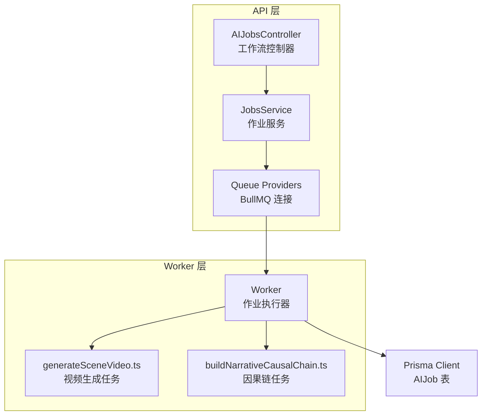
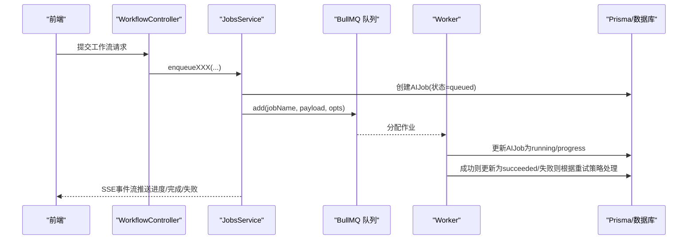
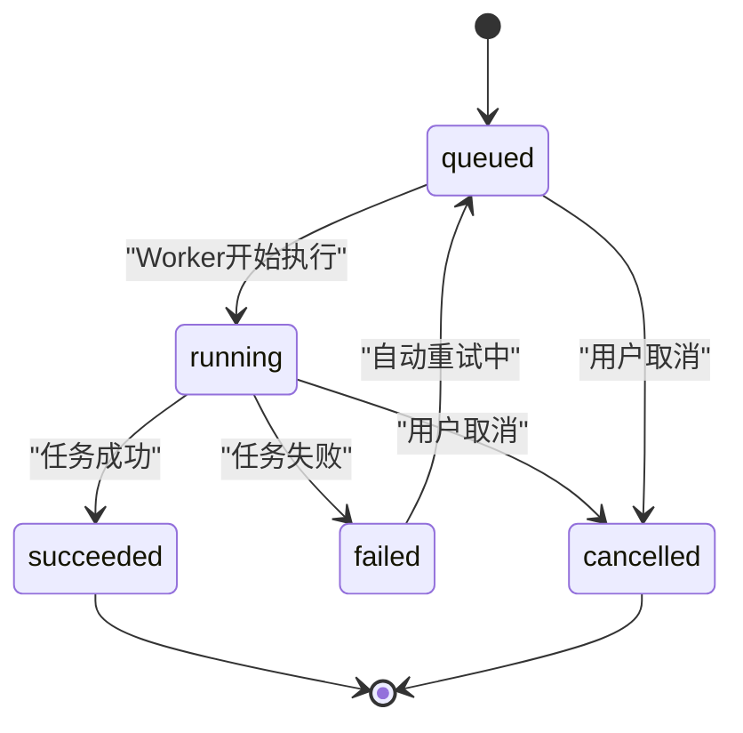
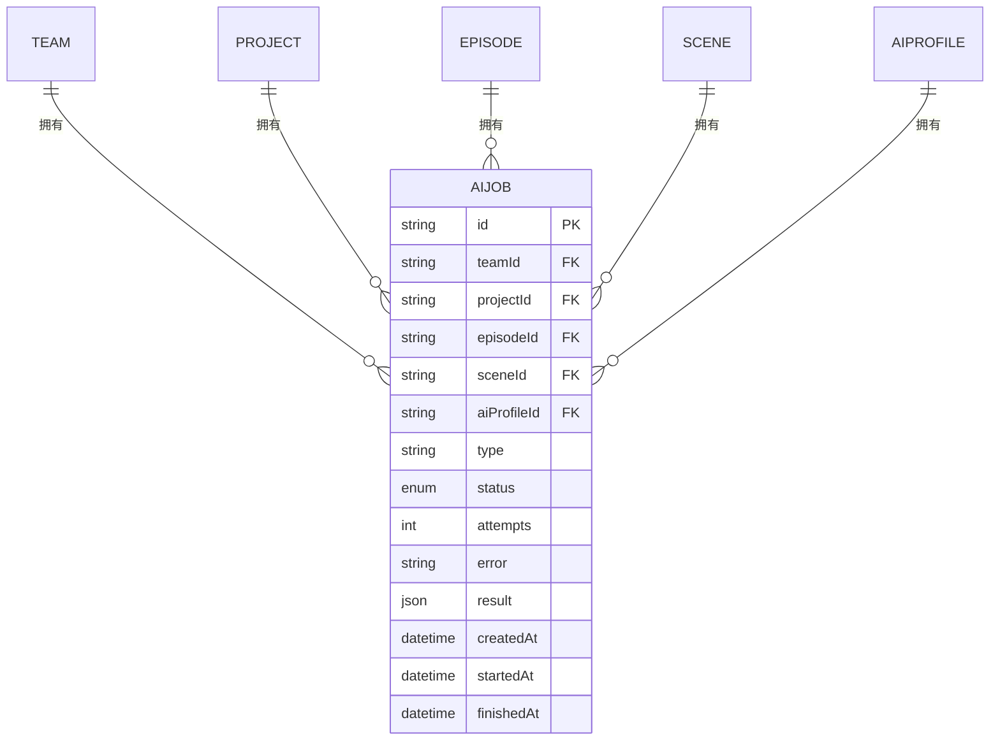
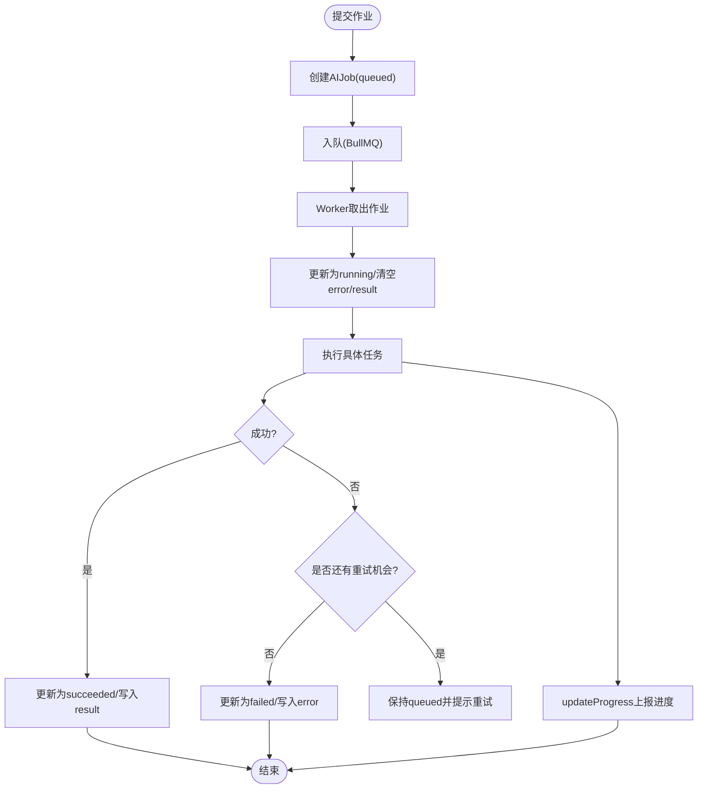
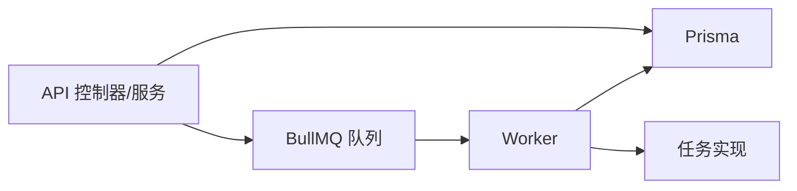

# AI作业实体 (AIJob)

<cite>
**本文引用的文件列表**
- [schema.prisma](file://apps/api/prisma/schema.prisma)
- [jobs.service.ts](file://apps/api/src/jobs/jobs.service.ts)
- [ai-jobs.controller.ts](file://apps/api/src/jobs/ai-jobs.controller.ts)
- [workflow.controller.ts](file://apps/api/src/jobs/workflow.controller.ts)
- [queue.providers.ts](file://apps/api/src/jobs/queue.providers.ts)
- [worker.ts](file://apps/worker/src/worker.ts)
- [generateSceneVideo.ts](file://apps/worker/src/tasks/generateSceneVideo.ts)
- [buildNarrativeCausalChain.ts](file://apps/worker/src/tasks/buildNarrativeCausalChain.ts)
</cite>

## 目录

1. [简介](#简介)
2. [项目结构与定位](#项目结构与定位)
3. [核心组件总览](#核心组件总览)
4. [架构概览](#架构概览)
5. [详细组件分析](#详细组件分析)
6. [依赖关系分析](#依赖关系分析)
7. [性能与可靠性考量](#性能与可靠性考量)
8. [故障排查指南](#故障排查指南)
9. [结论](#结论)

## 简介

本文件面向AI作业实体（AIJob）进行系统化技术文档梳理，涵盖字段设计目的、状态生命周期、与团队/项目/剧集/场景/AI配置档的多对一关联关系，以及在异步任务处理、进度追踪与错误重试中的作用。文档同时解释作业队列管理与状态同步机制，帮助开发者与产品/运营人员理解AI作业在系统中的职责边界与运行方式。

## 项目结构与定位

- 数据模型与关系定义位于 Prisma Schema 中，AIJob 是核心实体之一，承载作业的元数据、上下文与状态。
- API 层负责作业提交、查询、取消与事件推送，使用 BullMQ 作为队列基础设施。
- Worker 层负责具体作业执行，更新作业状态、进度与结果，处理重试与取消协作。

图表来源

- [ai-jobs.controller.ts](file://apps/api/src/jobs/ai-jobs.controller.ts#L15-L35)
- [workflow.controller.ts](file://apps/api/src/jobs/workflow.controller.ts#L45-L265)
- [jobs.service.ts](file://apps/api/src/jobs/jobs.service.ts#L37-L1054)
- [queue.providers.ts](file://apps/api/src/jobs/queue.providers.ts#L17-L35)
- [worker.ts](file://apps/worker/src/worker.ts#L50-L729)
- [generateSceneVideo.ts](file://apps/worker/src/tasks/generateSceneVideo.ts#L192-L311)
- [buildNarrativeCausalChain.ts](file://apps/worker/src/tasks/buildNarrativeCausalChain.ts#L782-L800)

章节来源

- [schema.prisma](file://apps/api/prisma/schema.prisma#L311-L335)
- [jobs.service.ts](file://apps/api/src/jobs/jobs.service.ts#L37-L1054)
- [ai-jobs.controller.ts](file://apps/api/src/jobs/ai-jobs.controller.ts#L15-L35)
- [workflow.controller.ts](file://apps/api/src/jobs/workflow.controller.ts#L45-L265)
- [queue.providers.ts](file://apps/api/src/jobs/queue.providers.ts#L17-L35)
- [worker.ts](file://apps/worker/src/worker.ts#L50-L729)

## 核心组件总览

- AIJob 实体：持久化作业元数据、上下文与状态，支持按团队维度聚合与索引。
- JobsService：作业提交、取消、查询与事件桥接，封装队列操作与数据库交互。
- AIJobsController：提供作业详情、取消与事件订阅接口。
- WorkflowController：面向工作流的批量作业提交入口，统一调度各类AI任务。
- Worker：消费队列作业，执行具体任务逻辑，更新进度与最终状态。
- Queue Providers：基于 Redis 的 BullMQ 队列连接与事件监听。

章节来源

- [schema.prisma](file://apps/api/prisma/schema.prisma#L311-L335)
- [jobs.service.ts](file://apps/api/src/jobs/jobs.service.ts#L37-L1054)
- [ai-jobs.controller.ts](file://apps/api/src/jobs/ai-jobs.controller.ts#L15-L35)
- [workflow.controller.ts](file://apps/api/src/jobs/workflow.controller.ts#L45-L265)
- [queue.providers.ts](file://apps/api/src/jobs/queue.providers.ts#L17-L35)
- [worker.ts](file://apps/worker/src/worker.ts#L50-L729)

## 架构概览

AI作业在系统中的运行路径：

- 工作流控制器接收业务请求，调用作业服务创建AIJob记录并入队。
- Worker 消费队列作业，将AIJob状态置为运行中，持续上报进度。
- 任务完成后更新AIJob为成功，失败时根据重试策略决定是否保留“正在重试”的状态提示。
- API 层提供SSE事件流，前端订阅作业事件以实时展示进度与结果。

图表来源

- [workflow.controller.ts](file://apps/api/src/jobs/workflow.controller.ts#L49-L264)
- [jobs.service.ts](file://apps/api/src/jobs/jobs.service.ts#L500-L700)
- [worker.ts](file://apps/worker/src/worker.ts#L91-L719)
- [ai-jobs.controller.ts](file://apps/api/src/jobs/ai-jobs.controller.ts#L33-L35)

## 详细组件分析

### 字段定义与设计目的

- id：主键，采用 cuid() 生成，保证全局唯一与可读性。
- teamId：外键，关联 Team，用于作业按团队隔离与权限控制。
- projectId/episodeId/sceneId：可选外键，分别关联 Project/Eposide/Scene，用于作业粒度与上下文绑定。
- aiProfileId：可选外键，关联 AIProfile，指定作业使用的AI提供商与参数。
- type：作业类型字符串，标识具体任务名称（如 generate_scene_video）。
- status：作业状态，取值来自 AIJobStatus 枚举，驱动UI与流程控制。
- attempts：已尝试次数，配合重试策略使用。
- error：失败原因文本，便于前端与日志定位问题。
- result：任务结果JSON，存储最终产出（如视频URL、对话内容等）。
- createdAt/startedAt/finishedAt：时间戳，用于统计与审计。

章节来源

- [schema.prisma](file://apps/api/prisma/schema.prisma#L311-L335)

### AI作业状态生命周期（AIJobStatus）

- queued：作业已入队，等待执行。
- running：Worker 正在执行，可上报进度。
- succeeded：任务成功完成，result 写入。
- failed：任务失败，error 写入；若启用重试，可能在前端显示“将自动重试”的提示。
- cancelled：用户主动取消，API 尝试从队列移除并标记完成时间。

图表来源

- [schema.prisma](file://apps/api/prisma/schema.prisma#L61-L67)
- [worker.ts](file://apps/worker/src/worker.ts#L674-L719)
- [jobs.service.ts](file://apps/api/src/jobs/jobs.service.ts#L1030-L1053)

章节来源

- [schema.prisma](file://apps/api/prisma/schema.prisma#L61-L67)
- [worker.ts](file://apps/worker/src/worker.ts#L674-L719)
- [jobs.service.ts](file://apps/api/src/jobs/jobs.service.ts#L1030-L1053)

### 与多实体的关联关系

- 与 Team：一对多，AIJob 通过 teamId 归属团队，用于权限与资源隔离。
- 与 Project/Eposide/Scene：多对一，AIJob 可携带上下文，便于作业与项目/剧集/场景强关联。
- 与 AIProfile：多对一，AIJob 使用特定配置档进行推理或生成。

图表来源

- [schema.prisma](file://apps/api/prisma/schema.prisma#L311-L335)

章节来源

- [schema.prisma](file://apps/api/prisma/schema.prisma#L311-L335)

### 作业队列管理与状态同步机制

- 提交流程：工作流控制器调用作业服务，先在数据库创建 AIJob（状态 queued），再向队列添加作业，设置 attempts/backoff、完成/失败清理策略。
- 执行流程：Worker 收到作业后，立即更新 AIJob 为 running 并清空 error/result，随后任务内部通过 updateProgress 上报进度；任务成功则写入 result 并标记 succeeded；失败则根据 attempts 判断是否自动重试或标记 failed。
- 取消流程：API 层尝试从队列移除作业，同时更新 AIJob 为 cancelled 并写入完成时间；Worker 在协作式取消下检测最新状态，若已取消则抛错并结束。
- 事件流：AIJobsController 提供 SSE 接口，前端订阅作业事件，实时获知 progress/completed/failed 等事件。

图表来源

- [jobs.service.ts](file://apps/api/src/jobs/jobs.service.ts#L500-L700)
- [worker.ts](file://apps/worker/src/worker.ts#L91-L719)
- [ai-jobs.controller.ts](file://apps/api/src/jobs/ai-jobs.controller.ts#L33-L35)

章节来源

- [jobs.service.ts](file://apps/api/src/jobs/jobs.service.ts#L500-L700)
- [worker.ts](file://apps/worker/src/worker.ts#L91-L719)
- [ai-jobs.controller.ts](file://apps/api/src/jobs/ai-jobs.controller.ts#L33-L35)

### 典型作业类型与执行要点

- generate_scene_video：基于场景描述与运动提示生成视频，支持超时与轮询，最终写回场景的 generatedVideos 字段。
- buildNarrativeCausalChain：分阶段构建叙事因果链，包含冲突引擎、信息层、节拍与剧情线，支持 JSON 修复与自洽校验。

章节来源

- [generateSceneVideo.ts](file://apps/worker/src/tasks/generateSceneVideo.ts#L192-L311)
- [buildNarrativeCausalChain.ts](file://apps/worker/src/tasks/buildNarrativeCausalChain.ts#L782-L800)

## 依赖关系分析

- API 层依赖 Prisma 与 BullMQ，通过 JobsService 统一编排作业生命周期。
- Worker 依赖 Prisma 与各任务模块，按作业类型分发执行。
- 队列连接由 Queue Providers 提供，支持自定义 REDIS_URL 与队列名。

图表来源

- [queue.providers.ts](file://apps/api/src/jobs/queue.providers.ts#L17-L35)
- [jobs.service.ts](file://apps/api/src/jobs/jobs.service.ts#L37-L1054)
- [worker.ts](file://apps/worker/src/worker.ts#L50-L729)

章节来源

- [queue.providers.ts](file://apps/api/src/jobs/queue.providers.ts#L17-L35)
- [jobs.service.ts](file://apps/api/src/jobs/jobs.service.ts#L37-L1054)
- [worker.ts](file://apps/worker/src/worker.ts#L50-L729)

## 性能与可靠性考量

- 队列重试与退避：作业入队时设置 attempts 与指数退避，避免瞬时失败导致雪崩。
- 进度上报与协作取消：Worker 在每次进度上报前检查最新状态，若已被取消则抛错终止，避免无效写入。
- 完成/失败清理：队列配置 removeOnComplete/removeOnFail 限制历史数据量，降低存储压力。
- 锁定与停滞检测：Worker 设置锁时长与停滞间隔，降低误判与资源占用。
- 前端体验：失败时保留 queued 状态并提示“将自动重试”，避免前端误以为作业已失败结束。

章节来源

- [jobs.service.ts](file://apps/api/src/jobs/jobs.service.ts#L500-L700)
- [worker.ts](file://apps/worker/src/worker.ts#L674-L719)

## 故障排查指南

- 作业长时间处于 queued：检查队列连接与队列名配置，确认 Redis 可达；查看队列事件监听是否正常。
- 作业卡在 running 且无进度：确认 Worker 是否存活，查看日志中 progress 输出；检查任务内部超时与轮询参数。
- 取消无效：确认 API 层是否成功从队列移除作业；Worker 是否在协作式取消下检测到最新状态。
- 失败重试过多：检查 attempts/backoff 配置与任务稳定性；必要时调整超时与轮询间隔。
- 结果未写入：确认任务是否在成功分支更新 AIJob 的 result 字段；检查 Worker 的状态更新逻辑。

章节来源

- [queue.providers.ts](file://apps/api/src/jobs/queue.providers.ts#L17-L35)
- [worker.ts](file://apps/worker/src/worker.ts#L74-L89)
- [jobs.service.ts](file://apps/api/src/jobs/jobs.service.ts#L1030-L1053)

## 结论

AIJob 作为系统异步作业的核心载体，通过明确的字段设计、严谨的状态机与完善的队列机制，实现了从提交、执行、进度追踪到失败重试与取消的全生命周期管理。其与团队/项目/剧集/场景/AI配置档的多对一关联，使得作业具备清晰的上下文与可审计性。结合 BullMQ 的可靠队列能力与 Worker 的协作式取消机制，系统在复杂AI生成任务中实现了高可用与良好的用户体验。
