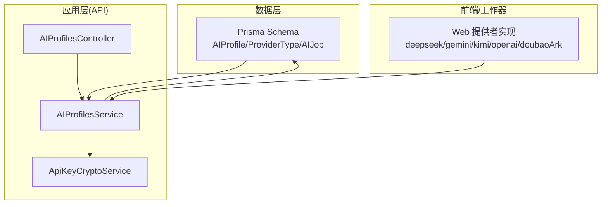
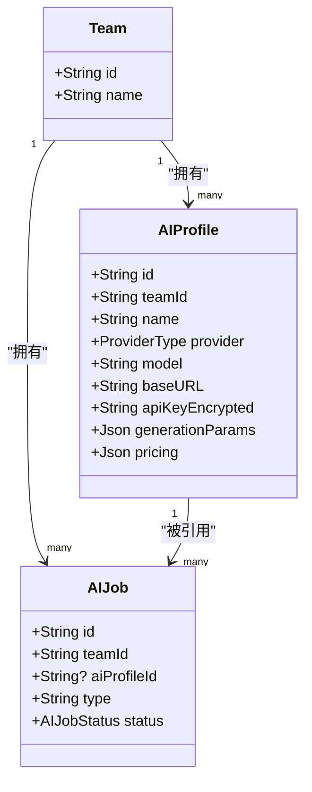
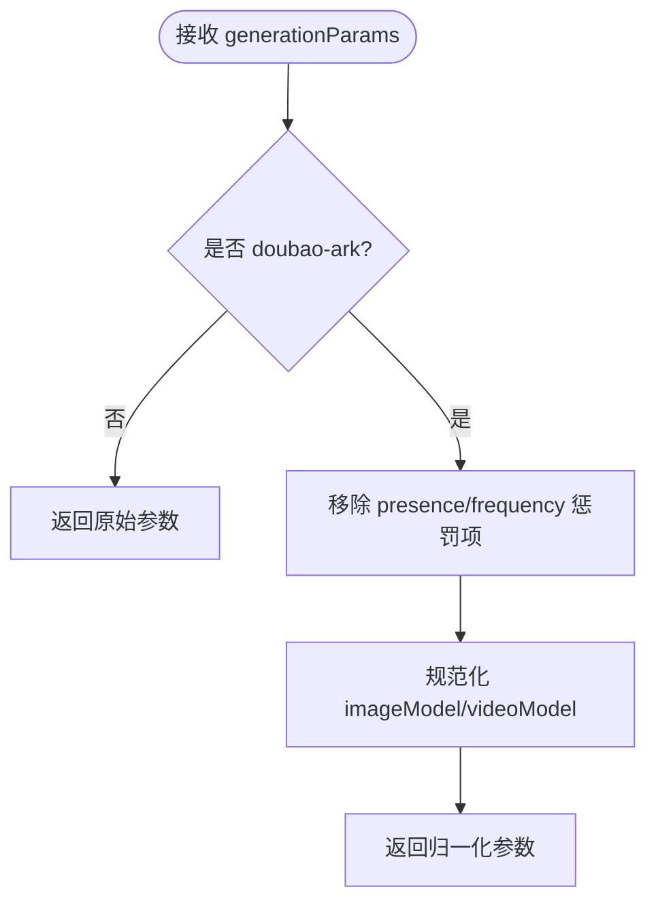
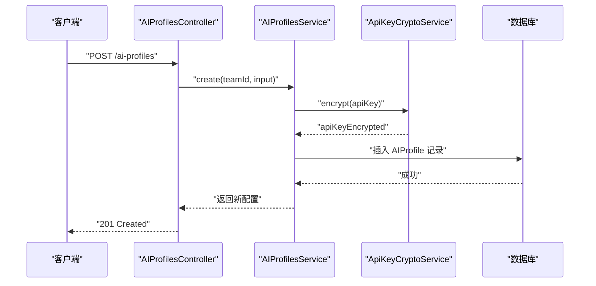
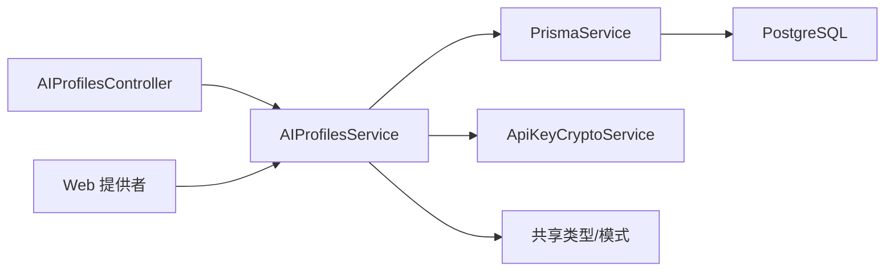

# AI配置实体 (AIProfile)

<cite>
**本文档引用的文件**
- [schema.prisma](file://apps/api/prisma/schema.prisma)
- [ai-profiles.controller.ts](file://apps/api/src/ai-profiles/ai-profiles.controller.ts)
- [ai-profiles.service.ts](file://apps/api/src/ai-profiles/ai-profiles.service.ts)
- [api-key-crypto.service.ts](file://apps/api/src/crypto/api-key-crypto.service.ts)
- [aiProfile.ts](file://packages/shared/src/schemas/aiProfile.ts)
- [types.ts](file://packages/shared/src/types.ts)
- [migration.sql（定价字段）](file://apps/api/prisma/migrations/20251214144332_ai_profile_pricing/migration.sql)
- [migration.sql（新增doubao_ark）](file://apps/api/prisma/migrations/20260121230000_add_doubao_ark_provider/migration.sql)
- [migration.sql（AIJob关联）](file://apps/api/prisma/migrations/001_ai_job_profile/migration.sql)
- [deepseek.ts](file://apps/web/src/lib/ai/providers/deepseek.ts)
- [gemini.ts](file://apps/web/src/lib/ai/providers/gemini.ts)
- [kimi.ts](file://apps/web/src/lib/ai/providers/kimi.ts)
- [openai.ts](file://apps/web/src/lib/ai/providers/openai.ts)
- [doubaoArk.ts](file://apps/web/src/lib/ai/providers/doubaoArk.ts)
</cite>

## 目录

1. [简介](#简介)
2. [项目结构](#项目结构)
3. [核心组件](#核心组件)
4. [架构总览](#架构总览)
5. [详细组件分析](#详细组件分析)
6. [依赖关系分析](#依赖关系分析)
7. [性能考量](#性能考量)
8. [故障排查指南](#故障排查指南)
9. [结论](#结论)
10. [附录](#附录)

## 简介

本文件系统化阐述 AI配置实体（AIProfile）的设计与实现，覆盖字段定义、多供应商支持策略、参数管理、安全存储机制、与团队（Team）及作业（AIJob）的关系，以及成本控制相关的能力边界。目标读者既包括后端/全栈工程师，也包括对技术细节感兴趣的非专业读者。

## 项目结构

AIProfile 相关代码横跨三层：

- 数据层（Prisma Schema）：定义表结构、索引、枚举与外键关系
- 应用层（NestJS 控制器/服务）：提供 CRUD 能力、输入校验、参数归一化与密钥加解密
- 前端/工作器（Web/Worker）：按 Provider 类型对接不同供应商的 API

图表来源

- [schema.prisma](file://apps/api/prisma/schema.prisma#L53-L59)
- [ai-profiles.controller.ts](file://apps/api/src/ai-profiles/ai-profiles.controller.ts#L10-L35)
- [ai-profiles.service.ts](file://apps/api/src/ai-profiles/ai-profiles.service.ts#L74-L201)
- [api-key-crypto.service.ts](file://apps/api/src/crypto/api-key-crypto.service.ts#L7-L36)
- [deepseek.ts](file://apps/web/src/lib/ai/providers/deepseek.ts#L4-L139)
- [gemini.ts](file://apps/web/src/lib/ai/providers/gemini.ts#L4-L171)
- [kimi.ts](file://apps/web/src/lib/ai/providers/kimi.ts#L6-L163)
- [openai.ts](file://apps/web/src/lib/ai/providers/openai.ts#L171-L383)
- [doubaoArk.ts](file://apps/web/src/lib/ai/providers/doubaoArk.ts#L103-L185)

章节来源

- [schema.prisma](file://apps/api/prisma/schema.prisma#L275-L292)
- [ai-profiles.controller.ts](file://apps/api/src/ai-profiles/ai-profiles.controller.ts#L1-L38)
- [ai-profiles.service.ts](file://apps/api/src/ai-profiles/ai-profiles.service.ts#L1-L202)
- [api-key-crypto.service.ts](file://apps/api/src/crypto/api-key-crypto.service.ts#L1-L39)

## 核心组件

- AIProfile 实体：存储团队级的 LLM/推理配置，含供应商类型、模型名、基础 URL、加密后的 API Key、生成参数与定价信息
- ProviderType 枚举：统一抽象 deepseek、kimi、gemini、openai-compatible、doubao-ark
- AIProfilesService：负责列表、创建、更新、删除；参数归一化、供应商映射、密钥加密
- ApiKeyCryptoService：基于 AES-256-GCM 的密钥加密/解密
- Web 提供者：按 Provider 类型封装不同供应商的请求格式与参数映射

章节来源

- [schema.prisma](file://apps/api/prisma/schema.prisma#L53-L59)
- [ai-profiles.service.ts](file://apps/api/src/ai-profiles/ai-profiles.service.ts#L56-L72)
- [api-key-crypto.service.ts](file://apps/api/src/crypto/api-key-crypto.service.ts#L17-L35)
- [types.ts](file://packages/shared/src/types.ts#L3-L4)

## 架构总览

AIProfile 在系统中的角色定位：

- 作为“配置模板”，被 AIJob 引用并执行具体任务
- 与 Team 绑定，确保配置的团队可见性与权限控制
- 通过加密存储 API Key，保障敏感信息安全
- 通过 generationParams 与 pricing 字段，实现参数与成本的精细化管理

图表来源

- [schema.prisma](file://apps/api/prisma/schema.prisma#L87-L100)
- [schema.prisma](file://apps/api/prisma/schema.prisma#L275-L292)
- [schema.prisma](file://apps/api/prisma/schema.prisma#L311-L335)

## 详细组件分析

### 字段定义与设计目的

- id：主键，采用 cuid() 生成，确保全局唯一性与安全性
- teamId：外键，绑定到 Team，实现配置的团队隔离
- name：配置名称，便于在界面中识别与选择
- provider：供应商类型枚举，统一抽象多供应商差异
- model：模型标识，不同供应商的模型名需符合其规范
- baseURL：可选的基础地址，用于兼容代理或自建网关
- apiKeyEncrypted：加密存储的 API Key，使用 AES-256-GCM
- generationParams：生成参数集合，包含温度、采样率、最大 token、惩罚项等
- pricing：定价信息，包含货币单位、每千令牌的输入/输出单价等
- createdAt/updatedAt：时间戳，用于排序与审计

章节来源

- [schema.prisma](file://apps/api/prisma/schema.prisma#L275-L292)
- [aiProfile.ts](file://packages/shared/src/schemas/aiProfile.ts#L6-L11)
- [ai-profiles.service.ts](file://apps/api/src/ai-profiles/ai-profiles.service.ts#L101-L132)

### ProviderType 枚举与多供应商支持

- 枚举值：deepseek、kimi、gemini、openai-compatible、doubao-ark
- 映射规则：前端/后端对枚举进行双向转换，确保数据库与业务层一致
- 特殊处理：
  - doubao-ark：模型名需提取接入点 ep- 前缀，移除空格
  - openai-compatible：根据模型自动选择 chat/completions 或 responses API，并做推理强度兼容
  - kimi：固定 baseURL，禁用用户自定义
  - gemini：消息格式转换、API Key 通过专用头传递

章节来源

- [schema.prisma](file://apps/api/prisma/schema.prisma#L53-L59)
- [types.ts](file://packages/shared/src/types.ts#L3-L4)
- [ai-profiles.service.ts](file://apps/api/src/ai-profiles/ai-profiles.service.ts#L56-L72)
- [ai-profiles.service.ts](file://apps/api/src/ai-profiles/ai-profiles.service.ts#L16-L29)
- [openai.ts](file://apps/web/src/lib/ai/providers/openai.ts#L51-L85)
- [openai.ts](file://apps/web/src/lib/ai/providers/openai.ts#L203-L308)
- [doubaoArk.ts](file://apps/web/src/lib/ai/providers/doubaoArk.ts#L37-L45)
- [kimi.ts](file://apps/web/src/lib/ai/providers/kimi.ts#L4-L163)
- [gemini.ts](file://apps/web/src/lib/ai/providers/gemini.ts#L19-L39)

### 参数管理与归一化

- generationParams 支持通用参数：temperature、topP、maxTokens、presencePenalty、frequencyPenalty、reasoningEffort、imageModel、videoModel
- Doubao/ARK 特例：移除不支持的惩罚项，对 imageModel/videoModel 进行 ep- 接入点规范化
- OpenAI 兼容：根据模型自动选择 responses 或 chat 接口，并做推理强度映射

图表来源

- [ai-profiles.service.ts](file://apps/api/src/ai-profiles/ai-profiles.service.ts#L31-L54)
- [ai-profiles.service.ts](file://apps/api/src/ai-profiles/ai-profiles.service.ts#L158-L166)

章节来源

- [aiProfile.ts](file://packages/shared/src/schemas/aiProfile.ts#L25-L38)
- [ai-profiles.service.ts](file://apps/api/src/ai-profiles/ai-profiles.service.ts#L31-L54)

### 安全机制：密钥加密存储

- 加密算法：AES-256-GCM，随机 IV，认证标签随密文一起存储
- 密钥来源：从环境变量读取，要求 32 字节 base64；否则回退为 SHA-256 派生
- 存储格式：iv.tag.ciphertext
- 使用场景：创建/更新时加密保存；对外仅展示脱敏后的摘要（由前端/后端决定）

图表来源

- [ai-profiles.controller.ts](file://apps/api/src/ai-profiles/ai-profiles.controller.ts#L19-L23)
- [ai-profiles.service.ts](file://apps/api/src/ai-profiles/ai-profiles.service.ts#L101-L132)
- [api-key-crypto.service.ts](file://apps/api/src/crypto/api-key-crypto.service.ts#L17-L35)

章节来源

- [api-key-crypto.service.ts](file://apps/api/src/crypto/api-key-crypto.service.ts#L1-L39)
- [ai-profiles.service.ts](file://apps/api/src/ai-profiles/ai-profiles.service.ts#L101-L132)

### 与 Team 和 AIJob 的关联关系

- 与 Team：一对多关系，通过 teamId 约束配置归属
- 与 AIJob：一对多关系，AIJob 可选择引用某个 AIProfile 执行任务；支持空引用（未绑定特定配置）
- 外键约束：AIJob.aiProfileId 外键指向 AIProfile.id，删除时置空，更新级联

章节来源

- [schema.prisma](file://apps/api/prisma/schema.prisma#L87-L100)
- [schema.prisma](file://apps/api/prisma/schema.prisma#L275-L292)
- [schema.prisma](file://apps/api/prisma/schema.prisma#L311-L335)
- [migration.sql（AIJob关联）](file://apps/api/prisma/migrations/001_ai_job_profile/migration.sql#L1-L8)

### 成本控制与定价字段

- pricing 结构：包含货币单位（USD）、每千令牌的输入/输出单价，以及可选的缓存输入单价
- 用途：用于估算与统计任务成本，结合实际 token 使用量计算费用
- 注意：前端/后端在消费侧应记录实际用量，以便与定价字段联动

章节来源

- [aiProfile.ts](file://packages/shared/src/schemas/aiProfile.ts#L6-L11)
- [migration.sql（定价字段）](file://apps/api/prisma/migrations/20251214144332_ai_profile_pricing/migration.sql#L1-L3)

### 供应商适配与参数差异

- DeepSeek：标准 chat/completions，支持温度、topP、maxTokens、惩罚项
- Gemini：消息转为 contents/parts 结构，使用 x-goog-api-key 头
- Kimi：固定 baseURL，思考类模型有默认温度与最大 token
- OpenAI 兼容：自动选择 responses 或 chat 接口，推理强度按模型映射
- Doubao/ARK：使用 responses 接口，模型名需规范化为 ep- 接入点或模型 ID

章节来源

- [deepseek.ts](file://apps/web/src/lib/ai/providers/deepseek.ts#L29-L72)
- [gemini.ts](file://apps/web/src/lib/ai/providers/gemini.ts#L58-L106)
- [kimi.ts](file://apps/web/src/lib/ai/providers/kimi.ts#L9-L73)
- [openai.ts](file://apps/web/src/lib/ai/providers/openai.ts#L197-L308)
- [doubaoArk.ts](file://apps/web/src/lib/ai/providers/doubaoArk.ts#L132-L174)

## 依赖关系分析

- 控制器依赖服务：负责鉴权、参数解析与路由转发
- 服务依赖 Prisma 与加密服务：负责数据持久化与密钥安全
- 前端/工作器依赖共享类型与服务：统一 Provider 类型与参数结构
- 数据库依赖迁移脚本：逐步演进 ProviderType 与表结构

图表来源

- [ai-profiles.controller.ts](file://apps/api/src/ai-profiles/ai-profiles.controller.ts#L1-L38)
- [ai-profiles.service.ts](file://apps/api/src/ai-profiles/ai-profiles.service.ts#L1-L202)
- [api-key-crypto.service.ts](file://apps/api/src/crypto/api-key-crypto.service.ts#L1-L39)
- [types.ts](file://packages/shared/src/types.ts#L1-L77)
- [schema.prisma](file://apps/api/prisma/schema.prisma#L1-L351)

章节来源

- [ai-profiles.controller.ts](file://apps/api/src/ai-profiles/ai-profiles.controller.ts#L1-L38)
- [ai-profiles.service.ts](file://apps/api/src/ai-profiles/ai-profiles.service.ts#L1-L202)
- [api-key-crypto.service.ts](file://apps/api/src/crypto/api-key-crypto.service.ts#L1-L39)
- [types.ts](file://packages/shared/src/types.ts#L1-L77)
- [schema.prisma](file://apps/api/prisma/schema.prisma#L1-L351)

## 性能考量

- 参数归一化与映射：在创建/更新时进行，避免运行期重复计算
- 加密开销：AES-256-GCM 为轻量加解密，单次操作毫秒级；建议批量导入/导出时注意吞吐
- 查询优化：按 teamId+updatedAt 降序查询，利于前端分页与最新排序
- 供应商接口：优先选择响应更快的接口（如 OpenAI 兼容的 responses），并在不兼容时回退

## 故障排查指南

- API Key 无效
  - 现象：创建/更新时报错，提示包含 Bearer 前缀或空值
  - 处理：移除前缀与多余空格，确保非空
  - 参考路径：[ai-profiles.service.ts](file://apps/api/src/ai-profiles/ai-profiles.service.ts#L11-L14)
- Doubao/ARK 模型名错误
  - 现象：推理失败或 401/403
  - 处理：确保模型名为 ep- 接入点或有效模型 ID，去除空格
  - 参考路径：[doubaoArk.ts](file://apps/web/src/lib/ai/providers/doubaoArk.ts#L37-L45)
- Kimi baseURL 冲突
  - 现象：用户自定义 baseURL 导致请求失败
  - 处理：kimi 场景下强制禁用 baseURL
  - 参考路径：[ai-profiles.service.ts](file://apps/api/src/ai-profiles/ai-profiles.service.ts#L157-L158)
- OpenAI 兼容接口不匹配
  - 现象：chat 接口报错，提示需要 responses
  - 处理：自动回退至 responses；或根据模型特性调整推理强度
  - 参考路径：[openai.ts](file://apps/web/src/lib/ai/providers/openai.ts#L289-L307)

章节来源

- [ai-profiles.service.ts](file://apps/api/src/ai-profiles/ai-profiles.service.ts#L11-L14)
- [doubaoArk.ts](file://apps/web/src/lib/ai/providers/doubaoArk.ts#L37-L45)
- [ai-profiles.service.ts](file://apps/api/src/ai-profiles/ai-profiles.service.ts#L157-L158)
- [openai.ts](file://apps/web/src/lib/ai/providers/openai.ts#L289-L307)

## 结论

AIProfile 通过标准化的字段、严格的参数归一化与安全的密钥存储，实现了多供应商统一接入与成本可控的配置管理。配合 Team 与 AIJob 的关系，可在团队维度灵活复用与追踪使用成本，满足从开发到生产的多样化需求。

## 附录

- 新增供应商支持流程
  - 在 ProviderType 枚举中添加新值
  - 在前端/工作器中实现对应 Provider 类型
  - 在服务层完善参数归一化与 baseURL 处理
  - 运行迁移脚本更新数据库
- 参考迁移
  - [新增 doubao_ark 枚举](file://apps/api/prisma/migrations/20260121230000_add_doubao_ark_provider/migration.sql#L1-L4)
  - [添加 pricing 字段](file://apps/api/prisma/migrations/20251214144332_ai_profile_pricing/migration.sql#L1-L3)
  - [AIJob 关联 AIProfile](file://apps/api/prisma/migrations/001_ai_job_profile/migration.sql#L1-L8)
