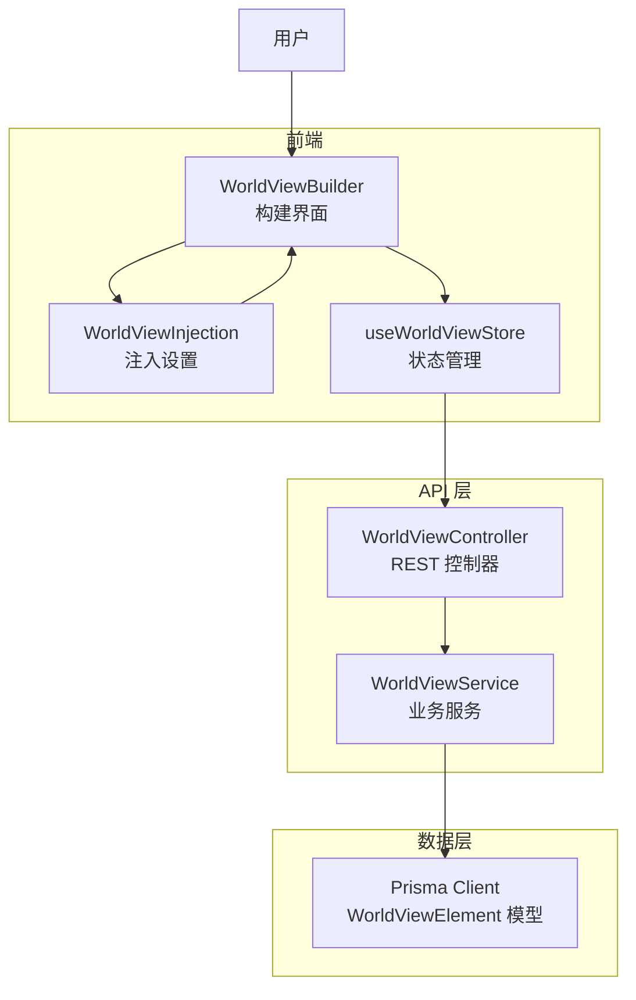
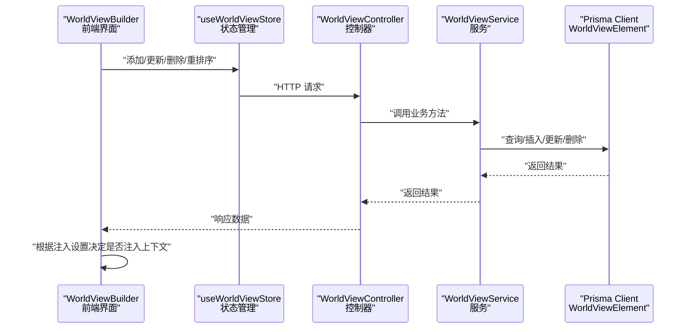
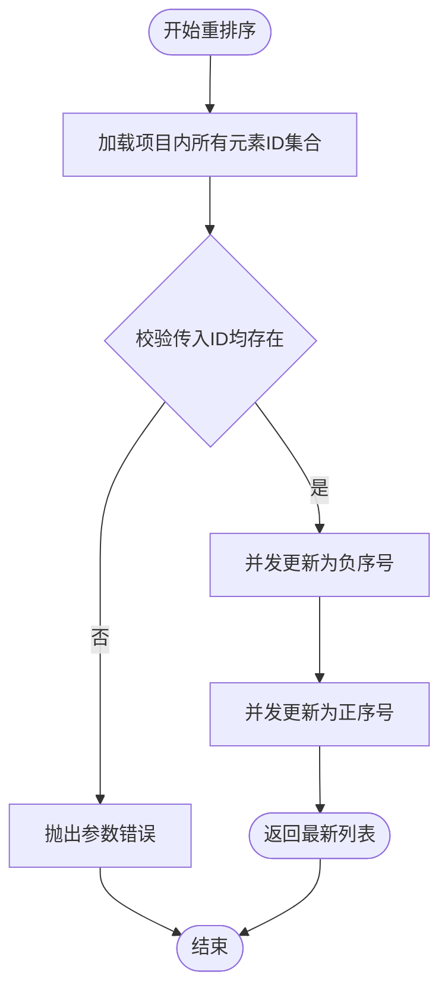
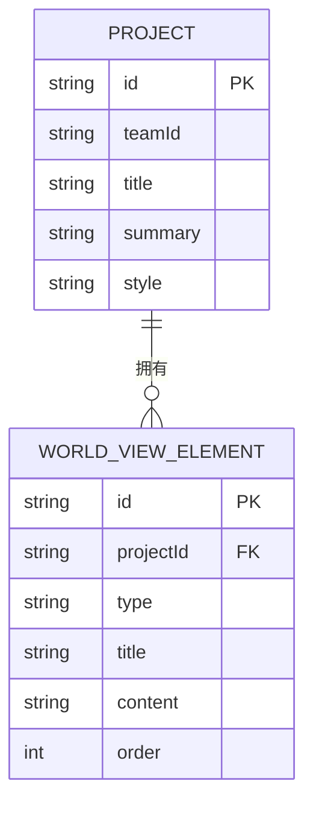
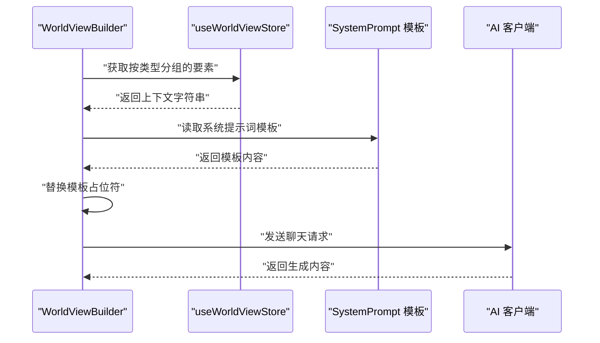
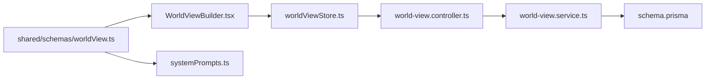

# 世界观实体 (WorldViewElement)

<cite>
**本文档引用的文件**
- [schema.prisma](file://apps/api/prisma/schema.prisma)
- [world-view.service.ts](file://apps/api/src/world-view/world-view.service.ts)
- [world-view.controller.ts](file://apps/api/src/world-view/world-view.controller.ts)
- [worldView.ts](file://packages/shared/src/schemas/worldView.ts)
- [WorldViewBuilder.tsx](file://apps/web/src/components/editor/WorldViewBuilder.tsx)
- [worldViewInjection.ts](file://apps/web/src/lib/ai/worldViewInjection.ts)
- [worldViewStore.ts](file://apps/web/src/stores/worldViewStore.ts)
- [systemPrompts.ts](file://packages/shared/src/systemPrompts.ts)
</cite>

## 目录

1. [简介](#简介)
2. [项目结构](#项目结构)
3. [核心组件](#核心组件)
4. [架构总览](#架构总览)
5. [详细组件分析](#详细组件分析)
6. [依赖关系分析](#依赖关系分析)
7. [性能考量](#性能考量)
8. [故障排除指南](#故障排除指南)
9. [结论](#结论)

## 简介

本文件围绕“世界观实体（WorldViewElement）”展开，系统阐述其字段设计、类型系统、排序机制、与项目（Project）的一对多关系，以及在叙事因果链构建与AI上下文注入中的应用。文档同时提供面向开发与非技术读者的渐进式理解路径，辅以可视化图表帮助把握数据流与控制流。

## 项目结构

- 数据模型定义位于 Prisma Schema 中，包含 WorldViewElement 的字段、索引与外键约束。
- API 层提供 CRUD 与重排序接口，服务层封装业务校验与事务处理。
- 前端提供世界构建界面、注入设置与上下文拼装工具，支撑 AI 生成与一致性维护。

**图表来源**

- [world-view.controller.ts](file://apps/api/src/world-view/world-view.controller.ts#L14-L55)
- [world-view.service.ts](file://apps/api/src/world-view/world-view.service.ts#L24-L127)
- [schema.prisma](file://apps/api/prisma/schema.prisma#L259-L273)
- [WorldViewBuilder.tsx](file://apps/web/src/components/editor/WorldViewBuilder.tsx#L40-L584)
- [worldViewInjection.ts](file://apps/web/src/lib/ai/worldViewInjection.ts#L14-L192)

**章节来源**

- [schema.prisma](file://apps/api/prisma/schema.prisma#L259-L273)
- [world-view.controller.ts](file://apps/api/src/world-view/world-view.controller.ts#L14-L55)
- [world-view.service.ts](file://apps/api/src/world-view/world-view.service.ts#L24-L127)

## 核心组件

- 数据模型（Prisma）
  - 主键：id（cuid()）
  - 外键：projectId（关联 Project）
  - 字段：type、title、content、order、createdAt、updatedAt
  - 约束：(projectId, order) 唯一键与索引
- API 控制器与服务
  - 列表、创建、更新、删除、重排序
  - 重排序采用两阶段更新避免唯一约束冲突
- 前端构建器与注入
  - 支持按类型筛选、分组展示、上下文拼装
  - 注入设置支持在不同阶段启用/关闭

**章节来源**

- [schema.prisma](file://apps/api/prisma/schema.prisma#L259-L273)
- [world-view.controller.ts](file://apps/api/src/world-view/world-view.controller.ts#L19-L54)
- [world-view.service.ts](file://apps/api/src/world-view/world-view.service.ts#L35-L126)
- [worldView.ts](file://packages/shared/src/schemas/worldView.ts#L3-L23)
- [WorldViewBuilder.tsx](file://apps/web/src/components/editor/WorldViewBuilder.tsx#L31-L38)
- [worldViewStore.ts](file://apps/web/src/stores/worldViewStore.ts#L162-L201)
- [worldViewInjection.ts](file://apps/web/src/lib/ai/worldViewInjection.ts#L14-L50)

## 架构总览

下图展示了从用户操作到数据持久化的端到端流程，以及前端注入设置如何影响后续生成阶段。

**图表来源**

- [WorldViewBuilder.tsx](file://apps/web/src/components/editor/WorldViewBuilder.tsx#L179-L232)
- [worldViewStore.ts](file://apps/web/src/stores/worldViewStore.ts#L79-L151)
- [world-view.controller.ts](file://apps/api/src/world-view/world-view.controller.ts#L19-L54)
- [world-view.service.ts](file://apps/api/src/world-view/world-view.service.ts#L35-L126)
- [schema.prisma](file://apps/api/prisma/schema.prisma#L259-L273)

## 详细组件分析

### 字段定义与设计目的

- id（主键）
  - 类型：String（@id @default(cuid())）
  - 设计目的：全局唯一标识，便于跨模块引用与日志追踪
- projectId（外键）
  - 类型：String
  - 设计目的：限定实体归属项目，实现多租户隔离与权限控制
- type（类型）
  - 类型：String（枚举：era/geography/society/technology/magic/custom）
  - 设计目的：统一分类，便于前端分组展示与后端策略分支
- title（标题）
  - 类型：String
  - 设计目的：人类可读的要素名称，作为检索与展示的首要字段
- content（内容）
  - 类型：String（@default("")）
  - 设计目的：要素详细描述，支持 AI 生成与上下文注入
- order（排序）
  - 类型：Int
  - 设计目的：在项目内维护稳定顺序，支持拖拽重排与一致性渲染
- createdAt/updatedAt
  - 类型：DateTime
  - 设计目的：审计与调试，便于追踪变更时间

**章节来源**

- [schema.prisma](file://apps/api/prisma/schema.prisma#L259-L267)
- [worldView.ts](file://packages/shared/src/schemas/worldView.ts#L3-L23)

### 类型系统与创作需求

- era（时代背景）
  - 用途：设定故事发生的年代特征（如工业革命、赛博朋克、封建王朝）
  - 创作价值：奠定整体风格与限制条件
- geography（地理设定）
  - 用途：世界地形、气候、地标、国家/区域划分
  - 创作价值：影响场景选择、交通与资源分布
- society（社会制度）
  - 用途：政治体制、阶级结构、法律、道德规范
  - 创作价值：驱动角色动机与冲突
- technology（科技水平）
  - 用途：技术水平、工具与武器、能源与交通
  - 创作价值：决定可实现性与视觉呈现
- magic（魔法体系）
  - 用途：法术规则、施法代价、禁忌与平衡
  - 创作价值：提供超自然变量与不确定性
- custom（自定义）
  - 用途：未归类或特殊设定
  - 创作价值：灵活扩展与临时占位

上述类型在前端构建器中以图标与标签直观呈现，便于快速选择与批量筛选。

**章节来源**

- [WorldViewBuilder.tsx](file://apps/web/src/components/editor/WorldViewBuilder.tsx#L31-L38)
- [worldView.ts](file://packages/shared/src/schemas/worldView.ts#L3-L4)

### 排序机制与重排序算法

- 排序依据
  - 服务端查询按 order 升序、updatedAt 降序排列，确保稳定展示
- 重排序策略
  - 两阶段更新：先将待重排元素的 order 负值临时占位，再统一更新为新顺序
  - 使用事务保证原子性，避免唯一约束冲突与中间态异常

**图表来源**

- [world-view.service.ts](file://apps/api/src/world-view/world-view.service.ts#L92-L126)

**章节来源**

- [world-view.service.ts](file://apps/api/src/world-view/world-view.service.ts#L39-L41)
- [world-view.service.ts](file://apps/api/src/world-view/world-view.service.ts#L92-L126)

### 与 Project 的一对多关系

- 外键约束：WorldViewElement.projectId -> Project.id（Cascade 删除）
- 约束与索引：(projectId, order) 唯一键与索引，保障顺序唯一性与查询效率
- 业务含义：一个项目可拥有多个世界观要素，要素随项目生命周期存在

**图表来源**

- [schema.prisma](file://apps/api/prisma/schema.prisma#L116-L141)
- [schema.prisma](file://apps/api/prisma/schema.prisma#L259-L273)

**章节来源**

- [schema.prisma](file://apps/api/prisma/schema.prisma#L137-L137)
- [schema.prisma](file://apps/api/prisma/schema.prisma#L269-L269)

### 在叙事因果链构建中的作用

- 世界设定作为“全局上下文”参与因果链各阶段的生成与校验
- 通过 Project.contextCache 存储因果链，版本服务支持快照与恢复
- 世界要素变更可能触发分镜状态标记为“需更新”，确保一致性

**章节来源**

- [narrative-causal-chain-versions.service.ts](file://apps/api/src/projects/narrative-causal-chain-versions.service.ts#L174-L205)
- [narrative-causal-chain-versions.service.ts](file://apps/api/src/projects/narrative-causal-chain-versions.service.ts#L207-L253)
- [WorldViewBuilder.tsx](file://apps/web/src/components/editor/WorldViewBuilder.tsx#L84-L106)

### AI 上下文注入与故事背景构建

- 注入时机
  - 分镜列表生成时注入
  - 场景锚点生成时注入
  - 角色设定生成时注入
- 注入方式
  - 前端将按类型分组的世界观要素拼装为上下文字符串
  - 系统提示词模板中预留占位，运行时替换
- 设置持久化
  - 使用 localStorage 保存项目级注入设置，支持默认值合并

**图表来源**

- [worldViewStore.ts](file://apps/web/src/stores/worldViewStore.ts#L174-L201)
- [WorldViewBuilder.tsx](file://apps/web/src/components/editor/WorldViewBuilder.tsx#L127-L177)
- [systemPrompts.ts](file://packages/shared/src/systemPrompts.ts#L109-L124)
- [worldViewInjection.ts](file://apps/web/src/lib/ai/worldViewInjection.ts#L108-L126)

**章节来源**

- [worldViewStore.ts](file://apps/web/src/stores/worldViewStore.ts#L174-L201)
- [WorldViewBuilder.tsx](file://apps/web/src/components/editor/WorldViewBuilder.tsx#L127-L177)
- [worldViewInjection.ts](file://apps/web/src/lib/ai/worldViewInjection.ts#L14-L50)

## 依赖关系分析

- 控制器依赖服务，服务依赖 Prisma 客户端
- 前端构建器依赖状态管理、API 与注入设置模块
- 类型定义在共享包中统一，前后端共同遵循

**图表来源**

- [worldView.ts](file://packages/shared/src/schemas/worldView.ts#L3-L23)
- [WorldViewBuilder.tsx](file://apps/web/src/components/editor/WorldViewBuilder.tsx#L40-L584)
- [systemPrompts.ts](file://packages/shared/src/systemPrompts.ts#L109-L124)
- [worldViewStore.ts](file://apps/web/src/stores/worldViewStore.ts#L1-L211)
- [world-view.controller.ts](file://apps/api/src/world-view/world-view.controller.ts#L14-L55)
- [world-view.service.ts](file://apps/api/src/world-view/world-view.service.ts#L24-L127)
- [schema.prisma](file://apps/api/prisma/schema.prisma#L259-L273)

**章节来源**

- [worldView.ts](file://packages/shared/src/schemas/worldView.ts#L3-L23)
- [worldViewStore.ts](file://apps/web/src/stores/worldViewStore.ts#L1-L48)
- [world-view.controller.ts](file://apps/api/src/world-view/world-view.controller.ts#L14-L55)
- [world-view.service.ts](file://apps/api/src/world-view/world-view.service.ts#L24-L127)

## 性能考量

- 查询排序：按 (projectId, order) 索引查询，时间复杂度 O(log n + k)
- 重排序：两阶段并发更新，避免唯一约束冲突，事务内完成
- 前端存储：本地模式下使用 localStorage，注意容量与序列化开销
- 注入上下文：按类型分组与拼装，避免重复计算

[本节为通用指导，无需特定文件引用]

## 故障排除指南

- 参数校验失败
  - 输入 schema 限制了 id、title、content、order 的长度与格式
- 项目不存在或无权限
  - 服务层在操作前校验项目归属，不存在抛出“未找到”
- 重排序参数非法
  - 传入的 elementIds 必须全部存在于项目内，否则抛出“参数错误”
- 事务冲突
  - 重排序采用两阶段更新，若仍出现冲突，检查并发重排频率

**章节来源**

- [worldView.ts](file://packages/shared/src/schemas/worldView.ts#L6-L17)
- [world-view.service.ts](file://apps/api/src/world-view/world-view.service.ts#L27-L33)
- [world-view.service.ts](file://apps/api/src/world-view/world-view.service.ts#L92-L102)

## 结论

WorldViewElement 通过严谨的字段设计、类型系统与排序机制，为项目提供了可维护、可扩展的世界观基座。配合 API 的幂等操作与前端的注入设置，实现了从设定到生成的一致性闭环。在叙事因果链构建中，世界要素既是输入也是约束，直接影响生成质量与自洽性。建议在团队协作中统一类型命名与描述规范，定期校验注入设置，确保生成链路稳定可控。
