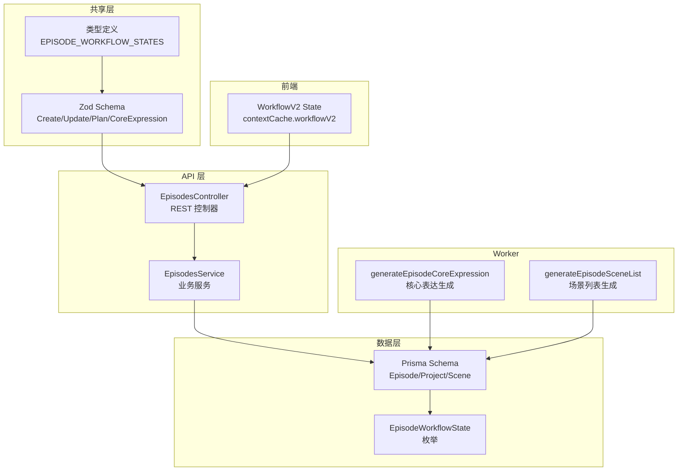
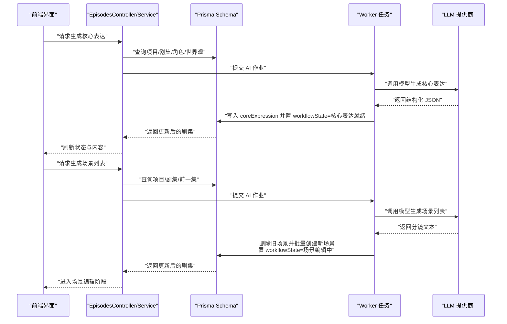
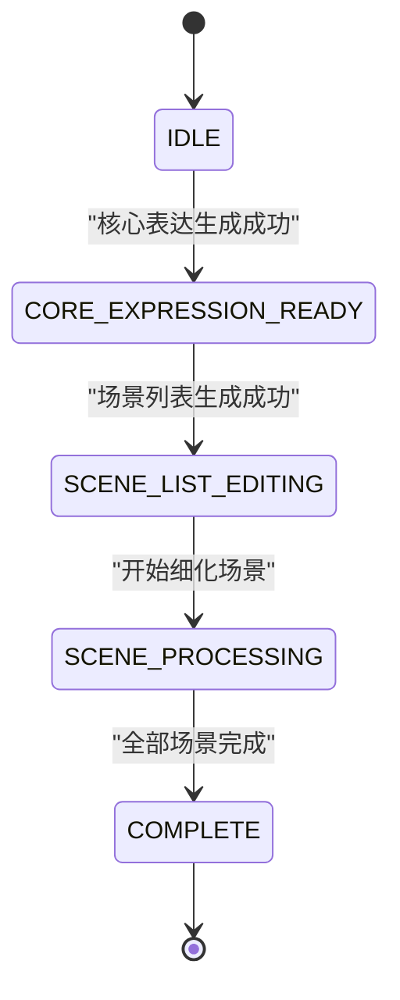
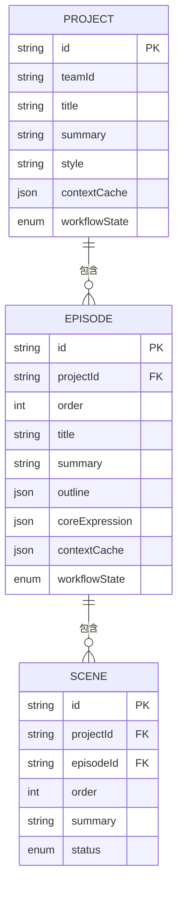
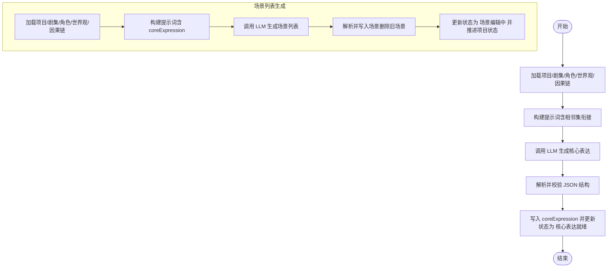
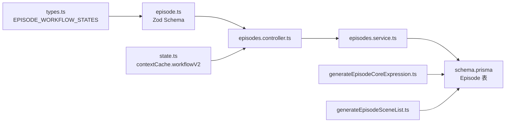

# 剧集实体 (Episode)

<cite>
**本文引用的文件**
- [schema.prisma](file://apps/api/prisma/schema.prisma)
- [episode.ts](file://packages/shared/src/schemas/episode.ts)
- [types.ts](file://packages/shared/src/types.ts)
- [episodes.service.ts](file://apps/api/src/episodes/episodes.service.ts)
- [episodes.controller.ts](file://apps/api/src/episodes/episodes.controller.ts)
- [state.ts](file://apps/web/src/lib/workflowV2/state.ts)
- [generateEpisodeCoreExpression.ts](file://apps/worker/src/tasks/generateEpisodeCoreExpression.ts)
- [generateEpisodeSceneList.ts](file://apps/worker/src/tasks/generateEpisodeSceneList.ts)
- [projects.service.ts](file://apps/api/src/projects/projects.service.ts)
- [scenes.service.ts](file://apps/api/src/scenes/scenes.service.ts)
- [migration.sql](file://apps/api/prisma/migrations/20251215203000_add_episode_planning/migration.sql)
- [episode-planning-workflow.md](file://docs/prd/episode-planning-workflow.md)
</cite>

## 目录

1. [简介](#简介)
2. [项目结构](#项目结构)
3. [核心组件](#核心组件)
4. [架构总览](#架构总览)
5. [详细组件分析](#详细组件分析)
6. [依赖关系分析](#依赖关系分析)
7. [性能考量](#性能考量)
8. [故障排查指南](#故障排查指南)
9. [结论](#结论)

## 简介

本文件系统化阐述剧集实体（Episode）的字段定义、工作流状态（EpisodeWorkflowState）设计、与项目（Project）和场景（Scene）的关系，以及在分集创作中的作用：核心表达生成、场景列表编辑与处理流程的状态管理。文档同时给出代码级架构图与序列图，帮助开发者与产品/运营人员理解端到端实现。

## 项目结构

围绕剧集实体的关键代码分布在以下模块：

- 数据模型与枚举：Prisma schema 定义了 Episode 表、EpisodeWorkflowState 枚举及与 Project/Scene 的关系
- 输入校验与类型：共享包中的 Zod schema 和类型定义
- 后端服务：EpisodesController/EpisodesService 提供 CRUD 与业务约束
- 工作流状态：Web 端通过 contextCache.workflowV2 管理剧集工作流状态
- 任务执行：Worker 中的任务负责核心表达生成与场景列表生成，并推进状态
- 项目与场景：ProjectsService/ScenesService 提供项目生命周期与场景管理能力

图表来源

- [episodes.controller.ts](file://apps/api/src/episodes/episodes.controller.ts#L1-L55)
- [episodes.service.ts](file://apps/api/src/episodes/episodes.service.ts#L1-L146)
- [schema.prisma](file://apps/api/prisma/schema.prisma#L176-L195)
- [episode.ts](file://packages/shared/src/schemas/episode.ts#L1-L80)
- [types.ts](file://packages/shared/src/types.ts#L25-L32)
- [state.ts](file://apps/web/src/lib/workflowV2/state.ts#L48-L74)
- [generateEpisodeCoreExpression.ts](file://apps/worker/src/tasks/generateEpisodeCoreExpression.ts#L407-L413)
- [generateEpisodeSceneList.ts](file://apps/worker/src/tasks/generateEpisodeSceneList.ts#L303-L316)

章节来源

- [episodes.controller.ts](file://apps/api/src/episodes/episodes.controller.ts#L1-L55)
- [episodes.service.ts](file://apps/api/src/episodes/episodes.service.ts#L1-L146)
- [schema.prisma](file://apps/api/prisma/schema.prisma#L176-L195)
- [episode.ts](file://packages/shared/src/schemas/episode.ts#L1-L80)
- [types.ts](file://packages/shared/src/types.ts#L25-L32)
- [state.ts](file://apps/web/src/lib/workflowV2/state.ts#L48-L74)
- [generateEpisodeCoreExpression.ts](file://apps/worker/src/tasks/generateEpisodeCoreExpression.ts#L407-L413)
- [generateEpisodeSceneList.ts](file://apps/worker/src/tasks/generateEpisodeSceneList.ts#L303-L316)

## 核心组件

- 剧集实体（Episode）
  - 字段：id（主键，cuid()）、projectId（外键）、order（集序，唯一索引）、title、summary、outline、coreExpression、contextCache、workflowState（默认 IDLE）
  - 关系：属于一个 Project；包含多个 Scene；由 AIJob 关联
- 剧集工作流状态（EpisodeWorkflowState）
  - 枚举：IDLE、CORE_EXPRESSION_READY、SCENE_LIST_EDITING、SCENE_PROCESSING、COMPLETE
- 输入校验与类型
  - CreateEpisodeInputSchema/UpdateEpisodeInputSchema
  - CoreExpressionSchema
  - EPISODE_WORKFLOW_STATES

章节来源

- [schema.prisma](file://apps/api/prisma/schema.prisma#L176-L195)
- [episode.ts](file://packages/shared/src/schemas/episode.ts#L6-L26)
- [episode.ts](file://packages/shared/src/schemas/episode.ts#L68-L76)
- [types.ts](file://packages/shared/src/types.ts#L25-L32)

## 架构总览

下图展示从 Web 端到 API、Prisma、Worker 的端到端流程，重点体现剧集核心表达生成与场景列表生成如何推进 Episode 工作流状态。

图表来源

- [episodes.controller.ts](file://apps/api/src/episodes/episodes.controller.ts#L19-L23)
- [episodes.service.ts](file://apps/api/src/episodes/episodes.service.ts#L57-L80)
- [generateEpisodeCoreExpression.ts](file://apps/worker/src/tasks/generateEpisodeCoreExpression.ts#L254-L425)
- [generateEpisodeSceneList.ts](file://apps/worker/src/tasks/generateEpisodeSceneList.ts#L184-L326)
- [schema.prisma](file://apps/api/prisma/schema.prisma#L176-L195)

## 详细组件分析

### 剧集实体字段定义与设计目的

- id（主键，cuid()）
  - 设计目的：保证全局唯一标识，便于跨服务引用与幂等操作
- projectId（外键）
  - 设计目的：限定剧集归属项目，确保数据隔离与权限控制
- order（集序）
  - 设计目的：唯一索引约束，保证集序连续且不可重复；配合 Prisma 唯一键约束
- title/summary
  - 设计目的：基础元数据，支持 UI 展示与检索
- outline
  - 设计目的：可选的结构化大纲，作为生成核心表达与场景列表的输入
- coreExpression
  - 设计目的：结构化的核心表达（主题、情感弧、核心冲突、回报、视觉母题、结尾节拍、下一钩子等），用于指导分镜与风格一致性
- contextCache
  - 设计目的：缓存工作流相关的上下文（如 workflowV2），便于前端状态管理与增量更新
- workflowState
  - 设计目的：跟踪剧集创作阶段，驱动 UI 与工作流推进

章节来源

- [schema.prisma](file://apps/api/prisma/schema.prisma#L176-L195)
- [episode.ts](file://packages/shared/src/schemas/episode.ts#L6-L26)
- [episode.ts](file://packages/shared/src/schemas/episode.ts#L68-L76)
- [state.ts](file://apps/web/src/lib/workflowV2/state.ts#L48-L74)

### 剧集工作流状态（EpisodeWorkflowState）与创作流程

- 状态集合
  - IDLE：尚未开始
  - CORE_EXPRESSION_READY：核心表达已生成/确认
  - SCENE_LIST_EDITING：分镜列表可编辑
  - SCENE_PROCESSING：分镜细化中
  - COMPLETE：该集完成
- 推进路径
  - 生成核心表达：从 IDLE → CORE_EXPRESSION_READY
  - 生成场景列表：从 CORE_EXPRESSION_READY → SCENE_LIST_EDITING
  - 场景细化处理：从 SCENE_LIST_EDITING → SCENE_PROCESSING
  - 完成：从 SCENE_PROCESSING → COMPLETE

图表来源

- [types.ts](file://packages/shared/src/types.ts#L25-L32)
- [generateEpisodeCoreExpression.ts](file://apps/worker/src/tasks/generateEpisodeCoreExpression.ts#L411-L411)
- [generateEpisodeSceneList.ts](file://apps/worker/src/tasks/generateEpisodeSceneList.ts#L314-L315)

章节来源

- [types.ts](file://packages/shared/src/types.ts#L25-L32)
- [episode-planning-workflow.md](file://docs/prd/episode-planning-workflow.md#L344-L352)
- [generateEpisodeCoreExpression.ts](file://apps/worker/src/tasks/generateEpisodeCoreExpression.ts#L411-L411)
- [generateEpisodeSceneList.ts](file://apps/worker/src/tasks/generateEpisodeSceneList.ts#L314-L315)

### 剧集与项目、场景的关联关系

- 一对一：Episode → Project（通过 projectId 外键）
- 一对多：Episode → Scene（每个剧集包含多个场景）
- 约束与索引
  - Episode 表：唯一索引（projectId, order），索引（projectId, order）
  - Scene 表：唯一索引（episodeId, order），索引（episodeId, order）

图表来源

- [schema.prisma](file://apps/api/prisma/schema.prisma#L116-L141)
- [schema.prisma](file://apps/api/prisma/schema.prisma#L176-L195)
- [schema.prisma](file://apps/api/prisma/schema.prisma#L197-L233)

章节来源

- [schema.prisma](file://apps/api/prisma/schema.prisma#L116-L141)
- [schema.prisma](file://apps/api/prisma/schema.prisma#L176-L195)
- [schema.prisma](file://apps/api/prisma/schema.prisma#L197-L233)

### 核心表达生成与场景列表生成的处理流程

- 核心表达生成
  - 输入：项目概要、画风、角色、世界观、叙事因果链、相邻剧集信息、本集 outline
  - 输出：结构化核心表达（CoreExpressionSchema），并置 workflowState=核心表达就绪
- 场景列表生成
  - 输入：项目概要、画风、角色、世界观、叙事因果链、本集 coreExpression、相邻剧集分镜
  - 输出：分镜列表（按顺序写入 Scene），并置 workflowState=场景编辑中，同时推动项目状态为 EPISODE_CREATING

图表来源

- [generateEpisodeCoreExpression.ts](file://apps/worker/src/tasks/generateEpisodeCoreExpression.ts#L254-L425)
- [generateEpisodeSceneList.ts](file://apps/worker/src/tasks/generateEpisodeSceneList.ts#L184-L326)

章节来源

- [generateEpisodeCoreExpression.ts](file://apps/worker/src/tasks/generateEpisodeCoreExpression.ts#L254-L425)
- [generateEpisodeSceneList.ts](file://apps/worker/src/tasks/generateEpisodeSceneList.ts#L184-L326)

### 前端工作流状态管理（contextCache.workflowV2）

- Episode 级 workflowV2 包含 outline、storyboard、promptPack 三类制品状态
- 通过 buildEpisodeArtifactPatch 可以原子性地更新某类制品的状态（draft/review/locked），并写回 contextCache
- getEpisodeWorkflowV2 从 Episode.contextCache 中提取并归一化状态

章节来源

- [state.ts](file://apps/web/src/lib/workflowV2/state.ts#L48-L74)
- [state.ts](file://apps/web/src/lib/workflowV2/state.ts#L108-L138)

### API 层：控制器与服务

- EpisodesController
  - 提供列出、创建、获取、更新、删除剧集的 REST 接口
  - 使用 Zod 校验输入参数
- EpisodesService
  - 列表与获取：按 projectId 查询并排序
  - 创建：支持自定义 id；若 order 冲突抛出错误
  - 更新：部分字段可更新；workflowState 可变更
  - 删除：若剧集内存在正在处理的场景，拒绝删除

章节来源

- [episodes.controller.ts](file://apps/api/src/episodes/episodes.controller.ts#L1-L55)
- [episodes.service.ts](file://apps/api/src/episodes/episodes.service.ts#L39-L143)

### 项目与场景的补充能力

- ProjectsService
  - 创建项目时自动初始化第一条剧集（order=1，workflowState=IDLE）
  - 统计项目维度的剧集与场景完成度
- ScenesService
  - 默认剧集保障：若不存在 order=1 的剧集则自动创建
  - 支持按剧集查询场景列表、重排场景顺序、删除场景等

章节来源

- [projects.service.ts](file://apps/api/src/projects/projects.service.ts#L126-L134)
- [scenes.service.ts](file://apps/api/src/scenes/scenes.service.ts#L44-L67)
- [scenes.service.ts](file://apps/api/src/scenes/scenes.service.ts#L78-L84)

## 依赖关系分析

- EpisodeWorkflowState 枚举与 Prisma schema 对齐，确保数据库与应用层状态一致
- 共享包中的 Zod schema 与类型定义被 API 控制器与 Worker 任务共同使用，保证输入输出一致性
- Worker 任务直接写入数据库并推进状态，API 服务仅暴露受控接口，避免越权更新
- 前端通过 contextCache.workflowV2 管理本地状态，与后端状态形成互补

图表来源

- [types.ts](file://packages/shared/src/types.ts#L25-L32)
- [episode.ts](file://packages/shared/src/schemas/episode.ts#L1-L80)
- [episodes.controller.ts](file://apps/api/src/episodes/episodes.controller.ts#L1-L55)
- [episodes.service.ts](file://apps/api/src/episodes/episodes.service.ts#L1-L146)
- [schema.prisma](file://apps/api/prisma/schema.prisma#L176-L195)
- [generateEpisodeCoreExpression.ts](file://apps/worker/src/tasks/generateEpisodeCoreExpression.ts#L407-L413)
- [generateEpisodeSceneList.ts](file://apps/worker/src/tasks/generateEpisodeSceneList.ts#L303-L316)
- [state.ts](file://apps/web/src/lib/workflowV2/state.ts#L48-L74)

章节来源

- [types.ts](file://packages/shared/src/types.ts#L25-L32)
- [episode.ts](file://packages/shared/src/schemas/episode.ts#L1-L80)
- [episodes.controller.ts](file://apps/api/src/episodes/episodes.controller.ts#L1-L55)
- [episodes.service.ts](file://apps/api/src/episodes/episodes.service.ts#L1-L146)
- [schema.prisma](file://apps/api/prisma/schema.prisma#L176-L195)
- [generateEpisodeCoreExpression.ts](file://apps/worker/src/tasks/generateEpisodeCoreExpression.ts#L407-L413)
- [generateEpisodeSceneList.ts](file://apps/worker/src/tasks/generateEpisodeSceneList.ts#L303-L316)
- [state.ts](file://apps/web/src/lib/workflowV2/state.ts#L48-L74)

## 性能考量

- 数据库层面
  - Episode 的（projectId, order）唯一索引与索引可显著提升按项目查询与排序效率
  - 场景表的（episodeId, order）唯一索引保证场景顺序一致性与快速定位
- 任务执行层面
  - Worker 在生成核心表达与场景列表时采用事务批量写入，减少往返开销
  - 对提示词长度进行截断与摘要策略，避免超长输入导致的延迟与成本上升
- 前端状态管理
  - 通过 contextCache.workflowV2 原子更新制品状态，避免不必要的全量刷新

[本节为通用性能讨论，无需特定文件来源]

## 故障排查指南

- 创建剧集时报错“集序已存在”
  - 原因：同一项目下 order 冲突
  - 处理：调整 order 或删除重复项
- 删除剧集失败
  - 原因：剧集内存在正在处理的场景（AI 作业处于 queued/running）
  - 处理：取消相关作业后再删除
- 核心表达生成失败
  - 原因：LLM 输出不符合 JSON Schema 或解析失败
  - 处理：检查系统提示词、输入上下文是否过长、重试或修正提示词
- 场景列表生成失败
  - 原因：核心表达缺失、LLM 输出不足或解析异常
  - 处理：先确保核心表达就绪，再重试；必要时调整目标分镜数量

章节来源

- [episodes.service.ts](file://apps/api/src/episodes/episodes.service.ts#L74-L79)
- [episodes.service.ts](file://apps/api/src/episodes/episodes.service.ts#L124-L139)
- [generateEpisodeCoreExpression.ts](file://apps/worker/src/tasks/generateEpisodeCoreExpression.ts#L372-L399)
- [generateEpisodeSceneList.ts](file://apps/worker/src/tasks/generateEpisodeSceneList.ts#L298-L301)

## 结论

剧集实体（Episode）通过严谨的数据模型与工作流状态设计，支撑从核心表达生成到场景列表编辑与细化的全流程创作。API 层提供受控的 CRUD 能力，Worker 任务负责结构化生成与状态推进，前端通过 contextCache.workflowV2 实现本地状态管理。整体架构清晰、职责分离明确，具备良好的扩展性与可维护性。
