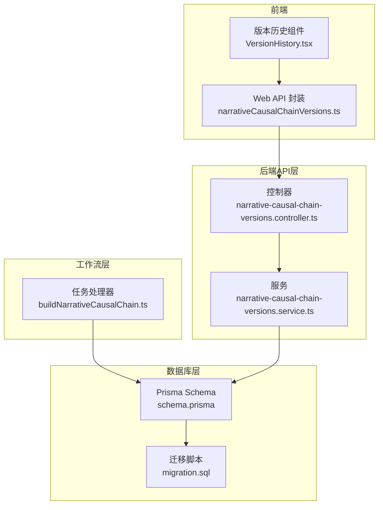
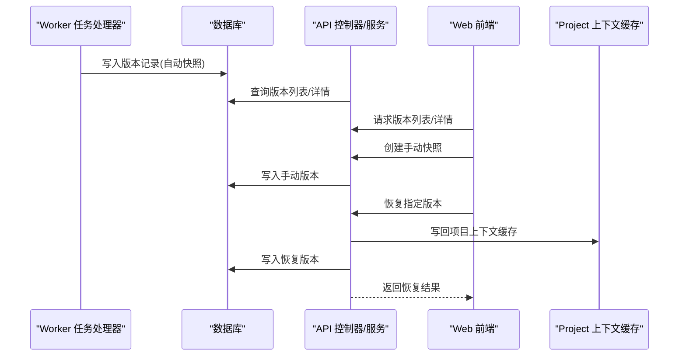
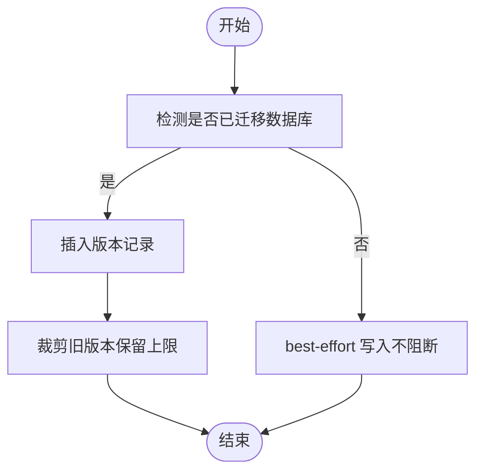
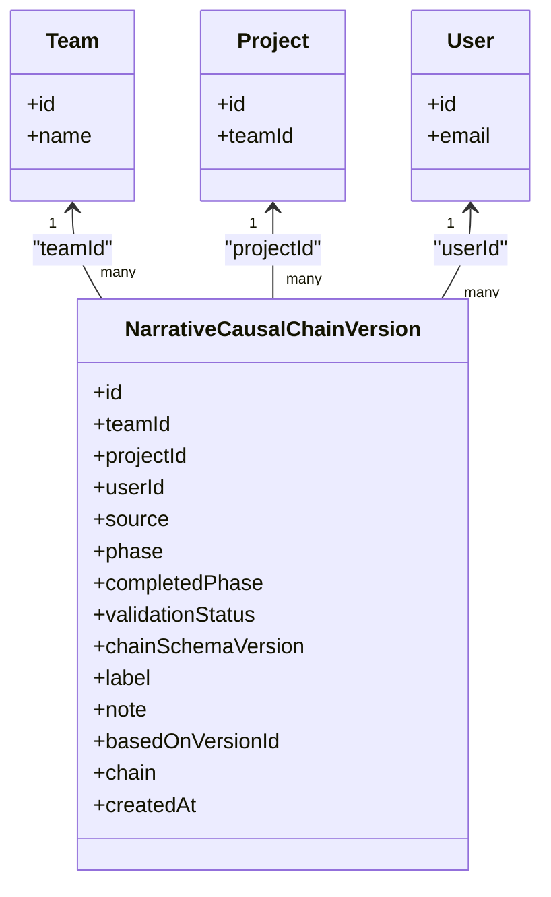

# 叙事因果链版本实体 (NarrativeCausalChainVersion)

<cite>
**本文引用的文件**
- [schema.prisma](file://apps/api/prisma/schema.prisma)
- [migration.sql](file://apps/api/prisma/migrations/20251217105000_add_causal_chain_versions/migration.sql)
- [narrativeCausalChain.ts](file://packages/shared/src/schemas/narrativeCausalChain.ts)
- [buildNarrativeCausalChain.ts](file://apps/worker/src/tasks/buildNarrativeCausalChain.ts)
- [narrativeCausalChainVersions.controller.ts](file://apps/api/src/projects/narrative-causal-chain-versions.controller.ts)
- [narrativeCausalChainVersions.service.ts](file://apps/api/src/projects/narrative-causal-chain-versions.service.ts)
- [narrativeCausalChainVersions.ts](file://apps/web/src/lib/api/narrativeCausalChainVersions.ts)
- [VersionHistory.tsx](file://apps/web/src/components/editor/VersionHistory.tsx)
</cite>

## 目录

1. [简介](#简介)
2. [项目结构](#项目结构)
3. [核心组件](#核心组件)
4. [架构总览](#架构总览)
5. [详细组件分析](#详细组件分析)
6. [依赖关系分析](#依赖关系分析)
7. [性能考量](#性能考量)
8. [故障排查指南](#故障排查指南)
9. [结论](#结论)

## 简介

本文档围绕“叙事因果链版本实体”(NarrativeCausalChainVersion)进行系统化技术说明，涵盖字段定义、来源枚举、与团队/项目/用户的关联关系、版本快照与恢复机制，以及在创作过程追踪、版本管理与回滚恢复中的作用。同时给出自动快照与手动保存的策略建议，帮助开发者与产品人员理解该实体在整体工作流中的定位与价值。

## 项目结构

与“叙事因果链版本实体”直接相关的核心文件分布于以下模块：

- 数据库与模式定义：Prisma schema 与迁移脚本
- 工作流与版本持久化：Worker 侧的任务处理与版本写入
- API 层：控制器与服务，提供版本列表、快照创建、版本获取与恢复
- 前端：API 封装与版本历史展示组件
- 共享模式：因果链 JSON Schema 与阶段定义

图表来源

- [schema.prisma](file://apps/api/prisma/schema.prisma#L143-L174)
- [migration.sql](file://apps/api/prisma/migrations/20251217105000_add_causal_chain_versions/migration.sql#L1-L37)
- [buildNarrativeCausalChain.ts](file://apps/worker/src/tasks/buildNarrativeCausalChain.ts#L290-L369)
- [narrativeCausalChainVersions.controller.ts](file://apps/api/src/projects/narrative-causal-chain-versions.controller.ts#L26-L81)
- [narrativeCausalChainVersions.service.ts](file://apps/api/src/projects/narrative-causal-chain-versions.service.ts#L54-L336)
- [narrativeCausalChainVersions.ts](file://apps/web/src/lib/api/narrativeCausalChainVersions.ts#L1-L57)
- [VersionHistory.tsx](file://apps/web/src/components/editor/VersionHistory.tsx#L39-L74)

章节来源

- [schema.prisma](file://apps/api/prisma/schema.prisma#L143-L174)
- [migration.sql](file://apps/api/prisma/migrations/20251217105000_add_causal_chain_versions/migration.sql#L1-L37)

## 核心组件

- 叙事因果链版本实体模型：定义了版本的标识、归属、来源、阶段、校验状态、Schema 版本、标签、备注、来源版本、完整因果链 JSON 等字段。
- 版本来源枚举：ai、manual、restore，分别对应 AI 自动生成、手动快照、从历史版本恢复。
- 工作流集成：Worker 在因果链各阶段完成后尝试写入版本记录，作为“自动快照”。
- API 层：提供版本列表查询、手动快照创建、版本详情获取、版本恢复（写回项目上下文并创建恢复版本）。
- 前端封装与展示：Web API 封装与版本历史面板，支持标签与备注、恢复操作。

章节来源

- [schema.prisma](file://apps/api/prisma/schema.prisma#L69-L73)
- [narrativeCausalChainVersions.service.ts](file://apps/api/src/projects/narrative-causal-chain-versions.service.ts#L6-L23)
- [buildNarrativeCausalChain.ts](file://apps/worker/src/tasks/buildNarrativeCausalChain.ts#L290-L369)
- [narrativeCausalChainVersions.controller.ts](file://apps/api/src/projects/narrative-causal-chain-versions.controller.ts#L26-L81)
- [narrativeCausalChainVersions.ts](file://apps/web/src/lib/api/narrativeCausalChainVersions.ts#L1-L57)
- [VersionHistory.tsx](file://apps/web/src/components/editor/VersionHistory.tsx#L39-L74)

## 架构总览

版本实体贯穿“工作流生成—自动快照—API 查询—前端展示—恢复回滚”的闭环。

图表来源

- [buildNarrativeCausalChain.ts](file://apps/worker/src/tasks/buildNarrativeCausalChain.ts#L290-L369)
- [narrativeCausalChainVersions.controller.ts](file://apps/api/src/projects/narrative-causal-chain-versions.controller.ts#L26-L81)
- [narrativeCausalChainVersions.service.ts](file://apps/api/src/projects/narrative-causal-chain-versions.service.ts#L118-L253)
- [narrativeCausalChainVersions.ts](file://apps/web/src/lib/api/narrativeCausalChainVersions.ts#L22-L56)

## 详细组件分析

### 字段定义与设计目的

- id：版本唯一标识，采用 cuid() 生成，保证全局唯一性与可读性。
- teamId：团队外键，用于多团队隔离与权限控制。
- projectId：项目外键，限定版本归属项目范围。
- userId：用户外键（可空），记录创建者（手动快照或恢复时可记录用户）。
- source：版本来源枚举，ai/manual/restore，决定版本的生成路径与语义。
- phase：触发该版本生成的阶段号（1-4），手动快照可为空。
- completedPhase：快照时的因果链完成阶段（0-4），用于快速判断版本所处进度。
- validationStatus：快照时的自洽校验状态，取值包括 pass/needs_revision/incomplete。
- chainSchemaVersion：因果链 Schema 版本号（如 2.0.0），用于数据演进与兼容。
- label：用户可读标签（可空），便于版本归档与检索。
- note：备注（可空），记录版本说明或变更摘要。
- basedOnVersionId：若为恢复/派生版本，指向来源版本 id（不做外键约束，便于软迁移）。
- chain：完整的叙事因果链 JSON，包含各阶段产物与元信息。
- createdAt：创建时间，默认当前时间戳。

章节来源

- [schema.prisma](file://apps/api/prisma/schema.prisma#L143-L174)
- [migration.sql](file://apps/api/prisma/migrations/20251217105000_add_causal_chain_versions/migration.sql#L5-L22)

### 版本来源枚举 (NarrativeCausalChainVersionSource)

- ai：由 AI 工作流在阶段完成后自动写入版本记录，作为“自动快照”。
- manual：由用户在界面点击“手动快照”，将当前项目上下文中的因果链写入版本记录。
- restore：从历史版本恢复后，将恢复结果写回项目上下文并创建一条“恢复版本”。

章节来源

- [schema.prisma](file://apps/api/prisma/schema.prisma#L69-L73)
- [narrativeCausalChainVersions.service.ts](file://apps/api/src/projects/narrative-causal-chain-versions.service.ts#L6-L6)
- [buildNarrativeCausalChain.ts](file://apps/worker/src/tasks/buildNarrativeCausalChain.ts#L290-L295)

### 与 Team、Project、User 的关联关系

- 与 Team：通过 teamId 外键关联，实现团队级隔离与审计。
- 与 Project：通过 projectId 外键关联，限定版本仅属于特定项目。
- 与 User：通过 userId 外键关联（可空），记录手动快照或恢复的创建者。

章节来源

- [schema.prisma](file://apps/api/prisma/schema.prisma#L167-L169)
- [migration.sql](file://apps/api/prisma/migrations/20251217105000_add_causal_chain_versions/migration.sql#L29-L37)

### 版本快照与恢复机制

- 自动快照（AI 驱动）：Worker 在因果链阶段完成后，尝试写入版本记录，作为“自动快照”。该过程为 best-effort，即使数据库未迁移也不会阻断主流程。
- 手动快照（用户驱动）：前端调用 API 创建快照，服务从项目上下文中提取因果链并写入版本记录。
- 恢复（回滚）：前端选择历史版本后，服务将该版本的因果链写回项目上下文，并创建一条“恢复版本”记录，便于追溯。

图表来源

- [narrativeCausalChainVersions.service.ts](file://apps/api/src/projects/narrative-causal-chain-versions.service.ts#L258-L335)
- [buildNarrativeCausalChain.ts](file://apps/worker/src/tasks/buildNarrativeCausalChain.ts#L290-L369)

章节来源

- [narrativeCausalChainVersions.controller.ts](file://apps/api/src/projects/narrative-causal-chain-versions.controller.ts#L43-L53)
- [narrativeCausalChainVersions.service.ts](file://apps/api/src/projects/narrative-causal-chain-versions.service.ts#L174-L205)
- [narrativeCausalChainVersions.controller.ts](file://apps/api/src/projects/narrative-causal-chain-versions.controller.ts#L64-L80)
- [narrativeCausalChainVersions.service.ts](file://apps/api/src/projects/narrative-causal-chain-versions.service.ts#L207-L253)

### 创作过程追踪、版本管理与回滚恢复

- 创作过程追踪：通过 completedPhase、validationStatus、chainSchemaVersion 等字段，可快速了解版本在工作流中的位置与质量状态。
- 版本管理：支持按项目/团队排序查看版本列表，支持为版本添加标签与备注，便于归档与检索。
- 回滚恢复：通过恢复接口将历史版本写回项目上下文，同时创建恢复版本记录，形成可追溯的回滚路径。

章节来源

- [narrativeCausalChainVersions.controller.ts](file://apps/api/src/projects/narrative-causal-chain-versions.controller.ts#L33-L41)
- [narrativeCausalChainVersions.service.ts](file://apps/api/src/projects/narrative-causal-chain-versions.service.ts#L65-L116)
- [VersionHistory.tsx](file://apps/web/src/components/editor/VersionHistory.tsx#L59-L74)

### 自动快照与手动保存策略

- 自动快照（推荐）：在因果链各阶段完成后由 Worker 写入版本记录，作为“自动快照”，无需用户干预，保证关键节点均有版本可追溯。
- 手动保存（补充）：在用户认为重要节点（如重大调整、评审通过）时，通过前端触发手动快照，添加标签与备注，提升可读性与可检索性。
- 恢复策略：当发现错误或需要回到某个历史状态时，通过恢复接口将目标版本写回项目上下文，并创建恢复版本记录，便于二次比对与继续迭代。

章节来源

- [buildNarrativeCausalChain.ts](file://apps/worker/src/tasks/buildNarrativeCausalChain.ts#L290-L369)
- [narrativeCausalChainVersions.controller.ts](file://apps/api/src/projects/narrative-causal-chain-versions.controller.ts#L43-L53)
- [narrativeCausalChainVersions.controller.ts](file://apps/api/src/projects/narrative-causal-chain-versions.controller.ts#L64-L80)

## 依赖关系分析

- 数据模型依赖：版本实体依赖 Team、Project、User 的关系，索引覆盖项目与团队维度的查询。
- 工作流依赖：Worker 任务处理器在阶段完成后尝试写入版本记录，依赖共享的因果链 Schema 与阶段定义。
- API 依赖：控制器与服务依赖 Prisma 数据访问层，提供版本列表、详情、创建与恢复能力。
- 前端依赖：Web API 封装与版本历史组件依赖后端接口，提供可视化版本管理体验。

图表来源

- [schema.prisma](file://apps/api/prisma/schema.prisma#L87-L100)
- [schema.prisma](file://apps/api/prisma/schema.prisma#L116-L141)
- [schema.prisma](file://apps/api/prisma/schema.prisma#L143-L174)

章节来源

- [schema.prisma](file://apps/api/prisma/schema.prisma#L87-L100)
- [schema.prisma](file://apps/api/prisma/schema.prisma#L116-L141)
- [schema.prisma](file://apps/api/prisma/schema.prisma#L143-L174)

## 性能考量

- 最大版本数量限制：每个项目最多保留固定数量的版本记录，超出部分按创建时间降序裁剪，避免无限增长导致查询与存储压力。
- 查询优化：针对项目与团队维度建立索引，支持按时间倒序快速检索最新版本。
- best-effort 写入：版本写入采用 best-effort 策略，即使数据库未迁移也不阻断主流程，保障工作流稳定性。

章节来源

- [narrativeCausalChainVersions.service.ts](file://apps/api/src/projects/narrative-causal-chain-versions.service.ts#L25-L25)
- [narrativeCausalChainVersions.service.ts](file://apps/api/src/projects/narrative-causal-chain-versions.service.ts#L305-L317)
- [schema.prisma](file://apps/api/prisma/schema.prisma#L171-L173)

## 故障排查指南

- 版本查询失败：若数据库未迁移，API 层会返回空列表或抛出异常，需检查迁移状态与连接配置。
- 版本写入失败：工作流侧的版本写入为 best-effort，若失败会记录警告日志，不影响主流程，可在迁移完成后重试。
- 恢复后上下文未更新：确认恢复接口成功写回项目上下文，并检查项目缓存字段是否包含因果链与更新时间戳。

章节来源

- [narrativeCausalChainVersions.service.ts](file://apps/api/src/projects/narrative-causal-chain-versions.service.ts#L111-L115)
- [narrativeCausalChainVersions.service.ts](file://apps/api/src/projects/narrative-causal-chain-versions.service.ts#L167-L171)
- [buildNarrativeCausalChain.ts](file://apps/worker/src/tasks/buildNarrativeCausalChain.ts#L361-L368)

## 结论

叙事因果链版本实体是贯穿创作工作流的关键基础设施，通过自动快照与手动保存策略，实现了对创作过程的完整追踪；通过恢复机制，提供了安全可控的回滚路径。配合团队/项目/用户维度的隔离与索引优化，版本系统在可用性与性能之间取得平衡，为复杂叙事创作提供了可靠的版本管理基础。
