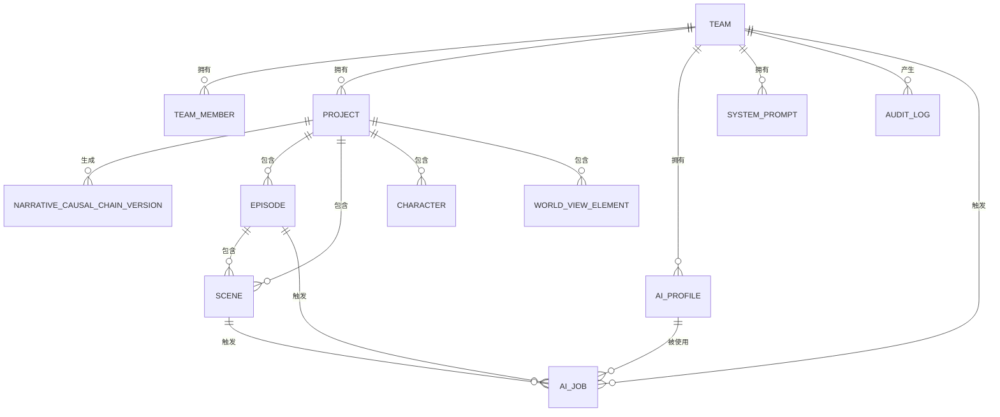
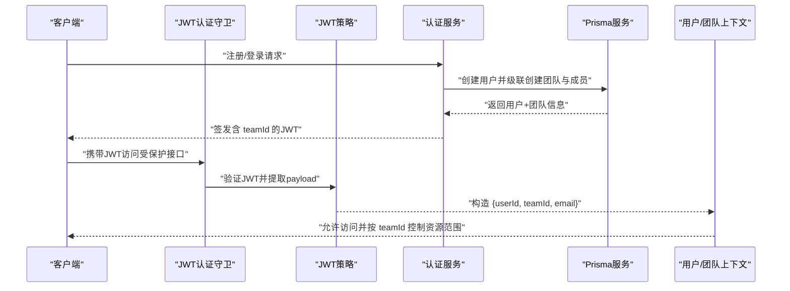
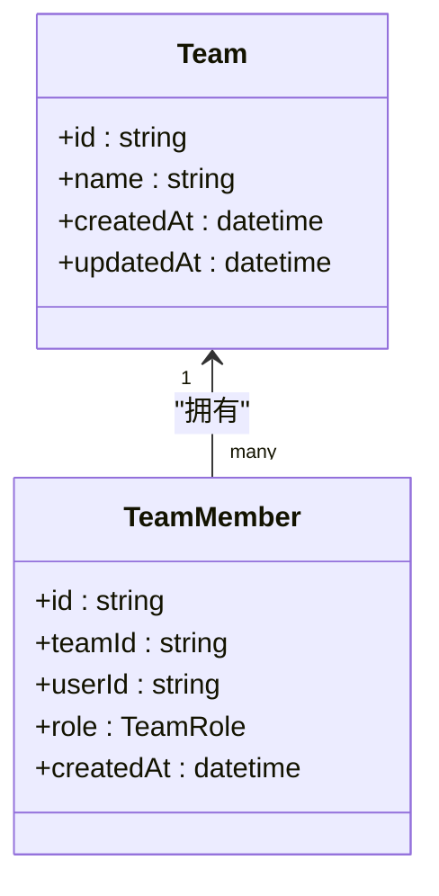
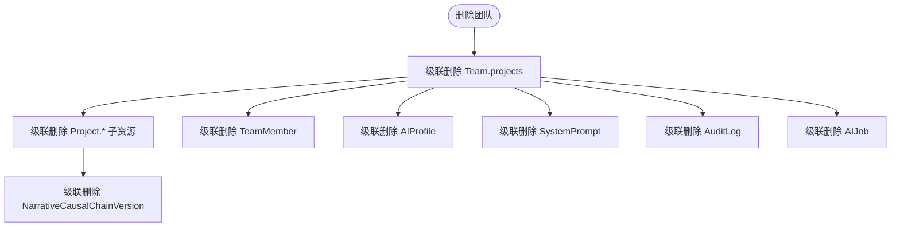
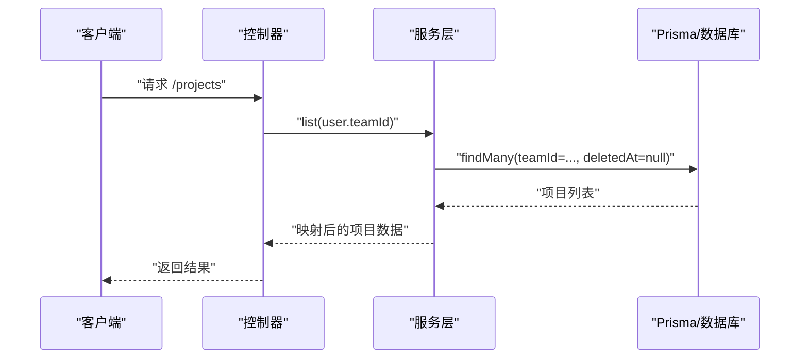
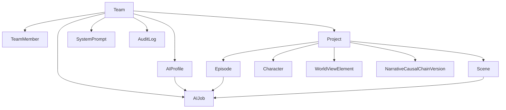

# 团队实体 (Team)

<cite>
**本文引用的文件**
- [schema.prisma](file://apps/api/prisma/schema.prisma)
- [auth.service.ts](file://apps/api/src/auth/auth.service.ts)
- [jwt.strategy.ts](file://apps/api/src/auth/jwt.strategy.ts)
- [jwt-auth.guard.ts](file://apps/api/src/auth/jwt-auth.guard.ts)
- [current-user.decorator.ts](file://apps/api/src/auth/current-user.decorator.ts)
- [projects.controller.ts](file://apps/api/src/projects/projects.controller.ts)
- [projects.service.ts](file://apps/api/src/projects/projects.service.ts)
- [ai-profiles.service.ts](file://apps/api/src/ai-profiles/ai-profiles.service.ts)
- [system-prompts.service.ts](file://apps/api/src/system-prompts/system-prompts.service.ts)
- [jobs.service.ts](file://apps/api/src/jobs/jobs.service.ts)
</cite>

## 目录

1. [简介](#简介)
2. [项目结构](#项目结构)
3. [核心组件](#核心组件)
4. [架构总览](#架构总览)
5. [详细组件分析](#详细组件分析)
6. [依赖分析](#依赖分析)
7. [性能考虑](#性能考虑)
8. [故障排查指南](#故障排查指南)
9. [结论](#结论)

## 简介

本文件围绕团队实体（Team）进行系统化技术文档梳理，覆盖字段定义、核心业务能力、与子实体的关系及级联删除策略，并结合多租户架构下的权限设计思路，帮助开发者与产品人员快速理解并正确使用团队模型。

## 项目结构

Team 实体位于后端 Prisma 模式中，作为多租户数据隔离的核心根实体，承载成员、项目、AI 配置、系统提示词、审计日志与 AI 作业等资源的归属关系。下图展示 Team 与其子实体的关联关系与级联删除策略概览。

图表来源

- [schema.prisma](file://apps/api/prisma/schema.prisma#L87-L100)
- [schema.prisma](file://apps/api/prisma/schema.prisma#L116-L141)
- [schema.prisma](file://apps/api/prisma/schema.prisma#L275-L292)
- [schema.prisma](file://apps/api/prisma/schema.prisma#L337-L350)
- [schema.prisma](file://apps/api/prisma/schema.prisma#L311-L335)

章节来源

- [schema.prisma](file://apps/api/prisma/schema.prisma#L87-L100)

## 核心组件

- 字段定义
  - id：主键，采用 cuid() 生成，确保全局唯一性与安全随机性
  - name：团队名称
  - createdAt / updatedAt：时间戳，分别记录创建与最后更新时间
- 关系与级联策略
  - Team 与 TeamMember：一对多，删除团队时级联删除成员
  - Team 与 Project：一对多，删除团队时级联删除项目
  - Team 与 AIProfile：一对多，删除团队时级联删除配置
  - Team 与 SystemPrompt：一对多，删除团队时级联删除提示词
  - Team 与 AuditLog：一对多，删除团队时级联删除审计日志
  - Team 与 AIJob：一对多，删除团队时级联删除作业
  - Project 与 NarrativeCausalChainVersion：一对多，删除项目时级联删除版本；删除团队时级联删除版本
  - Project 与 Episode/Scene/Character/WorldViewElement：一对多，删除项目时级联删除子资源
  - AIProfile 与 AIJob：一对多，删除配置时级联删除作业
  - Episode/Scene 与 AIJob：一对多，删除实体时将作业外键置空（SetNull）

章节来源

- [schema.prisma](file://apps/api/prisma/schema.prisma#L87-L100)
- [schema.prisma](file://apps/api/prisma/schema.prisma#L116-L141)
- [schema.prisma](file://apps/api/prisma/schema.prisma#L275-L292)
- [schema.prisma](file://apps/api/prisma/schema.prisma#L337-L350)
- [schema.prisma](file://apps/api/prisma/schema.prisma#L311-L335)

## 架构总览

Team 在系统中承担“租户根”的角色，所有业务资源均通过 teamId 归属到具体团队。认证流程中，JWT 中携带 teamId，控制器通过装饰器注入 AuthUser，服务层以 teamId 作为访问边界，确保跨资源操作的多租户隔离。

图表来源

- [auth.service.ts](file://apps/api/src/auth/auth.service.ts#L22-L56)
- [jwt.strategy.ts](file://apps/api/src/auth/jwt.strategy.ts#L24-L30)
- [jwt-auth.guard.ts](file://apps/api/src/auth/jwt-auth.guard.ts#L1-L8)
- [current-user.decorator.ts](file://apps/api/src/auth/current-user.decorator.ts#L4-L7)

章节来源

- [auth.service.ts](file://apps/api/src/auth/auth.service.ts#L22-L56)
- [jwt.strategy.ts](file://apps/api/src/auth/jwt.strategy.ts#L24-L30)
- [jwt-auth.guard.ts](file://apps/api/src/auth/jwt-auth.guard.ts#L1-L8)
- [current-user.decorator.ts](file://apps/api/src/auth/current-user.decorator.ts#L4-L7)

## 详细组件分析

### 字段与模型定义

- Team 基础字段
  - id：String，@id，@default(cuid())
  - name：String
  - createdAt / updatedAt：DateTime，@default(now())/@updatedAt
- 关系字段
  - members：TeamMember[]
  - projects：Project[]
  - aiProfiles：AIProfile[]
  - systemPrompts：SystemPrompt[]
  - auditLogs：AuditLog[]
  - jobs：AIJob[]
  - narrativeCausalChainVersions：NarrativeCausalChainVersion[]

章节来源

- [schema.prisma](file://apps/api/prisma/schema.prisma#L87-L100)

### 成员管理（TeamMember）

- 角色枚举：OWNER、ADMIN、MEMBER
- 约束与索引：唯一索引 (teamId, userId)，用户索引 (userId)
- 级联策略：删除团队或用户时级联删除成员记录

图表来源

- [schema.prisma](file://apps/api/prisma/schema.prisma#L102-L114)
- [schema.prisma](file://apps/api/prisma/schema.prisma#L87-L100)

章节来源

- [schema.prisma](file://apps/api/prisma/schema.prisma#L102-L114)

### 项目归属（Project）

- 项目属于团队，删除团队时级联删除项目
- 项目内进一步包含 Episode、Scene、Character、WorldViewElement 等子资源，删除项目时级联删除
- 项目与 NarrativeCausalChainVersion 之间存在版本历史，删除项目时级联删除版本

图表来源

- [schema.prisma](file://apps/api/prisma/schema.prisma#L116-L141)
- [schema.prisma](file://apps/api/prisma/schema.prisma#L143-L174)
- [schema.prisma](file://apps/api/prisma/schema.prisma#L87-L100)

章节来源

- [schema.prisma](file://apps/api/prisma/schema.prisma#L116-L141)
- [schema.prisma](file://apps/api/prisma/schema.prisma#L143-L174)

### AI 配置档案（AIProfile）

- 属于团队，删除团队时级联删除
- 与 AIJob 一对多，删除配置时级联删除作业
- 提供加密存储 API Key 的能力，保障敏感信息安全

章节来源

- [schema.prisma](file://apps/api/prisma/schema.prisma#L275-L292)
- [ai-profiles.service.ts](file://apps/api/src/ai-profiles/ai-profiles.service.ts#L101-L132)

### 系统提示词（SystemPrompt）

- 属于团队，唯一键 (teamId, key)
- 首次访问时自动补齐默认值，避免重复初始化成本

章节来源

- [schema.prisma](file://apps/api/prisma/schema.prisma#L337-L350)
- [system-prompts.service.ts](file://apps/api/src/system-prompts/system-prompts.service.ts#L17-L28)

### 审计日志（AuditLog）

- 记录团队内的关键动作，包含实体类型与实体 ID
- 删除团队时级联删除审计日志

章节来源

- [schema.prisma](file://apps/api/prisma/schema.prisma#L294-L309)

### AI 作业（AIJob）

- 可绑定到团队、项目、剧集、场景或配置，形成灵活的作业归属
- 删除实体时，作业外键置空（SetNull），保留作业记录但解除绑定
- 删除团队时，级联删除作业

章节来源

- [schema.prisma](file://apps/api/prisma/schema.prisma#L311-L335)
- [jobs.service.ts](file://apps/api/src/jobs/jobs.service.ts#L88-L99)

### 核心业务功能与权限边界

- 多租户隔离
  - JWT 中包含 teamId，控制器通过 CurrentUser 注入 AuthUser，服务层以 teamId 限定查询范围
  - 例如项目列表、创建、更新、删除均以 teamId 作为过滤条件
- 权限设计思路
  - 使用 TeamMember 角色（OWNER/ADMIN/MEMBER）在上层业务逻辑中进行细粒度授权判断
  - 当前服务层已体现以 teamId 为边界的数据访问控制，建议在业务方法中结合角色进行二次校验

图表来源

- [projects.controller.ts](file://apps/api/src/projects/projects.controller.ts#L14-L17)
- [projects.service.ts](file://apps/api/src/projects/projects.service.ts#L55-L102)

章节来源

- [projects.controller.ts](file://apps/api/src/projects/projects.controller.ts#L14-L17)
- [projects.service.ts](file://apps/api/src/projects/projects.service.ts#L55-L102)

## 依赖分析

- 模型依赖
  - Team 是多对多/一对多关系的根实体，其他实体均通过 teamId 或外键关联到 Team
  - 项目维度的子实体（Episode/Scene/Character/WorldViewElement）进一步细化业务域
- 级联策略
  - 团队删除：Cascade（TeamMember/AIProfile/SystemPrompt/AuditLog/AIJob/Project/NarrativeCausalChainVersion）
  - 项目删除：Cascade（Episode/Scene/Character/WorldViewElement/NarrativeCausalChainVersion）
  - 实体删除：SetNull（AIJob 对应的 Project/Episode/Scene/AIProfile 外键）

图表来源

- [schema.prisma](file://apps/api/prisma/schema.prisma#L87-L100)
- [schema.prisma](file://apps/api/prisma/schema.prisma#L116-L141)
- [schema.prisma](file://apps/api/prisma/schema.prisma#L275-L292)
- [schema.prisma](file://apps/api/prisma/schema.prisma#L337-L350)
- [schema.prisma](file://apps/api/prisma/schema.prisma#L311-L335)

章节来源

- [schema.prisma](file://apps/api/prisma/schema.prisma#L87-L100)
- [schema.prisma](file://apps/api/prisma/schema.prisma#L116-L141)
- [schema.prisma](file://apps/api/prisma/schema.prisma#L275-L292)
- [schema.prisma](file://apps/api/prisma/schema.prisma#L337-L350)
- [schema.prisma](file://apps/api/prisma/schema.prisma#L311-L335)

## 性能考虑

- 查询优化
  - 项目列表按 updatedAt 倒序分页查询，建议在团队维度建立复合索引以提升排序与过滤效率
  - 项目/场景/剧集等高频查询场景，优先使用 teamId + 时间戳索引组合
- 写入与事务
  - 创建项目时使用事务保证项目与初始剧集的一致性
- 级联删除
  - 团队/项目删除涉及大量子资源，建议在后台任务或异步流程中执行，避免长事务阻塞

## 故障排查指南

- 常见问题定位
  - 无法访问项目：确认 JWT 中 teamId 是否匹配目标项目所属团队
  - 删除团队后仍有残留数据：检查是否遗漏非级联删除的中间表或外部依赖
  - 作业未绑定实体：当项目/剧集/场景被删除时，作业外键会置空，需根据业务需求决定是否保留或清理
- 审计与追踪
  - 通过 AuditLog 记录的动作类型与实体信息，结合 createdAt 排序进行回溯
  - AIJob 的状态与错误信息可用于定位执行异常

章节来源

- [schema.prisma](file://apps/api/prisma/schema.prisma#L294-L309)
- [schema.prisma](file://apps/api/prisma/schema.prisma#L311-L335)

## 结论

Team 作为多租户架构下的核心实体，通过明确的字段定义、清晰的关系模型与严格的级联策略，实现了成员、项目、AI 配置、系统提示词、审计日志与作业的统一归属与隔离。配合 JWT 中的 teamId 与控制器/服务层的访问边界控制，团队权限管理具备良好的扩展性与安全性。建议在业务层进一步完善基于角色的授权校验，以满足更复杂的权限场景。
