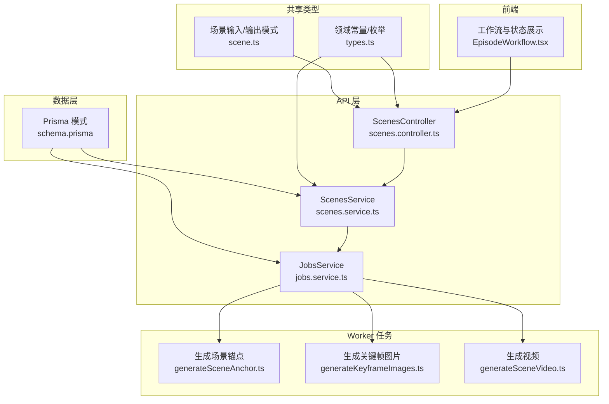
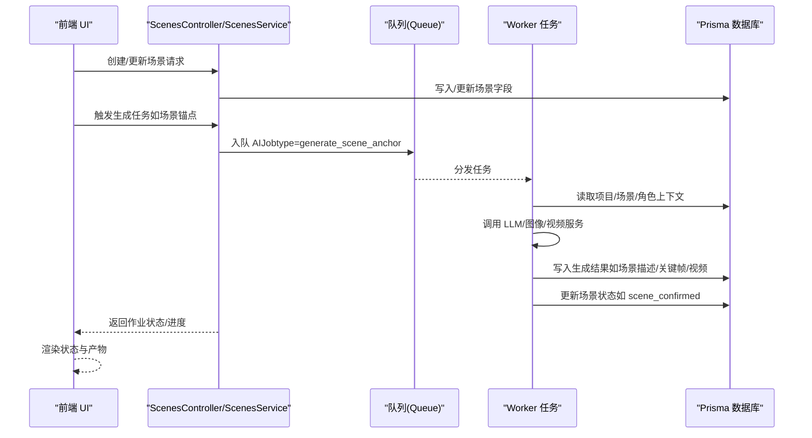
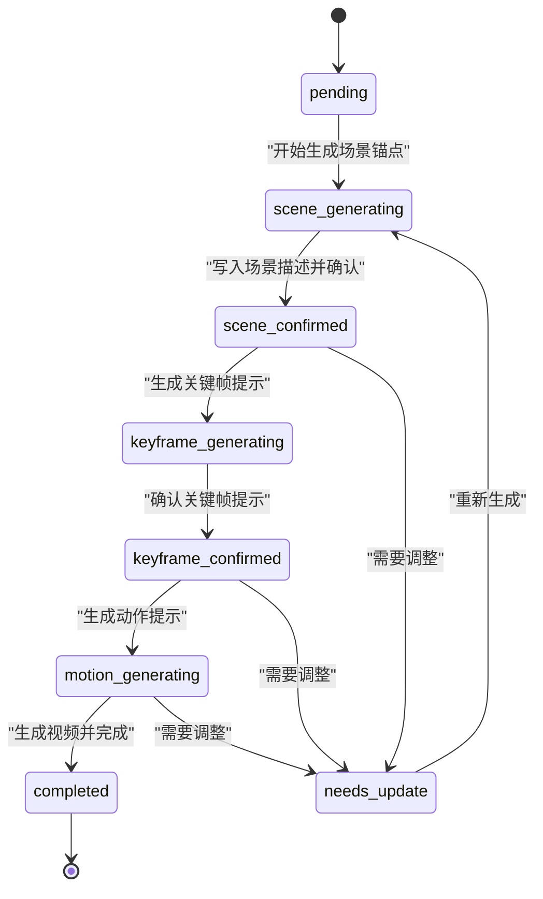
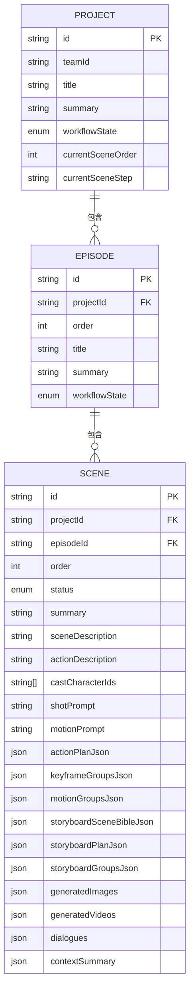
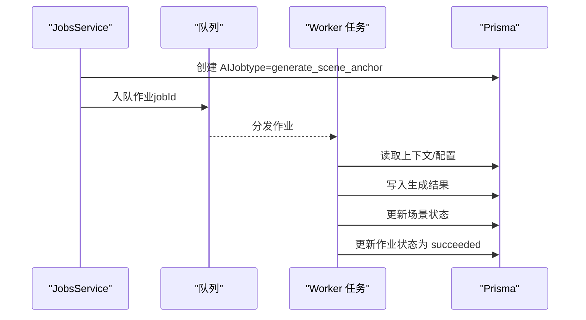
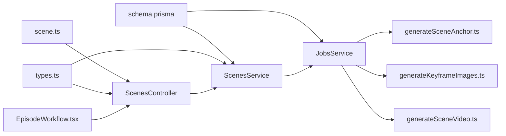

# 场景实体 (Scene)

<cite>
**本文引用的文件列表**
- [schema.prisma](file://apps/api/prisma/schema.prisma)
- [scene.ts](file://packages/shared/src/schemas/scene.ts)
- [types.ts](file://packages/shared/src/types.ts)
- [scenes.service.ts](file://apps/api/src/scenes/scenes.service.ts)
- [scenes.controller.ts](file://apps/api/src/scenes/scenes.controller.ts)
- [jobs.service.ts](file://apps/api/src/jobs/jobs.service.ts)
- [generateSceneAnchor.ts](file://apps/worker/src/tasks/generateSceneAnchor.ts)
- [generateKeyframeImages.ts](file://apps/worker/src/tasks/generateKeyframeImages.ts)
- [generateSceneVideo.ts](file://apps/worker/src/tasks/generateSceneVideo.ts)
- [EpisodeWorkflow.tsx](file://apps/web/src/components/editor/EpisodeWorkflow.tsx)
</cite>

## 目录

1. [简介](#简介)
2. [项目结构](#项目结构)
3. [核心组件](#核心组件)
4. [架构总览](#架构总览)
5. [详细组件分析](#详细组件分析)
6. [依赖分析](#依赖分析)
7. [性能考虑](#性能考虑)
8. [故障排查指南](#故障排查指南)
9. [结论](#结论)
10. [附录](#附录)

## 简介

本文件系统化阐述场景实体（Scene）的字段定义、状态流转、与项目（Project）、剧集（Episode）及 AI 作业（AIJob）的关系，以及在分镜生成与视频制作中的核心作用。重点覆盖：

- 字段定义与数据模型
- 场景状态（SceneStatus）的完整流程
- 与 Project/Episode 的关联关系
- 与 AIJob 的关联用于跟踪 AI 生成任务
- 在分镜生成、关键帧生成与多模态内容输出中的处理链路

## 项目结构

围绕场景实体的关键代码分布在以下模块：

- 数据模型与枚举：Prisma Schema
- 类型与输入校验：共享包（Zod）
- API 层：控制器与服务
- 工作流与作业：后端队列与 Worker 任务
- 前端展示：状态样式与工作流 UI

图表来源

- [schema.prisma](file://apps/api/prisma/schema.prisma#L197-L233)
- [scenes.controller.ts](file://apps/api/src/scenes/scenes.controller.ts#L14-L67)
- [scenes.service.ts](file://apps/api/src/scenes/scenes.service.ts#L24-L365)
- [jobs.service.ts](file://apps/api/src/jobs/jobs.service.ts#L378-L418)
- [scene.ts](file://packages/shared/src/schemas/scene.ts#L26-L55)
- [types.ts](file://packages/shared/src/types.ts#L37-L47)
- [generateSceneAnchor.ts](file://apps/worker/src/tasks/generateSceneAnchor.ts#L81-L228)
- [generateKeyframeImages.ts](file://apps/worker/src/tasks/generateKeyframeImages.ts#L103-L203)
- [generateSceneVideo.ts](file://apps/worker/src/tasks/generateSceneVideo.ts#L192-L312)
- [EpisodeWorkflow.tsx](file://apps/web/src/components/editor/EpisodeWorkflow.tsx#L259-L309)

章节来源

- [schema.prisma](file://apps/api/prisma/schema.prisma#L197-L233)
- [scenes.controller.ts](file://apps/api/src/scenes/scenes.controller.ts#L14-L67)
- [scenes.service.ts](file://apps/api/src/scenes/scenes.service.ts#L24-L365)
- [jobs.service.ts](file://apps/api/src/jobs/jobs.service.ts#L378-L418)
- [scene.ts](file://packages/shared/src/schemas/scene.ts#L26-L55)
- [types.ts](file://packages/shared/src/types.ts#L37-L47)
- [generateSceneAnchor.ts](file://apps/worker/src/tasks/generateSceneAnchor.ts#L81-L228)
- [generateKeyframeImages.ts](file://apps/worker/src/tasks/generateKeyframeImages.ts#L103-L203)
- [generateSceneVideo.ts](file://apps/worker/src/tasks/generateSceneVideo.ts#L192-L312)
- [EpisodeWorkflow.tsx](file://apps/web/src/components/editor/EpisodeWorkflow.tsx#L259-L309)

## 核心组件

- 场景实体（Scene）：承载分镜描述、动作拆解、关键帧与视频输出、对话、上下文摘要等丰富字段，并通过状态驱动工作流。
- 场景状态（SceneStatus）：从 pending 到 completed 的完整生命周期，包含场景生成、关键帧生成、动作提示生成、对话生成、确认与完成等阶段。
- 与 Project/Episode 的关系：场景属于剧集，剧集属于项目；通过外键维护层级关系。
- 与 AIJob 的关系：每个生成步骤对应一个 AIJob，用于跟踪任务排队、执行、结果与错误。

章节来源

- [schema.prisma](file://apps/api/prisma/schema.prisma#L197-L233)
- [types.ts](file://packages/shared/src/types.ts#L37-L47)
- [jobs.service.ts](file://apps/api/src/jobs/jobs.service.ts#L378-L418)

## 架构总览

场景实体贯穿“数据模型—API—队列—Worker—前端”的全链路。前端触发工作流，API 将作业入队，Worker 执行具体任务并更新场景状态与内容，最终由前端渲染状态与产出。

图表来源

- [scenes.controller.ts](file://apps/api/src/scenes/scenes.controller.ts#L14-L67)
- [scenes.service.ts](file://apps/api/src/scenes/scenes.service.ts#L105-L131)
- [jobs.service.ts](file://apps/api/src/jobs/jobs.service.ts#L378-L418)
- [generateSceneAnchor.ts](file://apps/worker/src/tasks/generateSceneAnchor.ts#L81-L228)
- [generateKeyframeImages.ts](file://apps/worker/src/tasks/generateKeyframeImages.ts#L103-L203)
- [generateSceneVideo.ts](file://apps/worker/src/tasks/generateSceneVideo.ts#L192-L312)

## 详细组件分析

### 字段定义与数据模型

场景实体包含丰富的字段，涵盖文本描述、动作拆解、关键帧与视频输出、对话、上下文摘要、状态与时间戳等。字段与类型定义如下：

- 主键与外键
  - id：字符串主键，cuid() 生成
  - projectId：所属项目
  - episodeId：所属剧集
- 排序与摘要
  - order：在剧集内的顺序
  - summary：场景概要
  - sceneDescription：场景描述（经锚点生成）
  - actionDescription：动作描述
  - castCharacterIds：演员角色 ID 数组
- 提示词与拆解
  - shotPrompt：镜头提示词（含关键帧规划）
  - motionPrompt：动作提示词（用于视频生成）
  - actionPlanJson：动作拆解（beat 分层）
  - keyframeGroupsJson：按 beat 的关键帧分组
  - motionGroupsJson：按 beat 的动作提示分组
- 分镜相关 JSON 字段
  - storyboardSceneBibleJson：分镜圣经
  - storyboardPlanJson：分镜计划
  - storyboardGroupsJson：分镜分组
- 多模态输出
  - generatedImages：关键帧图片数组（含 keyframe、url、prompt 等）
  - generatedVideos：视频数组（含 url、provider、model、metadata 等）
- 对话与上下文
  - dialogues：对话语音/字幕等
  - contextSummary：上下文摘要（含情绪、关键元素、过渡等）
- 状态与元数据
  - status：场景状态（SceneStatus）
  - notes：备注
  - createdAt/updatedAt：时间戳

章节来源

- [schema.prisma](file://apps/api/prisma/schema.prisma#L197-L233)
- [scene.ts](file://packages/shared/src/schemas/scene.ts#L6-L24)
- [scene.ts](file://packages/shared/src/schemas/scene.ts#L26-L55)

### 场景状态（SceneStatus）与工作流

场景状态从 pending 开始，逐步推进至 completed，期间可能因需要调整而进入 needs_update。状态映射与 UI 样式在前端有直观呈现。

- 状态序列（从 pending 到 completed）
  - pending：初始状态
  - scene_generating：生成场景锚点（场景描述）
  - scene_confirmed：场景描述确认
  - keyframe_generating：生成关键帧提示
  - keyframe_confirmed：关键帧提示确认
  - motion_generating：生成动作提示
  - completed：全部生成完成
  - needs_update：需要更新

- 状态与工作流节点
  - 生成场景锚点：enqueueGenerateSceneAnchor → scene_generating → scene_confirmed
  - 生成关键帧提示：enqueueGenerateKeyframePrompt → keyframe_generating → keyframe_confirmed
  - 生成关键帧图片：enqueueGenerateKeyframeImages → 写入 generatedImages
  - 生成动作提示：enqueueGenerateMotionPrompt → motion_generating
  - 生成视频：enqueueGenerateSceneVideo → 写入 generatedVideos → completed

- 前端状态样式
  - 不同状态对应不同颜色与标签，便于用户识别当前阶段。

图表来源

- [types.ts](file://packages/shared/src/types.ts#L37-L47)
- [jobs.service.ts](file://apps/api/src/jobs/jobs.service.ts#L378-L418)
- [jobs.service.ts](file://apps/api/src/jobs/jobs.service.ts#L420-L459)
- [jobs.service.ts](file://apps/api/src/jobs/jobs.service.ts#L716-L755)
- [EpisodeWorkflow.tsx](file://apps/web/src/components/editor/EpisodeWorkflow.tsx#L259-L309)

章节来源

- [types.ts](file://packages/shared/src/types.ts#L37-L47)
- [jobs.service.ts](file://apps/api/src/jobs/jobs.service.ts#L378-L418)
- [jobs.service.ts](file://apps/api/src/jobs/jobs.service.ts#L420-L459)
- [jobs.service.ts](file://apps/api/src/jobs/jobs.service.ts#L716-L755)
- [EpisodeWorkflow.tsx](file://apps/web/src/components/editor/EpisodeWorkflow.tsx#L259-L309)

### 与 Project 和 Episode 的关联

- 场景属于剧集，剧集属于项目，形成三层关系：
  - Scene.episodeId → Episode.id
  - Episode.projectId → Project.id
- 外键约束确保删除级联与唯一索引（如剧集内顺序唯一）

图表来源

- [schema.prisma](file://apps/api/prisma/schema.prisma#L116-L141)
- [schema.prisma](file://apps/api/prisma/schema.prisma#L176-L195)
- [schema.prisma](file://apps/api/prisma/schema.prisma#L197-L233)

章节来源

- [schema.prisma](file://apps/api/prisma/schema.prisma#L116-L141)
- [schema.prisma](file://apps/api/prisma/schema.prisma#L176-L195)
- [schema.prisma](file://apps/api/prisma/schema.prisma#L197-L233)

### 与 AIJob 的关联与跟踪

- 每个生成步骤都会创建一个 AIJob，并绑定到场景（sceneId）或剧集（episodeId）或项目（projectId）。
- API 层负责入队与查询作业状态，Worker 层执行具体任务并更新场景内容与状态。
- 作业类型覆盖：场景锚点、关键帧提示、关键帧图片、动作提示、视频生成、分镜圣经/计划/分组等。

图表来源

- [jobs.service.ts](file://apps/api/src/jobs/jobs.service.ts#L378-L418)
- [generateSceneAnchor.ts](file://apps/worker/src/tasks/generateSceneAnchor.ts#L81-L228)
- [generateKeyframeImages.ts](file://apps/worker/src/tasks/generateKeyframeImages.ts#L103-L203)
- [generateSceneVideo.ts](file://apps/worker/src/tasks/generateSceneVideo.ts#L192-L312)

章节来源

- [jobs.service.ts](file://apps/api/src/jobs/jobs.service.ts#L378-L418)
- [generateSceneAnchor.ts](file://apps/worker/src/tasks/generateSceneAnchor.ts#L81-L228)
- [generateKeyframeImages.ts](file://apps/worker/src/tasks/generateKeyframeImages.ts#L103-L203)
- [generateSceneVideo.ts](file://apps/worker/src/tasks/generateSceneVideo.ts#L192-L312)

### 在分镜生成与视频制作中的核心作用

- 动作拆解：actionPlanJson 记录 beat 层级（start/mid/end），指导关键帧与动作提示生成。
- 关键帧生成：根据 keyframeGroupsJson 与 shotPrompt，生成关键帧图片并写入 generatedImages。
- 多模态输出：生成视频（generatedVideos）与分镜圣经/计划/分组（storyboard\*Json）支撑后续剪辑与导出。
- 对话与上下文：dialogues 与 contextSummary 为配音与字幕提供依据。

章节来源

- [schema.prisma](file://apps/api/prisma/schema.prisma#L197-L233)
- [generateKeyframeImages.ts](file://apps/worker/src/tasks/generateKeyframeImages.ts#L103-L203)
- [generateSceneVideo.ts](file://apps/worker/src/tasks/generateSceneVideo.ts#L192-L312)

## 依赖分析

- 数据模型依赖：Prisma 模式定义了 Scene、Episode、Project、AIJob 的关系与枚举。
- 类型与校验：共享包提供 Zod 模式与领域常量（如 SceneStatus），前后端一致。
- API 服务：ScenesService 提供 CRUD 与排序；JobsService 负责作业入队与状态查询。
- Worker 任务：按作业类型执行具体生成逻辑，更新场景字段与状态。
- 前端：根据状态渲染 UI 并展示进度。

图表来源

- [schema.prisma](file://apps/api/prisma/schema.prisma#L197-L233)
- [scenes.controller.ts](file://apps/api/src/scenes/scenes.controller.ts#L14-L67)
- [scenes.service.ts](file://apps/api/src/scenes/scenes.service.ts#L24-L365)
- [jobs.service.ts](file://apps/api/src/jobs/jobs.service.ts#L378-L418)
- [scene.ts](file://packages/shared/src/schemas/scene.ts#L26-L55)
- [types.ts](file://packages/shared/src/types.ts#L37-L47)
- [generateSceneAnchor.ts](file://apps/worker/src/tasks/generateSceneAnchor.ts#L81-L228)
- [generateKeyframeImages.ts](file://apps/worker/src/tasks/generateKeyframeImages.ts#L103-L203)
- [generateSceneVideo.ts](file://apps/worker/src/tasks/generateSceneVideo.ts#L192-L312)
- [EpisodeWorkflow.tsx](file://apps/web/src/components/editor/EpisodeWorkflow.tsx#L259-L309)

章节来源

- [schema.prisma](file://apps/api/prisma/schema.prisma#L197-L233)
- [scenes.controller.ts](file://apps/api/src/scenes/scenes.controller.ts#L14-L67)
- [scenes.service.ts](file://apps/api/src/scenes/scenes.service.ts#L24-L365)
- [jobs.service.ts](file://apps/api/src/jobs/jobs.service.ts#L378-L418)
- [scene.ts](file://packages/shared/src/schemas/scene.ts#L26-L55)
- [types.ts](file://packages/shared/src/types.ts#L37-L47)
- [generateSceneAnchor.ts](file://apps/worker/src/tasks/generateSceneAnchor.ts#L81-L228)
- [generateKeyframeImages.ts](file://apps/worker/src/tasks/generateKeyframeImages.ts#L103-L203)
- [generateSceneVideo.ts](file://apps/worker/src/tasks/generateSceneVideo.ts#L192-L312)
- [EpisodeWorkflow.tsx](file://apps/web/src/components/editor/EpisodeWorkflow.tsx#L259-L309)

## 性能考虑

- 作业并发与重试：队列配置包含尝试次数与指数退避，避免瞬时失败导致阻塞。
- 进度上报：Worker 任务按阶段上报进度，前端可实时反馈，提升用户体验。
- 数据写入优化：批量更新（如 reorder）在单事务中完成，减少锁竞争。
- 超时与轮询：视频生成采用超时与轮询策略，保障稳定性与可观测性。

章节来源

- [jobs.service.ts](file://apps/api/src/jobs/jobs.service.ts#L363-L373)
- [generateSceneVideo.ts](file://apps/worker/src/tasks/generateSceneVideo.ts#L21-L40)
- [scenes.service.ts](file://apps/api/src/scenes/scenes.service.ts#L328-L335)

## 故障排查指南

- 删除场景前检查：若存在处于 queued 或 running 的 AIJob，则禁止删除，需先取消作业。
- 生成失败定位：
  - 查看作业状态与错误信息（AIJob.error）
  - 检查 AI 配置（provider/model/baseURL/apiKey）是否正确
  - 对于视频生成，确认 Doubao/ARK API Key 格式与可用性
- 状态不一致：确认 Worker 是否成功更新场景状态与字段，必要时重试相应作业。

章节来源

- [scenes.service.ts](file://apps/api/src/scenes/scenes.service.ts#L255-L280)
- [jobs.service.ts](file://apps/api/src/jobs/jobs.service.ts#L378-L418)
- [generateSceneVideo.ts](file://apps/worker/src/tasks/generateSceneVideo.ts#L226-L231)

## 结论

场景实体是分镜与视频制作流程的核心载体，通过明确的状态机与丰富的 JSON 字段，串联从场景锚点到关键帧再到视频输出的完整工作流。配合 AIJob 的作业管理与前端状态可视化，实现了高效、可控、可观测的多模态内容生产体系。

## 附录

- 字段与类型的对应关系可参考共享包中的 Zod 模式与领域常量。
- 前端状态样式与标签映射可参考 EpisodeWorkflow 组件中的状态样式函数。

章节来源

- [scene.ts](file://packages/shared/src/schemas/scene.ts#L26-L55)
- [types.ts](file://packages/shared/src/types.ts#L37-L47)
- [EpisodeWorkflow.tsx](file://apps/web/src/components/editor/EpisodeWorkflow.tsx#L259-L309)
