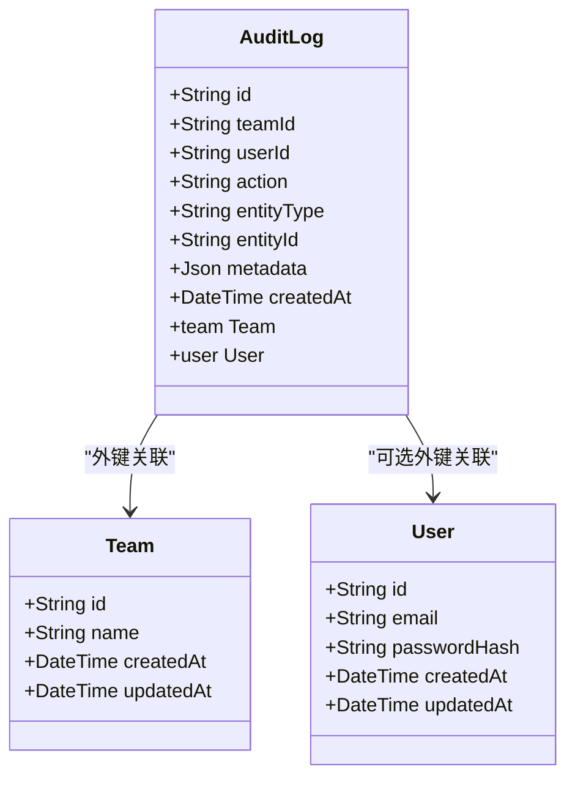
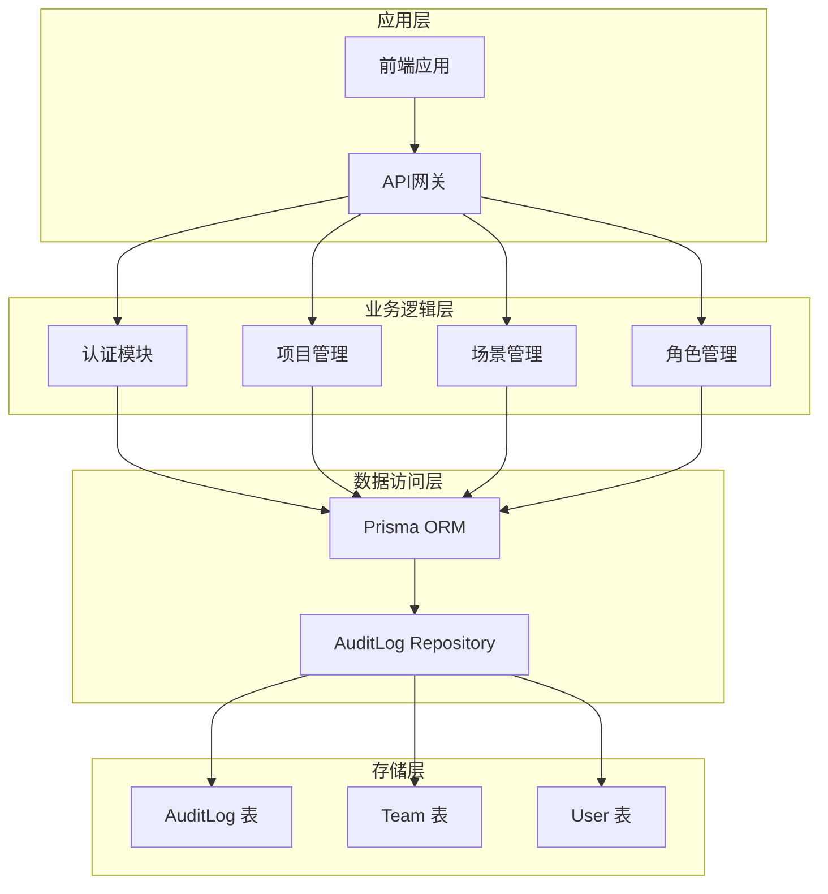
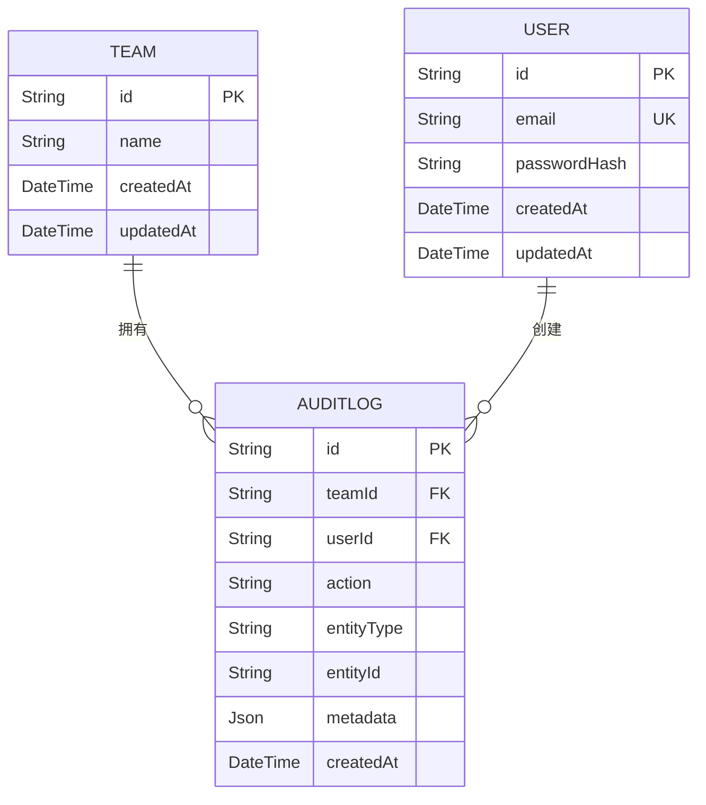
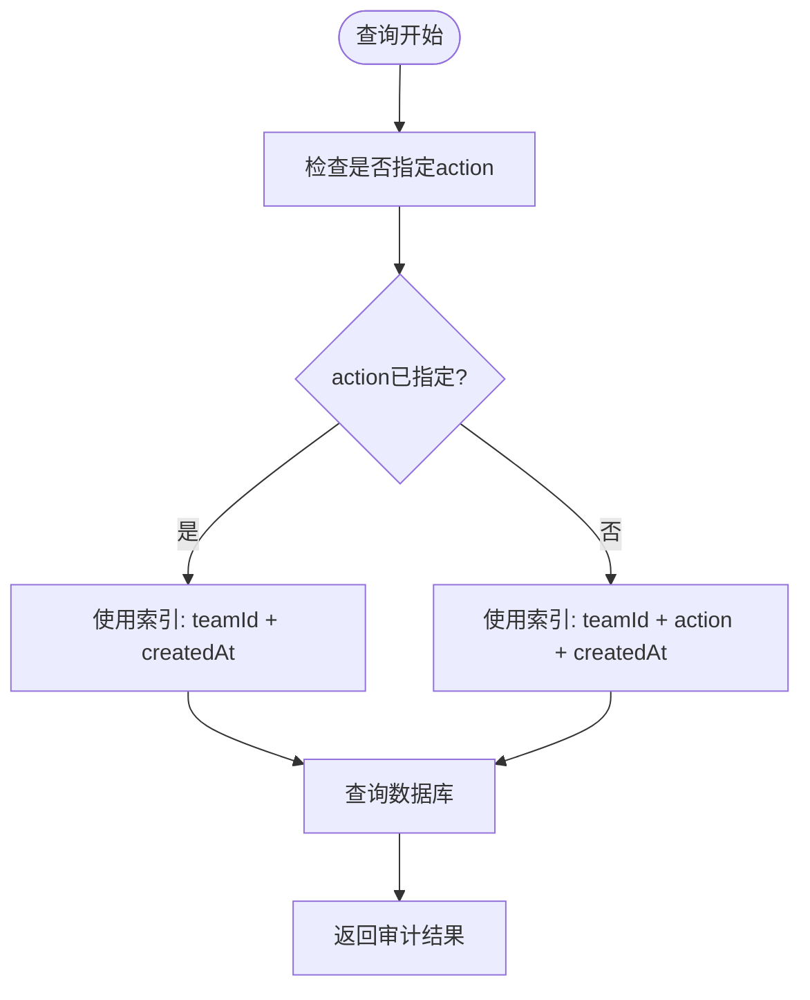
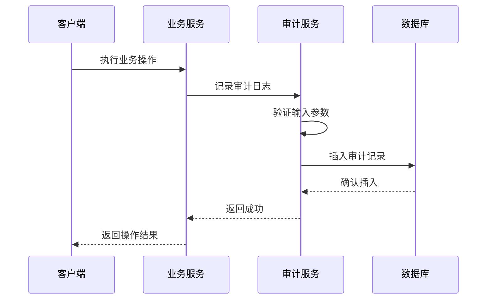
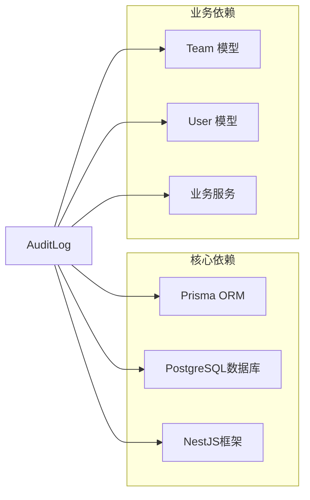
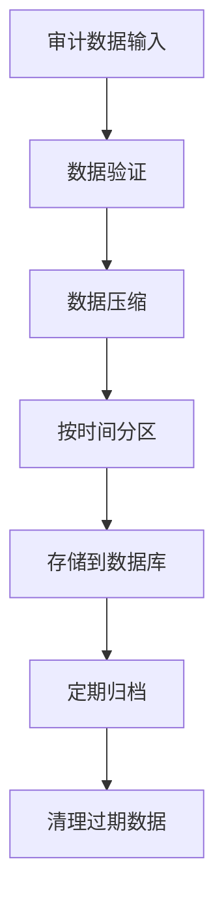
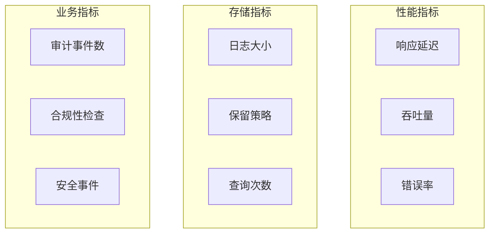

# 审计日志实体 (AuditLog)

<cite>
**本文档引用的文件**
- [schema.prisma](file://apps/api/prisma/schema.prisma)
- [migration.sql](file://apps/api/prisma/migrations/000_init/migration.sql)
- [audit-baseline.md](file://docs/engineering/audit-baseline.md)
- [episode-planning-workflow.md](file://docs/prd/episode-planning-workflow.md)
- [auth.service.ts](file://apps/api/src/auth/auth.service.ts)
- [projects.controller.ts](file://apps/api/src/projects/projects.controller.ts)
- [projects.service.ts](file://apps/api/src/projects/projects.service.ts)
</cite>

## 目录

1. [简介](#简介)
2. [项目结构](#项目结构)
3. [核心组件](#核心组件)
4. [架构概览](#架构概览)
5. [详细组件分析](#详细组件分析)
6. [依赖分析](#依赖分析)
7. [性能考虑](#性能考虑)
8. [故障排除指南](#故障排除指南)
9. [结论](#结论)

## 简介

审计日志实体(AuditLog)是本系统安全和合规性的核心基础设施，负责记录所有关键的用户操作和系统事件。该实体采用PostgreSQL数据库存储，通过Prisma ORM进行数据访问，为系统的安全审计、合规检查和问题排查提供了完整的数据支撑。

审计日志的设计遵循生产级安全标准，包含完整的外键约束、索引优化和数据完整性保证。通过团队级别的隔离机制，确保不同团队的数据相互独立，满足多租户架构的安全要求。

## 项目结构

审计日志实体在项目中的组织结构如下：

```mermaid
graph TB
subgraph "数据模型层"
Schema[schema.prisma<br/>数据模型定义]
Migration[migration.sql<br/>数据库迁移]
end
subgraph "业务服务层"
AuthSvc[AuthService<br/>认证服务]
ProjSvc[ProjectsService<br/>项目服务]
Ctrl[Controllers<br/>控制器层]
end
subgraph "存储层"
DB[(PostgreSQL)<br/>审计日志表]
Team[Team 表<br/>团队数据]
User[User 表<br/>用户数据]
end
Schema --> Migration
AuthSvc --> DB
ProjSvc --> DB
Ctrl --> DB
DB --> Team
DB --> User
```

**图表来源**

- [schema.prisma](file://apps/api/prisma/schema.prisma#L294-L309)
- [migration.sql](file://apps/api/prisma/migrations/000_init/migration.sql#L108-L119)

**章节来源**

- [schema.prisma](file://apps/api/prisma/schema.prisma#L294-L309)
- [migration.sql](file://apps/api/prisma/migrations/000_init/migration.sql#L108-L119)

## 核心组件

### 审计日志实体定义

审计日志实体在Prisma模式文件中定义如下：



**图表来源**

- [schema.prisma](file://apps/api/prisma/schema.prisma#L294-L309)
- [schema.prisma](file://apps/api/prisma/schema.prisma#L75-L85)
- [schema.prisma](file://apps/api/prisma/schema.prisma#L87-L100)

### 字段详细说明

| 字段名     | 类型     | 必填 | 默认值 | 描述                               |
| ---------- | -------- | ---- | ------ | ---------------------------------- |
| id         | String   | 是   | cuid() | 主键标识符，使用cuid()生成唯一ID   |
| teamId     | String   | 是   | -      | 团队外键，关联到Team实体           |
| userId     | String   | 否   | null   | 用户外键，关联到User实体（可为空） |
| action     | String   | 是   | -      | 审计动作类型，描述具体操作         |
| entityType | String   | 否   | null   | 操作涉及的实体类型                 |
| entityId   | String   | 否   | null   | 操作涉及的实体ID                   |
| metadata   | Json     | 否   | null   | 结构化元数据，存储额外信息         |
| createdAt  | DateTime | 否   | now()  | 创建时间戳，默认当前时间           |

**章节来源**

- [schema.prisma](file://apps/api/prisma/schema.prisma#L294-L309)

## 架构概览

审计日志系统在整个应用架构中的位置和作用：



**图表来源**

- [auth.service.ts](file://apps/api/src/auth/auth.service.ts#L1-L77)
- [projects.controller.ts](file://apps/api/src/projects/projects.controller.ts#L1-L43)
- [projects.service.ts](file://apps/api/src/projects/projects.service.ts#L1-L215)

## 详细组件分析

### 数据模型关系

审计日志实体与相关实体的关系设计体现了清晰的业务分离和数据完整性：



**图表来源**

- [schema.prisma](file://apps/api/prisma/schema.prisma#L87-L100)
- [schema.prisma](file://apps/api/prisma/schema.prisma#L75-L85)
- [schema.prisma](file://apps/api/prisma/schema.prisma#L294-L309)

### 索引优化策略

审计日志表采用了精心设计的索引策略来优化查询性能：



**图表来源**

- [migration.sql](file://apps/api/prisma/migrations/000_init/migration.sql#L160-L164)

### 审计日志生命周期



**图表来源**

- [auth.service.ts](file://apps/api/src/auth/auth.service.ts#L22-L56)
- [projects.service.ts](file://apps/api/src/projects/projects.service.ts#L112-L139)

**章节来源**

- [schema.prisma](file://apps/api/prisma/schema.prisma#L294-L309)
- [migration.sql](file://apps/api/prisma/migrations/000_init/migration.sql#L160-L164)

## 依赖分析

### 外部依赖关系

审计日志实体依赖于以下外部组件：



**图表来源**

- [schema.prisma](file://apps/api/prisma/schema.prisma#L294-L309)
- [schema.prisma](file://apps/api/prisma/schema.prisma#L87-L100)
- [schema.prisma](file://apps/api/prisma/schema.prisma#L75-L85)

### 内部耦合度分析

审计日志实体与业务服务的耦合关系体现了松耦合的设计原则：

| 服务名称          | 耦合程度 | 说明                                 |
| ----------------- | -------- | ------------------------------------ |
| AuthService       | 低       | 仅在用户注册/登录时记录审计日志      |
| ProjectsService   | 中       | 项目创建/更新/删除操作均记录审计日志 |
| ScenesService     | 中       | 场景相关操作记录审计日志             |
| CharactersService | 低       | 角色管理操作记录审计日志             |

**章节来源**

- [auth.service.ts](file://apps/api/src/auth/auth.service.ts#L22-L56)
- [projects.service.ts](file://apps/api/src/projects/projects.service.ts#L112-L198)

## 性能考虑

### 查询性能优化

审计日志查询性能通过以下策略优化：

1. **复合索引设计**：针对常见的查询模式建立复合索引
2. **分区策略**：按时间范围对审计日志进行分区存储
3. **缓存机制**：对频繁查询的结果进行缓存
4. **异步处理**：审计日志记录采用异步方式，不影响主业务流程

### 存储优化



**图表来源**

- [audit-baseline.md](file://docs/engineering/audit-baseline.md#L1-L81)

## 故障排除指南

### 常见问题及解决方案

| 问题类型   | 症状             | 可能原因         | 解决方案                   |
| ---------- | ---------------- | ---------------- | -------------------------- |
| 插入失败   | 数据库约束错误   | 外键约束违反     | 检查teamId和userId的有效性 |
| 查询缓慢   | 查询响应时间过长 | 缺少必要索引     | 创建适当的复合索引         |
| 数据不一致 | 审计记录缺失     | 异常处理不当     | 实现事务性审计记录         |
| 存储不足   | 数据库空间不足   | 缺少数据清理策略 | 实施定期数据归档和清理     |

### 监控指标



**图表来源**

- [episode-planning-workflow.md](file://docs/prd/episode-planning-workflow.md#L595-L605)

**章节来源**

- [audit-baseline.md](file://docs/engineering/audit-baseline.md#L1-L81)

## 结论

审计日志实体作为系统安全和合规性的基础设施，具有以下关键特性：

1. **完整性保障**：通过外键约束和事务处理确保数据完整性
2. **性能优化**：合理的索引设计和查询优化策略
3. **扩展性**：支持多租户架构和水平扩展
4. **合规性**：满足生产级安全和审计要求

该设计为系统的安全运营提供了坚实基础，支持权限审计、操作追踪和问题排查等核心需求。通过持续的监控和优化，审计日志系统将继续为系统的稳定运行和合规性提供重要保障。
