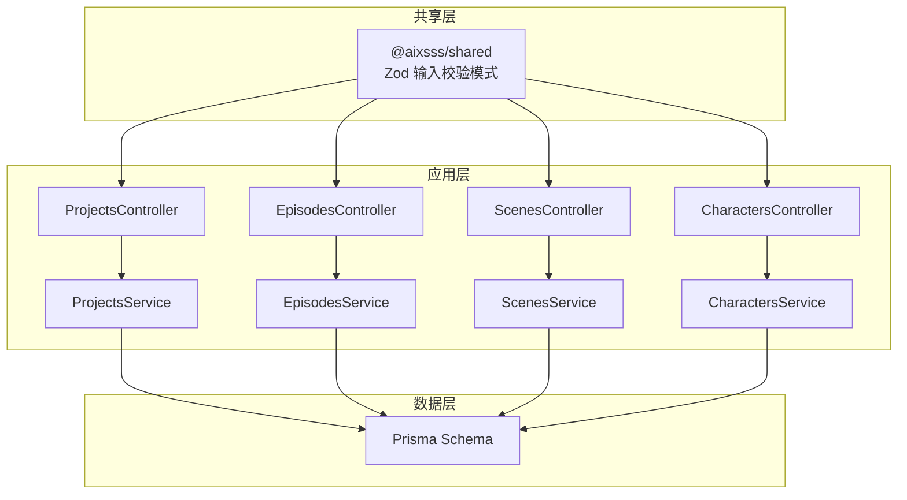
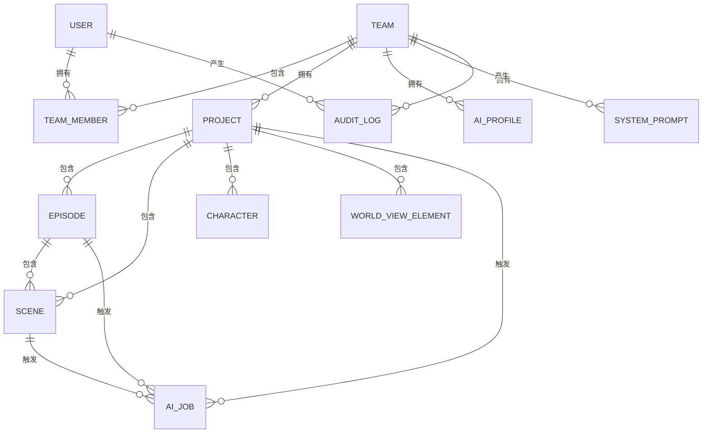
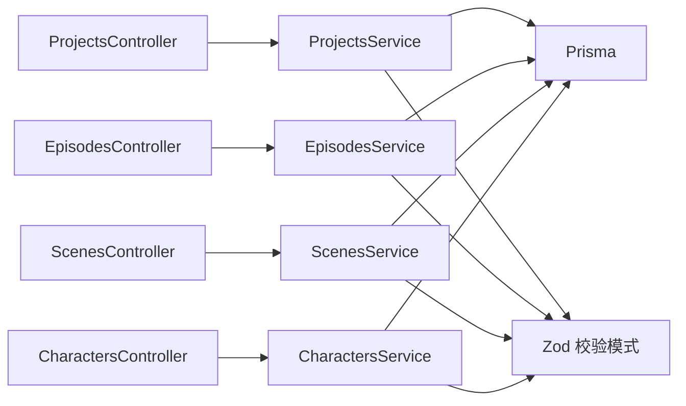

# 核心实体模型

<cite>
**本文引用的文件**
- [schema.prisma](file://apps/api/prisma/schema.prisma)
- [character.ts](file://packages/shared/src/schemas/character.ts)
- [project.ts](file://packages/shared/src/schemas/project.ts)
- [episode.ts](file://packages/shared/src/schemas/episode.ts)
- [scene.ts](file://packages/shared/src/schemas/scene.ts)
- [worldView.ts](file://packages/shared/src/schemas/worldView.ts)
- [projects.controller.ts](file://apps/api/src/projects/projects.controller.ts)
- [episodes.controller.ts](file://apps/api/src/episodes/episodes.controller.ts)
- [scenes.controller.ts](file://apps/api/src/scenes/scenes.controller.ts)
- [characters.controller.ts](file://apps/api/src/characters/characters.controller.ts)
- [projects.service.ts](file://apps/api/src/projects/projects.service.ts)
- [episodes.service.ts](file://apps/api/src/episodes/episodes.service.ts)
- [scenes.service.ts](file://apps/api/src/scenes/scenes.service.ts)
- [characters.service.ts](file://apps/api/src/characters/characters.service.ts)
</cite>

## 目录

1. [引言](#引言)
2. [项目结构](#项目结构)
3. [核心组件](#核心组件)
4. [架构总览](#架构总览)
5. [详细组件分析](#详细组件分析)
6. [依赖分析](#依赖分析)
7. [性能考虑](#性能考虑)
8. [故障排查指南](#故障排查指南)
9. [结论](#结论)
10. [附录](#附录)

## 引言

本文件系统化梳理 AIXSSS 的核心业务实体模型，围绕用户(User)、团队(Team)、项目(Project)、剧集(Episode)、场景(Scene)、角色(Character)等进行深入解析。内容涵盖：

- 实体设计理念与职责边界
- 主键生成策略(cuid())与字段类型、默认值、约束
- 外键关系与级联删除策略
- 在创作工作流中的作用与业务价值
- 实体关系图、字段类型说明与数据库表结构示例
- 设计最佳实践与性能优化建议

## 项目结构

本项目采用分层与模块化组织：

- 数据层：Prisma 模式定义与迁移文件，统一管理实体、索引、枚举与关系
- 应用层：NestJS 控制器与服务，负责请求解析、权限校验、业务编排与数据持久化
- 共享层：Zod 输入校验模式，确保前后端一致的输入约束

图表来源

- [projects.controller.ts](file://apps/api/src/projects/projects.controller.ts#L1-L43)
- [episodes.controller.ts](file://apps/api/src/episodes/episodes.controller.ts#L1-L55)
- [scenes.controller.ts](file://apps/api/src/scenes/scenes.controller.ts#L1-L67)
- [characters.controller.ts](file://apps/api/src/characters/characters.controller.ts#L1-L47)
- [projects.service.ts](file://apps/api/src/projects/projects.service.ts#L1-L215)
- [episodes.service.ts](file://apps/api/src/episodes/episodes.service.ts#L1-L146)
- [scenes.service.ts](file://apps/api/src/scenes/scenes.service.ts#L1-L365)
- [characters.service.ts](file://apps/api/src/characters/characters.service.ts#L1-L118)
- [schema.prisma](file://apps/api/prisma/schema.prisma#L1-L351)

章节来源

- [schema.prisma](file://apps/api/prisma/schema.prisma#L1-L351)
- [projects.controller.ts](file://apps/api/src/projects/projects.controller.ts#L1-L43)
- [episodes.controller.ts](file://apps/api/src/episodes/episodes.controller.ts#L1-L55)
- [scenes.controller.ts](file://apps/api/src/scenes/scenes.controller.ts#L1-L67)
- [characters.controller.ts](file://apps/api/src/characters/characters.controller.ts#L1-L47)

## 核心组件

本节从数据模型角度，逐项说明核心实体的主键策略、字段类型、默认值与约束，并结合服务层行为解释其在工作流中的作用。

- 用户(User)
  - 主键：String，@id，@default(cuid())
  - 唯一索引：email
  - 时间戳：createdAt 默认 now()，updatedAt 自动更新
  - 关系：拥有团队成员身份、审计日志、因果链版本
  - 业务价值：作为团队成员与审计追踪的主体，贯穿项目协作与变更历史

- 团队(Team)
  - 主键：String，@id，@default(cuid())
  - 时间戳：createdAt 默认 now()，updatedAt 自动更新
  - 关系：成员、项目、AI 配置、系统提示、审计日志、AI 任务、因果链版本
  - 业务价值：多租户隔离与权限控制的基础容器

- 团队成员(TeamMember)
  - 主键：String，@id，@default(cuid())
  - 复合唯一：(teamId, userId)
  - 字段：role，默认 MEMBER
  - 关系：关联 User 与 Team，均执行 Cascade 删除
  - 业务价值：实现用户在团队内的角色与访问控制

- 项目(Project)
  - 主键：String，@id，@default(cuid())
  - 外键：teamId → Team(id)，Cascade 删除
  - 枚举：workflowState，默认 DATA_COLLECTING；currentSceneOrder 默认 0
  - 索引：(teamId, updatedAt desc)
  - 关系：多个 Episode、Scene、Character、WorldViewElement、AIJob、因果链版本
  - 业务价值：承载创作流程的顶层容器，记录工作流状态与进度

- 剧集(Episode)
  - 主键：String，@id，@default(cuid())
  - 外键：projectId → Project(id)，Cascade 删除
  - 唯一索引：(projectId, order)
  - 枚举：workflowState，默认 IDLE
  - 关系：属于一个 Project，包含多个 Scene，关联 AIJob
  - 业务价值：剧情单元划分，承载核心表达(coreExpression)与场景清单

- 场景(Scene)
  - 主键：String，@id，@default(cuid())
  - 外键：projectId → Project(id)，episodeId → Episode(id)，均 Cascade 删除
  - 唯一索引：(episodeId, order)
  - 索引：(projectId, episodeId, order)
  - 枚举：status，默认 pending
  - JSON 字段：actionPlanJson、keyframeGroupsJson、motionGroupsJson、storyboard\*、generatedImages/Videos、dialogues、contextSummary 等
  - 业务价值：最小可交付的镜头单元，承载画面、动作、对白与生成物

- 角色(Character)
  - 主键：String，@id，@default(cuid())
  - 外键：projectId → Project(id)，Cascade 删除
  - 索引：(projectId, updatedAt desc)
  - JSON 字段：portraitPrompts、relationships、appearances 等
  - 业务价值：角色档案与风格化资产沉淀，支撑场景调度与视觉一致性

- 世界观元素(WorldViewElement)
  - 主键：String，@id，@default(cuid())
  - 外键：projectId → Project(id)，Cascade 删除
  - 唯一索引：(projectId, order)
  - 索引：(projectId, order)
  - 业务价值：结构化沉淀世界观要素，支持检索与组合

- AI 配置(AIProfile)
  - 主键：String，@id，@default(cuid())
  - 外键：teamId → Team(id)，Cascade 删除
  - 枚举：provider 类型
  - JSON 字段：generationParams、pricing
  - 索引：(teamId, updatedAt desc)
  - 业务价值：统一管理不同供应商与模型参数，支撑作业调度

- 审计日志(AuditLog)
  - 主键：String，@id，@default(cuid())
  - 外键：teamId → Team(id)，userId → User(id)，分别 SetNull/Cascade
  - 索引：(teamId, createdAt desc)，(userId)
  - 业务价值：记录关键操作与变更元数据，满足合规与回溯

- AI 任务(AIJob)
  - 主键：String，@id，@default(cuid())
  - 外键：teamId → Team(id)，projectId/episodeId/sceneId/aiProfileId → 对应实体，SetNull/Cascade
  - 枚举：status，默认 queued
  - 索引：(teamId, createdAt desc)，(status)
  - 业务价值：异步作业编排与状态追踪

章节来源

- [schema.prisma](file://apps/api/prisma/schema.prisma#L75-L351)

## 架构总览

下图展示核心实体之间的关系与依赖，体现创作工作流的层次化结构。

图表来源

- [schema.prisma](file://apps/api/prisma/schema.prisma#L75-L351)

## 详细组件分析

### 用户(User)分析

- 设计要点
  - 使用 cuid() 保证全局唯一性且具备排序友好特性
  - email 唯一，用于登录与鉴权
  - 自动时间戳，便于审计与排序
  - 通过 TeamMember 与 Team 建立多对多关系，支持跨团队协作
- 工作流作用
  - 作为项目与资源的归属主体，参与审计日志与因果链版本创建
- 最佳实践
  - 密码仅存储哈希，避免明文泄露
  - 严格校验 email 唯一性，防止重复注册

章节来源

- [schema.prisma](file://apps/api/prisma/schema.prisma#L75-L85)

### 团队(Team)分析

- 设计要点
  - 作为多租户边界，统一管理成员、资源与配置
  - 与 AIProfile、SystemPrompt、AuditLog 等强关联，支撑团队级能力
- 工作流作用
  - 限制控制器与服务层的可见范围，确保操作在团队维度内进行
- 最佳实践
  - 成员角色分级管理，配合中间件实现细粒度权限控制

章节来源

- [schema.prisma](file://apps/api/prisma/schema.prisma#L87-L100)

### 团队成员(TeamMember)分析

- 设计要点
  - 复合唯一索引确保同一团队内用户唯一
  - 关系均设置 Cascade，删除团队或用户时同步清理成员记录
- 工作流作用
  - 作为权限与资源访问的桥梁，决定用户可操作的项目与资源
- 最佳实践
  - 删除成员前需迁移或转移相关资源，避免孤儿数据

章节来源

- [schema.prisma](file://apps/api/prisma/schema.prisma#L102-L114)

### 项目(Project)分析

- 设计要点
  - 工作流状态枚举驱动创作流程推进
  - currentSceneOrder/currentSceneStep 支持进度跟踪
  - JSON 字段承载上下文缓存与样式配置
  - 软删除字段 deletedAt 支持数据保留与恢复
- 工作流作用
  - 顶层容器，协调剧集、场景、角色与世界观元素
  - 与因果链版本联动，记录创作过程的关键里程碑
- 最佳实践
  - 合理使用 contextCache 缓存上下文，避免重复计算
  - 严格控制工作流状态转换，确保流程一致性

章节来源

- [schema.prisma](file://apps/api/prisma/schema.prisma#L116-L141)
- [projects.service.ts](file://apps/api/src/projects/projects.service.ts#L112-L139)

### 剧集(Episode)分析

- 设计要点
  - 与项目建立一对多关系，保证顺序唯一性
  - 核心表达(coreExpression)与大纲(outline)支持结构化创作
  - 工作流状态驱动处理流程
- 工作流作用
  - 将长篇故事拆分为可管理的剧情单元，便于并行创作与质量把关
- 最佳实践
  - 严格校验 order 的唯一性与连续性，避免冲突
  - 在删除前检查关联场景是否仍有进行中的 AI 作业

章节来源

- [schema.prisma](file://apps/api/prisma/schema.prisma#L176-L195)
- [episodes.service.ts](file://apps/api/src/episodes/episodes.service.ts#L57-L80)

### 场景(Scene)分析

- 设计要点
  - 与剧集、项目双重外键，确保层级关系清晰
  - 多个 JSON 字段承载动作拆解、关键帧、运动提示、分镜计划与生成物
  - 状态机驱动生成与审核流程
- 工作流作用
  - 最小可交付单元，承载画面、动作与对白的具体实现
- 最佳实践
  - 在重排场景时确保同剧集内批量事务一致性
  - 删除前检查是否存在进行中的 AI 作业

章节来源

- [schema.prisma](file://apps/api/prisma/schema.prisma#L197-L233)
- [scenes.service.ts](file://apps/api/src/scenes/scenes.service.ts#L309-L338)

### 角色(Character)分析

- 设计要点
  - 与项目强关联，支持角色档案与风格化资产沉淀
  - JSON 字段支持复杂关系与外观描述
- 工作流作用
  - 为场景调度与画面生成提供角色依据
- 最佳实践
  - 保持角色名称在项目内唯一，便于引用与检索

章节来源

- [schema.prisma](file://apps/api/prisma/schema.prisma#L235-L257)

### 世界观元素(WorldViewElement)分析

- 设计要点
  - 结构化分类(type)与顺序(order)便于检索与展示
- 工作流作用
  - 为创作提供统一的世界观基线，减少重复劳动
- 最佳实践
  - 采用受控枚举类型，确保分类一致性

章节来源

- [schema.prisma](file://apps/api/prisma/schema.prisma#L259-L273)

### AI 配置(AIProfile)与系统提示(SystemPrompt)分析

- 设计要点
  - AIProfile 统一管理供应商、模型与定价
  - SystemPrompt 支持团队级定制化提示词模板
- 工作流作用
  - 为 AI 作业提供标准化参数与提示词，提升生成质量一致性
- 最佳实践
  - 定期评估与更新定价策略，控制成本

章节来源

- [schema.prisma](file://apps/api/prisma/schema.prisma#L275-L292)
- [schema.prisma](file://apps/api/prisma/schema.prisma#L337-L350)

### 审计日志(AuditLog)与 AI 任务(AIJob)分析

- 设计要点
  - AuditLog 记录关键操作与实体变更元数据
  - AIJob 统一追踪异步作业状态与错误
- 工作流作用
  - 提供合规与问题定位能力，保障系统可观测性
- 最佳实践
  - 合理设置重试与超时策略，避免僵尸作业

章节来源

- [schema.prisma](file://apps/api/prisma/schema.prisma#L294-L309)
- [schema.prisma](file://apps/api/prisma/schema.prisma#L311-L335)

## 依赖分析

- 控制器到服务
  - ProjectsController → ProjectsService
  - EpisodesController → EpisodesService
  - ScenesController → ScenesService
  - CharactersController → CharactersService
- 服务到 Prisma
  - 所有服务通过 PrismaService 访问数据库，遵循实体关系与约束
- 输入校验
  - 控制器使用 @aixsss/shared 中的 Zod 模式进行输入验证，确保字段长度、默认值与格式一致

图表来源

- [projects.controller.ts](file://apps/api/src/projects/projects.controller.ts#L1-L43)
- [episodes.controller.ts](file://apps/api/src/episodes/episodes.controller.ts#L1-L55)
- [scenes.controller.ts](file://apps/api/src/scenes/scenes.controller.ts#L1-L67)
- [characters.controller.ts](file://apps/api/src/characters/characters.controller.ts#L1-L47)
- [projects.service.ts](file://apps/api/src/projects/projects.service.ts#L1-L215)
- [episodes.service.ts](file://apps/api/src/episodes/episodes.service.ts#L1-L146)
- [scenes.service.ts](file://apps/api/src/scenes/scenes.service.ts#L1-L365)
- [characters.service.ts](file://apps/api/src/characters/characters.service.ts#L1-L118)
- [project.ts](file://packages/shared/src/schemas/project.ts#L1-L33)
- [episode.ts](file://packages/shared/src/schemas/episode.ts#L1-L80)
- [scene.ts](file://packages/shared/src/schemas/scene.ts#L1-L56)
- [character.ts](file://packages/shared/src/schemas/character.ts#L1-L32)

章节来源

- [projects.controller.ts](file://apps/api/src/projects/projects.controller.ts#L1-L43)
- [episodes.controller.ts](file://apps/api/src/episodes/episodes.controller.ts#L1-L55)
- [scenes.controller.ts](file://apps/api/src/scenes/scenes.controller.ts#L1-L67)
- [characters.controller.ts](file://apps/api/src/characters/characters.controller.ts#L1-L47)
- [projects.service.ts](file://apps/api/src/projects/projects.service.ts#L1-L215)
- [episodes.service.ts](file://apps/api/src/episodes/episodes.service.ts#L1-L146)
- [scenes.service.ts](file://apps/api/src/scenes/scenes.service.ts#L1-L365)
- [characters.service.ts](file://apps/api/src/characters/characters.service.ts#L1-L118)

## 性能考虑

- 索引策略
  - 项目列表按 (teamId, updatedAt desc) 排序，适合高频查询
  - 场景按 (episodeId, order) 与 (projectId, episodeId, order) 建立索引，优化场景查询与排序
  - 团队成员按 (userId) 建立索引，加速成员查询
- 查询与聚合
  - 项目列表中批量统计剧集与场景数量，建议在高并发场景下引入缓存或物化视图
- JSON 字段
  - JSON 字段用于存储结构化数据，注意避免过度嵌套与大体积内容，必要时拆分或压缩
- 事务与一致性
  - 场景重排与创建默认剧集等操作使用事务，确保原子性与一致性
- 级联删除
  - 项目删除时级联删除剧集、场景、角色、世界观元素与作业，避免悬挂数据；删除前需检查进行中的作业

## 故障排查指南

- 重复的剧集序号
  - 现象：创建剧集时报错提示序号已存在
  - 原因：(projectId, order) 唯一索引冲突
  - 处理：调整序号或删除冲突条目后重试
- 删除剧集失败
  - 现象：删除报错提示存在进行中的 AI 作业
  - 原因：剧集下的场景仍有关联的进行中作业
  - 处理：取消或等待作业完成后再次尝试删除
- 删除场景失败
  - 现象：删除报错提示场景正在被 AI 处理
  - 原因：场景关联的 AI 作业处于排队或运行中
  - 处理：取消作业后重试
- 场景重排异常
  - 现象：重排报错提示场景不属于同一剧集或包含无效 ID
  - 原因：传入的 sceneIds 跨剧集或不在当前项目中
  - 处理：确保所有 ID 属于同一剧集且存在于当前项目

章节来源

- [episodes.service.ts](file://apps/api/src/episodes/episodes.service.ts#L110-L143)
- [scenes.service.ts](file://apps/api/src/scenes/scenes.service.ts#L255-L307)
- [scenes.service.ts](file://apps/api/src/scenes/scenes.service.ts#L309-L338)

## 结论

AIXSSS 的核心实体模型以 Prisma Schema 为中心，围绕创作工作流构建了清晰的层级关系与严格的约束。通过 cuid() 主键、枚举状态与丰富的 JSON 字段，系统既保证了灵活性又维持了可维护性。配合控制器与服务层的输入校验与业务编排，能够有效支撑从项目规划到场景生成的全流程创作需求。建议在生产环境中持续完善索引策略、引入缓存与监控告警，并规范作业生命周期管理，以进一步提升稳定性与性能。

## 附录

- 字段类型与默认值速查
  - 字符串(String)：常用带默认值的文本字段，如标题、摘要、描述
  - 数字(Int/Float)：序号、计数与非负整数字段
  - JSON：结构化数据，如大纲、核心表达、生成物与上下文缓存
  - 枚举：工作流状态、角色、提供商类型、作业状态等
  - 时间戳(DateTime)：createdAt/updatedAt，默认使用 now()/updatedAt
- 数据库表结构示例（示意）
  - 用户表：id、email、passwordHash、createdAt、updatedAt
  - 团队表：id、name、createdAt、updatedAt
  - 团队成员表：id、teamId、userId、role、createdAt
  - 项目表：id、teamId、title、summary、style、artStyleConfig、workflowState、currentSceneOrder、currentSceneStep、createdAt、updatedAt、deletedAt
  - 剧集表：id、projectId、order、title、summary、outline、coreExpression、contextCache、workflowState、createdAt、updatedAt
  - 场景表：id、projectId、episodeId、order、summary、sceneDescription、actionDescription、castCharacterIds、shotPrompt、motionPrompt、actionPlanJson、keyframeGroupsJson、motionGroupsJson、storyboard\*、generatedImages、generatedVideos、dialogues、contextSummary、status、notes、createdAt、updatedAt
  - 角色表：id、projectId、name、briefDescription、avatar、appearance、personality、background、portraitPrompts、customStyle、relationships、appearances、themeColor、primaryColor、secondaryColor、createdAt、updatedAt
  - 世界观元素表：id、projectId、type、title、content、order、createdAt、updatedAt
  - AI 配置表：id、teamId、name、provider、model、baseURL、apiKeyEncrypted、generationParams、pricing、createdAt、updatedAt
  - 审计日志表：id、teamId、userId、action、entityType、entityId、metadata、createdAt
  - AI 任务表：id、teamId、projectId、episodeId、sceneId、aiProfileId、type、status、attempts、error、result、createdAt、startedAt、finishedAt
  - 因果链版本表：id、teamId、projectId、userId、source、phase、completedPhase、validationStatus、chainSchemaVersion、label、note、basedOnVersionId、chain、createdAt
