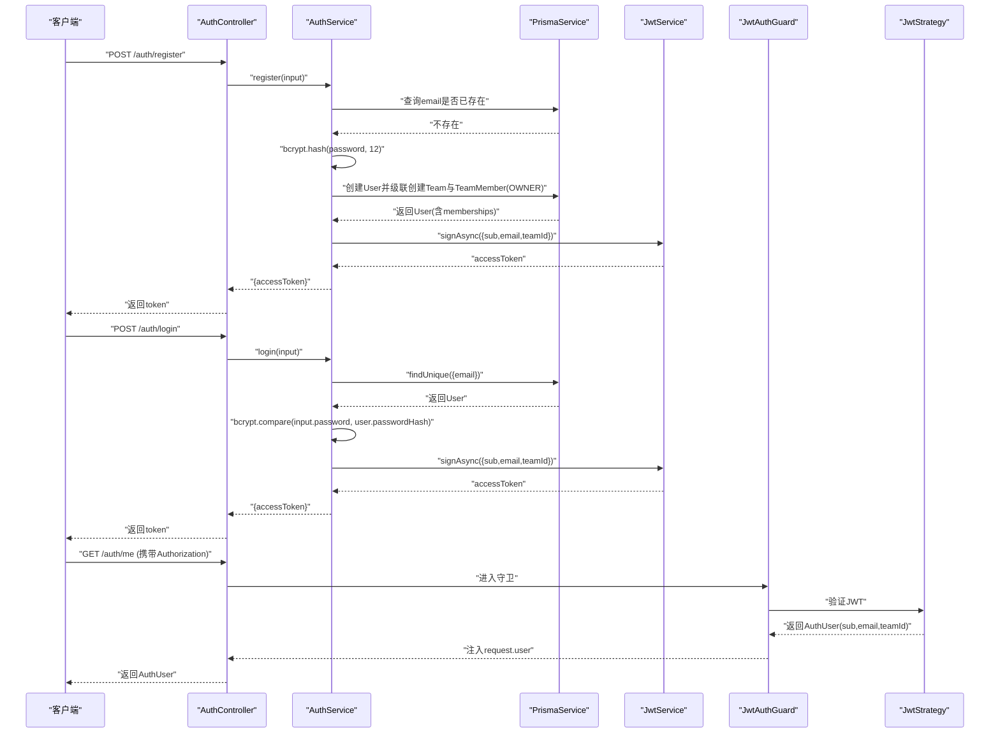
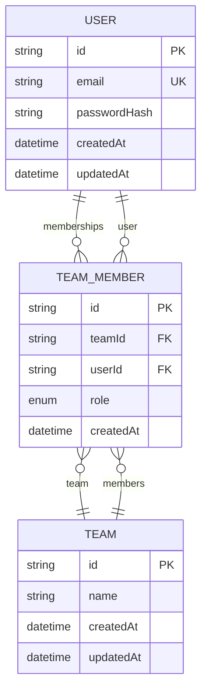
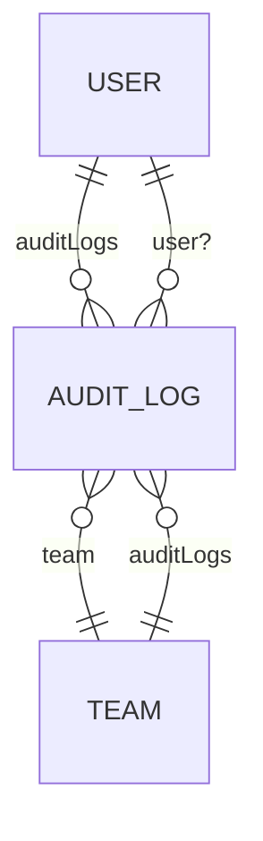
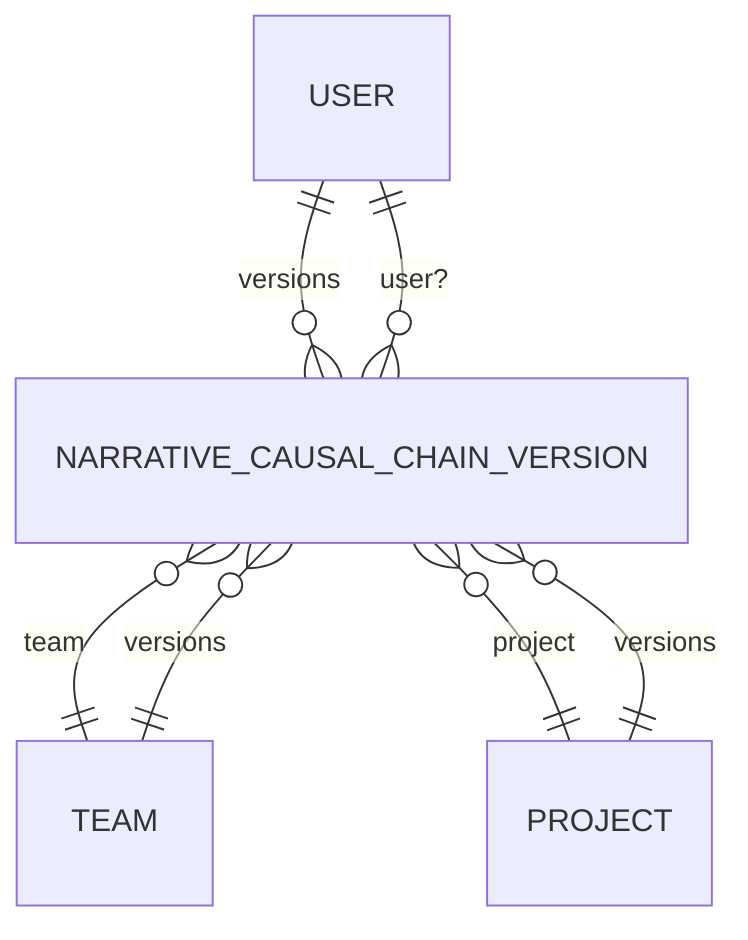
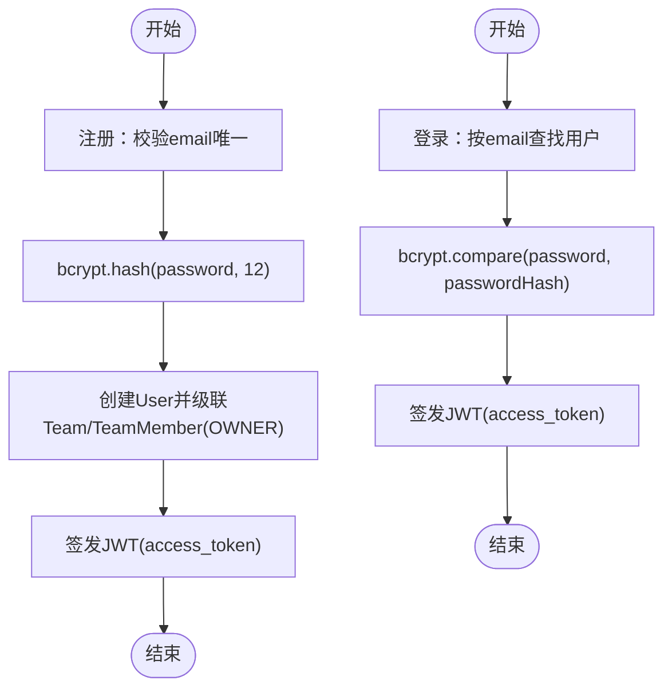
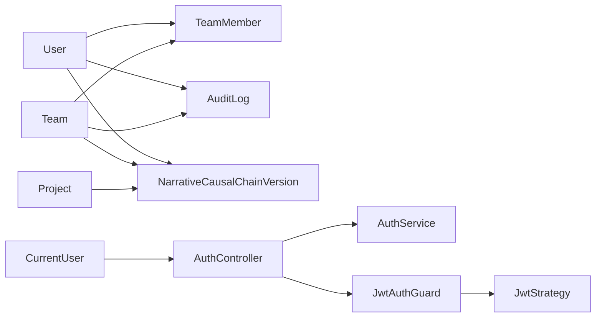

# 用户实体 (User)

<cite>
**本文引用的文件**
- [schema.prisma](file://apps/api/prisma/schema.prisma)
- [auth.service.ts](file://apps/api/src/auth/auth.service.ts)
- [auth.controller.ts](file://apps/api/src/auth/auth.controller.ts)
- [auth.types.ts](file://apps/api/src/auth/auth.types.ts)
- [jwt.strategy.ts](file://apps/api/src/auth/jwt.strategy.ts)
- [jwt-auth.guard.ts](file://apps/api/src/auth/jwt-auth.guard.ts)
- [current-user.decorator.ts](file://apps/api/src/auth/current-user.decorator.ts)
- [auth.ts](file://packages/shared/src/schemas/auth.ts)
- [projects.service.ts](file://apps/api/src/projects/projects.service.ts)
- [buildNarrativeCausalChain.ts](file://apps/worker/src/tasks/buildNarrativeCausalChain.ts)
</cite>

## 目录

1. [简介](#简介)
2. [项目结构](#项目结构)
3. [核心组件](#核心组件)
4. [架构总览](#架构总览)
5. [详细组件分析](#详细组件分析)
6. [依赖分析](#依赖分析)
7. [性能考量](#性能考量)
8. [故障排查指南](#故障排查指南)
9. [结论](#结论)
10. [附录](#附录)

## 简介

本文件围绕用户实体（User）展开，系统性阐述其字段设计目的与约束、与团队成员（TeamMember）、审计日志（AuditLog）、叙事因果链版本（NarrativeCausalChainVersion）之间的关系，并结合认证与授权机制，说明用户在团队协作中的角色与权限管理。同时给出数据库表结构要点、典型使用场景（注册、登录、密码哈希存储）及安全注意事项。

## 项目结构

- 用户实体定义位于 Prisma Schema 中，采用 PostgreSQL 数据源，使用 cuid() 作为主键生成策略，email 字段建立唯一索引，内置 createdAt/updatedAt 时间戳。
- 认证相关能力由 API 应用提供，包括注册、登录、JWT 签发与校验、当前用户提取等。
- 用户与团队协作通过 TeamMember 实体实现多对多关系；与审计日志（AuditLog）形成一对多关联；与叙事因果链版本（NarrativeCausalChainVersion）形成一对多关联，且在手动编辑时可携带用户标识。

```mermaid
graph TB
subgraph "API 层"
Ctl["AuthController<br/>处理注册/登录/当前用户"]
Svc["AuthService<br/>业务逻辑：注册/登录/JWT签发"]
Guard["JwtAuthGuard<br/>JWT鉴权守卫"]
Strat["JwtStrategy<br/>JWT载荷校验"]
Deco["CurrentUser<br/>参数装饰器"]
end
subgraph "领域模型Prisma"
U["User"]
TM["TeamMember"]
T["Team"]
AL["AuditLog"]
P["Project"]
NCV["NarrativeCausalChainVersion"]
end
Ctl --> Svc
Ctl --> Guard
Guard --> Strat
Deco --> Ctl
Svc --> U
U <- --> TM
T <- --> TM
U <- --> AL
T <- --> AL
P <- --> NCV
U <- --> NCV
```

图表来源

- [schema.prisma](file://apps/api/prisma/schema.prisma#L75-L114)
- [auth.controller.ts](file://apps/api/src/auth/auth.controller.ts#L9-L30)
- [auth.service.ts](file://apps/api/src/auth/auth.service.ts#L8-L77)
- [jwt.strategy.ts](file://apps/api/src/auth/jwt.strategy.ts#L14-L31)
- [jwt-auth.guard.ts](file://apps/api/src/auth/jwt-auth.guard.ts#L4-L5)
- [current-user.decorator.ts](file://apps/api/src/auth/current-user.decorator.ts#L4-L6)

章节来源

- [schema.prisma](file://apps/api/prisma/schema.prisma#L75-L114)
- [auth.controller.ts](file://apps/api/src/auth/auth.controller.ts#L9-L30)
- [auth.service.ts](file://apps/api/src/auth/auth.service.ts#L8-L77)
- [jwt.strategy.ts](file://apps/api/src/auth/jwt.strategy.ts#L14-L31)
- [jwt-auth.guard.ts](file://apps/api/src/auth/jwt-auth.guard.ts#L4-L5)
- [current-user.decorator.ts](file://apps/api/src/auth/current-user.decorator.ts#L4-L6)

## 核心组件

- 用户实体（User）
  - id：主键，cuid() 生成，保证全局唯一且不可预测。
  - email：唯一索引，用于登录凭证与账号识别。
  - passwordHash：存储经 bcrypt 哈希后的密码，明文不落库。
  - createdAt/updatedAt：自动维护创建与更新时间。
  - 关联关系：
    - memberships：与 TeamMember 的一对多，表示用户在各团队中的成员身份。
    - auditLogs：与 AuditLog 的一对多，记录用户相关操作。
    - narrativeCausalChainVersions：与 NarrativeCausalChainVersion 的一对多，记录用户触发的手动版本等。
- 团队成员（TeamMember）
  - 多对多桥接，包含 role（OWNER/ADMIN/MEMBER）与时间戳。
- 审计日志（AuditLog）
  - 记录团队内用户行为，包含 action、entityType、entityId、metadata 等。
- 叙事因果链版本（NarrativeCausalChainVersion）
  - 记录项目/团队维度的因果链快照，可由用户手动保存或由系统/AI生成。

章节来源

- [schema.prisma](file://apps/api/prisma/schema.prisma#L75-L174)

## 架构总览

用户在系统中的生命周期与交互路径如下：



图表来源

- [auth.controller.ts](file://apps/api/src/auth/auth.controller.ts#L13-L29)
- [auth.service.ts](file://apps/api/src/auth/auth.service.ts#L22-L73)
- [jwt.strategy.ts](file://apps/api/src/auth/jwt.strategy.ts#L24-L30)
- [jwt-auth.guard.ts](file://apps/api/src/auth/jwt-auth.guard.ts#L4-L5)
- [auth.types.ts](file://apps/api/src/auth/auth.types.ts#L1-L5)

## 详细组件分析

### 用户实体字段与约束

- id
  - 类型：String
  - 约束：@id，@default(cuid())
  - 设计目的：全局唯一标识，避免序列号暴露业务信息，提升安全性。
- email
  - 类型：String
  - 约束：@unique
  - 设计目的：作为登录凭证与账号唯一标识，配合唯一索引避免重复注册。
- passwordHash
  - 类型：String
  - 约束：无显式约束
  - 设计目的：存储 bcrypt 哈希后的密码，明文不入库，降低泄露风险。
- createdAt/updatedAt
  - 类型：DateTime
  - 约束：@default(now())/@updatedAt
  - 设计目的：自动记录创建与更新时间，便于审计与排序。

章节来源

- [schema.prisma](file://apps/api/prisma/schema.prisma#L75-L85)

### 用户与团队成员（TeamMember）的多对多关系

- User 与 TeamMember：一对多（memberships）
- TeamMember 与 Team：一对多（team）
- 复合唯一索引：@@unique([teamId, userId])，确保同一团队内用户唯一。
- 索引优化：@@index([userId])，加速按用户查询成员身份。



图表来源

- [schema.prisma](file://apps/api/prisma/schema.prisma#L75-L114)

章节来源

- [schema.prisma](file://apps/api/prisma/schema.prisma#L102-L114)

### 用户与审计日志（AuditLog）的关联

- User 与 AuditLog：一对多（auditLogs）
- AuditLog 可选关联用户（userId），便于追踪具体操作人。
- 索引：@@index([userId])，加速按用户检索审计记录。



图表来源

- [schema.prisma](file://apps/api/prisma/schema.prisma#L294-L309)

章节来源

- [schema.prisma](file://apps/api/prisma/schema.prisma#L294-L309)

### 用户与叙事因果链版本（NarrativeCausalChainVersion）的关联

- User 与 NarrativeCausalChainVersion：一对多（narrativeCausalChainVersions）
- 该关系在手动保存项目上下文变更时被使用，版本记录可携带 userId，便于溯源。
- 工作器在生成/恢复版本时，可选择不携带 userId（例如 AI 自动生成场景）。



图表来源

- [schema.prisma](file://apps/api/prisma/schema.prisma#L143-L174)
- [buildNarrativeCausalChain.ts](file://apps/worker/src/tasks/buildNarrativeCausalChain.ts#L290-L369)

章节来源

- [schema.prisma](file://apps/api/prisma/schema.prisma#L143-L174)
- [buildNarrativeCausalChain.ts](file://apps/worker/src/tasks/buildNarrativeCausalChain.ts#L290-L369)

### 认证与权限管理机制

- 注册流程
  - 校验邮箱唯一性，哈希密码，创建用户并级联创建首个团队与成员（OWNER 角色）。
- 登录流程
  - 根据 email 查询用户，使用 bcrypt 校验密码，签发包含 sub/email/teamId 的 JWT。
- 当前用户
  - 通过 JwtAuthGuard 与 JwtStrategy 校验 JWT，CurrentUser 装饰器将 AuthUser 注入请求对象。
- 权限边界
  - AuthUser 包含 userId、teamId、email，接口层通常以 teamId 作为资源访问边界，确保跨团队隔离。



图表来源

- [auth.service.ts](file://apps/api/src/auth/auth.service.ts#L22-L56)
- [auth.service.ts](file://apps/api/src/auth/auth.service.ts#L58-L73)

章节来源

- [auth.controller.ts](file://apps/api/src/auth/auth.controller.ts#L13-L29)
- [auth.service.ts](file://apps/api/src/auth/auth.service.ts#L22-L73)
- [jwt.strategy.ts](file://apps/api/src/auth/jwt.strategy.ts#L24-L30)
- [jwt-auth.guard.ts](file://apps/api/src/auth/jwt-auth.guard.ts#L4-L5)
- [current-user.decorator.ts](file://apps/api/src/auth/current-user.decorator.ts#L4-L6)
- [auth.types.ts](file://apps/api/src/auth/auth.types.ts#L1-L5)

### 数据库表结构示例（概念）

- User 表
  - 字段：id、email、passwordHash、createdAt、updatedAt
  - 索引：UNIQUE(email)、PK(id)
- TeamMember 表
  - 字段：id、teamId、userId、role、createdAt
  - 索引：UNIQUE(teamId,userId)、INDEX(userId)
- AuditLog 表
  - 字段：id、teamId、userId、action、entityType、entityId、metadata、createdAt
  - 索引：INDEX(teamId,createdAt)、INDEX(userId)
- NarrativeCausalChainVersion 表
  - 字段：id、teamId、projectId、userId、source、phase、completedPhase、validationStatus、chainSchemaVersion、label、note、basedOnVersionId、chain、createdAt
  - 索引：INDEX(projectId,createdAt)、INDEX(teamId,createdAt)、INDEX(userId)

章节来源

- [schema.prisma](file://apps/api/prisma/schema.prisma#L75-L174)

### 实际使用场景与安全考虑

- 用户注册
  - 输入：email、password、可选 teamName
  - 安全：密码使用 bcrypt 哈希，盐值强度为 12；email 唯一性约束防重复。
- 用户登录
  - 输入：email、password
  - 安全：bcrypt 对比，失败抛出未授权错误；登录成功后签发短期 JWT。
- 密码哈希存储
  - 存储：仅存储 passwordHash，不存储明文密码。
  - 验证：登录时使用 bcrypt.compare 进行匹配。
- 审计与溯源
  - 用户操作通过 AuditLog 记录，必要时可关联到具体用户，便于合规与问题追踪。
- 版本管理
  - 手动保存项目上下文时，可携带 userId，形成可追溯的版本历史；AI/恢复场景可不携带 userId。

章节来源

- [auth.service.ts](file://apps/api/src/auth/auth.service.ts#L22-L73)
- [auth.controller.ts](file://apps/api/src/auth/auth.controller.ts#L13-L29)
- [auth.ts](file://packages/shared/src/schemas/auth.ts#L3-L16)
- [projects.service.ts](file://apps/api/src/projects/projects.service.ts#L171-L196)
- [buildNarrativeCausalChain.ts](file://apps/worker/src/tasks/buildNarrativeCausalChain.ts#L290-L369)

## 依赖分析

- User 与 TeamMember：通过外键 teamId、userId 建立多对多桥接，确保用户在不同团队的成员身份独立管理。
- User 与 AuditLog：通过 userId 建立一对多，便于按用户检索审计记录。
- User 与 NarrativeCausalChainVersion：通过 userId 建立一对多，用于手动保存版本的归属。
- 认证链路：JwtAuthGuard + JwtStrategy 校验 JWT，CurrentUser 装饰器注入 AuthUser，贯穿 API 控制器。



图表来源

- [schema.prisma](file://apps/api/prisma/schema.prisma#L75-L174)
- [auth.controller.ts](file://apps/api/src/auth/auth.controller.ts#L9-L30)
- [jwt.strategy.ts](file://apps/api/src/auth/jwt.strategy.ts#L14-L31)
- [jwt-auth.guard.ts](file://apps/api/src/auth/jwt-auth.guard.ts#L4-L5)
- [current-user.decorator.ts](file://apps/api/src/auth/current-user.decorator.ts#L4-L6)

章节来源

- [schema.prisma](file://apps/api/prisma/schema.prisma#L75-L174)
- [auth.controller.ts](file://apps/api/src/auth/auth.controller.ts#L9-L30)
- [jwt.strategy.ts](file://apps/api/src/auth/jwt.strategy.ts#L14-L31)
- [jwt-auth.guard.ts](file://apps/api/src/auth/jwt-auth.guard.ts#L4-L5)
- [current-user.decorator.ts](file://apps/api/src/auth/current-user.decorator.ts#L4-L6)

## 性能考量

- 索引策略
  - User.email 唯一索引，保障注册/登录查询效率。
  - TeamMember.userId 索引，加速按用户查询成员身份。
  - AuditLog.userId 索引，加速按用户检索审计记录。
- 哈希成本
  - bcrypt 使用 12 的成本因子，平衡安全与性能；可根据硬件能力调整。
- 事务与级联
  - 注册时通过事务创建用户与团队，减少不一致风险；级联创建 TeamMember 降低多次往返。

## 故障排查指南

- 注册失败：Email 已存在
  - 现象：抛出冲突异常。
  - 排查：确认 email 是否已被占用；检查唯一索引是否生效。
- 登录失败：凭据无效
  - 现象：抛出未授权异常。
  - 排查：确认 email 是否正确；确认 bcrypt 哈希匹配；检查 JWT 签发配置。
- 无团队用户
  - 现象：登录后无法获取 teamId。
  - 排查：确认用户是否已创建团队成员记录；检查 memberships 是否存在。
- 审计记录缺失
  - 现象：按用户检索不到审计记录。
  - 排查：确认 AuditLog.userId 是否正确写入；检查索引是否存在。

章节来源

- [auth.service.ts](file://apps/api/src/auth/auth.service.ts#L22-L73)
- [jwt.strategy.ts](file://apps/api/src/auth/jwt.strategy.ts#L24-L30)

## 结论

用户实体（User）在本系统中承担核心身份与权限边界职责。通过 cuid() 主键、email 唯一索引与 bcrypt 密码哈希，确保身份标识安全与登录验证可靠。借助 TeamMember 实现多团队协作，AuditLog 提供可追溯的审计能力，NarrativeCausalChainVersion 则支撑项目创作过程的版本化管理。认证链路基于 JWT，结合守卫与装饰器，形成清晰的权限控制与上下文注入机制。

## 附录

- 相关类型定义
  - RegisterInput/LoginInput：约束 email 格式与 password 长度范围。
- 重要实现位置
  - 注册/登录：AuthService
  - JWT 签发与校验：JwtService、JwtStrategy
  - 当前用户注入：CurrentUser 装饰器
  - 版本写入：NarrativeCausalChainVersion 写入逻辑（手动/恢复）

章节来源

- [auth.ts](file://packages/shared/src/schemas/auth.ts#L3-L16)
- [auth.service.ts](file://apps/api/src/auth/auth.service.ts#L14-L20)
- [jwt.strategy.ts](file://apps/api/src/auth/jwt.strategy.ts#L14-L31)
- [current-user.decorator.ts](file://apps/api/src/auth/current-user.decorator.ts#L4-L6)
- [projects.service.ts](file://apps/api/src/projects/projects.service.ts#L171-L196)
- [buildNarrativeCausalChain.ts](file://apps/worker/src/tasks/buildNarrativeCausalChain.ts#L290-L369)
