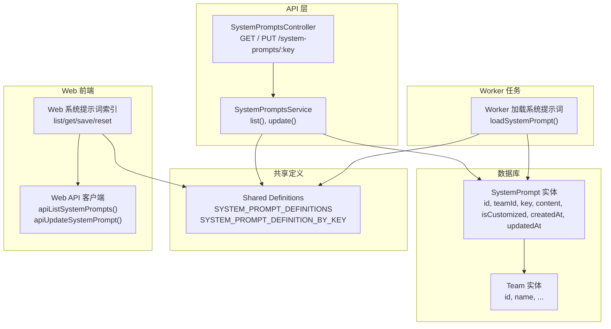
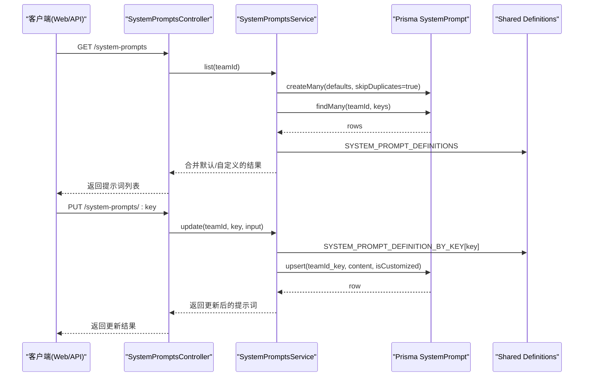
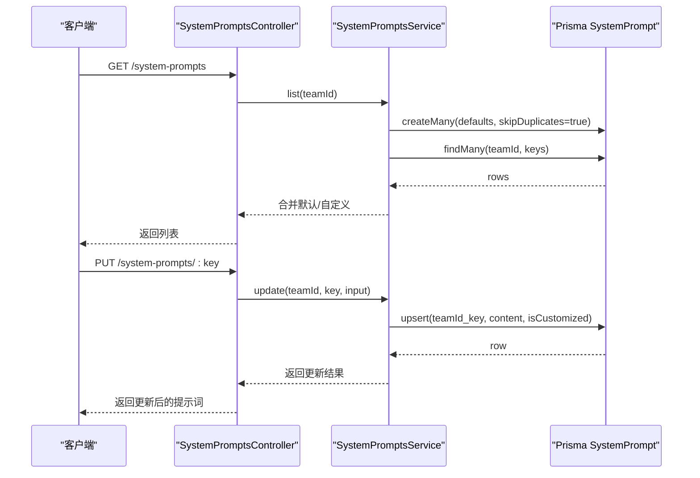
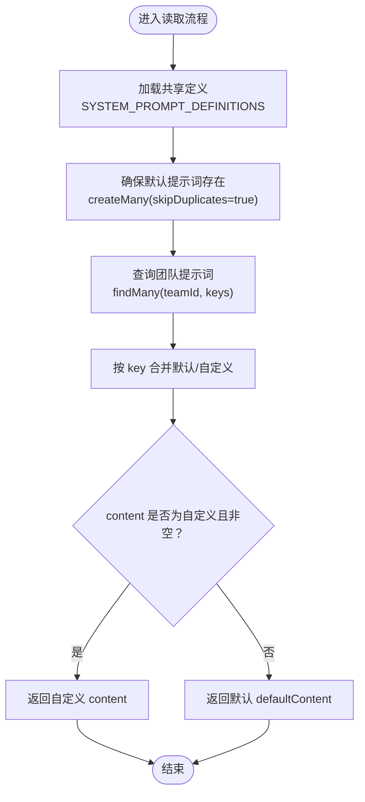
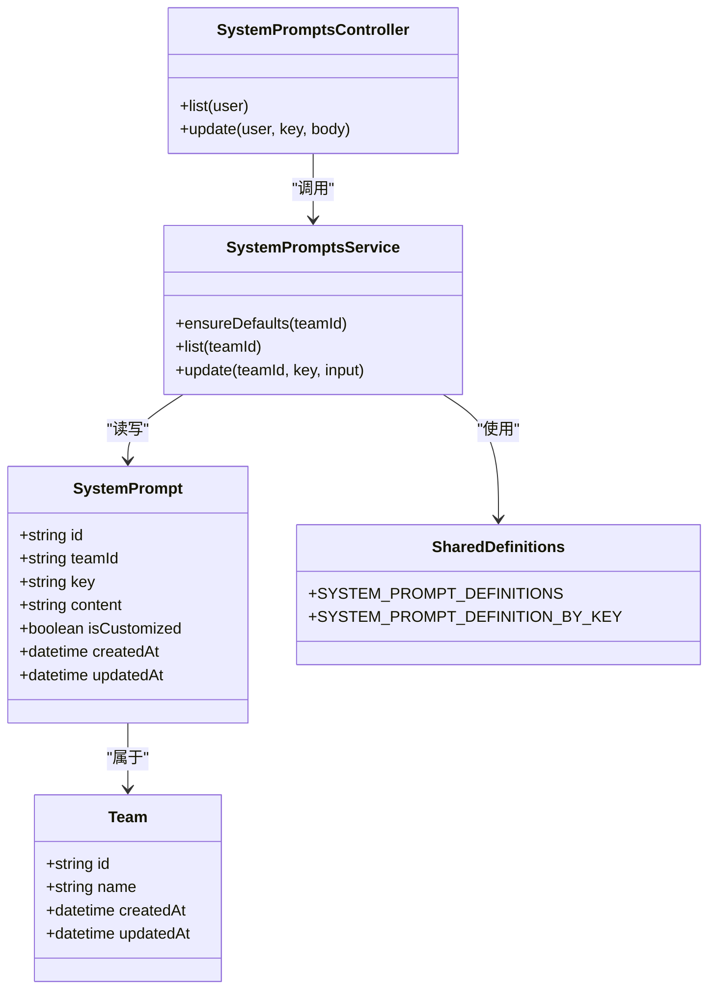
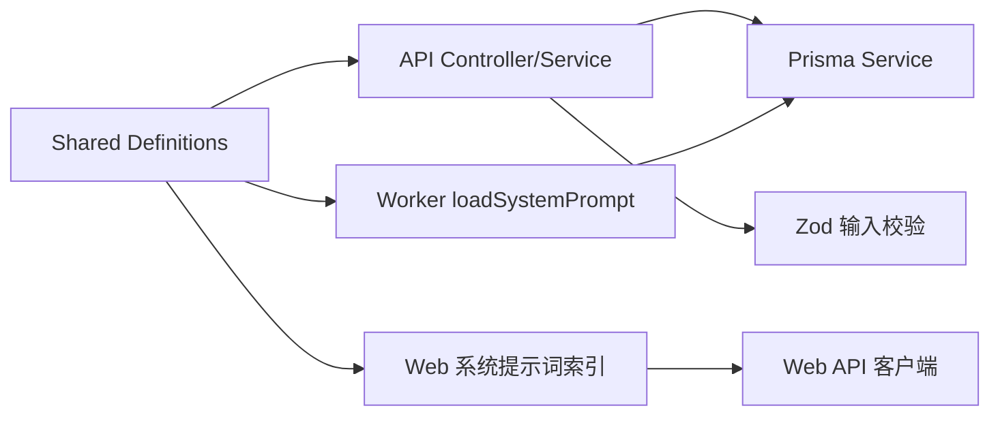

# 系统提示词实体 (SystemPrompt)

<cite>
**本文档引用的文件**
- [schema.prisma](file://apps/api/prisma/schema.prisma)
- [system-prompts.service.ts](file://apps/api/src/system-prompts/system-prompts.service.ts)
- [system-prompts.controller.ts](file://apps/api/src/system-prompts/system-prompts.controller.ts)
- [systemPrompts.ts](file://packages/shared/src/systemPrompts.ts)
- [systemPrompt.ts](file://packages/shared/src/schemas/systemPrompt.ts)
- [systemPrompts.ts](file://apps/web/src/lib/systemPrompts/index.ts)
- [systemPrompts.ts](file://apps/web/src/lib/api/systemPrompts.ts)
- [systemPrompts.ts](file://apps/worker/src/tasks/systemPrompts.ts)
</cite>

## 目录

1. [简介](#简介)
2. [项目结构](#项目结构)
3. [核心组件](#核心组件)
4. [架构总览](#架构总览)
5. [详细组件分析](#详细组件分析)
6. [依赖关系分析](#依赖关系分析)
7. [性能考量](#性能考量)
8. [故障排查指南](#故障排查指南)
9. [结论](#结论)
10. [附录](#附录)

## 简介

本文件面向系统提示词实体（SystemPrompt）提供完整技术文档，涵盖字段定义、键值系统、自定义标记、与团队（Team）的关联关系、唯一索引保障、以及在 AI 工作流中的应用场景。系统提示词用于规范各类 AI 生成任务的提示词模板，支持预设模板与团队自定义模板的统一管理，确保生成质量与一致性。

## 项目结构

系统提示词实体位于数据库 schema 中，配合 API 控制器、服务层、共享定义、Web 前端与 Worker 任务模块共同实现“预设模板 + 团队自定义”的双层提示词体系。

图表来源

- [schema.prisma](file://apps/api/prisma/schema.prisma#L337-L350)
- [system-prompts.controller.ts](file://apps/api/src/system-prompts/system-prompts.controller.ts#L1-L26)
- [system-prompts.service.ts](file://apps/api/src/system-prompts/system-prompts.service.ts#L1-L85)
- [systemPrompts.ts](file://packages/shared/src/systemPrompts.ts#L1-L1395)
- [systemPrompts.ts](file://apps/web/src/lib/systemPrompts/index.ts#L1-L197)
- [systemPrompts.ts](file://apps/web/src/lib/api/systemPrompts.ts#L1-L30)
- [systemPrompts.ts](file://apps/worker/src/tasks/systemPrompts.ts#L1-L27)

章节来源

- [schema.prisma](file://apps/api/prisma/schema.prisma#L337-L350)
- [system-prompts.controller.ts](file://apps/api/src/system-prompts/system-prompts.controller.ts#L1-L26)
- [system-prompts.service.ts](file://apps/api/src/system-prompts/system-prompts.service.ts#L1-L85)
- [systemPrompts.ts](file://packages/shared/src/systemPrompts.ts#L1-L1395)
- [systemPrompts.ts](file://apps/web/src/lib/systemPrompts/index.ts#L1-L197)
- [systemPrompts.ts](file://apps/web/src/lib/api/systemPrompts.ts#L1-L30)
- [systemPrompts.ts](file://apps/worker/src/tasks/systemPrompts.ts#L1-L27)

## 核心组件

- 数据库实体 SystemPrompt
  - 字段：id（主键，cuid）、teamId（外键，关联 Team）、key（键值，唯一索引的一部分）、content（提示词内容）、isCustomized（是否自定义，默认 false）、createdAt/updatedAt
  - 唯一索引：(teamId, key)
  - 关系：属于 Team
- 共享定义
  - SYSTEM_PROMPT_DEFINITIONS：系统内置的提示词定义集合（包含 key、title、description、category、defaultContent）
  - SYSTEM_PROMPT_DEFINITION_BY_KEY：按 key 建立的映射，用于快速查找
- API 层
  - SystemPromptsController：提供 GET /system-prompts 与 PUT /system-prompts/:key 接口
  - SystemPromptsService：负责确保默认提示词、查询与更新提示词
- Web 前端
  - listSystemPrompts/getSystemPromptContent/saveSystemPromptContent/resetSystemPromptContent：统一管理提示词列表与单个提示词的读取、保存与重置
  - Web API 客户端：封装 /system-prompts 与 /system-prompts/:key 的请求
- Worker 任务
  - loadSystemPrompt：按 teamId + key 读取提示词，优先返回团队自定义内容，否则回退到默认内容

章节来源

- [schema.prisma](file://apps/api/prisma/schema.prisma#L337-L350)
- [systemPrompts.ts](file://packages/shared/src/systemPrompts.ts#L1-L1395)
- [system-prompts.controller.ts](file://apps/api/src/system-prompts/system-prompts.controller.ts#L1-L26)
- [system-prompts.service.ts](file://apps/api/src/system-prompts/system-prompts.service.ts#L1-L85)
- [systemPrompts.ts](file://apps/web/src/lib/systemPrompts/index.ts#L1-L197)
- [systemPrompts.ts](file://apps/web/src/lib/api/systemPrompts.ts#L1-L30)
- [systemPrompts.ts](file://apps/worker/src/tasks/systemPrompts.ts#L1-L27)

## 架构总览

系统提示词的读取与更新遵循“默认模板 + 团队自定义”的双层策略：

- 首次访问某团队时，服务端会批量插入该团队的默认提示词（skipDuplicates 避免并发冲突）
- 查询时，若团队对该 key 存在自定义且内容非空，则返回自定义内容；否则返回默认模板
- 更新时，比较提交内容与默认模板是否一致，决定 isCustomized 标记
- Worker 侧加载提示词时，同样遵循“自定义优先，否则默认”的策略

图表来源

- [system-prompts.controller.ts](file://apps/api/src/system-prompts/system-prompts.controller.ts#L1-L26)
- [system-prompts.service.ts](file://apps/api/src/system-prompts/system-prompts.service.ts#L1-L85)
- [systemPrompts.ts](file://packages/shared/src/systemPrompts.ts#L1-L1395)
- [schema.prisma](file://apps/api/prisma/schema.prisma#L337-L350)

章节来源

- [system-prompts.controller.ts](file://apps/api/src/system-prompts/system-prompts.controller.ts#L1-L26)
- [system-prompts.service.ts](file://apps/api/src/system-prompts/system-prompts.service.ts#L1-L85)
- [systemPrompts.ts](file://packages/shared/src/systemPrompts.ts#L1-L1395)
- [schema.prisma](file://apps/api/prisma/schema.prisma#L337-L350)

## 详细组件分析

### 字段定义与设计目的

- id（主键，cuid）
  - 设计目的：全局唯一标识，便于跨模块引用与审计
- teamId（外键，关联 Team）
  - 设计目的：限定提示词作用域为团队级别，实现团队内隔离与权限控制
- key（键值）
  - 设计目的：稳定键值，用于在共享定义中定位对应的默认模板；唯一索引的一部分，保证同一团队内 key 唯一
- content（提示词内容）
  - 设计目的：存储实际使用的提示词文本；可为默认模板或团队自定义内容
- isCustomized（是否自定义）
  - 设计目的：标记 content 是否来自团队自定义；用于决定读取优先级（自定义优先于默认）

章节来源

- [schema.prisma](file://apps/api/prisma/schema.prisma#L337-L350)

### 键值系统（key 字段）

- key 的组织方式
  - 采用“前缀.子模块.用途.来源”命名，例如：
    - workflow.\*：工作流相关（分镜、关键帧、运动、台词、JSON 修复、剧集规划、叙事因果链、故事板细化等）
    - workflow.actionBeats.\*：动作节拍相关（ActionPlan、KeyframeGroup、连续性修复等）
    - workflow.fix.\*：格式修复相关（场景锚点、关键帧提示词、运动提示词、JSON 修复、故事板组等）
    - workflow.narrativeCausalChain.\*：叙事因果链相关（Phase1/2/3A/3B/4）
    - ui.systemPrompts.\*：UI 系统提示词优化器
    - agent.canvas\*：画布工作流构建 Agent
    - web.\*：Web 本地模式下的用户提示词（上下文压缩、级联更新、多模态、角色/世界设定等）
- 作用
  - 作为共享定义中的稳定键，用于：
    - API/Worker 侧按 key 查找默认模板
    - 前端展示与分类（category）
    - 唯一索引（teamId + key）保证键值唯一性

章节来源

- [systemPrompts.ts](file://packages/shared/src/systemPrompts.ts#L1-L1395)
- [schema.prisma](file://apps/api/prisma/schema.prisma#L337-L350)

### 自定义标记（isCustomized 字段）

- 读取优先级
  - 若某 key 存在团队自定义且 content 非空，则优先使用自定义内容
  - 否则回退到默认模板（defaultContent）
- 更新策略
  - 当提交的 content 与默认模板 trim 后一致时，isCustomized=false（表示使用默认）
  - 否则 isCustomized=true（表示使用自定义）
- 保证机制
  - 唯一索引 (teamId, key) 保证同一团队内 key 唯一，避免重复插入
  - upsert 保证幂等更新

章节来源

- [system-prompts.service.ts](file://apps/api/src/system-prompts/system-prompts.service.ts#L42-L83)
- [systemPrompts.ts](file://apps/worker/src/tasks/systemPrompts.ts#L14-L26)
- [schema.prisma](file://apps/api/prisma/schema.prisma#L337-L350)

### 与 Team 的关联关系

- SystemPrompt 与 Team 的关系
  - SystemPrompt.team -> Team（一对多）
  - Team.systemPrompts -> SystemPrompt[]
- 业务意义
  - 每个团队拥有独立的系统提示词集合
  - 支持团队内部模板定制与共享，同时不影响其他团队

章节来源

- [schema.prisma](file://apps/api/prisma/schema.prisma#L87-L100)
- [schema.prisma](file://apps/api/prisma/schema.prisma#L337-L350)

### 唯一索引与键值唯一性

- 唯一索引
  - @@unique([teamId, key])
- 作用
  - 保证同一团队内 key 唯一，避免重复定义
  - 通过 upsert 与 createMany(skipDuplicates) 降低并发写入冲突

章节来源

- [schema.prisma](file://apps/api/prisma/schema.prisma#L348-L348)

### API 工作流程（序列图）

图表来源

- [system-prompts.controller.ts](file://apps/api/src/system-prompts/system-prompts.controller.ts#L1-L26)
- [system-prompts.service.ts](file://apps/api/src/system-prompts/system-prompts.service.ts#L30-L83)
- [schema.prisma](file://apps/api/prisma/schema.prisma#L337-L350)

章节来源

- [system-prompts.controller.ts](file://apps/api/src/system-prompts/system-prompts.controller.ts#L1-L26)
- [system-prompts.service.ts](file://apps/api/src/system-prompts/system-prompts.service.ts#L30-L83)
- [schema.prisma](file://apps/api/prisma/schema.prisma#L337-L350)

### 读取流程（算法流程图）

图表来源

- [system-prompts.service.ts](file://apps/api/src/system-prompts/system-prompts.service.ts#L30-L59)
- [systemPrompts.ts](file://packages/shared/src/systemPrompts.ts#L1-L1395)

章节来源

- [system-prompts.service.ts](file://apps/api/src/system-prompts/system-prompts.service.ts#L30-L59)
- [systemPrompts.ts](file://packages/shared/src/systemPrompts.ts#L1-L1395)

### 类关系图（代码级）

图表来源

- [schema.prisma](file://apps/api/prisma/schema.prisma#L337-L350)
- [system-prompts.controller.ts](file://apps/api/src/system-prompts/system-prompts.controller.ts#L1-L26)
- [system-prompts.service.ts](file://apps/api/src/system-prompts/system-prompts.service.ts#L1-L85)
- [systemPrompts.ts](file://packages/shared/src/systemPrompts.ts#L1-L1395)

章节来源

- [schema.prisma](file://apps/api/prisma/schema.prisma#L337-L350)
- [system-prompts.controller.ts](file://apps/api/src/system-prompts/system-prompts.controller.ts#L1-L26)
- [system-prompts.service.ts](file://apps/api/src/system-prompts/system-prompts.service.ts#L1-L85)
- [systemPrompts.ts](file://packages/shared/src/systemPrompts.ts#L1-L1395)

## 依赖关系分析

- 组件耦合
  - SystemPromptsService 依赖 PrismaService 与 Shared Definitions
  - SystemPromptsController 依赖 SystemPromptsService 与 JWT 认证
  - Web 前端依赖 Shared Definitions 与 API 客户端
  - Worker 任务依赖 Shared Definitions 与 Prisma Client
- 外部依赖
  - Prisma ORM（数据持久化）
  - Zod（输入校验）
  - NestJS（API 框架）
- 潜在循环依赖
  - 通过 Shared Definitions 作为桥梁，避免控制器与服务之间的直接循环导入

图表来源

- [system-prompts.controller.ts](file://apps/api/src/system-prompts/system-prompts.controller.ts#L1-L26)
- [system-prompts.service.ts](file://apps/api/src/system-prompts/system-prompts.service.ts#L1-L85)
- [systemPrompts.ts](file://packages/shared/src/systemPrompts.ts#L1-L1395)
- [systemPrompts.ts](file://apps/web/src/lib/systemPrompts/index.ts#L1-L197)
- [systemPrompts.ts](file://apps/web/src/lib/api/systemPrompts.ts#L1-L30)
- [systemPrompts.ts](file://apps/worker/src/tasks/systemPrompts.ts#L1-L27)

章节来源

- [system-prompts.controller.ts](file://apps/api/src/system-prompts/system-prompts.controller.ts#L1-L26)
- [system-prompts.service.ts](file://apps/api/src/system-prompts/system-prompts.service.ts#L1-L85)
- [systemPrompts.ts](file://packages/shared/src/systemPrompts.ts#L1-L1395)
- [systemPrompts.ts](file://apps/web/src/lib/systemPrompts/index.ts#L1-L197)
- [systemPrompts.ts](file://apps/web/src/lib/api/systemPrompts.ts#L1-L30)
- [systemPrompts.ts](file://apps/worker/src/tasks/systemPrompts.ts#L1-L27)

## 性能考量

- 批量写入
  - 使用 createMany(skipDuplicates=true) 在首次访问时批量写入默认提示词，避免重复写入与并发冲突
- 查询优化
  - 通过 teamId + key 的唯一索引与 in 查询 keys，减少 IO
  - 前端缓存 API 结果，减少重复请求
- 更新幂等
  - upsert 保证更新操作幂等，避免重复写入
- 前端本地存储
  - Web 本地模式下使用 localStorage 缓存自定义提示词，减少网络请求

章节来源

- [system-prompts.service.ts](file://apps/api/src/system-prompts/system-prompts.service.ts#L17-L28)
- [system-prompts.service.ts](file://apps/api/src/system-prompts/system-prompts.service.ts#L36-L39)
- [systemPrompts.ts](file://apps/web/src/lib/systemPrompts/index.ts#L64-L77)

## 故障排查指南

- 提示词未生效
  - 检查 key 是否存在于 SYSTEM_PROMPT_DEFINITIONS
  - 确认团队是否存在该 key 的记录，且 isCustomized=true 且 content 非空
  - 若无记录，确认 ensureDefaults 是否成功执行
- 更新失败
  - 确认输入 content 非空且通过 Zod 校验
  - 检查唯一索引冲突（teamId + key）
- Worker 读取不到自定义提示词
  - 确认 teamId 与 key 正确
  - 检查数据库连接与查询异常处理（try/catch 回退默认）

章节来源

- [system-prompts.service.ts](file://apps/api/src/system-prompts/system-prompts.service.ts#L61-L83)
- [systemPrompts.ts](file://apps/worker/src/tasks/systemPrompts.ts#L14-L26)
- [systemPrompt.ts](file://packages/shared/src/schemas/systemPrompt.ts#L1-L9)

## 结论

SystemPrompt 实体通过“默认模板 + 团队自定义”的双层策略，实现了可扩展、可维护、可审计的系统提示词管理体系。借助共享定义、唯一索引与 upsert 幂等更新，系统在保证一致性的同时，允许团队灵活定制提示词，满足不同工作流与业务场景的需求。

## 附录

### 字段与类型定义

- SystemPrompt
  - id: string (主键, cuid)
  - teamId: string (外键)
  - key: string (键值)
  - content: string (提示词内容)
  - isCustomized: boolean (是否自定义)
  - createdAt/updatedAt: datetime
- Team
  - id: string (主键, cuid)
  - name: string
  - createdAt/updatedAt: datetime
  - systemPrompts: SystemPrompt[]

章节来源

- [schema.prisma](file://apps/api/prisma/schema.prisma#L87-L100)
- [schema.prisma](file://apps/api/prisma/schema.prisma#L337-L350)

### API 定义

- GET /system-prompts
  - 返回：ApiSystemPrompt[]
  - 字段：key, title, description, category, content, defaultContent, createdAt, updatedAt
- PUT /system-prompts/:key
  - 请求体：{ content: string }
  - 返回：ApiSystemPrompt

章节来源

- [systemPrompts.ts](file://apps/web/src/lib/api/systemPrompts.ts#L1-L30)
- [system-prompts.controller.ts](file://apps/api/src/system-prompts/system-prompts.controller.ts#L14-L23)
- [systemPrompt.ts](file://packages/shared/src/schemas/systemPrompt.ts#L1-L9)
