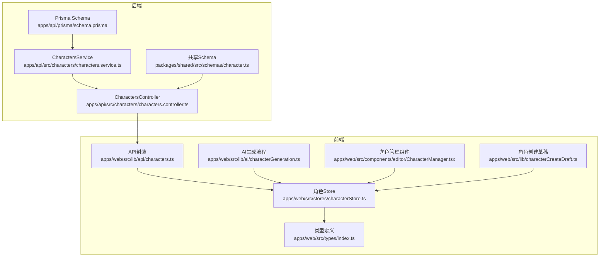
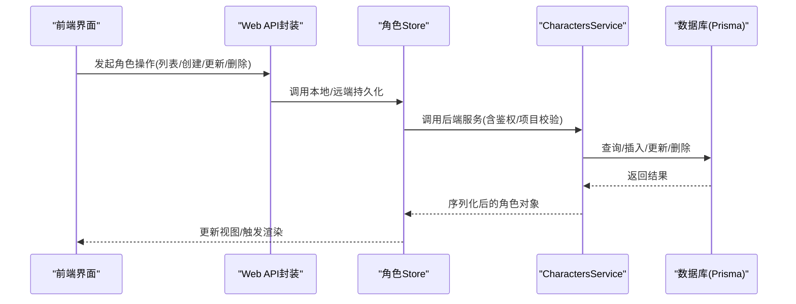
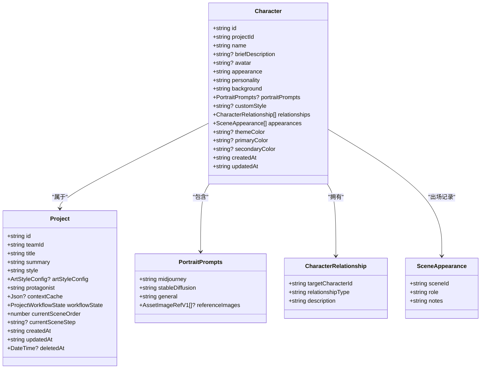
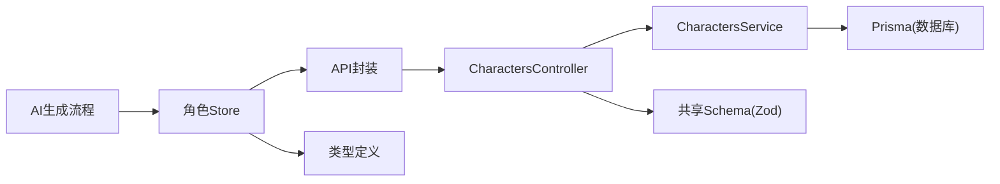
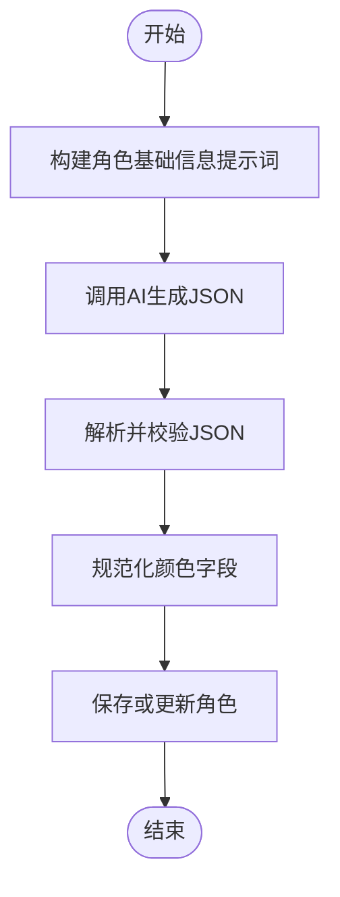

# 角色实体 (Character)

<cite>
**本文档引用的文件**
- [schema.prisma](file://apps/api/prisma/schema.prisma)
- [character.ts（共享Schema）](file://packages/shared/src/schemas/character.ts)
- [characters.service.ts](file://apps/api/src/characters/characters.service.ts)
- [characters.controller.ts](file://apps/api/src/characters/characters.controller.ts)
- [character.ts（类型定义）](file://apps/web/src/types/index.ts)
- [characterStore.ts](file://apps/web/src/stores/characterStore.ts)
- [characters.ts（Web API封装）](file://apps/web/src/lib/api/characters.ts)
- [characterGeneration.ts](file://apps/web/src/lib/ai/characterGeneration.ts)
- [CharacterManager.tsx](file://apps/web/src/components/editor/CharacterManager.tsx)
- [characterCreateDraft.ts](file://apps/web/src/lib/characterCreateDraft.ts)
</cite>

## 目录

1. [简介](#简介)
2. [项目结构](#项目结构)
3. [核心组件](#核心组件)
4. [架构总览](#架构总览)
5. [详细组件分析](#详细组件分析)
6. [依赖关系分析](#依赖关系分析)
7. [性能考量](#性能考量)
8. [故障排查指南](#故障排查指南)
9. [结论](#结论)
10. [附录](#附录)

## 简介

本文件系统性阐述角色实体（Character）在叙事创作与AI生成中的设计与实现，涵盖字段定义、业务职责、前后端协作、与项目（Project）的一对多关系、角色关系管理与出场统计、以及在AI角色生成与个性化定制中的应用场景。目标是帮助开发者与创作者理解并高效使用角色实体，支撑高质量的叙事创作与视觉生成工作流。

## 项目结构

角色实体横跨后端数据库模型、共享Schema、API服务层、Web前端类型与状态管理、以及AI生成流程，形成“模型-接口-状态-生成”的闭环。

图表来源

- [schema.prisma](file://apps/api/prisma/schema.prisma#L235-L257)
- [characters.service.ts](file://apps/api/src/characters/characters.service.ts#L24-L118)
- [characters.controller.ts](file://apps/api/src/characters/characters.controller.ts#L1-L47)
- [character.ts（共享Schema）](file://packages/shared/src/schemas/character.ts#L1-L32)
- [character.ts（类型定义）](file://apps/web/src/types/index.ts#L852-L891)
- [characterStore.ts](file://apps/web/src/stores/characterStore.ts#L1-L346)
- [characters.ts（Web API封装）](file://apps/web/src/lib/api/characters.ts#L1-L76)
- [characterGeneration.ts](file://apps/web/src/lib/ai/characterGeneration.ts#L1-L212)
- [CharacterManager.tsx](file://apps/web/src/components/editor/CharacterManager.tsx#L1537-L1560)
- [characterCreateDraft.ts](file://apps/web/src/lib/characterCreateDraft.ts#L1-L116)

章节来源

- [schema.prisma](file://apps/api/prisma/schema.prisma#L235-L257)
- [character.ts（共享Schema）](file://packages/shared/src/schemas/character.ts#L1-L32)
- [characters.service.ts](file://apps/api/src/characters/characters.service.ts#L24-L118)
- [characters.controller.ts](file://apps/api/src/characters/characters.controller.ts#L1-L47)
- [character.ts（类型定义）](file://apps/web/src/types/index.ts#L852-L891)
- [characterStore.ts](file://apps/web/src/stores/characterStore.ts#L1-L346)
- [characters.ts（Web API封装）](file://apps/web/src/lib/api/characters.ts#L1-L76)
- [characterGeneration.ts](file://apps/web/src/lib/ai/characterGeneration.ts#L1-L212)
- [CharacterManager.tsx](file://apps/web/src/components/editor/CharacterManager.tsx#L1537-L1560)
- [characterCreateDraft.ts](file://apps/web/src/lib/characterCreateDraft.ts#L1-L116)

## 核心组件

- 数据模型（Prisma）
  - 角色实体包含主键id、外键projectId、基础信息（name、briefDescription、avatar）、设定细节（appearance、personality、background）、AI生成相关字段（portraitPrompts、customStyle）、关系与出场记录（relationships、appearances）、主题色（themeColor、primaryColor、secondaryColor）及标准时间戳。
  - 与Project建立一对多关系，通过索引优化查询。
- 共享Schema（Zod）
  - 定义创建/更新输入的字段范围、默认值与可选性，确保前后端一致的校验规则。
- API服务层
  - 提供列表、创建、更新、删除能力，并进行项目归属校验与日期序列化。
- 前端类型与状态
  - 定义Character、PortraitPrompts、CharacterRelationship、SceneAppearance等类型，统一前后端契约。
  - Store负责本地/远端持久化、批量操作、出场记录与定妆照提示词更新。
- AI生成流程
  - 提供构建角色基础信息与定妆照提示词的提示模板与解析逻辑，支持多格式输出与颜色规范化。

章节来源

- [schema.prisma](file://apps/api/prisma/schema.prisma#L235-L257)
- [character.ts（共享Schema）](file://packages/shared/src/schemas/character.ts#L3-L29)
- [characters.service.ts](file://apps/api/src/characters/characters.service.ts#L35-L114)
- [character.ts（类型定义）](file://apps/web/src/types/index.ts#L852-L891)
- [characterStore.ts](file://apps/web/src/stores/characterStore.ts#L94-L120)
- [characterGeneration.ts](file://apps/web/src/lib/ai/characterGeneration.ts#L81-L119)

## 架构总览

角色实体贯穿“数据模型—接口—状态—生成”的全链路，形成可扩展的角色管理与AI驱动的创作闭环。

图表来源

- [characters.ts（Web API封装）](file://apps/web/src/lib/api/characters.ts#L6-L75)
- [characterStore.ts](file://apps/web/src/stores/characterStore.ts#L152-L332)
- [characters.service.ts](file://apps/api/src/characters/characters.service.ts#L35-L114)
- [schema.prisma](file://apps/api/prisma/schema.prisma#L235-L257)

## 详细组件分析

### 字段定义与设计目的

- id（主键，cuid()生成）
  - 设计目的：全局唯一标识，便于跨模块引用与追踪。
- projectId（外键）
  - 设计目的：限定角色归属项目，保证数据隔离与权限控制。
- name
  - 设计目的：角色名称，用于展示与排序。
- briefDescription
  - 设计目的：简要描述，驱动AI生成完整角色卡。
- avatar
  - 设计目的：角色头像URL，用于界面显示。
- appearance
  - 设计目的：外观描述，强调可复现的视觉锚点。
- personality
  - 设计目的：性格特征，支撑表演与对白风格。
- background
  - 设计目的：背景故事，连接项目设定与动机目标。
- portraitPrompts
  - 设计目的：多格式定妆照提示词（Midjourney/SD/通用），支持参考图绑定。
- customStyle
  - 设计目的：角色专属画风覆盖，提升风格一致性。
- relationships
  - 设计目的：角色关系集合，支持类型与描述，用于上下文注入与关系可视化。
- appearances
  - 设计目的：出场记录，按场景与角色定位（主/配角/背景）统计。
- themeColor（已弃用，保留兼容）
  - 设计目的：早期主题色字段，现由primaryColor/secondaryColor替代。
- primaryColor/secondaryColor
  - 设计目的：角色主辅色，用于AI生成定妆照与分镜描述的颜色一致性。

章节来源

- [schema.prisma](file://apps/api/prisma/schema.prisma#L235-L257)
- [character.ts（共享Schema）](file://packages/shared/src/schemas/character.ts#L3-L23)
- [character.ts（类型定义）](file://apps/web/src/types/index.ts#L852-L891)
- [characterGeneration.ts](file://apps/web/src/lib/ai/characterGeneration.ts#L30-L36)

### 在叙事创作中的作用

- 角色设定：通过appearance、personality、background与briefDescription，构建稳定且可演的角色画像。
- 外观描述：提供可复现的视觉锚点，保障跨媒体一致性。
- 性格特征：支撑对白风格、情绪表达与行为动机。
- 背景故事：与项目设定联动，服务于剧情推进与台词设计。
- 出场记录：通过appearances统计角色在不同场景中的定位与出现次数，辅助节奏与角色弧光分析。

章节来源

- [characterGeneration.ts](file://apps/web/src/lib/ai/characterGeneration.ts#L81-L99)
- [characterStore.ts](file://apps/web/src/stores/characterStore.ts#L261-L303)

### 与Project的一对多关系

- 角色实体通过projectId与Project建立一对多关系，保证角色数据在项目维度内隔离与可检索。
- 数据库层面通过索引优化按项目与更新时间的查询。

章节来源

- [schema.prisma](file://apps/api/prisma/schema.prisma#L116-L141)
- [schema.prisma](file://apps/api/prisma/schema.prisma#L235-L257)

### 角色关系管理与出场统计

- 关系管理
  - 类型：CharacterRelationship，包含目标角色ID、关系类型与描述。
  - 前端Store提供标准化转换与持久化，支持关系标签化展示。
- 出场统计
  - 类型：SceneAppearance，包含场景ID、角色定位与备注。
  - Store提供recordAppearance方法，自动去重与更新，支持主/配角/背景三种定位。

章节来源

- [character.ts（类型定义）](file://apps/web/src/types/index.ts#L879-L891)
- [characterStore.ts](file://apps/web/src/stores/characterStore.ts#L61-L92)
- [characterStore.ts](file://apps/web/src/stores/characterStore.ts#L261-L303)

### AI角色生成与个性化定制

- 基础信息生成
  - 构建提示模板，注入项目风格、现有角色与简述，解析JSON输出并规范化颜色字段。
- 定妆照提示词生成
  - 支持多格式提示词与参考图绑定，结合主辅色与画风配置，提升生成稳定性与一致性。
- 草稿与工作流
  - 角色创建草稿支持分步保存与恢复，记录AI任务ID与最后响应，便于中断续做。

章节来源

- [characterGeneration.ts](file://apps/web/src/lib/ai/characterGeneration.ts#L81-L119)
- [characterGeneration.ts](file://apps/web/src/lib/ai/characterGeneration.ts#L121-L179)
- [CharacterManager.tsx](file://apps/web/src/components/editor/CharacterManager.tsx#L1537-L1560)
- [characterCreateDraft.ts](file://apps/web/src/lib/characterCreateDraft.ts#L1-L116)

### 前后端契约与数据流转

- 共享Schema
  - 后端控制器与前端API封装均基于共享Schema进行输入校验与类型约束，确保一致性。
- API封装
  - Web端API封装负责将前端对象映射为后端期望的字段集合，支持可选字段与JSON字段透传。
- 服务层
  - 服务层执行项目归属校验、条件更新与日期序列化，返回标准化的API对象。

章节来源

- [character.ts（共享Schema）](file://packages/shared/src/schemas/character.ts#L3-L29)
- [characters.ts（Web API封装）](file://apps/web/src/lib/api/characters.ts#L12-L68)
- [characters.service.ts](file://apps/api/src/characters/characters.service.ts#L35-L114)

### 类图（代码级）

图表来源

- [character.ts（类型定义）](file://apps/web/src/types/index.ts#L852-L891)
- [schema.prisma](file://apps/api/prisma/schema.prisma#L116-L141)

## 依赖关系分析

- 模块耦合
  - 后端：Controller依赖Service，Service依赖Prisma；共享Schema为两端提供统一输入约束。
  - 前端：Store依赖API封装，API封装依赖后端路由；类型定义贯穿Store与组件。
- 外部依赖
  - AI生成依赖系统提示词模板与解析器，颜色规范化与多格式提示词生成。
- 循环依赖
  - 未发现直接循环依赖；各层职责清晰，接口契约明确。

图表来源

- [characters.controller.ts](file://apps/api/src/characters/characters.controller.ts#L1-L47)
- [characters.service.ts](file://apps/api/src/characters/characters.service.ts#L24-L118)
- [character.ts（共享Schema）](file://packages/shared/src/schemas/character.ts#L1-L32)
- [characterStore.ts](file://apps/web/src/stores/characterStore.ts#L1-L346)
- [characters.ts（Web API封装）](file://apps/web/src/lib/api/characters.ts#L1-L76)
- [characterGeneration.ts](file://apps/web/src/lib/ai/characterGeneration.ts#L1-L212)

章节来源

- [characters.controller.ts](file://apps/api/src/characters/characters.controller.ts#L1-L47)
- [characters.service.ts](file://apps/api/src/characters/characters.service.ts#L24-L118)
- [character.ts（共享Schema）](file://packages/shared/src/schemas/character.ts#L1-L32)
- [characterStore.ts](file://apps/web/src/stores/characterStore.ts#L1-L346)
- [characters.ts（Web API封装）](file://apps/web/src/lib/api/characters.ts#L1-L76)
- [characterGeneration.ts](file://apps/web/src/lib/ai/characterGeneration.ts#L1-L212)

## 性能考量

- 查询优化
  - 使用索引按projectId与updatedAt降序排序，提升角色列表加载性能。
- 更新策略
  - 条件更新仅写入变更字段，减少冗余写入与网络传输。
- 前端缓存
  - Store支持本地持久化与远端同步，降低重复请求与提升离线可用性。
- AI生成
  - 提示词模板与解析器采用最小必要字段注入，避免过度上下文导致token浪费。

章节来源

- [schema.prisma](file://apps/api/prisma/schema.prisma#L256-L257)
- [characters.service.ts](file://apps/api/src/characters/characters.service.ts#L78-L99)
- [characterStore.ts](file://apps/web/src/stores/characterStore.ts#L152-L332)
- [characterGeneration.ts](file://apps/web/src/lib/ai/characterGeneration.ts#L81-L119)

## 故障排查指南

- 项目归属错误
  - 现象：创建/更新/删除角色时报“项目不存在”。
  - 排查：确认当前用户所属团队与projectId匹配，检查deletedAt是否为空。
- 字段校验失败
  - 现象：创建/更新返回字段长度或类型错误。
  - 排查：依据共享Schema的长度限制与可选性修正输入。
- JSON字段解析异常
  - 现象：AI生成的JSON解析失败或字段缺失。
  - 排查：使用修复提示模板重新生成，或在前端Store中进行容错处理。
- 出场记录重复
  - 现象：同一场景多次记录导致重复。
  - 排查：利用recordAppearance的去重逻辑，确保按sceneId合并更新。

章节来源

- [characters.service.ts](file://apps/api/src/characters/characters.service.ts#L27-L33)
- [character.ts（共享Schema）](file://packages/shared/src/schemas/character.ts#L3-L23)
- [characterGeneration.ts](file://apps/web/src/lib/ai/characterGeneration.ts#L121-L179)
- [characterStore.ts](file://apps/web/src/stores/characterStore.ts#L261-L303)

## 结论

角色实体（Character）在本项目中承担了叙事创作与AI生成的关键枢纽角色。通过严谨的字段设计、完善的前后端契约、灵活的关系与出场记录管理，以及可扩展的AI生成流程，实现了从角色设定到视觉生成的高效闭环。建议在实际使用中遵循共享Schema约束、合理使用主题色与画风覆盖、并充分利用Store的持久化与批量操作能力，以获得最佳的开发与创作体验。

## 附录

- 字段一览与用途速查
  - id：全局唯一标识
  - projectId：项目归属
  - name/briefDescription/avatar：基础信息
  - appearance/personality/background：角色设定
  - portraitPrompts/customStyle：AI生成与风格覆盖
  - relationships/appearances：关系与出场记录
  - themeColor/primaryColor/secondaryColor：颜色一致性
- 相关流程图（算法实现）
  - 角色基础信息生成流程
  - 定妆照提示词生成流程
  - 出场记录更新流程

图表来源

- [characterGeneration.ts](file://apps/web/src/lib/ai/characterGeneration.ts#L81-L119)
- [characterGeneration.ts](file://apps/web/src/lib/ai/characterGeneration.ts#L121-L179)
