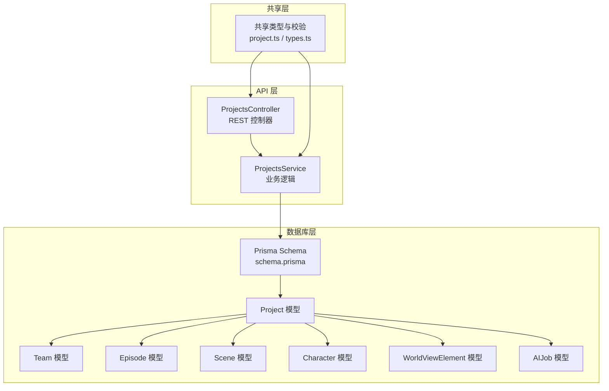
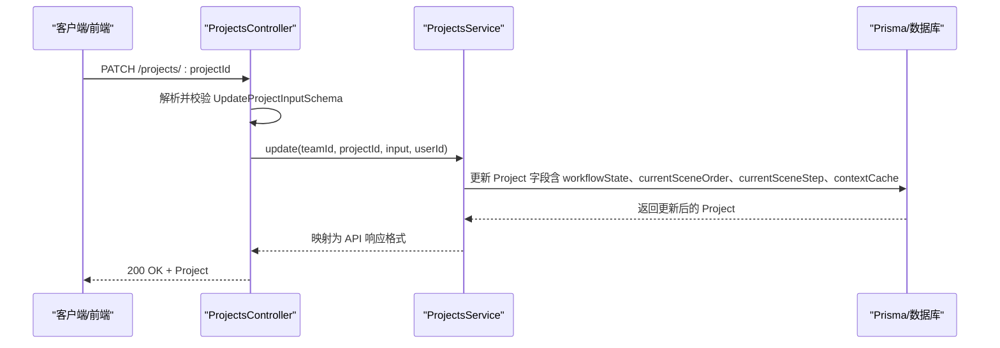
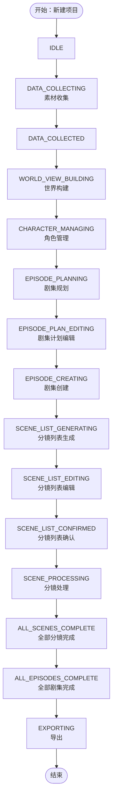
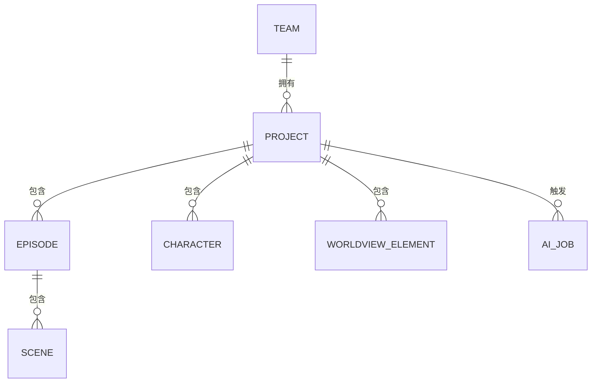
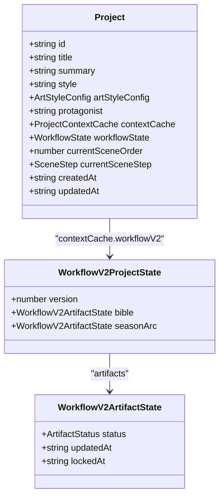
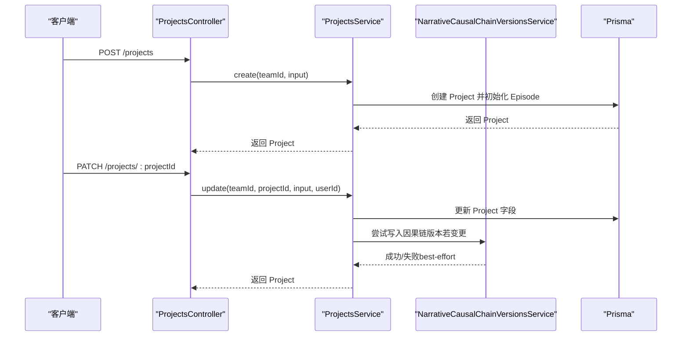
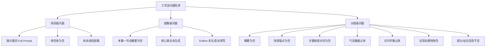
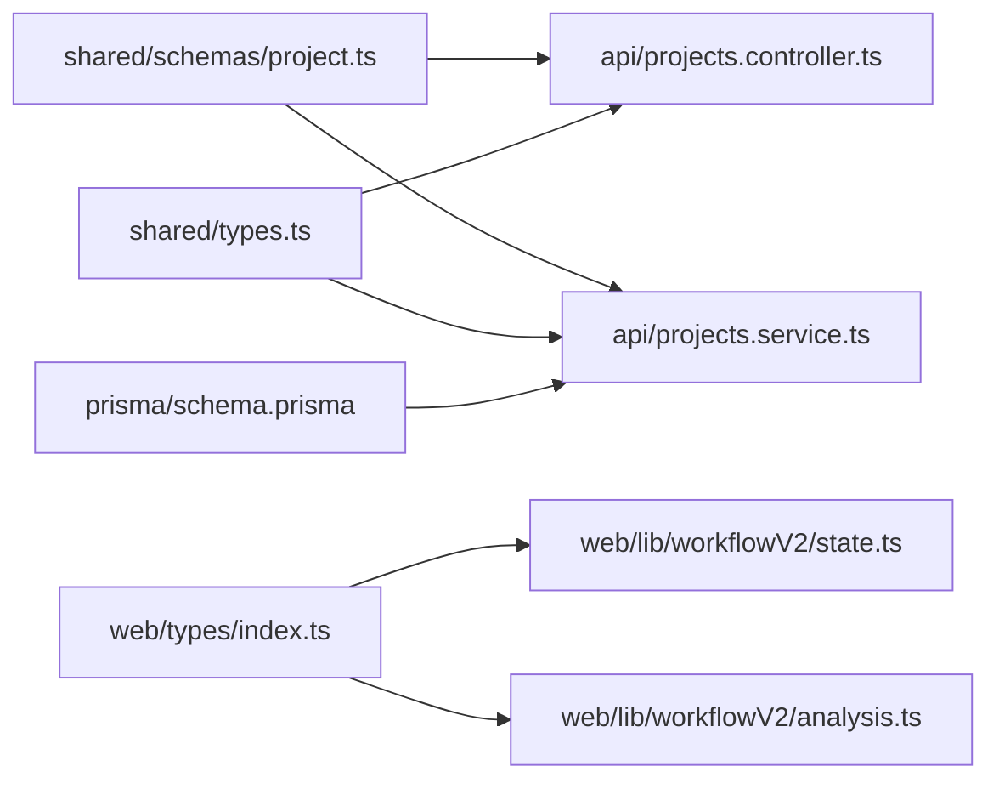

# 项目实体 (Project)

<cite>
**本文档引用的文件**
- [schema.prisma](file://apps/api/prisma/schema.prisma)
- [project.ts](file://packages/shared/src/schemas/project.ts)
- [types.ts](file://packages/shared/src/types.ts)
- [projects.service.ts](file://apps/api/src/projects/projects.service.ts)
- [projects.controller.ts](file://apps/api/src/projects/projects.controller.ts)
- [index.ts](file://apps/web/src/types/index.ts)
- [state.ts](file://apps/web/src/lib/workflowV2/state.ts)
- [migration.sql](file://apps/api/prisma/migrations/20251215203000_add_episode_planning/migration.sql)
- [analysis.ts](file://apps/web/src/lib/workflowV2/analysis.ts)
</cite>

## 目录

1. [简介](#简介)
2. [项目结构](#项目结构)
3. [核心组件](#核心组件)
4. [架构总览](#架构总览)
5. [详细组件分析](#详细组件分析)
6. [依赖分析](#依赖分析)
7. [性能考虑](#性能考虑)
8. [故障排查指南](#故障排查指南)
9. [结论](#结论)

## 简介

本文件系统化阐述项目实体（Project）在本项目中的设计与实现，覆盖字段定义、工作流状态（ProjectWorkflowState）的完整创作流程、与子实体的关系模型，以及在创作工作流中的核心作用与状态管理机制。目标读者既包括后端/前端开发者，也包括产品与运营人员，帮助大家理解如何围绕 Project 构建从素材收集、世界构建、角色管理、剧集规划、分镜生成到导出的全流程。

## 项目结构

- 数据模型定义位于 Prisma Schema 中，包含 Project 实体及其枚举类型、索引与关系。
- 类型与校验在共享包中定义，确保 API 与 Web 前端保持一致。
- API 层提供 CRUD 与状态更新能力；Web 层提供工作流状态与产物状态的前端体验。

图表来源

- [schema.prisma](file://apps/api/prisma/schema.prisma#L116-L141)
- [project.ts](file://packages/shared/src/schemas/project.ts#L1-L33)
- [types.ts](file://packages/shared/src/types.ts#L6-L23)

章节来源

- [schema.prisma](file://apps/api/prisma/schema.prisma#L116-L141)
- [project.ts](file://packages/shared/src/schemas/project.ts#L1-L33)
- [types.ts](file://packages/shared/src/types.ts#L6-L23)

## 核心组件

- Project 实体：承载创作项目的元数据、工作流状态与当前分镜处理指针。
- ProjectWorkflowState 枚举：定义从素材收集到导出的完整创作阶段。
- 子实体关系：与 Team（多对一）、Episode（一对多）、Scene（一对多）、Character（一对多）、WorldViewElement（一对多）、AIJob（一对多）。
- 前端类型与校验：确保输入输出一致，支持工作流 V2 的产物状态管理。

章节来源

- [schema.prisma](file://apps/api/prisma/schema.prisma#L16-L32)
- [schema.prisma](file://apps/api/prisma/schema.prisma#L116-L141)
- [project.ts](file://packages/shared/src/schemas/project.ts#L7-L28)
- [types.ts](file://packages/shared/src/types.ts#L6-L23)
- [index.ts](file://apps/web/src/types/index.ts#L452-L468)

## 架构总览

Project 在系统中的定位是“创作工作的根容器”，它串联起团队协作、素材收集、世界构建、角色管理、剧集规划、分镜生成与导出等环节。API 层负责持久化与状态推进，前端通过工作流 V2 的产物状态（如项目圣经、季/主线弧线、单集策划/分镜/提示词包）增强体验。

图表来源

- [projects.controller.ts](file://apps/api/src/projects/projects.controller.ts#L30-L34)
- [projects.service.ts](file://apps/api/src/projects/projects.service.ts#L141-L198)
- [project.ts](file://packages/shared/src/schemas/project.ts#L23-L28)

章节来源

- [projects.controller.ts](file://apps/api/src/projects/projects.controller.ts#L1-L43)
- [projects.service.ts](file://apps/api/src/projects/projects.service.ts#L141-L198)
- [project.ts](file://packages/shared/src/schemas/project.ts#L23-L28)

## 详细组件分析

### 字段定义与设计目的

- id（主键，cuid() 生成）：全局唯一标识，便于跨服务引用与审计。
- teamId（外键）：归属团队，决定权限边界与资源配额。
- title：项目标题，用于列表与导航展示。
- summary：项目摘要，支撑工作流 V2 的“项目圣经”质量评估与建议。
- style：兼容字段，保留旧版画风字符串；新字段为 artStyleConfig。
- artStyleConfig：结构化画风配置，包含风格、技法、色彩、文化特征与合成后的完整提示词，用于指导绘图与视频生成。
- protagonist：主角信息，辅助角色与世界构建。
- contextCache：上下文缓存，承载工作流 V2 的产物状态、叙事因果链、Agent Canvas 图等。
- workflowState：项目工作流状态，驱动创作流程推进与 UI 行为。
- currentSceneOrder：当前正在处理的分镜序号，用于批量处理与进度跟踪。
- currentSceneStep：当前分镜处理步骤（场景描述、关键帧提示词、运动提示词、对白），用于细化工作流。
- createdAt/updatedAt/deletedAt：生命周期与软删除标记。

章节来源

- [schema.prisma](file://apps/api/prisma/schema.prisma#L116-L131)
- [schema.prisma](file://apps/api/prisma/schema.prisma#L122-L127)
- [index.ts](file://apps/web/src/types/index.ts#L452-L468)
- [index.ts](file://apps/web/src/types/index.ts#L426-L450)

### 工作流状态（ProjectWorkflowState）与创作流程

ProjectWorkflowState 定义了从素材收集到导出的完整创作阶段，涵盖数据收集、世界构建、角色管理、剧集规划、分镜生成与处理、全部完成与导出等关键节点。状态迁移由前端工作台与后端 API 共同驱动，确保项目在可控的流程中推进。

图表来源

- [types.ts](file://packages/shared/src/types.ts#L6-L22)
- [schema.prisma](file://apps/api/prisma/schema.prisma#L16-L32)

章节来源

- [types.ts](file://packages/shared/src/types.ts#L6-L23)
- [schema.prisma](file://apps/api/prisma/schema.prisma#L16-L32)

### 与子实体的关系

- 与 Team 的多对一：每个项目属于一个团队，受团队权限与资源限制。
- 与 Episode 的一对多：项目包含多个剧集，按顺序组织创作。
- 与 Scene 的一对多：剧集包含多个分镜，按顺序组织画面与提示词。
- 与 Character 的一对多：项目包含角色库，支撑角色一致性与对白生成。
- 与 WorldViewElement 的一对多：项目包含世界构建元素，支撑空间一致性与连续性。
- 与 AIJob 的一对多：项目触发各类 AI 生成任务，形成创作流水线。

图表来源

- [schema.prisma](file://apps/api/prisma/schema.prisma#L87-L100)
- [schema.prisma](file://apps/api/prisma/schema.prisma#L116-L141)
- [schema.prisma](file://apps/api/prisma/schema.prisma#L176-L195)
- [schema.prisma](file://apps/api/prisma/schema.prisma#L197-L233)
- [schema.prisma](file://apps/api/prisma/schema.prisma#L235-L257)
- [schema.prisma](file://apps/api/prisma/schema.prisma#L259-L273)
- [schema.prisma](file://apps/api/prisma/schema.prisma#L311-L335)

章节来源

- [schema.prisma](file://apps/api/prisma/schema.prisma#L87-L100)
- [schema.prisma](file://apps/api/prisma/schema.prisma#L116-L141)
- [schema.prisma](file://apps/api/prisma/schema.prisma#L176-L195)
- [schema.prisma](file://apps/api/prisma/schema.prisma#L197-L233)
- [schema.prisma](file://apps/api/prisma/schema.prisma#L235-L257)
- [schema.prisma](file://apps/api/prisma/schema.prisma#L259-L273)
- [schema.prisma](file://apps/api/prisma/schema.prisma#L311-L335)

### 前端工作流 V2 与产物状态

前端通过 contextCache.workflowV2 管理项目与剧集层面的产物状态（如项目圣经、季/主线弧线、单集策划/分镜/提示词包），并提供状态变更的补丁构造与归一化逻辑，保证不同来源的状态合并与一致性。

图表来源

- [index.ts](file://apps/web/src/types/index.ts#L452-L468)
- [index.ts](file://apps/web/src/types/index.ts#L274-L282)
- [index.ts](file://apps/web/src/types/index.ts#L268-L272)
- [state.ts](file://apps/web/src/lib/workflowV2/state.ts#L27-L46)

章节来源

- [index.ts](file://apps/web/src/types/index.ts#L452-L468)
- [index.ts](file://apps/web/src/types/index.ts#L274-L282)
- [index.ts](file://apps/web/src/types/index.ts#L268-L272)
- [state.ts](file://apps/web/src/lib/workflowV2/state.ts#L27-L46)

### API 层实现要点

- 输入校验：CreateProjectInputSchema/UpdateProjectInputSchema 保证字段合法性与可选性。
- 默认值：workflowState 默认为 DATA_COLLECTING，currentSceneOrder 默认为 0。
- 状态推进：update 接口支持更新 workflowState、currentSceneOrder、currentSceneStep 与 contextCache。
- 版本记录：当 contextCache 中的叙事因果链发生变更时，自动写入版本记录，便于回溯与审计。

图表来源

- [projects.controller.ts](file://apps/api/src/projects/projects.controller.ts#L19-L34)
- [projects.service.ts](file://apps/api/src/projects/projects.service.ts#L112-L139)
- [projects.service.ts](file://apps/api/src/projects/projects.service.ts#L141-L198)

章节来源

- [projects.controller.ts](file://apps/api/src/projects/projects.controller.ts#L1-L43)
- [projects.service.ts](file://apps/api/src/projects/projects.service.ts#L112-L139)
- [projects.service.ts](file://apps/api/src/projects/projects.service.ts#L141-L198)

### 工作流建议与问题检测

前端提供工作流建议与问题检测，基于项目圣经、角色库、世界构建、剧集与分镜等要素，给出“任务待办/阻塞/完成”的状态与风险等级，辅助创作者推进流程与规避常见问题。

图表来源

- [analysis.ts](file://apps/web/src/lib/workflowV2/analysis.ts#L93-L167)
- [analysis.ts](file://apps/web/src/lib/workflowV2/analysis.ts#L169-L335)

章节来源

- [analysis.ts](file://apps/web/src/lib/workflowV2/analysis.ts#L93-L167)
- [analysis.ts](file://apps/web/src/lib/workflowV2/analysis.ts#L169-L335)

## 依赖分析

- 类型与校验依赖：共享包中的 zod schema 与枚举类型被 API 控制器与服务共同使用，确保输入输出一致。
- 数据模型依赖：Prisma Schema 定义了 Project 与其子实体的外键关系与索引，保障查询效率与数据完整性。
- 前端依赖：Web 类型与工作流 V2 状态管理依赖 Project 的字段与 contextCache 结构，用于渲染与状态推进。

图表来源

- [project.ts](file://packages/shared/src/schemas/project.ts#L1-L33)
- [types.ts](file://packages/shared/src/types.ts#L6-L23)
- [schema.prisma](file://apps/api/prisma/schema.prisma#L116-L141)
- [projects.controller.ts](file://apps/api/src/projects/projects.controller.ts#L1-L43)
- [projects.service.ts](file://apps/api/src/projects/projects.service.ts#L1-L40)
- [index.ts](file://apps/web/src/types/index.ts#L452-L468)
- [state.ts](file://apps/web/src/lib/workflowV2/state.ts#L1-L139)
- [analysis.ts](file://apps/web/src/lib/workflowV2/analysis.ts#L1-L444)

章节来源

- [project.ts](file://packages/shared/src/schemas/project.ts#L1-L33)
- [types.ts](file://packages/shared/src/types.ts#L6-L23)
- [schema.prisma](file://apps/api/prisma/schema.prisma#L116-L141)
- [projects.controller.ts](file://apps/api/src/projects/projects.controller.ts#L1-L43)
- [projects.service.ts](file://apps/api/src/projects/projects.service.ts#L1-L40)
- [index.ts](file://apps/web/src/types/index.ts#L452-L468)
- [state.ts](file://apps/web/src/lib/workflowV2/state.ts#L1-L139)
- [analysis.ts](file://apps/web/src/lib/workflowV2/analysis.ts#L1-L444)

## 性能考虑

- 查询优化：Prisma Schema 为 Project 建立了 teamId + updatedAt 的复合索引，利于按团队排序与筛选。
- 批量统计：API 层在列出项目时，通过并发查询与聚合计算（剧集数量、已完成分镜数量等）提升列表渲染性能。
- JSON 字段：artStyleConfig、contextCache 等 JSON 字段在前端进行结构化读取与归一化，避免后端复杂解析。
- 最佳实践：建议在高频更新场景中合并多次更新请求，减少事务开销；对大型 JSON 字段采用增量更新策略。

章节来源

- [schema.prisma](file://apps/api/prisma/schema.prisma#L140-L141)
- [projects.service.ts](file://apps/api/src/projects/projects.service.ts#L62-L102)
- [state.ts](file://apps/web/src/lib/workflowV2/state.ts#L27-L46)

## 故障排查指南

- 项目不存在：API 层在更新/查询时若找不到项目会抛出“未找到”异常，需确认 teamId 与 projectId 是否匹配。
- 工作流状态异常：若前端显示的工作流状态与预期不符，检查 contextCache 中 workflowV2 的 artifacts 状态是否被意外覆盖。
- 画风配置问题：若生成内容风格不一致，检查 artStyleConfig 是否正确设置，或回退到已锁定的 Full Prompt。
- 导出失败：在 EXPORTING 阶段，若导出产物缺失，检查 AIJob 的执行状态与错误信息。

章节来源

- [projects.service.ts](file://apps/api/src/projects/projects.service.ts#L104-L110)
- [projects.service.ts](file://apps/api/src/projects/projects.service.ts#L142-L147)
- [state.ts](file://apps/web/src/lib/workflowV2/state.ts#L76-L106)
- [analysis.ts](file://apps/web/src/lib/workflowV2/analysis.ts#L93-L167)

## 结论

Project 是本项目创作流程的核心载体，通过严谨的字段设计、完善的枚举状态与丰富的子实体关系，支撑从素材收集到导出的全链路创作。API 层提供稳定的持久化与状态推进能力，前端通过工作流 V2 的产物状态与问题检测，显著提升了创作效率与质量一致性。建议在实际使用中遵循以下原则：

- 新建项目即进入 DATA_COLLECTING，尽快完善项目圣经与角色库。
- 逐步推进至剧集规划与分镜生成，利用 AIJob 与工作流建议提升效率。
- 在 EXPORTING 前完成所有关键产物的锁定与校验，确保导出质量。
