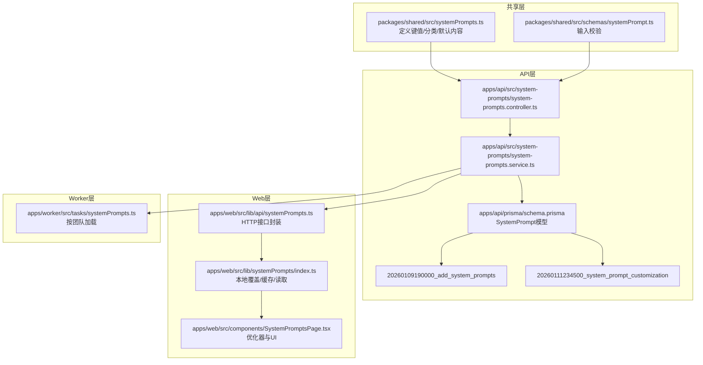
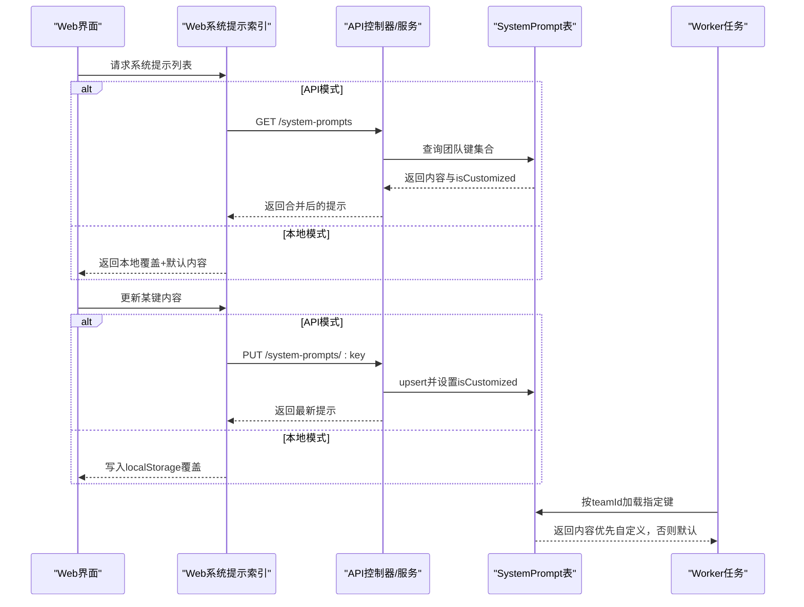
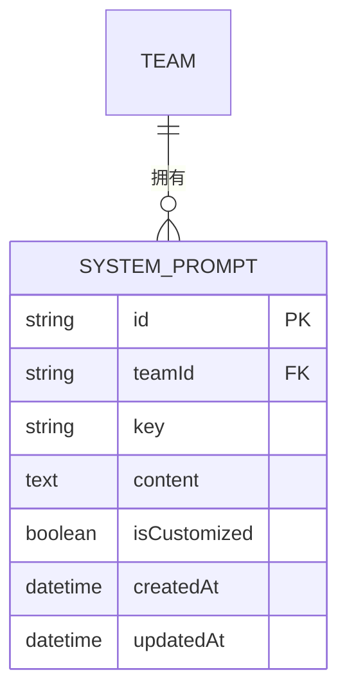
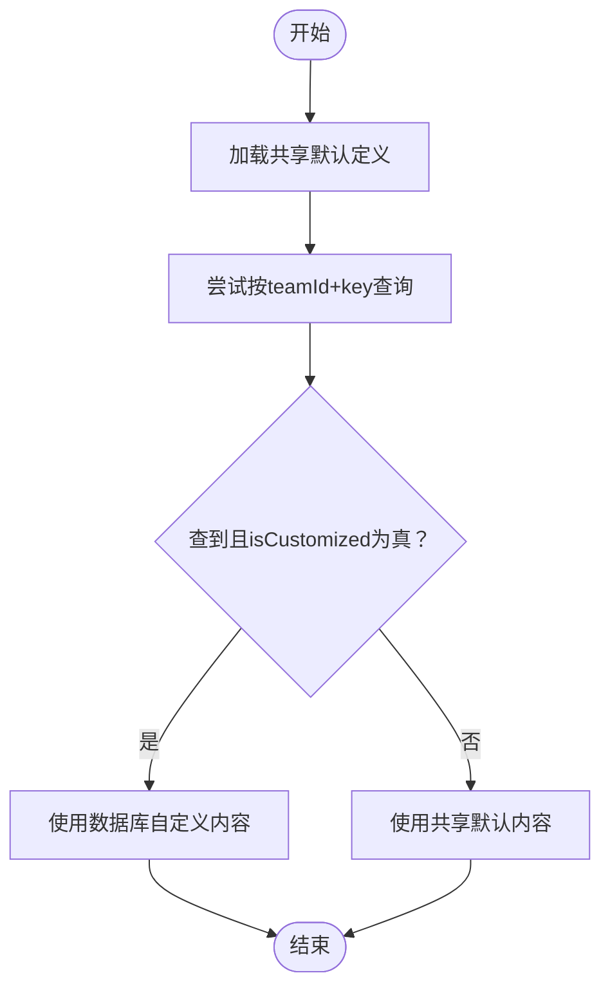
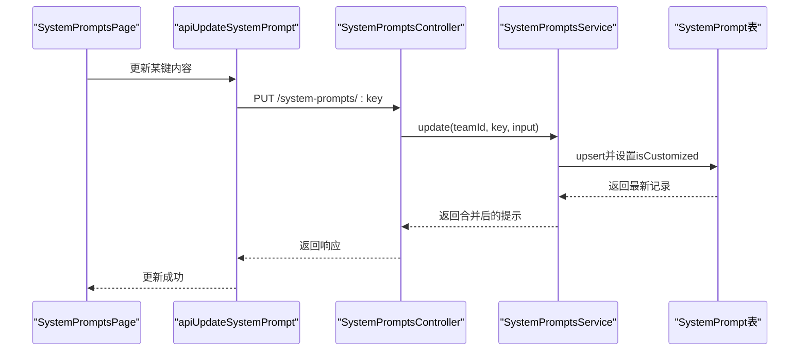
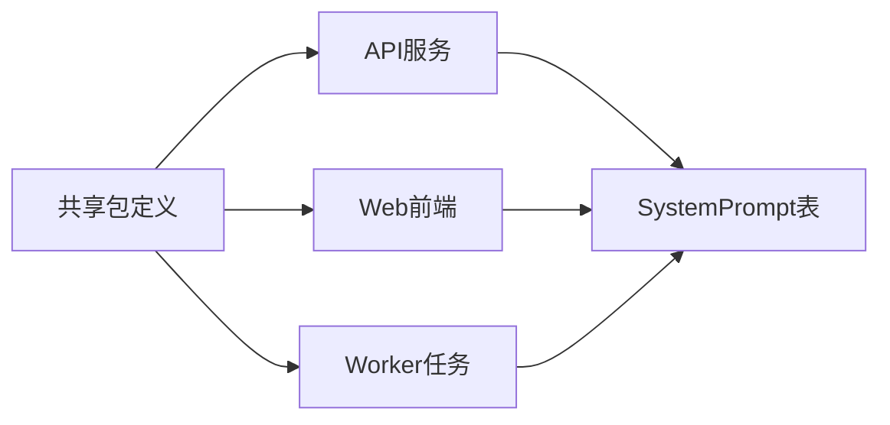

# 系统提示模型

<cite>
**本文档引用的文件**
- [apps/api/src/system-prompts/system-prompts.service.ts](file://apps/api/src/system-prompts/system-prompts.service.ts)
- [apps/api/src/system-prompts/system-prompts.controller.ts](file://apps/api/src/system-prompts/system-prompts.controller.ts)
- [apps/api/src/system-prompts/system-prompts.module.ts](file://apps/api/src/system-prompts/system-prompts.module.ts)
- [apps/api/prisma/schema.prisma](file://apps/api/prisma/schema.prisma)
- [apps/api/prisma/migrations/20260109190000_add_system_prompts/migration.sql](file://apps/api/prisma/migrations/20260109190000_add_system_prompts/migration.sql)
- [apps/api/prisma/migrations/20260111234500_system_prompt_customization/migration.sql](file://apps/api/prisma/migrations/20260111234500_system_prompt_customization/migration.sql)
- [packages/shared/src/systemPrompts.ts](file://packages/shared/src/systemPrompts.ts)
- [packages/shared/src/schemas/systemPrompt.ts](file://packages/shared/src/schemas/systemPrompt.ts)
- [apps/web/src/lib/systemPrompts/index.ts](file://apps/web/src/lib/systemPrompts/index.ts)
- [apps/web/src/lib/api/systemPrompts.ts](file://apps/web/src/lib/api/systemPrompts.ts)
- [apps/worker/src/tasks/systemPrompts.ts](file://apps/worker/src/tasks/systemPrompts.ts)
- [apps/web/src/components/SystemPromptsPage.tsx](file://apps/web/src/components/SystemPromptsPage.tsx)
- [apps/web/src/lib/workflowV2/finalPrompts.ts](file://apps/web/src/lib/workflowV2/finalPrompts.ts)
- [apps/web/src/lib/workflowV2/promptLayers.ts](file://apps/web/src/lib/workflowV2/promptLayers.ts)
- [apps/web/src/stores/episodeStore.ts](file://apps/web/src/stores/episodeStore.ts)
- [packages/shared/src/schemas/aiProfile.ts](file://packages/shared/src/schemas/aiProfile.ts)
</cite>

## 目录

1. [简介](#简介)
2. [项目结构](#项目结构)
3. [核心组件](#核心组件)
4. [架构总览](#架构总览)
5. [组件详解](#组件详解)
6. [依赖关系分析](#依赖关系分析)
7. [性能考量](#性能考量)
8. [故障排查指南](#故障排查指南)
9. [结论](#结论)
10. [附录](#附录)

## 简介

本文件面向AIXSSS系统的“系统提示模型”，系统性阐述SystemPrompt的设计理念、数据结构、存储与版本化、注入与优先级策略、团队级管理与个性化定制、分类与模板管理、版本控制、优化指南与最佳实践，以及与AI配置档案的协作关系。目标是帮助开发者与运营人员高效理解并维护系统提示词生态。

## 项目结构

系统提示模型横跨共享包、API服务、Web前端与Worker任务四个层面：

- 共享包：定义系统提示的键值、分类、默认内容与输入校验Schema
- API服务：提供系统提示的查询与更新接口，持久化至数据库
- Web前端：提供本地覆盖与API模式下的系统提示读取、缓存与UI管理
- Worker任务：在后端执行AI工作流时按团队维度加载系统提示

图表来源

- [packages/shared/src/systemPrompts.ts](file://packages/shared/src/systemPrompts.ts#L1-L1395)
- [packages/shared/src/schemas/systemPrompt.ts](file://packages/shared/src/schemas/systemPrompt.ts#L1-L9)
- [apps/api/src/system-prompts/system-prompts.controller.ts](file://apps/api/src/system-prompts/system-prompts.controller.ts#L1-L26)
- [apps/api/src/system-prompts/system-prompts.service.ts](file://apps/api/src/system-prompts/system-prompts.service.ts#L1-L85)
- [apps/api/prisma/schema.prisma](file://apps/api/prisma/schema.prisma#L337-L350)
- [apps/api/prisma/migrations/20260109190000_add_system_prompts/migration.sql](file://apps/api/prisma/migrations/20260109190000_add_system_prompts/migration.sql#L1-L20)
- [apps/api/prisma/migrations/20260111234500_system_prompt_customization/migration.sql](file://apps/api/prisma/migrations/20260111234500_system_prompt_customization/migration.sql#L1-L7)
- [apps/web/src/lib/systemPrompts/index.ts](file://apps/web/src/lib/systemPrompts/index.ts#L1-L197)
- [apps/web/src/lib/api/systemPrompts.ts](file://apps/web/src/lib/api/systemPrompts.ts#L1-L30)
- [apps/web/src/components/SystemPromptsPage.tsx](file://apps/web/src/components/SystemPromptsPage.tsx#L47-L89)
- [apps/worker/src/tasks/systemPrompts.ts](file://apps/worker/src/tasks/systemPrompts.ts#L1-L27)

章节来源

- [apps/api/src/system-prompts/system-prompts.module.ts](file://apps/api/src/system-prompts/system-prompts.module.ts#L1-L13)
- [apps/api/prisma/schema.prisma](file://apps/api/prisma/schema.prisma#L337-L350)

## 核心组件

- 键值与分类体系：系统提示以稳定键key标识，配合分类category组织，便于按工作流阶段与用途检索与管理
- 数据模型：包含key、content、isCustomized、createdAt、updatedAt等字段，支持团队维度隔离与个性化覆盖
- 输入校验：统一的Zod Schema限制content长度与必要性，保障API输入质量
- 读取与注入：Web端支持本地覆盖与API模式双态；Worker端按团队维度加载；最终在AI工作流中注入到LLM消息流
- 版本与回退：当存在isCustomized标记且内容有效时优先使用；否则回退到共享层默认内容

章节来源

- [packages/shared/src/systemPrompts.ts](file://packages/shared/src/systemPrompts.ts#L1-L21)
- [packages/shared/src/schemas/systemPrompt.ts](file://packages/shared/src/schemas/systemPrompt.ts#L1-L9)
- [apps/api/prisma/schema.prisma](file://apps/api/prisma/schema.prisma#L337-L350)
- [apps/web/src/lib/systemPrompts/index.ts](file://apps/web/src/lib/systemPrompts/index.ts#L1-L197)
- [apps/worker/src/tasks/systemPrompts.ts](file://apps/worker/src/tasks/systemPrompts.ts#L1-L27)

## 架构总览

系统提示在AIXSSS中的流转路径如下：

- 定义期：共享包维护SYSTEM_PROMPT_DEFINITIONS与SYSTEM_PROMPT_DEFINITION_BY_KEY
- 初始化期：API服务在团队首次访问时批量写入默认系统提示
- 使用期：Web端按运行模式（API/本地）读取；Worker端按teamId加载；AI工作流注入
- 更新期：通过API更新系统提示，标记isCustomized并持久化；Web端缓存同步

图表来源

- [apps/web/src/lib/systemPrompts/index.ts](file://apps/web/src/lib/systemPrompts/index.ts#L84-L163)
- [apps/web/src/lib/api/systemPrompts.ts](file://apps/web/src/lib/api/systemPrompts.ts#L20-L29)
- [apps/api/src/system-prompts/system-prompts.controller.ts](file://apps/api/src/system-prompts/system-prompts.controller.ts#L14-L23)
- [apps/api/src/system-prompts/system-prompts.service.ts](file://apps/api/src/system-prompts/system-prompts.service.ts#L30-L83)
- [apps/api/prisma/schema.prisma](file://apps/api/prisma/schema.prisma#L337-L350)
- [apps/worker/src/tasks/systemPrompts.ts](file://apps/worker/src/tasks/systemPrompts.ts#L4-L26)

## 组件详解

### 数据模型与键值结构

- 键值结构：key为稳定标识，title为UI显示标题，description为说明，category为分类，defaultContent为默认内容
- 存储字段：content为实际内容，isCustomized标记是否被个性化覆盖，createdAt/updatedAt记录变更时间
- 约束与索引：唯一索引(teamId, key)，团队维度隔离；按updatedAt倒序索引便于增量同步

图表来源

- [apps/api/prisma/schema.prisma](file://apps/api/prisma/schema.prisma#L337-L350)

章节来源

- [packages/shared/src/systemPrompts.ts](file://packages/shared/src/systemPrompts.ts#L10-L21)
- [apps/api/prisma/schema.prisma](file://apps/api/prisma/schema.prisma#L337-L350)

### 分类体系与模板管理

- 分类枚举：workflow、workflow.fix、workflow.actionBeats、workflow.narrativeCausalChain、ui.systemPrompts、agent.canvas等
- 模板管理：所有系统提示以SYSTEM_PROMPT_DEFINITIONS集中定义，包含大量工作流阶段的默认模板，覆盖分镜、关键帧、运动提示词、台词、JSON纠偏、叙事因果链等
- 模板版本：通过共享包统一维护，确保前后端一致；数据库仅保存团队定制内容与标记

章节来源

- [packages/shared/src/systemPrompts.ts](file://packages/shared/src/systemPrompts.ts#L1-L9)
- [packages/shared/src/systemPrompts.ts](file://packages/shared/src/systemPrompts.ts#L22-L1395)

### 团队级管理与个性化定制

- 团队隔离：每个teamId独立拥有一份SystemPrompt记录，互不影响
- 默认初始化：首次访问时ensureDefaults批量写入默认内容，skipDuplicates避免并发冲突
- 个性化覆盖：当content与defaultContent不一致时标记isCustomized=true；读取时优先使用自定义内容
- Web端本地覆盖：在API模式下，Web端通过缓存与localStorage实现本地覆盖，便于离线或快速试错

章节来源

- [apps/api/src/system-prompts/system-prompts.service.ts](file://apps/api/src/system-prompts/system-prompts.service.ts#L17-L28)
- [apps/api/src/system-prompts/system-prompts.service.ts](file://apps/api/src/system-prompts/system-prompts.service.ts#L30-L59)
- [apps/api/src/system-prompts/system-prompts.service.ts](file://apps/api/src/system-prompts/system-prompts.service.ts#L61-L83)
- [apps/web/src/lib/systemPrompts/index.ts](file://apps/web/src/lib/systemPrompts/index.ts#L31-L59)
- [apps/web/src/lib/systemPrompts/index.ts](file://apps/web/src/lib/systemPrompts/index.ts#L84-L107)
- [apps/web/src/lib/systemPrompts/index.ts](file://apps/web/src/lib/systemPrompts/index.ts#L126-L163)

### 注入机制与优先级策略

- 注入位置：在AI工作流中，系统提示作为System Prompt注入到LLM消息流；Web端与Worker端分别加载
- 优先级策略：团队维度加载时，若isCustomized为真且content非空则优先使用；否则回退到共享包默认内容
- 工作流集成：在叙事因果链等多阶段工作流中，明确记录systemPromptKeys，便于审计与溯源

图表来源

- [apps/worker/src/tasks/systemPrompts.ts](file://apps/worker/src/tasks/systemPrompts.ts#L4-L26)
- [apps/web/src/lib/systemPrompts/index.ts](file://apps/web/src/lib/systemPrompts/index.ts#L109-L124)
- [apps/web/src/stores/episodeStore.ts](file://apps/web/src/stores/episodeStore.ts#L446-L453)

章节来源

- [apps/worker/src/tasks/systemPrompts.ts](file://apps/worker/src/tasks/systemPrompts.ts#L1-L27)
- [apps/web/src/lib/systemPrompts/index.ts](file://apps/web/src/lib/systemPrompts/index.ts#L109-L124)
- [apps/web/src/stores/episodeStore.ts](file://apps/web/src/stores/episodeStore.ts#L446-L453)

### API与前端交互

- 列表接口：GET /system-prompts，返回合并后的提示列表（自定义优先）
- 更新接口：PUT /system-prompts/:key，校验输入并upsert，返回最新提示
- Web端封装：统一的apiListSystemPrompts与apiUpdateSystemPrompt，支持缓存与错误处理
- UI页面：提供系统提示优化器，通过专用系统提示键调用LLM进行提示词优化

图表来源

- [apps/web/src/components/SystemPromptsPage.tsx](file://apps/web/src/components/SystemPromptsPage.tsx#L66-L89)
- [apps/web/src/lib/api/systemPrompts.ts](file://apps/web/src/lib/api/systemPrompts.ts#L24-L29)
- [apps/api/src/system-prompts/system-prompts.controller.ts](file://apps/api/src/system-prompts/system-prompts.controller.ts#L19-L23)
- [apps/api/src/system-prompts/system-prompts.service.ts](file://apps/api/src/system-prompts/system-prompts.service.ts#L61-L83)
- [apps/api/prisma/schema.prisma](file://apps/api/prisma/schema.prisma#L337-L350)

章节来源

- [apps/api/src/system-prompts/system-prompts.controller.ts](file://apps/api/src/system-prompts/system-prompts.controller.ts#L1-L26)
- [apps/api/src/system-prompts/system-prompts.service.ts](file://apps/api/src/system-prompts/system-prompts.service.ts#L1-L85)
- [apps/web/src/lib/api/systemPrompts.ts](file://apps/web/src/lib/api/systemPrompts.ts#L1-L30)
- [apps/web/src/components/SystemPromptsPage.tsx](file://apps/web/src/components/SystemPromptsPage.tsx#L47-L89)

### 与AI配置档案的协作关系

- AI配置档案（AIProfile）包含provider、model、generationParams、pricing等，决定LLM调用参数
- 系统提示作为System Prompt注入到消息流，与AI配置共同决定最终输出质量
- 在工作流日志中，系统提示键列表与AI配置共同记录，便于审计与复现

章节来源

- [packages/shared/src/schemas/aiProfile.ts](file://packages/shared/src/schemas/aiProfile.ts#L1-L51)
- [apps/web/src/stores/episodeStore.ts](file://apps/web/src/stores/episodeStore.ts#L438-L461)

### 与工作流的结合

- 分层提示构建：通过promptLayers与finalPrompts将风格、剧集、面板差量等信息与系统提示组合
- 工作流阶段：在叙事因果链等阶段明确引用系统提示键，确保各阶段输出稳定与可解析

章节来源

- [apps/web/src/lib/workflowV2/promptLayers.ts](file://apps/web/src/lib/workflowV2/promptLayers.ts#L21-L82)
- [apps/web/src/lib/workflowV2/finalPrompts.ts](file://apps/web/src/lib/workflowV2/finalPrompts.ts#L193-L231)
- [apps/web/src/stores/episodeStore.ts](file://apps/web/src/stores/episodeStore.ts#L446-L453)

## 依赖关系分析

- 低耦合：共享包定义与API/前端/Worker解耦，通过稳定键与Schema进行契约约束
- 数据一致性：数据库仅保存团队定制内容与标记，避免重复存储默认模板
- 可扩展性：新增系统提示只需在共享包添加定义，无需修改数据库结构

图表来源

- [packages/shared/src/systemPrompts.ts](file://packages/shared/src/systemPrompts.ts#L1-L1395)
- [apps/api/src/system-prompts/system-prompts.service.ts](file://apps/api/src/system-prompts/system-prompts.service.ts#L1-L85)
- [apps/web/src/lib/systemPrompts/index.ts](file://apps/web/src/lib/systemPrompts/index.ts#L1-L197)
- [apps/worker/src/tasks/systemPrompts.ts](file://apps/worker/src/tasks/systemPrompts.ts#L1-L27)
- [apps/api/prisma/schema.prisma](file://apps/api/prisma/schema.prisma#L337-L350)

## 性能考量

- 缓存策略：Web端在API模式下缓存系统提示列表，避免重复请求；更新后主动失效缓存
- 批量初始化：首次访问时批量写入默认内容，减少后续查询压力
- 索引优化：按teamId与updatedAt建立索引，支持高效查询与增量同步
- 并发安全：批量插入使用skipDuplicates，降低竞态风险

章节来源

- [apps/web/src/lib/systemPrompts/index.ts](file://apps/web/src/lib/systemPrompts/index.ts#L61-L82)
- [apps/api/src/system-prompts/system-prompts.service.ts](file://apps/api/src/system-prompts/system-prompts.service.ts#L17-L28)
- [apps/api/prisma/schema.prisma](file://apps/api/prisma/schema.prisma#L13-L17)

## 故障排查指南

- 未知键：当使用不存在的key时，读取与更新均会抛出错误，检查键是否存在于共享定义
- 输入校验失败：content长度或格式不满足Schema，检查最大长度与必要性
- 数据库异常：Worker加载时忽略DB读取异常并回退默认内容，确认数据库连接与权限
- 缓存不一致：更新后需确保缓存失效与重建，避免读取到旧内容

章节来源

- [apps/web/src/lib/systemPrompts/index.ts](file://apps/web/src/lib/systemPrompts/index.ts#L109-L111)
- [apps/web/src/lib/systemPrompts/index.ts](file://apps/web/src/lib/systemPrompts/index.ts#L165-L167)
- [packages/shared/src/schemas/systemPrompt.ts](file://packages/shared/src/schemas/systemPrompt.ts#L3-L5)
- [apps/worker/src/tasks/systemPrompts.ts](file://apps/worker/src/tasks/systemPrompts.ts#L14-L23)

## 结论

系统提示模型通过“共享定义 + 团队定制 + 优先级回退”的设计，在保证默认质量的同时赋予团队灵活的个性化能力。其清晰的分类、完善的注入与优先级策略、以及与AI配置档案的协作，使得系统在复杂工作流中保持稳定与可维护性。建议在团队内建立规范的系统提示评审与优化流程，持续提升工作流质量与一致性。

## 附录

### 系统提示键与分类速览

- 分类：workflow、workflow.fix、workflow.actionBeats、workflow.narrativeCausalChain、ui.systemPrompts、agent.canvas
- 典型键：如workflow.scene*list.system、workflow.scene_anchor.system、workflow.action_beats.*、workflow.motion*prompt.system、workflow.dialogue.system、workflow.plan_episodes.*、workflow.narrative_causal_chain.\*等

章节来源

- [packages/shared/src/systemPrompts.ts](file://packages/shared/src/systemPrompts.ts#L1-L9)
- [packages/shared/src/systemPrompts.ts](file://packages/shared/src/systemPrompts.ts#L22-L1395)

### 版本控制与迁移

- 初始表结构与索引：20260109190000_add_system_prompts
- 增加isCustomized字段与回填逻辑：20260111234500_system_prompt_customization

章节来源

- [apps/api/prisma/migrations/20260109190000_add_system_prompts/migration.sql](file://apps/api/prisma/migrations/20260109190000_add_system_prompts/migration.sql#L1-L20)
- [apps/api/prisma/migrations/20260111234500_system_prompt_customization/migration.sql](file://apps/api/prisma/migrations/20260111234500_system_prompt_customization/migration.sql#L1-L7)

### 系统提示优化指南与最佳实践

- 优化器使用：通过专用系统提示键调用LLM进行提示词优化，保持输出格式与约束明确
- 最佳实践：
  - 保持键的稳定性与语义化命名
  - 严格遵循输出格式要求，避免歧义
  - 仅在必要时进行个性化覆盖，避免过度定制
  - 建立团队评审与版本记录机制

章节来源

- [apps/web/src/components/SystemPromptsPage.tsx](file://apps/web/src/components/SystemPromptsPage.tsx#L53-L89)
