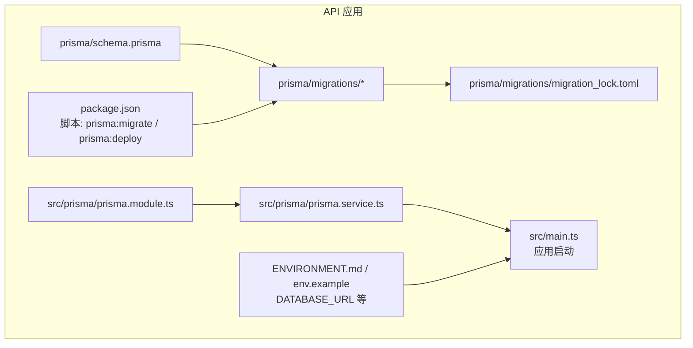
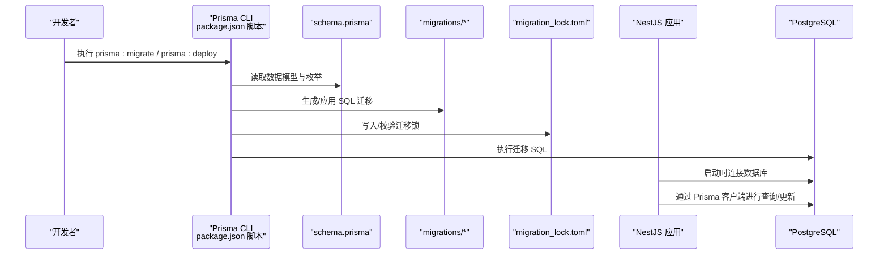
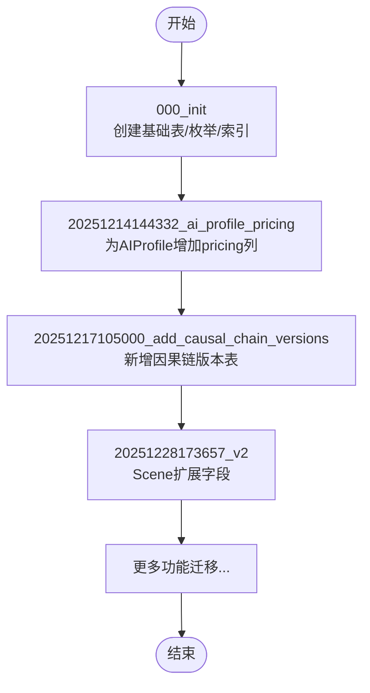
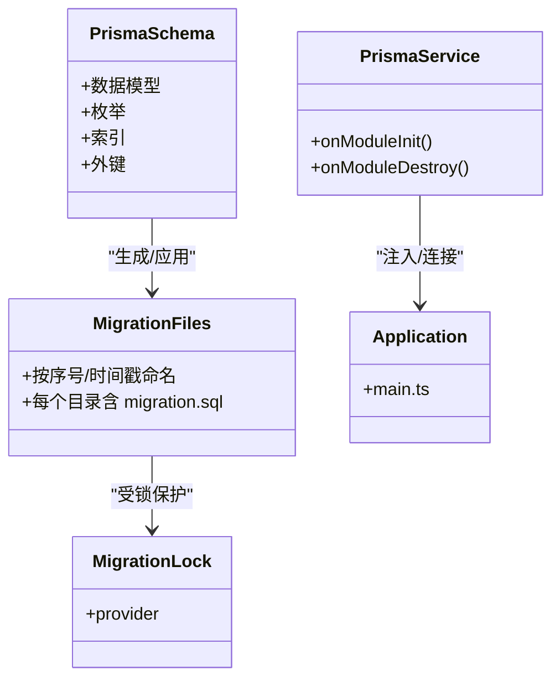
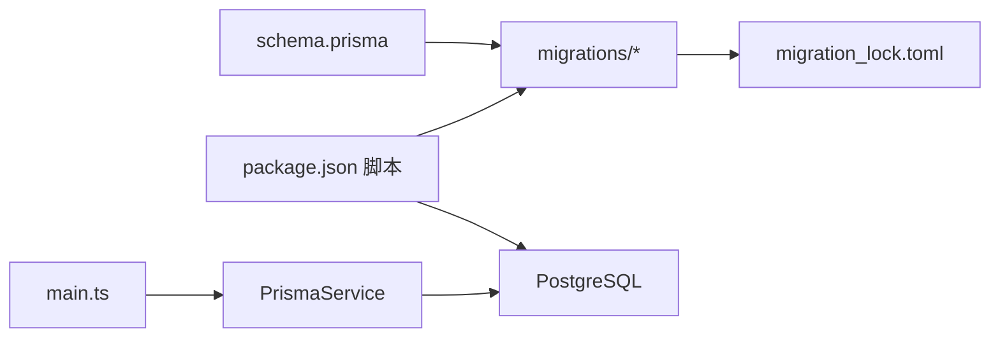

# 迁移管理

<cite>
**本文引用的文件**
- [apps/api/prisma/schema.prisma](file://apps/api/prisma/schema.prisma)
- [apps/api/prisma/migrations/migration_lock.toml](file://apps/api/prisma/migrations/migration_lock.toml)
- [apps/api/prisma/migrations/000_init/migration.sql](file://apps/api/prisma/migrations/000_init/migration.sql)
- [apps/api/prisma/migrations/20251214144332_ai_profile_pricing/migration.sql](file://apps/api/prisma/migrations/20251214144332_ai_profile_pricing/migration.sql)
- [apps/api/prisma/migrations/20251217105000_add_causal_chain_versions/migration.sql](file://apps/api/prisma/migrations/20251217105000_add_causal_chain_versions/migration.sql)
- [apps/api/prisma/migrations/20251228173657_v2/migration.sql](file://apps/api/prisma/migrations/20251228173657_v2/migration.sql)
- [apps/api/src/prisma/prisma.service.ts](file://apps/api/src/prisma/prisma.service.ts)
- [apps/api/src/prisma/prisma.module.ts](file://apps/api/src/prisma/prisma.module.ts)
- [apps/api/package.json](file://apps/api/package.json)
- [apps/api/env.example](file://apps/api/env.example)
- [apps/api/ENVIRONMENT.md](file://apps/api/ENVIRONMENT.md)
- [apps/api/src/main.ts](file://apps/api/src/main.ts)
- [docs/migration/local-to-api.md](file://docs/migration/local-to-api.md)
</cite>

## 目录

1. 引言
2. 项目结构
3. 核心组件
4. 架构总览
5. 组件详解
6. 依赖关系分析
7. 性能考量
8. 故障排查指南
9. 结论
10. 附录

## 引言

本文件面向AIXSSS项目的数据库迁移管理，围绕基于Prisma的迁移策略与版本控制展开，系统性说明迁移文件命名规范、版本历史与变更记录、迁移锁机制、schema.prisma与数据库结构同步机制，以及迁移最佳实践、回滚策略、数据备份方案、生产环境变更与版本升级流程、常见问题排查与解决方案，并给出可直接参考的操作命令与流程。

## 项目结构

本项目采用多包工作区，数据库迁移集中在API子应用的Prisma目录中，包含schema定义、迁移文件与迁移锁文件。NestJS模块负责注入Prisma客户端，应用启动时自动连接数据库。

图表来源

- [apps/api/prisma/schema.prisma](file://apps/api/prisma/schema.prisma#L1-L351)
- [apps/api/prisma/migrations/migration_lock.toml](file://apps/api/prisma/migrations/migration_lock.toml#L1-L4)
- [apps/api/src/prisma/prisma.service.ts](file://apps/api/src/prisma/prisma.service.ts#L1-L16)
- [apps/api/src/prisma/prisma.module.ts](file://apps/api/src/prisma/prisma.module.ts#L1-L12)
- [apps/api/package.json](file://apps/api/package.json#L6-L16)
- [apps/api/ENVIRONMENT.md](file://apps/api/ENVIRONMENT.md#L1-L31)
- [apps/api/env.example](file://apps/api/env.example#L1-L23)
- [apps/api/src/main.ts](file://apps/api/src/main.ts#L1-L34)

章节来源

- [apps/api/prisma/schema.prisma](file://apps/api/prisma/schema.prisma#L1-L351)
- [apps/api/prisma/migrations/migration_lock.toml](file://apps/api/prisma/migrations/migration_lock.toml#L1-L4)
- [apps/api/src/prisma/prisma.service.ts](file://apps/api/src/prisma/prisma.service.ts#L1-L16)
- [apps/api/src/prisma/prisma.module.ts](file://apps/api/src/prisma/prisma.module.ts#L1-L12)
- [apps/api/package.json](file://apps/api/package.json#L6-L16)
- [apps/api/ENVIRONMENT.md](file://apps/api/ENVIRONMENT.md#L1-L31)
- [apps/api/env.example](file://apps/api/env.example#L1-L23)
- [apps/api/src/main.ts](file://apps/api/src/main.ts#L1-L34)

## 核心组件

- Prisma 数据模型与枚举：集中于schema.prisma，定义表结构、索引、外键与枚举类型，驱动迁移生成与同步。
- 迁移文件：位于prisma/migrations，每个迁移对应一个独立的SQL变更，按时间戳或序号命名，确保顺序可确定。
- 迁移锁：migration_lock.toml用于防止并发迁移冲突，锁定迁移执行的数据库提供者信息。
- Prisma 客户端注入：通过NestJS模块全局注入PrismaService，应用启动时自动连接数据库。
- 迁移脚本：package.json中提供prisma:migrate与prisma:deploy等脚本，分别用于开发态与部署态的迁移执行。

章节来源

- [apps/api/prisma/schema.prisma](file://apps/api/prisma/schema.prisma#L1-L351)
- [apps/api/prisma/migrations/migration_lock.toml](file://apps/api/prisma/migrations/migration_lock.toml#L1-L4)
- [apps/api/src/prisma/prisma.service.ts](file://apps/api/src/prisma/prisma.service.ts#L1-L16)
- [apps/api/src/prisma/prisma.module.ts](file://apps/api/src/prisma/prisma.module.ts#L1-L12)
- [apps/api/package.json](file://apps/api/package.json#L6-L16)

## 架构总览

下图展示从代码到数据库的迁移与运行时连接路径，包括Prisma客户端初始化、迁移执行与数据库连接。

图表来源

- [apps/api/package.json](file://apps/api/package.json#L6-L16)
- [apps/api/prisma/schema.prisma](file://apps/api/prisma/schema.prisma#L1-L351)
- [apps/api/prisma/migrations/migration_lock.toml](file://apps/api/prisma/migrations/migration_lock.toml#L1-L4)
- [apps/api/src/prisma/prisma.service.ts](file://apps/api/src/prisma/prisma.service.ts#L1-L16)
- [apps/api/src/main.ts](file://apps/api/src/main.ts#L1-L34)

## 组件详解

### 迁移文件命名规范与版本历史

- 命名规范
  - 初始版本：000_init
  - 后续版本：以时间戳或语义化序号命名，例如20251214144332_ai_profile_pricing、20251217105000_add_causal_chain_versions、20251228173657_v2等
  - 每个迁移目录包含一个migration.sql，记录该次变更的DDL/DML
- 版本历史与变更记录
  - 000_init：创建基础表、枚举与索引，奠定初始架构
  - 20251214144332_ai_profile_pricing：为AIProfile增加pricing列
  - 20251217105000_add_causal_chain_versions：新增叙事因果链版本表及索引、外键
  - 20251228173657_v2：为Scene增加castCharacterIds与generatedImages列
  - 其他迁移：逐步扩展Episode/Storyboard/Action Beats/System Prompts等能力

图表来源

- [apps/api/prisma/migrations/000_init/migration.sql](file://apps/api/prisma/migrations/000_init/migration.sql#L1-L202)
- [apps/api/prisma/migrations/20251214144332_ai_profile_pricing/migration.sql](file://apps/api/prisma/migrations/20251214144332_ai_profile_pricing/migration.sql#L1-L3)
- [apps/api/prisma/migrations/20251217105000_add_causal_chain_versions/migration.sql](file://apps/api/prisma/migrations/20251217105000_add_causal_chain_versions/migration.sql#L1-L40)
- [apps/api/prisma/migrations/20251228173657_v2/migration.sql](file://apps/api/prisma/migrations/20251228173657_v2/migration.sql#L1-L4)

章节来源

- [apps/api/prisma/migrations/000_init/migration.sql](file://apps/api/prisma/migrations/000_init/migration.sql#L1-L202)
- [apps/api/prisma/migrations/20251214144332_ai_profile_pricing/migration.sql](file://apps/api/prisma/migrations/20251214144332_ai_profile_pricing/migration.sql#L1-L3)
- [apps/api/prisma/migrations/20251217105000_add_causal_chain_versions/migration.sql](file://apps/api/prisma/migrations/20251217105000_add_causal_chain_versions/migration.sql#L1-L40)
- [apps/api/prisma/migrations/20251228173657_v2/migration.sql](file://apps/api/prisma/migrations/20251228173657_v2/migration.sql#L1-L4)

### 迁移锁机制（migration_lock.toml）

- 作用
  - 锁定当前迁移所针对的数据库提供者，避免不同提供者之间的并发冲突
  - 作为版本控制的一部分，需纳入VCS（如Git），确保团队一致
- 管理方式
  - 不应手工修改；由Prisma在迁移过程中维护
  - 当迁移执行前后的提供者不一致时，Prisma会拒绝继续执行以保护数据一致性

章节来源

- [apps/api/prisma/migrations/migration_lock.toml](file://apps/api/prisma/migrations/migration_lock.toml#L1-L4)

### schema.prisma 与数据库结构同步机制

- 数据模型驱动
  - schema.prisma定义了数据模型、枚举、索引与外键，Prisma根据其生成迁移SQL
- 同步流程
  - 开发阶段：prisma:migrate 生成并应用迁移
  - 部署阶段：prisma:deploy 仅应用已存在的迁移，不生成新迁移
- 连接与运行时
  - 应用启动时通过PrismaService建立数据库连接，确保迁移后的结构可用

图表来源

- [apps/api/prisma/schema.prisma](file://apps/api/prisma/schema.prisma#L1-L351)
- [apps/api/prisma/migrations/migration_lock.toml](file://apps/api/prisma/migrations/migration_lock.toml#L1-L4)
- [apps/api/src/prisma/prisma.service.ts](file://apps/api/src/prisma/prisma.service.ts#L1-L16)
- [apps/api/src/main.ts](file://apps/api/src/main.ts#L1-L34)

章节来源

- [apps/api/prisma/schema.prisma](file://apps/api/prisma/schema.prisma#L1-L351)
- [apps/api/src/prisma/prisma.service.ts](file://apps/api/src/prisma/prisma.service.ts#L1-L16)
- [apps/api/src/main.ts](file://apps/api/src/main.ts#L1-L34)

### 迁移最佳实践

- 开发期
  - 修改schema.prisma后，使用prisma:migrate生成并应用迁移，确保本地与远程一致
- 部署期
  - 使用prisma:deploy仅应用已有迁移，避免在CI/CD中生成新迁移
- 并发与一致性
  - 保持migration_lock.toml随迁移同步，避免跨提供者迁移
- 回滚策略
  - 优先采用“向前迁移”的方式，通过新增迁移修正错误，而非回滚已有迁移
  - 如确需回滚，应在隔离环境中先验证，再在受控窗口执行
- 数据备份
  - 生产变更前进行数据库备份；迁移失败时依据备份恢复
- 环境隔离
  - 严格区分开发、测试、预发布与生产环境的DATABASE_URL与权限

章节来源

- [apps/api/package.json](file://apps/api/package.json#L6-L16)
- [apps/api/prisma/migrations/migration_lock.toml](file://apps/api/prisma/migrations/migration_lock.toml#L1-L4)
- [apps/api/env.example](file://apps/api/env.example#L1-L23)
- [apps/api/ENVIRONMENT.md](file://apps/api/ENVIRONMENT.md#L1-L31)

### 生产环境变更与版本升级

- 变更窗口
  - 选择低峰时段执行迁移，预留回滚窗口与监控
- 变更流程
  - 在预发布环境验证迁移与业务逻辑
  - 生成并应用迁移至生产，观察指标与日志
  - 迁移完成后进行抽样回归测试
- 版本升级
  - 通过prisma:deploy确保生产只应用已存在的迁移
  - 对于破坏性变更，提前准备兼容层与数据迁移脚本

章节来源

- [apps/api/package.json](file://apps/api/package.json#L6-L16)
- [apps/api/ENVIRONMENT.md](file://apps/api/ENVIRONMENT.md#L1-L31)
- [apps/api/env.example](file://apps/api/env.example#L1-L23)

### 命令与操作流程

- 本地开发
  - 生成并应用迁移：prisma:migrate
  - 生成客户端（如需）：prisma:generate
  - 启动应用：npm run dev 或 npm start
- CI/CD 部署
  - 应用现有迁移：prisma:deploy
  - 启动应用：npm run start
- 环境变量
  - DATABASE_URL：指定PostgreSQL连接串
  - 其他安全敏感变量：JWT_SECRET、API_KEY_ENCRYPTION_KEY、REDIS_URL等

章节来源

- [apps/api/package.json](file://apps/api/package.json#L6-L16)
- [apps/api/env.example](file://apps/api/env.example#L1-L23)
- [apps/api/ENVIRONMENT.md](file://apps/api/ENVIRONMENT.md#L1-L31)
- [apps/api/src/main.ts](file://apps/api/src/main.ts#L1-L34)

### 本地数据导入云端（API模式）与迁移关联

- 背景
  - 早期前端以localStorage为主；API模式下数据迁移到Postgres并通过鉴权与Team隔离
- 导入范围
  - 项目（Project）、分镜（Scene）与工作流进度字段（workflowState/currentSceneOrder/currentSceneStep）
  - 角色（Character）、世界观（WorldView）等仍为本地数据
- 与数据库迁移的关系
  - 导入过程属于应用层面的数据迁移，与Prisma迁移互补：前者解决用户数据迁移，后者解决数据库结构演进

章节来源

- [docs/migration/local-to-api.md](file://docs/migration/local-to-api.md#L1-L39)

## 依赖关系分析

- 组件耦合
  - schema.prisma是迁移的唯一事实来源，迁移文件由其驱动生成
  - PrismaService作为全局单例，贯穿应用生命周期，确保数据库连接稳定
  - package.json脚本统一迁移入口，保证开发与部署行为一致
- 外部依赖
  - PostgreSQL：由DATABASE_URL配置
  - Redis：用于队列（BullMQ），与迁移无直接关系，但影响业务连续性

图表来源

- [apps/api/prisma/schema.prisma](file://apps/api/prisma/schema.prisma#L1-L351)
- [apps/api/prisma/migrations/migration_lock.toml](file://apps/api/prisma/migrations/migration_lock.toml#L1-L4)
- [apps/api/package.json](file://apps/api/package.json#L6-L16)
- [apps/api/src/prisma/prisma.service.ts](file://apps/api/src/prisma/prisma.service.ts#L1-L16)
- [apps/api/src/main.ts](file://apps/api/src/main.ts#L1-L34)

章节来源

- [apps/api/prisma/schema.prisma](file://apps/api/prisma/schema.prisma#L1-L351)
- [apps/api/package.json](file://apps/api/package.json#L6-L16)
- [apps/api/src/prisma/prisma.service.ts](file://apps/api/src/prisma/prisma.service.ts#L1-L16)
- [apps/api/src/main.ts](file://apps/api/src/main.ts#L1-L34)

## 性能考量

- 迁移性能
  - 大表变更建议分批执行，避免长时间锁表
  - 添加索引与重建索引时关注执行时间与资源占用
- 运行时性能
  - 通过PrismaService统一连接池管理，避免频繁连接/断开
  - 在高并发场景下，合理设计索引与查询计划

## 故障排查指南

- 迁移卡住或失败
  - 检查migration_lock.toml是否被意外修改或丢失
  - 确认DATABASE_URL正确且网络可达
  - 查看迁移SQL是否存在语法错误或依赖缺失
- 并发冲突
  - 确保同一时间只有一个迁移进程在运行
  - 如发现冲突，先回滚到上一个稳定迁移，再重试
- 应用无法连接数据库
  - 核对.env与ENVIRONMENT.md中的DATABASE_URL
  - 检查PostgreSQL服务状态与防火墙
- 回滚与恢复
  - 优先通过新增迁移修正问题
  - 若必须回滚，先备份数据库，再在隔离环境验证后再执行

章节来源

- [apps/api/prisma/migrations/migration_lock.toml](file://apps/api/prisma/migrations/migration_lock.toml#L1-L4)
- [apps/api/env.example](file://apps/api/env.example#L1-L23)
- [apps/api/ENVIRONMENT.md](file://apps/api/ENVIRONMENT.md#L1-L31)

## 结论

本文件系统性梳理了AIXSSS基于Prisma的数据库迁移策略与版本控制实践，明确了迁移文件命名规范、版本历史与变更记录、迁移锁机制、schema.prisma与数据库结构同步机制，并提供了最佳实践、回滚策略、数据备份方案、生产环境变更与版本升级流程、常见问题排查与解决方案，以及可直接参考的命令与流程。建议在团队内固化迁移流程与评审机制，确保每次变更可控、可追溯、可回滚。

## 附录

- 命令速查
  - 生成并应用迁移：prisma:migrate
  - 仅应用已有迁移（部署）：prisma:deploy
  - 生成客户端：prisma:generate
  - 启动应用：npm run dev / npm start
- 环境变量清单（关键项）
  - DATABASE_URL：PostgreSQL连接串
  - JWT_SECRET：JWT密钥
  - API_KEY_ENCRYPTION_KEY：API密钥加密密钥
  - REDIS_URL：Redis连接串
  - CORS_ORIGIN：前端跨域来源

章节来源

- [apps/api/package.json](file://apps/api/package.json#L6-L16)
- [apps/api/env.example](file://apps/api/env.example#L1-L23)
- [apps/api/ENVIRONMENT.md](file://apps/api/ENVIRONMENT.md#L1-L31)
