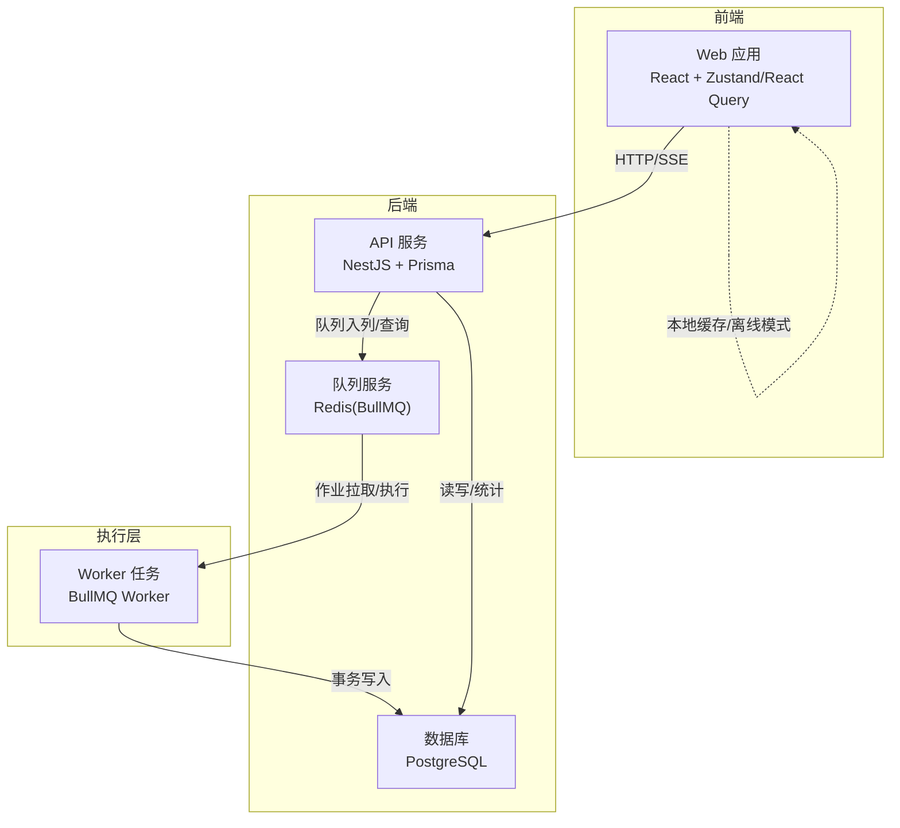
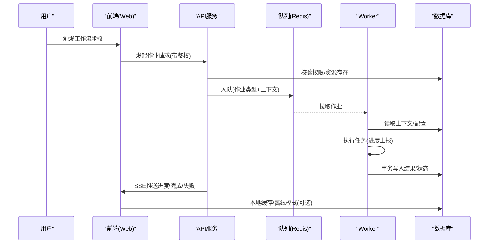
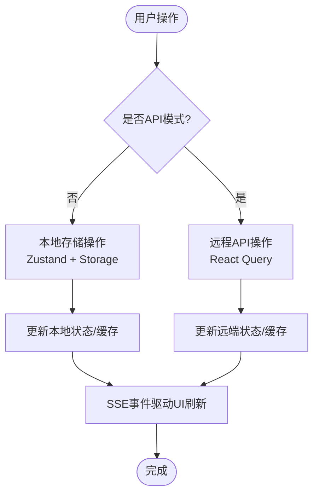
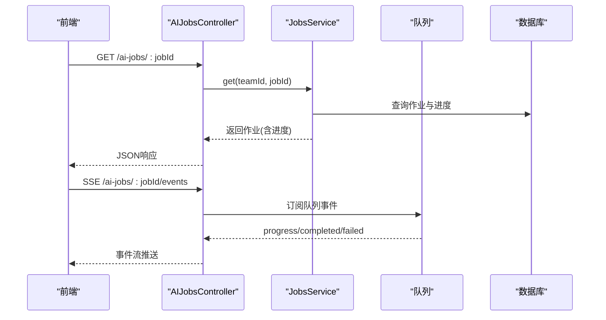
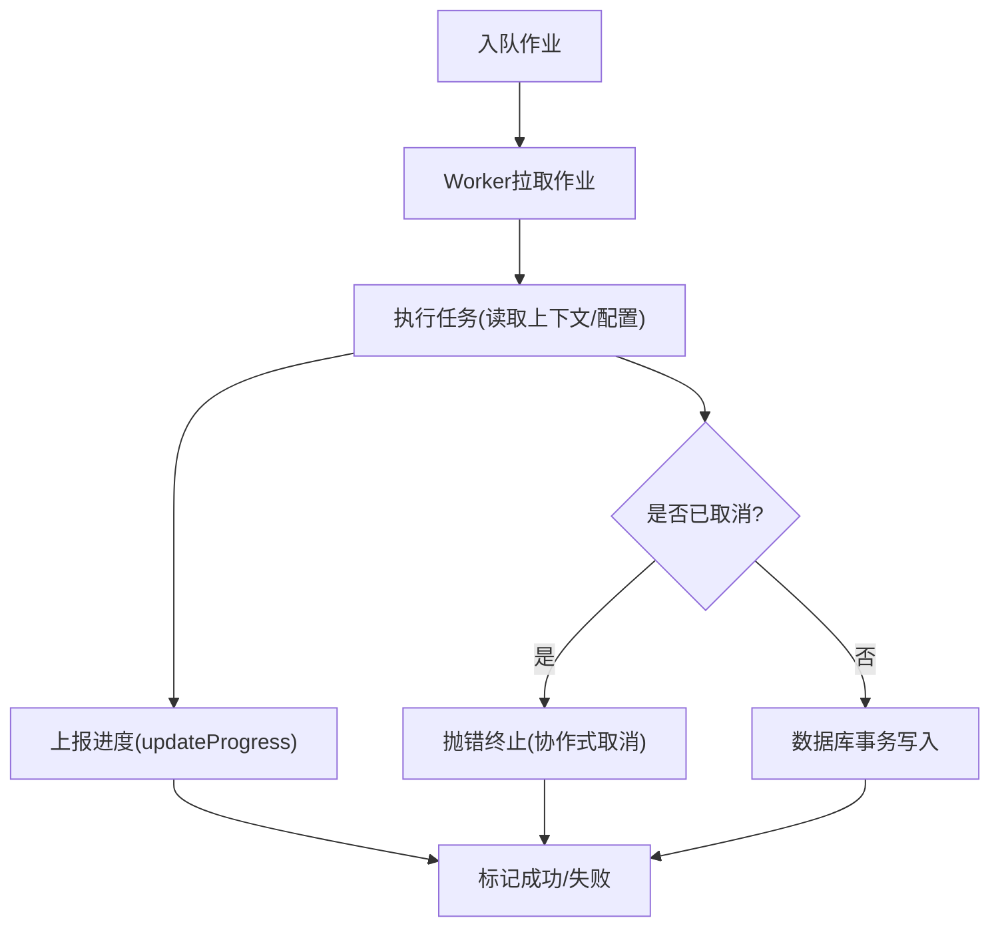
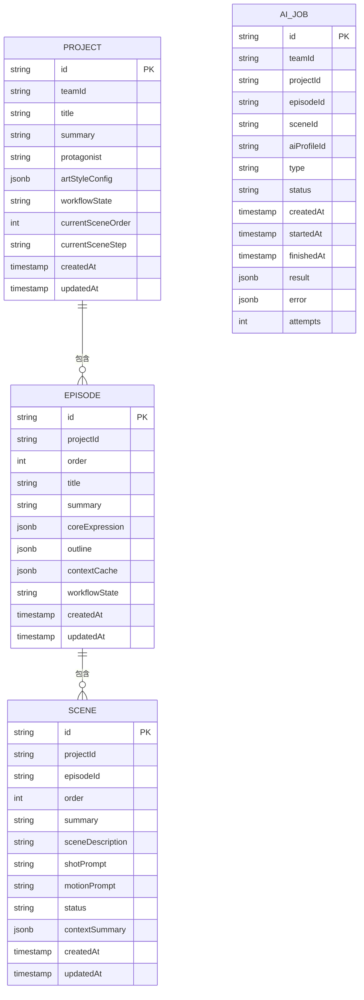
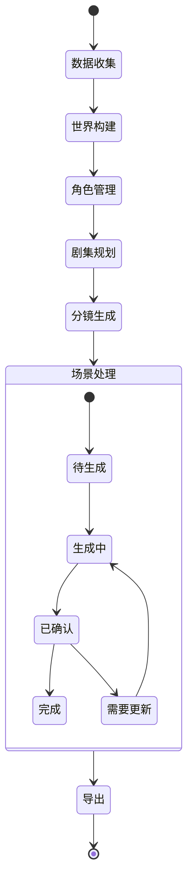
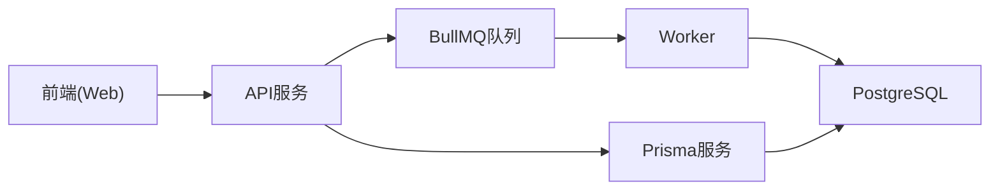

# 数据流设计

<cite>
**本文引用的文件**
- [apps/api/src/main.ts](file://apps/api/src/main.ts)
- [apps/api/src/app.module.ts](file://apps/api/src/app.module.ts)
- [apps/api/src/jobs/ai-jobs.controller.ts](file://apps/api/src/jobs/ai-jobs.controller.ts)
- [apps/api/src/jobs/jobs.service.ts](file://apps/api/src/jobs/jobs.service.ts)
- [apps/api/src/prisma/prisma.service.ts](file://apps/api/src/prisma/prisma.service.ts)
- [apps/api/src/projects/projects.service.ts](file://apps/api/src/projects/projects.service.ts)
- [apps/web/src/main.tsx](file://apps/web/src/main.tsx)
- [apps/web/src/lib/workflowV2/state.ts](file://apps/web/src/lib/workflowV2/state.ts)
- [apps/web/src/stores/projectStore.ts](file://apps/web/src/stores/projectStore.ts)
- [apps/web/src/lib/api/projects.ts](file://apps/web/src/lib/api/projects.ts)
- [apps/web/src/types/index.ts](file://apps/web/src/types/index.ts)
- [apps/worker/src/worker.ts](file://apps/worker/src/worker.ts)
- [apps/worker/src/tasks/generateSceneList.ts](file://apps/worker/src/tasks/generateSceneList.ts)
- [packages/shared/src/schemas/project.ts](file://packages/shared/src/schemas/project.ts)
</cite>

## 目录

1. [引言](#引言)
2. [项目结构](#项目结构)
3. [核心组件](#核心组件)
4. [架构总览](#架构总览)
5. [详细组件分析](#详细组件分析)
6. [依赖关系分析](#依赖关系分析)
7. [性能考量](#性能考量)
8. [故障排查指南](#故障排查指南)
9. [结论](#结论)
10. [附录](#附录)

## 引言

本文件面向AIXSSS项目，系统化梳理从用户输入到最终输出的完整数据流，覆盖前端状态管理、API数据处理、Worker任务执行与数据库持久化。文档重点阐释状态机模式在数据流转中的应用（项目状态、场景状态、作业状态），并给出数据验证、缓存策略与一致性保障机制，以及数据安全、隐私保护与访问控制的设计思路。同时，提供数据流向图、状态转换图与关键数据结构定义，辅以故障排查与性能优化建议。

## 项目结构

AIXSSS采用三层架构：

- 前端Web应用：基于React + Zustand/React Query，负责用户交互、本地/远端数据同步与工作流状态展示。
- 后端API服务：基于NestJS + Prisma，提供REST接口、认证授权、作业编排与事件推送。
- Worker任务执行：基于BullMQ队列，异步执行各类AI生成与处理任务，落地数据库并回传进度。

图表来源

- [apps/web/src/main.tsx](file://apps/web/src/main.tsx#L1-L37)
- [apps/api/src/main.ts](file://apps/api/src/main.ts#L1-L34)
- [apps/api/src/app.module.ts](file://apps/api/src/app.module.ts#L1-L37)
- [apps/worker/src/worker.ts](file://apps/worker/src/worker.ts#L1-L755)

章节来源

- [apps/web/src/main.tsx](file://apps/web/src/main.tsx#L1-L37)
- [apps/api/src/main.ts](file://apps/api/src/main.ts#L1-L34)
- [apps/api/src/app.module.ts](file://apps/api/src/app.module.ts#L1-L37)
- [apps/worker/src/worker.ts](file://apps/worker/src/worker.ts#L1-L755)

## 核心组件

- 前端状态与缓存
  - 本地Zustand状态：项目/场景/角色/搜索/主题等状态集中管理，支持本地持久化与API模式切换。
  - React Query：统一的查询客户端，配置重试、过期策略与缓存清理，配合SSE事件驱动UI刷新。
- 后端API与作业编排
  - JWT鉴权守卫与当前用户装饰器，确保作业与资源访问控制。
  - 作业服务封装队列操作，负责作业入队、状态映射、进度回推与取消。
  - SSE事件通道：将队列进度/完成/失败事件推送给前端。
- Worker任务执行
  - 基于BullMQ Worker，按作业类型路由到具体任务处理器，协作式取消、重试与进度上报。
  - 事务写入：任务内部使用数据库事务保证原子性，避免中间态污染。
- 数据模型与校验
  - Prisma服务封装连接生命周期。
  - 共享Schema与前端类型定义，确保前后端一致的数据契约。

章节来源

- [apps/web/src/stores/projectStore.ts](file://apps/web/src/stores/projectStore.ts#L1-L181)
- [apps/web/src/lib/workflowV2/state.ts](file://apps/web/src/lib/workflowV2/state.ts#L1-L139)
- [apps/web/src/lib/api/projects.ts](file://apps/web/src/lib/api/projects.ts#L1-L53)
- [apps/api/src/jobs/ai-jobs.controller.ts](file://apps/api/src/jobs/ai-jobs.controller.ts#L1-L69)
- [apps/api/src/jobs/jobs.service.ts](file://apps/api/src/jobs/jobs.service.ts#L1-L800)
- [apps/api/src/prisma/prisma.service.ts](file://apps/api/src/prisma/prisma.service.ts#L1-L16)
- [apps/worker/src/worker.ts](file://apps/worker/src/worker.ts#L1-L755)
- [packages/shared/src/schemas/project.ts](file://packages/shared/src/schemas/project.ts#L1-L33)

## 架构总览

下图展示从用户操作到数据库落库的关键数据流路径，包括状态机推进、事件推送与一致性保障。

图表来源

- [apps/web/src/main.tsx](file://apps/web/src/main.tsx#L1-L37)
- [apps/api/src/jobs/ai-jobs.controller.ts](file://apps/api/src/jobs/ai-jobs.controller.ts#L1-L69)
- [apps/api/src/jobs/jobs.service.ts](file://apps/api/src/jobs/jobs.service.ts#L1-L800)
- [apps/worker/src/worker.ts](file://apps/worker/src/worker.ts#L1-L755)
- [apps/api/src/prisma/prisma.service.ts](file://apps/api/src/prisma/prisma.service.ts#L1-L16)

## 详细组件分析

### 前端状态管理与缓存策略

- 项目状态与工作流状态
  - 前端通过Zustand维护项目与场景的本地状态，结合contextCache中的workflowV2结构，实现产物成熟度状态（草稿/评审/锁定）与版本化管理。
  - 项目创建时初始化工作流状态，更新时支持推进状态机并触发统计与版本记录。
- 查询与缓存
  - React Query配置短生命周期缓存与有限重试，避免频繁请求；Mutation失败时由前端主动回滚或提示重试。
  - 支持API模式与本地模式：API模式下以远端为准，本地模式下以LocalStorage为主，必要时进行最佳努力同步。
- 事件驱动
  - 通过SSE订阅作业事件，实时更新UI状态与进度条，提升交互体验。

图表来源

- [apps/web/src/stores/projectStore.ts](file://apps/web/src/stores/projectStore.ts#L1-L181)
- [apps/web/src/lib/api/projects.ts](file://apps/web/src/lib/api/projects.ts#L1-L53)
- [apps/web/src/lib/workflowV2/state.ts](file://apps/web/src/lib/workflowV2/state.ts#L1-L139)
- [apps/web/src/main.tsx](file://apps/web/src/main.tsx#L1-L37)

章节来源

- [apps/web/src/stores/projectStore.ts](file://apps/web/src/stores/projectStore.ts#L1-L181)
- [apps/web/src/lib/workflowV2/state.ts](file://apps/web/src/lib/workflowV2/state.ts#L1-L139)
- [apps/web/src/lib/api/projects.ts](file://apps/web/src/lib/api/projects.ts#L1-L53)
- [apps/web/src/main.tsx](file://apps/web/src/main.tsx#L1-L37)

### API数据处理与作业编排

- 鉴权与访问控制
  - 使用JWT守卫与当前用户装饰器，所有作业相关接口均绑定团队维度校验，防止越权访问。
- 作业入队与状态映射
  - 作业服务根据业务类型构造队列作业，设置重试与清理策略；将数据库中的作业行与队列进度对齐，统一对外暴露ISO时间格式。
- 事件推送
  - SSE通道将progress/completed/failed事件推送到前端，前端据此更新UI与缓存。

图表来源

- [apps/api/src/jobs/ai-jobs.controller.ts](file://apps/api/src/jobs/ai-jobs.controller.ts#L1-L69)
- [apps/api/src/jobs/jobs.service.ts](file://apps/api/src/jobs/jobs.service.ts#L1-L800)

章节来源

- [apps/api/src/jobs/ai-jobs.controller.ts](file://apps/api/src/jobs/ai-jobs.controller.ts#L1-L69)
- [apps/api/src/jobs/jobs.service.ts](file://apps/api/src/jobs/jobs.service.ts#L1-L800)

### Worker任务执行与事务一致性

- 作业路由与协作式取消
  - Worker根据作业名路由到具体任务处理器，执行前更新作业状态为运行中；周期性检查取消状态，若被标记为取消则抛错终止，避免写入半成品。
- 进度上报与重试策略
  - 任务通过updateProgress上报百分比与消息；失败时根据最大尝试次数决定“保持排队并提示重试”或最终标记失败，避免前端误判。
- 事务写入
  - 任务内部使用数据库事务，确保删除旧资产、创建新资产与状态推进的一致性，降低并发风险。

图表来源

- [apps/worker/src/worker.ts](file://apps/worker/src/worker.ts#L1-L755)
- [apps/worker/src/tasks/generateSceneList.ts](file://apps/worker/src/tasks/generateSceneList.ts#L1-L129)

章节来源

- [apps/worker/src/worker.ts](file://apps/worker/src/worker.ts#L1-L755)
- [apps/worker/src/tasks/generateSceneList.ts](file://apps/worker/src/tasks/generateSceneList.ts#L1-L129)

### 数据验证与类型约束

- 前端输入校验
  - 使用共享Schema与类型定义，确保项目创建/更新字段长度、枚举与可选字段符合约束。
- 后端入参校验
  - 作业服务在入队前校验项目/场景/剧集/配置的存在性与完整性，避免无效作业进入队列。
- 项目工作流状态枚举
  - 定义严格的WorkflowState与SceneStep枚举，保证状态机转换合法。

图表来源

- [packages/shared/src/schemas/project.ts](file://packages/shared/src/schemas/project.ts#L1-L33)
- [apps/web/src/types/index.ts](file://apps/web/src/types/index.ts#L453-L633)

章节来源

- [packages/shared/src/schemas/project.ts](file://packages/shared/src/schemas/project.ts#L1-L33)
- [apps/web/src/types/index.ts](file://apps/web/src/types/index.ts#L240-L294)

### 状态机模式在数据流转中的应用

- 项目工作流状态机
  - 从“数据收集”到“世界构建/角色管理/剧集规划/分镜生成/场景处理/导出”的线性推进，配合“草稿/评审/锁定”产物成熟度状态，形成可审计的工作流闭环。
- 场景状态机
  - 从“待生成/生成中”到“确认/完成/需要更新”，贯穿场景锚点、关键帧提示词、运动提示词与台词生成的多阶段推进。
- 作业状态机
  - 从“排队/运行中/成功/失败/取消”到“重试提示/最终失败”，通过SSE与前端状态联动，确保用户可见的确定性。

图表来源

- [apps/web/src/types/index.ts](file://apps/web/src/types/index.ts#L240-L259)
- [apps/web/src/types/index.ts](file://apps/web/src/types/index.ts#L328-L336)

章节来源

- [apps/web/src/types/index.ts](file://apps/web/src/types/index.ts#L240-L259)
- [apps/web/src/types/index.ts](file://apps/web/src/types/index.ts#L328-L336)

### 数据安全、隐私保护与访问控制

- 认证与授权
  - 所有作业接口启用JWT守卫，控制器与服务均以teamId维度校验资源归属，防止越权。
- 敏感信息保护
  - API Key加密存储，Worker侧解密后按需注入；前端不保存敏感配置，优先使用后端AI Profile。
- 事件通道安全
  - SSE事件仅推送当前用户/团队可见的作业事件，避免泄露其他团队数据。
- 数据最小化与脱敏
  - 前端仅渲染必要字段，避免展示敏感细节；后端在响应中统一序列化时间字段，减少冗余信息。

章节来源

- [apps/api/src/jobs/ai-jobs.controller.ts](file://apps/api/src/jobs/ai-jobs.controller.ts#L1-L69)
- [apps/api/src/jobs/jobs.service.ts](file://apps/api/src/jobs/jobs.service.ts#L1-L800)
- [apps/worker/src/worker.ts](file://apps/worker/src/worker.ts#L1-L755)

### 数据同步、事务处理与错误恢复

- 同步策略
  - 前端通过React Query与SSE实现近实时同步；本地模式下以Zustand为主，定期与远端合并。
- 事务处理
  - Worker任务内部使用数据库事务，确保多表写入原子性；API更新项目时亦使用事务保证统计与版本写入的一致性。
- 错误恢复
  - BullMQ自动重试与退避策略；失败时保持排队状态并提示重试，避免前端误判；最终失败时写入错误信息并停止轮询。

章节来源

- [apps/worker/src/worker.ts](file://apps/worker/src/worker.ts#L683-L719)
- [apps/api/src/projects/projects.service.ts](file://apps/api/src/projects/projects.service.ts#L112-L139)

## 依赖关系分析

- 模块耦合
  - Web前端与API通过HTTP/SSE解耦；API与Worker通过Redis队列解耦。
- 外部依赖
  - Redis(BullMQ)负责队列与锁；PostgreSQL承载业务数据；Prisma提供ORM抽象。
- 接口契约
  - 共享Schema与类型定义确保前后端一致，减少因字段差异引发的错误。

图表来源

- [apps/api/src/app.module.ts](file://apps/api/src/app.module.ts#L1-L37)
- [apps/api/src/prisma/prisma.service.ts](file://apps/api/src/prisma/prisma.service.ts#L1-L16)
- [apps/worker/src/worker.ts](file://apps/worker/src/worker.ts#L1-L755)

章节来源

- [apps/api/src/app.module.ts](file://apps/api/src/app.module.ts#L1-L37)
- [apps/api/src/prisma/prisma.service.ts](file://apps/api/src/prisma/prisma.service.ts#L1-L16)
- [apps/worker/src/worker.ts](file://apps/worker/src/worker.ts#L1-L755)

## 性能考量

- 前端
  - 合理设置React Query的staleTime与gcTime，减少无谓请求；对高频更新的场景采用乐观更新与批量提交。
- 后端
  - 控制队列作业的attempts与backoff，避免雪崩；对长耗时任务拆分为子步骤，提升可观测性。
- Worker
  - 并发度按资源容量配置；对大事务进行分批处理，缩短锁持有时间；合理设置lockDuration与stalledInterval，降低假死风险。
- 数据库
  - 为常用查询建立索引；对写密集场景使用事务批处理；定期清理已完成/失败作业，控制表膨胀。

## 故障排查指南

- 作业长时间处于排队/运行中
  - 检查Redis连通性与队列配置；查看Worker日志与作业重试次数；确认API侧SSE事件是否正常推送。
- 作业失败但前端显示“将自动重试”
  - 查看作业行的attempts与错误信息；确认是否达到最大重试次数；必要时人工取消并重新入队。
- 项目状态未推进
  - 检查API更新逻辑与事务是否成功；核对前端状态机推进条件与contextCache变更。
- 前端数据不一致
  - 清理React Query缓存或关闭离线模式；确认SSE事件是否到达；必要时强制刷新页面。

章节来源

- [apps/worker/src/worker.ts](file://apps/worker/src/worker.ts#L683-L719)
- [apps/api/src/jobs/jobs.service.ts](file://apps/api/src/jobs/jobs.service.ts#L1-L800)
- [apps/web/src/main.tsx](file://apps/web/src/main.tsx#L1-L37)

## 结论

AIXSSS通过“前端状态管理 + API作业编排 + Worker异步执行 + 数据库事务”的组合，实现了从用户输入到最终产出的高可靠数据流。状态机模式贯穿项目、场景与作业三个维度，配合SSE事件与缓存策略，既保证了用户体验，也确保了数据一致性与可审计性。建议持续优化队列并发与事务批处理，强化监控告警，进一步提升系统的稳定性与扩展性。

## 附录

- 关键数据结构
  - 项目(Project)：包含标题、摘要、主角、画风配置、工作流状态与时间戳。
  - 剧集(Episode)：包含序号、标题、摘要、核心表达与工作流状态。
  - 分镜(Scene)：包含摘要、场景锚点、关键帧提示词、运动提示词、状态与上下文摘要。
  - 作业(AIJob)：包含类型、状态、重试次数与结果/错误信息。
- 状态枚举
  - 项目工作流状态：IDLE、DATA_COLLECTING、WORLD_VIEW_BUILDING、CHARACTER_MANAGING、EPISODE_PLANNING、SCENE_PROCESSING、EXPORTING等。
  - 场景状态：pending、scene_generating、scene_confirmed、keyframe_generating、motion_generating、completed、needs_update等。
  - 产物成熟度：draft、review、locked。

章节来源

- [apps/web/src/types/index.ts](file://apps/web/src/types/index.ts#L453-L633)
- [apps/web/src/types/index.ts](file://apps/web/src/types/index.ts#L240-L259)
- [apps/web/src/types/index.ts](file://apps/web/src/types/index.ts#L328-L336)
