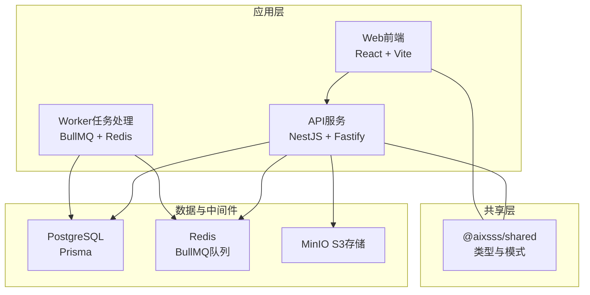
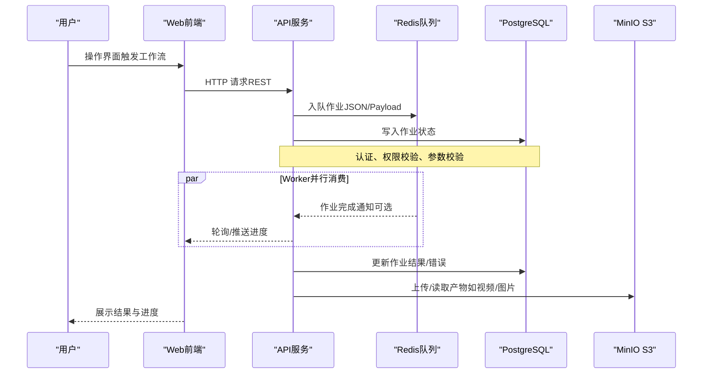
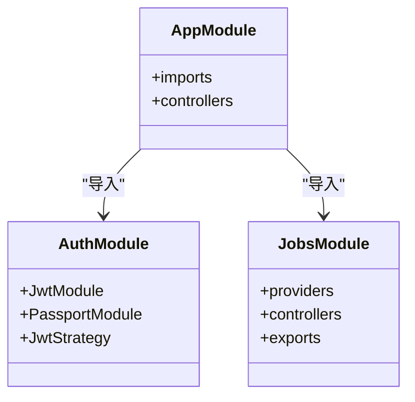
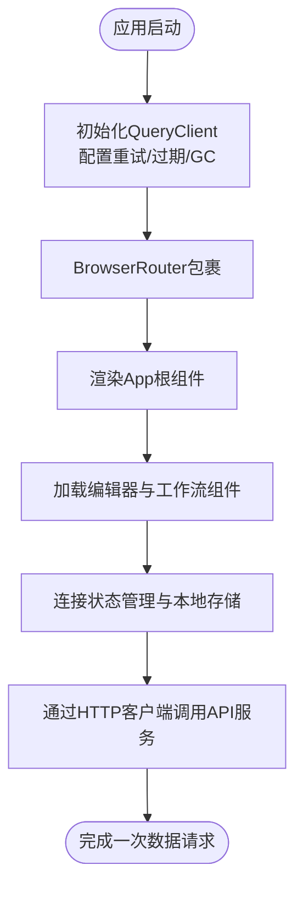
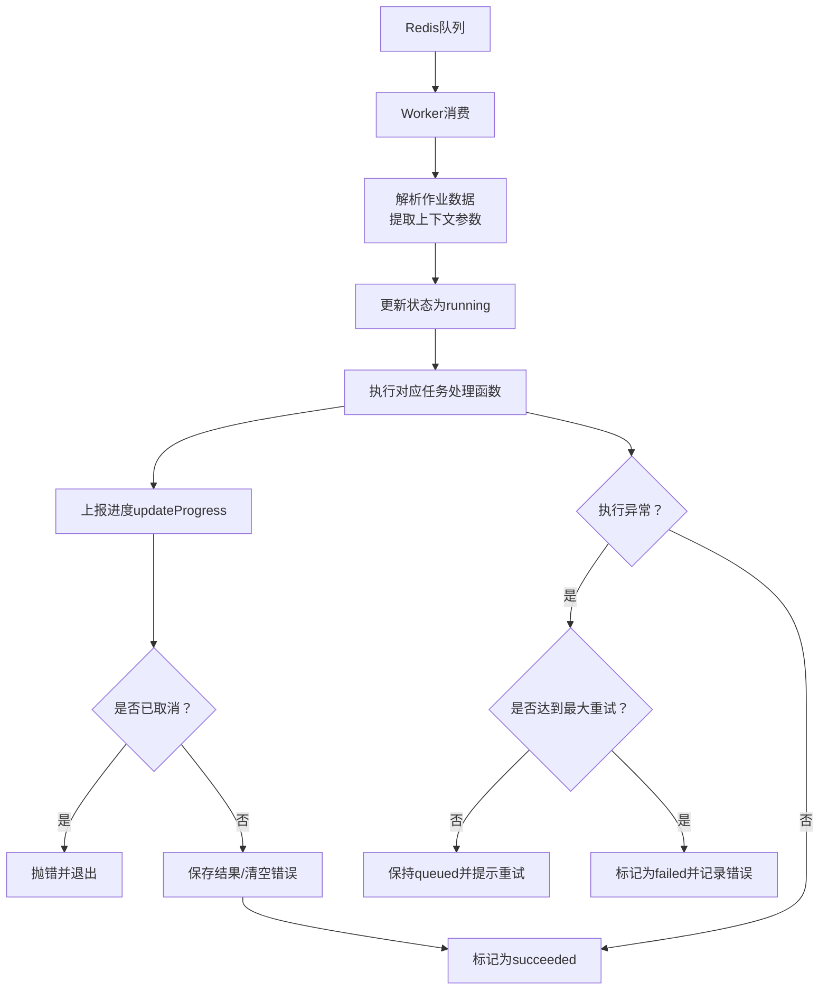
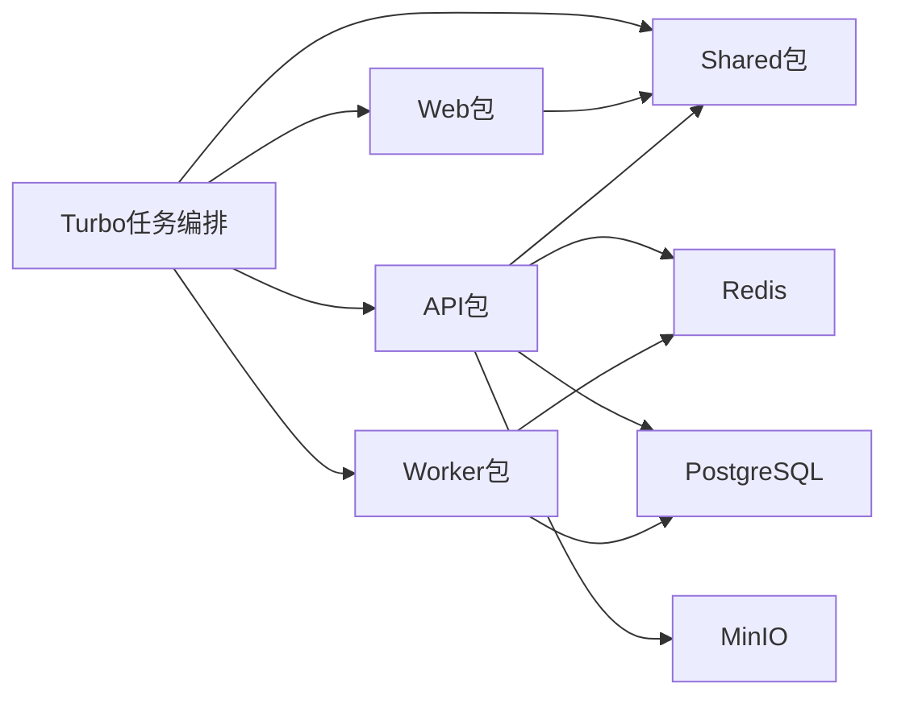
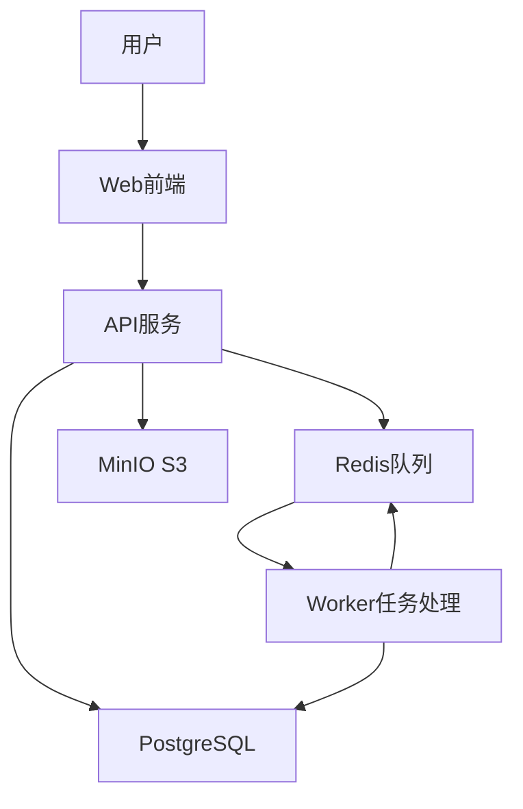

# 整体架构概览

<cite>
**本文引用的文件**
- [apps/api/src/main.ts](file://apps/api/src/main.ts)
- [apps/api/src/app.module.ts](file://apps/api/src/app.module.ts)
- [apps/api/src/config/env.ts](file://apps/api/src/config/env.ts)
- [apps/api/src/auth/auth.module.ts](file://apps/api/src/auth/auth.module.ts)
- [apps/api/src/jobs/jobs.module.ts](file://apps/api/src/jobs/jobs.module.ts)
- [apps/api/package.json](file://apps/api/package.json)
- [apps/web/src/main.tsx](file://apps/web/src/main.tsx)
- [apps/web/package.json](file://apps/web/package.json)
- [apps/worker/src/worker.ts](file://apps/worker/src/worker.ts)
- [apps/worker/src/config/env.ts](file://apps/worker/src/config/env.ts)
- [apps/worker/package.json](file://apps/worker/package.json)
- [packages/shared/src/index.ts](file://packages/shared/src/index.ts)
- [docker-compose.dev.yml](file://docker-compose.dev.yml)
- [turbo.json](file://turbo.json)
- [package.json](file://package.json)
</cite>

## 目录

1. [引言](#引言)
2. [项目结构](#项目结构)
3. [核心组件](#核心组件)
4. [架构总览](#架构总览)
5. [详细组件分析](#详细组件分析)
6. [依赖分析](#依赖分析)
7. [性能考虑](#性能考虑)
8. [故障排查指南](#故障排查指南)
9. [结论](#结论)
10. [附录](#附录)

## 引言

本文件面向AIXSSS项目的整体架构概览，聚焦微服务架构的高层设计与实现细节，明确API服务、Web前端、Worker任务处理三大核心模块的职责边界、交互关系、数据流向与通信协议。同时阐述技术栈选择与架构决策依据，给出系统上下文图与组件分解图，说明高可用、负载均衡与故障恢复策略，提供部署拓扑与基础设施需求，并覆盖安全、监控与扩展性等横切关注点。

## 项目结构

AIXSSS采用多包工作区（monorepo）组织方式，使用Turbo进行构建与任务编排，核心模块如下：

- API服务（NestJS + Fastify）：提供REST接口、认证鉴权、作业调度与健康检查。
- Web前端（React + Vite）：基于TanStack React Query进行数据获取与缓存，提供可视化编辑器与工作流界面。
- Worker任务处理（BullMQ + Redis）：异步执行AI生成与处理任务，支持进度上报与重试策略。
- 共享包（shared）：统一类型定义与数据模式，确保前后端与服务间契约一致。

图表来源

- [apps/api/src/app.module.ts](file://apps/api/src/app.module.ts#L16-L35)
- [apps/api/src/main.ts](file://apps/api/src/main.ts#L9-L26)
- [apps/worker/src/worker.ts](file://apps/worker/src/worker.ts#L44-L729)
- [docker-compose.dev.yml](file://docker-compose.dev.yml#L1-L35)
- [packages/shared/src/index.ts](file://packages/shared/src/index.ts#L1-L6)

章节来源

- [turbo.json](file://turbo.json#L1-L30)
- [package.json](file://package.json#L7-L16)

## 核心组件

- API服务
  - 基于NestJS + Fastify，启用CORS与全局异常过滤，设置统一前缀“/api”，负责认证、资源管理、作业调度与健康检查。
  - 关键模块：认证模块（JWT）、作业模块（队列与控制器）、项目/场景/角色/世界观/系统提示等业务模块。
- Web前端
  - 基于React + Vite，使用TanStack React Query进行数据请求与缓存，提供画布编辑器、工作流面板与多视图组件。
  - 通过HTTP客户端封装调用API服务，支持主题切换、快捷键、本地数据迁移与版本历史等功能。
- Worker任务处理
  - 基于BullMQ与Redis，按任务类型分发到具体处理函数，持久化作业状态至数据库，支持进度上报、协作式取消与重试策略。
  - 支持并发度配置与锁时长、停滞检测等参数，保障稳定性与可恢复性。

章节来源

- [apps/api/src/main.ts](file://apps/api/src/main.ts#L9-L26)
- [apps/api/src/app.module.ts](file://apps/api/src/app.module.ts#L16-L35)
- [apps/api/src/auth/auth.module.ts](file://apps/api/src/auth/auth.module.ts#L10-L26)
- [apps/api/src/jobs/jobs.module.ts](file://apps/api/src/jobs/jobs.module.ts#L8-L13)
- [apps/web/src/main.tsx](file://apps/web/src/main.tsx#L13-L25)
- [apps/worker/src/worker.ts](file://apps/worker/src/worker.ts#L44-L729)

## 架构总览

系统采用“前端-后端-队列-数据库/存储”的分层架构。前端通过HTTP与后端交互，后端负责业务编排与数据持久化，Worker从队列拉取任务异步执行，最终结果回写数据库并由前端轮询或推送更新。

图表来源

- [apps/api/src/main.ts](file://apps/api/src/main.ts#L16-L22)
- [apps/worker/src/worker.ts](file://apps/worker/src/worker.ts#L50-L729)
- [docker-compose.dev.yml](file://docker-compose.dev.yml#L2-L28)

## 详细组件分析

### API服务（NestJS + Fastify）

- 启动流程与中间件
  - 使用Fastify适配器启动，启用CORS并设置全局前缀“/api”。
  - 注册全局异常过滤器，统一错误响应格式。
- 配置与验证
  - 通过Zod对环境变量进行严格校验，包括数据库URL、JWT密钥、加密密钥、Redis地址与队列名等。
- 模块化组织
  - 认证模块（Passport + JWT）提供登录、令牌签发与守卫。
  - 作业模块（队列提供者、控制器、服务）负责作业提交、查询与工作流编排。
  - 业务模块（项目、场景、角色、世界观、系统提示等）按领域拆分，职责清晰。
- 数据访问
  - 使用Prisma进行ORM操作，配合迁移与客户端生成。

图表来源

- [apps/api/src/app.module.ts](file://apps/api/src/app.module.ts#L16-L35)
- [apps/api/src/auth/auth.module.ts](file://apps/api/src/auth/auth.module.ts#L10-L26)
- [apps/api/src/jobs/jobs.module.ts](file://apps/api/src/jobs/jobs.module.ts#L8-L13)

章节来源

- [apps/api/src/main.ts](file://apps/api/src/main.ts#L9-L26)
- [apps/api/src/config/env.ts](file://apps/api/src/config/env.ts#L3-L12)
- [apps/api/src/auth/auth.module.ts](file://apps/api/src/auth/auth.module.ts#L14-L21)
- [apps/api/src/jobs/jobs.module.ts](file://apps/api/src/jobs/jobs.module.ts#L8-L13)
- [apps/api/package.json](file://apps/api/package.json#L18-L35)

### Web前端（React + TanStack React Query）

- 初始化与数据层
  - 创建QueryClient并配置重试、过期时间与GC时间，开启React Query Devtools（开发环境）。
  - 使用BrowserRouter包裹应用，提供路由能力。
- 组件与功能
  - 编辑器组件（画布、聊天面板、工作流面板等），围绕项目、场景、角色、世界观与系统提示展开。
  - 工具库（AI工厂、上下文构建、输出修复、进度桥接等）支撑工作流执行。
  - 状态管理（Zustand Store集合）与本地存储（localStorage）结合，支持离线体验与数据迁移。
- 与API交互
  - 通过HTTP客户端封装调用API服务，统一处理错误与重试策略。

图表来源

- [apps/web/src/main.tsx](file://apps/web/src/main.tsx#L13-L36)

章节来源

- [apps/web/src/main.tsx](file://apps/web/src/main.tsx#L1-L37)
- [apps/web/package.json](file://apps/web/package.json#L22-L62)

### Worker任务处理（BullMQ + Redis）

- 作业模型与生命周期
  - 从Redis队列拉取作业，根据作业类型分派到对应处理函数，更新数据库中的作业状态（running/failed/succeeded/cancelled）。
  - 支持协作式取消：若前端标记取消，Worker在下个进度点检查并抛错，避免继续写入产物。
- 进度与重试
  - 通过updateProgress上报进度，失败时根据最大重试次数决定是否保留队列状态并提示“将自动重试”。
- 并发与稳定性
  - 支持并发度配置，设置锁时长与停滞间隔，限制最大停滞次数，降低误判与资源占用。
- 数据与外部集成
  - 使用Prisma访问数据库，读取/写入作业与中间结果；通过加密密钥管理第三方API Key。

图表来源

- [apps/worker/src/worker.ts](file://apps/worker/src/worker.ts#L50-L729)

章节来源

- [apps/worker/src/worker.ts](file://apps/worker/src/worker.ts#L44-L755)
- [apps/worker/src/config/env.ts](file://apps/worker/src/config/env.ts#L3-L10)
- [apps/worker/package.json](file://apps/worker/package.json#L14-L21)

### 共享包（@aixsss/shared）

- 统一导出类型与数据模式，确保API、Web与Worker之间的契约一致。
- 包含项目、场景、角色、世界观、叙事因果链、系统提示等Schema与工具方法。

章节来源

- [packages/shared/src/index.ts](file://packages/shared/src/index.ts#L1-L6)

## 依赖分析

- 工作区与任务编排
  - 使用Turbo进行多包并行构建、测试与类型检查，任务间依赖关系明确，提升开发效率。
- 应用间依赖
  - Web与API通过共享包进行类型与模式对齐；Worker同样依赖共享包以保证数据一致性。
- 外部依赖
  - API与Worker均依赖Redis作为队列与锁存储；API依赖PostgreSQL进行数据持久化；MinIO提供对象存储能力。

图表来源

- [turbo.json](file://turbo.json#L4-L27)
- [package.json](file://package.json#L7-L16)
- [docker-compose.dev.yml](file://docker-compose.dev.yml#L2-L28)

章节来源

- [turbo.json](file://turbo.json#L1-L30)
- [package.json](file://package.json#L1-L24)
- [apps/api/package.json](file://apps/api/package.json#L18-L35)
- [apps/worker/package.json](file://apps/worker/package.json#L14-L21)
- [apps/web/package.json](file://apps/web/package.json#L22-L62)

## 性能考虑

- 前端性能
  - QueryClient合理配置重试与过期时间，减少重复请求；开发环境启用Devtools便于调试。
- 后端性能
  - Fastify适配器提供高性能HTTP处理；模块化拆分降低耦合，便于独立优化。
- 队列与任务
  - 通过并发度与锁时长平衡吞吐与稳定性；停滞检测与最大停滞次数避免僵尸作业。
- 存储与网络
  - MinIO提供高吞吐对象存储，适合视频/图片等大体积产物；Redis用于低延迟队列与锁。

## 故障排查指南

- 启动失败
  - API/Worker启动失败时会打印错误并退出进程码，优先检查环境变量与端口占用。
- 队列无作业
  - 确认Redis可达、队列名正确、Worker并发度配置合理；查看Worker日志中的ready事件。
- 作业卡住
  - 检查stalledInterval与lockDuration配置；确认作业未被协作式取消；必要时手动清理队列。
- 数据不一致
  - 核对Prisma迁移与客户端生成；确认API与Worker使用的共享Schema一致。
- 安全与鉴权
  - 确保JWT密钥长度足够且安全；API Key加密密钥满足最小长度要求；生产环境关闭开发工具。

章节来源

- [apps/api/src/main.ts](file://apps/api/src/main.ts#L28-L31)
- [apps/worker/src/worker.ts](file://apps/worker/src/worker.ts#L741-L748)
- [apps/api/src/config/env.ts](file://apps/api/src/config/env.ts#L3-L12)
- [apps/worker/src/config/env.ts](file://apps/worker/src/config/env.ts#L3-L10)

## 结论

AIXSSS通过清晰的模块边界与稳定的中间件栈，实现了从前端交互到后端编排再到异步任务处理的完整闭环。共享包确保了跨模块的一致性，Turbo提升了工程效率。在可扩展性方面，队列与存储分离、模块化服务设计为水平扩展提供了基础；在可靠性方面，协作式取消、重试策略与停滞检测增强了系统韧性。建议在生产环境中完善监控告警、限流熔断与备份策略，持续迭代以满足业务增长。

## 附录

### 系统上下文图

图表来源

- [apps/api/src/main.ts](file://apps/api/src/main.ts#L16-L22)
- [apps/worker/src/worker.ts](file://apps/worker/src/worker.ts#L47-L48)
- [docker-compose.dev.yml](file://docker-compose.dev.yml#L2-L28)

### 部署拓扑与基础设施需求

- 开发环境
  - 使用docker-compose启动PostgreSQL、Redis与MinIO，端口映射便于本地调试。
- 生产环境建议
  - API服务：多实例部署，配合反向代理与健康检查。
  - Worker：多实例并行，按CPU核数与任务复杂度调整并发度。
  - 数据库：主从复制与备份策略，确保高可用。
  - 缓存：Redis哨兵或集群，避免单点故障。
  - 对象存储：MinIO集群或云厂商S3，开启版本控制与跨域策略。
- 网络与安全
  - API服务启用HTTPS与CORS白名单；Worker与API通过内网访问Redis与数据库。
  - 使用强密钥与密文存储，定期轮换。

章节来源

- [docker-compose.dev.yml](file://docker-compose.dev.yml#L1-L35)
- [apps/api/src/config/env.ts](file://apps/api/src/config/env.ts#L3-L12)
- [apps/worker/src/config/env.ts](file://apps/worker/src/config/env.ts#L3-L10)
