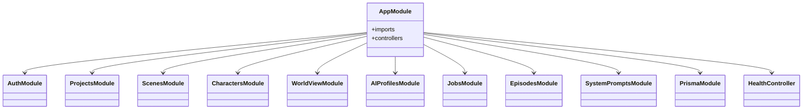

# 架构设计

<cite>
**本文引用的文件**
- [README.md](file://README.md)
- [package.json](file://package.json)
- [turbo.json](file://turbo.json)
- [pnpm-workspace.yaml](file://pnpm-workspace.yaml)
- [docker-compose.dev.yml](file://docker-compose.dev.yml)
- [apps/api/src/main.ts](file://apps/api/src/main.ts)
- [apps/api/src/app.module.ts](file://apps/api/src/app.module.ts)
- [apps/api/src/config/env.ts](file://apps/api/src/config/env.ts)
- [apps/api/package.json](file://apps/api/package.json)
- [apps/web/vite.config.ts](file://apps/web/vite.config.ts)
- [apps/web/src/main.tsx](file://apps/web/src/main.tsx)
- [apps/web/package.json](file://apps/web/package.json)
- [apps/worker/src/config/env.ts](file://apps/worker/src/config/env.ts)
- [apps/worker/package.json](file://apps/worker/package.json)
- [packages/shared/package.json](file://packages/shared/package.json)
</cite>

## 目录

1. [引言](#引言)
2. [项目结构](#项目结构)
3. [核心组件](#核心组件)
4. [架构总览](#架构总览)
5. [组件详解](#组件详解)
6. [依赖关系分析](#依赖关系分析)
7. [性能考量](#性能考量)
8. [故障排查指南](#故障排查指南)
9. [结论](#结论)
10. [附录](#附录)

## 引言

本架构设计文档面向 AIXSSS（漫剧创作助手）项目，系统性阐述其微服务架构：API 服务、Web 前端、Worker 任务处理三大模块的职责划分、交互关系与数据流。文档覆盖技术选型、架构模式、系统边界、高可用与扩展性、部署拓扑、安全与监控、灾难恢复等横切关注点，并提供系统上下文图与组件分解图，帮助开发者与运维人员快速理解并高效落地。

## 项目结构

AIXSSS 采用多包工作区（monorepo）组织方式，通过 pnpm workspace 管理，Turbo 进行任务编排与缓存加速。核心目录与职责如下：

- apps/api：基于 NestJS 的 Fastify 应用，提供鉴权、项目/分镜/AI 配置与队列化工作流的后端服务。
- apps/web：基于 React + Vite 的前端应用，提供分镜编辑、工作流可视化与数据管理界面。
- apps/worker：基于 BullMQ 的 Worker，消费队列任务并执行 AI 生成与处理逻辑。
- packages/shared：前后端共享的类型与 Zod Schema，确保接口一致性与强类型校验。
- docs：工程与迁移文档，辅助审计与演进。

图表来源

- [pnpm-workspace.yaml](file://pnpm-workspace.yaml#L1-L6)
- [apps/api/src/app.module.ts](file://apps/api/src/app.module.ts#L16-L35)
- [apps/web/vite.config.ts](file://apps/web/vite.config.ts#L24-L34)
- [docker-compose.dev.yml](file://docker-compose.dev.yml#L1-L35)

章节来源

- [README.md](file://README.md#L63-L73)
- [pnpm-workspace.yaml](file://pnpm-workspace.yaml#L1-L6)
- [turbo.json](file://turbo.json#L1-L30)

## 核心组件

- API 服务（NestJS + Fastify）
  - 全局启用 CORS，设置统一前缀 /api，注册全局异常过滤器。
  - 使用 Prisma 连接 Postgres，Redis 作为队列与缓存。
  - 提供鉴权、项目/分镜/角色/世界观/AI 配置、工作流与健康检查等模块。
- Web 前端（React + Vite）
  - 本地开发通过 Vite 代理 /api 到 API 服务，默认端口 3001。
  - 使用 TanStack React Query 管理状态与缓存，支持可视化工作流与批量操作。
- Worker（BullMQ）
  - 从 Redis 队列拉取任务，执行 AI 生成与处理，支持并发度配置。
  - 与 API 共享数据库连接，避免浏览器直连敏感密钥。
- 共享包（@aixsss/shared）
  - 统一前后端数据模型与校验 Schema，降低耦合与维护成本。

章节来源

- [apps/api/src/main.ts](file://apps/api/src/main.ts#L9-L26)
- [apps/api/src/app.module.ts](file://apps/api/src/app.module.ts#L16-L35)
- [apps/web/src/main.tsx](file://apps/web/src/main.tsx#L13-L25)
- [apps/web/vite.config.ts](file://apps/web/vite.config.ts#L24-L34)
- [apps/worker/src/config/env.ts](file://apps/worker/src/config/env.ts#L3-L10)
- [packages/shared/package.json](file://packages/shared/package.json#L1-L32)

## 架构总览

AIXSSS 采用“前端无直连密钥”的安全边界设计：浏览器仅与 API 服务交互，API 服务通过队列调度 Worker 执行 AI 任务，Worker 再访问外部 LLM 供应商。基础设施层提供 Postgres、Redis、MinIO，形成稳定的数据与消息通道。

图表来源

- [apps/api/src/main.ts](file://apps/api/src/main.ts#L16-L22)
- [apps/api/src/config/env.ts](file://apps/api/src/config/env.ts#L6-L11)
- [apps/worker/src/config/env.ts](file://apps/worker/src/config/env.ts#L5-L8)
- [docker-compose.dev.yml](file://docker-compose.dev.yml#L2-L28)

## 组件详解

### API 服务（后端）

- 技术栈与职责
  - Web 框架：NestJS + Fastify（高性能 HTTP 服务器适配器）。
  - 数据持久化：Prisma Client + Postgres。
  - 队列与缓存：BullMQ（队列）+ Redis。
  - 安全：JWT 鉴权、Passport、CORS 配置。
  - 异常处理：全局异常过滤器统一输出。
- 关键配置
  - 环境变量校验：Zod Schema，强制 JWT 密钥、数据库 URL、加密密钥、Redis URL、队列名等。
  - CORS：支持跨域与凭证，便于前端代理访问。
  - 全局前缀：/api，隔离其他路由。
- 模块化设计
  - 鉴权、项目、分镜、角色、世界观、AI 配置、工作流、系统提示等模块按功能拆分，提升内聚与解耦。

图表来源

- [apps/api/src/app.module.ts](file://apps/api/src/app.module.ts#L16-L35)

章节来源

- [apps/api/src/main.ts](file://apps/api/src/main.ts#L9-L26)
- [apps/api/src/config/env.ts](file://apps/api/src/config/env.ts#L3-L12)
- [apps/api/src/app.module.ts](file://apps/api/src/app.module.ts#L16-L35)
- [apps/api/package.json](file://apps/api/package.json#L18-L36)

### Web 前端

- 技术栈与职责
  - 视图层：React + Radix UI + XYFlow 可视化画布。
  - 状态与缓存：TanStack React Query（带重试、过期时间与 GC）。
  - 开发体验：Vite 代理 /api 到 API 服务，支持热更新与可视化打包分析。
- 关键特性
  - 本地开发代理：/api -> http://localhost:3001。
  - 代码分割：手动分包策略，优化首屏与运行时性能。
  - 生产构建：esbuild 压缩、CSS 分割、目标 ES2020。
- 与后端交互
  - 通过 /api 前缀调用后端接口，遵循统一的响应格式与鉴权流程。

图表来源

- [apps/web/vite.config.ts](file://apps/web/vite.config.ts#L24-L34)
- [apps/api/src/main.ts](file://apps/api/src/main.ts#L21-L22)

章节来源

- [apps/web/src/main.tsx](file://apps/web/src/main.tsx#L13-L25)
- [apps/web/vite.config.ts](file://apps/web/vite.config.ts#L24-L34)
- [apps/web/package.json](file://apps/web/package.json#L22-L62)

### Worker 任务处理

- 技术栈与职责
  - 队列与任务：BullMQ + Redis。
  - 并发控制：通过环境变量配置 Worker 并发度。
  - 数据访问：共享 @aixsss/shared 类型与 Schema，使用 Prisma Client。
- 工作流
  - Worker 从 Redis 队列拉取任务，执行 AI 生成/处理逻辑，完成后回写结果。
  - 与 API 共享数据库连接，避免浏览器直连外部密钥。

图表来源

- [apps/worker/src/config/env.ts](file://apps/worker/src/config/env.ts#L3-L10)
- [apps/worker/package.json](file://apps/worker/package.json#L14-L22)

章节来源

- [apps/worker/src/config/env.ts](file://apps/worker/src/config/env.ts#L3-L10)
- [apps/worker/package.json](file://apps/worker/package.json#L14-L22)

### 共享包（@aixsss/shared）

- 职责
  - 统一前后端数据模型与 Zod Schema，减少重复定义与不一致风险。
  - 支持测试与类型检查，保障演进质量。
- 影响
  - API 与 Worker 通过 workspace:\* 引用，确保类型与校验一致。

章节来源

- [packages/shared/package.json](file://packages/shared/package.json#L1-L32)
- [apps/api/package.json](file://apps/api/package.json#L18-L20)
- [apps/worker/package.json](file://apps/worker/package.json#L14-L16)

## 依赖关系分析

- 包依赖
  - API 与 Worker 显式依赖 @aixsss/shared，实现类型与 Schema 的统一。
  - Web 依赖 @aixsss/shared，保证前端与后端接口契约一致。
- 外部依赖
  - API：NestJS、Fastify、Prisma、BullMQ、Redis、Passport/JWT、Zod。
  - Worker：BullMQ、Redis、Prisma、Zod。
  - Web：React、Radix UI、XYFlow、TanStack React Query、Zustand、TailwindCSS 等。
- 基础设施
  - Postgres（数据持久化）、Redis（队列/缓存）、MinIO（对象存储）。

图表来源

- [apps/api/package.json](file://apps/api/package.json#L18-L36)
- [apps/worker/package.json](file://apps/worker/package.json#L14-L22)
- [apps/web/package.json](file://apps/web/package.json#L22-L62)
- [docker-compose.dev.yml](file://docker-compose.dev.yml#L2-L28)

章节来源

- [apps/api/package.json](file://apps/api/package.json#L18-L36)
- [apps/worker/package.json](file://apps/worker/package.json#L14-L22)
- [apps/web/package.json](file://apps/web/package.json#L22-L62)
- [docker-compose.dev.yml](file://docker-compose.dev.yml#L2-L28)

## 性能考量

- 前端性能
  - 代码分割：按 vendor、UI 组件库、图表、拖拽、工具库、加密压缩等维度拆分，降低首屏体积。
  - 构建优化：esbuild 压缩、CSS 分割、目标 ES2020、可选移除 console/debugger。
  - 依赖预构建：优化常用依赖的二次启动速度。
- 后端性能
  - Fastify 适配器提供高性能 HTTP 处理。
  - BullMQ 队列与 Redis 缓存配合，支持异步与幂等处理。
- 缓存策略
  - Redis 用于队列与缓存，API 层可结合业务场景引入读写分离与热点数据缓存。
- 资源隔离
  - 通过独立进程/容器运行 API、Worker、前端与基础设施，避免资源争用。

章节来源

- [apps/web/vite.config.ts](file://apps/web/vite.config.ts#L36-L83)
- [apps/api/src/main.ts](file://apps/api/src/main.ts#L9-L11)

## 故障排查指南

- 启动失败
  - API：检查环境变量是否满足 Zod 校验（数据库 URL、JWT 密钥、加密密钥、Redis URL、队列名），确认端口占用与 CORS 配置。
  - Worker：核对数据库 URL、加密密钥、Redis URL、队列名与并发度配置。
  - Web：确认 /api 代理指向正确端口，开发服务器可访问。
- 数据库与队列
  - Postgres/Redis/MinIO 服务是否正常运行，端口映射与卷挂载是否正确。
- 日志与可观测性
  - API 启用了全局异常过滤器，建议在生产环境接入结构化日志与错误追踪。
  - Worker 任务执行失败需检查队列状态与任务重试策略。
- 本地迁移
  - 当处于 API 模式且检测到本地数据时，前端会提示“导入到云端”，注意仅导入项目与分镜核心数据。

章节来源

- [apps/api/src/config/env.ts](file://apps/api/src/config/env.ts#L3-L12)
- [apps/worker/src/config/env.ts](file://apps/worker/src/config/env.ts#L3-L10)
- [docker-compose.dev.yml](file://docker-compose.dev.yml#L1-L35)
- [README.md](file://README.md#L75-L82)

## 结论

AIXSSS 以清晰的模块边界与共享契约实现前后端协同：前端专注可视化与交互，后端聚焦鉴权与数据治理，Worker 负责异步任务执行。通过 Redis 队列与 Postgres/MinIO 基础设施，系统具备良好的扩展性与可维护性。建议在生产环境中完善监控告警、限流熔断与灾备演练，持续迭代工作流与任务能力。

## 附录

### 系统上下文图

图表来源

- [apps/web/vite.config.ts](file://apps/web/vite.config.ts#L24-L34)
- [apps/api/src/main.ts](file://apps/api/src/main.ts#L16-L22)
- [docker-compose.dev.yml](file://docker-compose.dev.yml#L2-L28)

### 组件分解图

图表来源

- [apps/api/src/app.module.ts](file://apps/api/src/app.module.ts#L16-L35)
- [apps/worker/src/config/env.ts](file://apps/worker/src/config/env.ts#L5-L8)
- [docker-compose.dev.yml](file://docker-compose.dev.yml#L2-L28)

### 部署拓扑与高可用建议

- 基础设施
  - 使用 docker-compose 或容器编排平台部署 Postgres、Redis、MinIO。
  - 前端静态资源可部署至 CDN 或反向代理后端。
- 高可用
  - API 与 Worker 均可水平扩展，通过负载均衡对外暴露 API。
  - Redis 使用哨兵/集群模式，Postgres 使用主从复制与备份。
- 安全
  - 强制 HTTPS 传输，限制 CORS 源，严格管理 JWT 与加密密钥。
  - Worker 不暴露外部密钥，所有密钥加密存储并通过 API 注入。
- 监控与日志
  - 采集 API、Worker、数据库与队列指标，建立告警与链路追踪。
- 灾难恢复
  - 定期备份数据库与对象存储，验证恢复流程；队列任务具备幂等与重试策略。

章节来源

- [docker-compose.dev.yml](file://docker-compose.dev.yml#L1-L35)
- [apps/api/src/config/env.ts](file://apps/api/src/config/env.ts#L6-L11)
- [apps/worker/src/config/env.ts](file://apps/worker/src/config/env.ts#L7-L9)

### 技术栈与版本兼容性

- 工作区与构建
  - pnpm workspace、Turbo、TypeScript 版本与 ESLint/Prettier 配置保持一致。
- 前端
  - React、Vite、Radix UI、XYFlow、TanStack React Query、Zustand、TailwindCSS。
- 后端
  - NestJS、Fastify、Prisma、BullMQ、Redis、Passport/JWT、Zod。
- 任务端
  - BullMQ、Redis、Prisma、Zod。
- 共享包
  - Zod Schema 与 TypeScript 类型，统一前后端契约。

章节来源

- [package.json](file://package.json#L1-L24)
- [turbo.json](file://turbo.json#L1-L30)
- [apps/web/package.json](file://apps/web/package.json#L22-L62)
- [apps/api/package.json](file://apps/api/package.json#L18-L36)
- [apps/worker/package.json](file://apps/worker/package.json#L14-L22)
- [packages/shared/package.json](file://packages/shared/package.json#L18-L20)
