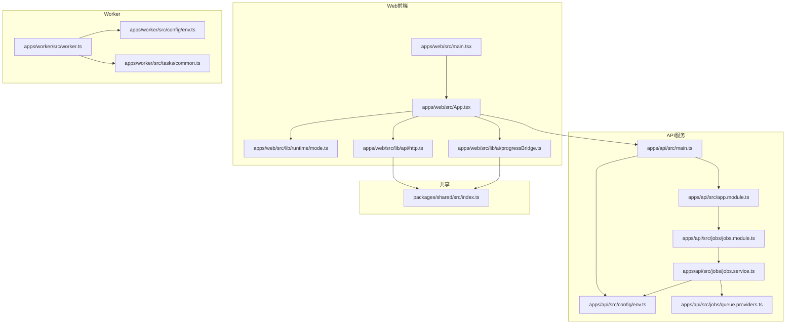
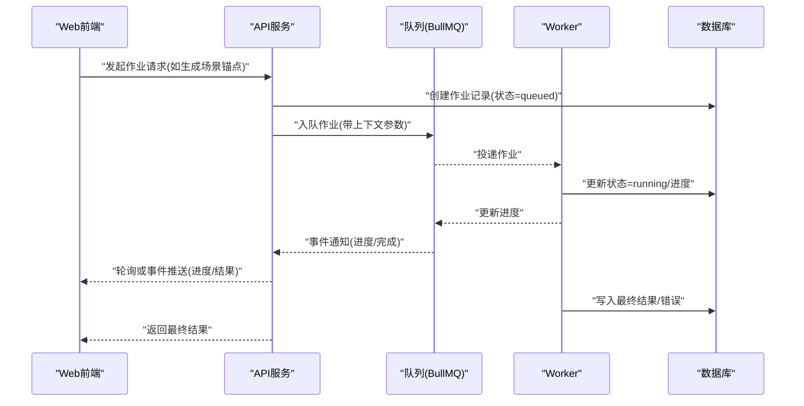
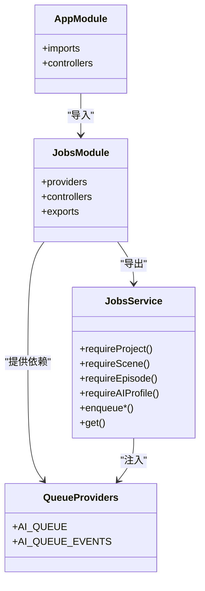
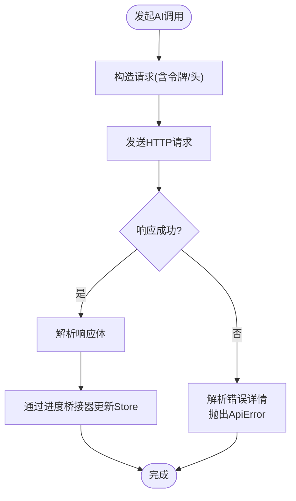
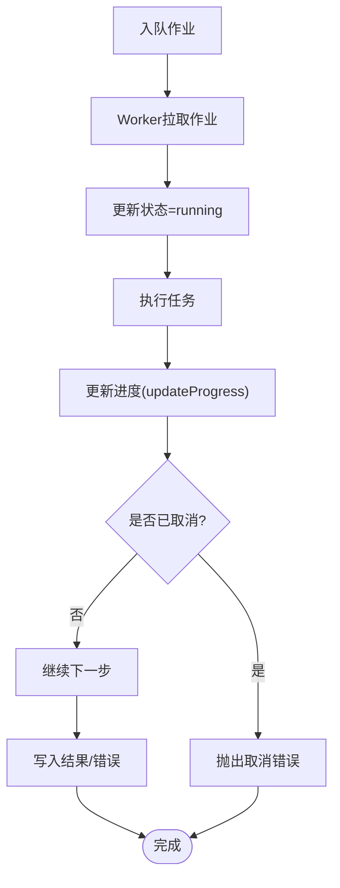
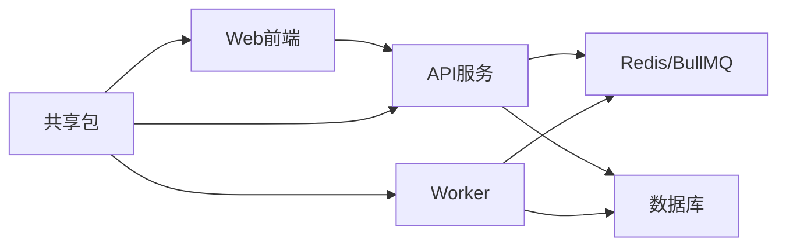

# 模块间关系

<cite>
**本文引用的文件**
- [apps/api/src/main.ts](file://apps/api/src/main.ts)
- [apps/api/src/app.module.ts](file://apps/api/src/app.module.ts)
- [apps/api/src/config/env.ts](file://apps/api/src/config/env.ts)
- [apps/api/src/jobs/jobs.module.ts](file://apps/api/src/jobs/jobs.module.ts)
- [apps/api/src/jobs/jobs.service.ts](file://apps/api/src/jobs/jobs.service.ts)
- [apps/api/src/jobs/queue.providers.ts](file://apps/api/src/jobs/queue.providers.ts)
- [apps/web/src/main.tsx](file://apps/web/src/main.tsx)
- [apps/web/src/App.tsx](file://apps/web/src/App.tsx)
- [apps/web/src/lib/runtime/mode.ts](file://apps/web/src/lib/runtime/mode.ts)
- [apps/web/src/lib/api/http.ts](file://apps/web/src/lib/api/http.ts)
- [apps/web/src/lib/ai/progressBridge.ts](file://apps/web/src/lib/ai/progressBridge.ts)
- [apps/worker/src/worker.ts](file://apps/worker/src/worker.ts)
- [apps/worker/src/config/env.ts](file://apps/worker/src/config/env.ts)
- [apps/worker/src/tasks/common.ts](file://apps/worker/src/tasks/common.ts)
- [packages/shared/src/index.ts](file://packages/shared/src/index.ts)
</cite>

## 目录

1. [引言](#引言)
2. [项目结构](#项目结构)
3. [核心组件](#核心组件)
4. [架构总览](#架构总览)
5. [详细组件分析](#详细组件分析)
6. [依赖分析](#依赖分析)
7. [性能考量](#性能考量)
8. [故障排查指南](#故障排查指南)
9. [结论](#结论)
10. [附录](#附录)

## 引言

本文件聚焦于AIXSSS项目的三大核心模块：API服务、Web前端、Worker任务处理。文档从模块间关系出发，系统阐述三者之间的依赖、接口契约、数据传递、事件触发与状态同步机制，以及错误处理与异常传播路径。同时给出解耦设计、依赖注入模式与生命周期管理的实践建议，并提供调用链路示例与性能优化要点，以帮助开发者在复杂交互场景下实现稳定、可维护与高性能的系统。

## 项目结构

AIXSSS采用多包工作区布局，核心模块分布如下：

- API服务（NestJS + Fastify）：负责认证、业务编排、作业队列与数据库交互。
- Web前端（React + Vite）：提供编辑器界面、实时进度桥接与API调用封装。
- Worker（BullMQ）：消费队列作业，执行AI生成与处理任务，持久化状态。

图表来源

- [apps/web/src/main.tsx](file://apps/web/src/main.tsx#L1-L37)
- [apps/web/src/App.tsx](file://apps/web/src/App.tsx#L1-L392)
- [apps/web/src/lib/runtime/mode.ts](file://apps/web/src/lib/runtime/mode.ts#L1-L30)
- [apps/web/src/lib/api/http.ts](file://apps/web/src/lib/api/http.ts#L1-L93)
- [apps/web/src/lib/ai/progressBridge.ts](file://apps/web/src/lib/ai/progressBridge.ts#L1-L388)
- [apps/api/src/main.ts](file://apps/api/src/main.ts#L1-L34)
- [apps/api/src/app.module.ts](file://apps/api/src/app.module.ts#L1-L37)
- [apps/api/src/config/env.ts](file://apps/api/src/config/env.ts#L1-L17)
- [apps/api/src/jobs/jobs.module.ts](file://apps/api/src/jobs/jobs.module.ts#L1-L16)
- [apps/api/src/jobs/jobs.service.ts](file://apps/api/src/jobs/jobs.service.ts#L1-L800)
- [apps/api/src/jobs/queue.providers.ts](file://apps/api/src/jobs/queue.providers.ts#L1-L39)
- [apps/worker/src/worker.ts](file://apps/worker/src/worker.ts#L1-L755)
- [apps/worker/src/config/env.ts](file://apps/worker/src/config/env.ts#L1-L15)
- [apps/worker/src/tasks/common.ts](file://apps/worker/src/tasks/common.ts#L1-L154)
- [packages/shared/src/index.ts](file://packages/shared/src/index.ts#L1-L6)

章节来源

- [apps/api/src/main.ts](file://apps/api/src/main.ts#L1-L34)
- [apps/api/src/app.module.ts](file://apps/api/src/app.module.ts#L1-L37)
- [apps/web/src/main.tsx](file://apps/web/src/main.tsx#L1-L37)
- [apps/web/src/App.tsx](file://apps/web/src/App.tsx#L1-L392)
- [apps/worker/src/worker.ts](file://apps/worker/src/worker.ts#L1-L755)

## 核心组件

- API服务（NestJS）
  - 启动与配置：启用CORS、设置全局前缀、注册全局异常过滤器。
  - 模块组织：按领域拆分模块（认证、项目、场景、角色、世界观、AI配置、作业、剧集、系统提示），统一由根模块聚合。
  - 作业队列：通过依赖注入提供队列与事件对象，作业服务负责入队、状态查询与约束校验。
- Web前端（React）
  - 应用入口：配置React Query、路由与主题，初始化存储与进度桥接。
  - 运行模式：根据环境变量切换本地/后端模式，决定API基地址。
  - API封装：统一的HTTP请求与错误处理，支持携带令牌与请求ID。
  - 进度桥接：将AI调用日志事件映射到进度Store，驱动UI反馈。
- Worker（BullMQ）
  - 作业执行：根据作业名分派到具体任务，更新数据库状态、进度与结果，支持协作式取消。
  - 配置：从环境读取Redis连接、队列名与并发数，设置锁时长与停滞检测参数。
  - 通用能力：模型与参数抽取、风格提示拼装、跨提供商适配。

章节来源

- [apps/api/src/app.module.ts](file://apps/api/src/app.module.ts#L1-L37)
- [apps/api/src/jobs/jobs.module.ts](file://apps/api/src/jobs/jobs.module.ts#L1-L16)
- [apps/api/src/jobs/jobs.service.ts](file://apps/api/src/jobs/jobs.service.ts#L1-L800)
- [apps/api/src/jobs/queue.providers.ts](file://apps/api/src/jobs/queue.providers.ts#L1-L39)
- [apps/web/src/main.tsx](file://apps/web/src/main.tsx#L1-L37)
- [apps/web/src/lib/runtime/mode.ts](file://apps/web/src/lib/runtime/mode.ts#L1-L30)
- [apps/web/src/lib/api/http.ts](file://apps/web/src/lib/api/http.ts#L1-L93)
- [apps/web/src/lib/ai/progressBridge.ts](file://apps/web/src/lib/ai/progressBridge.ts#L1-L388)
- [apps/worker/src/worker.ts](file://apps/worker/src/worker.ts#L1-L755)
- [apps/worker/src/tasks/common.ts](file://apps/worker/src/tasks/common.ts#L1-L154)

## 架构总览

三模块通过“API服务”作为中枢，协调“Web前端”的用户交互与“Worker”的异步任务执行。Web前端通过HTTP与API交互，API服务将作业入队至Redis/BullMQ，Worker从队列拉取并执行，期间通过数据库记录状态与进度，最终由前端通过进度桥接器实时感知。

图表来源

- [apps/web/src/lib/api/http.ts](file://apps/web/src/lib/api/http.ts#L58-L92)
- [apps/api/src/jobs/jobs.service.ts](file://apps/api/src/jobs/jobs.service.ts#L101-L149)
- [apps/worker/src/worker.ts](file://apps/worker/src/worker.ts#L50-L729)

## 详细组件分析

### API服务模块

- 启动流程
  - 创建Nest应用实例，使用Fastify适配器。
  - 读取配置（端口、CORS、Redis、队列名等），开启CORS并设置全局前缀。
  - 注册全局异常过滤器，确保错误统一处理。
- 模块与依赖注入
  - 根模块聚合各领域模块，通过ConfigModule进行环境校验。
  - 作业模块导出JobsService与队列提供者，供控制器与服务使用。
- 作业服务职责
  - 参数校验与资源存在性检查（项目/场景/剧集/AI配置）。
  - 将作业入队，设置重试与清理策略，返回标准化作业视图。
  - 查询作业与进度，映射时间字段为ISO字符串，便于前端展示。

图表来源

- [apps/api/src/app.module.ts](file://apps/api/src/app.module.ts#L16-L35)
- [apps/api/src/jobs/jobs.module.ts](file://apps/api/src/jobs/jobs.module.ts#L8-L13)
- [apps/api/src/jobs/jobs.service.ts](file://apps/api/src/jobs/jobs.service.ts#L37-L43)
- [apps/api/src/jobs/queue.providers.ts](file://apps/api/src/jobs/queue.providers.ts#L17-L36)

章节来源

- [apps/api/src/main.ts](file://apps/api/src/main.ts#L9-L26)
- [apps/api/src/app.module.ts](file://apps/api/src/app.module.ts#L16-L35)
- [apps/api/src/jobs/jobs.module.ts](file://apps/api/src/jobs/jobs.module.ts#L8-L13)
- [apps/api/src/jobs/jobs.service.ts](file://apps/api/src/jobs/jobs.service.ts#L45-L99)
- [apps/api/src/jobs/queue.providers.ts](file://apps/api/src/jobs/queue.providers.ts#L17-L36)

### Web前端模块

- 应用入口与运行模式
  - React应用初始化React Query、路由与主题，按模式切换本地/后端数据流。
  - 在后端模式下，登录态与项目加载逻辑分离，保证UI一致性。
- API封装与错误处理
  - 统一的fetch封装，支持JSON序列化、Bearer令牌注入与错误详情提取。
  - 自定义ApiError类，携带状态码与细节，便于UI展示与日志追踪。
- 进度桥接器
  - 订阅AI调用事件，将日志映射到进度任务，支持开始、成功、失败、进度、输出与取消事件。
  - 提供手动创建任务的能力，便于非日志路径的调用也能纳入进度追踪。

图表来源

- [apps/web/src/lib/api/http.ts](file://apps/web/src/lib/api/http.ts#L58-L92)
- [apps/web/src/lib/ai/progressBridge.ts](file://apps/web/src/lib/ai/progressBridge.ts#L66-L182)

章节来源

- [apps/web/src/main.tsx](file://apps/web/src/main.tsx#L13-L36)
- [apps/web/src/App.tsx](file://apps/web/src/App.tsx#L98-L126)
- [apps/web/src/lib/runtime/mode.ts](file://apps/web/src/lib/runtime/mode.ts#L8-L29)
- [apps/web/src/lib/api/http.ts](file://apps/web/src/lib/api/http.ts#L1-L93)
- [apps/web/src/lib/ai/progressBridge.ts](file://apps/web/src/lib/ai/progressBridge.ts#L66-L182)

### Worker任务处理模块

- 作业执行与状态同步
  - 根据作业名分派到对应任务，更新数据库状态为running并清空错误与结果。
  - 协作式取消：定期检查作业状态，若被标记为cancelled则抛错终止后续步骤。
  - 失败策略：根据重试次数与当前尝试，决定保持queued提示自动重试或标记failed。
- 配置与并发
  - 从环境读取Redis连接、队列名与并发数，设置锁时长与停滞检测间隔，降低误判。
- 通用工具
  - 提供模型与参数抽取、风格提示拼装、跨提供商适配等通用能力，减少重复代码。

图表来源

- [apps/worker/src/worker.ts](file://apps/worker/src/worker.ts#L50-L729)
- [apps/worker/src/tasks/common.ts](file://apps/worker/src/tasks/common.ts#L1-L154)

章节来源

- [apps/worker/src/worker.ts](file://apps/worker/src/worker.ts#L44-L755)
- [apps/worker/src/config/env.ts](file://apps/worker/src/config/env.ts#L3-L10)
- [apps/worker/src/tasks/common.ts](file://apps/worker/src/tasks/common.ts#L1-L154)

## 依赖分析

- 模块耦合与内聚
  - API服务通过队列提供者与作业服务实现高内聚的作业编排，Web前端与Worker通过API服务解耦。
  - 共享包提供类型与模式定义，降低跨模块耦合。
- 外部依赖
  - Redis/BullMQ：作业队列与事件。
  - 数据库：Prisma访问与AI作业状态持久化。
  - 环境变量：统一通过Zod校验，确保配置一致性。
- 循环依赖
  - 未见直接循环依赖；Web前端仅通过HTTP与API交互，Worker独立消费队列。

图表来源

- [apps/api/src/jobs/queue.providers.ts](file://apps/api/src/jobs/queue.providers.ts#L17-L36)
- [apps/api/src/config/env.ts](file://apps/api/src/config/env.ts#L3-L12)
- [apps/worker/src/config/env.ts](file://apps/worker/src/config/env.ts#L3-L10)
- [packages/shared/src/index.ts](file://packages/shared/src/index.ts#L1-L6)

章节来源

- [apps/api/src/jobs/queue.providers.ts](file://apps/api/src/jobs/queue.providers.ts#L17-L36)
- [apps/api/src/config/env.ts](file://apps/api/src/config/env.ts#L3-L12)
- [apps/worker/src/config/env.ts](file://apps/worker/src/config/env.ts#L3-L10)
- [packages/shared/src/index.ts](file://packages/shared/src/index.ts#L1-L6)

## 性能考量

- 队列与并发
  - Worker并发数可通过环境变量配置，需结合CPU与外部API限流策略调整。
  - 锁时长与停滞检测间隔降低误判，但过短可能引发频繁重试。
- 请求与重试
  - API服务为不同作业设置重试与指数退避，避免瞬时抖动导致雪崩。
  - 前端React Query默认重试次数较低，避免UI长时间阻塞。
- I/O与缓存
  - Redis连接参数需与部署拓扑匹配，避免连接池耗尽。
  - 数据库查询尽量使用索引字段，减少不必要的JOIN与大字段传输。

[本节为通用指导，无需列出章节来源]

## 故障排查指南

- API错误处理
  - 全局异常过滤器统一拦截异常，配合请求ID便于定位。
  - HTTP封装捕获非2xx响应，解析错误详情并抛出自定义异常。
- 作业失败与重试
  - Worker在失败时根据尝试次数决定保持queued提示自动重试或标记failed。
  - 若前端已显示失败而后端仍在重试，属预期行为，应避免UI误判。
- 取消与协作式中断
  - Worker在执行过程中定期检查作业状态，若被标记为cancelled则抛错终止。
- 前端进度与状态
  - 进度桥接器将日志事件映射到进度Store，若进度不更新，检查事件订阅与日志开关。

章节来源

- [apps/api/src/main.ts](file://apps/api/src/main.ts#L22-L22)
- [apps/web/src/lib/api/http.ts](file://apps/web/src/lib/api/http.ts#L80-L86)
- [apps/worker/src/worker.ts](file://apps/worker/src/worker.ts#L674-L719)
- [apps/web/src/lib/ai/progressBridge.ts](file://apps/web/src/lib/ai/progressBridge.ts#L66-L182)

## 结论

AIXSSS通过清晰的模块边界与依赖注入，实现了Web前端、API服务与Worker之间的高效协同。API服务承担作业编排与状态持久化，Web前端专注用户体验与进度反馈，Worker专注于任务执行与结果产出。借助共享包与统一的环境校验，系统具备良好的扩展性与稳定性。建议在生产环境中持续优化队列并发、重试策略与前端缓存策略，以获得更佳的吞吐与体验。

[本节为总结性内容，无需列出章节来源]

## 附录

- API契约与接口定义
  - 作业入队：API服务提供多种enqueue方法，统一返回标准化作业视图。
  - 进度查询：通过队列事件与数据库状态同步，前端轮询或事件推送获取进度。
  - 错误传播：统一的异常过滤与HTTP错误封装，确保前后端一致的错误语义。
- 版本兼容性与并发访问
  - 环境变量通过Zod校验，确保配置一致性；队列与数据库迁移脚本保障演进。
  - 并发访问通过Redis锁与重试策略控制，避免竞态与重复执行。
- 调用链路示例
  - 场景锚点生成：前端发起请求 → API入队 → Worker执行 → 更新状态与进度 → 前端刷新。

[本节为补充说明，无需列出章节来源]
