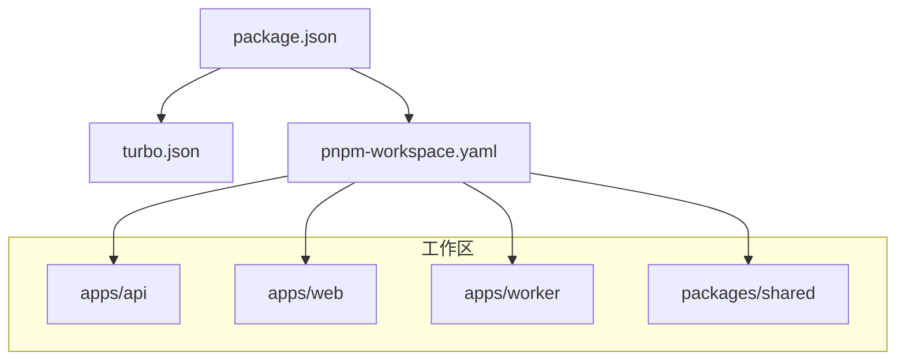
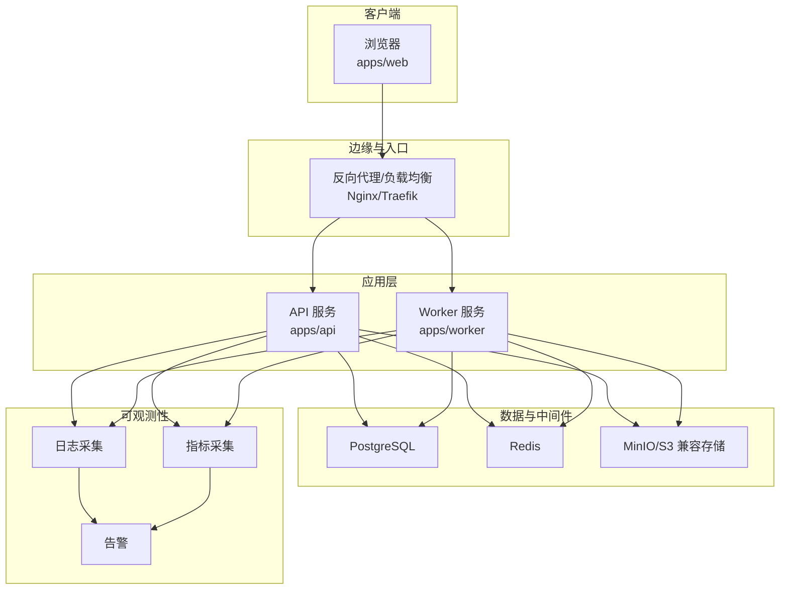
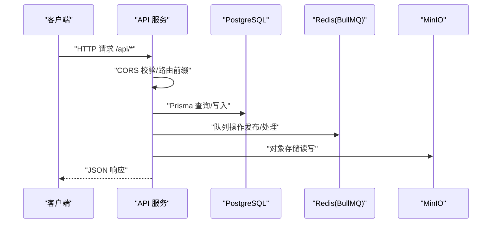
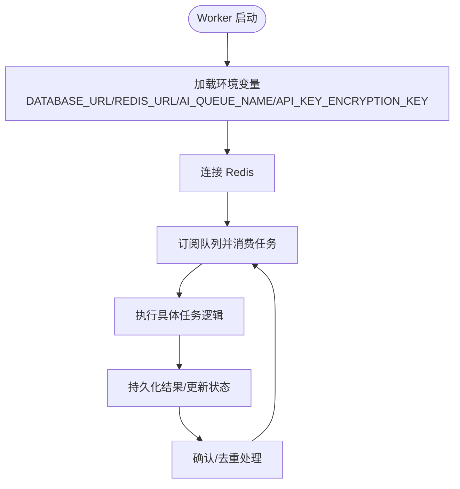
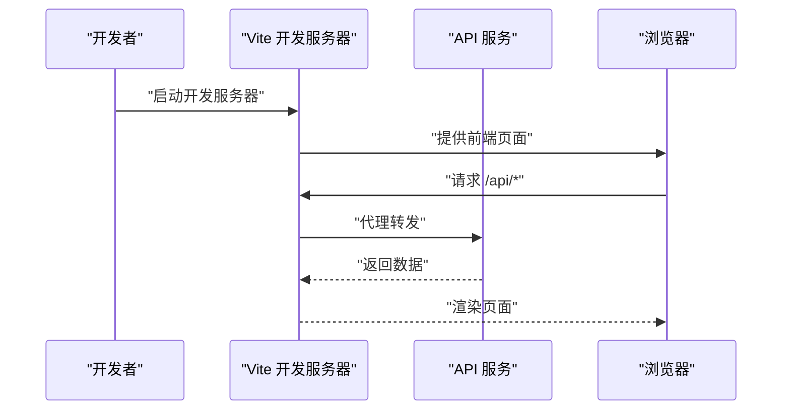
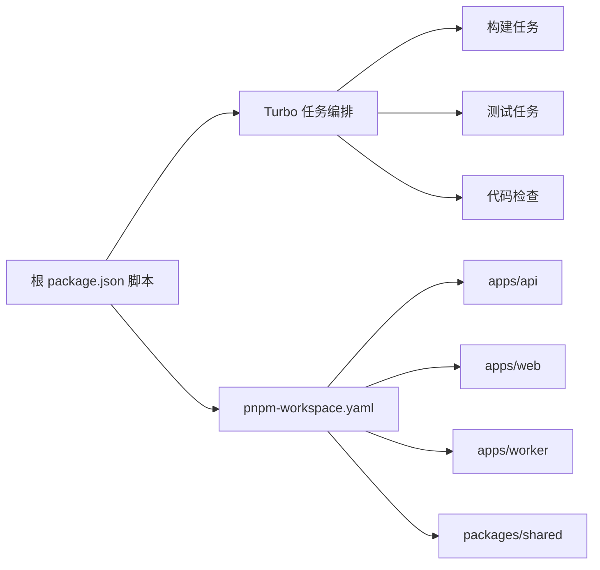

# 部署架构

<cite>
**本文引用的文件**
- [docker-compose.dev.yml](file://docker-compose.dev.yml)
- [apps/api/env.example](file://apps/api/env.example)
- [apps/api/ENVIRONMENT.md](file://apps/api/ENVIRONMENT.md)
- [apps/api/src/main.ts](file://apps/api/src/main.ts)
- [apps/api/src/config/env.ts](file://apps/api/src/config/env.ts)
- [apps/worker/env.example](file://apps/worker/env.example)
- [apps/worker/ENVIRONMENT.md](file://apps/worker/ENVIRONMENT.md)
- [apps/worker/src/config/env.ts](file://apps/worker/src/config/env.ts)
- [apps/web/env.example](file://apps/web/env.example)
- [apps/web/vite.config.ts](file://apps/web/vite.config.ts)
- [package.json](file://package.json)
- [pnpm-workspace.yaml](file://pnpm-workspace.yaml)
- [turbo.json](file://turbo.json)
</cite>

## 目录

1. [引言](#引言)
2. [项目结构](#项目结构)
3. [核心组件](#核心组件)
4. [架构总览](#架构总览)
5. [详细组件分析](#详细组件分析)
6. [依赖关系分析](#依赖关系分析)
7. [性能考虑](#性能考虑)
8. [故障排查指南](#故障排查指南)
9. [结论](#结论)
10. [附录](#附录)

## 引言

本文件面向AIXSSS项目的运维与平台工程团队，系统化梳理生产与开发环境的部署拓扑、容器化与编排、服务发现与负载均衡、数据库与缓存/消息队列集群策略、监控与日志、告警机制、扩展与自动伸缩、故障转移、网络安全、数据备份与灾备，以及CI/CD与自动化部署流程。文档以仓库现有配置为基础，结合NestJS、Worker、Vite等组件的实际行为进行说明，并给出可落地的建议与最佳实践。

## 项目结构

AIXSSS采用多包工作区（pnpm workspace）组织，核心模块包括：

- 应用层
  - apps/api：基于NestJS的后端API服务
  - apps/web：基于Vite+React的前端应用
  - apps/worker：基于BullMQ的任务处理Worker
- 共享包
  - packages/shared：跨应用共享的类型与Schema
- 工作流与脚手架
  - package.json、turbo.json、pnpm-workspace.yaml

图表来源

- [package.json](file://package.json#L1-L24)
- [turbo.json](file://turbo.json#L1-L30)
- [pnpm-workspace.yaml](file://pnpm-workspace.yaml#L1-L6)

章节来源

- [package.json](file://package.json#L1-L24)
- [pnpm-workspace.yaml](file://pnpm-workspace.yaml#L1-L6)
- [turbo.json](file://turbo.json#L1-L30)

## 核心组件

- API服务（apps/api）
  - 使用NestJS/Fastify，监听端口、设置全局前缀、启用CORS、注册全局异常过滤器
  - 环境变量通过Zod校验，支持DATABASE_URL、JWT_SECRET、REDIS_URL、AI_QUEUE_NAME、CORS_ORIGIN等
- Worker（apps/worker）
  - 使用BullMQ队列消费任务，支持并发控制与队列名称配置
  - 环境变量与API保持一致，确保加密密钥一致
- 前端（apps/web）
  - Vite开发服务器，本地代理到API；生产构建产物由反向代理或静态托管提供
- 数据与中间件
  - PostgreSQL（开发使用Docker Compose）
  - Redis（开发使用Docker Compose）
  - MinIO（开发使用Docker Compose）

章节来源

- [apps/api/src/main.ts](file://apps/api/src/main.ts#L1-L34)
- [apps/api/src/config/env.ts](file://apps/api/src/config/env.ts#L1-L17)
- [apps/worker/src/config/env.ts](file://apps/worker/src/config/env.ts#L1-L15)
- [apps/web/vite.config.ts](file://apps/web/vite.config.ts#L1-L94)
- [docker-compose.dev.yml](file://docker-compose.dev.yml#L1-L35)

## 架构总览

下图展示开发环境的容器化拓扑与服务交互。生产环境可在此基础上引入负载均衡、服务网格、外部数据库/缓存/对象存储、集中式日志与监控。

图表来源

- [docker-compose.dev.yml](file://docker-compose.dev.yml#L1-L35)
- [apps/api/src/main.ts](file://apps/api/src/main.ts#L1-L34)
- [apps/worker/src/config/env.ts](file://apps/worker/src/config/env.ts#L1-L15)
- [apps/web/vite.config.ts](file://apps/web/vite.config.ts#L1-L94)

## 详细组件分析

### API服务（apps/api）

- 启动与网络
  - 监听0.0.0.0，允许外网访问
  - 设置全局前缀“/api”
  - CORS由环境变量控制
- 配置与校验
  - 环境变量通过Zod Schema校验，强制最小长度与默认值
  - 关键参数：PORT、DATABASE_URL、JWT_SECRET、API_KEY_ENCRYPTION_KEY、REDIS_URL、AI_QUEUE_NAME、CORS_ORIGIN
- 异常处理
  - 注册全局异常过滤器，统一错误响应

图表来源

- [apps/api/src/main.ts](file://apps/api/src/main.ts#L1-L34)
- [apps/api/src/config/env.ts](file://apps/api/src/config/env.ts#L1-L17)
- [docker-compose.dev.yml](file://docker-compose.dev.yml#L1-L35)

章节来源

- [apps/api/src/main.ts](file://apps/api/src/main.ts#L1-L34)
- [apps/api/src/config/env.ts](file://apps/api/src/config/env.ts#L1-L17)
- [apps/api/env.example](file://apps/api/env.example#L1-L23)
- [apps/api/ENVIRONMENT.md](file://apps/api/ENVIRONMENT.md#L1-L31)

### Worker（apps/worker）

- 队列与并发
  - 使用BullMQ，队列名与API一致，便于共享
  - 支持并发度配置，按资源弹性调整
- 安全与一致性
  - 与API共享加密密钥，保证对称加密字段一致解密
- 运行与扩展
  - 单进程模型，可通过水平扩展实例提升吞吐

图表来源

- [apps/worker/src/config/env.ts](file://apps/worker/src/config/env.ts#L1-L15)
- [apps/worker/env.example](file://apps/worker/env.example#L1-L17)

章节来源

- [apps/worker/src/config/env.ts](file://apps/worker/src/config/env.ts#L1-L15)
- [apps/worker/env.example](file://apps/worker/env.example#L1-L17)
- [apps/worker/ENVIRONMENT.md](file://apps/worker/ENVIRONMENT.md#L1-L25)

### 前端（apps/web）

- 开发代理
  - 本地开发通过Vite代理到API，默认目标端口与API一致
- 构建与运行
  - 生产构建产物交由反向代理或静态托管提供
- 数据模式
  - 通过环境变量切换“本地测试”与“线上API”两种模式

图表来源

- [apps/web/vite.config.ts](file://apps/web/vite.config.ts#L1-L94)
- [apps/web/env.example](file://apps/web/env.example#L1-L14)

章节来源

- [apps/web/vite.config.ts](file://apps/web/vite.config.ts#L1-L94)
- [apps/web/env.example](file://apps/web/env.example#L1-L14)

### 数据库与中间件（开发）

- PostgreSQL
  - 开发使用Docker Compose，映射端口与命名卷
- Redis
  - 开发使用Docker Compose，提供队列与缓存能力
- MinIO
  - 开发使用Docker Compose，提供S3兼容的对象存储

章节来源

- [docker-compose.dev.yml](file://docker-compose.dev.yml#L1-L35)

## 依赖关系分析

- 工作区与任务编排
  - pnpm workspace声明各包位置
  - Turbo定义任务依赖与缓存策略，支持并行与增量构建
- 包与脚本
  - 根package.json提供统一脚本入口，如dev、build、test等

图表来源

- [package.json](file://package.json#L1-L24)
- [turbo.json](file://turbo.json#L1-L30)
- [pnpm-workspace.yaml](file://pnpm-workspace.yaml#L1-L6)

章节来源

- [package.json](file://package.json#L1-L24)
- [turbo.json](file://turbo.json#L1-L30)
- [pnpm-workspace.yaml](file://pnpm-workspace.yaml#L1-L6)

## 性能考虑

- API服务
  - 使用Fastify适配器，具备较低开销与高吞吐特性
  - 全局前缀与CORS配置需与前端代理保持一致，避免额外往返
- Worker
  - 合理设置并发度，避免CPU/内存争用
  - 队列分片与重试策略需结合业务幂等性设计
- 前端
  - Vite已内置代码分割与依赖预构建，生产构建开启esbuild压缩与CSS拆分
- 数据层
  - 开发阶段使用本地卷持久化，生产建议使用云原生存储与只读副本

## 故障排查指南

- 端口冲突
  - API默认端口可在环境变量中调整；确认宿主机端口未被占用
- CORS问题
  - 确认CORS_ORIGIN与前端开发地址一致；生产环境需精确白名单
- 数据库连接
  - 校验DATABASE_URL格式与可达性；开发环境使用127.0.0.1而非localhost以规避IPv6解析问题
- 队列与加密
  - 确保Worker与API的API_KEY_ENCRYPTION_KEY一致；队列名保持一致
- 日志与可观测性
  - API与Worker均输出标准日志；建议接入集中式日志系统并设置关键告警

章节来源

- [apps/api/src/main.ts](file://apps/api/src/main.ts#L1-L34)
- [apps/api/src/config/env.ts](file://apps/api/src/config/env.ts#L1-L17)
- [apps/worker/src/config/env.ts](file://apps/worker/src/config/env.ts#L1-L15)
- [apps/api/ENVIRONMENT.md](file://apps/api/ENVIRONMENT.md#L28-L31)

## 结论

本部署架构以Docker Compose实现开发环境快速搭建，结合Turbo与pnpm workspace实现多包高效构建与测试。生产环境应在现有基础上引入负载均衡、服务网格、外部数据库/缓存/对象存储、集中式日志与监控告警体系，并完善安全基线、备份与灾备策略，最终形成可审计、可扩展、可自动化的CI/CD流水线。

## 附录

### 环境变量与配置文件组织

- API
  - 示例与说明见示例文件与环境说明文档
  - 关键项：NODE_ENV、PORT、DATABASE_URL、JWT_SECRET、API_KEY_ENCRYPTION_KEY、REDIS_URL、AI_QUEUE_NAME、CORS_ORIGIN
- Worker
  - 示例与说明见示例文件与环境说明文档
  - 关键项：NODE_ENV、DATABASE_URL、API_KEY_ENCRYPTION_KEY、REDIS_URL、AI_QUEUE_NAME、WORKER_CONCURRENCY
- Web
  - 示例与说明见示例文件
  - 关键项：VITE_DATA_MODE、VITE_API_BASE_PATH

章节来源

- [apps/api/env.example](file://apps/api/env.example#L1-L23)
- [apps/api/ENVIRONMENT.md](file://apps/api/ENVIRONMENT.md#L1-L31)
- [apps/worker/env.example](file://apps/worker/env.example#L1-L17)
- [apps/worker/ENVIRONMENT.md](file://apps/worker/ENVIRONMENT.md#L1-L25)
- [apps/web/env.example](file://apps/web/env.example#L1-L14)

### CI/CD与自动化部署流程（建议）

- 触发条件
  - 分支保护与PR检查（lint/test/typecheck/format）
- 步骤建议
  - 代码检查与格式化
  - 单元测试与类型检查
  - 构建与打包（Turbo）
  - 容器镜像构建与推送
  - 声明式编排（Kubernetes/Helm/Docker Compose）部署
  - 健康检查与滚动更新
  - 回滚策略与灰度发布
- 可观测性
  - 日志采集（stdout/stderr）、指标导出（Prometheus）、告警（AlertManager/钉钉/邮件）
- 安全与合规
  - 镜像扫描、依赖漏洞扫描、密钥管理、网络隔离、最小权限原则
