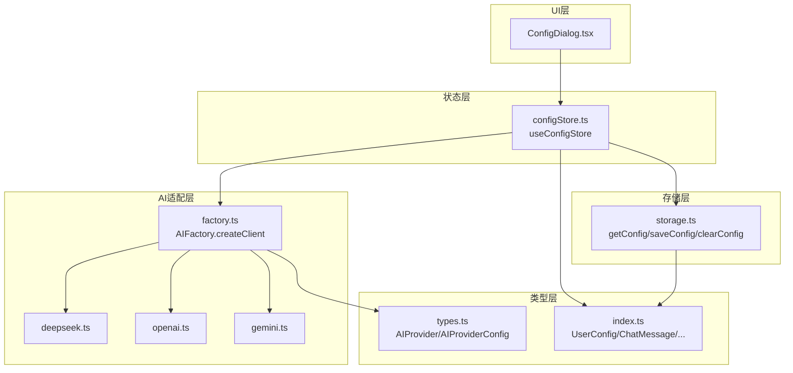
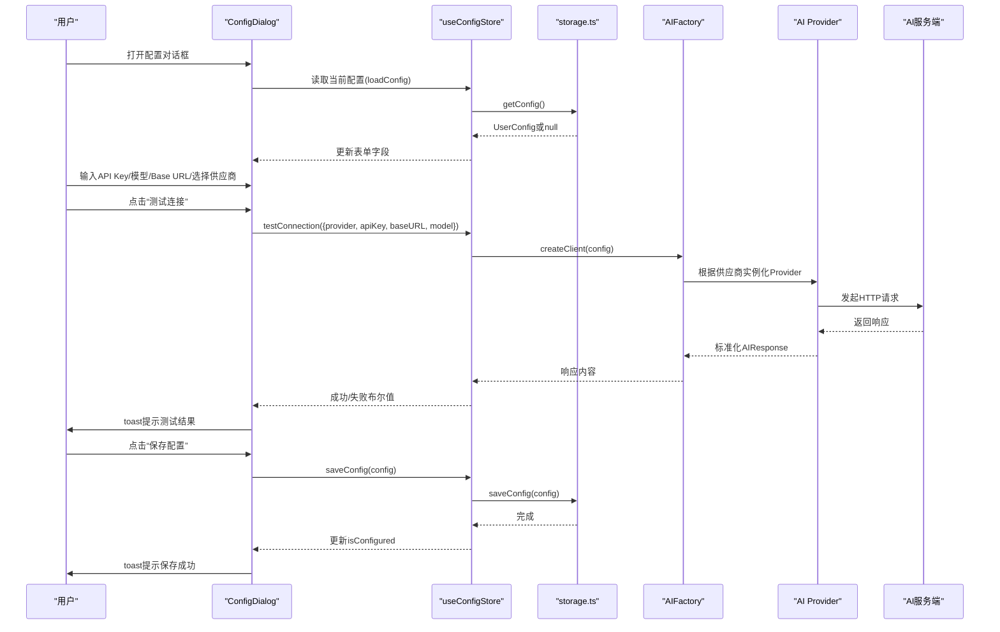
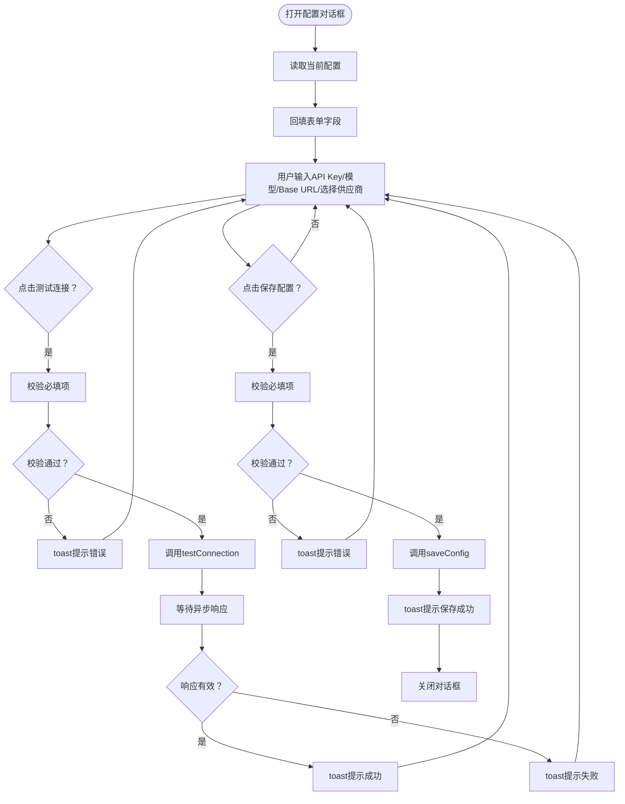
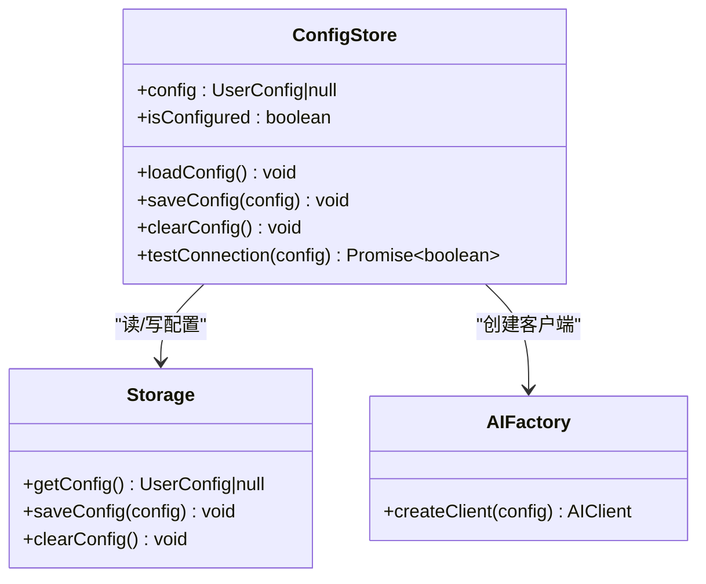
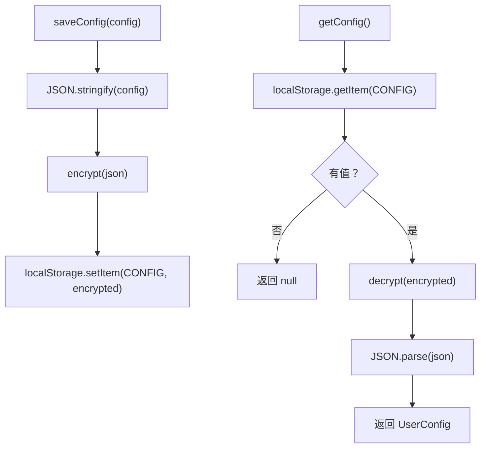
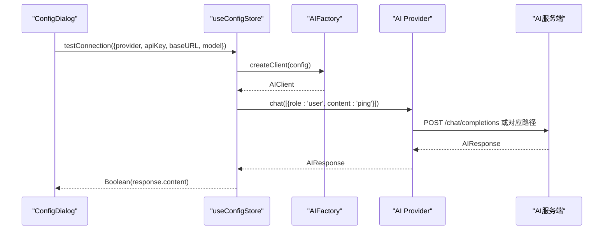
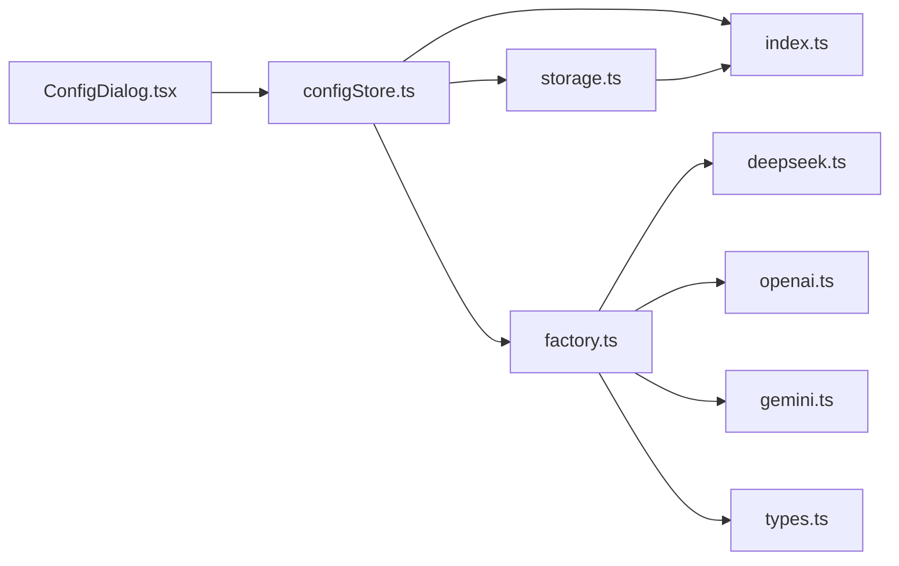

# API配置管理

<cite>
**本文引用的文件**
- [ConfigDialog.tsx](file://manga-creator/src/components/ConfigDialog.tsx)
- [configStore.ts](file://manga-creator/src/stores/configStore.ts)
- [storage.ts](file://manga-creator/src/lib/storage.ts)
- [factory.ts](file://manga-creator/src/lib/ai/factory.ts)
- [openai.ts](file://manga-creator/src/lib/ai/providers/openai.ts)
- [deepseek.ts](file://manga-creator/src/lib/ai/providers/deepseek.ts)
- [gemini.ts](file://manga-creator/src/lib/ai/providers/gemini.ts)
- [types.ts](file://manga-creator/src/lib/ai/types.ts)
- [index.ts](file://manga-creator/src/types/index.ts)
- [App.tsx](file://manga-creator/src/App.tsx)
- [main.tsx](file://manga-creator/src/main.tsx)
</cite>

## 目录
1. [简介](#简介)
2. [项目结构](#项目结构)
3. [核心组件](#核心组件)
4. [架构总览](#架构总览)
5. [组件详细分析](#组件详细分析)
6. [依赖关系分析](#依赖关系分析)
7. [性能考量](#性能考量)
8. [故障排查指南](#故障排查指南)
9. [结论](#结论)
10. [附录](#附录)

## 简介
本文件围绕“API配置管理”功能展开，系统性阐述ConfigDialog组件的UI结构与交互逻辑，解释其与useConfigStore的状态同步机制，以及testConnection与saveConfig的调用流程。同时，深入解析API Key的本地加密存储方案、连接测试的异步处理过程，并总结常见失败场景与安全最佳实践（如密钥隐藏、本地存储加密）。

## 项目结构
该功能涉及以下模块：
- UI层：ConfigDialog负责展示与用户交互
- 状态层：useConfigStore使用Zustand管理配置状态
- 存储层：storage.ts封装localStorage与AES加密
- AI适配层：factory.ts根据供应商类型创建对应Provider，各Provider实现具体的HTTP请求
- 类型层：types.ts与index.ts定义UserConfig等核心类型

图表来源
- [ConfigDialog.tsx](file://manga-creator/src/components/ConfigDialog.tsx#L1-L196)
- [configStore.ts](file://manga-creator/src/stores/configStore.ts#L1-L57)
- [storage.ts](file://manga-creator/src/lib/storage.ts#L1-L246)
- [factory.ts](file://manga-creator/src/lib/ai/factory.ts#L1-L54)
- [openai.ts](file://manga-creator/src/lib/ai/providers/openai.ts#L1-L88)
- [deepseek.ts](file://manga-creator/src/lib/ai/providers/deepseek.ts#L1-L110)
- [gemini.ts](file://manga-creator/src/lib/ai/providers/gemini.ts#L1-L138)
- [types.ts](file://manga-creator/src/lib/ai/types.ts#L1-L15)
- [index.ts](file://manga-creator/src/types/index.ts#L80-L108)

章节来源
- [App.tsx](file://manga-creator/src/App.tsx#L1-L81)
- [main.tsx](file://manga-creator/src/main.tsx#L1-L11)

## 核心组件
- ConfigDialog：提供供应商选择、API Key输入、Base URL配置、模型名称设置与“测试连接/保存配置”的交互界面；内部通过useConfigStore读取与写入配置，并通过toast反馈结果。
- useConfigStore：Zustand状态容器，负责加载、保存、清理配置，以及执行连接测试。
- storage.ts：封装localStorage访问与AES对称加密，提供getConfig/saveConfig/clearConfig等方法。
- AIFactory与Provider：根据供应商类型创建对应的AI客户端，发起HTTP请求并返回标准化响应。

章节来源
- [ConfigDialog.tsx](file://manga-creator/src/components/ConfigDialog.tsx#L1-L196)
- [configStore.ts](file://manga-creator/src/stores/configStore.ts#L1-L57)
- [storage.ts](file://manga-creator/src/lib/storage.ts#L1-L246)
- [factory.ts](file://manga-creator/src/lib/ai/factory.ts#L1-L54)

## 架构总览
从UI到存储的端到端流程如下：

图表来源
- [ConfigDialog.tsx](file://manga-creator/src/components/ConfigDialog.tsx#L1-L196)
- [configStore.ts](file://manga-creator/src/stores/configStore.ts#L1-L57)
- [storage.ts](file://manga-creator/src/lib/storage.ts#L151-L173)
- [factory.ts](file://manga-creator/src/lib/ai/factory.ts#L44-L53)
- [openai.ts](file://manga-creator/src/lib/ai/providers/openai.ts#L1-L88)
- [deepseek.ts](file://manga-creator/src/lib/ai/providers/deepseek.ts#L1-L110)
- [gemini.ts](file://manga-creator/src/lib/ai/providers/gemini.ts#L1-L138)

## 组件详细分析

### ConfigDialog组件分析
- UI结构与交互
  - 供应商选择：通过Select组件提供DeepSeek、Kimi、Gemini、OpenAI兼容四种选项。
  - API Key输入：支持密码/明文切换显示，避免直接暴露密钥。
  - Base URL配置：可选参数，用于兼容不同厂商的自建网关或代理。
  - 模型名称设置：根据供应商默认提示，确保调用时具备有效模型标识。
  - 行为控制：点击“测试连接”触发异步校验；点击“保存配置”持久化到本地并更新状态；取消按钮关闭对话框。
- 状态同步
  - 初始化：当useConfigStore中的config存在时，自动回填表单字段。
  - 保存：校验必填项后调用saveConfig，随后toast提示并关闭对话框。
  - 测试：校验必填项后调用testConnection，等待Promise完成，根据结果toast提示成功或失败。
- 错误与提示
  - 必填项缺失时，toast给出明确提示。
  - 连接测试期间禁用按钮并显示加载态。

图表来源
- [ConfigDialog.tsx](file://manga-creator/src/components/ConfigDialog.tsx#L1-L196)

章节来源
- [ConfigDialog.tsx](file://manga-creator/src/components/ConfigDialog.tsx#L1-L196)

### useConfigStore与状态同步
- 初始化与加载
  - loadConfig从storage.ts读取配置，设置config与isConfigured标志。
- 保存与清理
  - saveConfig先写入storage.ts，再更新store内的config与isConfigured。
  - clearConfig移除本地配置并重置store状态。
- 连接测试
  - testConnection通过AIFactory.createClient(config)创建客户端，发送一条简单的聊天消息以验证连通性；异常时捕获并返回false。

图表来源
- [configStore.ts](file://manga-creator/src/stores/configStore.ts#L1-L57)
- [storage.ts](file://manga-creator/src/lib/storage.ts#L151-L173)
- [factory.ts](file://manga-creator/src/lib/ai/factory.ts#L44-L53)

章节来源
- [configStore.ts](file://manga-creator/src/stores/configStore.ts#L1-L57)

### API Key的加密存储机制
- 加密算法与密钥
  - 使用AES对称加密，密钥固定为项目内定义的字符串，确保同一版本下的可逆性。
- 存储键名
  - 使用统一的KEYS.CONFIG键名存储加密后的JSON字符串。
- 读取与写入
  - getConfig：从localStorage读取加密串，解密后反序列化为UserConfig。
  - saveConfig：序列化UserConfig为JSON，加密后写入localStorage。
  - clearConfig：移除CONFIG键。
- 版本迁移
  - initStorage负责版本号检查与迁移钩子（当前MVP阶段未实现具体迁移逻辑）。

图表来源
- [storage.ts](file://manga-creator/src/lib/storage.ts#L1-L246)

章节来源
- [storage.ts](file://manga-creator/src/lib/storage.ts#L1-L246)

### 连接测试的异步处理
- 触发时机
  - 用户点击“测试连接”，前端校验必填项后调用store的testConnection。
- 执行流程
  - AIFactory.createClient(config)根据供应商类型创建Provider实例。
  - Provider向对应AI服务端发起HTTP请求，返回标准化AIResponse。
  - store根据响应内容是否存在判定测试是否成功。
- 异常处理
  - 任何网络或解析异常均被捕获并返回false，同时在控制台输出错误日志。

图表来源
- [configStore.ts](file://manga-creator/src/stores/configStore.ts#L45-L56)
- [factory.ts](file://manga-creator/src/lib/ai/factory.ts#L44-L53)
- [openai.ts](file://manga-creator/src/lib/ai/providers/openai.ts#L1-L88)
- [deepseek.ts](file://manga-creator/src/lib/ai/providers/deepseek.ts#L1-L110)
- [gemini.ts](file://manga-creator/src/lib/ai/providers/gemini.ts#L1-L138)

章节来源
- [configStore.ts](file://manga-creator/src/stores/configStore.ts#L45-L56)
- [factory.ts](file://manga-creator/src/lib/ai/factory.ts#L44-L53)

### 供应商适配与模型名称设置
- 供应商类型
  - 支持deepseek、kimi、gemini、openai-compatible四类。
- Provider差异
  - DeepSeekProvider：默认模型为deepseek-chat，Base URL默认为api.deepseek.com。
  - OpenAICompatibleProvider：默认Base URL为api.openai.com，使用Authorization: Bearer。
  - GeminiProvider：使用x-goog-api-key头，Base URL默认为generativelanguage.googleapis.com，模型默认gemini-pro。
- 模型名称
  - UI层提供占位符建议；若未显式填写，Provider侧会采用各自默认值。

章节来源
- [index.ts](file://manga-creator/src/types/index.ts#L82-L91)
- [openai.ts](file://manga-creator/src/lib/ai/providers/openai.ts#L1-L88)
- [deepseek.ts](file://manga-creator/src/lib/ai/providers/deepseek.ts#L1-L110)
- [gemini.ts](file://manga-creator/src/lib/ai/providers/gemini.ts#L1-L138)

## 依赖关系分析
- 组件耦合
  - ConfigDialog仅依赖useConfigStore与UI组件，低耦合高内聚。
  - useConfigStore依赖storage.ts与AIFactory，承担业务协调职责。
  - AIFactory依赖各Provider实现，遵循工厂模式与多态。
- 外部依赖
  - crypto-js用于AES加解密。
  - fetch用于HTTP请求。
- 循环依赖
  - 未发现循环依赖迹象。

图表来源
- [ConfigDialog.tsx](file://manga-creator/src/components/ConfigDialog.tsx#L1-L196)
- [configStore.ts](file://manga-creator/src/stores/configStore.ts#L1-L57)
- [storage.ts](file://manga-creator/src/lib/storage.ts#L1-L246)
- [factory.ts](file://manga-creator/src/lib/ai/factory.ts#L1-L54)
- [openai.ts](file://manga-creator/src/lib/ai/providers/openai.ts#L1-L88)
- [deepseek.ts](file://manga-creator/src/lib/ai/providers/deepseek.ts#L1-L110)
- [gemini.ts](file://manga-creator/src/lib/ai/providers/gemini.ts#L1-L138)
- [types.ts](file://manga-creator/src/lib/ai/types.ts#L1-L15)
- [index.ts](file://manga-creator/src/types/index.ts#L80-L108)

## 性能考量
- 存储性能
  - localStorage为同步接口，读写开销小；AES加解密在小型配置对象上几乎无感知。
- 网络性能
  - 连接测试仅发送一条简短消息，避免长耗时请求。
- UI体验
  - 测试过程中禁用按钮并显示加载态，防止重复提交。
- 建议
  - 若未来配置体量增大，可考虑分片存储或延迟初始化。

[本节为通用指导，无需列出具体文件来源]

## 故障排查指南
- 常见失败场景
  - 无效API Key：Provider抛出HTTP错误或鉴权失败，testConnection返回false。
  - 模型名称错误：服务端返回404或400，需确认模型名与供应商匹配。
  - Base URL不可达：网络超时或跨域问题，检查代理/域名配置。
  - 供应商类型不匹配：例如在OpenAI兼容模式下使用Gemini特有的头部。
- 解决方案
  - 逐项核对：Key、模型、Base URL、供应商类型。
  - 使用“测试连接”快速定位问题。
  - 查看浏览器开发者工具Network面板与Console日志。
- 安全最佳实践
  - 密钥隐藏：默认以密码形式输入，支持切换显示；避免在日志中打印敏感信息。
  - 本地存储加密：使用AES对配置进行加密存储，降低明文泄露风险。
  - 最小权限：仅在本地使用，不上传至远程服务器。
  - 定期轮换：定期更换API Key并清理旧配置。

章节来源
- [ConfigDialog.tsx](file://manga-creator/src/components/ConfigDialog.tsx#L1-L196)
- [configStore.ts](file://manga-creator/src/stores/configStore.ts#L45-L56)
- [storage.ts](file://manga-creator/src/lib/storage.ts#L1-L246)

## 结论
本功能通过清晰的UI、稳定的Zustand状态管理、可靠的本地加密存储与灵活的AI适配层，实现了从配置录入到连接测试再到持久化的完整闭环。UI层注重用户体验（如密钥隐藏、加载态），状态层专注业务编排，存储层保障数据安全，适配层覆盖多家供应商。整体设计简洁、扩展性强，便于后续新增供应商或增强功能。

[本节为总结性内容，无需列出具体文件来源]

## 附录
- 入口与集成
  - 应用启动时初始化存储、加载项目与配置；顶部设置按钮打开ConfigDialog。
- 类型定义
  - UserConfig、ChatMessage、AIResponse等类型定义于types与index文件中，确保跨模块一致的数据契约。

章节来源
- [App.tsx](file://manga-creator/src/App.tsx#L1-L81)
- [main.tsx](file://manga-creator/src/main.tsx#L1-L11)
- [index.ts](file://manga-creator/src/types/index.ts#L80-L108)