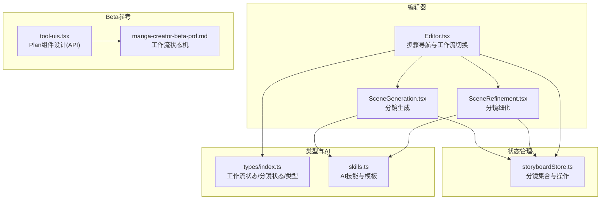
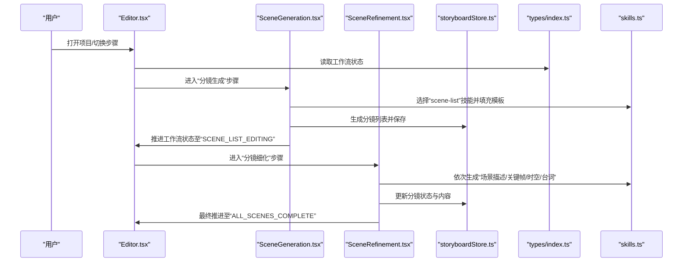
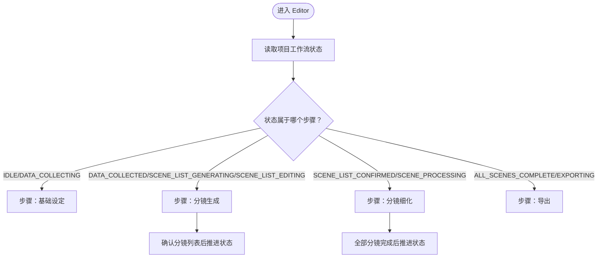
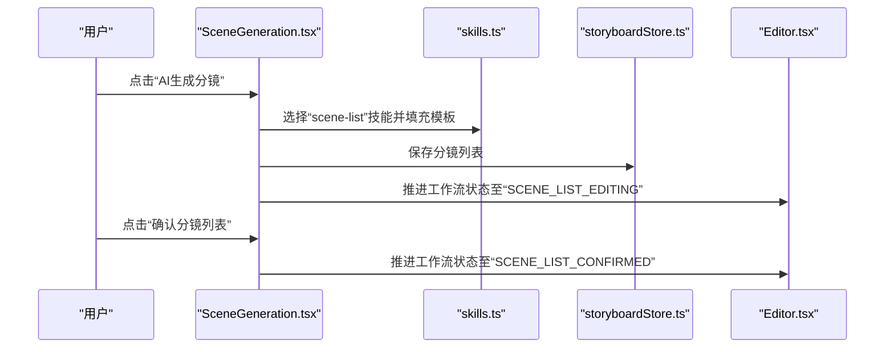
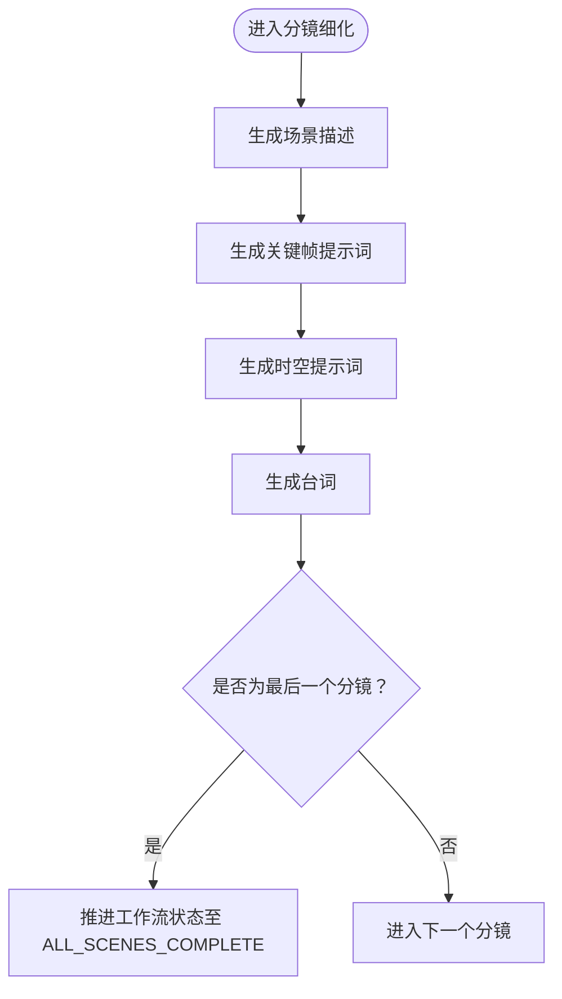
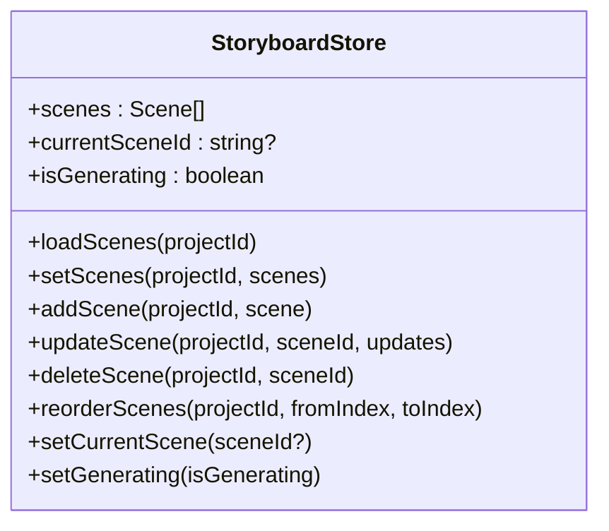
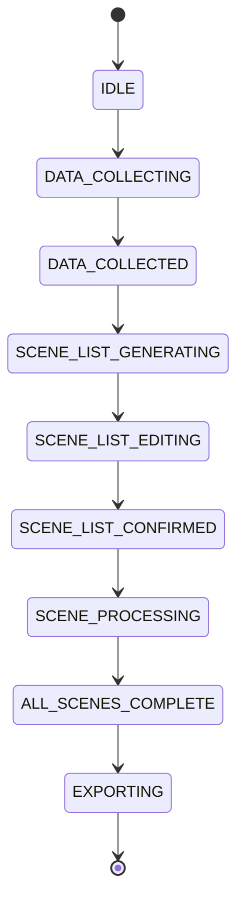
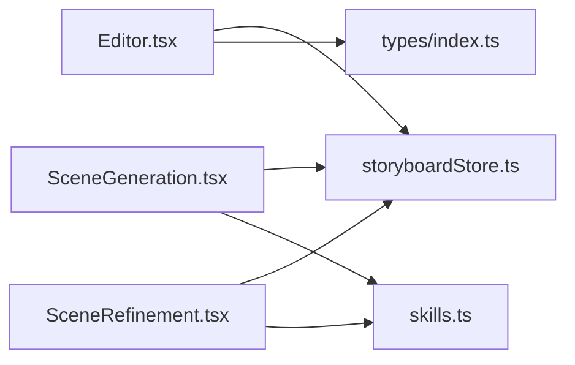

# Plan 组件

<cite>
**本文引用的文件**
- [manga-creator/src/components/editor/SceneGeneration.tsx](file://manga-creator/src/components/editor/SceneGeneration.tsx)
- [manga-creator/src/components/editor/SceneRefinement.tsx](file://manga-creator/src/components/editor/SceneRefinement.tsx)
- [manga-creator/src/components/Editor.tsx](file://manga-creator/src/components/Editor.tsx)
- [manga-creator/src/stores/storyboardStore.ts](file://manga-creator/src/stores/storyboardStore.ts)
- [manga-creator/src/types/index.ts](file://manga-creator/src/types/index.ts)
- [manga-creator/src/lib/ai/skills.ts](file://manga-creator/src/lib/ai/skills.ts)
- [manga-creator-beta/src/components/assistant-ui/tool-uis.tsx](file://manga-creator-beta/src/components/assistant-ui/tool-uis.tsx)
- [manga-creator-beta-prd.md](file://manga-creator-beta-prd.md)
</cite>

## 目录
1. [简介](#简介)
2. [项目结构](#项目结构)
3. [核心组件](#核心组件)
4. [架构总览](#架构总览)
5. [详细组件分析](#详细组件分析)
6. [依赖分析](#依赖分析)
7. [性能考虑](#性能考虑)
8. [故障排查指南](#故障排查指南)
9. [结论](#结论)
10. [附录](#附录)

## 简介
本文件聚焦“Plan 组件”的实现与使用，结合仓库现有代码，系统梳理了分镜创作工作流中的计划与执行过程。在当前仓库中，“Plan 组件”并非一个独立的 UI 组件，而是以“工作流计划”的形式贯穿多个编辑器步骤：基础设定、分镜生成、分镜细化、导出。其核心职责是将创作流程拆分为可追踪、可推进的步骤，并在每个步骤内提供可执行的操作入口与状态反馈。

## 项目结构
围绕“Plan 组件”的相关代码主要分布在编辑器模块与状态管理模块中：
- 编辑器入口与步骤导航：Editor.tsx
- 分镜生成：SceneGeneration.tsx
- 分镜细化：SceneRefinement.tsx
- 状态管理：storyboardStore.ts
- 类型与状态机：types/index.ts
- AI 技能与提示词模板：skills.ts
- Beta 版本的 Plan 组件设计参考：tool-uis.tsx 与 PRD

图表来源
- [manga-creator/src/components/Editor.tsx](file://manga-creator/src/components/Editor.tsx#L30-L120)
- [manga-creator/src/components/editor/SceneGeneration.tsx](file://manga-creator/src/components/editor/SceneGeneration.tsx#L38-L120)
- [manga-creator/src/components/editor/SceneRefinement.tsx](file://manga-creator/src/components/editor/SceneRefinement.tsx#L53-L120)
- [manga-creator/src/stores/storyboardStore.ts](file://manga-creator/src/stores/storyboardStore.ts#L21-L108)
- [manga-creator/src/types/index.ts](file://manga-creator/src/types/index.ts#L230-L292)
- [manga-creator/src/lib/ai/skills.ts](file://manga-creator/src/lib/ai/skills.ts#L1-L120)
- [manga-creator-beta/src/components/assistant-ui/tool-uis.tsx](file://manga-creator-beta/src/components/assistant-ui/tool-uis.tsx#L471-L530)
- [manga-creator-beta-prd.md](file://manga-creator-beta-prd.md#L1049-L1137)

章节来源
- [manga-creator/src/components/Editor.tsx](file://manga-creator/src/components/Editor.tsx#L30-L120)
- [manga-creator/src/components/editor/SceneGeneration.tsx](file://manga-creator/src/components/editor/SceneGeneration.tsx#L38-L120)
- [manga-creator/src/components/editor/SceneRefinement.tsx](file://manga-creator/src/components/editor/SceneRefinement.tsx#L53-L120)
- [manga-creator/src/stores/storyboardStore.ts](file://manga-creator/src/stores/storyboardStore.ts#L21-L108)
- [manga-creator/src/types/index.ts](file://manga-creator/src/types/index.ts#L230-L292)
- [manga-creator/src/lib/ai/skills.ts](file://manga-creator/src/lib/ai/skills.ts#L1-L120)
- [manga-creator-beta/src/components/assistant-ui/tool-uis.tsx](file://manga-creator-beta/src/components/assistant-ui/tool-uis.tsx#L471-L530)
- [manga-creator-beta-prd.md](file://manga-creator-beta-prd.md#L1049-L1137)

## 核心组件
- Editor.tsx：负责根据项目工作流状态自动切换步骤，渲染“创作流程”步骤导航，并承载“版本历史/统计分析/批量操作/导出数据”等对话框入口。
- SceneGeneration.tsx：负责分镜列表的生成、编辑、确认与状态推进；提供“AI生成分镜”“手动添加分镜”“重新生成”“确认分镜列表”等能力。
- SceneRefinement.tsx：负责单个分镜的细化流程，按阶段逐步生成场景描述、关键帧提示词、时空提示词与台词，并支持一键生成全部。
- storyboardStore.ts：提供分镜集合的加载、新增、更新、删除、重排、当前分镜切换与生成状态标记等操作。
- types/index.ts：定义工作流状态（WorkflowState）、分镜状态（SceneStatus）、分镜步骤（SceneStep）等类型，支撑“Plan 组件”的状态流转。
- skills.ts：定义 AI 技能（scene-list、scene-description、keyframe-prompt、motion-prompt、dialogue）及模板，为“Plan 组件”的各阶段生成提供提示词模板与上下文填充。

章节来源
- [manga-creator/src/components/Editor.tsx](file://manga-creator/src/components/Editor.tsx#L30-L120)
- [manga-creator/src/components/editor/SceneGeneration.tsx](file://manga-creator/src/components/editor/SceneGeneration.tsx#L82-L224)
- [manga-creator/src/components/editor/SceneRefinement.tsx](file://manga-creator/src/components/editor/SceneRefinement.tsx#L120-L218)
- [manga-creator/src/stores/storyboardStore.ts](file://manga-creator/src/stores/storyboardStore.ts#L21-L108)
- [manga-creator/src/types/index.ts](file://manga-creator/src/types/index.ts#L230-L292)
- [manga-creator/src/lib/ai/skills.ts](file://manga-creator/src/lib/ai/skills.ts#L1-L120)

## 架构总览
“Plan 组件”的架构以“工作流状态机”为核心，Editor.tsx 作为流程控制器，SceneGeneration.tsx 与 SceneRefinement.tsx 作为具体执行单元，storyboardStore.ts 作为数据源，skills.ts 与 types/index.ts 提供类型与提示词模板支撑。

图表来源
- [manga-creator/src/components/Editor.tsx](file://manga-creator/src/components/Editor.tsx#L30-L120)
- [manga-creator/src/components/editor/SceneGeneration.tsx](file://manga-creator/src/components/editor/SceneGeneration.tsx#L82-L224)
- [manga-creator/src/components/editor/SceneRefinement.tsx](file://manga-creator/src/components/editor/SceneRefinement.tsx#L120-L218)
- [manga-creator/src/stores/storyboardStore.ts](file://manga-creator/src/stores/storyboardStore.ts#L21-L108)
- [manga-creator/src/types/index.ts](file://manga-creator/src/types/index.ts#L230-L292)
- [manga-creator/src/lib/ai/skills.ts](file://manga-creator/src/lib/ai/skills.ts#L1-L120)

## 详细组件分析

### Editor.tsx：步骤导航与工作流切换
- 根据项目工作流状态自动切换当前步骤（基础设定/分镜生成/分镜细化/导出）。
- 提供“创作流程”步骤导航，支持点击当前或已完成步骤。
- 承载“版本历史/统计分析/批量操作/导出数据”对话框入口。

图表来源
- [manga-creator/src/components/Editor.tsx](file://manga-creator/src/components/Editor.tsx#L30-L120)

章节来源
- [manga-creator/src/components/Editor.tsx](file://manga-creator/src/components/Editor.tsx#L30-L120)

### SceneGeneration.tsx：分镜生成与确认
- 生成分镜列表：基于项目信息与画风配置，调用 AI 技能生成 8-12 个关键分镜，解析并保存为场景集合。
- 编辑与确认：支持手动添加、编辑、删除分镜；达到一定数量后可确认进入细化流程。
- 状态推进：生成完成后推进工作流状态至“SCENE_LIST_EDITING”，确认后进入“SCENE_LIST_CONFIRMED”。

图表来源
- [manga-creator/src/components/editor/SceneGeneration.tsx](file://manga-creator/src/components/editor/SceneGeneration.tsx#L82-L224)
- [manga-creator/src/lib/ai/skills.ts](file://manga-creator/src/lib/ai/skills.ts#L1-L40)
- [manga-creator/src/stores/storyboardStore.ts](file://manga-creator/src/stores/storyboardStore.ts#L21-L69)
- [manga-creator/src/components/Editor.tsx](file://manga-creator/src/components/Editor.tsx#L30-L120)

章节来源
- [manga-creator/src/components/editor/SceneGeneration.tsx](file://manga-creator/src/components/editor/SceneGeneration.tsx#L82-L224)
- [manga-creator/src/lib/ai/skills.ts](file://manga-creator/src/lib/ai/skills.ts#L1-L40)
- [manga-creator/src/stores/storyboardStore.ts](file://manga-creator/src/stores/storyboardStore.ts#L21-L69)
- [manga-creator/src/components/Editor.tsx](file://manga-creator/src/components/Editor.tsx#L30-L120)

### SceneRefinement.tsx：分镜细化与一键生成
- 分阶段细化：按“场景描述→关键帧提示词→时空提示词→台词”的顺序逐步生成。
- 一键生成：在当前分镜上执行“一键生成全部”，按阶段顺序补齐缺失内容。
- 状态推进：最后一个分镜完成后推进工作流状态至“ALL_SCENES_COMPLETE”。

图表来源
- [manga-creator/src/components/editor/SceneRefinement.tsx](file://manga-creator/src/components/editor/SceneRefinement.tsx#L120-L218)
- [manga-creator/src/lib/ai/skills.ts](file://manga-creator/src/lib/ai/skills.ts#L41-L165)
- [manga-creator/src/stores/storyboardStore.ts](file://manga-creator/src/stores/storyboardStore.ts#L21-L69)
- [manga-creator/src/components/Editor.tsx](file://manga-creator/src/components/Editor.tsx#L30-L120)

章节来源
- [manga-creator/src/components/editor/SceneRefinement.tsx](file://manga-creator/src/components/editor/SceneRefinement.tsx#L120-L218)
- [manga-creator/src/lib/ai/skills.ts](file://manga-creator/src/lib/ai/skills.ts#L41-L165)
- [manga-creator/src/stores/storyboardStore.ts](file://manga-creator/src/stores/storyboardStore.ts#L21-L69)
- [manga-creator/src/components/Editor.tsx](file://manga-creator/src/components/Editor.tsx#L30-L120)

### storyboardStore.ts：分镜集合与操作
- 提供分镜集合的加载、新增、更新、删除、重排、当前分镜切换与生成状态标记等操作。
- 在新增/更新/删除后自动保存到本地存储，并更新内存状态。

图表来源
- [manga-creator/src/stores/storyboardStore.ts](file://manga-creator/src/stores/storyboardStore.ts#L1-L108)

章节来源
- [manga-creator/src/stores/storyboardStore.ts](file://manga-creator/src/stores/storyboardStore.ts#L1-L108)

### 类型与状态机：types/index.ts
- 工作流状态（WorkflowState）：IDLE → DATA_COLLECTING → DATA_COLLECTED → SCENE_LIST_GENERATING → SCENE_LIST_EDITING → SCENE_LIST_CONFIRMED → SCENE_PROCESSING → ALL_SCENES_COMPLETE → EXPORTING。
- 分镜状态（SceneStatus）：pending → scene_generating → scene_confirmed → keyframe_generating → keyframe_confirmed → motion_generating → completed → needs_update。
- 分镜步骤（SceneStep）：scene_description → keyframe_prompt → motion_prompt → dialogue。

图表来源
- [manga-creator/src/types/index.ts](file://manga-creator/src/types/index.ts#L230-L292)
- [manga-creator-beta-prd.md](file://manga-creator-beta-prd.md#L1049-L1137)

章节来源
- [manga-creator/src/types/index.ts](file://manga-creator/src/types/index.ts#L230-L292)
- [manga-creator-beta-prd.md](file://manga-creator-beta-prd.md#L1049-L1137)

### AI 技能与提示词模板：skills.ts
- scene-list：生成分镜列表。
- scene-description：生成场景描述。
- keyframe-prompt：生成静态关键帧提示词。
- motion-prompt：生成时空提示词。
- dialogue：生成台词。

章节来源
- [manga-creator/src/lib/ai/skills.ts](file://manga-creator/src/lib/ai/skills.ts#L1-L165)

### Beta 版本 Plan 组件设计参考：tool-uis.tsx 与 PRD
- Beta 版本提供了“Plan 组件”的 API 设计，用于展示分步任务工作流（todos），包含状态图标、展开/收起、进度条等交互。
- PRD 中给出了完整的工作流状态机与转换规则，可作为“Plan 组件”的概念参考。

章节来源
- [manga-creator-beta/src/components/assistant-ui/tool-uis.tsx](file://manga-creator-beta/src/components/assistant-ui/tool-uis.tsx#L471-L530)
- [manga-creator-beta-prd.md](file://manga-creator-beta-prd.md#L1049-L1137)

## 依赖分析
- 组件耦合
  - Editor.tsx 依赖 types/index.ts 的工作流状态与步骤导航，依赖 storyboardStore.ts 的分镜集合与状态推进。
  - SceneGeneration.tsx 与 SceneRefinement.tsx 依赖 skills.ts 的技能与模板，依赖 storyboardStore.ts 的分镜 CRUD。
- 外部依赖
  - AI 供应商适配（通过工厂创建客户端）与上下文构建、日志记录等工具由 lib/ai 下的模块提供。
- 循环依赖
  - 当前模块间为单向依赖（UI -> Store -> Types/Skills），未见循环依赖迹象。

图表来源
- [manga-creator/src/components/Editor.tsx](file://manga-creator/src/components/Editor.tsx#L30-L120)
- [manga-creator/src/components/editor/SceneGeneration.tsx](file://manga-creator/src/components/editor/SceneGeneration.tsx#L82-L224)
- [manga-creator/src/components/editor/SceneRefinement.tsx](file://manga-creator/src/components/editor/SceneRefinement.tsx#L120-L218)
- [manga-creator/src/stores/storyboardStore.ts](file://manga-creator/src/stores/storyboardStore.ts#L21-L108)
- [manga-creator/src/lib/ai/skills.ts](file://manga-creator/src/lib/ai/skills.ts#L1-L165)

章节来源
- [manga-creator/src/components/Editor.tsx](file://manga-creator/src/components/Editor.tsx#L30-L120)
- [manga-creator/src/components/editor/SceneGeneration.tsx](file://manga-creator/src/components/editor/SceneGeneration.tsx#L82-L224)
- [manga-creator/src/components/editor/SceneRefinement.tsx](file://manga-creator/src/components/editor/SceneRefinement.tsx#L120-L218)
- [manga-creator/src/stores/storyboardStore.ts](file://manga-creator/src/stores/storyboardStore.ts#L21-L108)
- [manga-creator/src/lib/ai/skills.ts](file://manga-creator/src/lib/ai/skills.ts#L1-L165)

## 性能考虑
- 防抖与并发控制
  - 分镜生成与细化过程中，应避免重复触发与并发冲突，可通过全局批量生成状态与步骤禁用按钮降低资源浪费。
- 上下文压缩
  - 在细化阶段，若上下文接近 Token 限制，应启用上下文压缩策略，减少不必要的信息以提升稳定性。
- 状态持久化
  - 分镜列表与细化进度应持久化保存，避免刷新丢失；批量操作完成后统一更新 UI 与状态。

[本节为通用指导，无需特定文件引用]

## 故障排查指南
- 生成失败
  - 检查 AI 配置是否正确，确认已配置 API 供应商与模型。
  - 查看日志记录与错误提示，定位具体技能与阶段。
- 状态异常
  - 若工作流状态未按预期推进，检查 Editor.tsx 的状态判断逻辑与事件派发。
- 分镜缺失
  - 确认 storyboardStore.ts 的分镜集合是否正确加载与保存；必要时重置并重新生成。

章节来源
- [manga-creator/src/components/editor/SceneGeneration.tsx](file://manga-creator/src/components/editor/SceneGeneration.tsx#L211-L224)
- [manga-creator/src/components/editor/SceneRefinement.tsx](file://manga-creator/src/components/editor/SceneRefinement.tsx#L210-L218)
- [manga-creator/src/components/Editor.tsx](file://manga-creator/src/components/Editor.tsx#L30-L120)
- [manga-creator/src/stores/storyboardStore.ts](file://manga-creator/src/stores/storyboardStore.ts#L21-L108)

## 结论
“Plan 组件”在当前仓库中以“工作流计划”的形态体现在 Editor.tsx 的步骤导航与 SceneGeneration.tsx/SceneRefinement.tsx 的阶段推进中。通过明确的工作流状态机、清晰的分镜状态与技能模板，系统实现了从“分镜生成”到“分镜细化”再到“导出”的完整创作流程。Beta 版本的 Plan 组件设计可作为未来 UI 层“计划面板”的参考，进一步增强可追踪性与可视化。

[本节为总结性内容，无需特定文件引用]

## 附录
- 工作流状态机（项目级）
  - IDLE → DATA_COLLECTING → DATA_COLLECTED → SCENE_LIST_GENERATING → SCENE_LIST_EDITING → SCENE_LIST_CONFIRMED → SCENE_PROCESSING → ALL_SCENES_COMPLETE → EXPORTING
- 分镜状态机（单分镜）
  - pending → scene_generating → scene_confirmed → keyframe_generating → keyframe_confirmed → motion_generating → completed

章节来源
- [manga-creator/src/types/index.ts](file://manga-creator/src/types/index.ts#L230-L292)
- [manga-creator-beta-prd.md](file://manga-creator-beta-prd.md#L1049-L1137)