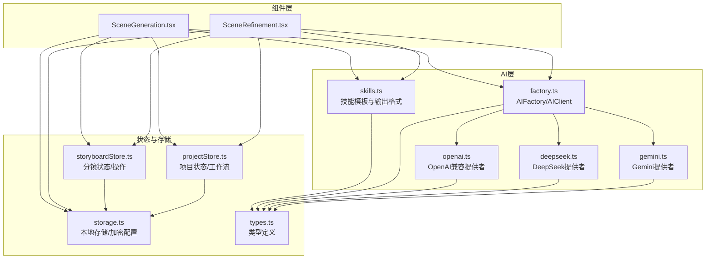
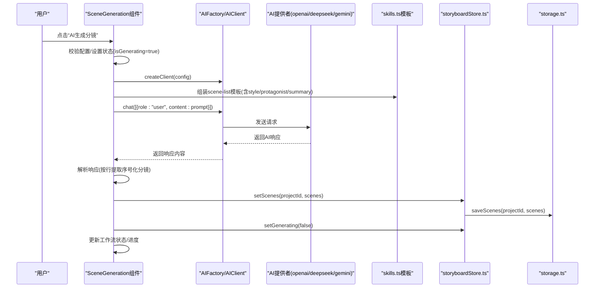
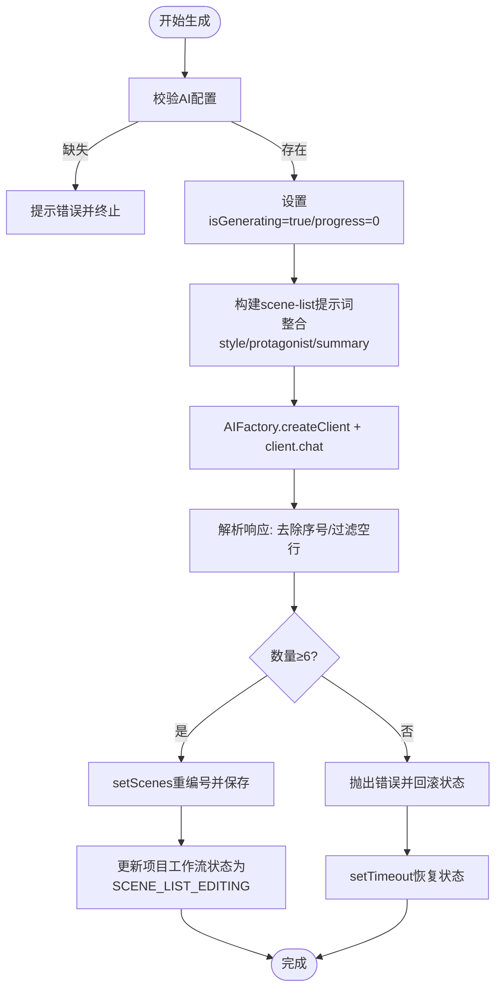
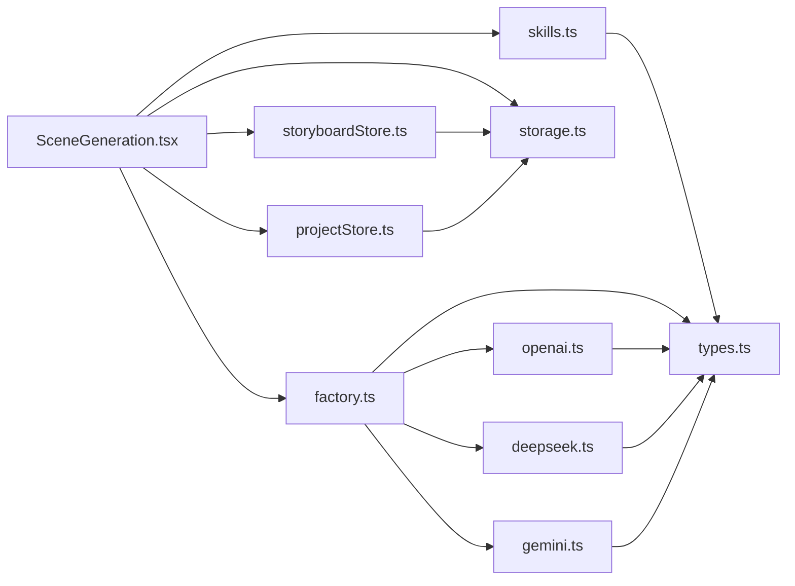

# 分镜生成

<cite>
**本文引用的文件**
- [SceneGeneration.tsx](file://manga-creator/src/components/editor/SceneGeneration.tsx)
- [skills.ts](file://manga-creator/src/lib/ai/skills.ts)
- [factory.ts](file://manga-creator/src/lib/ai/factory.ts)
- [openai.ts](file://manga-creator/src/lib/ai/providers/openai.ts)
- [deepseek.ts](file://manga-creator/src/lib/ai/providers/deepseek.ts)
- [gemini.ts](file://manga-creator/src/lib/ai/providers/gemini.ts)
- [storyboardStore.ts](file://manga-creator/src/stores/storyboardStore.ts)
- [projectStore.ts](file://manga-creator/src/stores/projectStore.ts)
- [storage.ts](file://manga-creator/src/lib/storage.ts)
- [types.ts](file://manga-creator/src/types/index.ts)
- [SceneRefinement.tsx](file://manga-creator/src/components/editor/SceneRefinement.tsx)
</cite>

## 目录
1. [简介](#简介)
2. [项目结构](#项目结构)
3. [核心组件](#核心组件)
4. [架构总览](#架构总览)
5. [详细组件分析](#详细组件分析)
6. [依赖关系分析](#依赖关系分析)
7. [性能考量](#性能考量)
8. [故障排查指南](#故障排查指南)
9. [结论](#结论)
10. [附录](#附录)

## 简介
本章节围绕“分镜生成”流程展开，系统性解析 SceneGeneration 组件如何利用 AI 将剧本梗概智能拆解为 8–12 个关键分镜节点，并说明提示词（prompt）构造逻辑、项目上下文整合方式、输出格式约束；同时覆盖分镜列表的管理能力（添加、编辑、删除、重新生成）、状态管理（isGenerating、generationProgress）与错误处理机制；最后给出分镜数量优化建议与常见问题解决方案。

## 项目结构
分镜生成涉及前端组件、AI 适配层、状态管理与本地存储四个层面：
- 组件层：负责用户交互与流程编排（SceneGeneration.tsx）
- AI 技能与工厂：封装不同供应商的聊天接口与提示词模板（skills.ts、factory.ts）
- 状态层：管理分镜列表、当前分镜、生成状态等（storyboardStore.ts）
- 存储层：持久化项目与分镜数据（storage.ts），并提供加密配置读写（storage.ts）

图表来源
- [SceneGeneration.tsx](file://manga-creator/src/components/editor/SceneGeneration.tsx#L1-L383)
- [SceneRefinement.tsx](file://manga-creator/src/components/editor/SceneRefinement.tsx#L1-L638)
- [skills.ts](file://manga-creator/src/lib/ai/skills.ts#L1-L132)
- [factory.ts](file://manga-creator/src/lib/ai/factory.ts#L1-L54)
- [openai.ts](file://manga-creator/src/lib/ai/providers/openai.ts#L1-L88)
- [deepseek.ts](file://manga-creator/src/lib/ai/providers/deepseek.ts#L1-L110)
- [gemini.ts](file://manga-creator/src/lib/ai/providers/gemini.ts#L1-L138)
- [storyboardStore.ts](file://manga-creator/src/stores/storyboardStore.ts#L1-L107)
- [projectStore.ts](file://manga-creator/src/stores/projectStore.ts#L1-L95)
- [storage.ts](file://manga-creator/src/lib/storage.ts#L1-L246)
- [types.ts](file://manga-creator/src/types/index.ts#L1-L190)

章节来源
- [SceneGeneration.tsx](file://manga-creator/src/components/editor/SceneGeneration.tsx#L1-L383)
- [storyboardStore.ts](file://manga-creator/src/stores/storyboardStore.ts#L1-L107)
- [projectStore.ts](file://manga-creator/src/stores/projectStore.ts#L1-L95)
- [storage.ts](file://manga-creator/src/lib/storage.ts#L1-L246)
- [types.ts](file://manga-creator/src/types/index.ts#L1-L190)

## 核心组件
- SceneGeneration：负责从项目摘要、风格、主角等上下文出发，调用 AI 生成 8–12 个关键分镜；支持手动添加、编辑、删除、重新生成；管理 isGenerating 与 generationProgress；捕获并展示错误。
- skills.ts：定义多阶段生成的技能模板（scene-list、scene-description、action-description、prompt-generator），包含输出格式与最大 token 数限制。
- AIFactory/AIClient：根据配置选择对应 AI 提供者（DeepSeek、OpenAI 兼容、Gemini），统一封装 chat/streamChat 接口。
- storyboardStore.ts：集中管理分镜集合、增删改、重排序、当前分镜、生成状态等。
- storage.ts：提供项目与分镜的本地持久化、配置加密存储、导入导出与清理。
- types.ts：定义工作流状态、分镜状态、场景步骤、AI 类型、技能与上下文等核心类型。

章节来源
- [SceneGeneration.tsx](file://manga-creator/src/components/editor/SceneGeneration.tsx#L1-L383)
- [skills.ts](file://manga-creator/src/lib/ai/skills.ts#L1-L132)
- [factory.ts](file://manga-creator/src/lib/ai/factory.ts#L1-L54)
- [storyboardStore.ts](file://manga-creator/src/stores/storyboardStore.ts#L1-L107)
- [storage.ts](file://manga-creator/src/lib/storage.ts#L1-L246)
- [types.ts](file://manga-creator/src/types/index.ts#L1-L190)

## 架构总览
分镜生成采用“提示词模板 + AI 供应商适配 + 状态与存储”的分层设计。前端组件通过工厂创建客户端，按需调用不同供应商的聊天接口；返回内容经解析后落库并驱动 UI 更新；工作流状态在项目 Store 中流转。

图表来源
- [SceneGeneration.tsx](file://manga-creator/src/components/editor/SceneGeneration.tsx#L50-L136)
- [factory.ts](file://manga-creator/src/lib/ai/factory.ts#L44-L54)
- [openai.ts](file://manga-creator/src/lib/ai/providers/openai.ts#L1-L88)
- [deepseek.ts](file://manga-creator/src/lib/ai/providers/deepseek.ts#L1-L110)
- [gemini.ts](file://manga-creator/src/lib/ai/providers/gemini.ts#L1-L138)
- [skills.ts](file://manga-creator/src/lib/ai/skills.ts#L1-L24)
- [storyboardStore.ts](file://manga-creator/src/stores/storyboardStore.ts#L31-L40)
- [storage.ts](file://manga-creator/src/lib/storage.ts#L115-L122)

## 详细组件分析

### SceneGeneration 组件：AI 分镜生成与管理
- 提示词构造逻辑
  - 输入上下文：项目摘要（summary）、风格（style）、主角（protagonist）
  - 输出要求：8–12 个关键分镜，每句 15–30 字，覆盖起承转合、情绪转折与视觉冲击点，适合单幅图像表现
  - 输出格式：纯文本，每行一个分镜，以“序号. 描述”的形式
- 生成流程
  - 校验配置：若无配置则提示“请先配置AI服务”
  - 设置状态：isGenerating=true、generationProgress=0
  - 创建客户端：AIFactory.createClient(config)
  - 调用 chat：发送组装好的 prompt
  - 解析响应：按行分割、过滤带序号的行、去除序号，校验数量≥6
  - 落库：setScenes 重编号并保存；更新项目工作流状态为“SCENE_LIST_EDITING”
  - 结束：setTimeout 后恢复 isGenerating=false、generationProgress=0
- 列表管理
  - 手动添加：addScene 自动生成唯一 id 与顺序，状态初始化为 pending
  - 编辑：startEdit/saveEdit/cancelEdit 支持行内编辑
  - 删除：handleDelete 弹窗确认后删除并重编号
  - 重新生成：再次触发 handleGenerate，覆盖旧列表
  - 确认：handleConfirm 将工作流推进到“SCENE_LIST_CONFIRMED”，并派发自定义事件触发下一步
- 状态与错误
  - isGenerating：控制 UI 加载态与按钮禁用
  - generationProgress：显示生成进度（20%→60%→100% 的阶段性提升）
  - 错误处理：捕获异常并设置 error，同时记录日志

图表来源
- [SceneGeneration.tsx](file://manga-creator/src/components/editor/SceneGeneration.tsx#L50-L136)
- [factory.ts](file://manga-creator/src/lib/ai/factory.ts#L44-L54)
- [skills.ts](file://manga-creator/src/lib/ai/skills.ts#L1-L24)
- [storyboardStore.ts](file://manga-creator/src/stores/storyboardStore.ts#L31-L40)

章节来源
- [SceneGeneration.tsx](file://manga-creator/src/components/editor/SceneGeneration.tsx#L1-L383)
- [storyboardStore.ts](file://manga-creator/src/stores/storyboardStore.ts#L1-L107)

### AI 提示词模板与输出格式（skills.ts）
- scene-list-generator：要求输出 8–12 个分镜，每条 10–20 字，覆盖起承转合，格式为“序号. 分镜概要”
- scene-description：基于当前分镜概要与前一分镜，生成场景空间、光线、道具、构图等描述
- action-description：基于场景描述与分镜概要，生成角色动作、表情、情绪与环境互动
- prompt-generator：整合场景/动作描述、风格与主角特征，生成英文提示词，适用于 Stable Diffusion 或 Midjourney，并追加宽高比参数
- 输出格式与 token 限制：各技能定义了输出格式与 maxTokens，便于控制响应长度与成本

章节来源
- [skills.ts](file://manga-creator/src/lib/ai/skills.ts#L1-L132)
- [types.ts](file://manga-creator/src/types/index.ts#L164-L190)

### AI 工厂与提供者（factory.ts、openai.ts、deepseek.ts、gemini.ts）
- 工厂模式：AIFactory.createClient 根据 provider 类型创建对应 AIProvider 实例（DeepSeek、OpenAI 兼容、Gemini）
- AIClient：统一封装 chat/streamChat，屏蔽供应商差异
- 提供者实现：
  - OpenAI 兼容：标准 OpenAI v1/chat/completions 接口，支持 SSE 流式输出
  - DeepSeek：使用其 chat/completions 接口，支持流式
  - Gemini：使用 generateContent/streamGenerateContent 接口，转换消息格式与 token 统计

章节来源
- [factory.ts](file://manga-creator/src/lib/ai/factory.ts#L1-L54)
- [openai.ts](file://manga-creator/src/lib/ai/providers/openai.ts#L1-L88)
- [deepseek.ts](file://manga-creator/src/lib/ai/providers/deepseek.ts#L1-L110)
- [gemini.ts](file://manga-creator/src/lib/ai/providers/gemini.ts#L1-L138)
- [types.ts](file://manga-creator/src/types/index.ts#L82-L107)

### 分镜列表管理（storyboardStore.ts）
- 能力范围：加载、设置、新增、更新、删除、重排序、设置当前分镜、设置生成状态
- 重编号策略：setScenes/deleteScene/reorderScenes 在保存前对 order 进行连续重排
- 与存储交互：saveScenes/saveScene 通过 storage.ts 将数据持久化至 localStorage

章节来源
- [storyboardStore.ts](file://manga-creator/src/stores/storyboardStore.ts#L1-L107)
- [storage.ts](file://manga-creator/src/lib/storage.ts#L104-L145)

### 项目与工作流状态（projectStore.ts、types.ts）
- 工作流状态枚举：包含 DATA_COLLECTING/DATA_COLLECTED/SCENE_LIST_GENERATING/SCENE_LIST_EDITING/SCENE_LIST_CONFIRMED/SCENE_PROCESSING/ALL_SCENES_COMPLETE/EXPORTING 等
- SceneStatus：分镜处理步骤的状态机（pending/scene_generating/scene_confirmed/action_generating/action_confirmed/prompt_generating/completed/needs_update）
- 项目 Store：创建/更新/删除项目，维护 currentProject 与 workflowState

章节来源
- [projectStore.ts](file://manga-creator/src/stores/projectStore.ts#L1-L95)
- [types.ts](file://manga-creator/src/types/index.ts#L1-L33)

### 本地存储与配置（storage.ts）
- 数据结构：项目数组、分镜映射、加密配置
- 加密：使用 AES 对配置进行加密存储，防止明文泄露
- 导入导出：支持整包数据导出与导入，便于备份与迁移
- 清理：提供清空数据与统计使用量的能力

章节来源
- [storage.ts](file://manga-creator/src/lib/storage.ts#L1-L246)

### 与后续细化流程的衔接（SceneRefinement.tsx）
- 三阶段细化：场景描述 → 动作描述 → 镜头提示词
- 逐步生成：每一步均可重新生成，且可手动编辑
- 一键生成：按阶段顺序自动执行，最终将项目状态推进到 ALL_SCENES_COMPLETE 并触发下一步

章节来源
- [SceneRefinement.tsx](file://manga-creator/src/components/editor/SceneRefinement.tsx#L1-L638)

## 依赖关系分析
- 组件依赖：SceneGeneration 依赖 storyboardStore、projectStore、configStore、AIFactory、skills.ts 与 UI 组件
- AI 依赖：AIFactory 依赖 provider 实现；provider 依赖 types.ts 中的接口定义
- 存储依赖：storyboardStore 与 projectStore 依赖 storage.ts 的读写函数
- 类型依赖：所有模块共享 types.ts 中的核心类型

图表来源
- [SceneGeneration.tsx](file://manga-creator/src/components/editor/SceneGeneration.tsx#L1-L383)
- [storyboardStore.ts](file://manga-creator/src/stores/storyboardStore.ts#L1-L107)
- [projectStore.ts](file://manga-creator/src/stores/projectStore.ts#L1-L95)
- [factory.ts](file://manga-creator/src/lib/ai/factory.ts#L1-L54)
- [openai.ts](file://manga-creator/src/lib/ai/providers/openai.ts#L1-L88)
- [deepseek.ts](file://manga-creator/src/lib/ai/providers/deepseek.ts#L1-L110)
- [gemini.ts](file://manga-creator/src/lib/ai/providers/gemini.ts#L1-L138)
- [storage.ts](file://manga-creator/src/lib/storage.ts#L1-L246)
- [types.ts](file://manga-creator/src/types/index.ts#L1-L190)

## 性能考量
- 响应解析与数量校验：解析阶段对行进行过滤与去序号，建议在 UI 层限制最大分镜数以减少渲染压力
- 重编号与保存：批量更新后一次性重编号并保存，避免频繁 IO
- 生成进度：阶段性推进 generationProgress，有助于提升用户感知速度
- 提示词长度控制：skills.ts 中对输出格式与 maxTokens 的限制，有助于控制 token 使用与响应时间
- 流式输出：provider 层支持流式输出，但当前 SceneGeneration 未启用，若需要实时反馈可考虑接入 streamChat

[本节为通用性能建议，无需特定文件引用]

## 故障排查指南
- 配置缺失
  - 现象：点击“AI生成分镜”提示“请先配置AI服务”
  - 处理：在配置对话框中填写供应商、API Key、模型与可选 baseURL
- API 请求失败
  - 现象：出现“OpenAI/Gemini/DeepSeek API error”类错误
  - 处理：检查网络、API Key 权限、模型可用性与 baseURL 正确性
- 生成数量不足
  - 现象：解析后分镜数量少于 6 个
  - 处理：重新生成或手动补充；确保提示词中明确要求“8–12 个分镜”
- 无法保存/加载
  - 现象：分镜列表未持久化或刷新后丢失
  - 处理：检查 localStorage 是否被清理；必要时使用导入导出功能恢复
- 重新生成覆盖旧列表
  - 现象：点击“重新生成”后旧分镜被替换
  - 处理：如需保留历史，先导出再重新生成

章节来源
- [SceneGeneration.tsx](file://manga-creator/src/components/editor/SceneGeneration.tsx#L50-L136)
- [openai.ts](file://manga-creator/src/lib/ai/providers/openai.ts#L22-L35)
- [deepseek.ts](file://manga-creator/src/lib/ai/providers/deepseek.ts#L44-L57)
- [gemini.ts](file://manga-creator/src/lib/ai/providers/gemini.ts#L71-L88)
- [storage.ts](file://manga-creator/src/lib/storage.ts#L115-L145)

## 结论
SceneGeneration 组件通过清晰的提示词模板与供应商适配，实现了从项目上下文到关键分镜的自动化拆解；配合 storyboardStore 的列表管理与 projectStore 的工作流状态，形成从生成到细化再到导出的完整闭环。建议在实际使用中关注提示词格式与数量约束、合理设置分镜数量、及时保存与导出数据，并在遇到错误时依据错误信息逐项排查配置与网络问题。

[本节为总结性内容，无需特定文件引用]

## 附录

### 分镜数量优化建议
- 基础建议：8–12 个分镜适合大多数短篇故事，既能保证节奏紧凑，又便于后续细化
- 起承转合：确保包含开场、冲突、高潮、结局四个关键节点
- 视觉导向：每个分镜应为独立画面，避免动作流程描述
- 情绪曲线：注意分镜之间的节奏变化与情绪起伏

[本节为通用建议，无需特定文件引用]