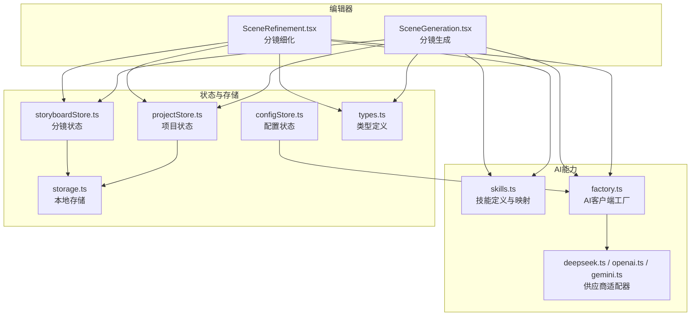
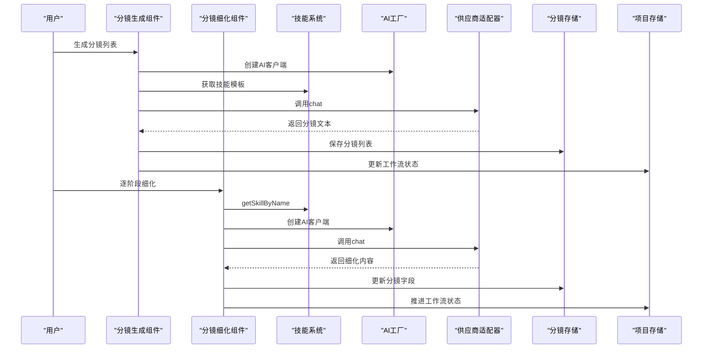
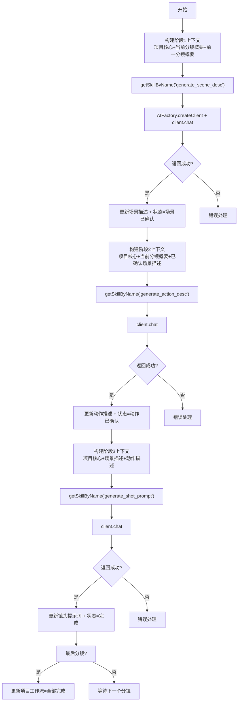
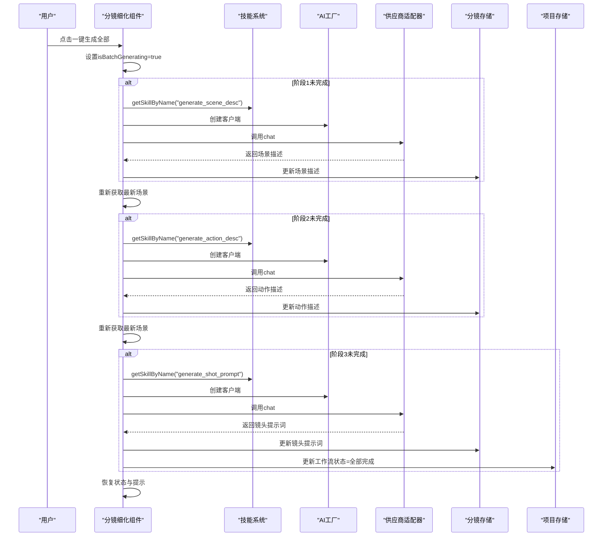
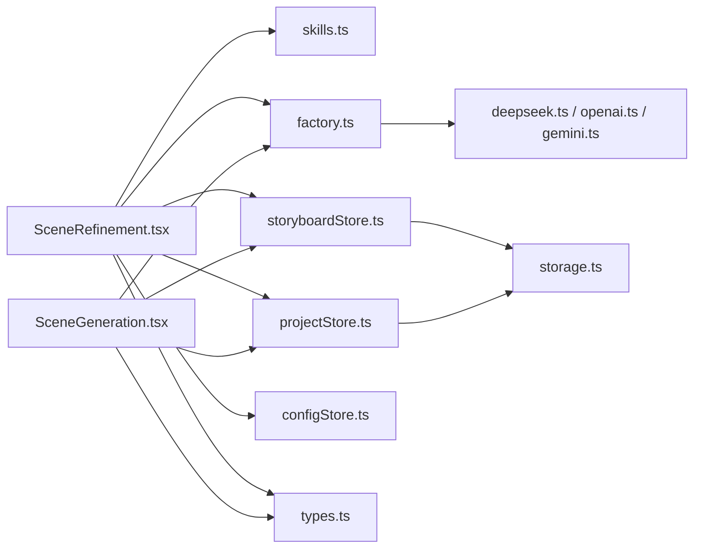

# 分镜细化

<cite>
**本文引用的文件**
- [SceneRefinement.tsx](file://manga-creator/src/components/editor/SceneRefinement.tsx)
- [skills.ts](file://manga-creator/src/lib/ai/skills.ts)
- [factory.ts](file://manga-creator/src/lib/ai/factory.ts)
- [storyboardStore.ts](file://manga-creator/src/stores/storyboardStore.ts)
- [projectStore.ts](file://manga-creator/src/stores/projectStore.ts)
- [configStore.ts](file://manga-creator/src/stores/configStore.ts)
- [types.ts](file://manga-creator/src/types/index.ts)
- [storage.ts](file://manga-creator/src/lib/storage.ts)
- [SceneGeneration.tsx](file://manga-creator/src/components/editor/SceneGeneration.tsx)
- [deepseek.ts](file://manga-creator/src/lib/ai/providers/deepseek.ts)
- [openai.ts](file://manga-creator/src/lib/ai/providers/openai.ts)
- [gemini.ts](file://manga-creator/src/lib/ai/providers/gemini.ts)
</cite>

## 目录
1. [引言](#引言)
2. [项目结构](#项目结构)
3. [核心组件](#核心组件)
4. [架构总览](#架构总览)
5. [详细组件分析](#详细组件分析)
6. [依赖分析](#依赖分析)
7. [性能考虑](#性能考虑)
8. [故障排查指南](#故障排查指南)
9. [结论](#结论)
10. [附录](#附录)

## 引言
本文件围绕“分镜细化”工作流展开，系统性解析三阶段渐进式生成机制：场景描述生成、动作描述生成、镜头提示词生成。文档重点阐述：
- 每阶段的AI技能调用（通过技能名称映射到具体技能）
- 上下文保持（参考前一分镜、项目核心要素）
- 状态依赖关系（后一阶段依赖前一阶段输出）
- 一键生成全部的实现与错误处理
- 分镜导航（上一个/下一个）与整体进度跟踪
- 提示词质量最佳实践与常见问题排查

## 项目结构
该模块位于漫画创作前端工程中，采用按功能域组织的目录结构，核心涉及编辑器组件、AI工厂与技能、状态存储以及本地持久化。

图表来源
- [SceneGeneration.tsx](file://manga-creator/src/components/editor/SceneGeneration.tsx#L1-L383)
- [SceneRefinement.tsx](file://manga-creator/src/components/editor/SceneRefinement.tsx#L1-L638)
- [skills.ts](file://manga-creator/src/lib/ai/skills.ts#L1-L132)
- [factory.ts](file://manga-creator/src/lib/ai/factory.ts#L1-L54)
- [deepseek.ts](file://manga-creator/src/lib/ai/providers/deepseek.ts#L1-L110)
- [openai.ts](file://manga-creator/src/lib/ai/providers/openai.ts#L1-L88)
- [gemini.ts](file://manga-creator/src/lib/ai/providers/gemini.ts#L1-L138)
- [storyboardStore.ts](file://manga-creator/src/stores/storyboardStore.ts#L1-L107)
- [projectStore.ts](file://manga-creator/src/stores/projectStore.ts#L1-L95)
- [configStore.ts](file://manga-creator/src/stores/configStore.ts#L1-L58)
- [types.ts](file://manga-creator/src/types/index.ts#L1-L190)
- [storage.ts](file://manga-creator/src/lib/storage.ts#L1-L246)

章节来源
- [SceneGeneration.tsx](file://manga-creator/src/components/editor/SceneGeneration.tsx#L1-L383)
- [SceneRefinement.tsx](file://manga-creator/src/components/editor/SceneRefinement.tsx#L1-L638)
- [skills.ts](file://manga-creator/src/lib/ai/skills.ts#L1-L132)
- [factory.ts](file://manga-creator/src/lib/ai/factory.ts#L1-L54)
- [storyboardStore.ts](file://manga-creator/src/stores/storyboardStore.ts#L1-L107)
- [projectStore.ts](file://manga-creator/src/stores/projectStore.ts#L1-L95)
- [configStore.ts](file://manga-creator/src/stores/configStore.ts#L1-L58)
- [types.ts](file://manga-creator/src/types/index.ts#L1-L190)
- [storage.ts](file://manga-creator/src/lib/storage.ts#L1-L246)

## 核心组件
- 分镜细化组件：负责三阶段生成、一键生成、分镜导航与进度展示，并在完成后推进项目工作流状态。
- 技能系统：集中定义三阶段提示词模板与上下文需求，提供按名称映射的查询接口。
- AI工厂与供应商适配器：根据用户配置动态创建AI客户端，屏蔽不同供应商差异。
- 状态存储：Zustand状态管理，负责项目与分镜数据的读写与重排。
- 类型与存储：统一的数据结构定义与本地加密存储。

章节来源
- [SceneRefinement.tsx](file://manga-creator/src/components/editor/SceneRefinement.tsx#L1-L638)
- [skills.ts](file://manga-creator/src/lib/ai/skills.ts#L1-L132)
- [factory.ts](file://manga-creator/src/lib/ai/factory.ts#L1-L54)
- [storyboardStore.ts](file://manga-creator/src/stores/storyboardStore.ts#L1-L107)
- [projectStore.ts](file://manga-creator/src/stores/projectStore.ts#L1-L95)
- [types.ts](file://manga-creator/src/types/index.ts#L1-L190)
- [storage.ts](file://manga-creator/src/lib/storage.ts#L1-L246)

## 架构总览
分镜细化工作流由“分镜生成”和“分镜细化”两个阶段组成。前者生成初始分镜列表，后者对每个分镜进行三阶段细化：场景描述、动作描述、镜头提示词。各阶段通过技能模板与上下文构建提示词，使用AI客户端调用不同供应商接口，最终将结果持久化到本地存储。

图表来源
- [SceneGeneration.tsx](file://manga-creator/src/components/editor/SceneGeneration.tsx#L1-L383)
- [SceneRefinement.tsx](file://manga-creator/src/components/editor/SceneRefinement.tsx#L1-L638)
- [skills.ts](file://manga-creator/src/lib/ai/skills.ts#L1-L132)
- [factory.ts](file://manga-creator/src/lib/ai/factory.ts#L1-L54)
- [deepseek.ts](file://manga-creator/src/lib/ai/providers/deepseek.ts#L1-L110)
- [openai.ts](file://manga-creator/src/lib/ai/providers/openai.ts#L1-L88)
- [gemini.ts](file://manga-creator/src/lib/ai/providers/gemini.ts#L1-L138)
- [storyboardStore.ts](file://manga-creator/src/stores/storyboardStore.ts#L1-L107)
- [projectStore.ts](file://manga-creator/src/stores/projectStore.ts#L1-L95)

## 详细组件分析

### 三阶段渐进式生成机制
- 场景描述生成（阶段1）
  - 技能名称映射：generate_scene_desc -> scene-description
  - 上下文：项目风格、主角、故事核心；当前分镜概要；前一分镜概要（若存在）
  - 输出：场景描述（空间环境、光线氛围、关键道具、构图建议）
  - 状态：更新为“场景已确认”，用于后续阶段依赖
- 动作描述生成（阶段2）
  - 技能名称映射：generate_action_desc -> action-description
  - 上下文：项目核心、当前分镜概要、已确认的场景描述
  - 输出：角色动作、表情、情绪、与环境互动
  - 状态：更新为“动作已确认”
- 镜头提示词生成（阶段3）
  - 技能名称映射：generate_shot_prompt -> prompt-generator
  - 上下文：项目核心、场景描述、动作描述
  - 输出：面向AI绘图的英文提示词（含风格、角色、场景、构图、镜头、灯光、色彩、画质等）
  - 状态：更新为“完成”，并在最后一个分镜完成后推进项目工作流至“全部完成”

图表来源
- [SceneRefinement.tsx](file://manga-creator/src/components/editor/SceneRefinement.tsx#L50-L207)
- [skills.ts](file://manga-creator/src/lib/ai/skills.ts#L26-L105)
- [factory.ts](file://manga-creator/src/lib/ai/factory.ts#L44-L54)

章节来源
- [SceneRefinement.tsx](file://manga-creator/src/components/editor/SceneRefinement.tsx#L50-L207)
- [skills.ts](file://manga-creator/src/lib/ai/skills.ts#L26-L105)
- [types.ts](file://manga-creator/src/types/index.ts#L1-L190)

### AI技能调用与上下文构建
- 技能获取
  - 使用 getSkillByName 将“generate_scene_desc”、“generate_action_desc”、“generate_shot_prompt”映射到对应技能键值，再从技能注册表取模板与上下文需求。
- 上下文保持
  - 场景描述阶段：携带前一分镜概要，确保跨分镜连贯性。
  - 动作描述阶段：复用已确认的场景描述，避免重复生成。
  - 镜头提示词阶段：整合场景与动作描述，形成最终提示词。
- 模板替换
  - 通过字符串替换将项目风格、主角、故事核心、当前/前一分镜概要注入模板，形成最终提示词。

章节来源
- [SceneRefinement.tsx](file://manga-creator/src/components/editor/SceneRefinement.tsx#L66-L182)
- [skills.ts](file://manga-creator/src/lib/ai/skills.ts#L26-L105)

### 一键生成全部的实现逻辑与错误处理
- 控制并发
  - 使用 isBatchGenerating 与 isGenerating 防止重复触发。
- 顺序执行
  - 严格按阶段顺序：先场景描述，再动作描述，最后镜头提示词。
- 状态校验与重取
  - 每阶段完成后，通过状态钩子重新获取最新场景数据，确保依赖满足后再进入下一阶段。
- 错误处理
  - 捕获异常并设置错误提示；在任一阶段失败时中断后续流程，避免无效请求。
- 完成推进
  - 最后一个分镜完成后，更新项目工作流状态为“全部完成”。

图表来源
- [SceneRefinement.tsx](file://manga-creator/src/components/editor/SceneRefinement.tsx#L228-L291)
- [skills.ts](file://manga-creator/src/lib/ai/skills.ts#L116-L132)
- [factory.ts](file://manga-creator/src/lib/ai/factory.ts#L44-L54)

章节来源
- [SceneRefinement.tsx](file://manga-creator/src/components/editor/SceneRefinement.tsx#L228-L291)

### 分镜导航与整体进度跟踪
- 分镜导航
  - 上一个/下一个：根据 currentSceneIndex 切换当前分镜，并同步更新项目 currentSceneOrder。
- 整体进度
  - 基于当前分镜序号与总数计算百分比，使用进度条直观展示。
- 完成态推进
  - 当最后一个分镜完成时，提供“前往导出”按钮并触发自定义事件推进工作流。

章节来源
- [SceneRefinement.tsx](file://manga-creator/src/components/editor/SceneRefinement.tsx#L209-L227)
- [SceneRefinement.tsx](file://manga-creator/src/components/editor/SceneRefinement.tsx#L330-L337)
- [SceneRefinement.tsx](file://manga-creator/src/components/editor/SceneRefinement.tsx#L594-L619)

### 提示词质量最佳实践
- 明确风格与角色：在场景与动作描述中强调风格关键词与角色特征，有助于生成更贴合的提示词。
- 结构化输出：遵循技能模板中的输出要求，确保提示词包含角色、动作、场景、构图、镜头、灯光、色彩基调、画质等关键维度。
- 英文提示词：按模板要求输出英文，便于主流绘图模型理解。
- 参数补充：在提示词末尾添加常用参数（如宽高比），提升生成稳定性。

章节来源
- [skills.ts](file://manga-creator/src/lib/ai/skills.ts#L78-L105)

## 依赖分析
- 组件耦合
  - 分镜细化组件依赖技能系统、AI工厂、项目与分镜存储、配置存储。
  - 分镜生成组件同样依赖AI工厂与存储层，但不直接参与三阶段细化。
- 外部依赖
  - 供应商适配器封装不同平台的API差异，工厂负责选择与实例化。
- 状态依赖
  - 三阶段细化强依赖前一阶段输出；一键生成通过状态钩子确保依赖满足。
- 循环依赖
  - 未发现循环依赖迹象，组件职责清晰。

图表来源
- [SceneRefinement.tsx](file://manga-creator/src/components/editor/SceneRefinement.tsx#L1-L638)
- [SceneGeneration.tsx](file://manga-creator/src/components/editor/SceneGeneration.tsx#L1-L383)
- [skills.ts](file://manga-creator/src/lib/ai/skills.ts#L1-L132)
- [factory.ts](file://manga-creator/src/lib/ai/factory.ts#L1-L54)
- [deepseek.ts](file://manga-creator/src/lib/ai/providers/deepseek.ts#L1-L110)
- [openai.ts](file://manga-creator/src/lib/ai/providers/openai.ts#L1-L88)
- [gemini.ts](file://manga-creator/src/lib/ai/providers/gemini.ts#L1-L138)
- [storyboardStore.ts](file://manga-creator/src/stores/storyboardStore.ts#L1-L107)
- [projectStore.ts](file://manga-creator/src/stores/projectStore.ts#L1-L95)
- [configStore.ts](file://manga-creator/src/stores/configStore.ts#L1-L58)
- [storage.ts](file://manga-creator/src/lib/storage.ts#L1-L246)
- [types.ts](file://manga-creator/src/types/index.ts#L1-L190)

章节来源
- [SceneRefinement.tsx](file://manga-creator/src/components/editor/SceneRefinement.tsx#L1-L638)
- [SceneGeneration.tsx](file://manga-creator/src/components/editor/SceneGeneration.tsx#L1-L383)
- [factory.ts](file://manga-creator/src/lib/ai/factory.ts#L1-L54)
- [storage.ts](file://manga-creator/src/lib/storage.ts#L1-L246)

## 性能考虑
- 并发控制：通过 isGenerating 与 isBatchGenerating 防止重复请求，降低资源消耗。
- 状态更新：每次生成后立即持久化，减少UI与存储之间的不一致。
- 供应商适配：工厂与适配器分离，便于扩展与替换供应商，同时避免在UI层直接耦合网络细节。
- 本地存储：使用加密存储与版本化，保障数据安全与迁移兼容。

[本节为通用指导，无需列出具体文件来源]

## 故障排查指南
- AI配置缺失
  - 现象：创建客户端时报错或无法发起请求。
  - 排查：检查配置是否完整（供应商、API Key、模型），并通过连接测试验证。
- 技能未找到
  - 现象：getSkillByName 返回空。
  - 排查：确认技能名称映射是否正确，技能注册表是否存在对应键值。
- 分镜数据为空
  - 现象：一键生成在阶段间报错。
  - 排查：确认当前分镜已加载且包含必要字段；在阶段间添加短暂延迟以等待状态更新。
- 供应商错误
  - 现象：供应商适配器抛出HTTP错误或解析失败。
  - 排查：检查API Key、baseURL、模型名称；查看供应商返回的错误详情。
- 本地存储异常
  - 现象：保存/加载失败或数据损坏。
  - 排查：检查浏览器存储容量与权限；必要时清理或导出导入数据。

章节来源
- [configStore.ts](file://manga-creator/src/stores/configStore.ts#L45-L57)
- [factory.ts](file://manga-creator/src/lib/ai/factory.ts#L44-L54)
- [SceneRefinement.tsx](file://manga-creator/src/components/editor/SceneRefinement.tsx#L228-L291)
- [deepseek.ts](file://manga-creator/src/lib/ai/providers/deepseek.ts#L12-L27)
- [openai.ts](file://manga-creator/src/lib/ai/providers/openai.ts#L22-L35)
- [gemini.ts](file://manga-creator/src/lib/ai/providers/gemini.ts#L41-L56)
- [storage.ts](file://manga-creator/src/lib/storage.ts#L1-L246)

## 结论
分镜细化工作流通过三阶段渐进式生成与严格的上下文依赖，实现了从“分镜概要”到“镜头提示词”的高质量产出。借助技能系统与AI工厂，系统具备良好的可扩展性与可维护性；通过状态存储与本地持久化，确保数据一致性与用户体验。一键生成与导航功能进一步提升了创作效率，配合错误处理与最佳实践，能够稳定支撑从创作到导出的全流程。

[本节为总结性内容，无需列出具体文件来源]

## 附录
- 相关类型与状态
  - 工作流状态、分镜步骤、分镜状态、项目与分镜实体、AI配置与消息类型等均在类型定义文件中集中管理，便于统一约束与扩展。

章节来源
- [types.ts](file://manga-creator/src/types/index.ts#L1-L190)