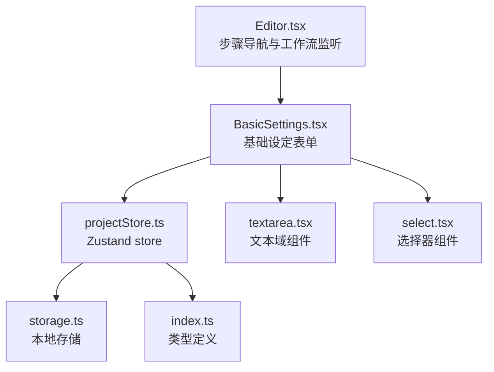
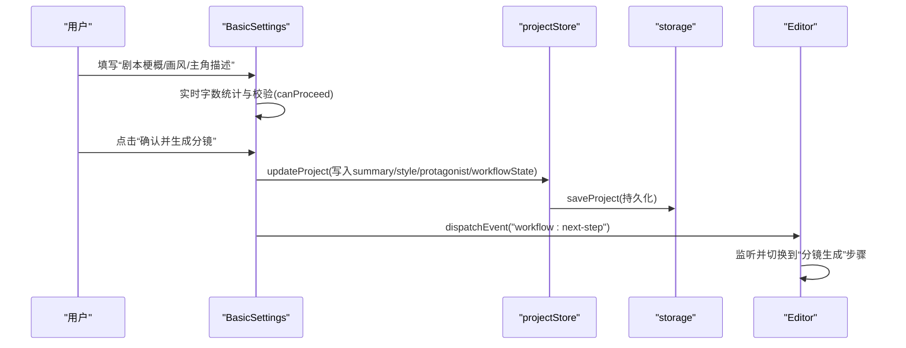
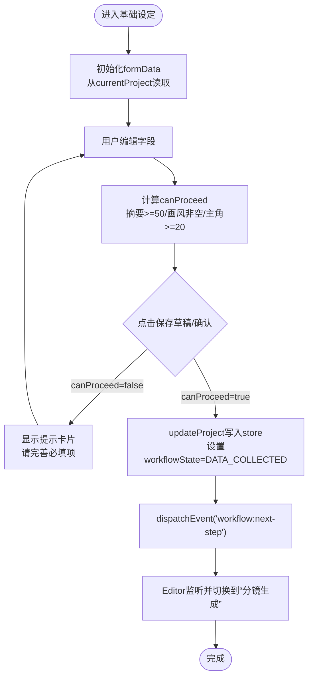
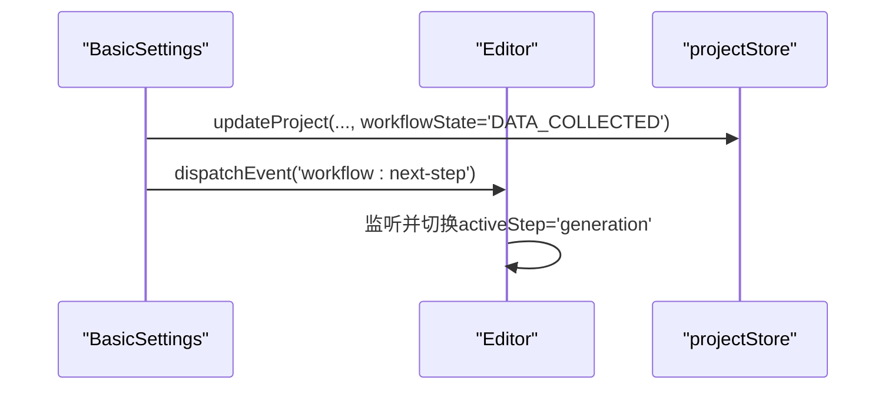
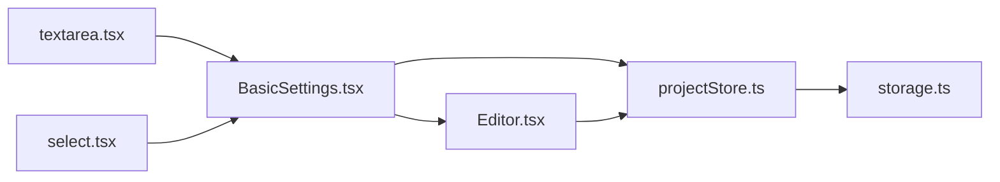

# 基础设定

<cite>
**本文引用的文件**
- [BasicSettings.tsx](file://manga-creator/src/components/editor/BasicSettings.tsx)
- [Editor.tsx](file://manga-creator/src/components/Editor.tsx)
- [projectStore.ts](file://manga-creator/src/stores/projectStore.ts)
- [storage.ts](file://manga-creator/src/lib/storage.ts)
- [index.ts](file://manga-creator/src/types/index.ts)
- [textarea.tsx](file://manga-creator/src/components/ui/textarea.tsx)
- [select.tsx](file://manga-creator/src/components/ui/select.tsx)
</cite>

## 目录
1. [简介](#简介)
2. [项目结构](#项目结构)
3. [核心组件](#核心组件)
4. [架构总览](#架构总览)
5. [详细组件分析](#详细组件分析)
6. [依赖关系分析](#依赖关系分析)
7. [性能考量](#性能考量)
8. [故障排查指南](#故障排查指南)
9. [结论](#结论)
10. [附录](#附录)

## 简介
本章节聚焦“基础设定”模块，系统解析 BasicSettings 组件如何收集剧本梗概、画风选择与主角描述等核心创作信息，并说明表单验证逻辑（如 50 字摘要与 20 字主角描述的最低要求）、状态管理（formData 与 Zustand store 的双向同步）、用户交互反馈（实时字数统计与进度提示），以及用户点击“确认并生成分镜”后触发的工作流事件流（数据保存与工作流状态变更）。同时提供填写建议与最佳实践，帮助用户构建高质量的项目上下文。

## 项目结构
基础设定位于编辑器界面的“基础设定”步骤，与工作流状态紧密耦合：
- 编辑器入口负责根据工作流状态渲染对应步骤组件
- BasicSettings 负责收集基础信息并驱动工作流推进
- Zustand store 负责持久化与全局状态管理
- 类型定义统一约束工作流状态与实体字段



图表来源
- [Editor.tsx](file://manga-creator/src/components/Editor.tsx#L1-L172)
- [BasicSettings.tsx](file://manga-creator/src/components/editor/BasicSettings.tsx#L1-L224)
- [projectStore.ts](file://manga-creator/src/stores/projectStore.ts#L1-L95)
- [storage.ts](file://manga-creator/src/lib/storage.ts#L1-L246)
- [textarea.tsx](file://manga-creator/src/components/ui/textarea.tsx#L1-L23)
- [select.tsx](file://manga-creator/src/components/ui/select.tsx#L1-L159)
- [index.ts](file://manga-creator/src/types/index.ts#L1-L190)

章节来源
- [Editor.tsx](file://manga-creator/src/components/Editor.tsx#L1-L172)
- [BasicSettings.tsx](file://manga-creator/src/components/editor/BasicSettings.tsx#L1-L224)
- [projectStore.ts](file://manga-creator/src/stores/projectStore.ts#L1-L95)
- [storage.ts](file://manga-creator/src/lib/storage.ts#L1-L246)
- [index.ts](file://manga-creator/src/types/index.ts#L1-L190)

## 核心组件
- BasicSettings：负责收集剧本梗概、画风与主角描述；提供字数统计与校验；保存草稿并推进工作流。
- Editor：根据工作流状态自动切换步骤；监听自定义事件以推进到下一步。
- projectStore：Zustand store，提供 create/update/load 等操作，封装本地存储。
- storage：本地存储封装，负责项目与分镜数据的读写与版本迁移。
- 类型定义：统一工作流状态、项目与分镜实体字段，确保跨组件一致性。

章节来源
- [BasicSettings.tsx](file://manga-creator/src/components/editor/BasicSettings.tsx#L1-L224)
- [Editor.tsx](file://manga-creator/src/components/Editor.tsx#L1-L172)
- [projectStore.ts](file://manga-creator/src/stores/projectStore.ts#L1-L95)
- [storage.ts](file://manga-creator/src/lib/storage.ts#L1-L246)
- [index.ts](file://manga-creator/src/types/index.ts#L1-L190)

## 架构总览
基础设定模块围绕“表单 -> 验证 -> 保存 -> 推进工作流”的闭环展开。表单数据通过 useState 维护，提交时经由 store 更新项目并触发工作流状态变更；Editor 监听状态变化与自定义事件，自动切换到下一阶段。



图表来源
- [BasicSettings.tsx](file://manga-creator/src/components/editor/BasicSettings.tsx#L39-L61)
- [projectStore.ts](file://manga-creator/src/stores/projectStore.ts#L63-L81)
- [storage.ts](file://manga-creator/src/lib/storage.ts#L68-L84)
- [Editor.tsx](file://manga-creator/src/components/Editor.tsx#L33-L51)

## 详细组件分析

### BasicSettings 组件
- 表单字段
  - 剧本梗概：文本域，最小长度 50 字，最大 300 字，实时字数统计与颜色提示。
  - 画风选择：下拉选择器，内置多风格预设，选中后可补充风格细节（可选）。
  - 主角描述：文本域，最小长度 20 字，最大 150 字，实时字数统计与提示。
- 校验规则
  - 必填项：剧本梗概、画风、主角描述均需满足最低字数要求。
  - 进度提示：当摘要达到 50 字以上且小于 300 字时显示“长度合适”，超过 300 字给出“建议精简”提示。
- 状态管理
  - 本地状态：useState(formData) 维护表单值；useEffect 将 currentProject 初始化到 formData。
  - 全局状态：useProjectStore.updateProject 写入 store 并持久化；同时设置 workflowState 为 DATA_COLLECTED。
- 用户交互反馈
  - 保存草稿与“确认并生成分镜”按钮禁用条件基于 canProceed。
  - 当未满足条件时显示提示卡片，引导用户完善必填项。
  - 字数统计与颜色提示直观反映输入质量。
- 事件流
  - 点击“确认并生成分镜”：先执行保存，再通过 window.dispatchEvent 触发“workflow:next-step”，由 Editor 监听并切换到“分镜生成”。



图表来源
- [BasicSettings.tsx](file://manga-creator/src/components/editor/BasicSettings.tsx#L23-L61)
- [projectStore.ts](file://manga-creator/src/stores/projectStore.ts#L63-L81)
- [Editor.tsx](file://manga-creator/src/components/Editor.tsx#L33-L51)

章节来源
- [BasicSettings.tsx](file://manga-creator/src/components/editor/BasicSettings.tsx#L1-L224)
- [textarea.tsx](file://manga-creator/src/components/ui/textarea.tsx#L1-L23)
- [select.tsx](file://manga-creator/src/components/ui/select.tsx#L1-L159)

### Editor 组件（工作流监听）
- 根据 currentProject.workflowState 自动切换 activeStep。
- 监听 window 上的自定义事件 workflow:next-step，按状态机推进到下一阶段。
- 步骤映射：
  - 基础设定：IDLE/DATA_COLLECTING/DATA_COLLECTED
  - 分镜生成：SCENE_LIST_GENERATING/SCENE_LIST_EDITING/SCENE_LIST_CONFIRMED
  - 分镜细化：SCENE_PROCESSING
  - 导出：ALL_SCENES_COMPLETE/EXPORTING



图表来源
- [Editor.tsx](file://manga-creator/src/components/Editor.tsx#L16-L51)
- [BasicSettings.tsx](file://manga-creator/src/components/editor/BasicSettings.tsx#L45-L61)
- [projectStore.ts](file://manga-creator/src/stores/projectStore.ts#L63-L81)

章节来源
- [Editor.tsx](file://manga-creator/src/components/Editor.tsx#L1-L172)

### Zustand Store 与本地存储
- projectStore
  - create：创建新项目时设置 workflowState 为 DATA_COLLECTING，currentSceneOrder 为 0。
  - updateProject：合并更新字段并持久化；同时更新 currentProject。
- storage
  - saveProject：将项目写入 localStorage，支持更新与新增。
  - getProjects/getProject：读取项目集合与单个项目。
  - 版本迁移：initStorage 负责版本检查与迁移钩子预留。

```mermaid
classDiagram
class ProjectStore {
+projects : Project[]
+currentProject : Project|null
+isLoading : boolean
+loadProjects()
+loadProject(projectId)
+createProject(projectData)
+updateProject(projectId, updates)
+deleteProject(projectId)
+setCurrentProject(project)
}
class Storage {
+getProjects() : Project[]
+getProject(projectId) : Project|null
+saveProject(project) : void
+deleteProject(projectId) : void
+getScenes(projectId) : Scene[]
+saveScenes(projectId, scenes) : void
+saveScene(projectId, scene) : void
+getConfig() : UserConfig|null
+saveConfig(config) : void
+clearConfig() : void
+exportData() : string
+importData(json) : void
+clearAllData() : void
+getStorageUsage() : {used,total}
}
ProjectStore --> Storage : "调用持久化"
```

图表来源
- [projectStore.ts](file://manga-creator/src/stores/projectStore.ts#L1-L95)
- [storage.ts](file://manga-creator/src/lib/storage.ts#L52-L173)

章节来源
- [projectStore.ts](file://manga-creator/src/stores/projectStore.ts#L1-L95)
- [storage.ts](file://manga-creator/src/lib/storage.ts#L1-L246)

### 类型定义与工作流状态
- WorkflowState：IDLE → DATA_COLLECTING → DATA_COLLECTED → SCENE_LIST_GENERATING → SCENE_LIST_EDITING → SCENE_LIST_CONFIRMED → SCENE_PROCESSING → ALL_SCENES_COMPLETE → EXPORTING。
- Project：包含 id、title、summary、style、protagonist、contextCache、workflowState、currentSceneOrder、createdAt、updatedAt 等字段。
- Scene：包含分镜内容与状态字段，用于后续分镜生成与细化。

章节来源
- [index.ts](file://manga-creator/src/types/index.ts#L1-L190)

## 依赖关系分析
- 组件依赖
  - BasicSettings 依赖 useProjectStore 获取/更新 currentProject，依赖 UI 文本域与选择器组件。
  - Editor 依赖 useProjectStore 监听 workflowState 并切换 activeStep。
- 状态依赖
  - formData 与 currentProject 同步：useEffect 将 currentProject 初始化到 formData；updateProject 写回 store。
  - canProceed 作为按钮可用性的唯一依据，确保工作流按预期推进。
- 事件依赖
  - BasicSettings 通过自定义事件 workflow:next-step 通知 Editor 切换步骤，避免强耦合。



图表来源
- [BasicSettings.tsx](file://manga-creator/src/components/editor/BasicSettings.tsx#L1-L224)
- [Editor.tsx](file://manga-creator/src/components/Editor.tsx#L1-L172)
- [projectStore.ts](file://manga-creator/src/stores/projectStore.ts#L1-L95)
- [storage.ts](file://manga-creator/src/lib/storage.ts#L1-L246)
- [textarea.tsx](file://manga-creator/src/components/ui/textarea.tsx#L1-L23)
- [select.tsx](file://manga-creator/src/components/ui/select.tsx#L1-L159)

## 性能考量
- 表单渲染与校验
  - 使用 useState 维护表单，onChange 仅更新对应字段，避免不必要的重渲染。
  - canProceed 仅依赖三个字段长度与选择器值，计算成本极低。
- 状态同步
  - 通过 useEffect 将 currentProject 同步到 formData，避免重复读取 store。
  - updateProject 合并更新字段并统一设置 updatedAt，减少多次写入。
- 事件监听
  - Editor 对 workflow:next-step 的监听在组件挂载时注册，在卸载时清理，避免内存泄漏。

[本节为通用性能建议，无需特定文件来源]

## 故障排查指南
- 无法进入下一步
  - 检查是否满足 canProceed 条件：摘要≥50、已选择画风、主角描述≥20。
  - 若提示“请完善必填项”，请补齐字段并再次点击“确认并生成分镜”。
- 工作流未推进
  - 确认 updateProject 是否成功写入 store 且 workflowState 已变为 DATA_COLLECTED。
  - 检查 Editor 是否监听到 workflow:next-step 事件并切换 activeStep。
- 数据未持久化
  - 查看 storage.saveProject 是否抛错或返回异常。
  - 确认浏览器 localStorage 可用且未被清理。

章节来源
- [BasicSettings.tsx](file://manga-creator/src/components/editor/BasicSettings.tsx#L39-L61)
- [Editor.tsx](file://manga-creator/src/components/Editor.tsx#L33-L51)
- [projectStore.ts](file://manga-creator/src/stores/projectStore.ts#L63-L81)
- [storage.ts](file://manga-creator/src/lib/storage.ts#L68-L84)

## 结论
基础设定模块通过简洁直观的表单与严格的校验规则，确保用户输入高质量的项目上下文；借助 Zustand store 与本地存储实现可靠的状态持久化；通过自定义事件解耦推进工作流，使 Editor 能够自动跳转到下一阶段。遵循本文提供的填写建议与最佳实践，可显著提升后续分镜生成与细化的质量。

[本节为总结性内容，无需特定文件来源]

## 附录

### 表单验证与字数统计
- 剧本梗概：最小 50 字，最大 300 字；实时颜色提示“长度合适/建议精简/还需 N 字”。
- 画风选择：必选项，选中后可补充风格细节（可选）。
- 主角描述：最小 20 字，最大 150 字；实时提示“描述充分/还需 N 字”。

章节来源
- [BasicSettings.tsx](file://manga-creator/src/components/editor/BasicSettings.tsx#L88-L110)
- [BasicSettings.tsx](file://manga-creator/src/components/editor/BasicSettings.tsx#L160-L179)

### 状态管理与工作流推进
- 保存草稿：updateProject 写入 summary/style/protagonist 与 updatedAt。
- 推进工作流：设置 workflowState=DATA_COLLECTED 并触发 workflow:next-step。
- Editor 切换：根据 workflowState 或自定义事件切换 activeStep。

章节来源
- [BasicSettings.tsx](file://manga-creator/src/components/editor/BasicSettings.tsx#L45-L61)
- [projectStore.ts](file://manga-creator/src/stores/projectStore.ts#L63-L81)
- [Editor.tsx](file://manga-creator/src/components/Editor.tsx#L16-L51)

### 填写建议与最佳实践
- 剧本梗概：包含起因、发展、高潮、结局的基本框架，建议 50-300 字。
- 画风选择：考虑故事题材与目标受众，必要时补充风格细节。
- 主角描述：越具体越好，包含外貌、服装、性格标签等关键信息。
- 一致性原则：所有描述将被提取为“项目上下文”，贯穿整个创作流程。

章节来源
- [BasicSettings.tsx](file://manga-creator/src/components/editor/BasicSettings.tsx#L209-L221)