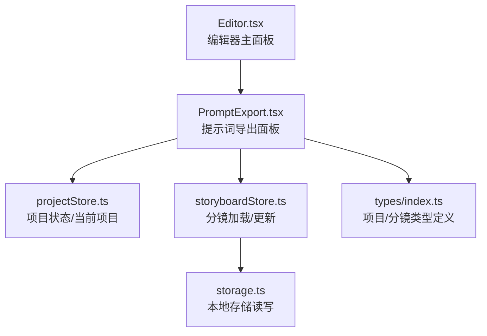
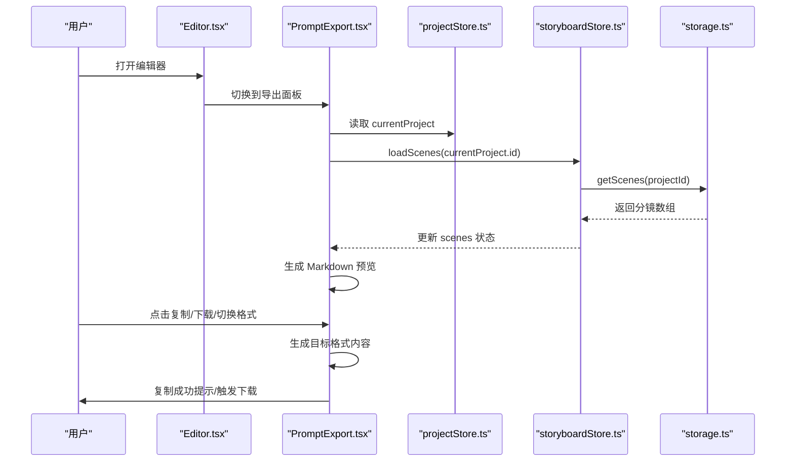
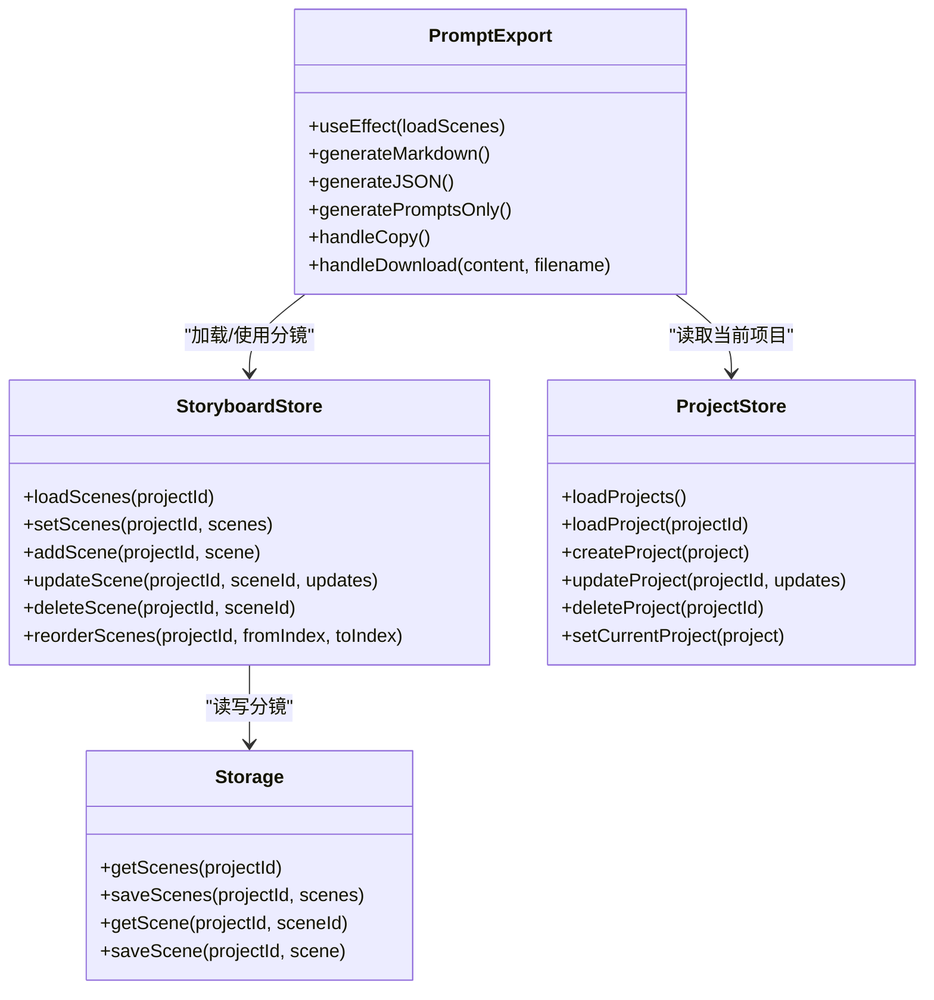
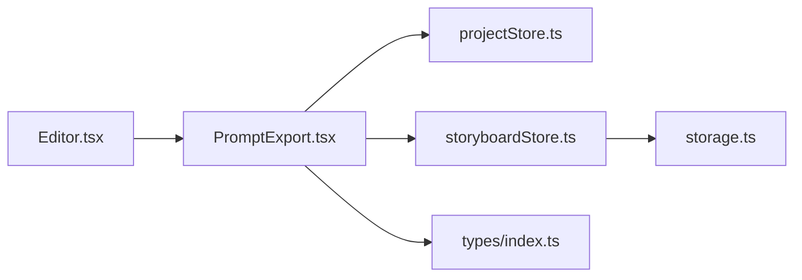

# 提示词导出

<cite>
**本文引用的文件**
- [PromptExport.tsx](file://manga-creator/src/components/editor/PromptExport.tsx)
- [storyboardStore.ts](file://manga-creator/src/stores/storyboardStore.ts)
- [projectStore.ts](file://manga-creator/src/stores/projectStore.ts)
- [storage.ts](file://manga-creator/src/lib/storage.ts)
- [index.ts](file://manga-creator/src/types/index.ts)
- [Editor.tsx](file://manga-creator/src/components/Editor.tsx)
</cite>

## 目录
1. [简介](#简介)
2. [项目结构](#项目结构)
3. [核心组件](#核心组件)
4. [架构总览](#架构总览)
5. [详细组件分析](#详细组件分析)
6. [依赖关系分析](#依赖关系分析)
7. [性能考量](#性能考量)
8. [故障排查指南](#故障排查指南)
9. [结论](#结论)
10. [附录](#附录)

## 简介
本章节面向“提示词导出”功能，系统性解析如何将已完成分镜的场景描述、动作描述与镜头提示词整合为结构化内容，并支持三种导出格式：Markdown、JSON、纯文本（仅提示词）。同时说明复制到剪贴板与文件下载的实现机制，完整性检查（完成进度统计）与用户反馈（未完成分镜提示），以及不同格式的适用场景建议。

## 项目结构
提示词导出功能位于编辑器工作流的“导出”阶段，由 Editor 组件根据项目工作流状态自动切换至导出面板；导出面板负责加载分镜数据、生成多种格式内容、提供复制与下载能力，并进行完成度统计与提示。

图表来源
- [Editor.tsx](file://manga-creator/src/components/Editor.tsx#L1-L172)
- [PromptExport.tsx](file://manga-creator/src/components/editor/PromptExport.tsx#L1-L335)
- [projectStore.ts](file://manga-creator/src/stores/projectStore.ts#L1-L95)
- [storyboardStore.ts](file://manga-creator/src/stores/storyboardStore.ts#L1-L107)
- [storage.ts](file://manga-creator/src/lib/storage.ts#L104-L145)
- [index.ts](file://manga-creator/src/types/index.ts#L43-L76)

章节来源
- [Editor.tsx](file://manga-creator/src/components/Editor.tsx#L1-L172)
- [PromptExport.tsx](file://manga-creator/src/components/editor/PromptExport.tsx#L1-L335)

## 核心组件
- PromptExport 导出面板：负责加载分镜、生成 Markdown/JSON/纯文本内容、复制到剪贴板、下载文件、显示完成度统计与未完成提示。
- storyboardStore 分镜状态管理：提供 loadScenes 获取分镜列表，配合导出面板进行内容生成。
- projectStore 当前项目状态：提供 currentProject 作为导出内容的上下文来源。
- storage 本地存储：提供 getScenes/saveScenes 等接口，供 storyboardStore 使用。
- types 类型定义：定义 Project 与 Scene 的字段，决定导出内容的结构与可用字段。

章节来源
- [PromptExport.tsx](file://manga-creator/src/components/editor/PromptExport.tsx#L1-L335)
- [storyboardStore.ts](file://manga-creator/src/stores/storyboardStore.ts#L1-L107)
- [projectStore.ts](file://manga-creator/src/stores/projectStore.ts#L1-L95)
- [storage.ts](file://manga-creator/src/lib/storage.ts#L104-L145)
- [index.ts](file://manga-creator/src/types/index.ts#L43-L76)

## 架构总览
提示词导出的控制流如下：
- Editor 根据项目工作流状态切换到导出面板；
- 导出面板在挂载后加载当前项目对应的分镜；
- 生成 Markdown 内容作为默认预览；
- 支持切换到 JSON 或仅提示词模式；
- 提供复制到剪贴板与下载为文件的能力；
- 显示完成度统计与未完成提示。

图表来源
- [Editor.tsx](file://manga-creator/src/components/Editor.tsx#L1-L172)
- [PromptExport.tsx](file://manga-creator/src/components/editor/PromptExport.tsx#L1-L335)
- [projectStore.ts](file://manga-creator/src/stores/projectStore.ts#L1-L95)
- [storyboardStore.ts](file://manga-creator/src/stores/storyboardStore.ts#L1-L107)
- [storage.ts](file://manga-creator/src/lib/storage.ts#L104-L145)

## 详细组件分析

### PromptExport 导出面板
- 数据来源与初始化
  - 通过 useProjectStore 获取 currentProject；
  - 通过 useStoryboardStore.loadScenes 加载当前项目分镜；
  - 初始化时自动生成 Markdown 预览内容。
- 结构化内容生成
  - Markdown：包含项目信息、基础设定、分镜列表及各分镜的场景描述、动作描述、镜头提示词、备注等；
  - JSON：包含项目元数据、分镜数组（含顺序、摘要、描述、提示词、状态、备注等）、统计信息（总数、完成数、完成率）；
  - 仅提示词：纯文本，按分镜顺序输出提示词，便于直接粘贴到 AI 绘画工具。
- 复制与下载
  - 复制到剪贴板：调用浏览器 Clipboard API，成功后短暂提示；
  - 下载文件：构造 Blob 并触发 a 标签下载，分别生成 .md、.json、_prompts.txt 文件。
- 完整性检查与用户反馈
  - 计算完成进度：统计 status 为 completed 的分镜占比；
  - 展示统计卡片：分镜总数、已完成、未完成；
  - 未完成提示：当完成数小于总数时，显示黄色提示，建议完成后导出。
- 快速预览
  - 展示每个分镜的摘要与关键字段填充状态（场景/动作/提示词）。

章节来源
- [PromptExport.tsx](file://manga-creator/src/components/editor/PromptExport.tsx#L1-L335)

#### Markdown 生成逻辑
- 项目信息：标题、创建/更新时间、风格、分镜总数、完成进度；
- 基础设定：剧本梗概、主角设定；
- 分镜列表：逐条输出场景描述、动作描述、镜头提示词、备注；
- 使用场景：文档归档、审阅与复盘、团队协作共享。

章节来源
- [PromptExport.tsx](file://manga-creator/src/components/editor/PromptExport.tsx#L43-L87)

#### JSON 生成逻辑
- 项目对象：id、title、summary、style、protagonist、createdAt、updatedAt；
- 分镜数组：order、summary、sceneDescription、actionDescription、shotPrompt、notes、status；
- 统计对象：totalScenes、completedScenes、completionRate；
- 使用场景：数据交换、备份恢复、二次加工与自动化处理。

章节来源
- [PromptExport.tsx](file://manga-creator/src/components/editor/PromptExport.tsx#L90-L118)

#### 仅提示词（纯文本）生成逻辑
- 输出标题与风格、主角信息；
- 逐条输出分镜序号与提示词，分隔线分隔；
- 使用场景：直接粘贴到 MidJourney、Stable Diffusion 等工具。

章节来源
- [PromptExport.tsx](file://manga-creator/src/components/editor/PromptExport.tsx#L121-L136)

#### 复制到剪贴板与下载实现
- 复制：调用 navigator.clipboard.writeText，成功后设置 copied 状态并在 2 秒后重置；
- 下载：构造 Blob（text/plain;charset=utf-8），创建临时 URL，触发 a.download，最后释放 URL；
- 按钮：支持复制、下载 Markdown、下载 JSON、下载仅提示词。

章节来源
- [PromptExport.tsx](file://manga-creator/src/components/editor/PromptExport.tsx#L139-L158)

#### 完整性检查与用户反馈
- 完成度计算：completedScenes.length / scenes.length × 100；
- 统计卡片：展示总数、已完成、未完成；
- 未完成提示：当完成数小于总数时，显示提示信息，建议完成后导出。

章节来源
- [PromptExport.tsx](file://manga-creator/src/components/editor/PromptExport.tsx#L39-L40)
- [PromptExport.tsx](file://manga-creator/src/components/editor/PromptExport.tsx#L176-L190)
- [PromptExport.tsx](file://manga-creator/src/components/editor/PromptExport.tsx#L272-L279)

### 数据模型与类型约束
- Project 字段：id、title、summary、style、protagonist、workflowState、currentSceneOrder、createdAt、updatedAt；
- Scene 字段：id、projectId、order、summary、sceneDescription、actionDescription、shotPrompt、contextSummary、status、notes；
- 导出内容基于上述字段生成，确保字段存在性与一致性。

章节来源
- [index.ts](file://manga-creator/src/types/index.ts#L43-L76)

### 组件关系图

图表来源
- [PromptExport.tsx](file://manga-creator/src/components/editor/PromptExport.tsx#L1-L335)
- [storyboardStore.ts](file://manga-creator/src/stores/storyboardStore.ts#L1-L107)
- [projectStore.ts](file://manga-creator/src/stores/projectStore.ts#L1-L95)
- [storage.ts](file://manga-creator/src/lib/storage.ts#L104-L145)

## 依赖关系分析
- PromptExport 依赖：
  - useProjectStore.currentProject 提供导出上下文；
  - useStoryboardStore.scenes 与 loadScenes 提供分镜数据；
  - 浏览器 Clipboard API 与 Blob URL 实现复制与下载；
  - types 中的 Project/Scene 字段决定导出内容结构。
- storyboardStore 依赖 storage.ts 的 getScenes/saveScenes；
- Editor.tsx 将导出面板集成到工作流中，依据项目工作流状态自动跳转。

图表来源
- [Editor.tsx](file://manga-creator/src/components/Editor.tsx#L1-L172)
- [PromptExport.tsx](file://manga-creator/src/components/editor/PromptExport.tsx#L1-L335)
- [projectStore.ts](file://manga-creator/src/stores/projectStore.ts#L1-L95)
- [storyboardStore.ts](file://manga-creator/src/stores/storyboardStore.ts#L1-L107)
- [storage.ts](file://manga-creator/src/lib/storage.ts#L104-L145)
- [index.ts](file://manga-creator/src/types/index.ts#L43-L76)

章节来源
- [Editor.tsx](file://manga-creator/src/components/Editor.tsx#L1-L172)
- [PromptExport.tsx](file://manga-creator/src/components/editor/PromptExport.tsx#L1-L335)
- [storyboardStore.ts](file://manga-creator/src/stores/storyboardStore.ts#L1-L107)
- [storage.ts](file://manga-creator/src/lib/storage.ts#L104-L145)
- [index.ts](file://manga-creator/src/types/index.ts#L43-L76)

## 性能考量
- 内容生成复杂度
  - Markdown/JSON/纯文本生成均为线性遍历分镜数组，时间复杂度 O(n)，空间复杂度 O(n)；
  - 仅在 scenes 变更或用户切换格式时重新生成，避免重复计算。
- 复制与下载
  - 复制：依赖浏览器 Clipboard API，性能稳定；
  - 下载：Blob 构造与 URL 对象创建成本低，适合大文本导出。
- 建议
  - 分镜数量较多时，优先使用 JSON 以便后续程序化处理；
  - 纯文本导出适合直接粘贴到工具，减少中间转换。

[本节为通用性能讨论，无需特定文件分析]

## 故障排查指南
- 无法加载分镜
  - 确认 currentProject 是否存在；
  - 确认 storyboardStore.loadScenes 已被调用；
  - 检查 storage.getScenes 是否返回空数组（可能无分镜或项目 ID 不匹配）。
- 复制失败
  - 检查浏览器 Clipboard 权限与安全上下文（HTTPS）；
  - 观察控制台错误日志。
- 下载失败
  - 确认传入的 content 与 filename 正确；
  - 检查浏览器弹窗拦截设置；
  - 确认 Blob 类型与编码（text/plain;charset=utf-8）。
- 完成度统计异常
  - 确认分镜 status 字段值为 completed；
  - 检查 scenes 数组长度与过滤条件。

章节来源
- [PromptExport.tsx](file://manga-creator/src/components/editor/PromptExport.tsx#L139-L158)
- [storyboardStore.ts](file://manga-creator/src/stores/storyboardStore.ts#L26-L29)
- [storage.ts](file://manga-creator/src/lib/storage.ts#L104-L113)

## 结论
提示词导出功能以 PromptExport 为核心，结合项目与分镜状态，提供 Markdown、JSON、纯文本三种导出格式，满足文档归档、数据交换与直接输入 AI 绘画工具的需求。通过完成度统计与未完成提示，帮助用户在最佳时机导出完整内容。复制与下载机制简洁可靠，适合在浏览器端快速分享与落地保存。

[本节为总结性内容，无需特定文件分析]

## 附录

### 适用场景建议
- Markdown：适合人类阅读与归档，包含完整项目信息与分镜细节；
- JSON：适合程序处理、备份与二次加工；
- 纯文本（仅提示词）：适合直接粘贴到 MidJourney、Stable Diffusion 等工具。

章节来源
- [PromptExport.tsx](file://manga-creator/src/components/editor/PromptExport.tsx#L283-L294)