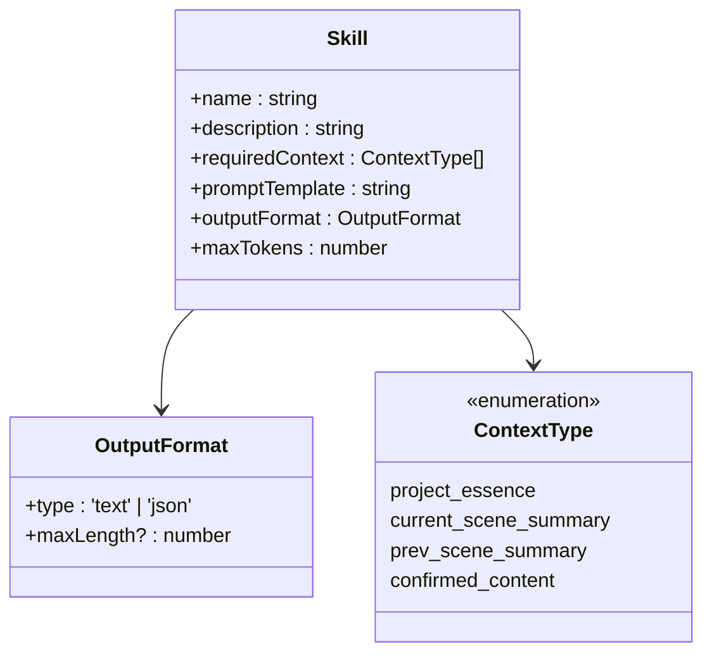
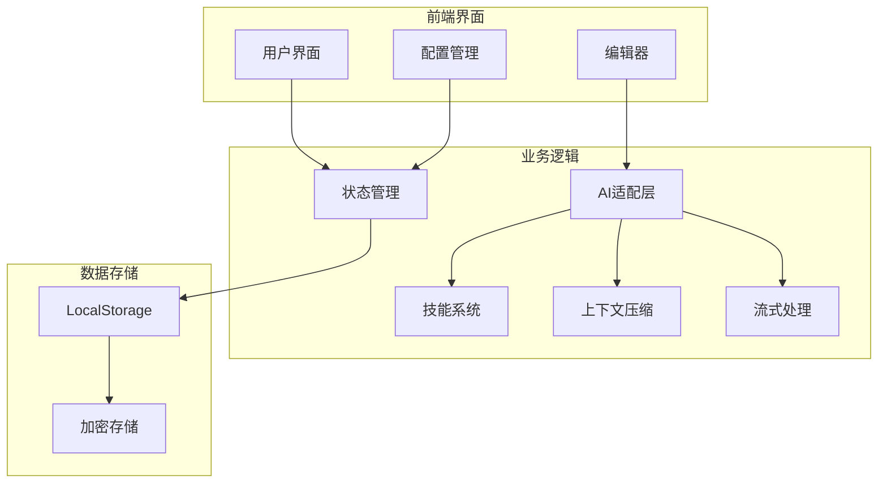
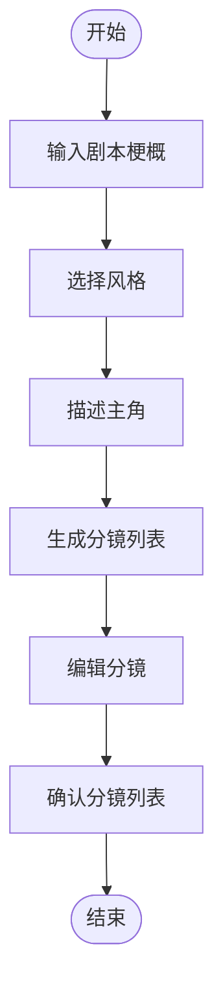
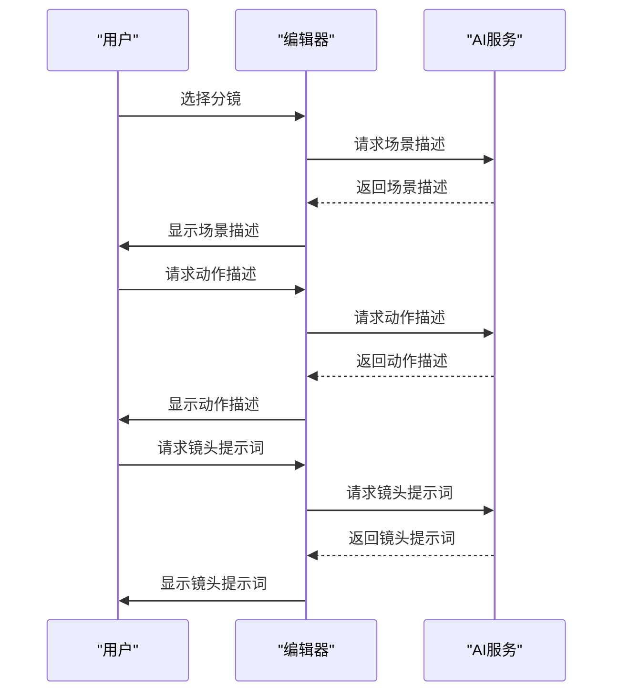
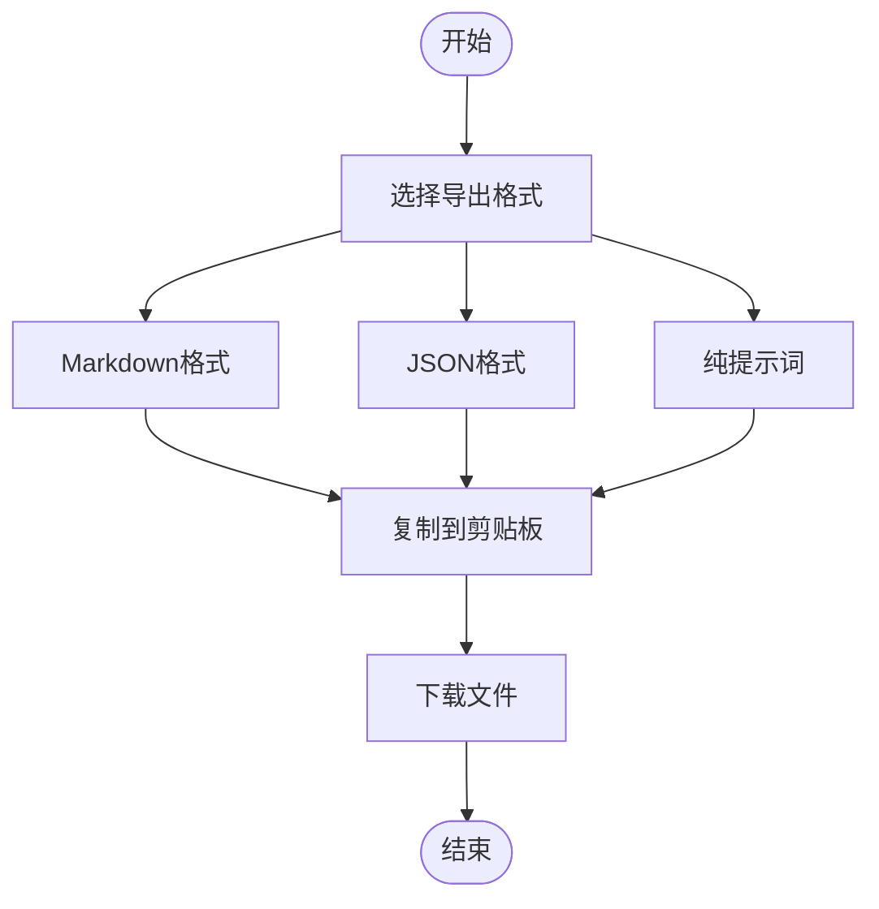
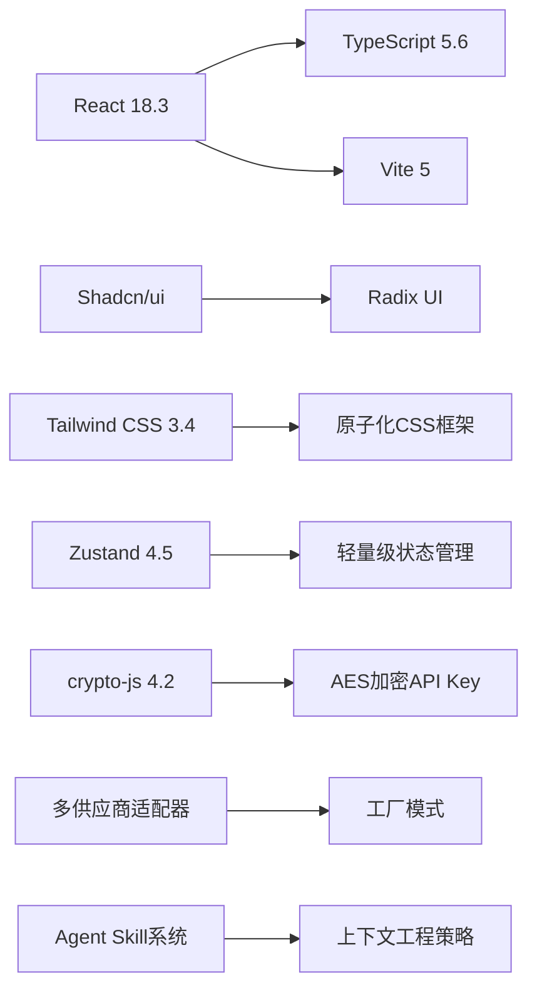

# 提示词生成架构

<cite>
**本文档引用的文件**   
- [README.md](file://manga-creator/README.md)
- [package.json](file://manga-creator/package.json)
- [factory.ts](file://manga-creator/src/lib/ai/factory.ts)
- [skills.ts](file://manga-creator/src/lib/ai/skills.ts)
- [types.ts](file://manga-creator/src/lib/ai/types.ts)
- [deepseek.ts](file://manga-creator/src/lib/ai/providers/deepseek.ts)
- [openai.ts](file://manga-creator/src/lib/ai/providers/openai.ts)
- [gemini.ts](file://manga-creator/src/lib/ai/providers/gemini.ts)
- [contextCompressor.ts](file://manga-creator/src/lib/ai/contextCompressor.ts)
- [streamingHandler.ts](file://manga-creator/src/lib/ai/streamingHandler.ts)
- [SceneGeneration.tsx](file://manga-creator/src/components/editor/SceneGeneration.tsx)
- [SceneRefinement.tsx](file://manga-creator/src/components/editor/SceneRefinement.tsx)
- [PromptExport.tsx](file://manga-creator/src/components/editor/PromptExport.tsx)
- [storyboardStore.ts](file://manga-creator/src/stores/storyboardStore.ts)
- [index.ts](file://manga-creator/src/types/index.ts)
</cite>

## 目录
1. [简介](#简介)
2. [项目结构](#项目结构)
3. [核心组件](#核心组件)
4. [架构概述](#架构概述)
5. [详细组件分析](#详细组件分析)
6. [依赖分析](#依赖分析)
7. [性能考虑](#性能考虑)
8. [故障排除指南](#故障排除指南)
9. [结论](#结论)

## 简介

漫剧创作助手是一个基于AIGC技术的智能提示词生成工具，旨在帮助创作者将剧本系统化地转化为结构化的分镜脚本和高质量的AI绘图提示词。该工具通过渐进式引导与智能上下文管理，确保整部作品的视觉一致性。

本工具的核心功能包括项目管理工作台、API配置管理、数据架构、基础设定模块、分镜生成流程、分镜细化工作流以及提示词整合导出。支持多AI供应商（如DeepSeek、Kimi、Gemini、OpenAI兼容），并采用AES加密存储API Key以保障安全性。

**Section sources**
- [README.md](file://manga-creator/README.md#L1-L195)

## 项目结构

该项目采用模块化的前端架构，主要分为以下几个部分：

```
manga-creator/
├── src/
│   ├── components/          # React组件
│   │   ├── ui/             # Shadcn UI组件(15+)
│   │   ├── editor/         # 编辑器子模块
│   │   │   ├── BasicSettings.tsx     # 基础设定
│   │   │   ├── SceneGeneration.tsx   # 分镜生成
│   │   │   ├── SceneRefinement.tsx   # 分镜细化
│   │   │   └── PromptExport.tsx      # 提示词导出
│   │   ├── ProjectCard.tsx  # 项目卡片
│   │   ├── ProjectList.tsx  # 项目列表
│   │   ├── ConfigDialog.tsx # API配置弹窗
│   │   └── Editor.tsx       # 编辑器主页(路由)
│   ├── stores/             # Zustand状态管理
│   │   ├── projectStore.ts  # 项目状态
│   │   ├── configStore.ts   # 配置状态
│   │   └── storyboardStore.ts # 分镜状态
│   ├── lib/                # 工具库
│   │   ├── storage.ts      # LocalStorage封装
│   │   ├── utils.ts        # 通用工具
│   │   └── ai/             # AI适配层
│   │       ├── types.ts    # AI类型定义
│   │       ├── factory.ts  # 工厂函数
│   │       ├── skills.ts   # Agent技能定义
│   │       └── providers/  # AI供应商适配器
│   ├── types/              # TypeScript类型定义
│   ├── hooks/              # 自定义Hooks
│   └── App.tsx             # 应用入口
├── tailwind.config.js      # Tailwind配置
├── components.json         # Shadcn配置
└── package.json            # 项目依赖
```

**Diagram sources**
- [README.md](file://manga-creator/README.md#L96-L128)

**Section sources**
- [README.md](file://manga-creator/README.md#L94-L128)

## 核心组件

### AI适配层

AI适配层是整个系统的核心，负责与不同的AI供应商进行通信。它通过工厂模式创建适配器，并提供统一的接口来调用不同供应商的API。

```mermaid
classDiagram
class AIProvider {
+name : string
+chat(messages : ChatMessage[], config : AIProviderConfig) : Promise~AIResponse~
+streamChat(messages : ChatMessage[], config : AIProviderConfig) : AsyncGenerator~string~
}
class DeepSeekProvider {
-buildURL(baseURL? : string) : string
-throwResponseError(response : Response) : Promise~never~
+chat(messages : ChatMessage[], config : AIProviderConfig) : Promise~AIResponse~
+streamChat(messages : ChatMessage[], config : AIProviderConfig) : AsyncGenerator~string~
}
class OpenAICompatibleProvider {
+chat(messages : ChatMessage[], config : AIProviderConfig) : Promise~AIResponse~
+streamChat(messages : ChatMessage[], config : AIProviderConfig) : AsyncGenerator~string~
}
class GeminiProvider {
-buildURL(baseURL? : string, model? : string) : string
-buildStreamURL(baseURL? : string, model? : string) : string
-convertMessagesToGeminiFormat(messages : ChatMessage[]) : { contents }
-throwResponseError(response : Response) : Promise~never~
+chat(messages : ChatMessage[], config : AIProviderConfig) : Promise~AIResponse~
+streamChat(messages : ChatMessage[], config : AIProviderConfig) : AsyncGenerator~string~
}
AIProvider <|-- DeepSeekProvider
AIProvider <|-- OpenAICompatibleProvider
AIProvider <|-- GeminiProvider
```

**Diagram sources**
- [factory.ts](file://manga-creator/src/lib/ai/factory.ts#L1-L54)
- [types.ts](file://manga-creator/src/lib/ai/types.ts#L1-L15)
- [deepseek.ts](file://manga-creator/src/lib/ai/providers/deepseek.ts#L1-L110)
- [openai.ts](file://manga-creator/src/lib/ai/providers/openai.ts#L1-L88)
- [gemini.ts](file://manga-creator/src/lib/ai/providers/gemini.ts#L1-L138)

### 技能系统

技能系统定义了各种任务所需的提示词模板和上下文要求。每个技能都有一个唯一的名称、描述、所需上下文、提示词模板、输出格式和最大token数。



**Diagram sources**
- [skills.ts](file://manga-creator/src/lib/ai/skills.ts#L1-L147)
- [index.ts](file://manga-creator/src/types/index.ts#L357-L370)

**Section sources**
- [skills.ts](file://manga-creator/src/lib/ai/skills.ts#L1-L147)

## 架构概述

该系统的整体架构采用了分层设计，主要包括以下几个层次：



**Diagram sources**
- [README.md](file://manga-creator/README.md#L71-L88)
- [package.json](file://manga-creator/package.json#L15-L48)

## 详细组件分析

### 分镜生成流程

分镜生成流程是整个系统的关键环节，它将剧本拆解为多个关键分镜节点。该流程包括以下几个步骤：

1. **输入剧本梗概**：用户输入50-300字的剧本梗概。
2. **选择风格**：用户从6种预设风格中选择一种或自定义描述。
3. **描述主角**：用户输入20-150字的主角描述。
4. **生成分镜列表**：AI智能拆解剧本为8-12个分镜节点。
5. **编辑分镜**：用户可以手动编辑、调整或添加分镜。



**Diagram sources**
- [SceneGeneration.tsx](file://manga-creator/src/components/editor/SceneGeneration.tsx#L1-L465)
- [README.md](file://manga-creator/README.md#L37-L42)

**Section sources**
- [SceneGeneration.tsx](file://manga-creator/src/components/editor/SceneGeneration.tsx#L1-L465)

### 分镜细化工作流

分镜细化工作流是对每个分镜进行详细描述的过程，分为三个阶段：

1. **场景描述**：生成详细的场景描述，包括空间环境、光线氛围、关键道具等。
2. **动作描述**：描述角色的动作。
3. **镜头提示词**：生成用于AI绘画的提示词。



**Diagram sources**
- [SceneRefinement.tsx](file://manga-creator/src/components/editor/SceneRefinement.tsx#L1-L800)
- [README.md](file://manga-creator/README.md#L43-L47)

**Section sources**
- [SceneRefinement.tsx](file://manga-creator/src/components/editor/SceneRefinement.tsx#L1-L800)

### 提示词导出功能

提示词导出功能允许用户将生成的内容导出为多种格式，包括Markdown、JSON、纯提示词等。



**Diagram sources**
- [PromptExport.tsx](file://manga-creator/src/components/editor/PromptExport.tsx#L1-L428)
- [README.md](file://manga-creator/README.md#L49-L54)

**Section sources**
- [PromptExport.tsx](file://manga-creator/src/components/editor/PromptExport.tsx#L1-L428)

## 依赖分析

该项目依赖于多种技术和库，主要包括：



**Diagram sources**
- [package.json](file://manga-creator/package.json#L15-L48)
- [README.md](file://manga-creator/README.md#L71-L93)

**Section sources**
- [package.json](file://manga-creator/package.json#L15-L48)

## 性能考虑

为了提高性能，系统采用了以下几种策略：

1. **上下文压缩**：通过智能压缩对话历史，保留关键信息，避免超出API限制。
2. **流式响应处理**：实时内容更新，支持中断生成，显示生成进度。
3. **本地存储**：使用LocalStorage持久化存储，减少网络请求。

**Section sources**
- [contextCompressor.ts](file://manga-creator/src/lib/ai/contextCompressor.ts#L1-L293)
- [streamingHandler.ts](file://manga-creator/src/lib/ai/streamingHandler.ts#L1-L351)
- [storage.ts](file://manga-creator/src/lib/storage.ts)

## 故障排除指南

### 常见问题及解决方案

1. **无法生成分镜**
   - 检查是否已配置AI服务。
   - 确认API Key是否正确。
   - 检查网络连接是否正常。

2. **生成内容不完整**
   - 调整上下文压缩策略。
   - 增加最大token数。
   - 检查提示词模板是否合适。

3. **导出失败**
   - 确认浏览器权限设置。
   - 检查文件路径是否正确。
   - 尝试重新生成内容后再次导出。

**Section sources**
- [SceneGeneration.tsx](file://manga-creator/src/components/editor/SceneGeneration.tsx#L1-L465)
- [SceneRefinement.tsx](file://manga-creator/src/components/editor/SceneRefinement.tsx#L1-L800)
- [PromptExport.tsx](file://manga-creator/src/components/editor/PromptExport.tsx#L1-L428)

## 结论

漫剧创作助手通过智能化的提示词生成架构，极大地简化了AI漫剧/短剧的创作过程。其核心优势在于渐进式引导、智能上下文管理和多供应商支持。未来规划包括历史版本管理、世界观构建模块、角色管理系统和批量生成优化等功能，将进一步提升用户体验和创作效率。