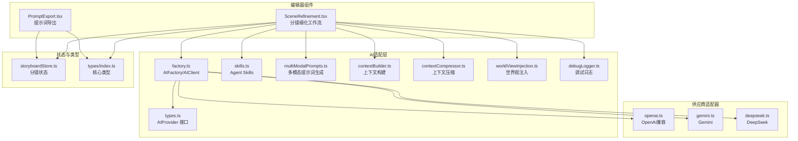
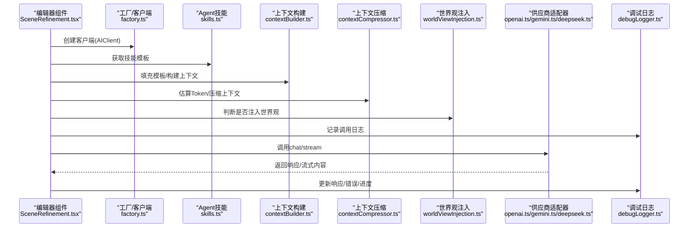
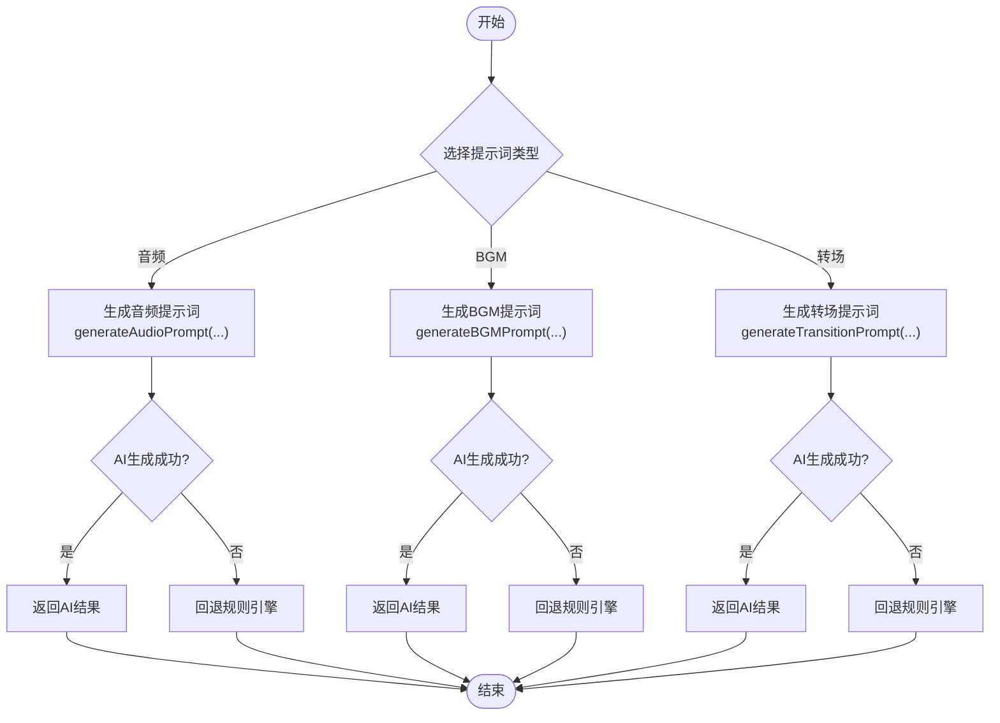
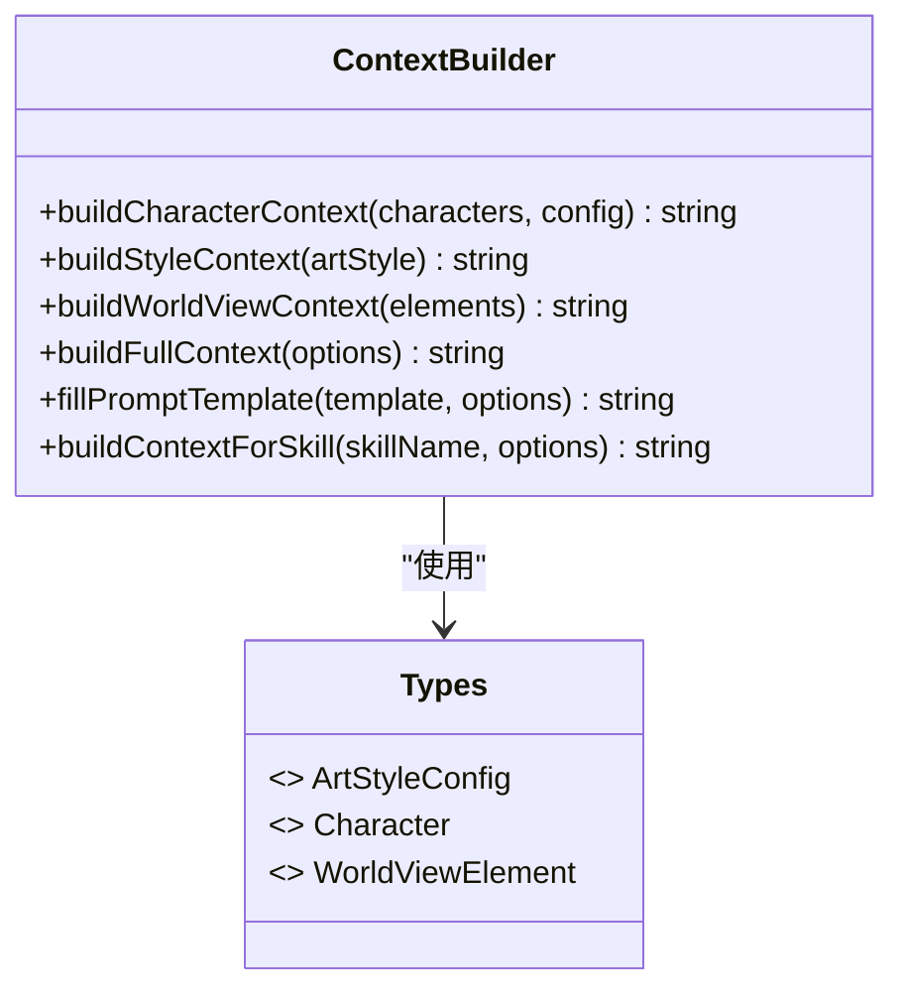
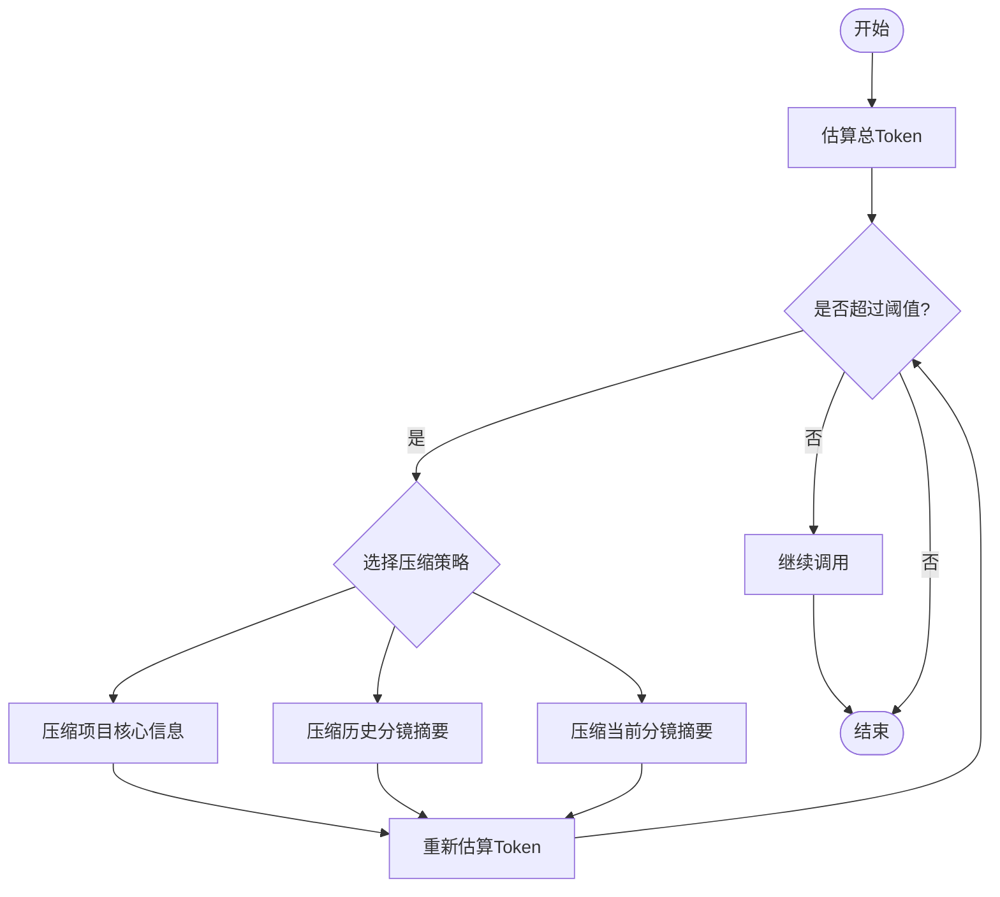
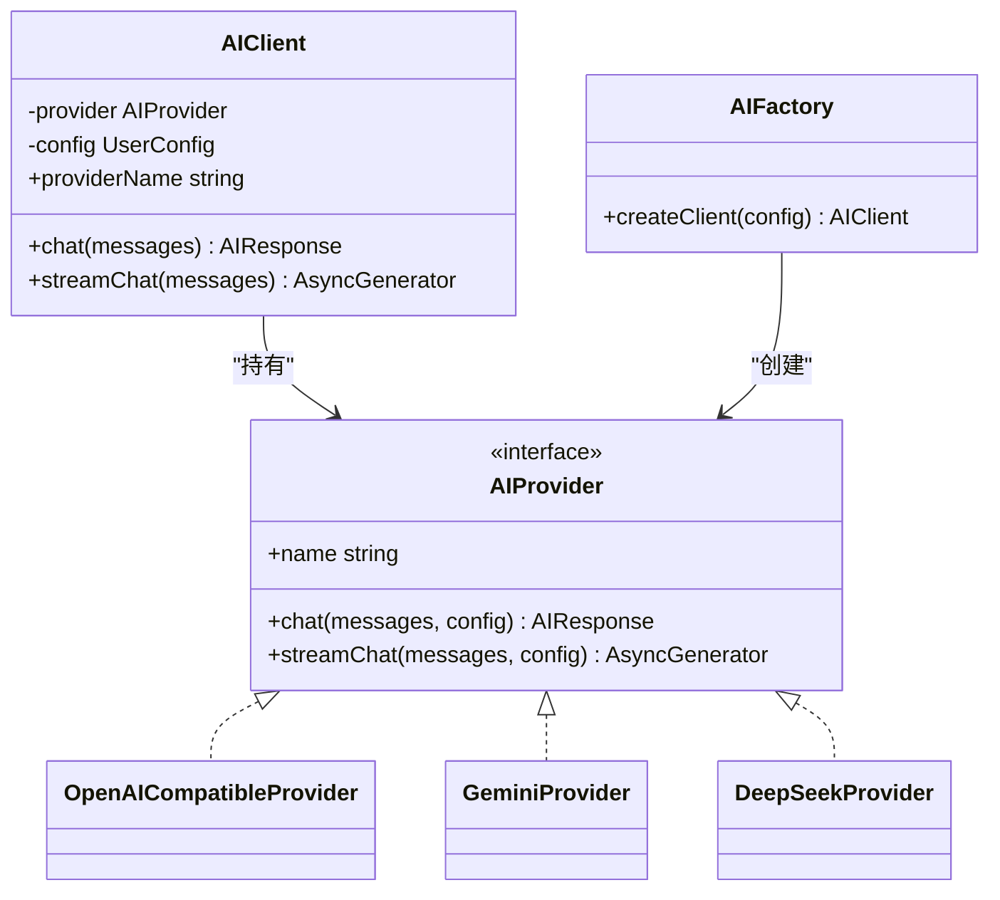
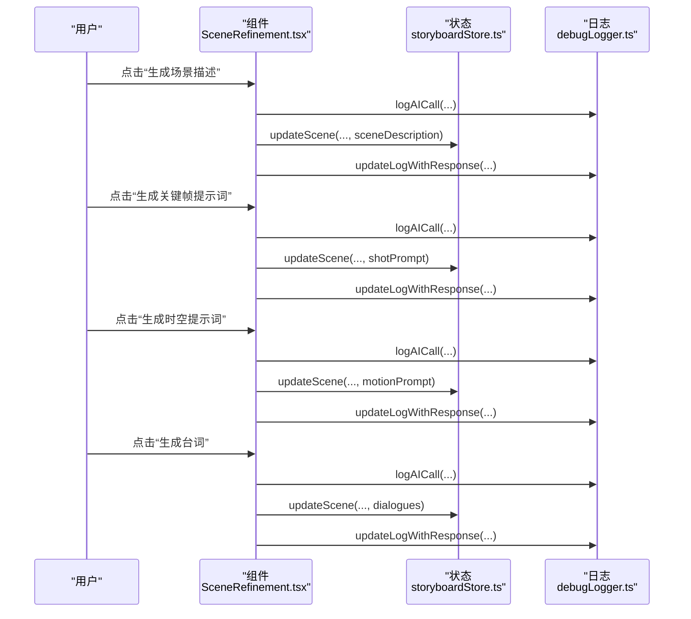
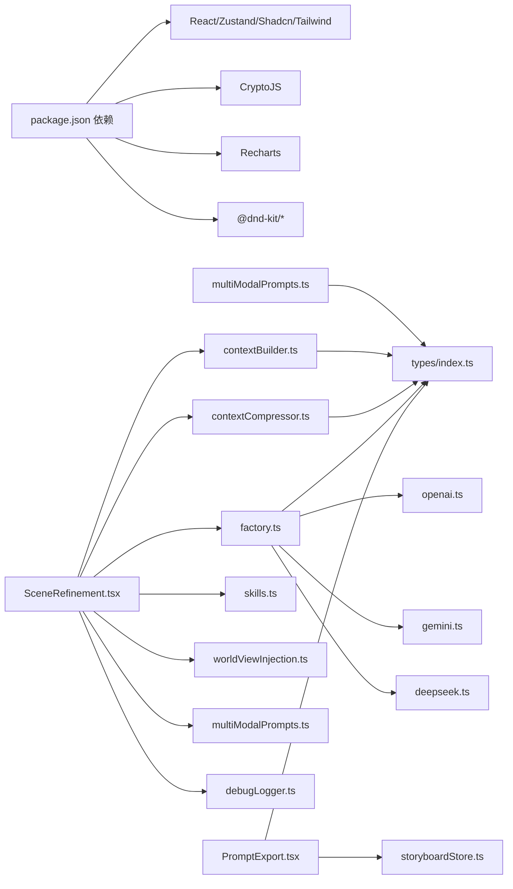

# 多模态提示生成

<cite>
**本文引用的文件**
- [README.md](file://README.md)
- [package.json](file://package.json)
- [multiModalPrompts.ts](file://src/lib/ai/multiModalPrompts.ts)
- [contextBuilder.ts](file://src/lib/ai/contextBuilder.ts)
- [contextCompressor.ts](file://src/lib/ai/contextCompressor.ts)
- [worldViewInjection.ts](file://src/lib/ai/worldViewInjection.ts)
- [debugLogger.ts](file://src/lib/ai/debugLogger.ts)
- [factory.ts](file://src/lib/ai/factory.ts)
- [types.ts](file://src/lib/ai/types.ts)
- [skills.ts](file://src/lib/ai/skills.ts)
- [openai.ts](file://src/lib/ai/providers/openai.ts)
- [gemini.ts](file://src/lib/ai/providers/gemini.ts)
- [deepseek.ts](file://src/lib/ai/providers/deepseek.ts)
- [SceneRefinement.tsx](file://src/components/editor/SceneRefinement.tsx)
- [PromptExport.tsx](file://src/components/editor/PromptExport.tsx)
- [storyboardStore.ts](file://src/stores/storyboardStore.ts)
- [index.ts](file://src/types/index.ts)
</cite>

## 目录
1. [简介](#简介)
2. [项目结构](#项目结构)
3. [核心组件](#核心组件)
4. [架构总览](#架构总览)
5. [详细组件分析](#详细组件分析)
6. [依赖分析](#依赖分析)
7. [性能考量](#性能考量)
8. [故障排查指南](#故障排查指南)
9. [结论](#结论)
10. [附录](#附录)

## 简介
本项目围绕“多模态提示生成”展开，目标是将创作者的剧本与基础设定，系统化地转化为高质量、连贯的AIGC提示词，覆盖：
- 音频/配音提示词（语调、情绪、声线）
- BGM与音效提示词（情绪氛围、乐器、节奏）
- 分镜间转场指令（淡入淡出、推拉等）

系统同时提供“规则引擎”与“AI智能生成”的双通道能力，并在失败时自动回退到规则引擎，确保稳定性与可预测性。配合上下文构建、上下文压缩、世界观注入、调试日志与多供应商适配，形成一套完整的提示词工程化流水线。

## 项目结构
- 前端采用 React + TypeScript + Zustand 状态管理
- AI适配层采用工厂模式，统一接入多家供应商（DeepSeek、Kimi、Gemini、OpenAI兼容）
- 核心逻辑集中在 src/lib/ai 下，包含提示词生成、上下文工程、上下文压缩、调试日志、供应商适配等模块
- 编辑器组件负责将提示词生成流程可视化并驱动状态更新

图表来源
- [SceneRefinement.tsx](file://src/components/editor/SceneRefinement.tsx#L1-L120)
- [PromptExport.tsx](file://src/components/editor/PromptExport.tsx#L1-L120)
- [factory.ts](file://src/lib/ai/factory.ts#L1-L56)
- [types.ts](file://src/lib/ai/types.ts#L1-L15)
- [skills.ts](file://src/lib/ai/skills.ts#L1-L120)
- [multiModalPrompts.ts](file://src/lib/ai/multiModalPrompts.ts#L1-L120)
- [contextBuilder.ts](file://src/lib/ai/contextBuilder.ts#L1-L120)
- [contextCompressor.ts](file://src/lib/ai/contextCompressor.ts#L1-L120)
- [worldViewInjection.ts](file://src/lib/ai/worldViewInjection.ts#L1-L120)
- [debugLogger.ts](file://src/lib/ai/debugLogger.ts#L1-L120)
- [openai.ts](file://src/lib/ai/providers/openai.ts#L1-L88)
- [gemini.ts](file://src/lib/ai/providers/gemini.ts#L1-L138)
- [deepseek.ts](file://src/lib/ai/providers/deepseek.ts#L1-L110)
- [storyboardStore.ts](file://src/stores/storyboardStore.ts#L1-L108)
- [index.ts](file://src/types/index.ts#L1-L200)

章节来源
- [README.md](file://README.md#L1-L120)
- [package.json](file://package.json#L1-L79)

## 核心组件
- 多模态提示词生成模块：提供音频、BGM、转场三类提示词的生成与解析能力，并内置规则引擎与AI智能生成双通道。
- 上下文构建模块：将画风、角色、世界观等信息整合为结构化上下文，支持模板填充与按技能定制。
- 上下文压缩模块：估算Token、动态压缩项目核心信息与分镜摘要，避免超出API限制。
- 世界观注入模块：控制在分镜列表生成与场景描述生成时注入世界观要素。
- 调试日志模块：记录每次AI调用的完整消息、上下文、响应与Token使用，便于优化与排错。
- 工厂与适配器：统一AI客户端接口，支持多家供应商；在失败时自动回退到规则引擎。
- 编辑器组件：将上述能力串联为可视化的分镜细化工作流，支持一键生成与批量操作。

章节来源
- [multiModalPrompts.ts](file://src/lib/ai/multiModalPrompts.ts#L1-L200)
- [contextBuilder.ts](file://src/lib/ai/contextBuilder.ts#L1-L200)
- [contextCompressor.ts](file://src/lib/ai/contextCompressor.ts#L1-L200)
- [worldViewInjection.ts](file://src/lib/ai/worldViewInjection.ts#L1-L120)
- [debugLogger.ts](file://src/lib/ai/debugLogger.ts#L1-L200)
- [factory.ts](file://src/lib/ai/factory.ts#L1-L56)
- [SceneRefinement.tsx](file://src/components/editor/SceneRefinement.tsx#L1-L200)

## 架构总览
系统采用“编辑器组件 + AI适配层 + 工具库”的分层架构：
- 编辑器组件负责用户交互与工作流编排，调用AI适配层执行具体任务
- AI适配层通过工厂模式创建客户端，按技能模板填充上下文，调用供应商API
- 工具库提供上下文构建、压缩、调试日志与多模态提示词生成等支撑能力
- 供应商适配器屏蔽不同平台的差异，统一返回标准响应

图表来源
- [SceneRefinement.tsx](file://src/components/editor/SceneRefinement.tsx#L120-L320)
- [factory.ts](file://src/lib/ai/factory.ts#L1-L56)
- [skills.ts](file://src/lib/ai/skills.ts#L1-L120)
- [contextBuilder.ts](file://src/lib/ai/contextBuilder.ts#L180-L260)
- [contextCompressor.ts](file://src/lib/ai/contextCompressor.ts#L160-L220)
- [worldViewInjection.ts](file://src/lib/ai/worldViewInjection.ts#L100-L160)
- [openai.ts](file://src/lib/ai/providers/openai.ts#L1-L88)
- [gemini.ts](file://src/lib/ai/providers/gemini.ts#L1-L138)
- [deepseek.ts](file://src/lib/ai/providers/deepseek.ts#L1-L110)
- [debugLogger.ts](file://src/lib/ai/debugLogger.ts#L260-L380)

## 详细组件分析

### 多模态提示词生成（Audio/BGM/Transition）
- 音频提示词：基于台词情绪与类型，映射语调与声线风格，支持从文本解析回结构化音频提示词
- BGM提示词：根据场景关键词抽取情绪与节奏，映射音乐风格与乐器，提取环境音效
- 转场提示词：依据前后场景描述与时间跳跃等特征，生成淡入淡出、溶解、擦除等转场指令
- AI智能生成：为三类提示词分别提供AI生成函数，失败时自动回退到规则引擎
- 结构化输出：定义AudioPrompt、BGMPrompt、TransitionPrompt接口，保证跨模块一致的数据形态

图表来源
- [multiModalPrompts.ts](file://src/lib/ai/multiModalPrompts.ts#L120-L220)
- [multiModalPrompts.ts](file://src/lib/ai/multiModalPrompts.ts#L200-L310)
- [multiModalPrompts.ts](file://src/lib/ai/multiModalPrompts.ts#L310-L420)
- [multiModalPrompts.ts](file://src/lib/ai/multiModalPrompts.ts#L520-L639)

章节来源
- [multiModalPrompts.ts](file://src/lib/ai/multiModalPrompts.ts#L1-L200)
- [multiModalPrompts.ts](file://src/lib/ai/multiModalPrompts.ts#L200-L420)
- [multiModalPrompts.ts](file://src/lib/ai/multiModalPrompts.ts#L420-L639)

### 上下文构建与模板填充
- 角色上下文：整合角色外貌、性格、主题色等，格式化为AI可读字符串
- 画风上下文：优先使用完整fullPrompt，否则组合baseStyle/technique/colorPalette/culturalFeature
- 世界观上下文：按类型分组（时代背景、地理设定、社会制度、科技水平、魔法体系、其他设定）
- 模板填充：fillPromptTemplate按占位符替换，buildContextForSkill按技能需求定制上下文
- 与编辑器联动：在生成场景描述、关键帧提示词、时空提示词、台词时，按需注入角色、画风、世界观

图表来源
- [contextBuilder.ts](file://src/lib/ai/contextBuilder.ts#L1-L200)
- [contextBuilder.ts](file://src/lib/ai/contextBuilder.ts#L200-L312)
- [index.ts](file://src/types/index.ts#L1-L200)

章节来源
- [contextBuilder.ts](file://src/lib/ai/contextBuilder.ts#L1-L200)
- [contextBuilder.ts](file://src/lib/ai/contextBuilder.ts#L200-L312)
- [index.ts](file://src/types/index.ts#L1-L200)

### 上下文压缩与Token控制
- Token估算：按中文、英文与其它字符估算tokens，提供calculateTotalTokens
- 压缩策略：aggressive/balanced/conservative三种策略，限制项目核心信息与分镜摘要大小
- 历史压缩：仅保留当前分镜前后若干个分镜摘要，降低上下文长度
- 智能回退：当AI压缩失败时，自动回退到规则引擎（截断、关键词匹配等）

图表来源
- [contextCompressor.ts](file://src/lib/ai/contextCompressor.ts#L1-L120)
- [contextCompressor.ts](file://src/lib/ai/contextCompressor.ts#L160-L220)
- [contextCompressor.ts](file://src/lib/ai/contextCompressor.ts#L230-L300)
- [contextCompressor.ts](file://src/lib/ai/contextCompressor.ts#L360-L518)

章节来源
- [contextCompressor.ts](file://src/lib/ai/contextCompressor.ts#L1-L120)
- [contextCompressor.ts](file://src/lib/ai/contextCompressor.ts#L160-L220)
- [contextCompressor.ts](file://src/lib/ai/contextCompressor.ts#L230-L300)
- [contextCompressor.ts](file://src/lib/ai/contextCompressor.ts#L360-L518)

### 世界观注入控制
- 注入时机：支持在“分镜列表生成时”、“场景描述生成时”或两者皆注入
- 设置持久化：以localStorage为存储介质，按项目ID区分
- 开关控制：提供开关与枚举，便于用户灵活选择

章节来源
- [worldViewInjection.ts](file://src/lib/ai/worldViewInjection.ts#L1-L120)
- [worldViewInjection.ts](file://src/lib/ai/worldViewInjection.ts#L120-L181)

### 调试日志与事件系统
- 记录内容：原始模板、填充后的提示词、实际发送消息、上下文、配置、响应与Token使用
- 事件系统：支持订阅“开始/成功/错误/进度”事件，便于UI与进度桥接
- 控制台工具：提供启用/禁用、导出、统计摘要、优化建议等便捷命令

章节来源
- [debugLogger.ts](file://src/lib/ai/debugLogger.ts#L1-L200)
- [debugLogger.ts](file://src/lib/ai/debugLogger.ts#L260-L380)
- [debugLogger.ts](file://src/lib/ai/debugLogger.ts#L400-L530)

### 工厂与多供应商适配
- 工厂函数：根据供应商类型创建对应适配器实例
- 客户端接口：统一chat/stream方法，屏蔽供应商差异
- 适配器实现：OpenAI兼容、Gemini、DeepSeek，均支持流式与非流式响应

图表来源
- [types.ts](file://src/lib/ai/types.ts#L1-L15)
- [factory.ts](file://src/lib/ai/factory.ts#L1-L56)
- [openai.ts](file://src/lib/ai/providers/openai.ts#L1-L88)
- [gemini.ts](file://src/lib/ai/providers/gemini.ts#L1-L138)
- [deepseek.ts](file://src/lib/ai/providers/deepseek.ts#L1-L110)

章节来源
- [factory.ts](file://src/lib/ai/factory.ts#L1-L56)
- [types.ts](file://src/lib/ai/types.ts#L1-L15)
- [openai.ts](file://src/lib/ai/providers/openai.ts#L1-L88)
- [gemini.ts](file://src/lib/ai/providers/gemini.ts#L1-L138)
- [deepseek.ts](file://src/lib/ai/providers/deepseek.ts#L1-L110)

### 编辑器工作流与状态管理
- 分镜细化工作流：按“场景描述→关键帧提示词→时空提示词→台词”的顺序推进，支持一键生成与重新生成
- 状态管理：Zustand管理分镜列表、当前场景、生成状态；编辑器组件通过store更新场景字段
- 导出功能：支持Markdown、JSON、纯提示词等多种导出格式，便于分享与备份

图表来源
- [SceneRefinement.tsx](file://src/components/editor/SceneRefinement.tsx#L120-L470)
- [storyboardStore.ts](file://src/stores/storyboardStore.ts#L1-L108)
- [debugLogger.ts](file://src/lib/ai/debugLogger.ts#L260-L380)

章节来源
- [SceneRefinement.tsx](file://src/components/editor/SceneRefinement.tsx#L1-L200)
- [storyboardStore.ts](file://src/stores/storyboardStore.ts#L1-L108)
- [PromptExport.tsx](file://src/components/editor/PromptExport.tsx#L1-L200)

## 依赖分析
- 外部依赖：React、Zustand、Shadcn/UI、Tailwind CSS、CryptoJS（API Key加密）、Recharts（统计）、@dnd-kit（拖拽）
- 内部依赖：AI适配层依赖类型定义与工具库；编辑器组件依赖状态与工具库；供应商适配器依赖fetch与SSE

图表来源
- [package.json](file://package.json#L1-L79)
- [multiModalPrompts.ts](file://src/lib/ai/multiModalPrompts.ts#L1-L120)
- [contextBuilder.ts](file://src/lib/ai/contextBuilder.ts#L1-L120)
- [contextCompressor.ts](file://src/lib/ai/contextCompressor.ts#L1-L120)
- [factory.ts](file://src/lib/ai/factory.ts#L1-L56)
- [openai.ts](file://src/lib/ai/providers/openai.ts#L1-L88)
- [gemini.ts](file://src/lib/ai/providers/gemini.ts#L1-L138)
- [deepseek.ts](file://src/lib/ai/providers/deepseek.ts#L1-L110)
- [SceneRefinement.tsx](file://src/components/editor/SceneRefinement.tsx#L1-L120)
- [PromptExport.tsx](file://src/components/editor/PromptExport.tsx#L1-L120)
- [storyboardStore.ts](file://src/stores/storyboardStore.ts#L1-L108)
- [index.ts](file://src/types/index.ts#L1-L200)

章节来源
- [package.json](file://package.json#L1-L79)

## 性能考量
- Token控制：通过上下文压缩与策略选择，避免超出模型上下文窗口
- 回退机制：AI生成失败时自动回退规则引擎，保障可用性
- 流式响应：供应商适配器支持流式输出，改善交互体验
- 状态更新：编辑器组件使用useMemo/useCallback优化渲染与回调，减少不必要的重渲染

章节来源
- [contextCompressor.ts](file://src/lib/ai/contextCompressor.ts#L1-L120)
- [openai.ts](file://src/lib/ai/providers/openai.ts#L37-L88)
- [gemini.ts](file://src/lib/ai/providers/gemini.ts#L90-L138)
- [SceneRefinement.tsx](file://src/components/editor/SceneRefinement.tsx#L1-L120)

## 故障排查指南
- 调试日志：通过window.aiDebug订阅事件或打印摘要，定位提示词与上下文问题
- Token超限：检查calculateTotalTokens与checkTokenLimit输出，必要时降低策略或精简上下文
- 供应商异常：确认API Key、BaseURL与模型配置正确；查看供应商适配器的错误抛出信息
- 回退验证：若AI生成失败，系统会自动回退到规则引擎；可在日志中确认回退原因
- 导出核验：导出Markdown/JSON，比对关键帧与时空提示词是否完整

章节来源
- [debugLogger.ts](file://src/lib/ai/debugLogger.ts#L260-L530)
- [contextCompressor.ts](file://src/lib/ai/contextCompressor.ts#L160-L220)
- [openai.ts](file://src/lib/ai/providers/openai.ts#L1-L88)
- [gemini.ts](file://src/lib/ai/providers/gemini.ts#L58-L138)
- [deepseek.ts](file://src/lib/ai/providers/deepseek.ts#L29-L110)
- [PromptExport.tsx](file://src/components/editor/PromptExport.tsx#L1-L200)

## 结论
本项目通过“规则引擎 + AI智能生成”的双通道设计，结合完善的上下文工程、压缩与调试能力，实现了从剧本到多模态提示词的自动化与工程化。编辑器组件将复杂流程可视化，配合多供应商适配与回退机制，既保证了生成质量，又提升了稳定性与可维护性。

## 附录
- 术语说明
  - 上下文：传递给AI的背景信息集合，包括画风、角色、世界观、历史分镜等
  - Token：模型对文本的计量单位，用于控制上下文长度与成本
  - 回退：当AI生成失败时，采用规则引擎或其他策略生成提示词
- 最佳实践
  - 合理选择上下文压缩策略，避免过度压缩导致语义丢失
  - 在生成关键帧与时空提示词时，优先使用完整画风描述
  - 使用调试日志定期审视提示词质量，持续优化模板与上下文