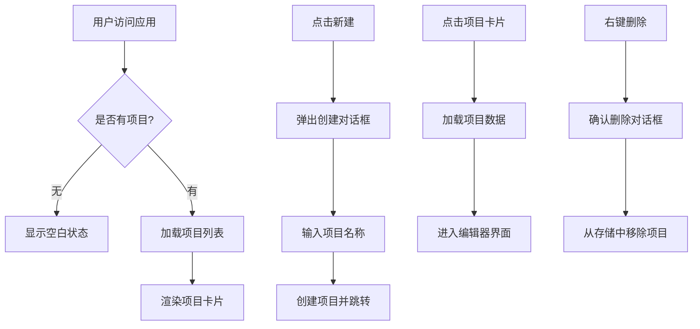
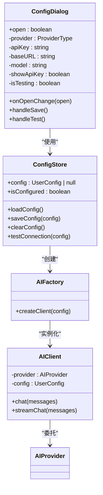
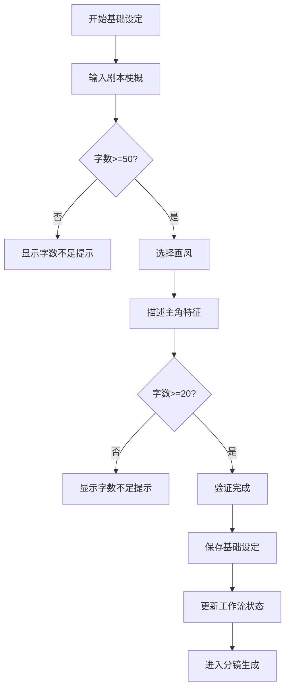
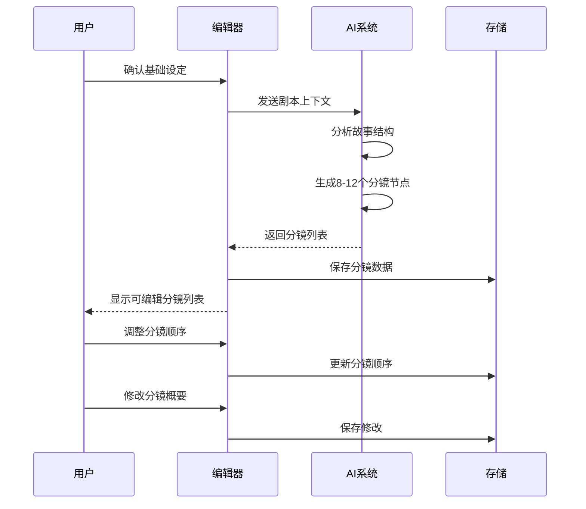
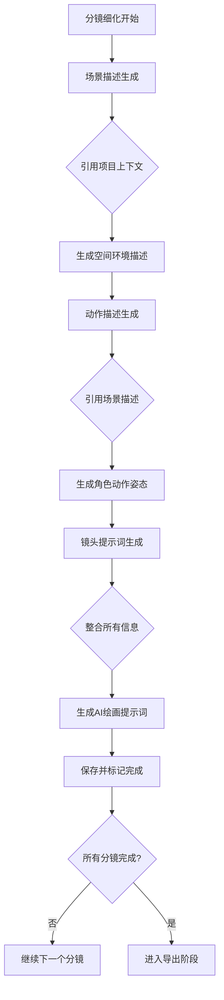
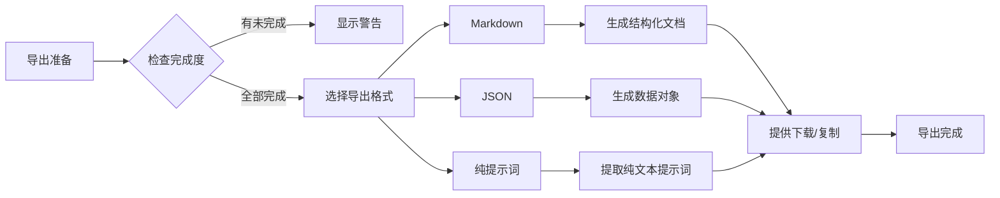
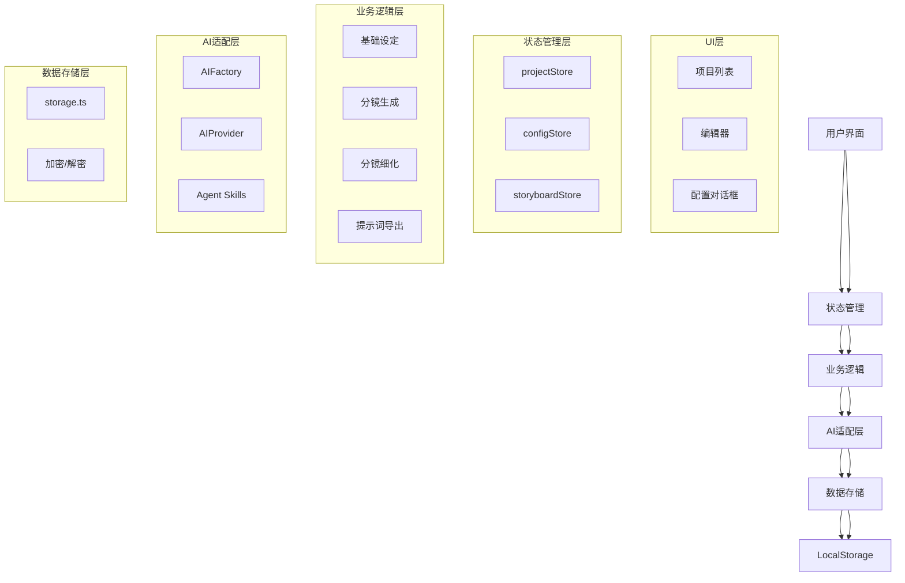

# 核心功能详解

<cite>
**本文档引用的文件**  
- [README.md](file://manga-creator/README.md)
- [App.tsx](file://manga-creator/src/App.tsx)
- [ProjectList.tsx](file://manga-creator/src/components/ProjectList.tsx)
- [Editor.tsx](file://manga-creator/src/components/Editor.tsx)
- [ConfigDialog.tsx](file://manga-creator/src/components/ConfigDialog.tsx)
- [BasicSettings.tsx](file://manga-creator/src/components/editor/BasicSettings.tsx)
- [SceneGeneration.tsx](file://manga-creator/src/components/editor/SceneGeneration.tsx)
- [SceneRefinement.tsx](file://manga-creator/src/components/editor/SceneRefinement.tsx)
- [PromptExport.tsx](file://manga-creator/src/components/editor/PromptExport.tsx)
- [projectStore.ts](file://manga-creator/src/stores/projectStore.ts)
- [configStore.ts](file://manga-creator/src/stores/configStore.ts)
- [storyboardStore.ts](file://manga-creator/src/stores/storyboardStore.ts)
- [storage.ts](file://manga-creator/src/lib/storage.ts)
- [factory.ts](file://manga-creator/src/lib/ai/factory.ts)
- [skills.ts](file://manga-creator/src/lib/ai/skills.ts)
- [types.ts](file://manga-creator/src/types/index.ts)
</cite>

## 目录
1. [项目管理工作台](#项目管理工作台)  
2. [API配置管理](#api配置管理)  
3. [基础设定模块](#基础设定模块)  
4. [分镜生成流程](#分镜生成流程)  
5. [分镜细化工作流](#分镜细化工作流)  
6. [提示词整合导出](#提示词整合导出)  
7. [系统架构与数据流](#系统架构与数据流)  

## 项目管理工作台

项目管理工作台是漫剧创作助手的入口，提供项目创建、打开、删除和列表展示功能。用户通过项目卡片界面管理所有创作项目，系统使用LocalStorage进行数据持久化存储。

工作台采用卡片式布局展示项目列表，每个项目卡片显示项目名称、创建时间、当前进度等信息。用户可以通过点击卡片打开项目进入编辑器，或通过右键菜单删除项目。新建项目时，系统会弹出对话框引导用户输入项目名称。

项目状态通过Zustand状态管理库进行集中管理，`projectStore`负责维护项目列表和当前项目状态。当用户创建新项目时，系统会生成唯一ID、记录创建时间，并初始化工作流状态为`DATA_COLLECTING`。项目数据以加密形式存储在浏览器的LocalStorage中，确保数据安全。

**图示来源**  
- [App.tsx](file://manga-creator/src/App.tsx#L12-L81)
- [ProjectList.tsx](file://manga-creator/src/components/ProjectList.tsx#L1-L196)
- [projectStore.ts](file://manga-creator/src/stores/projectStore.ts#L1-L95)

**本节来源**  
- [README.md](file://manga-creator/README.md#L13-L17)
- [ProjectList.tsx](file://manga-creator/src/components/ProjectList.tsx#L1-L196)

## API配置管理

API配置管理模块支持多AI供应商，包括DeepSeek、Kimi、Gemini和OpenAI兼容接口。用户可以在配置对话框中设置API密钥、选择供应商、配置基础URL和模型名称。

系统采用AES加密算法对API密钥进行加密存储，确保敏感信息的安全性。配置数据以加密形式保存在LocalStorage中，不会明文暴露。用户可以通过"测试连接"功能验证API配置的有效性，系统会向AI服务发送ping请求并返回结果。

配置管理使用`configStore`状态管理器，通过`AIFactory`工厂模式创建相应的AI客户端。当用户更改配置时，系统会更新状态并保存到存储中。配置对话框提供友好的用户界面，支持显示/隐藏API密钥、选择不同供应商的预设模型等。

**图示来源**  
- [ConfigDialog.tsx](file://manga-creator/src/components/ConfigDialog.tsx#L1-L197)
- [configStore.ts](file://manga-creator/src/stores/configStore.ts#L1-L58)
- [factory.ts](file://manga-creator/src/lib/ai/factory.ts#L1-L54)

**本节来源**  
- [README.md](file://manga-creator/README.md#L19-L23)
- [ConfigDialog.tsx](file://manga-creator/src/components/ConfigDialog.tsx#L1-L197)

## 基础设定模块

基础设定模块是创作流程的第一步，要求用户输入剧本梗概、选择视觉风格和描述主角特征。这些信息将作为"项目上下文"贯穿整个创作流程，确保生成内容的一致性。

模块包含三个核心输入字段：剧本梗概（50-300字）、画风选择（6种预设风格+自定义描述）和主角描述（20-150字）。系统提供实时字数统计和验证功能，只有当所有必填项满足要求时才能进入下一步。

用户选择画风后，系统会显示相应的风格描述作为参考。主角描述建议包含外貌特征、服装、性格等具体信息，以便AI生成连贯的视觉内容。所有输入数据会与项目关联存储，并在后续的分镜生成和细化过程中作为上下文引用。

**图示来源**  
- [BasicSettings.tsx](file://manga-creator/src/components/editor/BasicSettings.tsx#L1-L224)
- [types.ts](file://manga-creator/src/types/index.ts#L42-L55)

**本节来源**  
- [README.md](file://manga-creator/README.md#L31-L36)
- [BasicSettings.tsx](file://manga-creator/src/components/editor/BasicSettings.tsx#L1-L224)

## 分镜生成流程

分镜生成流程将剧本智能拆解为8-12个关键分镜节点，形成故事的视觉骨架。系统使用AI智能分析剧本梗概，提取关键情节节点，生成分镜概要列表。

生成过程基于`SceneListSkill`技能，该技能定义了分镜生成的提示词模板和上下文要求。AI模型接收项目上下文（包括故事梗概、视觉风格和主角特征），输出结构化的分镜列表。每个分镜包含一个简短的概要描述（10-20字），涵盖故事的起承转合。

用户可以对生成的分镜列表进行管理，包括增删改和手动排序。系统提供批量操作功能，如重新生成全部分镜或一键添加新分镜。分镜列表以可编辑的形式展示，用户可以调整分镜顺序或修改概要描述，确保叙事逻辑的连贯性。

**图示来源**  
- [Editor.tsx](file://manga-creator/src/components/Editor.tsx#L1-L172)
- [skills.ts](file://manga-creator/src/lib/ai/skills.ts#L7-L24)
- [storyboardStore.ts](file://manga-creator/src/stores/storyboardStore.ts#L1-L107)

**本节来源**  
- [README.md](file://manga-creator/README.md#L37-L41)
- [Editor.tsx](file://manga-creator/src/components/Editor.tsx#L1-L172)

## 分镜细化工作流

分镜细化工作流采用三阶段渐进生成模式，确保每个分镜的细节质量和连贯性。三个阶段分别是：场景描述生成、动作描述生成和镜头提示词生成。

在场景描述阶段，系统结合项目上下文和前一分镜的摘要，生成详细的场景环境描述，包括空间布局、光线氛围和关键元素。动作描述阶段则聚焦于角色的姿态、表情和与环境的互动。最后的镜头提示词阶段将前两阶段的内容整合，生成适合AI绘画的英文提示词。

工作流保持上下文连贯性，每个阶段都会自动引用前一分镜的信息，确保视觉叙事的连续性。用户可以单独重新生成某个阶段的内容，或一键生成全部分镜的所有阶段。系统通过工作流状态机管理生成进度，确保各阶段按正确顺序执行。

**图示来源**  
- [SceneRefinement.tsx](file://manga-creator/src/components/editor/SceneRefinement.tsx)
- [skills.ts](file://manga-creator/src/lib/ai/skills.ts#L26-L105)
- [types.ts](file://manga-creator/src/types/index.ts#L64-L76)

**本节来源**  
- [README.md](file://manga-creator/README.md#L43-L47)
- [skills.ts](file://manga-creator/src/lib/ai/skills.ts#L26-L132)

## 提示词整合导出

提示词整合导出功能支持多种格式导出，满足不同使用场景的需求。用户可以选择Markdown格式（包含完整项目信息）、JSON格式（便于程序化处理）或纯提示词格式（直接用于AI绘画）。

系统提供一键复制功能，将生成的提示词复制到剪贴板，方便用户快速粘贴到AI绘画工具中。同时支持批量下载功能，将整个项目的分镜提示词打包为压缩文件。导出前，系统会统计分镜完成度，提醒用户检查未完成的分镜。

导出内容包含完整的上下文信息，确保AI绘画时能保持视觉一致性。对于每个分镜，导出的提示词都包含主角特征、场景环境、动作姿态、构图建议等关键要素，并按照Stable Diffusion或Midjourney等工具的要求格式化。

**图示来源**  
- [PromptExport.tsx](file://manga-creator/src/components/editor/PromptExport.tsx)
- [storage.ts](file://manga-creator/src/lib/storage.ts#L183-L218)
- [types.ts](file://manga-creator/src/types/index.ts#L153-L158)

**本节来源**  
- [README.md](file://manga-creator/README.md#L49-L55)
- [PromptExport.tsx](file://manga-creator/src/components/editor/PromptExport.tsx)

## 系统架构与数据流

漫剧创作助手采用模块化架构，基于React 18和TypeScript构建，使用Zustand进行状态管理，Vite作为构建工具。系统架构分为UI组件层、业务逻辑层、AI适配层和数据存储层。

数据流从用户界面开始，通过事件触发状态更新，状态变化驱动UI重新渲染。项目数据通过Zustand store集中管理，包括`projectStore`（项目状态）、`configStore`（配置状态）和`storyboardStore`（分镜状态）。所有数据最终持久化存储在加密的LocalStorage中。

AI集成采用工厂模式，`AIFactory`根据用户配置创建相应的AI客户端。系统定义了多个Agent技能（Skill），每个技能对应特定的创作任务，如分镜生成、场景描述等。技能包含提示词模板、上下文要求和输出格式定义。

**图示来源**  
- [App.tsx](file://manga-creator/src/App.tsx#L1-L81)
- [projectStore.ts](file://manga-creator/src/stores/projectStore.ts#L1-L95)
- [configStore.ts](file://manga-creator/src/stores/configStore.ts#L1-L58)
- [storyboardStore.ts](file://manga-creator/src/stores/storyboardStore.ts#L1-L107)
- [storage.ts](file://manga-creator/src/lib/storage.ts#L1-L246)

**本节来源**  
- [README.md](file://manga-creator/README.md#L71-L128)
- [App.tsx](file://manga-creator/src/App.tsx#L1-L81)
- [types.ts](file://manga-creator/src/types/index.ts#L1-L190)