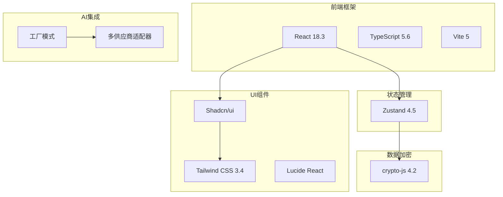
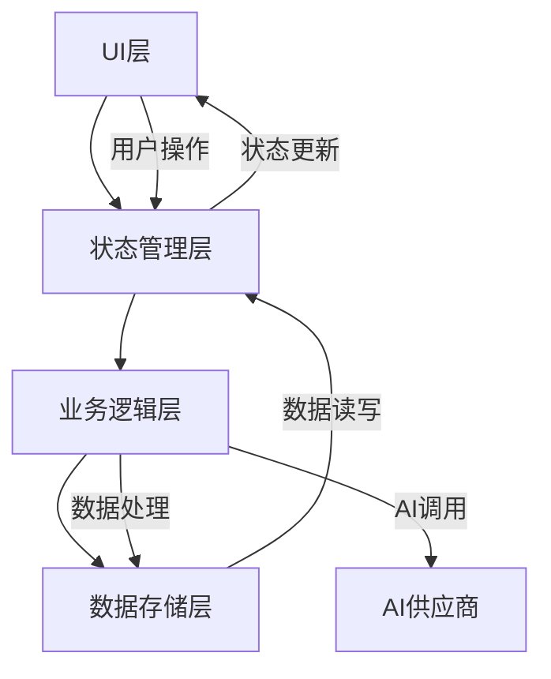
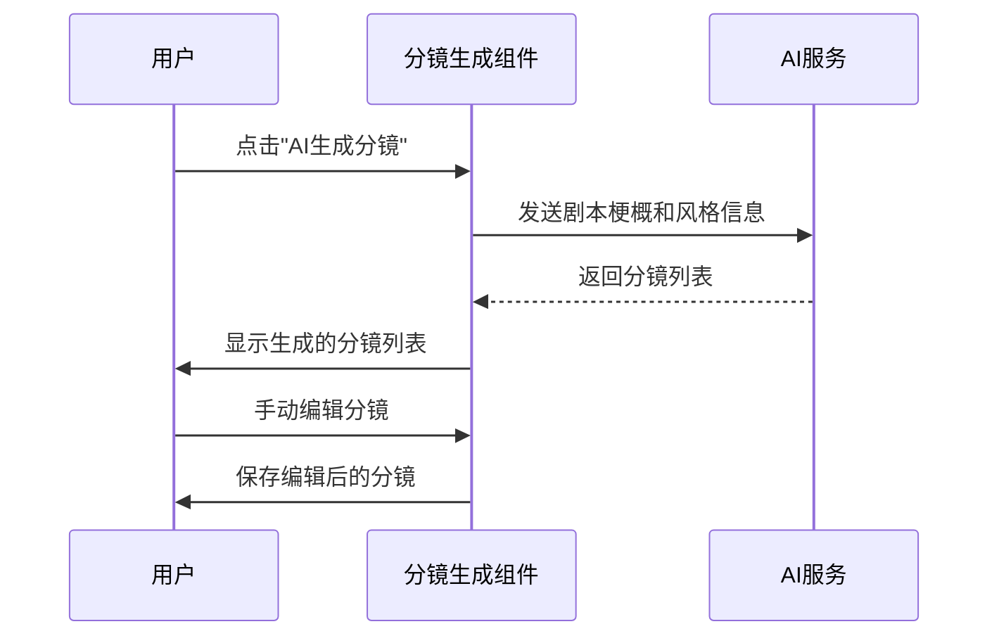
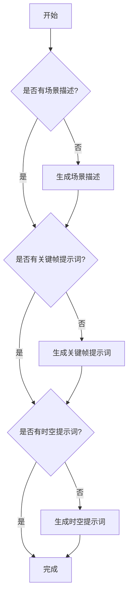
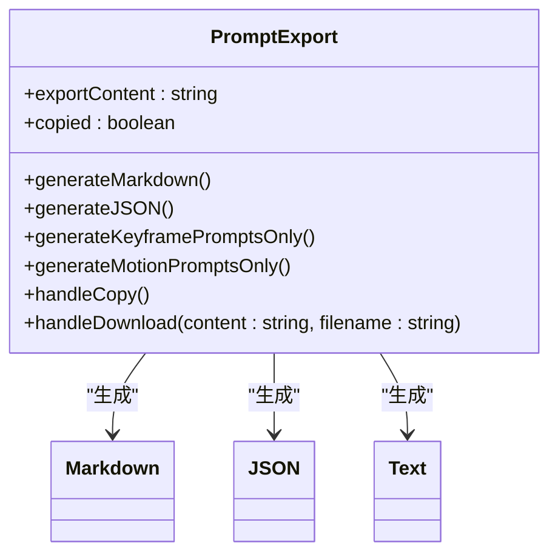
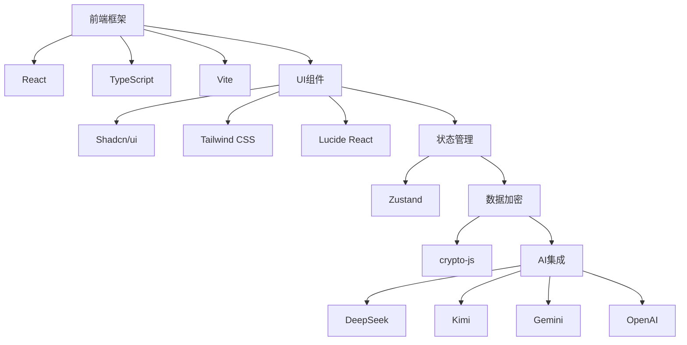

# 编辑器工作流工具

<cite>
**本文档引用文件**  
- [README.md](file://manga-creator/README.md)
- [package.json](file://manga-creator/package.json)
- [App.tsx](file://manga-creator/src/App.tsx)
- [main.tsx](file://manga-creator/src/main.tsx)
- [Editor.tsx](file://manga-creator/src/components/Editor.tsx)
- [BasicSettings.tsx](file://manga-creator/src/components/editor/BasicSettings.tsx)
- [SceneGeneration.tsx](file://manga-creator/src/components/editor/SceneGeneration.tsx)
- [SceneRefinement.tsx](file://manga-creator/src/components/editor/SceneRefinement.tsx)
- [PromptExport.tsx](file://manga-creator/src/components/editor/PromptExport.tsx)
- [factory.ts](file://manga-creator/src/lib/ai/factory.ts)
- [skills.ts](file://manga-creator/src/lib/ai/skills.ts)
- [projectStore.ts](file://manga-creator/src/stores/projectStore.ts)
- [storyboardStore.ts](file://manga-creator/src/stores/storyboardStore.ts)
- [index.ts](file://manga-creator/src/types/index.ts)
- [FEATURES.md](file://manga-creator/FEATURES.md)
</cite>

## 目录
1. [简介](#简介)
2. [项目结构](#项目结构)
3. [核心组件](#核心组件)
4. [架构概览](#架构概览)
5. [详细组件分析](#详细组件分析)
6. [依赖分析](#依赖分析)
7. [性能考量](#性能考量)
8. [故障排除指南](#故障排除指南)
9. [结论](#结论)

## 简介
漫剧创作助手是一款基于AIGC技术的智能提示词生成工具，旨在帮助创作者将剧本系统化地转化为结构化的分镜脚本和AI绘图提示词。该工具通过渐进式引导与智能上下文管理，确保整部作品的视觉一致性。项目已完成MVP功能开发，支持项目管理、API配置、数据架构、基础设定、分镜生成与细化、以及提示词导出等核心功能。

## 项目结构
项目采用模块化设计，主要分为前端框架、UI组件、状态管理、数据加密和AI集成等部分。前端使用React 18.3和TypeScript 5.6构建，通过Vite 5进行构建。UI组件基于Shadcn/ui和Tailwind CSS 3.4，提供现代化的用户界面。状态管理采用Zustand 4.5，确保应用状态的高效管理。数据加密使用crypto-js 4.2对API Key进行AES加密存储。AI集成部分采用工厂模式支持多供应商适配，包括DeepSeek、Kimi、Gemini和OpenAI兼容接口。



**图源**  
- [README.md](file://manga-creator/README.md#L71-L93)

**章节源**  
- [README.md](file://manga-creator/README.md#L71-L93)
- [package.json](file://manga-creator/package.json#L15-L48)

## 核心组件
编辑器工作流工具的核心组件包括项目管理、基础设定、分镜生成、分镜细化和提示词导出。这些组件通过Zustand状态管理器进行协调，确保数据的一致性和实时更新。项目管理组件负责项目的创建、打开和删除，基础设定组件收集剧本梗概、风格选择和主角描述，分镜生成组件将剧本拆解为8-12个分镜节点，分镜细化组件通过三阶段渐进生成场景描述、动作描述和镜头提示词，提示词导出组件支持Markdown、JSON和纯提示词格式的导出。

**章节源**  
- [README.md](file://manga-creator/README.md#L13-L55)
- [App.tsx](file://manga-creator/src/App.tsx#L1-L142)
- [Editor.tsx](file://manga-creator/src/components/Editor.tsx#L1-L315)

## 架构概览
整个应用的架构分为四个主要层次：UI层、状态管理层、业务逻辑层和数据存储层。UI层由React组件构成，负责用户交互和界面展示。状态管理层使用Zustand管理应用状态，包括项目状态、配置状态和分镜状态。业务逻辑层包含AI适配层和工具库，处理AI调用、上下文压缩和数据分片等复杂逻辑。数据存储层基于LocalStorage，通过加密和版本迁移确保数据安全和兼容性。



**图源**  
- [README.md](file://manga-creator/README.md#L94-L128)
- [FEATURES.md](file://manga-creator/FEATURES.md#L486-L512)

**章节源**  
- [README.md](file://manga-creator/README.md#L94-L128)
- [FEATURES.md](file://manga-creator/FEATURES.md#L486-L512)

## 详细组件分析
### 基础设定组件分析
基础设定组件是创作流程的起点，负责收集项目的基本信息。该组件通过表单收集剧本梗概、风格选择和主角描述，并实时验证输入的有效性。用户可以选择预设的画风或自定义调整各项参数，系统会根据选择生成完整的画风提示词。组件还支持复制完整提示词到剪贴板，方便用户在其他地方使用。

```mermaid
classDiagram
class BasicSettings {
+formData : {summary : string, protagonist : string}
+styleConfig : ArtStyleConfig
+activeTab : string
+copiedPrompt : boolean
+handlePresetChange(presetId : string)
+handleStyleFieldChange(field : string, value : string)
+handleCopyFullPrompt()
+handleSave()
+handleProceed()
}
class ArtStyleConfig {
+presetId : string
+baseStyle : string
+technique : string
+colorPalette : string
+culturalFeature : string
+fullPrompt : string
}
BasicSettings --> ArtStyleConfig : "使用"
```

**图源**  
- [BasicSettings.tsx](file://manga-creator/src/components/editor/BasicSettings.tsx#L1-L388)
- [index.ts](file://manga-creator/src/types/index.ts#L13-L26)

**章节源**  
- [BasicSettings.tsx](file://manga-creator/src/components/editor/BasicSettings.tsx#L1-L388)
- [index.ts](file://manga-creator/src/types/index.ts#L13-L26)

### 分镜生成组件分析
分镜生成组件负责将剧本梗概拆解为8-12个关键分镜节点。用户可以手动添加或删除分镜，也可以通过AI生成分镜列表。组件支持拖拽排序，确保分镜顺序符合创作意图。生成的分镜列表可以随时编辑和调整，确保内容的准确性和完整性。



**图源**  
- [SceneGeneration.tsx](file://manga-creator/src/components/editor/SceneGeneration.tsx#L1-L465)

**章节源**  
- [SceneGeneration.tsx](file://manga-creator/src/components/editor/SceneGeneration.tsx#L1-L465)

### 分镜细化组件分析
分镜细化组件通过三阶段渐进生成，确保每个分镜的细节丰富且连贯。第一阶段生成场景描述，第二阶段生成关键帧提示词，第三阶段生成时空提示词。每个阶段都可以手动编辑和优化，确保最终输出的提示词质量。



**图源**  
- [SceneRefinement.tsx](file://manga-creator/src/components/editor/SceneRefinement.tsx#L1-L800)

**章节源**  
- [SceneRefinement.tsx](file://manga-creator/src/components/editor/SceneRefinement.tsx#L1-L800)

### 提示词导出组件分析
提示词导出组件支持多种格式的导出，包括Markdown、JSON和纯提示词。用户可以一键复制到剪贴板或批量下载。导出的内容包含完整的项目信息和分镜细节，确保用户可以在其他工具中继续使用。



**图源**  
- [PromptExport.tsx](file://manga-creator/src/components/editor/PromptExport.tsx#L1-L428)

**章节源**  
- [PromptExport.tsx](file://manga-creator/src/components/editor/PromptExport.tsx#L1-L428)

## 依赖分析
项目依赖主要分为前端框架、UI组件、状态管理、数据加密和AI集成五类。前端框架依赖React、TypeScript和Vite，UI组件依赖Shadcn/ui、Tailwind CSS和Lucide React，状态管理依赖Zustand，数据加密依赖crypto-js，AI集成依赖多供应商适配器。这些依赖通过package.json进行管理，确保版本兼容性和安全性。



**图源**  
- [package.json](file://manga-creator/package.json#L15-L48)

**章节源**  
- [package.json](file://manga-creator/package.json#L15-L48)
- [README.md](file://manga-creator/README.md#L71-L93)

## 性能考量
项目在性能方面进行了多项优化，包括上下文压缩、数据分片、懒加载、防抖/节流和虚拟滚动。上下文压缩减少AI调用的Token消耗，数据分片突破LocalStorage 5MB限制，懒加载按需加载模块和组件，防抖/节流优化输入和滚动事件，虚拟滚动优化长列表性能。这些优化确保应用在处理大型项目时依然流畅。

**章节源**  
- [FEATURES.md](file://manga-creator/FEATURES.md#L678-L696)

## 故障排除指南
常见问题包括API连接失败、分镜生成失败和数据同步问题。对于API连接失败，检查API Key是否正确，网络连接是否正常。对于分镜生成失败，检查输入内容是否符合要求，如剧本梗概长度是否在50-300字之间。对于数据同步问题，尝试清除浏览器缓存或重新导入项目。

**章节源**  
- [README.md](file://manga-creator/README.md#L164-L168)
- [FEATURES.md](file://manga-creator/FEATURES.md#L698-L704)

## 结论
漫剧创作助手通过智能化的创作引导和高效的AI集成，为创作者提供了一套完整的分镜生成和提示词导出解决方案。项目架构清晰，组件职责明确，依赖管理规范，性能优化到位，能够有效提升创作效率和作品质量。未来计划增加团队协作、云端同步和移动端支持等功能，进一步扩展应用的适用场景。