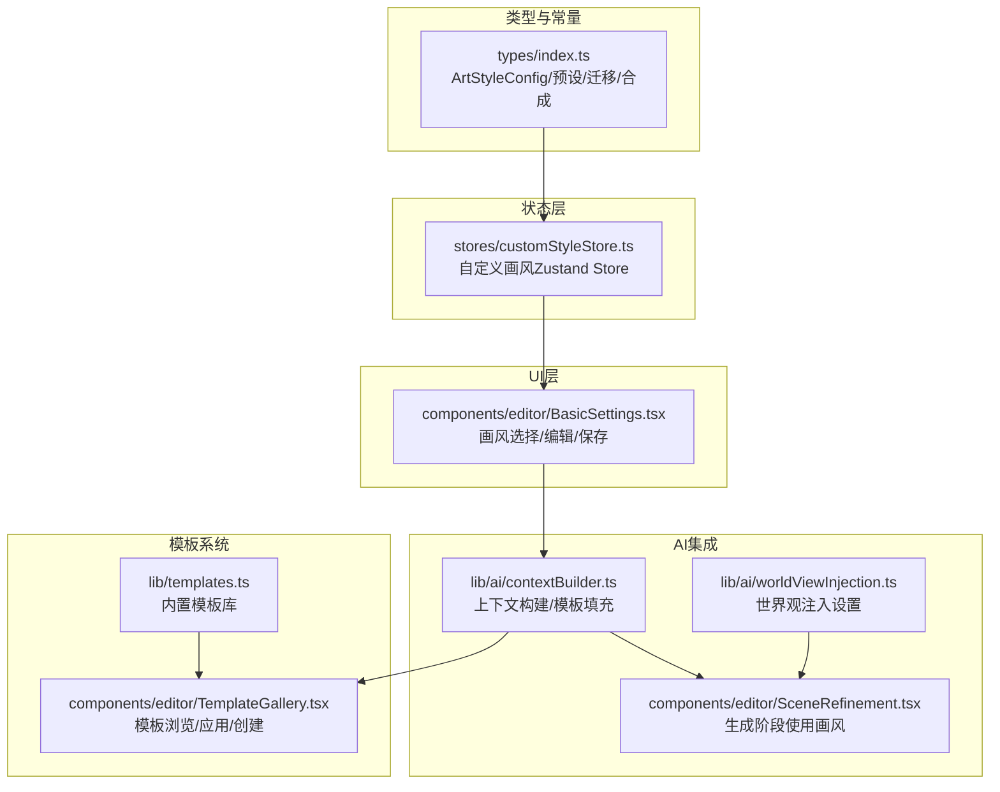
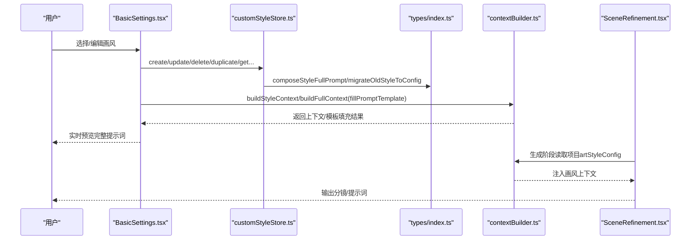
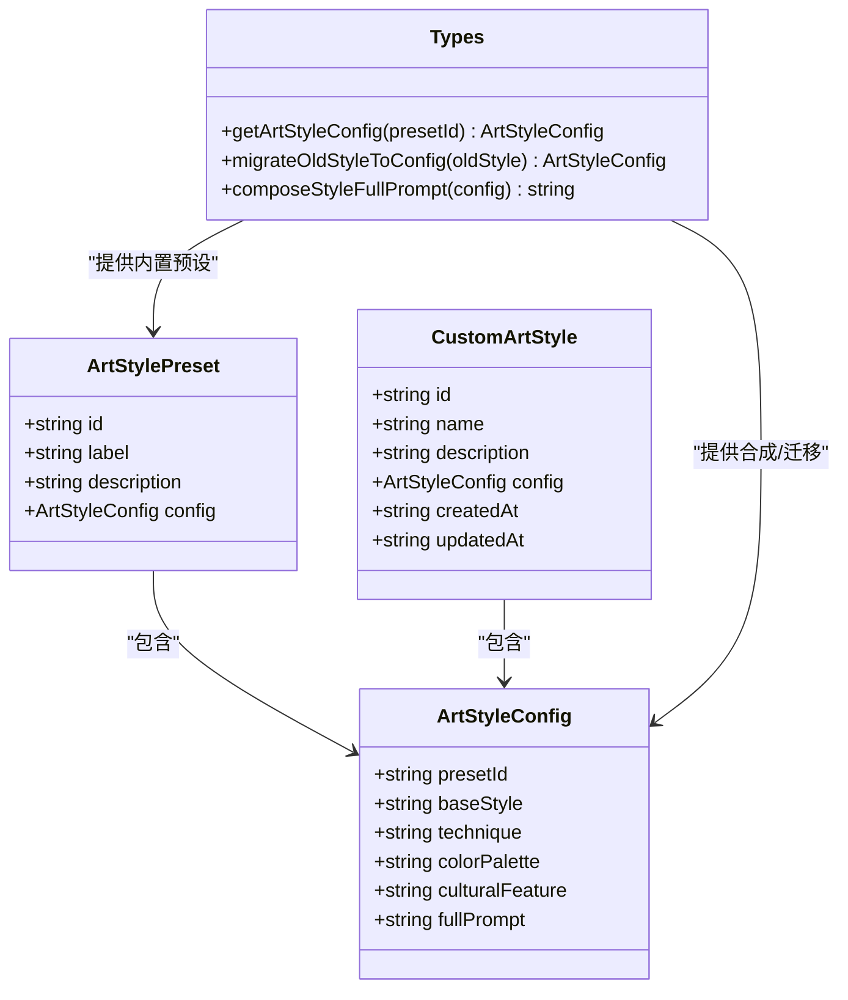
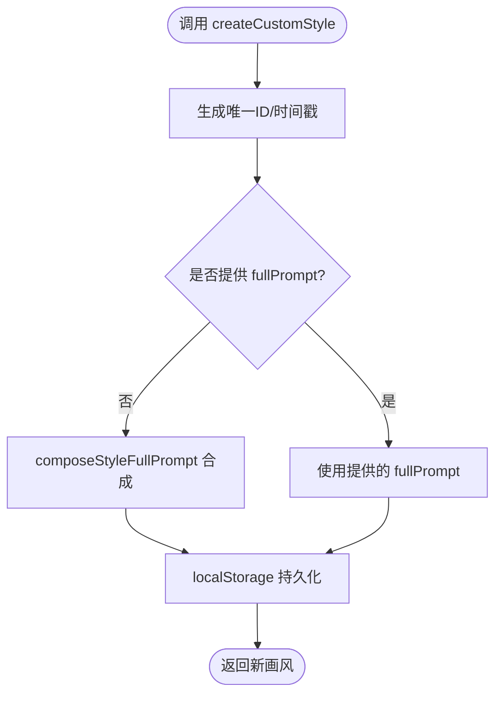
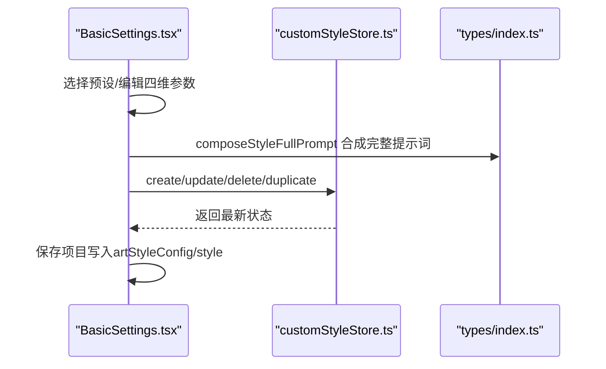
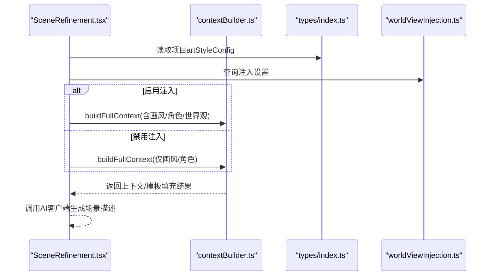
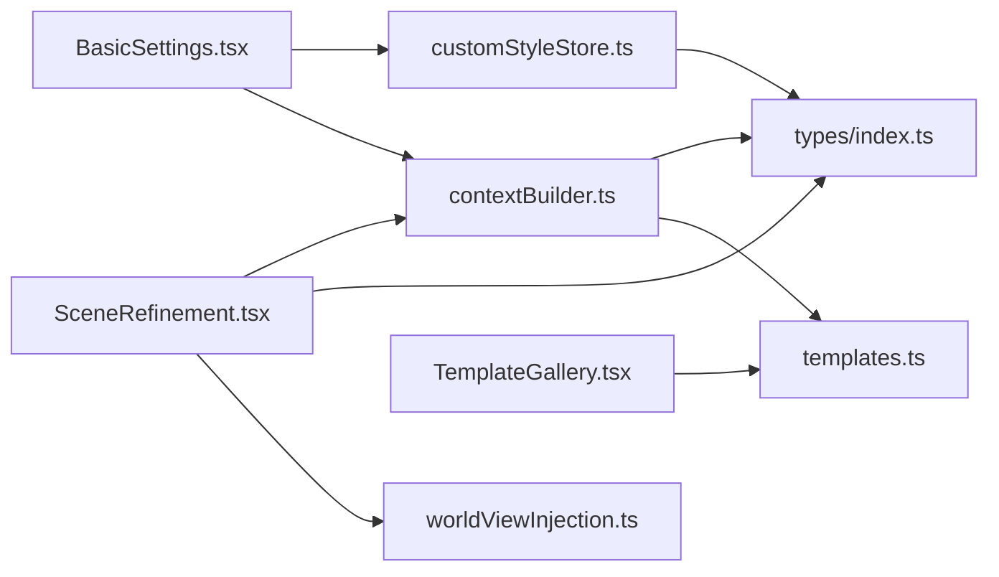

# 自定义艺术风格管理

<cite>
**本文引用的文件**
- [customStyleStore.ts](file://manga-creator/src/stores/customStyleStore.ts)
- [types/index.ts](file://manga-creator/src/types/index.ts)
- [BasicSettings.tsx](file://manga-creator/src/components/editor/BasicSettings.tsx)
- [contextBuilder.ts](file://manga-creator/src/lib/ai/contextBuilder.ts)
- [worldViewInjection.ts](file://manga-creator/src/lib/ai/worldViewInjection.ts)
- [SceneRefinement.tsx](file://manga-creator/src/components/editor/SceneRefinement.tsx)
- [templates.ts](file://manga-creator/src/lib/templates.ts)
- [TemplateGallery.tsx](file://manga-creator/src/components/editor/TemplateGallery.tsx)
- [customStyleStore.test.ts](file://manga-creator/src/stores/customStyleStore.test.ts)
</cite>

## 目录
1. [简介](#简介)
2. [项目结构](#项目结构)
3. [核心组件](#核心组件)
4. [架构总览](#架构总览)
5. [详细组件分析](#详细组件分析)
6. [依赖分析](#依赖分析)
7. [性能考虑](#性能考虑)
8. [故障排查指南](#故障排查指南)
9. [结论](#结论)
10. [附录](#附录)

## 简介
本文件系统性梳理“自定义艺术风格管理”的实现与使用路径，涵盖画风配置模型、本地存储、UI交互、与AI生成流程的集成方式，以及模板系统的协同机制。目标读者既包括开发者也包括需要理解工作流的使用者。

## 项目结构
围绕“自定义艺术风格管理”，主要涉及以下层次：
- 类型与常量层：定义画风配置结构、内置预设、迁移与合成逻辑
- 状态层：自定义画风的本地持久化与Zustand Store
- UI层：基础设定面板中的画风选择、编辑、保存、删除
- AI集成层：上下文构建、提示词模板填充、生成阶段注入
- 模板系统：提示词模板库与画风提示词的协同

图表来源
- [types/index.ts](file://manga-creator/src/types/index.ts#L1-L230)
- [customStyleStore.ts](file://manga-creator/src/stores/customStyleStore.ts#L48-L230)
- [BasicSettings.tsx](file://manga-creator/src/components/editor/BasicSettings.tsx#L27-L245)
- [contextBuilder.ts](file://manga-creator/src/lib/ai/contextBuilder.ts#L1-L312)
- [worldViewInjection.ts](file://manga-creator/src/lib/ai/worldViewInjection.ts#L1-L181)
- [SceneRefinement.tsx](file://manga-creator/src/components/editor/SceneRefinement.tsx#L114-L152)
- [templates.ts](file://manga-creator/src/lib/templates.ts#L1-L313)
- [TemplateGallery.tsx](file://manga-creator/src/components/editor/TemplateGallery.tsx#L1-L482)

章节来源
- [types/index.ts](file://manga-creator/src/types/index.ts#L1-L230)
- [customStyleStore.ts](file://manga-creator/src/stores/customStyleStore.ts#L48-L230)
- [BasicSettings.tsx](file://manga-creator/src/components/editor/BasicSettings.tsx#L27-L245)
- [contextBuilder.ts](file://manga-creator/src/lib/ai/contextBuilder.ts#L1-L312)
- [worldViewInjection.ts](file://manga-creator/src/lib/ai/worldViewInjection.ts#L1-L181)
- [SceneRefinement.tsx](file://manga-creator/src/components/editor/SceneRefinement.tsx#L114-L152)
- [templates.ts](file://manga-creator/src/lib/templates.ts#L1-L313)
- [TemplateGallery.tsx](file://manga-creator/src/components/editor/TemplateGallery.tsx#L1-L482)

## 核心组件
- 画风配置模型与内置预设
  - 定义四维画风配置：整体风格、渲染技法、色彩倾向、文化/时代特征，并提供合成完整提示词的能力
  - 内置8个预设，覆盖动漫、水墨、漫画、赛博朋克、写实电影风、奇幻史诗、吉卜力水彩、像素复古等
  - 提供从旧版字符串样式迁移到新版配置的映射
- 自定义画风Store
  - 以LocalStorage为持久化介质，提供创建、更新、删除、复制、查询、从配置创建等能力
  - 自动维护createdAt/updatedAt，缺失fullPrompt时自动合成
  - 提供getAllAvailableStyles与getStyleConfigById工具函数，统一内置与自定义画风访问
- 基础设定面板
  - 支持选择内置预设或自定义画风；支持直接编辑四维参数并实时预览完整提示词
  - 提供保存为自定义画风、编辑、删除等操作入口
- AI上下文与生成集成
  - 上下文构建器将画风完整提示词注入到不同阶段的提示词模板中
  - 生成阶段（如场景描述、关键帧提示词、时空提示词）读取项目画风配置，结合角色、世界观等上下文
  - 世界观注入设置支持在分镜列表生成与场景描述生成两个时机进行控制

章节来源
- [types/index.ts](file://manga-creator/src/types/index.ts#L1-L230)
- [customStyleStore.ts](file://manga-creator/src/stores/customStyleStore.ts#L48-L230)
- [BasicSettings.tsx](file://manga-creator/src/components/editor/BasicSettings.tsx#L27-L245)
- [contextBuilder.ts](file://manga-creator/src/lib/ai/contextBuilder.ts#L1-L312)
- [worldViewInjection.ts](file://manga-creator/src/lib/ai/worldViewInjection.ts#L1-L181)
- [SceneRefinement.tsx](file://manga-creator/src/components/editor/SceneRefinement.tsx#L114-L152)

## 架构总览
自定义艺术风格管理贯穿“配置—存储—UI—AI”的闭环：
- 配置层：ArtStyleConfig与内置预设
- 存储层：Zustand + LocalStorage
- UI层：BasicSettings提供画风选择与编辑体验
- AI层：上下文构建器与生成阶段集成，保证画风一致性

图表来源
- [BasicSettings.tsx](file://manga-creator/src/components/editor/BasicSettings.tsx#L27-L245)
- [customStyleStore.ts](file://manga-creator/src/stores/customStyleStore.ts#L48-L230)
- [types/index.ts](file://manga-creator/src/types/index.ts#L159-L230)
- [contextBuilder.ts](file://manga-creator/src/lib/ai/contextBuilder.ts#L1-L312)
- [SceneRefinement.tsx](file://manga-creator/src/components/editor/SceneRefinement.tsx#L114-L152)

## 详细组件分析

### 画风配置模型与内置预设
- 四维配置字段：baseStyle、technique、colorPalette、culturalFeature
- 内置预设：包含8个常用风格，每个预设提供完整fullPrompt，便于直接注入
- 迁移逻辑：将旧版style字符串映射到新版预设ID，若无法映射则回退到默认预设
- 合成逻辑：composeStyleFullPrompt将四维字段拼接为英文提示词，供绘图AI使用

图表来源
- [types/index.ts](file://manga-creator/src/types/index.ts#L1-L230)

章节来源
- [types/index.ts](file://manga-creator/src/types/index.ts#L1-L230)

### 自定义画风Store（Zustand）
- 数据结构：customStyles数组 + isLoaded标志
- 核心能力：
  - loadCustomStyles：从LocalStorage加载
  - createCustomStyle：创建并持久化，自动生成fullPrompt
  - updateCustomStyle：更新并自动重算fullPrompt
  - deleteCustomStyle：删除
  - duplicateCustomStyle：复制一份新画风
  - getCustomStyleById / getArtStyleConfigById：按ID查询
  - createFromConfig：从已有配置创建自定义画风
  - getAllAvailableStyles / getStyleConfigById：统一访问内置与自定义
- 持久化：LocalStorage键名为固定常量，异常时静默处理

图表来源
- [customStyleStore.ts](file://manga-creator/src/stores/customStyleStore.ts#L73-L120)

章节来源
- [customStyleStore.ts](file://manga-creator/src/stores/customStyleStore.ts#L48-L230)
- [customStyleStore.test.ts](file://manga-creator/src/stores/customStyleStore.test.ts#L68-L182)

### 基础设定面板（画风选择与编辑）
- 画风选择：内置预设 + 我的自定义画风 + 当前临时自定义（未保存）
- 编辑体验：逐维编辑baseStyle/technique/colorPalette/culturalFeature，实时合成fullPrompt预览
- 操作入口：保存为自定义画风、编辑、删除、复制、一键生成全部（与生成流程联动）
- 保存项目：同时写入style（兼容）与artStyleConfig（新版）

图表来源
- [BasicSettings.tsx](file://manga-creator/src/components/editor/BasicSettings.tsx#L27-L245)
- [customStyleStore.ts](file://manga-creator/src/stores/customStyleStore.ts#L73-L184)
- [types/index.ts](file://manga-creator/src/types/index.ts#L218-L230)

章节来源
- [BasicSettings.tsx](file://manga-creator/src/components/editor/BasicSettings.tsx#L27-L245)

### AI上下文构建与生成阶段集成
- 上下文构建：
  - buildStyleContext：优先使用ArtStyleConfig.fullPrompt，否则按四维字段拼接
  - buildFullContext：整合画风、角色、世界观三类上下文
  - fillPromptTemplate：将模板中的占位符替换为上下文内容
- 生成阶段：
  - SceneRefinement在生成场景描述时读取项目artStyleConfig，构建完整上下文
  - worldViewInjection提供注入时机开关，支持在分镜列表生成与场景描述生成两个阶段注入

图表来源
- [SceneRefinement.tsx](file://manga-creator/src/components/editor/SceneRefinement.tsx#L114-L152)
- [contextBuilder.ts](file://manga-creator/src/lib/ai/contextBuilder.ts#L1-L312)
- [worldViewInjection.ts](file://manga-creator/src/lib/ai/worldViewInjection.ts#L1-L181)

章节来源
- [contextBuilder.ts](file://manga-creator/src/lib/ai/contextBuilder.ts#L1-L312)
- [worldViewInjection.ts](file://manga-creator/src/lib/ai/worldViewInjection.ts#L1-L181)
- [SceneRefinement.tsx](file://manga-creator/src/components/editor/SceneRefinement.tsx#L114-L152)

### 模板系统与画风提示词协同
- 内置模板库：包含场景描述、动作描述、镜头提示词、风格化等模板，支持变量替换
- 模板库组件：TemplateGallery提供模板浏览、搜索、分类、变量填充、创建自定义模板
- 与画风的协同：模板中可引用{styleFullPrompt}等占位符，由上下文构建器注入完整画风提示词

章节来源
- [templates.ts](file://manga-creator/src/lib/templates.ts#L1-L313)
- [TemplateGallery.tsx](file://manga-creator/src/components/editor/TemplateGallery.tsx#L1-L482)
- [contextBuilder.ts](file://manga-creator/src/lib/ai/contextBuilder.ts#L206-L261)

## 依赖分析
- 组件耦合
  - BasicSettings依赖customStyleStore与types，负责UI交互与状态变更
  - customStyleStore依赖types的合成与迁移函数，依赖LocalStorage
  - contextBuilder依赖types的ArtStyleConfig，为生成阶段提供上下文
  - SceneRefinement依赖contextBuilder与types，读取项目画风配置
  - worldViewInjection独立于画风，但与生成阶段配合决定注入时机
- 外部依赖
  - LocalStorage：自定义画风持久化
  - 浏览器剪贴板：复制完整提示词
  - AI客户端：由SceneRefinement调用（外部实现）

图表来源
- [BasicSettings.tsx](file://manga-creator/src/components/editor/BasicSettings.tsx#L27-L245)
- [customStyleStore.ts](file://manga-creator/src/stores/customStyleStore.ts#L48-L230)
- [types/index.ts](file://manga-creator/src/types/index.ts#L1-L230)
- [contextBuilder.ts](file://manga-creator/src/lib/ai/contextBuilder.ts#L1-L312)
- [SceneRefinement.tsx](file://manga-creator/src/components/editor/SceneRefinement.tsx#L114-L152)
- [worldViewInjection.ts](file://manga-creator/src/lib/ai/worldViewInjection.ts#L1-L181)
- [TemplateGallery.tsx](file://manga-creator/src/components/editor/TemplateGallery.tsx#L1-L482)
- [templates.ts](file://manga-creator/src/lib/templates.ts#L1-L313)

## 性能考虑
- Store读写
  - 自定义画风列表较小，Zustand状态更新与LocalStorage写入均为O(n)遍历，性能可接受
  - 建议避免频繁触发updateCustomStyle导致的fullPrompt重算，可在UI层合并多次编辑后再提交
- 上下文构建
  - buildStyleContext与buildFullContext均为线性扫描，复杂度与上下文长度成正比
  - 可在UI层缓存最近一次合成的fullPrompt，减少重复计算
- 生成阶段
  - 生成流程会多次调用AI客户端，注意控制并发与重试策略，避免资源浪费

## 故障排查指南
- 自定义画风未显示
  - 检查LocalStorage键值是否存在，确认loadCustomStyles是否执行
  - 确认store.isLoaded为true，UI侧是否正确渲染“我的自定义画风”列表
- 更新画风后未生效
  - 确认updateCustomStyle是否传入config.fullPrompt为空，若为空将触发重算
  - 确认BasicSettings当前presetId是否仍指向该自定义ID
- 生成失败或提示词不一致
  - 检查SceneRefinement是否正确读取项目artStyleConfig
  - 检查worldViewInjection设置是否启用了注入，以及注入时机是否符合预期
- 模板变量未替换
  - 确认fillPromptTemplate中占位符是否与模板一致，如{styleFullPrompt}

章节来源
- [customStyleStore.ts](file://manga-creator/src/stores/customStyleStore.ts#L73-L184)
- [BasicSettings.tsx](file://manga-creator/src/components/editor/BasicSettings.tsx#L27-L245)
- [contextBuilder.ts](file://manga-creator/src/lib/ai/contextBuilder.ts#L206-L261)
- [SceneRefinement.tsx](file://manga-creator/src/components/editor/SceneRefinement.tsx#L114-L152)
- [worldViewInjection.ts](file://manga-creator/src/lib/ai/worldViewInjection.ts#L1-L181)

## 结论
自定义艺术风格管理通过“四维配置 + 内置预设 + 自定义画风 + 上下文构建 + 生成阶段注入”的完整链路，实现了高度可控且可复用的画风体系。UI层提供直观的编辑体验，Store层保障持久化与一致性，AI层确保生成过程中的风格一致性。模板系统进一步增强了提示词的复用与扩展能力。

## 附录
- 最佳实践
  - 在编辑画风时先预览完整提示词，确认无误再保存为自定义画风
  - 对于复杂项目，建议开启世界观注入，并在分镜列表生成与场景描述生成两个阶段均注入
  - 使用模板库时，优先采用支持变量的模板，减少重复劳动
- 常见问题
  - 旧版style字符串会自动迁移至新版配置，无需手动处理
  - 若删除当前使用的自定义画风，系统会自动切换到默认预设