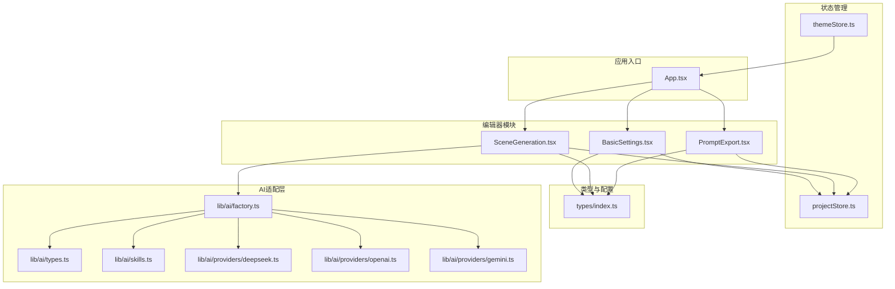
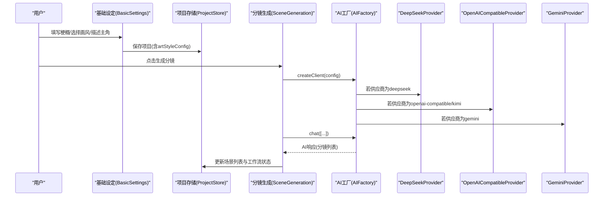
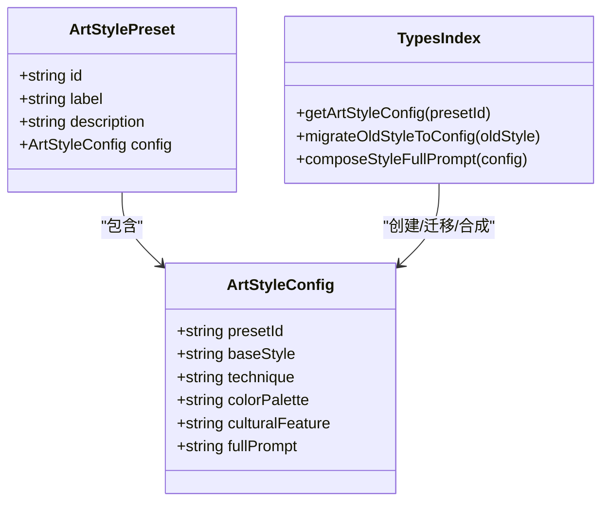
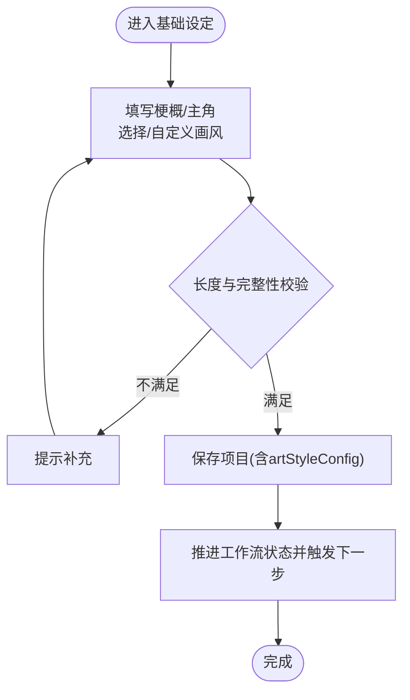
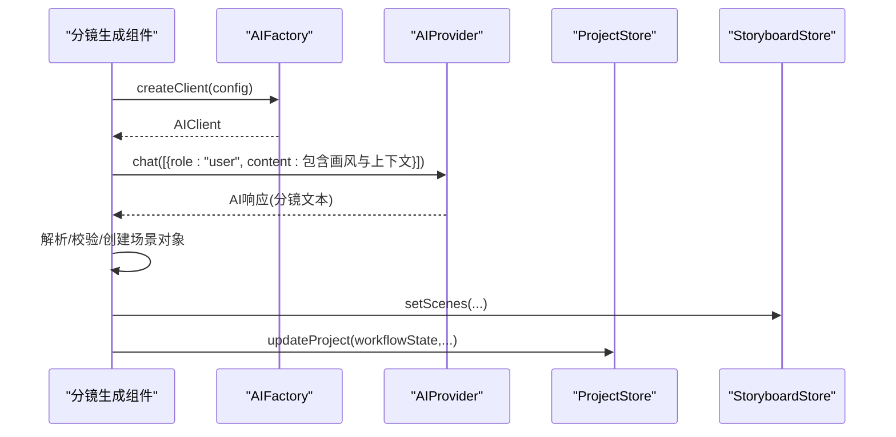
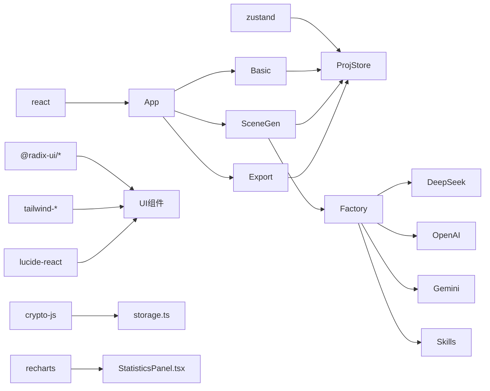

# 艺术风格系统

<cite>
**本文引用的文件**
- [README.md](file://manga-creator/README.md)
- [package.json](file://manga-creator/package.json)
- [App.tsx](file://manga-creator/src/App.tsx)
- [BasicSettings.tsx](file://manga-creator/src/components/editor/BasicSettings.tsx)
- [SceneGeneration.tsx](file://manga-creator/src/components/editor/SceneGeneration.tsx)
- [PromptExport.tsx](file://manga-creator/src/components/editor/PromptExport.tsx)
- [themeStore.ts](file://manga-creator/src/stores/themeStore.ts)
- [projectStore.ts](file://manga-creator/src/stores/projectStore.ts)
- [index.ts](file://manga-creator/src/types/index.ts)
- [factory.ts](file://manga-creator/src/lib/ai/factory.ts)
- [types.ts](file://manga-creator/src/lib/ai/types.ts)
- [skills.ts](file://manga-creator/src/lib/ai/skills.ts)
- [deepseek.ts](file://manga-creator/src/lib/ai/providers/deepseek.ts)
- [openai.ts](file://manga-creator/src/lib/ai/providers/openai.ts)
- [gemini.ts](file://manga-creator/src/lib/ai/providers/gemini.ts)
- [button.tsx](file://manga-creator/src/components/ui/button.tsx)
- [utils.ts](file://manga-creator/src/lib/utils.ts)
</cite>

## 目录
1. [简介](#简介)
2. [项目结构](#项目结构)
3. [核心组件](#核心组件)
4. [架构总览](#架构总览)
5. [详细组件分析](#详细组件分析)
6. [依赖分析](#依赖分析)
7. [性能考虑](#性能考虑)
8. [故障排查指南](#故障排查指南)
9. [结论](#结论)
10. [附录](#附录)

## 简介
本系统围绕“艺术风格”这一核心主题，提供一套完整的画风配置、预设与迁移机制，并贯穿到项目工作流的多个环节：基础设定、分镜生成、提示词细化与导出。系统通过统一的画风配置结构与技能化提示词模板，确保整部作品的视觉一致性与可复用性；同时支持多AI供应商适配，便于用户在不同平台间切换。

## 项目结构
- 前端采用 React 18 + TypeScript + Vite，UI 使用 Shadcn/ui + Tailwind CSS。
- 状态管理使用 Zustand，数据持久化结合本地存储与加密。
- AI集成采用工厂模式与适配器模式，支持 DeepSeek、OpenAI 兼容、Gemini 等多家供应商。
- 艺术风格系统位于 types、components/editor、stores、lib/ai 等目录中，形成从类型定义到组件使用的闭环。

图表来源
- [App.tsx](file://manga-creator/src/App.tsx#L1-L142)
- [BasicSettings.tsx](file://manga-creator/src/components/editor/BasicSettings.tsx#L1-L388)
- [SceneGeneration.tsx](file://manga-creator/src/components/editor/SceneGeneration.tsx#L1-L465)
- [PromptExport.tsx](file://manga-creator/src/components/editor/PromptExport.tsx#L1-L120)
- [projectStore.ts](file://manga-creator/src/stores/projectStore.ts#L1-L124)
- [themeStore.ts](file://manga-creator/src/stores/themeStore.ts#L1-L57)
- [index.ts](file://manga-creator/src/types/index.ts#L1-L200)
- [factory.ts](file://manga-creator/src/lib/ai/factory.ts#L1-L54)
- [types.ts](file://manga-creator/src/lib/ai/types.ts#L1-L15)
- [skills.ts](file://manga-creator/src/lib/ai/skills.ts#L1-L147)
- [deepseek.ts](file://manga-creator/src/lib/ai/providers/deepseek.ts#L1-L110)
- [openai.ts](file://manga-creator/src/lib/ai/providers/openai.ts#L1-L88)
- [gemini.ts](file://manga-creator/src/lib/ai/providers/gemini.ts#L1-L138)

章节来源
- [README.md](file://manga-creator/README.md#L94-L128)
- [package.json](file://manga-creator/package.json#L1-L79)

## 核心组件
- 画风配置类型与预设：定义了四维画风配置与8个官方预设，并提供从旧版字符串到新版配置的迁移能力。
- 基础设定组件：负责收集剧本梗概、选择/自定义画风、描述主角，并将项目状态推进到数据收集完成。
- 分镜生成组件：基于项目画风与上下文，调用AI生成分镜列表，并支持重新生成、手动添加与确认。
- 提示词导出组件：整合项目画风与分镜内容，输出多种格式的提示词。
- 主题存储与切换：提供浅色/深色/系统三种主题模式，持久化到本地并监听系统偏好。
- 项目状态存储：负责项目列表、当前项目、创建/更新/删除与画风迁移逻辑。
- AI工厂与适配器：按供应商类型创建适配器，统一对话接口与流式接口；技能系统提供可复用的提示词模板。

章节来源
- [index.ts](file://manga-creator/src/types/index.ts#L1-L200)
- [BasicSettings.tsx](file://manga-creator/src/components/editor/BasicSettings.tsx#L1-L388)
- [SceneGeneration.tsx](file://manga-creator/src/components/editor/SceneGeneration.tsx#L1-L465)
- [PromptExport.tsx](file://manga-creator/src/components/editor/PromptExport.tsx#L1-L120)
- [themeStore.ts](file://manga-creator/src/stores/themeStore.ts#L1-L57)
- [projectStore.ts](file://manga-creator/src/stores/projectStore.ts#L1-L124)
- [factory.ts](file://manga-creator/src/lib/ai/factory.ts#L1-L54)
- [skills.ts](file://manga-creator/src/lib/ai/skills.ts#L1-L147)

## 架构总览
系统围绕“项目-画风-提示词”的主线展开：
- 项目层面：项目实体包含画风配置字段，支持从旧版迁移；工作流状态贯穿基础设定、分镜生成、细化与导出。
- 画风层面：四维配置 + 预设 + 迁移 + 合成完整提示词，确保跨组件一致使用。
- AI层面：工厂创建适配器，适配不同供应商的请求/响应格式与流式协议；技能系统提供标准化提示词模板。
- UI层面：基础设定、分镜生成、提示词导出三大编辑器页面，配合主题与状态管理，形成完整的创作工作流。

图表来源
- [BasicSettings.tsx](file://manga-creator/src/components/editor/BasicSettings.tsx#L1-L388)
- [projectStore.ts](file://manga-creator/src/stores/projectStore.ts#L1-L124)
- [SceneGeneration.tsx](file://manga-creator/src/components/editor/SceneGeneration.tsx#L1-L465)
- [factory.ts](file://manga-creator/src/lib/ai/factory.ts#L1-L54)
- [deepseek.ts](file://manga-creator/src/lib/ai/providers/deepseek.ts#L1-L110)
- [openai.ts](file://manga-creator/src/lib/ai/providers/openai.ts#L1-L88)
- [gemini.ts](file://manga-creator/src/lib/ai/providers/gemini.ts#L1-L138)

## 详细组件分析

### 画风配置与预设体系
- 四维配置：整体风格、渲染技法、色彩倾向、文化/时代特征，支持合成完整英文提示词。
- 预设集合：内置8个官方预设，覆盖动漫、水墨、漫画、赛博朋克、写实电影、奇幻史诗、吉卜力水彩、像素复古。
- 迁移策略：从旧版 style 字符串映射到新版配置，若无法映射则回退到默认日式赛璐珞风格。
- 组件使用：基础设定页面提供预设选择与逐项微调，实时合成完整提示词并支持复制。

图表来源
- [index.ts](file://manga-creator/src/types/index.ts#L1-L200)

章节来源
- [index.ts](file://manga-creator/src/types/index.ts#L1-L200)
- [BasicSettings.tsx](file://manga-creator/src/components/editor/BasicSettings.tsx#L1-L388)

### 基础设定工作流
- 输入校验：剧本梗概长度、画风完整提示词、主角描述长度均进行校验。
- 画风选择：支持预设选择与自定义微调，自定义后会标记为 custom 并重新合成 fullPrompt。
- 状态推进：保存后将工作流状态推进到数据收集完成，并触发下一步事件。

图表来源
- [BasicSettings.tsx](file://manga-creator/src/components/editor/BasicSettings.tsx#L1-L388)
- [projectStore.ts](file://manga-creator/src/stores/projectStore.ts#L1-L124)

章节来源
- [BasicSettings.tsx](file://manga-creator/src/components/editor/BasicSettings.tsx#L1-L388)
- [projectStore.ts](file://manga-creator/src/stores/projectStore.ts#L1-L124)

### 分镜生成工作流
- 条件判断：仅当项目处于数据收集完成/分镜列表编辑/确认/处理等状态时允许生成。
- 画风注入：从项目中读取完整画风提示词，作为生成提示的一部分。
- AI调用：通过工厂创建客户端，调用 chat 接口生成分镜列表；解析响应并创建场景对象。
- 状态流转：生成成功后更新场景列表并将工作流推进到分镜列表编辑或确认状态。

图表来源
- [SceneGeneration.tsx](file://manga-creator/src/components/editor/SceneGeneration.tsx#L1-L465)
- [factory.ts](file://manga-creator/src/lib/ai/factory.ts#L1-L54)
- [deepseek.ts](file://manga-creator/src/lib/ai/providers/deepseek.ts#L1-L110)
- [openai.ts](file://manga-creator/src/lib/ai/providers/openai.ts#L1-L88)
- [gemini.ts](file://manga-creator/src/lib/ai/providers/gemini.ts#L1-L138)

章节来源
- [SceneGeneration.tsx](file://manga-creator/src/components/editor/SceneGeneration.tsx#L1-L465)
- [factory.ts](file://manga-creator/src/lib/ai/factory.ts#L1-L54)

### 提示词导出与风格标签
- 导出组件从项目中读取画风配置，支持根据预设ID或旧版 style 映射到标签名称。
- 完整提示词用于导出内容的统一风格约束，确保导出的提示词具备一致的视觉风格描述。

章节来源
- [PromptExport.tsx](file://manga-creator/src/components/editor/PromptExport.tsx#L1-L120)
- [index.ts](file://manga-creator/src/types/index.ts#L1-L200)

### 主题系统
- 支持 light/dark/system 三种模式，持久化到本地存储并在系统偏好变化时自动同步。
- 切换时通过根元素类名控制 dark 模式生效。

章节来源
- [themeStore.ts](file://manga-creator/src/stores/themeStore.ts#L1-L57)

### UI与工具
- Button 组件使用变体与尺寸系统，结合 Tailwind CSS 的合并工具实现样式组合。
- 工具函数 cn 对类名进行合并与去重，保证样式稳定。

章节来源
- [button.tsx](file://manga-creator/src/components/ui/button.tsx#L1-L58)
- [utils.ts](file://manga-creator/src/lib/utils.ts#L1-L7)

## 依赖分析
- 外部依赖：React、Zustand、Shadcn/UI、Tailwind CSS、Lucide React、crypto-js、date-fns、recharts 等。
- 内部依赖：组件依赖 stores 与 types；编辑器组件依赖 AI 适配层；AI 适配层依赖供应商适配器与技能系统。

图表来源
- [package.json](file://manga-creator/package.json#L1-L79)
- [App.tsx](file://manga-creator/src/App.tsx#L1-L142)
- [BasicSettings.tsx](file://manga-creator/src/components/editor/BasicSettings.tsx#L1-L388)
- [SceneGeneration.tsx](file://manga-creator/src/components/editor/SceneGeneration.tsx#L1-L465)
- [PromptExport.tsx](file://manga-creator/src/components/editor/PromptExport.tsx#L1-L120)
- [projectStore.ts](file://manga-creator/src/stores/projectStore.ts#L1-L124)
- [factory.ts](file://manga-creator/src/lib/ai/factory.ts#L1-L54)
- [deepseek.ts](file://manga-creator/src/lib/ai/providers/deepseek.ts#L1-L110)
- [openai.ts](file://manga-creator/src/lib/ai/providers/openai.ts#L1-L88)
- [gemini.ts](file://manga-creator/src/lib/ai/providers/gemini.ts#L1-L138)
- [skills.ts](file://manga-creator/src/lib/ai/skills.ts#L1-L147)

章节来源
- [package.json](file://manga-creator/package.json#L1-L79)

## 性能考虑
- 画风合成：合成完整提示词为纯字符串拼接，复杂度低，适合频繁读取。
- AI调用：分镜生成一次调用即可获得多分镜文本，避免多次往返；流式接口可用于长文本的逐步渲染。
- 状态管理：Zustand 以最小状态切片更新，减少不必要的重渲染。
- UI组件：Button 等组件通过变体与尺寸系统减少重复样式定义，提升渲染效率。

## 故障排查指南
- 画风配置为空：确认项目是否包含 artStyleConfig 或 style 字段；若缺失，系统会尝试迁移或回退默认风格。
- 生成失败：检查 AI 配置是否完整（供应商、API Key、模型），查看错误提示并重试；必要时切换供应商或调整模型。
- 画风不一致：确认导出与生成时使用的完整提示词来自同一项目配置；避免混用旧版 style 字符串。
- 主题异常：检查本地存储中的主题键值；若系统主题变化未生效，确认监听事件是否正常注册。

章节来源
- [SceneGeneration.tsx](file://manga-creator/src/components/editor/SceneGeneration.tsx#L1-L465)
- [index.ts](file://manga-creator/src/types/index.ts#L1-L200)
- [themeStore.ts](file://manga-creator/src/stores/themeStore.ts#L1-L57)

## 结论
艺术风格系统通过“四维配置 + 预设 + 迁移 + 合成”的方式，实现了跨组件的一致性与可扩展性；配合 AI 工厂与技能系统，使提示词生成过程标准化、可维护。基础设定、分镜生成与导出三大环节紧密衔接，辅以主题与状态管理，构成完整的创作工作流。

## 附录
- 术语说明
  - 画风配置：由四维描述组成的结构化风格定义。
  - 完整提示词：由四维描述合成的英文提示词，用于指导绘图AI。
  - 技能：标准化的提示词模板与上下文要求，便于复用与迭代。
- 最佳实践
  - 在基础设定阶段即确定画风，避免中途频繁变更导致的风格漂移。
  - 使用预设作为起点，再进行微调，减少歧义与不一致。
  - 导出前核对完整提示词，确保风格约束一致。