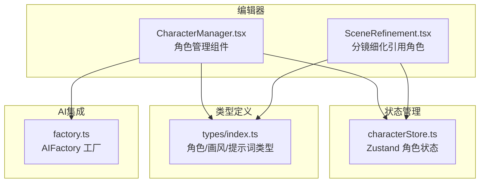
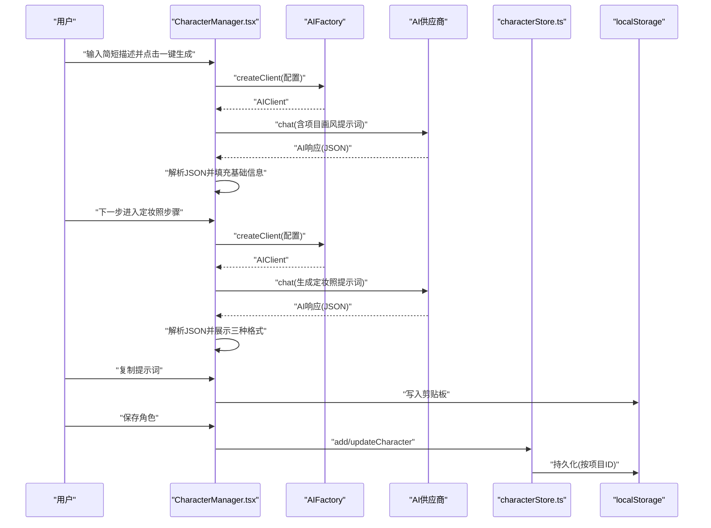
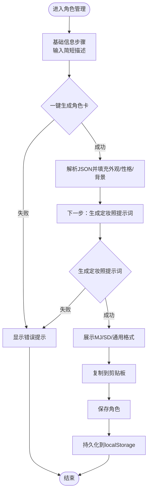
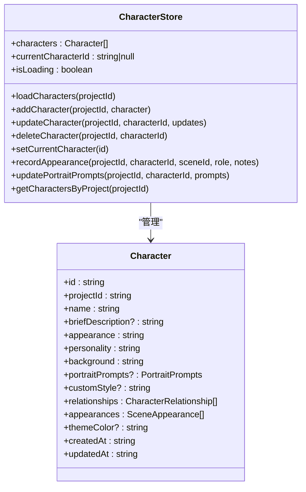
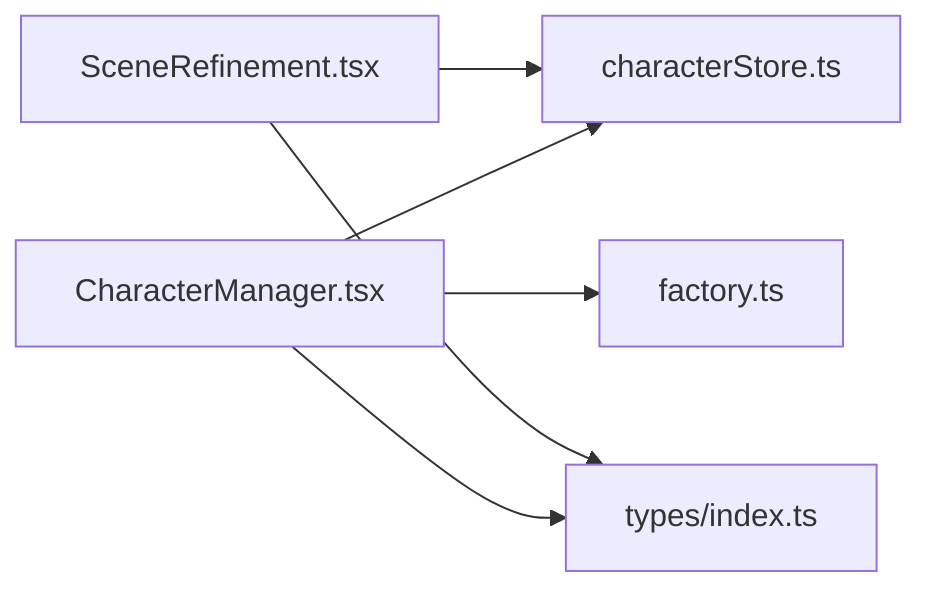

# 角色管理

<cite>
**本文引用的文件**
- [CharacterManager.tsx](file://manga-creator/src/components/editor/CharacterManager.tsx)
- [characterStore.ts](file://manga-creator/src/stores/characterStore.ts)
- [index.ts](file://manga-creator/src/types/index.ts)
- [factory.ts](file://manga-creator/src/lib/ai/factory.ts)
- [README.md](file://manga-creator/README.md)
- [CharacterManager.test.tsx](file://manga-creator/src/components/editor/CharacterManager.test.tsx)
- [characterStore.test.ts](file://manga-creator/src/stores/characterStore.test.ts)
- [SceneRefinement.tsx](file://manga-creator/src/components/editor/SceneRefinement.tsx)
</cite>

## 目录
1. [简介](#简介)
2. [项目结构](#项目结构)
3. [核心组件](#核心组件)
4. [架构总览](#架构总览)
5. [详细组件分析](#详细组件分析)
6. [依赖分析](#依赖分析)
7. [性能考虑](#性能考虑)
8. [故障排查指南](#故障排查指南)
9. [结论](#结论)

## 简介
本章节介绍“角色管理”模块的设计目标与能力范围。该模块围绕角色的生命周期进行管理，包括角色创建、编辑、删除；基于简短描述的一键生成完整角色卡（外观/性格/背景）；以及为角色生成定妆照提示词（支持 Midjourney、Stable Diffusion、通用格式）。同时，角色管理与项目画风配置联动，确保角色视觉风格的一致性，并通过本地存储实现跨会话持久化。

## 项目结构
角色管理位于编辑器子模块中，采用组件-状态-类型-AI工厂的分层组织方式：
- 组件层：负责用户交互与流程编排（两步式表单、AI生成、提示词复制）
- 状态层：使用轻量状态管理持久化角色数据（Zustand）
- 类型层：统一定义角色、画风、提示词等核心数据结构
- AI层：工厂模式抽象多供应商适配器，统一对话接口

图表来源
- [CharacterManager.tsx](file://manga-creator/src/components/editor/CharacterManager.tsx#L1-L120)
- [characterStore.ts](file://manga-creator/src/stores/characterStore.ts#L1-L127)
- [index.ts](file://manga-creator/src/types/index.ts#L403-L462)
- [factory.ts](file://manga-creator/src/lib/ai/factory.ts#L1-L54)
- [SceneRefinement.tsx](file://manga-creator/src/components/editor/SceneRefinement.tsx#L412-L428)

章节来源
- [README.md](file://manga-creator/README.md#L95-L128)

## 核心组件
- 角色管理组件（CharacterManager）
  - 提供两步式表单：基础信息（名称/外观/性格/背景/主题色）与定妆照提示词（MJ/SD/通用）
  - 一键生成角色卡与定妆照提示词，自动注入项目画风
  - 角色列表展示、编辑、删除
  - 提示词复制到剪贴板
- 角色状态存储（useCharacterStore）
  - 角色增删改查、出场记录、定妆照提示词更新、按项目筛选
  - 本地持久化（localStorage），键名包含项目ID
- 类型系统（types/index.ts）
  - 角色实体、角色关系、出场记录、定妆照提示词、画风配置与迁移
- AI工厂（factory.ts）
  - 多供应商适配器统一聊天接口，支持 DeepSeek、OpenAI 兼容、Gemini

章节来源
- [CharacterManager.tsx](file://manga-creator/src/components/editor/CharacterManager.tsx#L92-L121)
- [characterStore.ts](file://manga-creator/src/stores/characterStore.ts#L1-L118)
- [index.ts](file://manga-creator/src/types/index.ts#L403-L462)
- [factory.ts](file://manga-creator/src/lib/ai/factory.ts#L1-L54)

## 架构总览
角色管理的运行时交互流程如下：
- 用户在角色管理组件中填写简短描述，点击“一键生成”，组件通过工厂创建AI客户端，拼接包含项目画风的提示词，调用AI生成角色卡并解析JSON填充表单
- 用户进入定妆照步骤，再次调用AI生成三种格式的提示词，支持复制到剪贴板
- 所有角色数据通过Zustand状态管理，持久化到localStorage，按项目隔离

图表来源
- [CharacterManager.tsx](file://manga-creator/src/components/editor/CharacterManager.tsx#L210-L336)
- [factory.ts](file://manga-creator/src/lib/ai/factory.ts#L44-L54)
- [characterStore.ts](file://manga-creator/src/stores/characterStore.ts#L37-L113)

## 详细组件分析

### 角色管理组件（CharacterManager）
- 两步式流程
  - 基础信息步骤：简短描述输入、一键生成角色卡、名称/外观/性格/背景/主题色
  - 定妆照步骤：展示角色信息概览、生成/重新生成定妆照提示词、复制到剪贴板
- 画风传递
  - 读取当前项目画风配置（新/旧两种形态），在生成角色卡与定妆照提示词时注入到提示词模板
- AI生成逻辑
  - 通过工厂创建客户端，构造包含项目上下文的提示词，调用chat接口，解析JSON响应并填充表单
- 交互与校验
  - 表单字段必填校验、生成过程中的禁用状态、错误提示、复制成功反馈
- 列表展示
  - 按项目筛选角色，展示外观、性格、背景、出场次数、关系标签等

图表来源
- [CharacterManager.tsx](file://manga-creator/src/components/editor/CharacterManager.tsx#L210-L336)
- [CharacterManager.tsx](file://manga-creator/src/components/editor/CharacterManager.tsx#L338-L870)

章节来源
- [CharacterManager.tsx](file://manga-creator/src/components/editor/CharacterManager.tsx#L92-L121)
- [CharacterManager.tsx](file://manga-creator/src/components/editor/CharacterManager.tsx#L176-L221)
- [CharacterManager.tsx](file://manga-creator/src/components/editor/CharacterManager.tsx#L210-L336)
- [CharacterManager.tsx](file://manga-creator/src/components/editor/CharacterManager.tsx#L338-L870)

### 角色状态存储（useCharacterStore）
- 能力清单
  - 加载/保存角色：按项目ID读写localStorage
  - 新增/更新/删除角色：维护角色列表并持久化
  - 记录出场：按场景记录角色出场类型与备注，支持同场景更新
  - 更新定妆照提示词：按角色ID更新并持久化
  - 按项目筛选：快速获取某项目下的角色集合
- 数据持久化
  - 键名规则：以项目ID为后缀，避免跨项目冲突
  - 异常兜底：加载/保存失败时记录日志并保持状态稳定

图表来源
- [characterStore.ts](file://manga-creator/src/stores/characterStore.ts#L1-L118)
- [index.ts](file://manga-creator/src/types/index.ts#L413-L462)

章节来源
- [characterStore.ts](file://manga-creator/src/stores/characterStore.ts#L1-L127)
- [characterStore.test.ts](file://manga-creator/src/stores/characterStore.test.ts#L1-L200)
- [characterStore.test.ts](file://manga-creator/src/stores/characterStore.test.ts#L419-L527)

### 类型系统（types/index.ts）
- 角色实体
  - 字段覆盖：名称、简短描述、外观、性格、背景、主题色、关系、出场记录、定妆照提示词、自定义画风等
- 定妆照提示词
  - 三种格式：Midjourney、Stable Diffusion、通用中文描述
- 画风配置与迁移
  - 新版：包含基础风格、技法、色彩、文化特征与合成后的完整英文提示词
  - 旧版：字符串风格映射到新版预设，保证向后兼容
- 项目上下文
  - 项目实体包含画风配置与摘要信息，用于生成角色卡与提示词时注入上下文

章节来源
- [index.ts](file://manga-creator/src/types/index.ts#L403-L462)
- [index.ts](file://manga-creator/src/types/index.ts#L1-L188)
- [index.ts](file://manga-creator/src/types/index.ts#L228-L244)

### AI工厂（factory.ts）
- 工厂职责
  - 根据供应商类型创建对应适配器实例
  - 统一对外的聊天接口（chat/streamChat），隐藏供应商差异
- 集成角色管理
  - 角色管理组件在生成角色卡与定妆照提示词时，通过工厂创建客户端并发起请求

章节来源
- [factory.ts](file://manga-creator/src/lib/ai/factory.ts#L1-L54)
- [CharacterManager.tsx](file://manga-creator/src/components/editor/CharacterManager.tsx#L224-L336)

### 与分镜细化的协作（SceneRefinement）
- 角色引用
  - 在分镜细化中可引用角色信息（名称、外观、性格）到场景描述中，便于AI生成更一致的视觉描述
- 出场记录
  - 通过角色状态记录角色在各场景中的出场类型与备注，辅助生成与回溯

章节来源
- [SceneRefinement.tsx](file://manga-creator/src/components/editor/SceneRefinement.tsx#L412-L428)
- [characterStore.ts](file://manga-creator/src/stores/characterStore.ts#L77-L113)

## 依赖分析
- 组件依赖
  - CharacterManager 依赖：角色状态存储、配置状态、项目状态、AI工厂、类型定义
- 状态依赖
  - characterStore 依赖：localStorage（键名含项目ID）、Zustand
- 类型依赖
  - types/index.ts 定义角色、提示词、画风、项目等核心类型
- AI依赖
  - factory.ts 提供统一客户端，支持多供应商

图表来源
- [CharacterManager.tsx](file://manga-creator/src/components/editor/CharacterManager.tsx#L1-L120)
- [characterStore.ts](file://manga-creator/src/stores/characterStore.ts#L1-L127)
- [index.ts](file://manga-creator/src/types/index.ts#L403-L462)
- [factory.ts](file://manga-creator/src/lib/ai/factory.ts#L1-L54)
- [SceneRefinement.tsx](file://manga-creator/src/components/editor/SceneRefinement.tsx#L412-L428)

## 性能考虑
- 本地存储
  - 采用按项目隔离的键名，避免跨项目扫描与解析开销
  - 仅在新增/更新/删除时写入，减少频繁IO
- 状态粒度
  - 使用Zustand轻量状态管理，避免不必要的重渲染
- AI调用
  - 仅在用户显式触发时发起请求，避免后台轮询
  - 生成过程禁用相关按钮，防止重复请求
- UI渲染
  - 角色列表采用卡片布局，按项目筛选后渲染，避免全量遍历

[本节为通用建议，无需特定文件来源]

## 故障排查指南
- AI未配置
  - 现象：一键生成按钮禁用或报错
  - 排查：确认配置状态是否已保存且API Key有效
  - 参考路径：[CharacterManager.tsx](file://manga-creator/src/components/editor/CharacterManager.tsx#L210-L268)
- 生成格式错误
  - 现象：AI返回非JSON或字段缺失
  - 排查：检查提示词模板是否完整，确认供应商返回格式符合预期
  - 参考路径：[CharacterManager.tsx](file://manga-creator/src/components/editor/CharacterManager.tsx#L244-L268)
- 画风未生效
  - 现象：生成内容未体现项目画风
  - 排查：确认项目画风配置是否正确，或旧版style是否已迁移至新版配置
  - 参考路径：[index.ts](file://manga-creator/src/types/index.ts#L152-L174)
- 角色未持久化
  - 现象：刷新页面后角色丢失
  - 排查：检查localStorage写入是否异常，确认键名包含项目ID
  - 参考路径：[characterStore.ts](file://manga-creator/src/stores/characterStore.ts#L120-L127)
- 出场记录异常
  - 现象：同一场景重复记录导致数据冗余
  - 排查：确认recordAppearance逻辑是否按场景ID去重更新
  - 参考路径：[characterStore.ts](file://manga-creator/src/stores/characterStore.ts#L77-L113)

章节来源
- [CharacterManager.tsx](file://manga-creator/src/components/editor/CharacterManager.tsx#L210-L336)
- [index.ts](file://manga-creator/src/types/index.ts#L152-L174)
- [characterStore.ts](file://manga-creator/src/stores/characterStore.ts#L77-L127)

## 结论
角色管理模块通过两步式表单、AI生成与本地持久化，提供了从角色设定到定妆照提示词的完整工作流。其与项目画风配置深度耦合，确保角色视觉风格的一致性；与分镜细化协作，进一步提升生成内容的连贯性。类型系统与工厂模式使扩展新的AI供应商与数据结构变更变得简单可靠。