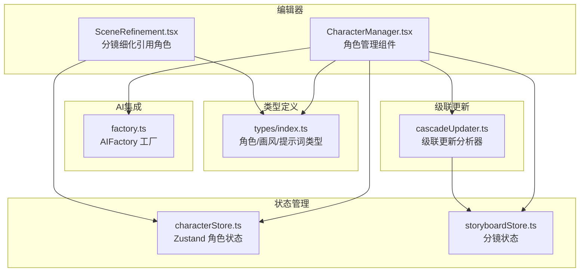
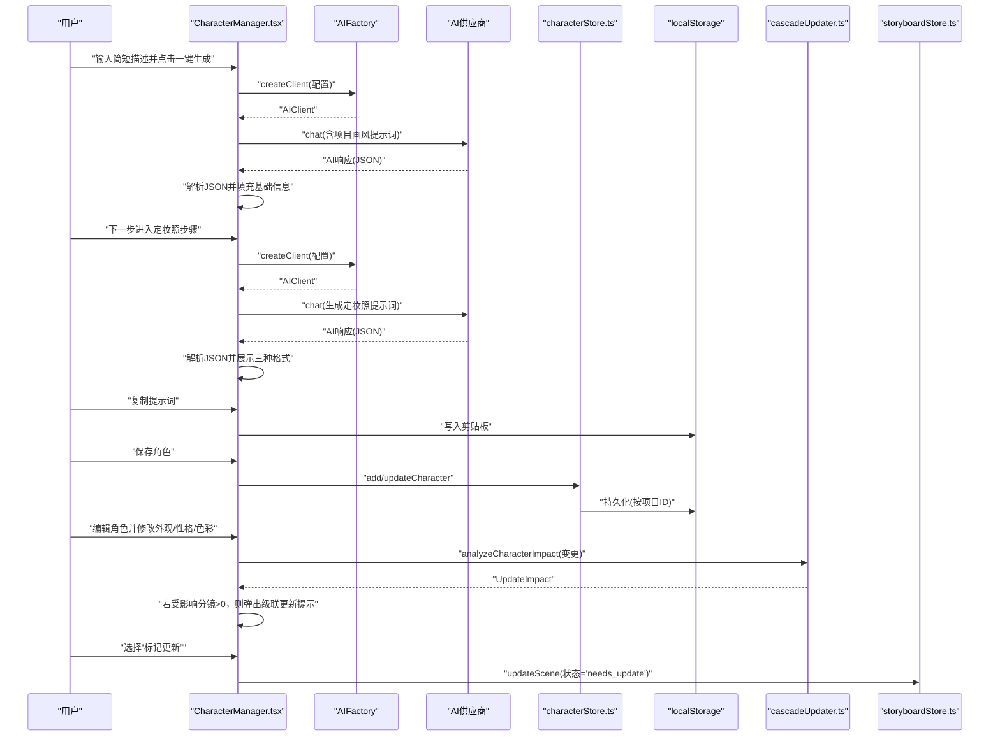
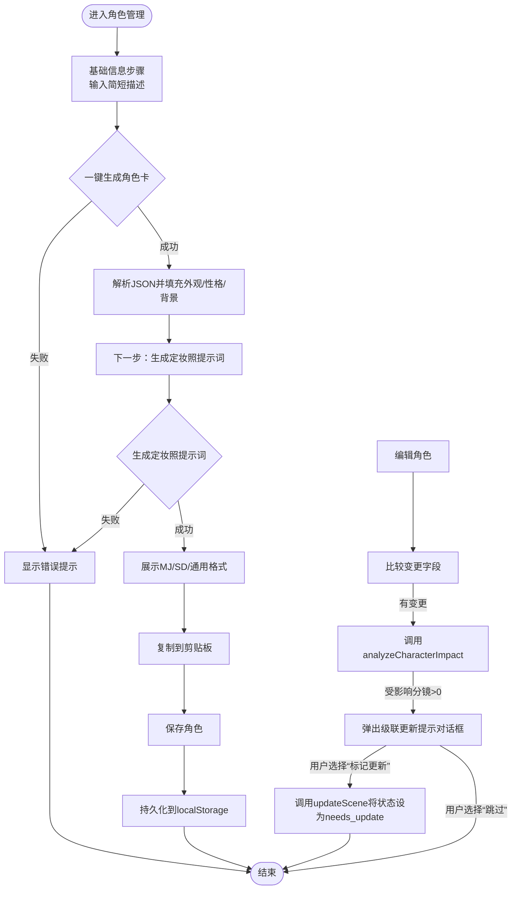
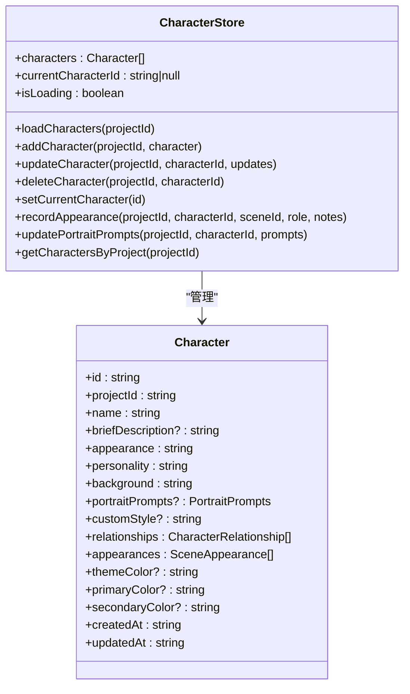
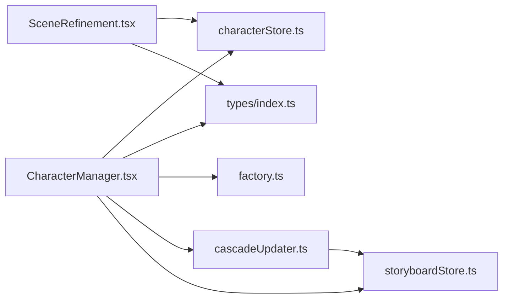

# 角色管理

<cite>
**本文引用的文件**  
- [CharacterManager.tsx](file://manga-creator/src/components/editor/CharacterManager.tsx)
- [characterStore.ts](file://manga-creator/src/stores/characterStore.ts)
- [index.ts](file://manga-creator/src/types/index.ts)
- [factory.ts](file://manga-creator/src/lib/ai/factory.ts)
- [README.md](file://manga-creator/README.md)
- [CharacterManager.test.tsx](file://manga-creator/src/components/editor/CharacterManager.test.tsx)
- [characterStore.test.ts](file://manga-creator/src/stores/characterStore.test.ts)
- [SceneRefinement.tsx](file://manga-creator/src/components/editor/SceneRefinement.tsx)
- [cascadeUpdater.ts](file://manga-creator/src/lib/ai/cascadeUpdater.ts)
- [storyboardStore.ts](file://manga-creator/src/stores/storyboardStore.ts)
</cite>

## 更新摘要

**变更内容**

- 在角色管理中新增级联更新影响分析功能，当修改角色的外观、性格或色彩时，会自动分析对已有分镜的影响，并提示用户标记需要更新的分镜。
- 新增 `analyzeCharacterImpact` 函数用于分析角色变更对分镜的影响。
- 新增 `markScenesNeedUpdate` 函数用于标记受影响的分镜为“需要更新”状态。
- 在 `CharacterManager` 组件中集成级联更新提示对话框，提供“标记更新”和“跳过”选项。

## 目录

1. [简介](#简介)
2. [项目结构](#项目结构)
3. [核心组件](#核心组件)
4. [架构总览](#架构总览)
5. [详细组件分析](#详细组件分析)
6. [依赖分析](#依赖分析)
7. [性能考虑](#性能考虑)
8. [故障排查指南](#故障排查指南)
9. [结论](#结论)

## 简介

本章节介绍“角色管理”模块的设计目标与能力范围。该模块围绕角色的生命周期进行管理，包括角色创建、编辑、删除；基于简短描述的一键生成完整角色卡（外观/性格/背景）；以及为角色生成定妆照提示词（支持 Midjourney、Stable Diffusion、通用格式）。同时，角色管理与项目画风配置联动，确保角色视觉风格的一致性，并通过本地存储实现跨会话持久化。**新增级联更新影响分析功能**：当修改角色的外观、性格或色彩时，系统会自动分析对已有分镜的影响，并提示用户标记需要更新的分镜，以确保内容一致性。

## 项目结构

角色管理位于编辑器子模块中，采用组件-状态-类型-AI工厂-级联更新器的分层组织方式：

- 组件层：负责用户交互与流程编排（两步式表单、AI生成、提示词复制、级联更新提示）
- 状态层：使用轻量状态管理持久化角色数据（Zustand）
- 类型层：统一定义角色、画风、提示词等核心数据结构
- AI层：工厂模式抽象多供应商适配器，统一对话接口
- 级联更新层：分析角色变更对分镜的影响并标记需要更新的分镜

图表来源

- [CharacterManager.tsx](file://manga-creator/src/components/editor/CharacterManager.tsx#L1-L120)
- [characterStore.ts](file://manga-creator/src/stores/characterStore.ts#L1-L127)
- [index.ts](file://manga-creator/src/types/index.ts#L403-L462)
- [factory.ts](file://manga-creator/src/lib/ai/factory.ts#L1-L54)
- [SceneRefinement.tsx](file://manga-creator/src/components/editor/SceneRefinement.tsx#L412-L428)
- [cascadeUpdater.ts](file://manga-creator/src/lib/ai/cascadeUpdater.ts#L335-L405)
- [storyboardStore.ts](file://manga-creator/src/stores/storyboardStore.ts#L1-L108)

章节来源

- [README.md](file://manga-creator/README.md#L95-L128)

## 核心组件

- 角色管理组件（CharacterManager）
  - 提供两步式表单：基础信息（名称/外观/性格/背景/主题色）与定妆照提示词（MJ/SD/通用）
  - 一键生成角色卡与定妆照提示词，自动注入项目画风
  - 角色列表展示、编辑、删除
  - 提示词复制到剪贴板
  - **新增级联更新影响分析**：当修改角色的外观、性格或色彩时，分析对已有分镜的影响并提示用户标记需要更新的分镜
- 角色状态存储（useCharacterStore）
  - 角色增删改查、出场记录、定妆照提示词更新、按项目筛选
  - 本地持久化（localStorage），键名包含项目ID
- 类型系统（types/index.ts）
  - 角色实体、角色关系、出场记录、定妆照提示词、画风配置与迁移
- AI工厂（factory.ts）
  - 多供应商适配器统一聊天接口，支持 DeepSeek、OpenAI 兼容、Gemini
- 级联更新分析器（cascadeUpdater.ts）
  - 分析角色设定变更对分镜的影响
  - 标记受影响的分镜为“需要更新”状态
  - 生成更新计划摘要

章节来源

- [CharacterManager.tsx](file://manga-creator/src/components/editor/CharacterManager.tsx#L92-L121)
- [characterStore.ts](file://manga-creator/src/stores/characterStore.ts#L1-L118)
- [index.ts](file://manga-creator/src/types/index.ts#L403-L462)
- [factory.ts](file://manga-creator/src/lib/ai/factory.ts#L1-L54)
- [cascadeUpdater.ts](file://manga-creator/src/lib/ai/cascadeUpdater.ts#L335-L405)

## 架构总览

角色管理的运行时交互流程如下：

- 用户在角色管理组件中填写简短描述，点击“一键生成”，组件通过工厂创建AI客户端，拼接包含项目画风的提示词，调用AI生成角色卡并解析JSON填充表单
- 用户进入定妆照步骤，再次调用AI生成三种格式的提示词，支持复制到剪贴板
- 所有角色数据通过Zustand状态管理，持久化到localStorage，按项目隔离
- **当用户编辑角色并修改外观、性格或色彩时**，系统会比较变更字段，调用 `analyzeCharacterImpact` 分析对已有分镜的影响，若存在受影响的分镜，则弹出对话框提示用户标记需要更新的分镜

图表来源

- [CharacterManager.tsx](file://manga-creator/src/components/editor/CharacterManager.tsx#L210-L336)
- [factory.ts](file://manga-creator/src/lib/ai/factory.ts#L44-L54)
- [characterStore.ts](file://manga-creator/src/stores/characterStore.ts#L37-L113)
- [cascadeUpdater.ts](file://manga-creator/src/lib/ai/cascadeUpdater.ts#L335-L405)
- [storyboardStore.ts](file://manga-creator/src/stores/storyboardStore.ts#L58-L69)

## 详细组件分析

### 角色管理组件（CharacterManager）

- 两步式流程
  - 基础信息步骤：简短描述输入、一键生成角色卡、名称/外观/性格/背景/主题色
  - 定妆照步骤：展示角色信息概览、生成/重新生成定妆照提示词、复制到剪贴板
- 画风传递
  - 读取当前项目画风配置（新/旧两种形态），在生成角色卡与定妆照提示词时注入到提示词模板
- AI生成逻辑
  - 通过工厂创建客户端，构造包含项目上下文的提示词，调用chat接口，解析JSON响应并填充表单
- 交互与校验
  - 表单字段必填校验、生成过程中的禁用状态、错误提示、复制成功反馈
- 列表展示
  - 按项目筛选角色，展示外观、性格、背景、出场次数、关系标签等
- **级联更新影响分析**
  - 当用户编辑角色并提交时，系统会比较原角色与新角色的外观、性格、名称、主色、辅色等字段
  - 若有变更，则调用 `analyzeCharacterImpact` 分析对已有分镜的影响
  - 若存在受影响的分镜，则弹出 `AlertDialog` 对话框，显示影响摘要，并提供“标记更新”和“跳过”选项
  - 用户选择“标记更新”后，调用 `markScenesNeedUpdate` 将受影响的分镜状态更新为 `needs_update`

图表来源

- [CharacterManager.tsx](file://manga-creator/src/components/editor/CharacterManager.tsx#L210-L336)
- [CharacterManager.tsx](file://manga-creator/src/components/editor/CharacterManager.tsx#L338-L870)
- [CharacterManager.tsx](file://manga-creator/src/components/editor/CharacterManager.tsx#L224-L257)
- [CharacterManager.tsx](file://manga-creator/src/components/editor/CharacterManager.tsx#L274-L286)
- [CharacterManager.tsx](file://manga-creator/src/components/editor/CharacterManager.tsx#L1322-L1349)

章节来源

- [CharacterManager.tsx](file://manga-creator/src/components/editor/CharacterManager.tsx#L92-L121)
- [CharacterManager.tsx](file://manga-creator/src/components/editor/CharacterManager.tsx#L176-L221)
- [CharacterManager.tsx](file://manga-creator/src/components/editor/CharacterManager.tsx#L210-L336)
- [CharacterManager.tsx](file://manga-creator/src/components/editor/CharacterManager.tsx#L338-L870)
- [CharacterManager.tsx](file://manga-creator/src/components/editor/CharacterManager.tsx#L224-L257)
- [CharacterManager.tsx](file://manga-creator/src/components/editor/CharacterManager.tsx#L274-L286)
- [CharacterManager.tsx](file://manga-creator/src/components/editor/CharacterManager.tsx#L1322-L1349)

### 角色状态存储（useCharacterStore）

- 能力清单
  - 加载/保存角色：按项目ID读写localStorage
  - 新增/更新/删除角色：维护角色列表并持久化
  - 记录出场：按场景记录角色出场类型与备注，支持同场景更新
  - 更新定妆照提示词：按角色ID更新并持久化
  - 按项目筛选：快速获取某项目下的角色集合
- 数据持久化
  - 键名规则：以项目ID为后缀，避免跨项目冲突
  - 异常兜底：加载/保存失败时记录日志并保持状态稳定

图表来源

- [characterStore.ts](file://manga-creator/src/stores/characterStore.ts#L1-L118)
- [index.ts](file://manga-creator/src/types/index.ts#L413-L462)

章节来源

- [characterStore.ts](file://manga-creator/src/stores/characterStore.ts#L1-L127)
- [characterStore.test.ts](file://manga-creator/src/stores/characterStore.test.ts#L1-L200)
- [characterStore.test.ts](file://manga-creator/src/stores/characterStore.test.ts#L419-L527)

### 类型系统（types/index.ts）

- 角色实体
  - 字段覆盖：名称、简短描述、外观、性格、背景、主题色、主色、辅色、关系、出场记录、定妆照提示词、自定义画风等
- 定妆照提示词
  - 三种格式：Midjourney、Stable Diffusion、通用中文描述
- 画风配置与迁移
  - 新版：包含基础风格、技法、色彩、文化特征与合成后的完整英文提示词
  - 旧版：字符串风格映射到新版预设，保证向后兼容
- 项目上下文
  - 项目实体包含画风配置与摘要信息，用于生成角色卡与提示词时注入上下文
- **级联更新相关类型**
  - `CharacterChange`: 角色变更信息（角色ID、变更字段）
  - `CharacterAppearance`: 角色在分镜中的出现关系
  - `UpdateImpact`: 更新影响分析结果（受影响的分镜、更新计划、预估时间）
  - `UpdateAction`: 更新操作（分镜ID、字段、原因、优先级）
  - `SceneStatus`: 分镜状态新增 `needs_update`

章节来源

- [index.ts](file://manga-creator/src/types/index.ts#L403-L462)
- [index.ts](file://manga-creator/src/types/index.ts#L1-L188)
- [index.ts](file://manga-creator/src/types/index.ts#L228-L244)
- [index.ts](file://manga-creator/src/types/index.ts#L445-L480)
- [index.ts](file://manga-creator/src/types/index.ts#L241-L250)

### AI工厂（factory.ts）

- 工厂职责
  - 根据供应商类型创建对应适配器实例
  - 统一对外的聊天接口（chat/streamChat），隐藏供应商差异
- 集成角色管理
  - 角色管理组件在生成角色卡与定妆照提示词时，通过工厂创建客户端并发起请求

章节来源

- [factory.ts](file://manga-creator/src/lib/ai/factory.ts#L1-L54)
- [CharacterManager.tsx](file://manga-creator/src/components/editor/CharacterManager.tsx#L224-L336)

### 级联更新分析器（cascadeUpdater.ts）

- **功能职责**
  - `analyzeCharacterImpact`: 分析角色设定变更对分镜的影响，根据变更字段（外观、性格、主色、辅色、名称）确定受影响的分镜和需要更新的字段
  - `markScenesNeedUpdate`: 将指定分镜的状态标记为 `needs_update`
  - `generateUpdateSummary`: 生成影响摘要，包括受影响分镜数、更新操作数、优先级分布、预估耗时
- **集成角色管理**
  - `CharacterManager` 组件在保存角色时调用 `analyzeCharacterImpact` 进行影响分析
  - 若存在受影响的分镜，则弹出对话框，用户确认后调用 `markScenesNeedUpdate` 更新分镜状态

章节来源

- [cascadeUpdater.ts](file://manga-creator/src/lib/ai/cascadeUpdater.ts#L335-L405)
- [cascadeUpdater.ts](file://manga-creator/src/lib/ai/cascadeUpdater.ts#L226-L239)
- [cascadeUpdater.ts](file://manga-creator/src/lib/ai/cascadeUpdater.ts#L252-L271)
- [CharacterManager.tsx](file://manga-creator/src/components/editor/CharacterManager.tsx#L224-L257)
- [CharacterManager.tsx](file://manga-creator/src/components/editor/CharacterManager.tsx#L274-L286)

### 与分镜细化的协作（SceneRefinement）

- 角色引用
  - 在分镜细化中可引用角色信息（名称、外观、性格）到场景描述中，便于AI生成更一致的视觉描述
- 出场记录
  - 通过角色状态记录角色在各场景中的出场类型与备注，辅助生成与回溯
- **级联更新联动**
  - 当分镜状态为 `needs_update` 时，分镜细化页面会提示用户重新生成该分镜的内容

章节来源

- [SceneRefinement.tsx](file://manga-creator/src/components/editor/SceneRefinement.tsx#L412-L428)
- [characterStore.ts](file://manga-creator/src/stores/characterStore.ts#L77-L113)
- [storyboardStore.ts](file://manga-creator/src/stores/storyboardStore.ts#L58-L69)

## 依赖分析

- 组件依赖
  - CharacterManager 依赖：角色状态存储、配置状态、项目状态、AI工厂、类型定义、级联更新分析器、分镜状态存储
- 状态依赖
  - characterStore 依赖：localStorage（键名含项目ID）、Zustand
  - storyboardStore 依赖：localStorage（键名含项目ID）、Zustand
- 类型依赖
  - types/index.ts 定义角色、提示词、画风、项目、级联更新等核心类型
- AI依赖
  - factory.ts 提供统一客户端，支持多供应商

图表来源

- [CharacterManager.tsx](file://manga-creator/src/components/editor/CharacterManager.tsx#L1-L120)
- [characterStore.ts](file://manga-creator/src/stores/characterStore.ts#L1-L127)
- [index.ts](file://manga-creator/src/types/index.ts#L403-L462)
- [factory.ts](file://manga-creator/src/lib/ai/factory.ts#L1-L54)
- [SceneRefinement.tsx](file://manga-creator/src/components/editor/SceneRefinement.tsx#L412-L428)
- [cascadeUpdater.ts](file://manga-creator/src/lib/ai/cascadeUpdater.ts#L335-L405)
- [storyboardStore.ts](file://manga-creator/src/stores/storyboardStore.ts#L1-L108)

## 性能考虑

- 本地存储
  - 采用按项目隔离的键名，避免跨项目扫描与解析开销
  - 仅在新增/更新/删除时写入，减少频繁IO
- 状态粒度
  - 使用Zustand轻量状态管理，避免不必要的重渲染
- AI调用
  - 仅在用户显式触发时发起请求，避免后台轮询
  - 生成过程禁用相关按钮，防止重复请求
- UI渲染
  - 角色列表采用卡片布局，按项目筛选后渲染，避免全量遍历
- **级联更新分析**
  - 仅在角色编辑保存时进行影响分析，避免实时计算开销
  - 分析逻辑基于规则引擎，零延迟，无需等待AI响应

[本节为通用建议，无需特定文件来源]

## 故障排查指南

- AI未配置
  - 现象：一键生成按钮禁用或报错
  - 排查：确认配置状态是否已保存且API Key有效
  - 参考路径：[CharacterManager.tsx](file://manga-creator/src/components/editor/CharacterManager.tsx#L210-L268)
- 生成格式错误
  - 现象：AI返回非JSON或字段缺失
  - 排查：检查提示词模板是否完整，确认供应商返回格式符合预期
  - 参考路径：[CharacterManager.tsx](file://manga-creator/src/components/editor/CharacterManager.tsx#L244-L268)
- 画风未生效
  - 现象：生成内容未体现项目画风
  - 排查：确认项目画风配置是否正确，或旧版style是否已迁移至新版配置
  - 参考路径：[index.ts](file://manga-creator/src/types/index.ts#L152-L174)
- 角色未持久化
  - 现象：刷新页面后角色丢失
  - 排查：检查localStorage写入是否异常，确认键名包含项目ID
  - 参考路径：[characterStore.ts](file://manga-creator/src/stores/characterStore.ts#L120-L127)
- 出场记录异常
  - 现象：同一场景重复记录导致数据冗余
  - 排查：确认recordAppearance逻辑是否按场景ID去重更新
  - 参考路径：[characterStore.ts](file://manga-creator/src/stores/characterStore.ts#L77-L113)
- **级联更新无提示**
  - 现象：修改角色后未弹出影响分析对话框
  - 排查：确认是否修改了外观、性格、主色、辅色或名称字段；检查 `analyzeCharacterImpact` 是否返回空数组
  - 参考路径：[CharacterManager.tsx](file://manga-creator/src/components/editor/CharacterManager.tsx#L224-L257)
- **分镜状态未更新**
  - 现象：点击“标记更新”后，分镜状态未变为“需要更新”
  - 排查：确认 `updateScene` 是否被正确调用，检查 `storyboardStore` 的持久化逻辑
  - 参考路径：[CharacterManager.tsx](file://manga-creator/src/components/editor/CharacterManager.tsx#L274-L286)
  - 参考路径：[storyboardStore.ts](file://manga-creator/src/stores/storyboardStore.ts#L58-L69)

章节来源

- [CharacterManager.tsx](file://manga-creator/src/components/editor/CharacterManager.tsx#L210-L336)
- [index.ts](file://manga-creator/src/types/index.ts#L152-L174)
- [characterStore.ts](file://manga-creator/src/stores/characterStore.ts#L77-L127)
- [CharacterManager.tsx](file://manga-creator/src/components/editor/CharacterManager.tsx#L224-L257)
- [CharacterManager.tsx](file://manga-creator/src/components/editor/CharacterManager.tsx#L274-L286)
- [storyboardStore.ts](file://manga-creator/src/stores/storyboardStore.ts#L58-L69)

## 结论

角色管理模块通过两步式表单、AI生成与本地持久化，提供了从角色设定到定妆照提示词的完整工作流。其与项目画风配置深度耦合，确保角色视觉风格的一致性；与分镜细化协作，进一步提升生成内容的连贯性。类型系统与工厂模式使扩展新的AI供应商与数据结构变更变得简单可靠。**新增的级联更新影响分析功能**，在修改角色关键信息时，能自动分析对已有分镜的影响，并通过对话框提示用户标记需要更新的分镜，有效维护了项目内容的一致性，提升了工作流的完整性和用户体验。
