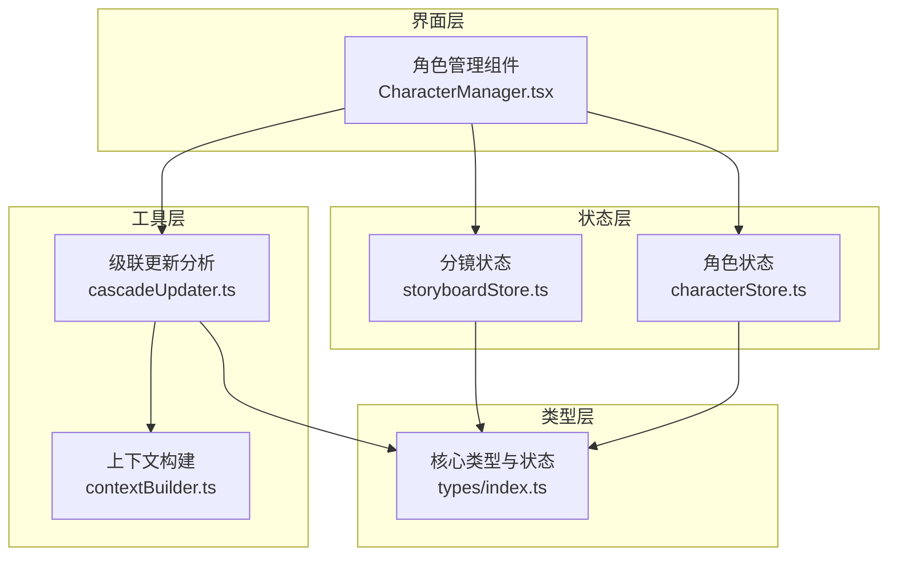
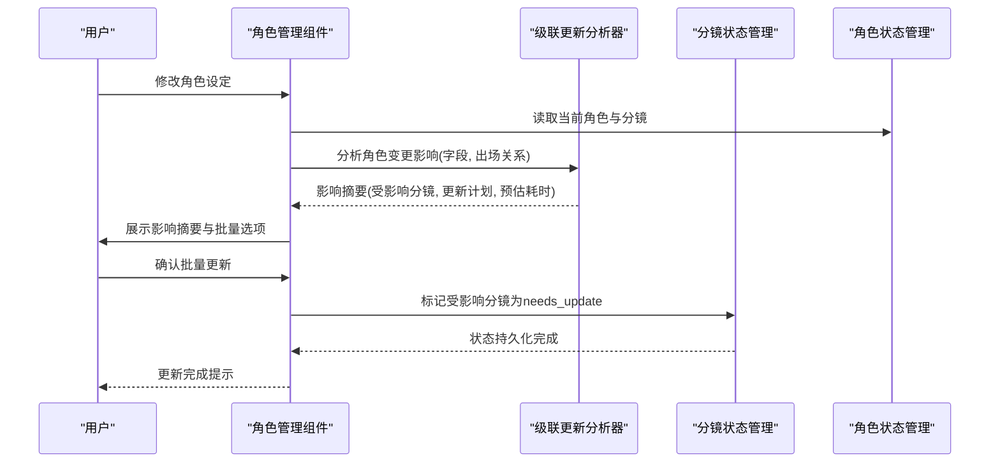
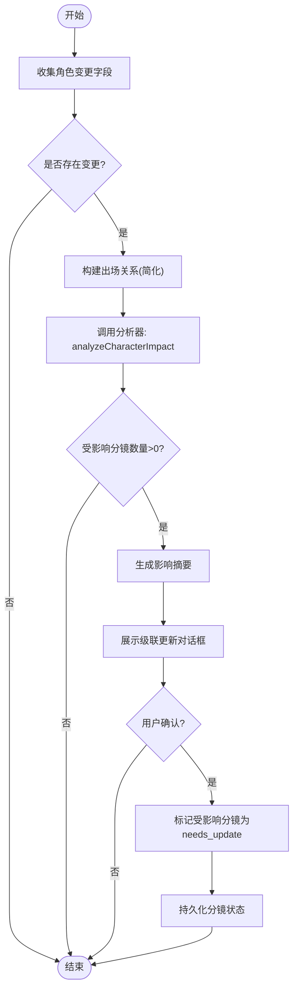
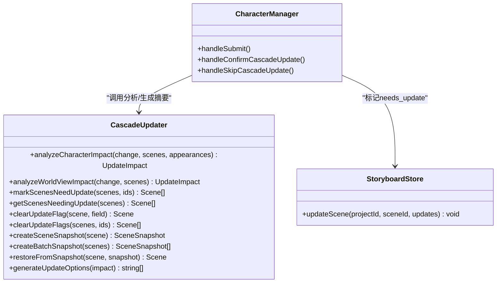
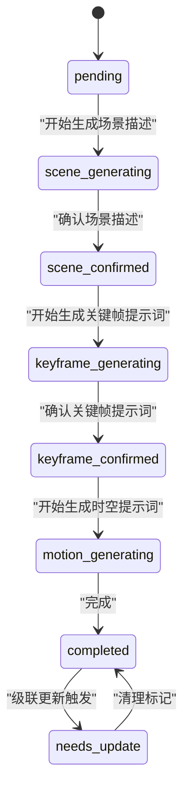
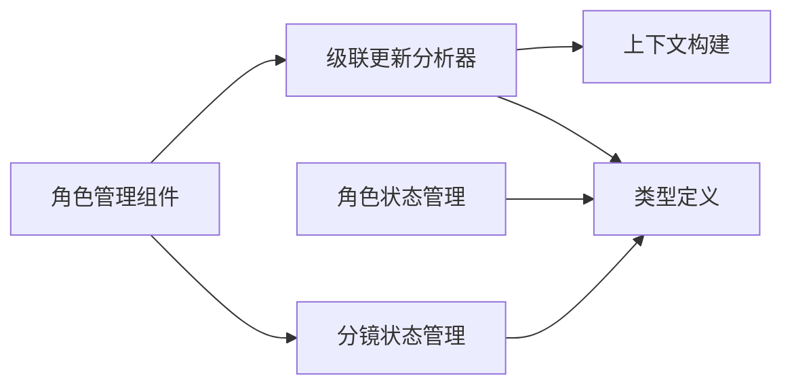

# 角色级联更新

<cite>
**本文引用的文件**
- [cascadeUpdater.ts](file://manga-creator/src/lib/ai/cascadeUpdater.ts)
- [CharacterManager.tsx](file://manga-creator/src/components/editor/CharacterManager.tsx)
- [characterStore.ts](file://manga-creator/src/stores/characterStore.ts)
- [storyboardStore.ts](file://manga-creator/src/stores/storyboardStore.ts)
- [index.ts](file://manga-creator/src/types/index.ts)
- [contextBuilder.ts](file://manga-creator/src/lib/ai/contextBuilder.ts)
- [cascadeUpdater.test.ts](file://manga-creator/src/lib/ai/cascadeUpdater.test.ts)
</cite>

## 目录
1. [简介](#简介)
2. [项目结构](#项目结构)
3. [核心组件](#核心组件)
4. [架构总览](#架构总览)
5. [详细组件分析](#详细组件分析)
6. [依赖分析](#依赖分析)
7. [性能考虑](#性能考虑)
8. [故障排查指南](#故障排查指南)
9. [结论](#结论)

## 简介
本文件聚焦“角色级联更新”能力，阐述当角色设定发生变更时，如何自动识别受影响的分镜，并提供“全部重生成/仅场景描述/仅提示词/跳过”的批量更新选项，以及在失败时回退到规则引擎的保障机制。该能力贯穿“角色管理界面 -> 级联影响分析 -> 标记分镜状态 -> 批量确认与执行”的完整链路，确保角色一致性与创作效率。

## 项目结构
围绕角色级联更新的相关模块分布如下：
- 工具层：级联更新分析与AI回退逻辑
- 界面层：角色管理组件，负责收集变更、触发分析、展示影响摘要与确认
- 状态层：角色与分镜的状态管理，承载“needs_update”等状态流转
- 类型层：统一的数据结构与状态枚举，保证跨模块契约一致

图表来源
- [CharacterManager.tsx](file://manga-creator/src/components/editor/CharacterManager.tsx#L1-L120)
- [cascadeUpdater.ts](file://manga-creator/src/lib/ai/cascadeUpdater.ts#L1-L120)
- [contextBuilder.ts](file://manga-creator/src/lib/ai/contextBuilder.ts#L1-L120)
- [characterStore.ts](file://manga-creator/src/stores/characterStore.ts#L1-L120)
- [storyboardStore.ts](file://manga-creator/src/stores/storyboardStore.ts#L1-L108)
- [index.ts](file://manga-creator/src/types/index.ts#L240-L310)

章节来源
- [CharacterManager.tsx](file://manga-creator/src/components/editor/CharacterManager.tsx#L1-L120)
- [cascadeUpdater.ts](file://manga-creator/src/lib/ai/cascadeUpdater.ts#L1-L120)
- [characterStore.ts](file://manga-creator/src/stores/characterStore.ts#L1-L120)
- [storyboardStore.ts](file://manga-creator/src/stores/storyboardStore.ts#L1-L108)
- [index.ts](file://manga-creator/src/types/index.ts#L240-L310)

## 核心组件
- 级联更新分析器：提供角色/项目设定/场景变更的影响分析、更新计划生成、状态标记与清理、版本快照与回退策略。
- 角色管理组件：负责收集角色变更、对比差异、触发分析、展示影响摘要、确认批量更新。
- 角色状态管理：维护角色列表、出场记录、持久化存储。
- 分镜状态管理：维护分镜列表、状态机（含“needs_update”）、持久化存储。
- 类型与上下文：统一角色、分镜、状态、上下文等类型定义，支撑跨模块协作。

章节来源
- [cascadeUpdater.ts](file://manga-creator/src/lib/ai/cascadeUpdater.ts#L1-L200)
- [CharacterManager.tsx](file://manga-creator/src/components/editor/CharacterManager.tsx#L200-L320)
- [characterStore.ts](file://manga-creator/src/stores/characterStore.ts#L1-L120)
- [storyboardStore.ts](file://manga-creator/src/stores/storyboardStore.ts#L1-L108)
- [index.ts](file://manga-creator/src/types/index.ts#L240-L310)

## 架构总览
角色级联更新的端到端流程如下：

图表来源
- [CharacterManager.tsx](file://manga-creator/src/components/editor/CharacterManager.tsx#L200-L320)
- [cascadeUpdater.ts](file://manga-creator/src/lib/ai/cascadeUpdater.ts#L333-L406)
- [storyboardStore.ts](file://manga-creator/src/stores/storyboardStore.ts#L58-L70)
- [characterStore.ts](file://manga-creator/src/stores/characterStore.ts#L1-L120)

## 详细组件分析

### 组件A：角色管理组件（级联更新入口）
- 职责
  - 收集角色变更（名称、外貌、性格、主题色等）
  - 对比原始角色与当前角色，提取变更字段
  - 构造角色出场关系（简化：假设角色出现在所有分镜）
  - 调用分析器生成影响摘要与更新计划
  - 弹窗展示影响摘要，支持“全部/仅场景/仅提示词/跳过”
  - 确认后批量标记分镜为“needs_update”，并持久化

- 关键流程
  - 表单提交后对比字段差异，构造变更对象
  - 调用分析器：analyzeCharacterImpact
  - 生成摘要：generateUpdateSummary
  - 打开级联更新对话框，等待用户确认
  - 确认后调用：markScenesNeedUpdate + updateSceneInStore

图表来源
- [CharacterManager.tsx](file://manga-creator/src/components/editor/CharacterManager.tsx#L200-L320)
- [cascadeUpdater.ts](file://manga-creator/src/lib/ai/cascadeUpdater.ts#L333-L406)

章节来源
- [CharacterManager.tsx](file://manga-creator/src/components/editor/CharacterManager.tsx#L200-L320)

### 组件B：级联更新分析器（规则引擎与AI回退）
- 角色影响分析
  - 输入：变更字段（appearance/personality/name/primaryColor/secondaryColor）、分镜列表、角色出场关系
  - 输出：受影响分镜集合、更新计划（字段、原因、优先级）、预估耗时
  - 规则要点：
    - 外貌/主题色变更影响关键帧提示词
    - 性格变更影响台词
    - 名称变更影响场景描述与提示词
- 世界观影响分析
  - 影响所有已完成分镜，主要影响场景描述；地理类可能影响提示词
- 状态管理
  - 标记：markScenesNeedUpdate
  - 查询：getScenesNeedingUpdate
  - 清理：clearUpdateFlag/clearUpdateFlags
- 版本快照
  - 创建/批量创建/从快照恢复，便于回滚
- 批量选项
  - 生成更新选项：all/scene_only/prompt_only/skip
- AI回退
  - 角色/世界观影响分析均提供AI版本，失败时回退到规则引擎，并通知回退

图表来源
- [cascadeUpdater.ts](file://manga-creator/src/lib/ai/cascadeUpdater.ts#L333-L701)
- [CharacterManager.tsx](file://manga-creator/src/components/editor/CharacterManager.tsx#L200-L320)
- [storyboardStore.ts](file://manga-creator/src/stores/storyboardStore.ts#L58-L70)

章节来源
- [cascadeUpdater.ts](file://manga-creator/src/lib/ai/cascadeUpdater.ts#L333-L701)

### 组件C：角色与分镜状态管理
- 角色状态管理
  - 提供角色增删改、出场记录、持久化到本地存储
  - 支持主题色字段（主色/辅色）与兼容旧字段
- 分镜状态管理
  - 提供分镜增删改、重排、状态更新
  - 状态包括：pending、scene_generating、scene_confirmed、keyframe_generating、keyframe_confirmed、motion_generating、completed、needs_update

图表来源
- [index.ts](file://manga-creator/src/types/index.ts#L240-L310)
- [storyboardStore.ts](file://manga-creator/src/stores/storyboardStore.ts#L58-L70)

章节来源
- [characterStore.ts](file://manga-creator/src/stores/characterStore.ts#L1-L120)
- [storyboardStore.ts](file://manga-creator/src/stores/storyboardStore.ts#L1-L108)
- [index.ts](file://manga-creator/src/types/index.ts#L240-L310)

### 组件D：上下文构建与类型契约
- 上下文构建
  - 角色上下文：整合外貌、性格、主题色
  - 画风上下文：使用完整提示词
  - 世界观上下文：按类型分组输出
  - 模板填充：按占位符替换
- 类型契约
  - 角色：名称、外貌、性格、背景、主题色、出场记录、定妆照提示词等
  - 分镜：概要、场景描述、动作描述、关键帧提示词、时空提示词、状态、台词等
  - 状态：统一的SceneStatus枚举

章节来源
- [contextBuilder.ts](file://manga-creator/src/lib/ai/contextBuilder.ts#L1-L200)
- [index.ts](file://manga-creator/src/types/index.ts#L455-L520)
- [index.ts](file://manga-creator/src/types/index.ts#L285-L303)

## 依赖分析
- 组件耦合
  - 角色管理组件依赖级联更新分析器与分镜状态管理
  - 级联更新分析器依赖类型定义与上下文构建
  - 角色/分镜状态管理相互独立，通过类型契约耦合
- 外部依赖
  - 本地存储：角色与分镜数据持久化
  - AI客户端：用于智能影响分析（失败回退规则引擎）

图表来源
- [CharacterManager.tsx](file://manga-creator/src/components/editor/CharacterManager.tsx#L1-L120)
- [cascadeUpdater.ts](file://manga-creator/src/lib/ai/cascadeUpdater.ts#L1-L120)
- [contextBuilder.ts](file://manga-creator/src/lib/ai/contextBuilder.ts#L1-L120)
- [characterStore.ts](file://manga-creator/src/stores/characterStore.ts#L1-L120)
- [storyboardStore.ts](file://manga-creator/src/stores/storyboardStore.ts#L1-L108)
- [index.ts](file://manga-creator/src/types/index.ts#L240-L310)

章节来源
- [CharacterManager.tsx](file://manga-creator/src/components/editor/CharacterManager.tsx#L1-L120)
- [cascadeUpdater.ts](file://manga-creator/src/lib/ai/cascadeUpdater.ts#L1-L120)
- [contextBuilder.ts](file://manga-creator/src/lib/ai/contextBuilder.ts#L1-L120)
- [characterStore.ts](file://manga-creator/src/stores/characterStore.ts#L1-L120)
- [storyboardStore.ts](file://manga-creator/src/stores/storyboardStore.ts#L1-L108)
- [index.ts](file://manga-creator/src/types/index.ts#L240-L310)

## 性能考虑
- 分析复杂度
  - 角色影响分析：遍历候选分镜与出场关系，时间复杂度近似O(N)，N为候选分镜数
  - 世界影响分析：遍历所有已完成分镜，时间复杂度O(M)，M为已完成分镜数
- 批量操作
  - 标记needs_update与批量清理均为线性扫描，适合中大型项目
- AI回退
  - 失败时回退规则引擎，避免长时间等待，提升可用性
- 存储与状态
  - 本地存储与Zustand状态管理配合，减少网络依赖，提高交互流畅度

[本节为通用性能讨论，不直接分析具体文件]

## 故障排查指南
- 常见问题
  - AI分析失败：检查网络与API配置，确认回退是否生效
  - 未触发更新：确认分镜状态是否为“pending/needs_update”，这些状态不会被分析器纳入影响范围
  - 出场关系不准确：角色管理组件当前采用简化策略（假设角色出现在所有分镜），建议在正式场景中完善出场记录
- 排查步骤
  - 查看影响摘要与更新计划，核对受影响分镜列表
  - 确认分镜状态是否正确更新为“needs_update”
  - 如需回滚，使用版本快照恢复
- 相关测试
  - 级联更新分析器具备完善的单元测试，覆盖规则引擎与AI回退路径

章节来源
- [cascadeUpdater.test.ts](file://manga-creator/src/lib/ai/cascadeUpdater.test.ts#L495-L671)
- [cascadeUpdater.ts](file://manga-creator/src/lib/ai/cascadeUpdater.ts#L648-L701)

## 结论
角色级联更新通过“规则引擎 + AI回退”的双重保障，实现了对角色设定变更的自动化影响评估与批量更新。界面层提供直观的摘要与选项，状态层确保更新过程可追踪、可回滚。该方案兼顾易用性与可靠性，适用于从草稿到成品的全流程创作。