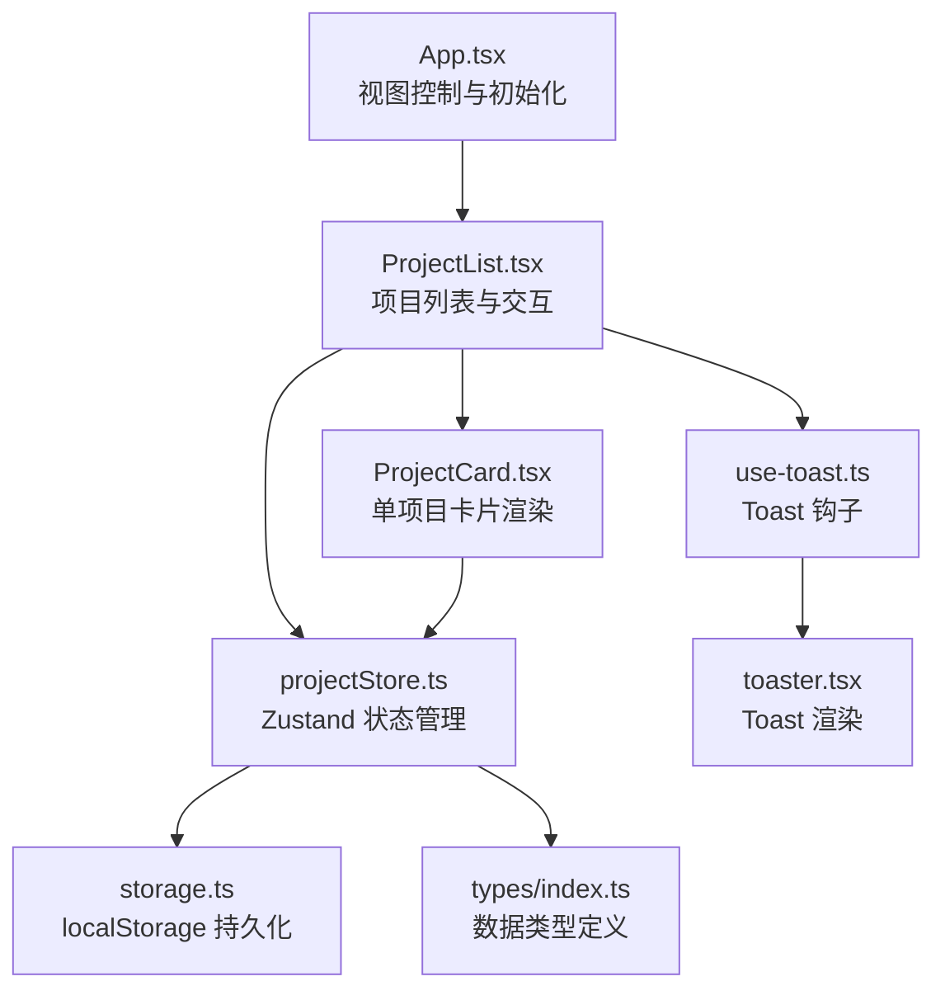
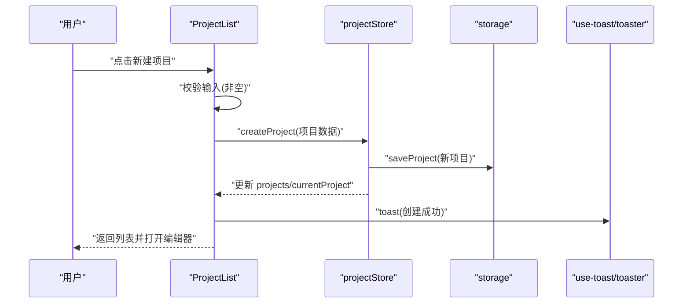
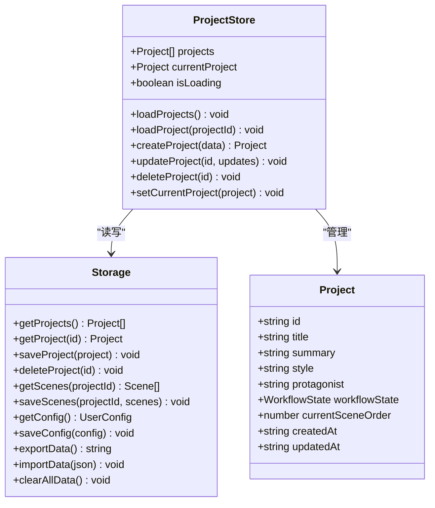
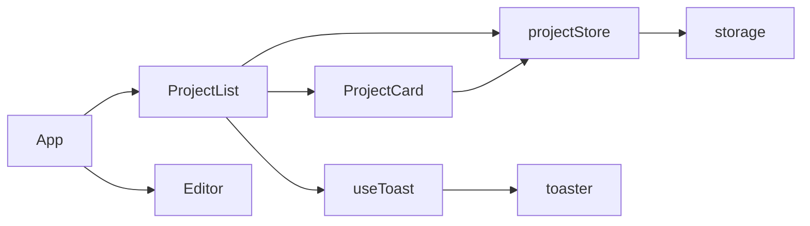
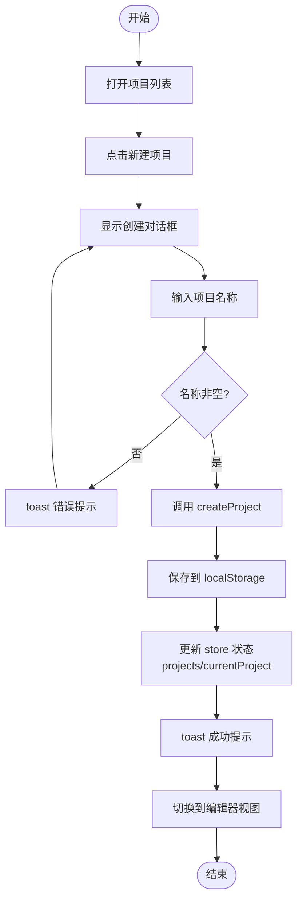

# 项目管理

<cite>
**本文引用的文件**
- [App.tsx](file://manga-creator/src/App.tsx)
- [ProjectList.tsx](file://manga-creator/src/components/ProjectList.tsx)
- [ProjectCard.tsx](file://manga-creator/src/components/ProjectCard.tsx)
- [projectStore.ts](file://manga-creator/src/stores/projectStore.ts)
- [storage.ts](file://manga-creator/src/lib/storage.ts)
- [use-toast.ts](file://manga-creator/src/hooks/use-toast.ts)
- [toaster.tsx](file://manga-creator/src/components/ui/toaster.tsx)
- [index.ts（types）](file://manga-creator/src/types/index.ts)
- [store.test.ts](file://manga-creator/src/stores/store.test.ts)
- [storage.test.ts](file://manga-creator/src/lib/storage.test.ts)
- [ProjectCard.test.tsx](file://manga-creator/src/components/ProjectCard.test.tsx)
</cite>

## 目录
1. [简介](#简介)
2. [项目结构](#项目结构)
3. [核心组件](#核心组件)
4. [架构总览](#架构总览)
5. [详细组件分析](#详细组件分析)
6. [依赖关系分析](#依赖关系分析)
7. [性能考量](#性能考量)
8. [故障排查指南](#故障排查指南)
9. [结论](#结论)
10. [附录：从零到一的完整工作流](#附录从零到一的完整工作流)

## 简介
本章节聚焦“漫剧创作助手”的项目管理工作台功能，系统性解析项目创建、打开、删除与列表展示的实现机制。重点阐述：
- ProjectList 组件如何通过 Zustand 的 projectStore 管理项目状态
- ProjectCard 组件如何渲染单个项目并处理用户交互
- 从零开始创建项目的完整工作流（界面操作步骤 + 底层数据流变化）
- 错误处理（如空项目名称）、状态更新与 UI 反馈（Toast 通知）

## 项目结构
项目采用前端单页应用架构，核心围绕 Zustand 状态管理与本地存储持久化展开：
- 视图层：App 控制视图切换；ProjectList 负责项目列表与创建/删除交互；ProjectCard 渲染单个项目卡片
- 状态层：projectStore 提供项目集合、当前项目、加载状态与 CRUD 操作
- 存储层：storage 封装 localStorage 读写、加密与版本迁移
- 通知层：use-toast 提供 Toast 通知能力，toaster 渲染通知

图表来源
- [App.tsx](file://manga-creator/src/App.tsx#L1-L81)
- [ProjectList.tsx](file://manga-creator/src/components/ProjectList.tsx#L1-L196)
- [ProjectCard.tsx](file://manga-creator/src/components/ProjectCard.tsx#L1-L110)
- [projectStore.ts](file://manga-creator/src/stores/projectStore.ts#L1-L95)
- [storage.ts](file://manga-creator/src/lib/storage.ts#L1-L246)
- [use-toast.ts](file://manga-creator/src/hooks/use-toast.ts#L1-L195)
- [toaster.tsx](file://manga-creator/src/components/ui/toaster.tsx#L1-L34)
- [index.ts（types）](file://manga-creator/src/types/index.ts#L1-L190)

章节来源
- [App.tsx](file://manga-creator/src/App.tsx#L1-L81)
- [ProjectList.tsx](file://manga-creator/src/components/ProjectList.tsx#L1-L196)
- [ProjectCard.tsx](file://manga-creator/src/components/ProjectCard.tsx#L1-L110)
- [projectStore.ts](file://manga-creator/src/stores/projectStore.ts#L1-L95)
- [storage.ts](file://manga-creator/src/lib/storage.ts#L1-L246)
- [use-toast.ts](file://manga-creator/src/hooks/use-toast.ts#L1-L195)
- [toaster.tsx](file://manga-creator/src/components/ui/toaster.tsx#L1-L34)
- [index.ts（types）](file://manga-creator/src/types/index.ts#L1-L190)

## 核心组件
- App：负责初始化存储、加载项目与配置，并在“列表视图”和“编辑器视图”之间切换
- ProjectList：提供创建、打开、删除项目的能力；渲染空态与网格列表；集成 Toast 通知
- ProjectCard：渲染项目标题、创建日期、风格标签与进度条；提供打开/删除菜单
- projectStore：Zustand 状态容器，封装项目集合、当前项目、加载状态与 CRUD 操作
- storage：封装 localStorage 读写、项目/分镜/配置的增删改查与版本迁移
- use-toast/toaster：Toast 通知系统，支持多条通知与自动移除

章节来源
- [App.tsx](file://manga-creator/src/App.tsx#L1-L81)
- [ProjectList.tsx](file://manga-creator/src/components/ProjectList.tsx#L1-L196)
- [ProjectCard.tsx](file://manga-creator/src/components/ProjectCard.tsx#L1-L110)
- [projectStore.ts](file://manga-creator/src/stores/projectStore.ts#L1-L95)
- [storage.ts](file://manga-creator/src/lib/storage.ts#L1-L246)
- [use-toast.ts](file://manga-creator/src/hooks/use-toast.ts#L1-L195)
- [toaster.tsx](file://manga-creator/src/components/ui/toaster.tsx#L1-L34)

## 架构总览
项目管理采用“视图-状态-存储”三层解耦设计：
- 视图层：负责用户交互与 UI 呈现
- 状态层：Zustand 管理项目集合与当前项目，统一暴露 CRUD 方法
- 存储层：localStorage 作为持久化介质，提供项目与分镜数据的读写

图表来源
- [ProjectList.tsx](file://manga-creator/src/components/ProjectList.tsx#L40-L66)
- [projectStore.ts](file://manga-creator/src/stores/projectStore.ts#L42-L61)
- [storage.ts](file://manga-creator/src/lib/storage.ts#L68-L84)
- [use-toast.ts](file://manga-creator/src/hooks/use-toast.ts#L145-L172)
- [toaster.tsx](file://manga-creator/src/components/ui/toaster.tsx#L1-L34)

## 详细组件分析

### ProjectList：项目列表与交互
职责与流程
- 列表渲染：当项目为空时显示引导态；否则以网格渲染多个 ProjectCard
- 创建项目：打开对话框，输入项目名称，校验非空后调用 store.createProject，随后 toast 提示并打开编辑器
- 打开项目：调用 store.setCurrentProject 并触发视图切换
- 删除项目：先弹出确认对话框，确认后调用 store.deleteProject，toast 提示并关闭对话框

关键点
- 输入校验：空项目名称时通过 toast 提示错误
- 状态更新：创建后立即设置 currentProject，确保后续编辑器可直接使用
- UI 反馈：Toast 用于成功/错误提示，避免阻塞式 alert

章节来源
- [ProjectList.tsx](file://manga-creator/src/components/ProjectList.tsx#L1-L196)

### ProjectCard：单项目卡片渲染与交互
职责与流程
- 渲染：标题、创建日期、风格标签、进度条
- 进度计算：根据 workflowState 计算百分比，映射不同阶段
- 交互：点击卡片或菜单项触发 onOpen/onDelete 回调；菜单包含“打开项目”“删除项目”

关键点
- 进度条：根据工作流状态动态展示，直观反映项目所处阶段
- 事件冒泡：下拉菜单触发时阻止事件冒泡，避免误触卡片点击

章节来源
- [ProjectCard.tsx](file://manga-creator/src/components/ProjectCard.tsx#L1-L110)

### projectStore：Zustand 状态管理
职责与流程
- 初始化：默认 projects 为空数组，currentProject 为 null，isLoading 为 false
- 加载项目：调用 storage.getProjects 后设置 projects 与 isLoading
- 创建项目：生成唯一 id、设置创建/更新时间为当前时间、设置初始工作流状态与场景序号，保存至 storage 并更新状态
- 更新项目：合并更新字段并更新 updatedAt，保存至 storage，同时更新当前项目
- 删除项目：调用 storage.deleteProject 删除项目与对应分镜，过滤掉已删除项目并清理 currentProject
- 设置当前项目：直接设置 currentProject

复杂度与性能
- 加载/创建/更新/删除均为 O(n)（n 为项目数量），因需要遍历数组或序列化/反序列化
- 通过一次性 set 多个状态，减少多次重渲染

错误处理
- loadProjects 在异常时仅记录日志并恢复 isLoading
- storage 层在保存/删除失败时抛出错误，上层通过 toast 或调用方捕获

章节来源
- [projectStore.ts](file://manga-creator/src/stores/projectStore.ts#L1-L95)
- [store.test.ts](file://manga-creator/src/stores/store.test.ts#L98-L158)
- [store.test.ts](file://manga-creator/src/stores/store.test.ts#L161-L254)
- [store.test.ts](file://manga-creator/src/stores/store.test.ts#L256-L288)
- [store.test.ts](file://manga-creator/src/stores/store.test.ts#L332-L343)
- [store.test.ts](file://manga-creator/src/stores/store.test.ts#L345-L371)

### storage：本地存储与版本迁移
职责与流程
- 项目：getProjects/getProject/saveProject/deleteProject
- 分镜：getScenes/saveScenes/getScene/saveScene
- 配置：getConfig/saveConfig/clearConfig（含 AES 加密）
- 数据导出/导入：exportData/importData
- 清理与统计：clearAllData/getStorageUsage
- 版本：initStorage 与 runMigrations（MVP 阶段暂不实现具体迁移）

复杂度与性能
- 读写基于 localStorage，JSON 序列化/反序列化，整体 O(n)
- 删除项目时同步删除对应分镜键，避免冗余数据

安全与可靠性
- 配置采用 AES 加密存储，防止明文泄露
- 所有 I/O 操作均 try/catch 并抛出明确错误，便于上层处理

章节来源
- [storage.ts](file://manga-creator/src/lib/storage.ts#L1-L246)
- [storage.test.ts](file://manga-creator/src/lib/storage.test.ts#L245-L281)

### use-toast 与 Toaster：通知系统
职责与流程
- useToast：提供 toast()、dismiss()、状态 toasts 等
- Toaster：遍历 toasts 渲染 Toast 组件
- 限制：最多保留一条 Toast，默认延迟移除

复杂度与性能
- 状态为纯内存，渲染成本低
- 通过队列与定时器控制移除时机

章节来源
- [use-toast.ts](file://manga-creator/src/hooks/use-toast.ts#L1-L195)
- [toaster.tsx](file://manga-creator/src/components/ui/toaster.tsx#L1-L34)

### 类关系图（代码级）

图表来源
- [projectStore.ts](file://manga-creator/src/stores/projectStore.ts#L1-L95)
- [storage.ts](file://manga-creator/src/lib/storage.ts#L1-L246)
- [index.ts（types）](file://manga-creator/src/types/index.ts#L42-L56)

## 依赖关系分析
- 组件依赖
  - ProjectList 依赖 projectStore、use-toast、UI 对话框与按钮组件
  - ProjectCard 依赖 UI 卡片、下拉菜单与按钮组件
  - App 依赖 projectStore、configStore、Editor 与 Toaster
- 状态依赖
  - projectStore 依赖 storage 提供的数据访问接口
- 通知依赖
  - use-toast 依赖 UI Toast 组件，Toaster 负责渲染

图表来源
- [App.tsx](file://manga-creator/src/App.tsx#L1-L81)
- [ProjectList.tsx](file://manga-creator/src/components/ProjectList.tsx#L1-L196)
- [ProjectCard.tsx](file://manga-creator/src/components/ProjectCard.tsx#L1-L110)
- [projectStore.ts](file://manga-creator/src/stores/projectStore.ts#L1-L95)
- [storage.ts](file://manga-creator/src/lib/storage.ts#L1-L246)
- [use-toast.ts](file://manga-creator/src/hooks/use-toast.ts#L1-L195)
- [toaster.tsx](file://manga-creator/src/components/ui/toaster.tsx#L1-L34)

## 性能考量
- 状态更新批量化：create/update/delete 使用一次 set，减少重渲染次数
- 本地存储 I/O：项目列表与分镜读取为 O(n)，建议避免频繁大规模写入
- 进度计算：ProjectCard 中 switch 计算为 O(1)，开销极小
- Toast：单条通知，渲染成本低

## 故障排查指南
常见问题与定位
- 创建项目失败或无反应
  - 检查输入是否为空；空输入会触发 toast 错误提示
  - 查看控制台是否有存储异常日志（storage 层抛错）
- 打开项目后编辑器空白
  - 确认 currentProject 是否被设置；ProjectList 在创建后会设置 currentProject
  - 检查 App 的视图切换逻辑是否正确
- 删除项目后仍可见
  - 确认 deleteProject 是否被调用且 storage 成功删除
  - 检查 UI 是否重新渲染（列表应刷新）
- 通知不出现
  - 确认 Toaster 是否挂载在根节点
  - 检查 use-toast 的 toasts 状态是否更新

章节来源
- [ProjectList.tsx](file://manga-creator/src/components/ProjectList.tsx#L40-L66)
- [projectStore.ts](file://manga-creator/src/stores/projectStore.ts#L42-L61)
- [storage.ts](file://manga-creator/src/lib/storage.ts#L68-L98)
- [use-toast.ts](file://manga-creator/src/hooks/use-toast.ts#L145-L172)
- [toaster.tsx](file://manga-creator/src/components/ui/toaster.tsx#L1-L34)

## 结论
项目管理工作台通过清晰的三层架构实现了完整的项目生命周期管理：从创建、打开、删除到列表展示，均以最小耦合的方式完成。Zustand 状态管理与 localStorage 持久化配合良好，Toast 通知提供了即时的用户反馈。测试覆盖了关键路径，保证了行为的稳定性。

## 附录：从零到一的完整工作流

### 场景目标
用户从零开始创建一个新项目，并进入编辑器进行创作。

### 界面操作步骤
- 打开应用，进入“项目列表”视图
- 点击“新建项目”按钮，弹出创建对话框
- 在输入框中填写项目名称（必填）
- 点击“创建项目”，或按回车键提交
- 若输入为空，将收到错误提示；修正后再次提交
- 创建成功后，自动关闭对话框并打开“编辑器”视图

### 底层数据流变化
- 输入校验：ProjectList 校验新项目名称非空
- 创建请求：ProjectList 调用 projectStore.createProject
- 状态更新：store 生成唯一 id、设置时间戳、设置初始工作流状态与场景序号，保存至 storage 并更新 projects/currentProject
- UI 反馈：通过 use-toast/toaster 显示“创建成功”提示
- 视图切换：ProjectList 在创建成功后触发 onOpenEditor，App 切换到编辑器视图

图表来源
- [ProjectList.tsx](file://manga-creator/src/components/ProjectList.tsx#L40-L66)
- [projectStore.ts](file://manga-creator/src/stores/projectStore.ts#L42-L61)
- [storage.ts](file://manga-creator/src/lib/storage.ts#L68-L84)
- [use-toast.ts](file://manga-creator/src/hooks/use-toast.ts#L145-L172)
- [toaster.tsx](file://manga-creator/src/components/ui/toaster.tsx#L1-L34)
- [App.tsx](file://manga-creator/src/App.tsx#L61-L66)