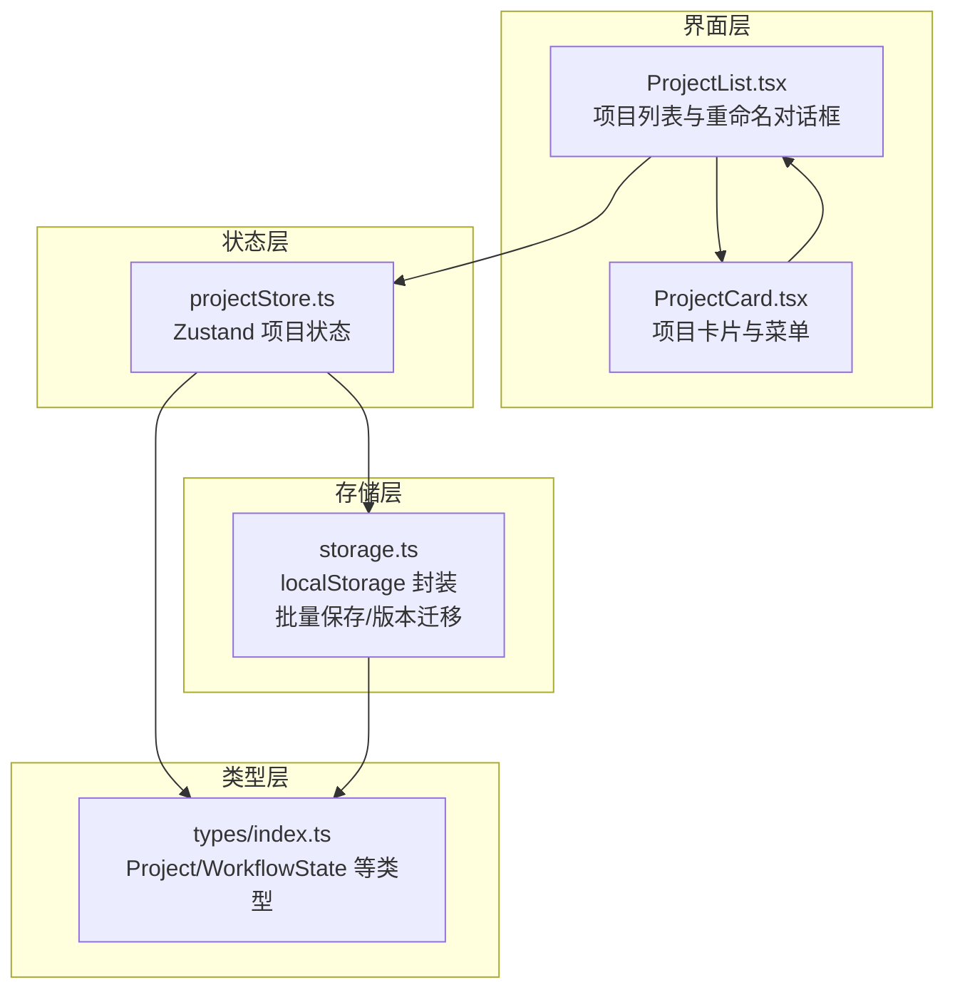
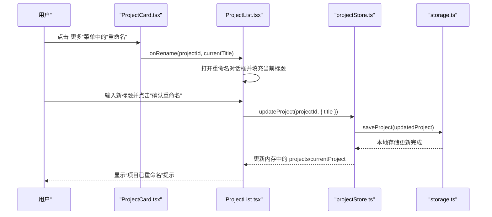
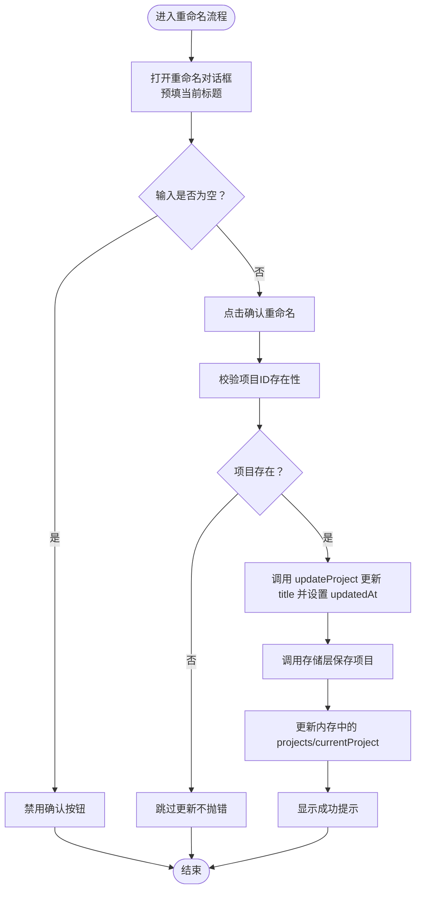

# 项目重命名功能

<cite>
**本文引用的文件**
- [ProjectList.tsx](file://manga-creator/src/components/ProjectList.tsx)
- [ProjectCard.tsx](file://manga-creator/src/components/ProjectCard.tsx)
- [projectStore.ts](file://manga-creator/src/stores/projectStore.ts)
- [storage.ts](file://manga-creator/src/lib/storage.ts)
- [index.ts](file://manga-creator/src/types/index.ts)
- [projectStore.test.ts](file://manga-creator/src/stores/projectStore.test.ts)
- [storage.test.ts](file://manga-creator/src/lib/storage.test.ts)
- [ProjectList.test.tsx](file://manga-creator/src/components/ProjectList.test.tsx)
- [ProjectCard.test.tsx](file://manga-creator/src/components/ProjectCard.test.tsx)
</cite>

## 目录
1. [简介](#简介)
2. [项目结构](#项目结构)
3. [核心组件](#核心组件)
4. [架构总览](#架构总览)
5. [详细组件分析](#详细组件分析)
6. [依赖关系分析](#依赖关系分析)
7. [性能考量](#性能考量)
8. [故障排查指南](#故障排查指南)
9. [结论](#结论)
10. [附录](#附录)

## 简介
本文件聚焦“项目重命名功能”的实现与使用说明，涵盖从界面交互到状态管理、持久化存储的完整链路，并提供可视化流程图帮助理解。读者无需深入源码即可掌握如何在应用中进行项目重命名，同时也能理解其背后的数据模型、错误处理与性能优化策略。

## 项目结构
围绕“项目重命名”，涉及以下关键模块：
- 界面层：项目列表与卡片组件负责触发重命名对话框
- 状态层：项目存储（Zustand）负责加载、创建、更新、删除项目
- 存储层：本地存储封装提供项目读写、批量保存与版本迁移
- 类型层：统一定义项目结构与工作流状态

图表来源
- [ProjectList.tsx](file://manga-creator/src/components/ProjectList.tsx#L1-L416)
- [ProjectCard.tsx](file://manga-creator/src/components/ProjectCard.tsx#L1-L134)
- [projectStore.ts](file://manga-creator/src/stores/projectStore.ts#L1-L124)
- [storage.ts](file://manga-creator/src/lib/storage.ts#L1-L596)
- [index.ts](file://manga-creator/src/types/index.ts#L300-L318)

章节来源
- [ProjectList.tsx](file://manga-creator/src/components/ProjectList.tsx#L1-L416)
- [ProjectCard.tsx](file://manga-creator/src/components/ProjectCard.tsx#L1-L134)
- [projectStore.ts](file://manga-creator/src/stores/projectStore.ts#L1-L124)
- [storage.ts](file://manga-creator/src/lib/storage.ts#L1-L596)
- [index.ts](file://manga-creator/src/types/index.ts#L300-L318)

## 核心组件
- 项目列表组件负责展示项目卡片、搜索过滤、排序以及重命名对话框的打开与提交。
- 项目卡片组件提供“更多”菜单，其中包含“重命名”入口，点击后将把当前项目 ID 与标题回传给父组件。
- 项目存储提供 updateProject 方法，用于更新指定项目的 title 并刷新 updatedAt。
- 存储封装提供 saveProjectImmediate/saveProjectBatched 等方法，确保项目持久化与批量优化。
- 类型定义确保项目结构与工作流状态一致，便于跨层协作。

章节来源
- [ProjectList.tsx](file://manga-creator/src/components/ProjectList.tsx#L140-L158)
- [ProjectCard.tsx](file://manga-creator/src/components/ProjectCard.tsx#L55-L91)
- [projectStore.ts](file://manga-creator/src/stores/projectStore.ts#L92-L110)
- [storage.ts](file://manga-creator/src/lib/storage.ts#L388-L416)
- [index.ts](file://manga-creator/src/types/index.ts#L300-L318)

## 架构总览
项目重命名的端到端流程如下：

图表来源
- [ProjectCard.tsx](file://manga-creator/src/components/ProjectCard.tsx#L55-L91)
- [ProjectList.tsx](file://manga-creator/src/components/ProjectList.tsx#L140-L158)
- [projectStore.ts](file://manga-creator/src/stores/projectStore.ts#L92-L110)
- [storage.ts](file://manga-creator/src/lib/storage.ts#L388-L416)

## 详细组件分析

### 项目卡片组件（ProjectCard）
- 职责：渲染单个项目卡片，提供打开、删除、重命名等操作入口。
- 关键点：
  - 下拉菜单中包含“重命名”选项，点击后回调父组件的 onRename，传入项目 ID 与当前标题。
  - 标题文本支持多语言与特殊字符，渲染层不做截断或转义处理。
  - 使用 memo 优化，仅当关键属性变化时重渲染。

章节来源
- [ProjectCard.tsx](file://manga-creator/src/components/ProjectCard.tsx#L1-L134)

### 项目列表组件（ProjectList）
- 职责：展示项目列表、搜索过滤、排序；承载重命名对话框；调用项目存储进行更新。
- 关键点：
  - handleRenameClick：接收项目 ID 与当前标题，打开对话框并预填当前标题。
  - handleRenameConfirm：校验输入非空后调用 updateProject 更新 title，并显示成功提示。
  - 重命名对话框禁用“确认”按钮当输入为空，避免无效更新。
  - 列表中每个项目卡片通过 onRename 回调触发重命名流程。

章节来源
- [ProjectList.tsx](file://manga-creator/src/components/ProjectList.tsx#L140-L158)
- [ProjectList.tsx](file://manga-creator/src/components/ProjectList.tsx#L364-L399)

### 项目存储（projectStore）
- 职责：管理项目集合与当前项目，提供 load/create/update/delete 等操作。
- 关键点：
  - updateProject：若存在对应项目，构造更新对象并设置 updatedAt，随后调用存储层保存，最后更新内存状态。
  - loadProjects/loadProject：负责从存储加载项目并做旧版样式字段迁移。
  - setCurrentProject：设置当前编辑项目。

章节来源
- [projectStore.ts](file://manga-creator/src/stores/projectStore.ts#L92-L110)
- [projectStore.ts](file://manga-creator/src/stores/projectStore.ts#L38-L68)

### 存储封装（storage）
- 职责：提供项目读写、批量保存、版本迁移、加密配置、数据导出导入等能力。
- 关键点：
  - saveProject/saveProjectImmediate：立即保存或批量保存（带防抖）。
  - saveProjectBatched：内部使用 Map 缓存待保存项目，300ms 合并一次写入，降低 localStorage 写入频率。
  - deleteProject：删除项目并同步清理对应分镜数据。
  - initStorage/runMigrations：启动时执行版本迁移，失败时自动回滚备份。

章节来源
- [storage.ts](file://manga-creator/src/lib/storage.ts#L14-L36)
- [storage.ts](file://manga-creator/src/lib/storage.ts#L388-L416)
- [storage.ts](file://manga-creator/src/lib/storage.ts#L418-L430)
- [storage.ts](file://manga-creator/src/lib/storage.ts#L344-L356)
- [storage.ts](file://manga-creator/src/lib/storage.ts#L264-L302)

### 类型定义（types/index.ts）
- 职责：统一项目结构、工作流状态、画风配置等类型，保证跨层一致性。
- 关键点：
  - Project 接口包含 id/title/summary/style/artStyleConfig/protagonist/workflowState/currentSceneOrder/createdAt/updatedAt 等字段。
  - 旧版 style 字段保留兼容，迁移至 artStyleConfig。

章节来源
- [index.ts](file://manga-creator/src/types/index.ts#L300-L318)

## 依赖关系分析
- 组件依赖：
  - ProjectList 依赖 ProjectCard、useProjectStore、useToast、UI 组件库。
  - ProjectCard 依赖 UI 组件库、DropdownMenu、memo 优化。
- 状态依赖：
  - ProjectList 通过 useProjectStore 的 updateProject setCurrentProject 等方法与状态层交互。
- 存储依赖：
  - projectStore 依赖 storage 的 getProjects/getProject/saveProject/deleteProject 等方法。
- 类型依赖：
  - 所有模块共享 types/index.ts 中的 Project/WorkflowState 等类型。

图表来源
- [ProjectCard.tsx](file://manga-creator/src/components/ProjectCard.tsx#L1-L134)
- [ProjectList.tsx](file://manga-creator/src/components/ProjectList.tsx#L1-L416)
- [projectStore.ts](file://manga-creator/src/stores/projectStore.ts#L1-L124)
- [storage.ts](file://manga-creator/src/lib/storage.ts#L1-L596)
- [index.ts](file://manga-creator/src/types/index.ts#L300-L318)

章节来源
- [ProjectCard.tsx](file://manga-creator/src/components/ProjectCard.tsx#L1-L134)
- [ProjectList.tsx](file://manga-creator/src/components/ProjectList.tsx#L1-L416)
- [projectStore.ts](file://manga-creator/src/stores/projectStore.ts#L1-L124)
- [storage.ts](file://manga-creator/src/lib/storage.ts#L1-L596)
- [index.ts](file://manga-creator/src/types/index.ts#L300-L318)

## 性能考量
- 批量保存与防抖：
  - storage.ts 中对项目保存采用防抖合并（300ms），减少 localStorage 写入次数，提升频繁更新场景下的性能。
- 计算优化：
  - ProjectCard 使用 useMemo/memo 缓存进度计算与渲染，避免不必要的重渲染。
- 本地存储写入策略：
  - saveProjectImmediate 用于关键操作（如重命名）确保即时落盘；saveProjectBatched 用于高频更新场景合并写入。

章节来源
- [storage.ts](file://manga-creator/src/lib/storage.ts#L14-L36)
- [ProjectCard.tsx](file://manga-creator/src/components/ProjectCard.tsx#L1-L134)
- [storage.ts](file://manga-creator/src/lib/storage.ts#L388-L416)

## 故障排查指南
- 重命名无效或未生效
  - 检查输入是否为空：重命名对话框在输入为空时会禁用“确认”按钮。
  - 查看控制台错误：storage.ts 在保存失败时会抛出异常，可在浏览器开发者工具中查看。
  - 确认项目是否存在：projectStore.updateProject 对不存在的 ID 不会抛错，但也不会保存。
- 数据损坏或丢失
  - storage.ts 在初始化时执行版本迁移，失败会自动回滚备份；可检查本地存储键值是否被破坏。
- 性能问题
  - 若频繁重命名导致写入压力大，建议使用 saveProjectBatched 合并更新，或减少重命名频率。

章节来源
- [ProjectList.tsx](file://manga-creator/src/components/ProjectList.tsx#L140-L158)
- [storage.ts](file://manga-creator/src/lib/storage.ts#L388-L416)
- [projectStore.test.ts](file://manga-creator/src/stores/projectStore.test.ts#L399-L405)
- [storage.test.ts](file://manga-creator/src/lib/storage.test.ts#L323-L342)

## 结论
项目重命名功能通过“卡片菜单 → 列表对话框 → 状态更新 → 存储落盘”的清晰链路实现，具备良好的用户体验与健壮的错误处理。配合批量保存与缓存机制，能够在高频更新场景下保持流畅体验。建议在实际使用中：
- 保持标题简洁明确，避免过长字符串影响 UI 渲染。
- 避免在短时间内连续重命名同一项目，减少写入压力。
- 如遇异常，优先检查输入合法性与本地存储状态。

## 附录

### 重命名流程图（算法视角）

图表来源
- [ProjectList.tsx](file://manga-creator/src/components/ProjectList.tsx#L140-L158)
- [projectStore.ts](file://manga-creator/src/stores/projectStore.ts#L92-L110)
- [storage.ts](file://manga-creator/src/lib/storage.ts#L388-L416)

### 关键接口与职责对照
- ProjectList.handleRenameClick：打开对话框并预填当前标题
- ProjectList.handleRenameConfirm：校验输入并调用 updateProject
- ProjectCard.onRename：将项目 ID 与当前标题回传给父组件
- projectStore.updateProject：更新项目并设置 updatedAt
- storage.saveProject/saveProjectImmediate：持久化项目

章节来源
- [ProjectList.tsx](file://manga-creator/src/components/ProjectList.tsx#L140-L158)
- [ProjectCard.tsx](file://manga-creator/src/components/ProjectCard.tsx#L55-L91)
- [projectStore.ts](file://manga-creator/src/stores/projectStore.ts#L92-L110)
- [storage.ts](file://manga-creator/src/lib/storage.ts#L388-L416)