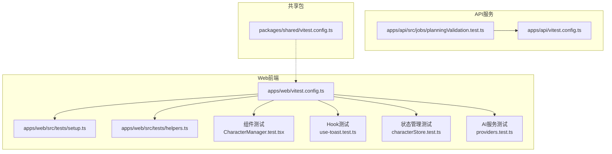
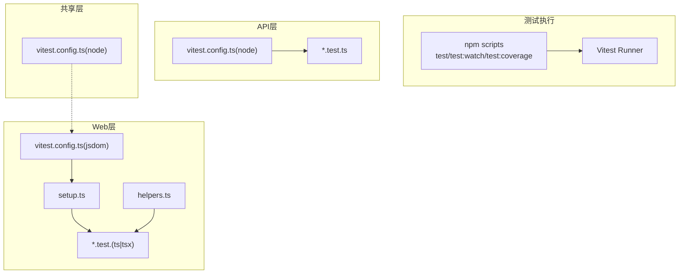
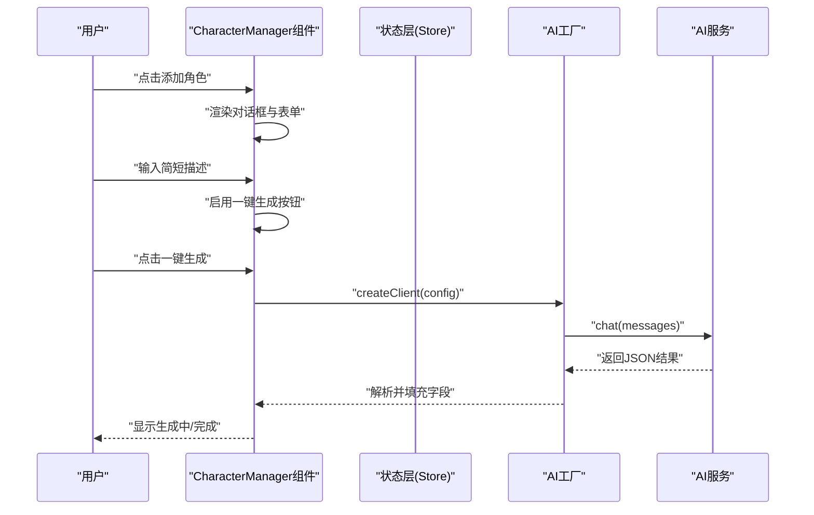
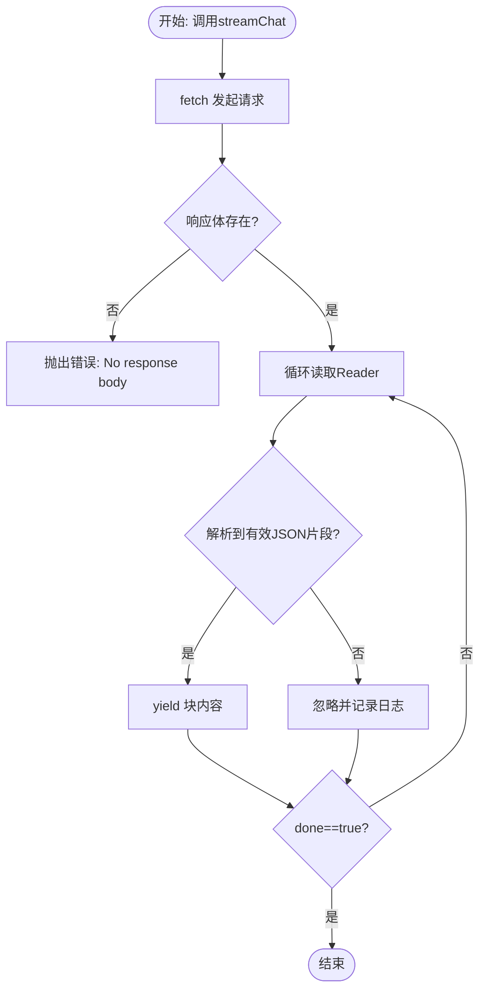
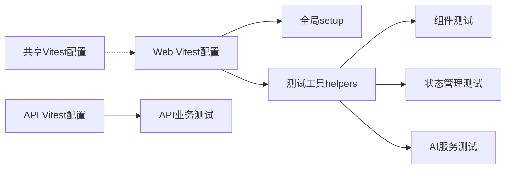

# 单元测试

<cite>
**本文引用的文件**   
- [apps/web/vitest.config.ts](file://apps/web/vitest.config.ts)
- [apps/web/src/tests/setup.ts](file://apps/web/src/tests/setup.ts)
- [apps/web/tsconfig.test.json](file://apps/web/tsconfig.test.json)
- [apps/web/package.json](file://apps/web/package.json)
- [apps/web/src/components/editor/CharacterManager.test.tsx](file://apps/web/src/components/editor/CharacterManager.test.tsx)
- [apps/web/src/hooks/use-toast.test.ts](file://apps/web/src/hooks/use-toast.test.ts)
- [apps/web/src/stores/characterStore.test.ts](file://apps/web/src/stores/characterStore.test.ts)
- [apps/web/src/lib/ai/providers/providers.test.ts](file://apps/web/src/lib/ai/providers/providers.test.ts)
- [apps/web/src/lib/ai/contextBuilder.test.ts](file://apps/web/src/lib/ai/contextBuilder.test.ts)
- [apps/web/src/lib/ai/cascadeUpdater.test.ts](file://apps/web/src/lib/ai/cascadeUpdater.test.ts)
- [apps/web/src/tests/helpers.ts](file://apps/web/src/tests/helpers.ts)
- [apps/api/src/jobs/planningValidation.test.ts](file://apps/api/src/jobs/planningValidation.test.ts)
- [apps/api/vitest.config.ts](file://apps/api/vitest.config.ts)
- [packages/shared/vitest.config.ts](file://packages/shared/vitest.config.ts)
</cite>

## 目录

1. [引言](#引言)
2. [项目结构](#项目结构)
3. [核心组件](#核心组件)
4. [架构总览](#架构总览)
5. [详细组件分析](#详细组件分析)
6. [依赖关系分析](#依赖关系分析)
7. [性能考量](#性能考量)
8. [故障排查指南](#故障排查指南)
9. [结论](#结论)
10. [附录](#附录)

## 引言

本文件面向AIXSSS项目的单元测试体系，系统梳理Vitest测试框架在前端Web应用、API服务与共享包中的配置与使用，覆盖测试环境设置、断言策略、覆盖率要求、组件测试（React组件、Hook、状态管理）、服务层测试（AI服务、工作流、数据处理）、测试数据与模拟对象、异步测试处理、测试工具与最佳实践等内容。目标是帮助开发者快速上手并高质量维护测试代码。

## 项目结构

AIXSSS采用多包工作区结构，测试相关的关键位置如下：

- Web前端：apps/web 下的 Vitest 配置、测试入口与测试工具
- API服务：apps/api 下的 Vitest 配置与业务逻辑测试
- 共享包：packages/shared 下的 Vitest 配置与共享测试配置
- 测试辅助：apps/web/src/tests/helpers.ts 提供统一的测试数据与工具

图表来源

- [apps/web/vitest.config.ts](file://apps/web/vitest.config.ts#L1-L47)
- [apps/web/src/tests/setup.ts](file://apps/web/src/tests/setup.ts#L1-L68)
- [apps/web/src/tests/helpers.ts](file://apps/web/src/tests/helpers.ts#L1-L352)
- [apps/web/src/components/editor/CharacterManager.test.tsx](file://apps/web/src/components/editor/CharacterManager.test.tsx#L1-L898)
- [apps/web/src/hooks/use-toast.test.ts](file://apps/web/src/hooks/use-toast.test.ts#L1-L274)
- [apps/web/src/stores/characterStore.test.ts](file://apps/web/src/stores/characterStore.test.ts#L1-L701)
- [apps/web/src/lib/ai/providers/providers.test.ts](file://apps/web/src/lib/ai/providers/providers.test.ts#L1-L797)
- [apps/api/src/jobs/planningValidation.test.ts](file://apps/api/src/jobs/planningValidation.test.ts#L1-L60)
- [apps/api/vitest.config.ts](file://apps/api/vitest.config.ts#L1-L12)
- [packages/shared/vitest.config.ts](file://packages/shared/vitest.config.ts#L1-L12)

章节来源

- [apps/web/vitest.config.ts](file://apps/web/vitest.config.ts#L1-L47)
- [apps/web/src/tests/setup.ts](file://apps/web/src/tests/setup.ts#L1-L68)
- [apps/web/src/tests/helpers.ts](file://apps/web/src/tests/helpers.ts#L1-L352)
- [apps/api/src/jobs/planningValidation.test.ts](file://apps/api/src/jobs/planningValidation.test.ts#L1-L60)
- [apps/api/vitest.config.ts](file://apps/api/vitest.config.ts#L1-L12)
- [packages/shared/vitest.config.ts](file://packages/shared/vitest.config.ts#L1-L12)

## 核心组件

- 测试运行器与环境
  - Web端使用 jsdom 环境，启用全局钩子与setupFiles，支持CSS与超时放宽；覆盖率使用v8提供程序，报告器包含text、lcov、html，阈值为行/函数/语句70%，分支60%。
  - API端使用 node 环境，仅包含 .test.ts 文件。
  - 共享包使用 node 环境，用于通用测试配置复用。
- 测试入口与工具
  - setup.ts 注入 @testing-library/jest-dom/vitest，全局Mock ResizeObserver、localStorage、matchMedia，每次测试前后清理与还原。
  - helpers.ts 提供统一的测试数据工厂、store初始化与重置、异步等待、fetch与localStorage异常模拟等工具。
- 断言与覆盖率
  - 断言策略以行为驱动，强调交互、状态变更、错误路径与边界条件；覆盖率阈值作为质量门槛，CI中逐步提升。

章节来源

- [apps/web/vitest.config.ts](file://apps/web/vitest.config.ts#L13-L46)
- [apps/web/src/tests/setup.ts](file://apps/web/src/tests/setup.ts#L1-L68)
- [apps/web/tsconfig.test.json](file://apps/web/tsconfig.test.json#L1-L15)
- [apps/web/package.json](file://apps/web/package.json#L16-L18)
- [apps/api/vitest.config.ts](file://apps/api/vitest.config.ts#L1-L12)
- [packages/shared/vitest.config.ts](file://packages/shared/vitest.config.ts#L1-L12)

## 架构总览

Vitest在各模块的职责分工清晰：Web前端负责组件与状态管理的端到端测试；API负责业务规则与数据处理的验证；共享包提供通用配置与约束。整体通过统一的脚本命令与覆盖率报告串联。

图表来源

- [apps/web/vitest.config.ts](file://apps/web/vitest.config.ts#L6-L46)
- [apps/web/src/tests/setup.ts](file://apps/web/src/tests/setup.ts#L1-L68)
- [apps/web/src/tests/helpers.ts](file://apps/web/src/tests/helpers.ts#L1-L352)
- [apps/api/vitest.config.ts](file://apps/api/vitest.config.ts#L1-L12)
- [packages/shared/vitest.config.ts](file://packages/shared/vitest.config.ts#L1-L12)
- [apps/web/package.json](file://apps/web/package.json#L16-L18)

## 详细组件分析

### 组件测试：CharacterManager

- 测试范围
  - 数据加载：挂载与projectId变化时的行为、重复渲染去重。
  - 基础渲染：空态、有角色列表、标题文案等。
  - 对话框交互：打开/关闭、必填项校验、下一步按钮禁用逻辑。
  - AI生成：一键生成按钮可用性、调用AI服务、prompt拼接、生成中状态、错误提示、配置缺失提示。
  - 两步式流程：步骤指示器、基础信息到定妆照提示词的流转、下一步禁用条件。
  - 定妆照提示词：多格式生成与复制按钮展示。
  - 画风传递：项目画风注入到AI prompt。
  - 编辑/删除：打开编辑对话框、预填充、删除确认与调用。
- 关键断言与策略
  - 使用 userEvent 进行真实交互，结合 @testing-library/react 的查询与waitFor等待异步。
  - 大量 vi.mock 与 vi.mocked 替换外部依赖（store、AI工厂），保证测试隔离。
  - 通过 act 包裹异步resolve，避免并发导致的不稳定。
- 覆盖要点
  - 输入校验、按钮状态、异步加载、错误处理、本地草稿恢复（localStorage）。

图表来源

- [apps/web/src/components/editor/CharacterManager.test.tsx](file://apps/web/src/components/editor/CharacterManager.test.tsx#L350-L378)
- [apps/web/src/components/editor/CharacterManager.test.tsx](file://apps/web/src/components/editor/CharacterManager.test.tsx#L406-L452)

章节来源

- [apps/web/src/components/editor/CharacterManager.test.tsx](file://apps/web/src/components/editor/CharacterManager.test.tsx#L1-L898)

### Hook测试：use-toast

- 测试范围
  - reducer对ADD_TOAST、UPDATE_TOAST、DISMISS_TOAST、REMOVE_TOAST的处理。
  - TOAST_LIMIT限制与列表顺序。
  - 边界情况：空toasts、全字段toast、destructive变体。
  - 不可变性：不修改原始状态引用。
- 断言策略
  - 使用expect.objectContaining与toMatchObject进行结构断言。
  - 通过引用对比验证不可变性。

章节来源

- [apps/web/src/hooks/use-toast.test.ts](file://apps/web/src/hooks/use-toast.test.ts#L1-L274)

### 状态管理测试：characterStore

- 测试范围
  - 增删改查：add/update/delete/getCharactersByProject。
  - 新字段：briefDescription、portraitPrompts、primaryColor/secondaryColor、customStyle。
  - 持久化：localStorage存取与格式校验。
  - 行为：recordAppearance（同场景去重更新）、setCurrentCharacter。
  - 加载：loadCharacters从localStorage恢复。
- 断言策略
  - 使用 vi.mocked 替换localStorage，断言setItem调用与序列化数据。
  - 通过时间戳验证更新逻辑。

章节来源

- [apps/web/src/stores/characterStore.test.ts](file://apps/web/src/stores/characterStore.test.ts#L1-L701)

### AI服务测试：providers

- 测试范围
  - DeepSeekProvider：chat/streamChat、baseURL处理、错误响应、usage解析、跨块流数据拼接。
  - OpenAICompatibleProvider：chat/streamChat、gpt-5特殊路径、/v1/responses兜底、参数映射。
  - GeminiProvider：chat/streamChat、消息格式转换、认证头、usage解析。
  - 跨Provider边界：空消息、网络错误、超时。
- 断言策略
  - vi.spyOn global.fetch，构造Response或ReadableStream Reader模拟。
  - 断言URL、Header、Body与错误消息格式。

图表来源

- [apps/web/src/lib/ai/providers/providers.test.ts](file://apps/web/src/lib/ai/providers/providers.test.ts#L156-L276)
- [apps/web/src/lib/ai/providers/providers.test.ts](file://apps/web/src/lib/ai/providers/providers.test.ts#L422-L482)
- [apps/web/src/lib/ai/providers/providers.test.ts](file://apps/web/src/lib/ai/providers/providers.test.ts#L641-L729)

章节来源

- [apps/web/src/lib/ai/providers/providers.test.ts](file://apps/web/src/lib/ai/providers/providers.test.ts#L1-L797)

### 工作流与数据处理测试：contextBuilder 与 cascadeUpdater

- contextBuilder
  - 构建角色上下文、画风上下文、世界观上下文与完整上下文，处理缺失与格式化。
- cascadeUpdater
  - 分析项目设置与场景变更的影响，生成更新计划、排序与摘要，支持快照与AI智能分析。

章节来源

- [apps/web/src/lib/ai/contextBuilder.test.ts](file://apps/web/src/lib/ai/contextBuilder.test.ts#L1-L200)
- [apps/web/src/lib/ai/cascadeUpdater.test.ts](file://apps/web/src/lib/ai/cascadeUpdater.test.ts#L1-L200)

### API服务测试：planningValidation

- 测试范围
  - 当存在 artStyleConfig.fullPrompt 时优先使用；当 summary 过短或 style 缺失时返回不可规划。
  - 支持可配置最小摘要长度。
- 断言策略
  - 使用 expect.objectContaining 与条件判断 missingFields 字段。

章节来源

- [apps/api/src/jobs/planningValidation.test.ts](file://apps/api/src/jobs/planningValidation.test.ts#L1-L60)

## 依赖关系分析

- 配置依赖
  - Web端 vitest.config.ts 依赖 jsdom、@vitejs/plugin-react、setup.ts。
  - API端 vitest.config.ts 依赖 node 环境。
  - 共享端 vitest.config.ts 依赖 node 环境。
- 工具依赖
  - helpers.ts 为所有测试提供统一数据与mock工具，降低重复。
- 测试耦合
  - 组件测试通过 vi.mock 隔离外部依赖，降低耦合；状态管理测试依赖 localStorage，需在setup.ts中统一Mock。

图表来源

- [apps/web/vitest.config.ts](file://apps/web/vitest.config.ts#L6-L46)
- [apps/web/src/tests/setup.ts](file://apps/web/src/tests/setup.ts#L1-L68)
- [apps/web/src/tests/helpers.ts](file://apps/web/src/tests/helpers.ts#L1-L352)
- [apps/api/vitest.config.ts](file://apps/api/vitest.config.ts#L1-L12)
- [packages/shared/vitest.config.ts](file://packages/shared/vitest.config.ts#L1-L12)

章节来源

- [apps/web/vitest.config.ts](file://apps/web/vitest.config.ts#L1-L47)
- [apps/web/src/tests/setup.ts](file://apps/web/src/tests/setup.ts#L1-L68)
- [apps/web/src/tests/helpers.ts](file://apps/web/src/tests/helpers.ts#L1-L352)
- [apps/api/vitest.config.ts](file://apps/api/vitest.config.ts#L1-L12)
- [packages/shared/vitest.config.ts](file://packages/shared/vitest.config.ts#L1-L12)

## 性能考量

- 超时放宽：Web端将 test/hook 超时提升至15秒，避免在CI/低资源环境下的误判超时。
- 并发与稳定性：通过 vi.clearAllMocks/vi.restoreAllMocks 与 beforeEach/afterEach 清理，减少全局状态污染。
- 覆盖率阈值：以“防回退”为目标逐步提升，平衡覆盖率与开发效率。
- 异步控制：使用 act 包裹Promise resolve，避免并发导致的用例波动。

章节来源

- [apps/web/vitest.config.ts](file://apps/web/vitest.config.ts#L18-L21)
- [apps/web/src/tests/setup.ts](file://apps/web/src/tests/setup.ts#L55-L63)

## 故障排查指南

- 常见问题
  - ResizeObserver/Storage/MediaQuery 报错：已在 setup.ts 中Mock，若仍有问题检查是否被外部代码覆盖。
  - fetch/mock 未生效：确认 vi.spyOn/globalThis.fetch 的调用时机与作用域。
  - localStorage quota exceeded：使用 helpers.ts 中的 mockLocalStorageQuotaExceeded 辅助函数。
  - 异步等待超时：使用 helpers.ts 中的 waitFor/waitForAsyncUpdate 控制等待条件与间隔。
- 排查步骤
  - 启用 watch 模式定位失败用例。
  - 逐步缩小范围：注释无关mock，仅保留必要依赖。
  - 使用 console.error/spy 捕获底层异常。

章节来源

- [apps/web/src/tests/setup.ts](file://apps/web/src/tests/setup.ts#L4-L68)
- [apps/web/src/tests/helpers.ts](file://apps/web/src/tests/helpers.ts#L277-L307)

## 结论

AIXSSS的单元测试体系以Vitest为核心，结合Web端jsdom环境、API端node环境与共享配置，形成了覆盖前端组件、Hook、状态管理、AI服务、工作流与数据处理的完整测试矩阵。通过统一的测试工具与严格的断言策略，配合合理的覆盖率阈值与超时放宽，既保障了测试稳定性，也为持续改进提供了抓手。

## 附录

- 测试脚本与命令
  - test：运行全部测试
  - test:watch：监听模式
  - test:coverage：生成覆盖率报告
- 覆盖率阈值
  - 行/函数/语句：70%
  - 分支：60%

章节来源

- [apps/web/package.json](file://apps/web/package.json#L16-L18)
- [apps/web/vitest.config.ts](file://apps/web/vitest.config.ts#L22-L32)
