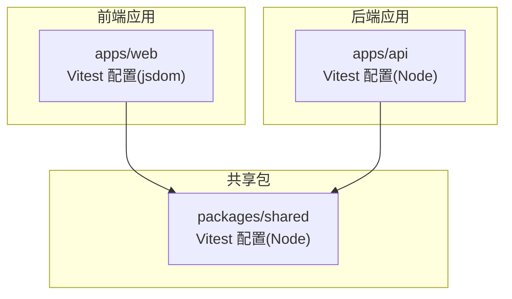
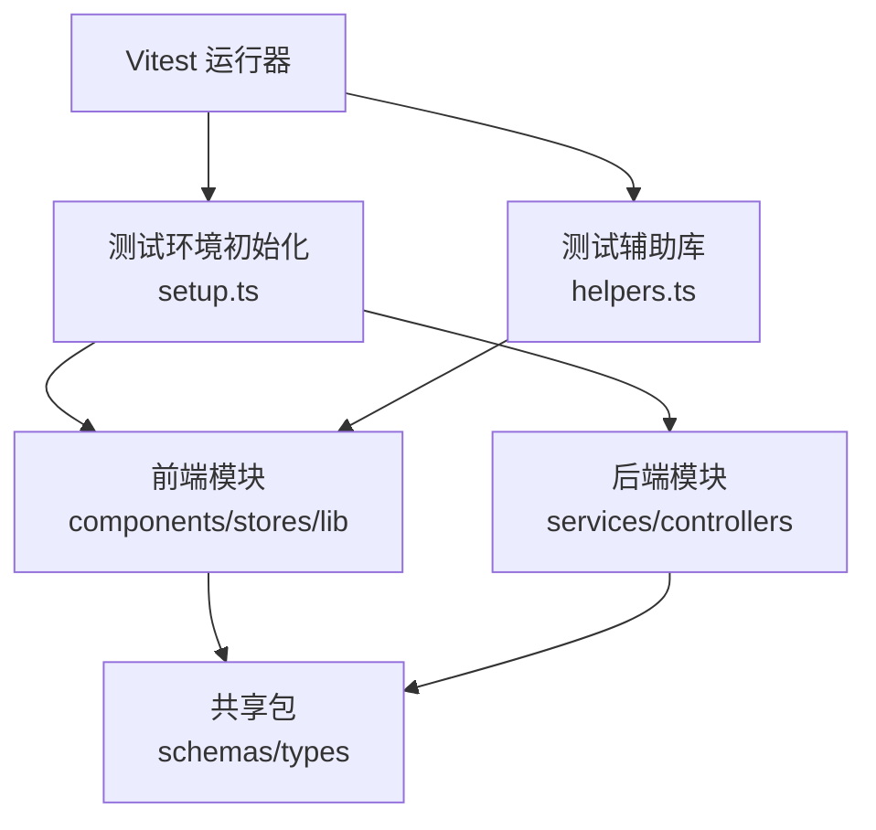
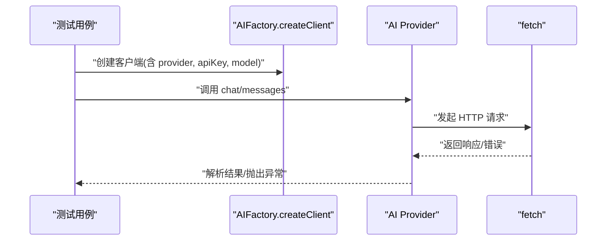
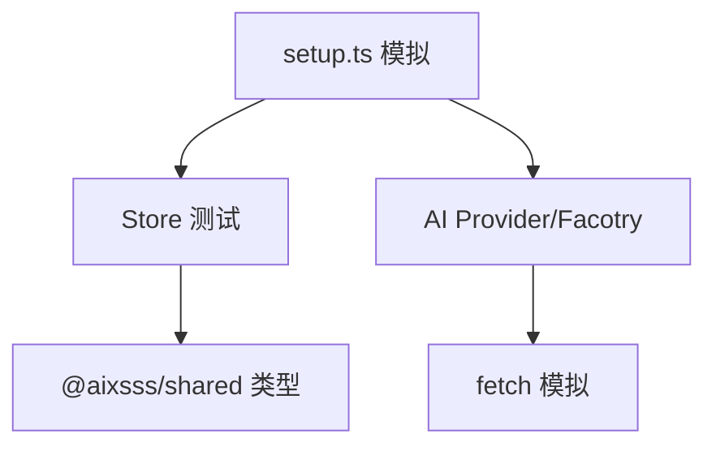

# 测试策略

<cite>
**本文引用的文件**
- [apps/api/vitest.config.ts](file://apps/api/vitest.config.ts)
- [apps/web/vitest.config.ts](file://apps/web/vitest.config.ts)
- [packages/shared/vitest.config.ts](file://packages/shared/vitest.config.ts)
- [apps/web/tsconfig.test.json](file://apps/web/tsconfig.test.json)
- [apps/api/package.json](file://apps/api/package.json)
- [apps/web/package.json](file://apps/web/package.json)
- [packages/shared/package.json](file://packages/shared/package.json)
- [apps/web/src/tests/setup.ts](file://apps/web/src/tests/setup.ts)
- [apps/web/src/tests/helpers.ts](file://apps/web/src/tests/helpers.ts)
- [apps/web/src/lib/ai/factory.test.ts](file://apps/web/src/lib/ai/factory.test.ts)
- [apps/web/src/lib/ai/providers/providers.test.ts](file://apps/web/src/lib/ai/providers/providers.test.ts)
- [apps/web/src/stores/projectStore.test.ts](file://apps/web/src/stores/projectStore.test.ts)
- [apps/api/src/jobs/planningValidation.test.ts](file://apps/api/src/jobs/planningValidation.test.ts)
- [apps/web/src/lib/systemPrompts/index.api.test.ts](file://apps/web/src/lib/systemPrompts/index.api.test.ts)
</cite>

## 目录

1. [引言](#引言)
2. [项目结构](#项目结构)
3. [核心组件](#核心组件)
4. [架构总览](#架构总览)
5. [详细组件分析](#详细组件分析)
6. [依赖关系分析](#依赖关系分析)
7. [性能考量](#性能考量)
8. [故障排查指南](#故障排查指南)
9. [结论](#结论)
10. [附录](#附录)

## 引言

本测试策略文档面向 AIXSSS 项目，系统化阐述单元测试、集成测试与端到端测试的实施策略，覆盖前端组件、服务层与 API 接口测试；详述 Vitest 测试框架配置、测试环境设置与断言策略；明确测试数据管理、模拟对象使用与异步测试处理；针对 AI 相关功能提出测试挑战与 Mock 策略，并给出性能测试方法、覆盖率要求、持续集成配置与自动化测试流程建议，最后提供测试最佳实践、调试技巧与常见问题解决方案。

## 项目结构

AIXSSS 采用多包工作区结构，包含后端 API 应用、Web 前端应用与共享包，分别配置独立的 Vitest 运行环境与覆盖率阈值。前端测试通过 jsdom 环境运行，具备 DOM 与浏览器 API 的模拟能力；后端与共享包在 Node 环境下执行测试。

**图表来源**

- [apps/web/vitest.config.ts](file://apps/web/vitest.config.ts#L1-L47)
- [apps/api/vitest.config.ts](file://apps/api/vitest.config.ts#L1-L12)
- [packages/shared/vitest.config.ts](file://packages/shared/vitest.config.ts#L1-L12)

**章节来源**

- [apps/web/vitest.config.ts](file://apps/web/vitest.config.ts#L1-L47)
- [apps/api/vitest.config.ts](file://apps/api/vitest.config.ts#L1-L12)
- [packages/shared/vitest.config.ts](file://packages/shared/vitest.config.ts#L1-L12)

## 核心组件

- 测试框架与环境
  - Vitest：统一的测试运行器与断言库，支持快照、覆盖率与并发执行。
  - 前端测试环境：jsdom，提供 DOM、Window、localStorage、ResizeObserver、matchMedia 等浏览器 API 的模拟。
  - 后端测试环境：Node，适合纯逻辑与服务层测试。
- 断言与匹配器
  - 使用 Vitest 内建断言，结合 @testing-library/jest-dom 的 DOM 匹配器增强可读性。
- 测试数据与辅助工具
  - 统一的测试数据工厂与批量生成器，确保测试隔离与可重复性。
  - 异步等待工具与性能时间模拟，保障异步与计时相关的稳定性。
- Mock 策略
  - fetch、localStorage、performance.now 等关键外部依赖均通过 vi.spyOn 或 hoisted mocks 进行精确控制。
  - 存储层与 API 层通过模块替换与缓存失效机制进行隔离。

**章节来源**

- [apps/web/src/tests/setup.ts](file://apps/web/src/tests/setup.ts#L1-L68)
- [apps/web/src/tests/helpers.ts](file://apps/web/src/tests/helpers.ts#L1-L352)
- [apps/web/package.json](file://apps/web/package.json#L64-L93)

## 架构总览

下图展示测试策略在项目中的分布与交互关系，包括测试运行器、环境配置、模拟层与被测模块之间的依赖。

**图表来源**

- [apps/web/src/tests/setup.ts](file://apps/web/src/tests/setup.ts#L1-L68)
- [apps/web/src/tests/helpers.ts](file://apps/web/src/tests/helpers.ts#L1-L352)
- [apps/web/package.json](file://apps/web/package.json#L22-L62)
- [packages/shared/package.json](file://packages/shared/package.json#L18-L20)

## 详细组件分析

### 前端组件测试

- 测试目标
  - 验证组件渲染、事件交互、状态变更与副作用。
  - 使用 jsdom 环境与 @testing-library/react 进行 DOM 断言。
- 关键策略
  - 使用统一的 setup.ts 注入浏览器 API 模拟与 console spy，减少噪声并保证稳定性。
  - 通过 helpers.ts 提供项目、场景、角色、世界观等测试数据工厂，确保测试数据一致性。
  - 对异步操作使用 waitFor 与 waitForAsyncUpdate，避免竞态与超时误判。
- 示例参考
  - 组件单元测试文件路径示例：apps/web/src/components/editor/EpisodeWorkflow.test.tsx
  - 布局组件测试文件路径示例：apps/web/src/components/layout/AppLayout.test.tsx
  - 主题切换组件测试文件路径示例：apps/web/src/components/ThemeToggle.test.tsx

**章节来源**

- [apps/web/src/tests/setup.ts](file://apps/web/src/tests/setup.ts#L1-L68)
- [apps/web/src/tests/helpers.ts](file://apps/web/src/tests/helpers.ts#L1-L352)

### 服务层测试

- 测试目标
  - 验证业务逻辑、状态管理与数据迁移规则。
- 关键策略
  - 使用 zustand store 的 setState 与动态导入方式重置状态，确保测试隔离。
  - 通过 vi.mock 替换存储层依赖，隔离本地持久化影响。
  - 针对工作流状态迁移与边界条件进行充分断言。
- 示例参考
  - 项目 Store 测试：apps/web/src/stores/projectStore.test.ts
  - 角色 Store 测试：apps/web/src/stores/characterStore.test.ts
  - 配置 Store 测试：apps/web/src/stores/configStore.test.ts

**章节来源**

- [apps/web/src/stores/projectStore.test.ts](file://apps/web/src/stores/projectStore.test.ts#L1-L588)

### API 接口测试

- 测试目标
  - 验证系统提示词列表与更新的 API 行为，确保缓存一致性与错误处理。
- 关键策略
  - 使用 hoisted mocks 精确控制 API 调用次数与返回值。
  - 通过 invalidateSystemPromptsCache 确保每次测试从新加载数据。
- 示例参考
  - 系统提示词 API 测试：apps/web/src/lib/systemPrompts/index.api.test.ts

**章节来源**

- [apps/web/src/lib/systemPrompts/index.api.test.ts](file://apps/web/src/lib/systemPrompts/index.api.test.ts#L1-L80)

### AI 相关功能测试

- 测试目标
  - 验证 AI 工厂与多 Provider 的聊天与流式对话行为、请求结构、错误处理与 token 使用统计。
- 关键策略
  - 使用 vi.spyOn 全局 fetch，构造不同状态的 Response 以覆盖正常与异常路径。
  - 针对流式响应进行跨块数据拼接与无效行过滤的健壮性测试。
  - 验证不同 Provider 的 baseURL、头部与消息格式差异。
- 示例参考
  - AI 工厂测试：apps/web/src/lib/ai/factory.test.ts
  - Provider 测试：apps/web/src/lib/ai/providers/providers.test.ts

**图表来源**

- [apps/web/src/lib/ai/factory.test.ts](file://apps/web/src/lib/ai/factory.test.ts#L115-L206)
- [apps/web/src/lib/ai/providers/providers.test.ts](file://apps/web/src/lib/ai/providers/providers.test.ts#L30-L154)

**章节来源**

- [apps/web/src/lib/ai/factory.test.ts](file://apps/web/src/lib/ai/factory.test.ts#L1-L609)
- [apps/web/src/lib/ai/providers/providers.test.ts](file://apps/web/src/lib/ai/providers/providers.test.ts#L1-L797)

### 计划校验与工作流验证

- 测试目标
  - 验证项目规划可行性校验逻辑，包括最小摘要长度与风格字段检查。
- 关键策略
  - 使用类型化的项目对象与可配置参数，覆盖 artStyleConfig 优先与 fallback 场景。
- 示例参考
  - 计划校验测试：apps/api/src/jobs/planningValidation.test.ts

**章节来源**

- [apps/api/src/jobs/planningValidation.test.ts](file://apps/api/src/jobs/planningValidation.test.ts#L1-L60)

### 测试数据管理与模拟对象

- 测试数据工厂
  - 提供项目、场景、角色、世界观元素与用户配置的生成器，支持覆盖字段与批量生成。
- 异步与性能模拟
  - waitFor/waitForAsyncUpdate 用于稳定异步状态；mockPerformanceNow 用于可控的时间推进。
- 存储与缓存
  - 通过 vi.mock 替换存储层，模拟 QuotaExceededError 等边界情况；API 模式下通过缓存失效与 hoisted mocks 控制。

**章节来源**

- [apps/web/src/tests/helpers.ts](file://apps/web/src/tests/helpers.ts#L1-L352)
- [apps/web/src/lib/systemPrompts/index.api.test.ts](file://apps/web/src/lib/systemPrompts/index.api.test.ts#L4-L16)

## 依赖关系分析

- 模块耦合
  - 前端 Store 依赖 shared 类型与 schemas，测试中通过动态导入与模块替换实现解耦。
  - AI Provider 与工厂依赖统一的 fetch 接口，便于集中 Mock。
- 外部依赖
  - jsdom、@testing-library、console spy 与浏览器 API 模拟构成前端测试基础设施。
  - Node 环境下的 Vitest 与 tsconfig.test.json 支持后端与共享包测试。

**图表来源**

- [apps/web/src/stores/projectStore.test.ts](file://apps/web/src/stores/projectStore.test.ts#L1-L588)
- [apps/web/src/tests/setup.ts](file://apps/web/src/tests/setup.ts#L1-L68)
- [apps/web/src/lib/ai/factory.test.ts](file://apps/web/src/lib/ai/factory.test.ts#L1-L609)

**章节来源**

- [apps/web/src/stores/projectStore.test.ts](file://apps/web/src/stores/projectStore.test.ts#L1-L588)
- [apps/web/src/tests/setup.ts](file://apps/web/src/tests/setup.ts#L1-L68)

## 性能考量

- 异步稳定性
  - 使用 waitFor 与合理的超时配置，避免因 CI/低资源环境导致的误判超时。
- Mock 策略
  - 对 fetch、localStorage、performance.now 等进行精确控制，减少真实 I/O 对测试的影响。
- 并发与资源
  - 在前端 Vitest 配置中提高 testTimeout 与 hookTimeout，降低并发测试下的级联失败风险。

**章节来源**

- [apps/web/vitest.config.ts](file://apps/web/vitest.config.ts#L18-L21)
- [apps/web/src/tests/setup.ts](file://apps/web/src/tests/setup.ts#L1-L68)

## 故障排查指南

- 常见问题
  - 超时误判：提高超时阈值或优化异步等待策略。
  - DOM API 缺失：确认 setup.ts 中的 jsdom 模拟是否生效。
  - Mock 未清理：确保 beforeEach/afterEach 中调用 vi.clearAllMocks/vi.restoreAllMocks。
  - 缓存污染：API 模式下使用 invalidateSystemPromptsCache 确保缓存重置。
- 调试技巧
  - 使用 console.spy 将噪声输出屏蔽，聚焦关键断言。
  - 对流式响应使用小步消费与断言，定位跨块数据拼接问题。
  - 对 Provider 差异进行单测隔离，缩小问题范围。

**章节来源**

- [apps/web/src/tests/setup.ts](file://apps/web/src/tests/setup.ts#L55-L68)
- [apps/web/src/lib/systemPrompts/index.api.test.ts](file://apps/web/src/lib/systemPrompts/index.api.test.ts#L26-L29)

## 结论

本测试策略以 Vitest 为核心，结合 jsdom 与 Node 环境，构建了覆盖前端组件、服务层与 API 的多层次测试体系。通过统一的测试数据工厂、完善的 Mock 策略与异步处理机制，有效应对 AI 相关功能的复杂性与不确定性。建议在 CI 中逐步提升覆盖率阈值，并引入性能回归测试以保障用户体验。

## 附录

### Vitest 配置与脚本

- 前端 Vitest 配置要点
  - 环境：jsdom
  - 超时：testTimeout 与 hookTimeout 提升至 15000ms
  - 覆盖率：provider 为 v8，报告器包含 text、lcov、html，阈值为行/语句 70%，函数 70%，分支 60%
  - 排除：tests 目录、入口文件与类型声明
- 后端与共享包配置
  - 环境：Node
  - 包含：src/\*_/_.test.ts
  - 排除：node_modules、dist

**章节来源**

- [apps/web/vitest.config.ts](file://apps/web/vitest.config.ts#L13-L46)
- [apps/api/vitest.config.ts](file://apps/api/vitest.config.ts#L4-L11)
- [packages/shared/vitest.config.ts](file://packages/shared/vitest.config.ts#L4-L11)

### 测试脚本与覆盖率

- 前端脚本
  - test、test:watch、test:coverage：分别对应运行测试、监听模式与覆盖率输出。
- 后端与共享包脚本
  - test：运行 Vitest 并允许无测试通过(--passWithNoTests)。

**章节来源**

- [apps/web/package.json](file://apps/web/package.json#L16-L20)
- [apps/api/package.json](file://apps/api/package.json#L12)
- [packages/shared/package.json](file://packages/shared/package.json#L16)

### 测试数据与辅助工具清单

- 测试数据工厂
  - createMockProject、createMockScene、createMockCharacter、createMockWorldViewElement、createMockUserConfig
- 批量生成
  - createMockProjects、createMockScenes、createMockCharacters
- Store 辅助
  - resetAllStores、setupStoreWithData
- 异步与性能
  - waitFor、waitForAsyncUpdate、mockPerformanceNow
- Fetch 与错误模拟
  - mockFetchSuccess、mockFetchError、mockLocalStorageQuotaExceeded

**章节来源**

- [apps/web/src/tests/helpers.ts](file://apps/web/src/tests/helpers.ts#L16-L352)
