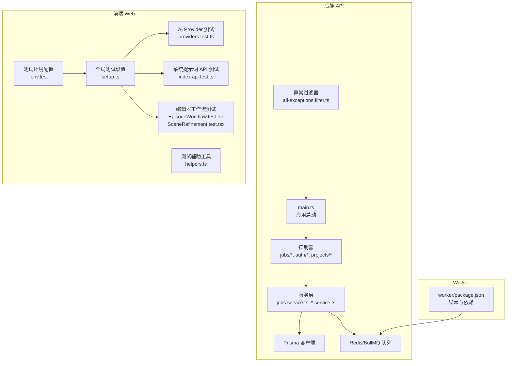
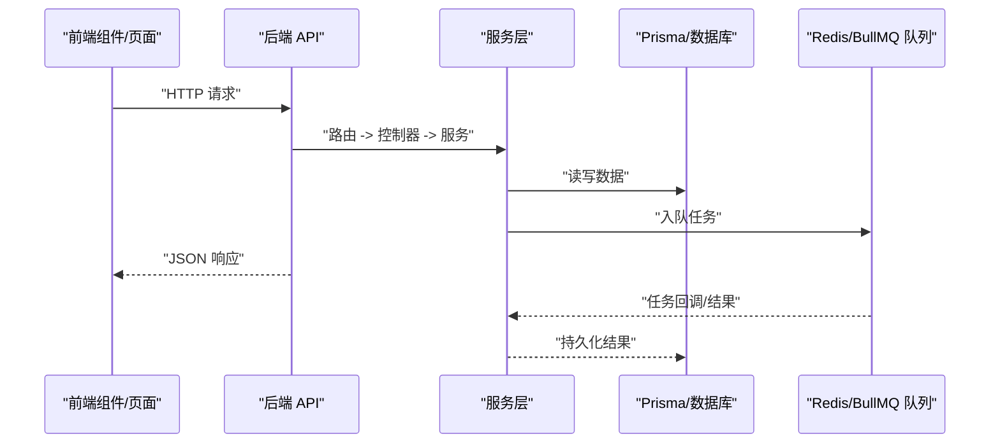
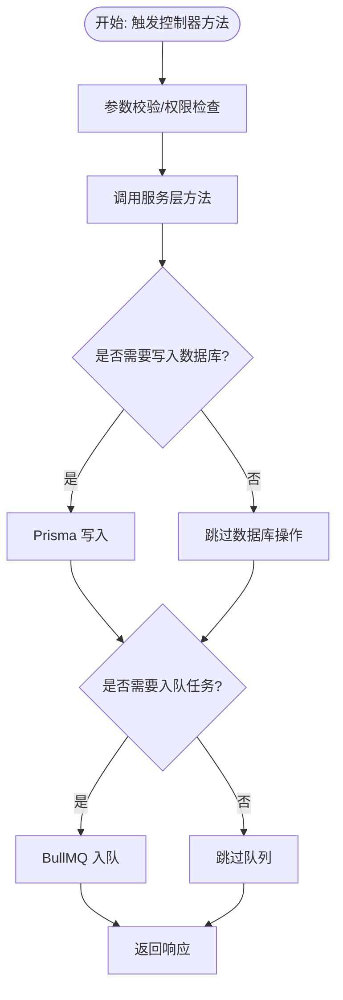
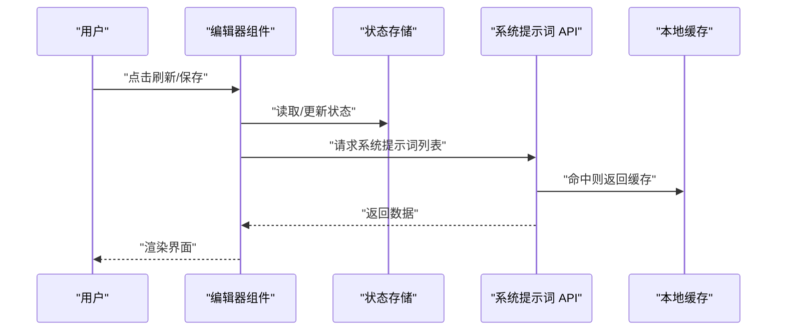
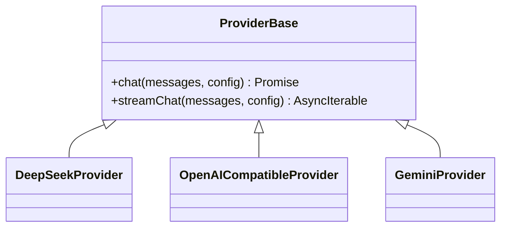
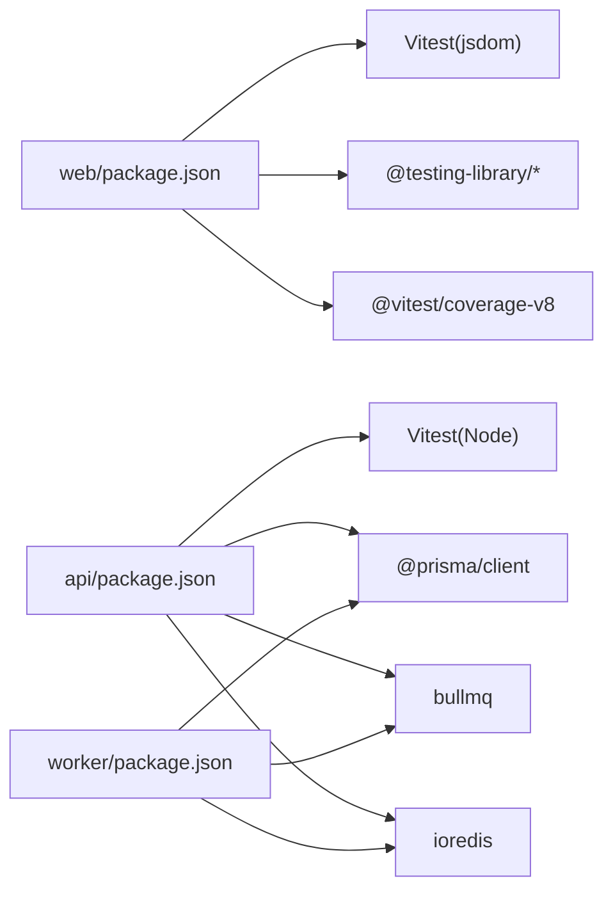

# 集成测试

<cite>
**本文引用的文件**
- [apps/api/vitest.config.ts](file://apps/api/vitest.config.ts)
- [apps/web/vitest.config.ts](file://apps/web/vitest.config.ts)
- [apps/api/src/main.ts](file://apps/api/src/main.ts)
- [apps/api/src/common/all-exceptions.filter.ts](file://apps/api/src/common/all-exceptions.filter.ts)
- [apps/api/src/config/env.ts](file://apps/api/src/config/env.ts)
- [apps/api/package.json](file://apps/api/package.json)
- [apps/web/package.json](file://apps/web/package.json)
- [apps/worker/package.json](file://apps/worker/package.json)
- [apps/web/src/tests/helpers.ts](file://apps/web/src/tests/helpers.ts)
- [apps/web/src/tests/setup.ts](file://apps/web/src/tests/setup.ts)
- [apps/api/src/jobs/planningValidation.test.ts](file://apps/api/src/jobs/planningValidation.test.ts)
- [apps/web/src/lib/systemPrompts/index.api.test.ts](file://apps/web/src/lib/systemPrompts/index.api.test.ts)
- [apps/web/src/lib/ai/providers/providers.test.ts](file://apps/web/src/lib/ai/providers/providers.test.ts)
- [apps/web/src/components/editor/EpisodeWorkflow.test.tsx](file://apps/web/src/components/editor/EpisodeWorkflow.test.tsx)
- [apps/web/src/components/editor/SceneRefinement.test.tsx](file://apps/web/src/components/editor/SceneRefinement.test.tsx)
- [apps/web/.env.test](file://apps/web/.env.test)
</cite>

## 目录

1. [引言](#引言)
2. [项目结构](#项目结构)
3. [核心组件](#核心组件)
4. [架构总览](#架构总览)
5. [详细组件分析](#详细组件分析)
6. [依赖关系分析](#依赖关系分析)
7. [性能考量](#性能考量)
8. [故障排除指南](#故障排除指南)
9. [结论](#结论)
10. [附录](#附录)

## 引言

本文件为 AIXSSS 项目的集成测试文档，聚焦于以下目标：

- API 接口测试：控制器测试、服务层集成测试、数据库操作测试
- 端到端测试：用户工作流测试、跨模块功能测试、系统边界测试
- 测试环境配置、数据库种子数据管理与测试数据清理策略
- AI 作业集成测试、任务队列测试与异步处理测试
- 错误处理、异常情况与边界条件测试
- 测试自动化与持续集成配置、测试报告生成
- 最佳实践与故障排除指南

本项目采用多包结构（apps/api、apps/web、apps/worker），分别对应后端 API、前端 Web 应用与 Worker 任务执行器；测试框架统一使用 Vitest，前端测试环境为 jsdom。

## 项目结构

- 后端 API（NestJS + Fastify + BullMQ + Prisma）
  - 控制器、服务、任务队列、异常过滤器、环境变量校验
- 前端 Web（React + Vite + Vitest + Testing Library）
  - 组件测试、系统提示词 API 测试、AI Provider 测试、编辑器工作流测试
- Worker（BullMQ 任务执行器）
  - AI 任务与工作流任务的实现与测试

图表来源

- [apps/api/src/main.ts](file://apps/api/src/main.ts#L1-L34)
- [apps/api/src/common/all-exceptions.filter.ts](file://apps/api/src/common/all-exceptions.filter.ts#L1-L91)
- [apps/web/src/tests/setup.ts](file://apps/web/src/tests/setup.ts#L1-L68)
- [apps/web/src/tests/helpers.ts](file://apps/web/src/tests/helpers.ts#L1-L352)
- [apps/web/src/lib/ai/providers/providers.test.ts](file://apps/web/src/lib/ai/providers/providers.test.ts#L1-L797)
- [apps/web/src/lib/systemPrompts/index.api.test.ts](file://apps/web/src/lib/systemPrompts/index.api.test.ts#L1-L80)
- [apps/web/src/components/editor/EpisodeWorkflow.test.tsx](file://apps/web/src/components/editor/EpisodeWorkflow.test.tsx#L1-L202)
- [apps/web/src/components/editor/SceneRefinement.test.tsx](file://apps/web/src/components/editor/SceneRefinement.test.tsx#L1-L1182)
- [apps/web/.env.test](file://apps/web/.env.test#L1-L5)
- [apps/worker/package.json](file://apps/worker/package.json#L1-L35)

章节来源

- [apps/api/src/main.ts](file://apps/api/src/main.ts#L1-L34)
- [apps/web/vitest.config.ts](file://apps/web/vitest.config.ts#L1-L47)
- [apps/api/vitest.config.ts](file://apps/api/vitest.config.ts#L1-L12)

## 核心组件

- 测试运行器与环境
  - 后端 API 使用 Vitest，测试环境为 Node，包含全局测试开关、测试文件匹配规则
  - 前端 Web 使用 Vitest + jsdom，启用覆盖率、超时放宽、setupFiles
- 异常处理与统一错误响应
  - 全局异常过滤器将错误标准化为 { statusCode, message, requestId? }，便于测试断言
- 环境变量与配置
  - 后端使用 Zod 校验环境变量，包含数据库、JWT、Redis、队列名、CORS 等
  - 前端测试强制使用本地数据模式，避免依赖后端或网络
- 测试辅助工具
  - 前端提供测试数据工厂、store 重置与初始化、异步等待、fetch mock、localStorage quota mock、performance.now mock 等

章节来源

- [apps/api/vitest.config.ts](file://apps/api/vitest.config.ts#L1-L12)
- [apps/web/vitest.config.ts](file://apps/web/vitest.config.ts#L1-L47)
- [apps/api/src/common/all-exceptions.filter.ts](file://apps/api/src/common/all-exceptions.filter.ts#L1-L91)
- [apps/api/src/config/env.ts](file://apps/api/src/config/env.ts#L1-L17)
- [apps/web/src/tests/helpers.ts](file://apps/web/src/tests/helpers.ts#L1-L352)
- [apps/web/src/tests/setup.ts](file://apps/web/src/tests/setup.ts#L1-L68)
- [apps/web/.env.test](file://apps/web/.env.test#L1-L5)

## 架构总览

集成测试覆盖三层：

- API 层：控制器与服务的端到端验证，结合 Prisma 与 Redis/BullMQ
- 业务层：编辑器工作流、系统提示词缓存、AI Provider 适配
- 任务层：Worker 任务队列与异步处理

图表来源

- [apps/api/src/main.ts](file://apps/api/src/main.ts#L1-L34)
- [apps/api/src/common/all-exceptions.filter.ts](file://apps/api/src/common/all-exceptions.filter.ts#L1-L91)
- [apps/api/src/config/env.ts](file://apps/api/src/config/env.ts#L1-L17)

## 详细组件分析

### API 接口测试策略

- 控制器测试
  - 通过统一异常过滤器保证错误响应格式一致，便于断言
  - 使用 Vitest 的环境隔离与全局配置，确保测试稳定性
- 服务层集成测试
  - 结合 Prisma 客户端进行数据库读写验证
  - 对计划性校验逻辑进行单元测试，覆盖最小摘要长度、风格字段缺失等边界
- 数据库操作测试
  - 使用 Prisma 客户端进行插入/查询/更新/删除验证
  - 配合迁移脚本与 schema.prisma，确保测试环境一致性

图表来源

- [apps/api/src/jobs/planningValidation.test.ts](file://apps/api/src/jobs/planningValidation.test.ts#L1-L60)

章节来源

- [apps/api/src/common/all-exceptions.filter.ts](file://apps/api/src/common/all-exceptions.filter.ts#L1-L91)
- [apps/api/src/jobs/planningValidation.test.ts](file://apps/api/src/jobs/planningValidation.test.ts#L1-L60)

### 端到端测试设计与实现

- 用户工作流测试
  - 编辑器工作流组件测试覆盖步骤导航、面板切换、场景锚点复制等关键路径
  - 通过 store mock 与事件模拟，验证状态变更与 UI 响应
- 跨模块功能测试
  - 系统提示词 API 测试验证缓存读取与更新行为
  - AI Provider 测试覆盖多种模型提供商的聊天与流式响应解析
- 系统边界测试
  - 前端测试强制本地数据模式，避免外部依赖
  - 提供 fetch 错误、localStorage quota、超时等边界场景的 mock

图表来源

- [apps/web/src/lib/systemPrompts/index.api.test.ts](file://apps/web/src/lib/systemPrompts/index.api.test.ts#L1-L80)
- [apps/web/src/components/editor/EpisodeWorkflow.test.tsx](file://apps/web/src/components/editor/EpisodeWorkflow.test.tsx#L1-L202)

章节来源

- [apps/web/src/components/editor/EpisodeWorkflow.test.tsx](file://apps/web/src/components/editor/EpisodeWorkflow.test.tsx#L1-L202)
- [apps/web/src/lib/systemPrompts/index.api.test.ts](file://apps/web/src/lib/systemPrompts/index.api.test.ts#L1-L80)
- [apps/web/src/lib/ai/providers/providers.test.ts](file://apps/web/src/lib/ai/providers/providers.test.ts#L1-L797)
- [apps/web/.env.test](file://apps/web/.env.test#L1-L5)

### AI 作业集成测试、任务队列与异步处理

- AI Provider 测试
  - 覆盖 DeepSeek、OpenAI 兼容、Gemini 三种 Provider 的聊天与流式接口
  - 验证错误码、超时、网络异常、流式数据拼接与跨块解析
- 任务队列测试
  - Worker 包含任务实现与测试文件，可结合 BullMQ 与 Redis 进行队列集成测试
  - 建议在测试环境中使用内存队列或本地 Redis 实例

图表来源

- [apps/web/src/lib/ai/providers/providers.test.ts](file://apps/web/src/lib/ai/providers/providers.test.ts#L1-L797)

章节来源

- [apps/web/src/lib/ai/providers/providers.test.ts](file://apps/web/src/lib/ai/providers/providers.test.ts#L1-L797)
- [apps/worker/package.json](file://apps/worker/package.json#L1-L35)

### 测试环境配置、种子数据与清理策略

- 测试环境配置
  - 前端测试强制本地数据模式，避免依赖后端或网络
  - Vitest 配置启用 jsdom、setupFiles、覆盖率、超时放宽
- 数据库种子与清理
  - 建议在测试前执行 Prisma 迁移与种子脚本，测试结束后清理或回滚
  - 使用事务包裹测试用例，失败时回滚，确保测试隔离
- 前端测试数据清理
  - setup.ts 中清理 localStorage、重置全局 mock、恢复 console spy

章节来源

- [apps/web/.env.test](file://apps/web/.env.test#L1-L5)
- [apps/web/vitest.config.ts](file://apps/web/vitest.config.ts#L1-L47)
- [apps/web/src/tests/setup.ts](file://apps/web/src/tests/setup.ts#L1-L68)

### 错误处理、异常与边界条件测试

- API 层
  - 统一异常过滤器保证错误响应结构一致，便于断言
  - 环境变量校验防止生产配置错误
- 前端层
  - Provider 测试覆盖 4xx/5xx、JSON 解析失败、文本解析失败、流式数据截断等
  - localStorage quota、performance.now、ResizeObserver 等浏览器 API 的 mock

章节来源

- [apps/api/src/common/all-exceptions.filter.ts](file://apps/api/src/common/all-exceptions.filter.ts#L1-L91)
- [apps/api/src/config/env.ts](file://apps/api/src/config/env.ts#L1-L17)
- [apps/web/src/lib/ai/providers/providers.test.ts](file://apps/web/src/lib/ai/providers/providers.test.ts#L1-L797)
- [apps/web/src/tests/setup.ts](file://apps/web/src/tests/setup.ts#L1-L68)

### 测试自动化与持续集成

- 脚本与命令
  - 后端 API：test 脚本运行 Vitest，支持 prisma 相关命令
  - 前端 Web：test/test:coverage 脚本运行 Vitest 与覆盖率
  - Worker：test 脚本运行 Vitest
- 覆盖率与报告
  - 前端 Vitest 配置开启覆盖率与报告生成（lcov/html/text）

章节来源

- [apps/api/package.json](file://apps/api/package.json#L1-L52)
- [apps/web/package.json](file://apps/web/package.json#L1-L95)
- [apps/worker/package.json](file://apps/worker/package.json#L1-L35)
- [apps/web/vitest.config.ts](file://apps/web/vitest.config.ts#L22-L42)

## 依赖关系分析

- 前端测试依赖
  - Testing Library、Vitest、jsdom、@vitest/coverage-v8
  - 本地数据模式与 API 基础路径配置
- 后端测试依赖
  - Vitest、Node 环境、Prisma、BullMQ、Redis
- Worker 依赖
  - BullMQ、ioredis、Prisma、Zod

图表来源

- [apps/web/package.json](file://apps/web/package.json#L1-L95)
- [apps/api/package.json](file://apps/api/package.json#L1-L52)
- [apps/worker/package.json](file://apps/worker/package.json#L1-L35)

章节来源

- [apps/web/package.json](file://apps/web/package.json#L1-L95)
- [apps/api/package.json](file://apps/api/package.json#L1-L52)
- [apps/worker/package.json](file://apps/worker/package.json#L1-L35)

## 性能考量

- 测试超时与并发
  - 前端 Vitest 将测试与钩子超时提高至 15s，避免在 CI/低资源环境下误判
- 覆盖率阈值
  - 前端覆盖率阈值设置为“防回退”门槛，建议在 CI 中逐步提升
- 异步与队列
  - 建议在集成测试中使用内存队列或本地 Redis，减少外部依赖带来的不确定性

章节来源

- [apps/web/vitest.config.ts](file://apps/web/vitest.config.ts#L13-L22)
- [apps/web/vitest.config.ts](file://apps/web/vitest.config.ts#L22-L42)

## 故障排除指南

- 前端测试失败
  - 检查 .env.test 是否强制本地数据模式
  - 确认 setup.ts 中的 mock 是否正确重置
  - 若出现 ResizeObserver 或 localStorage 报错，检查对应 mock
- API 测试失败
  - 检查异常过滤器是否按预期返回 { statusCode, message, requestId? }
  - 确认环境变量配置（DATABASE_URL、JWT_SECRET、REDIS_URL、AI_QUEUE_NAME）
- Provider 测试失败
  - 检查 fetch mock 是否正确返回 ok/json/text
  - 验证流式数据拼接与跨块解析逻辑
- 队列与 Worker
  - 确保 Redis 可用且队列名一致
  - 在测试中使用本地 Redis 或内存队列，避免外部干扰

章节来源

- [apps/web/.env.test](file://apps/web/.env.test#L1-L5)
- [apps/web/src/tests/setup.ts](file://apps/web/src/tests/setup.ts#L1-L68)
- [apps/api/src/common/all-exceptions.filter.ts](file://apps/api/src/common/all-exceptions.filter.ts#L1-L91)
- [apps/api/src/config/env.ts](file://apps/api/src/config/env.ts#L1-L17)
- [apps/web/src/lib/ai/providers/providers.test.ts](file://apps/web/src/lib/ai/providers/providers.test.ts#L1-L797)

## 结论

本集成测试文档基于现有代码与测试文件，构建了覆盖 API、前端、任务队列与异步处理的测试策略。通过统一的异常过滤器、严格的环境配置与完善的测试辅助工具，能够有效保障系统在控制器、服务层与用户工作流层面的稳定性与正确性。建议在 CI 中逐步提升覆盖率阈值，并引入数据库迁移与种子脚本的自动化，以进一步增强测试的可重复性与可靠性。

## 附录

- 关键测试文件索引
  - API 控制器与服务测试：见 jobs 相关测试与 planningValidation.test.ts
  - 前端组件与系统提示词测试：见 EpisodeWorkflow.test.tsx、SceneRefinement.test.tsx、index.api.test.ts
  - AI Provider 测试：见 providers.test.ts
  - 测试环境与辅助工具：见 vitest.config.ts、helpers.ts、setup.ts、.env.test
