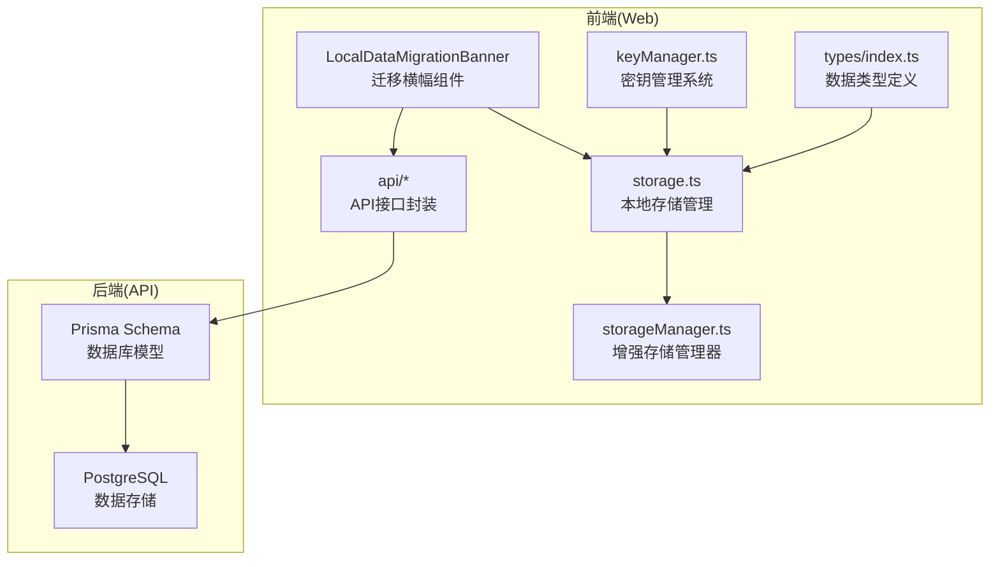
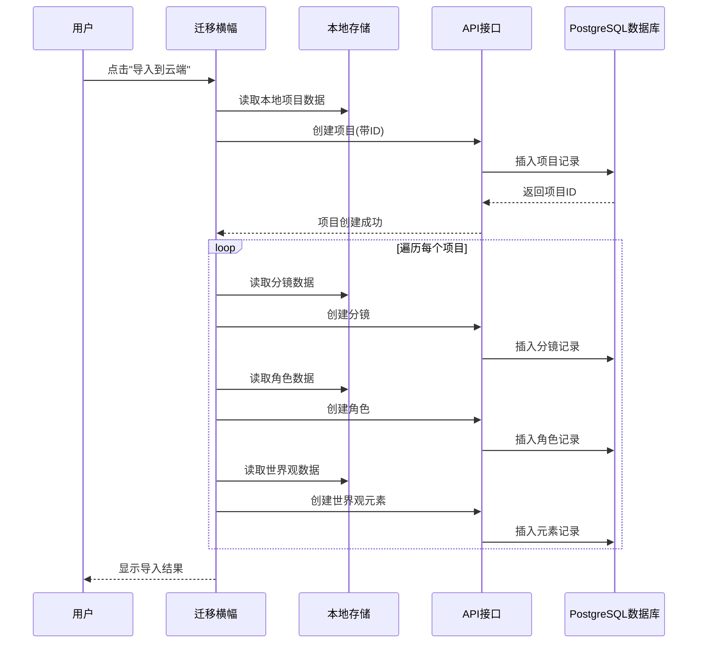
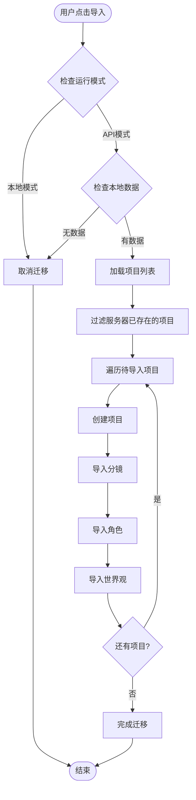
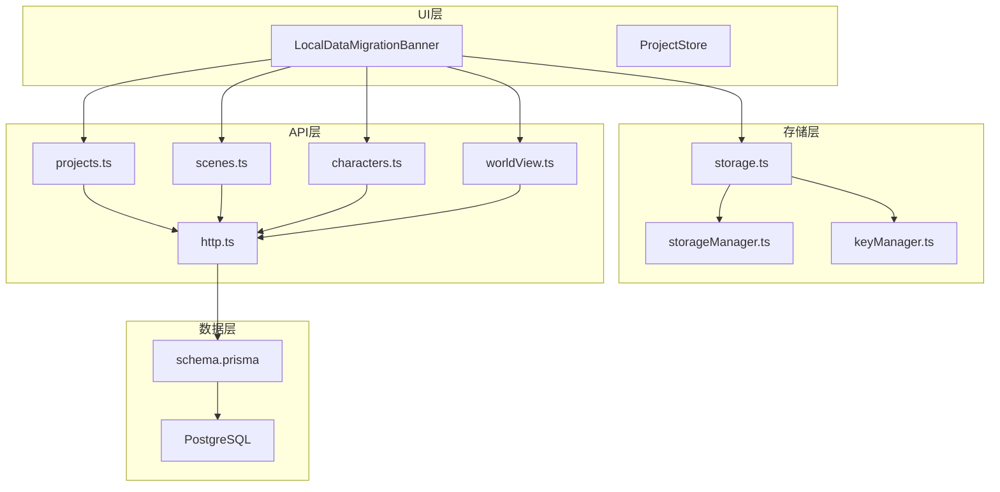

# 本地到API迁移

<cite>
**本文档引用的文件**
- [apps/web/src/components/LocalDataMigrationBanner.tsx](file://apps/web/src/components/LocalDataMigrationBanner.tsx)
- [apps/web/src/lib/storage.ts](file://apps/web/src/lib/storage.ts)
- [apps/web/src/lib/storageManager.ts](file://apps/web/src/lib/storageManager.ts)
- [apps/web/src/lib/api/projects.ts](file://apps/web/src/lib/api/projects.ts)
- [apps/web/src/lib/api/scenes.ts](file://apps/web/src/lib/api/scenes.ts)
- [apps/web/src/lib/api/characters.ts](file://apps/web/src/lib/api/characters.ts)
- [apps/web/src/lib/api/worldView.ts](file://apps/web/src/lib/api/worldView.ts)
- [apps/web/src/lib/api/http.ts](file://apps/web/src/lib/api/http.ts)
- [apps/web/src/lib/runtime/mode.ts](file://apps/web/src/lib/runtime/mode.ts)
- [apps/web/src/lib/keyManager.ts](file://apps/web/src/lib/keyManager.ts)
- [apps/web/src/types/index.ts](file://apps/web/src/types/index.ts)
- [apps/web/src/stores/projectStore.ts](file://apps/web/src/stores/projectStore.ts)
- [apps/api/prisma/schema.prisma](file://apps/api/prisma/schema.prisma)
</cite>

## 目录

1. [简介](#简介)
2. [项目结构](#项目结构)
3. [核心组件](#核心组件)
4. [架构概览](#架构概览)
5. [详细组件分析](#详细组件分析)
6. [依赖关系分析](#依赖关系分析)
7. [性能考虑](#性能考虑)
8. [故障排除指南](#故障排除指南)
9. [结论](#结论)
10. [附录](#附录)

## 简介

AIXSSS项目提供了从浏览器localStorage本地存储到PostgreSQL数据库的完整迁移解决方案。本文档详细解释了迁移流程、数据结构映射、字段转换规则和数据完整性保证机制。

该系统采用"最佳努力"原则，即使部分数据导入失败也不会中断整个迁移过程。迁移过程中实现了完善的错误处理策略、备份机制和回滚方案。

## 项目结构

AIXSSS项目采用前后端分离架构，主要涉及以下关键模块：

**图表来源**

- [apps/web/src/components/LocalDataMigrationBanner.tsx](file://apps/web/src/components/LocalDataMigrationBanner.tsx#L1-L286)
- [apps/web/src/lib/storage.ts](file://apps/web/src/lib/storage.ts#L1-L800)
- [apps/api/prisma/schema.prisma](file://apps/api/prisma/schema.prisma#L1-L351)

**章节来源**

- [apps/web/src/components/LocalDataMigrationBanner.tsx](file://apps/web/src/components/LocalDataMigrationBanner.tsx#L1-L286)
- [apps/web/src/lib/storage.ts](file://apps/web/src/lib/storage.ts#L1-L800)
- [apps/api/prisma/schema.prisma](file://apps/api/prisma/schema.prisma#L1-L351)

## 核心组件

### 迁移触发条件

迁移功能通过以下条件触发：

1. **运行模式检测**：仅在API模式下激活
2. **本地数据存在**：检测到localStorage中有项目数据
3. **服务器状态**：服务器数据加载完成
4. **状态控制**：用户未明确拒绝或已完成迁移

### 数据导入范围限制

迁移过程严格限定导入范围：

- **项目数据**：Project实体及其关联数据
- **分镜数据**：Scene实体（按项目分组）
- **角色数据**：Character实体（按项目分组）
- **世界观数据**：WorldViewElement实体（按项目分组）

### 不导入项及原因

以下数据不会被导入到云端：

- **配置数据**：用户API配置（包含敏感的API密钥）
- **临时工作流状态**：前端专用的临时状态数据
- **缓存数据**：临时性的缓存和中间结果

**章节来源**

- [apps/web/src/components/LocalDataMigrationBanner.tsx](file://apps/web/src/components/LocalDataMigrationBanner.tsx#L110-L115)
- [apps/web/src/lib/storage.ts](file://apps/web/src/lib/storage.ts#L287-L374)

## 架构概览

系统采用三层架构设计，确保数据迁移的安全性和可靠性：

**图表来源**

- [apps/web/src/components/LocalDataMigrationBanner.tsx](file://apps/web/src/components/LocalDataMigrationBanner.tsx#L121-L255)
- [apps/web/src/lib/api/projects.ts](file://apps/web/src/lib/api/projects.ts#L14-L24)
- [apps/web/src/lib/api/scenes.ts](file://apps/web/src/lib/api/scenes.ts#L12-L33)
- [apps/web/src/lib/api/characters.ts](file://apps/web/src/lib/api/characters.ts#L12-L38)
- [apps/web/src/lib/api/worldView.ts](file://apps/web/src/lib/api/worldView.ts#L13-L28)

## 详细组件分析

### 迁移横幅组件

LocalDataMigrationBanner是迁移功能的核心UI组件，负责：

#### 组件职责

- **状态检测**：检查本地是否有待迁移数据
- **用户交互**：提供导入确认和进度显示
- **错误处理**：捕获并处理迁移过程中的异常
- **进度跟踪**：实时显示导入进度和统计信息

#### 迁移流程控制

**图表来源**

- [apps/web/src/components/LocalDataMigrationBanner.tsx](file://apps/web/src/components/LocalDataMigrationBanner.tsx#L121-L255)

**章节来源**

- [apps/web/src/components/LocalDataMigrationBanner.tsx](file://apps/web/src/components/LocalDataMigrationBanner.tsx#L58-L286)

### 存储管理器

增强存储管理器提供了以下核心功能：

#### 数据分片存储

- **分片大小**：100KB每片
- **存储配额**：4MB（预留1MB余量）
- **版本管理**：支持数据版本升级

#### 数据压缩机制

- **压缩算法**：pako deflate
- **压缩级别**：最高级别(9)
- **自动解压**：读取时自动解压

#### 完整性保证

- **元数据记录**：记录压缩状态、分片数量、版本信息
- **校验机制**：检查分片完整性
- **自动修复**：损坏数据自动清理

**章节来源**

- [apps/web/src/lib/storageManager.ts](file://apps/web/src/lib/storageManager.ts#L1-L369)

### API接口层

#### 项目管理API

- **创建项目**：支持指定ID创建，确保数据一致性
- **更新项目**：增量更新工作流状态和进度
- **查询项目**：支持分页和排序

#### 分镜管理API

- **批量导入**：支持大量分镜的高效导入
- **字段映射**：将本地字段映射到数据库字段
- **状态同步**：保持分镜状态的一致性

#### 角色和世界观API

- **角色导入**：支持角色基本信息和关系数据
- **世界观元素**：支持多种类型的世界观元素
- **数据验证**：严格的字段验证和类型检查

**章节来源**

- [apps/web/src/lib/api/projects.ts](file://apps/web/src/lib/api/projects.ts#L1-L53)
- [apps/web/src/lib/api/scenes.ts](file://apps/web/src/lib/api/scenes.ts#L1-L75)
- [apps/web/src/lib/api/characters.ts](file://apps/web/src/lib/api/characters.ts#L1-L76)
- [apps/web/src/lib/api/worldView.ts](file://apps/web/src/lib/api/worldView.ts#L1-L60)

### 数据模型映射

#### 项目实体映射

| 本地字段          | 数据库字段        | 类型   | 转换规则   |
| ----------------- | ----------------- | ------ | ---------- |
| id                | id                | String | 保持不变   |
| title             | title             | String | 保持不变   |
| summary           | summary           | String | 保持不变   |
| protagonist       | protagonist       | String | 保持不变   |
| style             | style             | String | 保持不变   |
| artStyleConfig    | artStyleConfig    | Json   | 保持不变   |
| workflowState     | workflowState     | Enum   | 枚举映射   |
| currentSceneOrder | currentSceneOrder | Int    | 数值转换   |
| currentSceneStep  | currentSceneStep  | String | 字符串转换 |

#### 分镜实体映射

| 本地字段         | 数据库字段       | 类型   | 转换规则 |
| ---------------- | ---------------- | ------ | -------- |
| id               | id               | String | 保持不变 |
| projectId        | projectId        | String | 外键关联 |
| order            | order            | Int    | 数值转换 |
| summary          | summary          | String | 保持不变 |
| sceneDescription | sceneDescription | String | 保持不变 |
| shotPrompt       | shotPrompt       | String | 保持不变 |
| motionPrompt     | motionPrompt     | String | 保持不变 |
| dialogues        | dialogues        | Json   | 保持不变 |
| contextSummary   | contextSummary   | Json   | 保持不变 |
| status           | status           | Enum   | 枚举映射 |

**章节来源**

- [apps/web/src/types/index.ts](file://apps/web/src/types/index.ts#L453-L618)
- [apps/api/prisma/schema.prisma](file://apps/api/prisma/schema.prisma#L116-L141)
- [apps/api/prisma/schema.prisma](file://apps/api/prisma/schema.prisma#L197-L233)

### 错误处理策略

#### 最佳努力原则

- **项目级失败**：单个项目导入失败不影响其他项目
- **分镜级失败**：单个分镜导入失败不影响其他分镜
- **角色级失败**：单个角色导入失败不影响其他角色
- **世界观元素失败**：单个元素导入失败不影响其他元素

#### 错误分类处理

- **认证错误(401/403)**：立即中断迁移，要求用户重新登录
- **网络错误**：重试机制，最多3次重试
- **数据冲突**：跳过冲突数据，继续迁移
- **服务器错误**：记录错误，继续处理其他数据

#### 部分失败处理

- **进度记录**：记录已成功导入的数量
- **错误汇总**：收集所有错误信息
- **用户反馈**：显示详细的导入报告
- **数据保留**：确保成功导入的数据不被回滚

**章节来源**

- [apps/web/src/components/LocalDataMigrationBanner.tsx](file://apps/web/src/components/LocalDataMigrationBanner.tsx#L146-L254)
- [apps/web/src/lib/api/http.ts](file://apps/web/src/lib/api/http.ts#L3-L13)

## 依赖关系分析

### 组件耦合关系

**图表来源**

- [apps/web/src/components/LocalDataMigrationBanner.tsx](file://apps/web/src/components/LocalDataMigrationBanner.tsx#L1-L286)
- [apps/web/src/lib/storage.ts](file://apps/web/src/lib/storage.ts#L1-L800)
- [apps/api/prisma/schema.prisma](file://apps/api/prisma/schema.prisma#L1-L351)

### 数据流依赖

迁移过程中的数据流向：

1. **读取阶段**：从localStorage读取本地数据
2. **转换阶段**：将本地数据结构转换为API格式
3. **导入阶段**：通过REST API导入到数据库
4. **验证阶段**：验证导入结果的完整性
5. **清理阶段**：清理临时状态和进度信息

**章节来源**

- [apps/web/src/lib/storage.ts](file://apps/web/src/lib/storage.ts#L287-L414)
- [apps/web/src/lib/storageManager.ts](file://apps/web/src/lib/storageManager.ts#L90-L134)

## 性能考虑

### 并发处理

- **批量导入**：支持多个项目同时导入
- **异步处理**：使用Promise链处理异步操作
- **进度优化**：实时更新进度信息，避免界面冻结

### 存储优化

- **分片存储**：突破localStorage 5MB限制
- **智能压缩**：对大对象进行压缩存储
- **空间监控**：实时监控存储使用情况

### 网络优化

- **请求合并**：减少HTTP请求次数
- **错误重试**：智能重试机制
- **超时控制**：合理的超时设置

## 故障排除指南

### 常见问题及解决方案

#### 迁移失败

**症状**：迁移过程中断，显示错误信息
**原因**：网络连接问题、认证失败、数据冲突
**解决**：

1. 检查网络连接状态
2. 确认API访问令牌有效
3. 查看错误详情，手动修复冲突数据
4. 重新开始迁移

#### 数据不完整

**症状**：部分数据未导入
**原因**：部分导入失败、数据格式不兼容
**解决**：

1. 检查失败的项目和数据类型
2. 验证数据格式是否符合要求
3. 手动重新导入失败的数据
4. 清理损坏的数据

#### 存储空间不足

**症状**：迁移过程中出现存储空间警告
**解决**：

1. 清理不必要的本地数据
2. 检查存储使用情况
3. 释放存储空间后重试

### 调试工具

#### 开发者工具

- **浏览器控制台**：查看详细的错误信息
- **网络面板**：监控API请求和响应
- **应用面板**：检查localStorage数据状态

#### 日志记录

- **迁移进度**：记录每个步骤的执行状态
- **错误信息**：详细记录失败原因
- **性能指标**：监控迁移时间和资源使用

**章节来源**

- [apps/web/src/components/LocalDataMigrationBanner.tsx](file://apps/web/src/components/LocalDataMigrationBanner.tsx#L244-L254)
- [apps/web/src/lib/api/http.ts](file://apps/web/src/lib/api/http.ts#L58-L92)

## 结论

AIXSSS项目的本地到API迁移系统提供了完整、安全、可靠的跨设备数据迁移解决方案。系统采用最佳努力原则，确保即使部分数据导入失败也不会影响整体迁移效果。

通过严格的错误处理策略、完善的备份机制和灵活的回滚方案，系统能够在各种异常情况下保护用户数据的安全性和完整性。同时，智能的进度跟踪和用户友好的界面设计，使得迁移过程变得简单易用。

## 附录

### 迁移前备份建议

1. **手动备份**：在开始迁移前，手动导出重要的项目数据
2. **浏览器备份**：使用浏览器的开发者工具检查localStorage状态
3. **云同步**：确保云端数据是最新的，避免数据冲突

### 风险评估

| 风险类型 | 影响程度 | 预防措施   | 应急方案     |
| -------- | -------- | ---------- | ------------ |
| 数据丢失 | 高       | 完整备份   | 恢复备份数据 |
| 网络中断 | 中       | 断点续传   | 重新开始迁移 |
| 认证失败 | 中       | 检查凭据   | 重新登录     |
| 数据冲突 | 低       | 唯一性检查 | 手动解决冲突 |

### 回滚策略

1. **自动回滚**：迁移失败时自动回滚到迁移前状态
2. **手动回滚**：用户可以选择完全删除云端数据
3. **增量回滚**：只删除部分导入成功的数据
4. **数据恢复**：从备份中恢复特定数据
