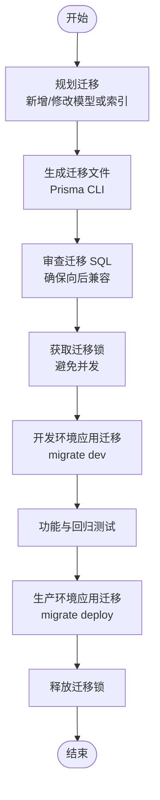

# 版本升级策略

<cite>
**本文引用的文件**
- [package.json](file://package.json)
- [pnpm-workspace.yaml](file://pnpm-workspace.yaml)
- [turbo.json](file://turbo.json)
- [apps/api/package.json](file://apps/api/package.json)
- [apps/api/prisma/schema.prisma](file://apps/api/prisma/schema.prisma)
- [apps/api/prisma/migrations/migration_lock.toml](file://apps/api/prisma/migrations/migration_lock.toml)
- [apps/api/src/prisma/prisma.service.ts](file://apps/api/src/prisma/prisma.service.ts)
- [apps/api/src/prisma/prisma.module.ts](file://apps/api/src/prisma/prisma.module.ts)
- [apps/api/src/main.ts](file://apps/api/src/main.ts)
- [apps/web/package.json](file://apps/web/package.json)
- [apps/web/src/main.tsx](file://apps/web/src/main.tsx)
- [apps/web/src/lib/storage.ts](file://apps/web/src/lib/storage.ts)
- [apps/worker/src/worker.ts](file://apps/worker/src/worker.ts)
</cite>

## 目录

1. [引言](#引言)
2. [项目结构](#项目结构)
3. [核心组件](#核心组件)
4. [架构总览](#架构总览)
5. [详细组件分析](#详细组件分析)
6. [依赖关系分析](#依赖关系分析)
7. [性能考量](#性能考量)
8. [故障排查指南](#故障排查指南)
9. [结论](#结论)
10. [附录](#附录)

## 引言

本策略文档面向 AIXSSS 项目的版本升级与发布管理，聚焦以下目标：

- 向后兼容性维护与破坏性变更管理
- 数据库迁移策略与 Prisma 迁移系统使用规范
- 迁移锁机制与版本控制流程
- 前端与后端版本同步策略、依赖更新与兼容性检查
- 重大版本升级的风险评估、测试策略与发布流程
- 升级前准备、数据备份与回滚计划
- 具体升级步骤、常见问题与解决方案、升级后验证方法

## 项目结构

AIXSSS 采用多包工作区（monorepo），由根级包管理器与构建编排工具协调各子应用：

- 根工作区配置：统一脚本、缓存与任务依赖关系
- 应用层：
  - API 应用：基于 NestJS + Fastify，使用 Prisma 管理 PostgreSQL
  - Web 前端：基于 Vite + React + TypeScript
  - Worker：基于 BullMQ 的异步任务处理
- 共享包：跨应用共享的类型与模式定义

图表来源

- [package.json](file://package.json#L1-L24)
- [pnpm-workspace.yaml](file://pnpm-workspace.yaml#L1-L6)
- [turbo.json](file://turbo.json#L1-L30)

章节来源

- [package.json](file://package.json#L1-L24)
- [pnpm-workspace.yaml](file://pnpm-workspace.yaml#L1-L6)
- [turbo.json](file://turbo.json#L1-L30)

## 核心组件

- 数据库与迁移
  - 使用 Prisma 管理 PostgreSQL，迁移文件按时间戳命名，确保可重复部署
  - 迁移锁文件防止并发冲突
- 后端服务
  - NestJS + Fastify，全局异常过滤、CORS 配置、统一前缀
- 前端本地存储与版本迁移
  - 基于 localStorage 的版本化迁移与备份/回滚
- Worker 异步任务
  - BullMQ 队列，带锁时长、停滞检测与重试策略

章节来源

- [apps/api/prisma/schema.prisma](file://apps/api/prisma/schema.prisma#L1-L351)
- [apps/api/prisma/migrations/migration_lock.toml](file://apps/api/prisma/migrations/migration_lock.toml#L1-L4)
- [apps/api/src/prisma/prisma.service.ts](file://apps/api/src/prisma/prisma.service.ts#L1-L16)
- [apps/api/src/prisma/prisma.module.ts](file://apps/api/src/prisma/prisma.module.ts#L1-L12)
- [apps/api/src/main.ts](file://apps/api/src/main.ts#L1-L34)
- [apps/web/src/lib/storage.ts](file://apps/web/src/lib/storage.ts#L184-L434)
- [apps/worker/src/worker.ts](file://apps/worker/src/worker.ts#L1-L755)

## 架构总览

整体架构围绕“数据库 + 后端 API + 前端 Web + Worker 异步任务”展开，数据流与控制流如下：

图表来源

- [apps/api/src/main.ts](file://apps/api/src/main.ts#L1-L34)
- [apps/api/src/prisma/prisma.service.ts](file://apps/api/src/prisma/prisma.service.ts#L1-L16)
- [apps/web/src/main.tsx](file://apps/web/src/main.tsx#L1-L37)
- [apps/web/src/lib/storage.ts](file://apps/web/src/lib/storage.ts#L184-L434)
- [apps/worker/src/worker.ts](file://apps/worker/src/worker.ts#L1-L755)

## 详细组件分析

### 数据库迁移与 Prisma 策略

- 迁移文件组织
  - 采用时间戳前缀的迁移目录，保证可重复部署与顺序执行
  - 迁移锁文件用于防止并发迁移
- 迁移执行
  - 开发环境：使用 Prisma CLI 的 dev 迁移命令
  - 生产环境：使用 deploy 命令进行无确认的迁移
- 锁机制
  - 通过迁移锁文件与 Prisma 客户端连接信息锁定迁移过程
- 版本控制流程
  - 在合并到主分支前确保迁移通过本地验证
  - 生产部署前在预生产环境验证迁移与数据一致性

图表来源

- [apps/api/package.json](file://apps/api/package.json#L13-L16)
- [apps/api/prisma/migrations/migration_lock.toml](file://apps/api/prisma/migrations/migration_lock.toml#L1-L4)
- [apps/api/prisma/schema.prisma](file://apps/api/prisma/schema.prisma#L1-L351)

章节来源

- [apps/api/package.json](file://apps/api/package.json#L13-L16)
- [apps/api/prisma/migrations/migration_lock.toml](file://apps/api/prisma/migrations/migration_lock.toml#L1-L4)
- [apps/api/prisma/schema.prisma](file://apps/api/prisma/schema.prisma#L1-L351)

### 后端 API 升级要点

- 依赖与版本
  - NestJS、Fastify、Prisma 客户端等核心依赖版本需与 Prisma 版本匹配
- 启动与中间件
  - CORS、全局前缀、异常过滤器等在启动时集中配置
- 数据访问
  - 通过全局注入的 Prisma 服务访问数据库，生命周期与模块销毁挂钩

图表来源

- [apps/api/src/main.ts](file://apps/api/src/main.ts#L1-L34)
- [apps/api/src/prisma/prisma.service.ts](file://apps/api/src/prisma/prisma.service.ts#L1-L16)
- [apps/api/src/prisma/prisma.module.ts](file://apps/api/src/prisma/prisma.module.ts#L1-L12)

章节来源

- [apps/api/src/main.ts](file://apps/api/src/main.ts#L1-L34)
- [apps/api/src/prisma/prisma.service.ts](file://apps/api/src/prisma/prisma.service.ts#L1-L16)
- [apps/api/src/prisma/prisma.module.ts](file://apps/api/src/prisma/prisma.module.ts#L1-L12)

### 前端版本同步与本地迁移

- 版本迁移机制
  - 基于 localStorage 的版本迁移函数注册表，按版本路径顺序执行
  - 支持创建备份、失败回滚、清理废弃数据
- 依赖与兼容性
  - 前端依赖版本与共享包版本保持一致，避免运行期不兼容
- 升级同步
  - 前端版本号与后端 API 版本解耦，但需在升级前后进行接口兼容性验证

图表来源

- [apps/web/src/lib/storage.ts](file://apps/web/src/lib/storage.ts#L184-L434)

章节来源

- [apps/web/src/lib/storage.ts](file://apps/web/src/lib/storage.ts#L184-L434)

### Worker 异步任务与升级注意事项

- 任务类型扩展
  - 新增任务类型时，需在 Worker 主循环中注册处理逻辑
- 进度与取消
  - 协作式取消：若任务被标记为取消，应尽快抛错并避免写入产物
- 重试与状态
  - 自动重试期间保持状态为排队，避免前端误判失败
- 锁与稳定性
  - 设置合理的锁时长、停滞间隔与最大停滞次数，降低误判

图表来源

- [apps/worker/src/worker.ts](file://apps/worker/src/worker.ts#L44-L755)

章节来源

- [apps/worker/src/worker.ts](file://apps/worker/src/worker.ts#L44-L755)

## 依赖关系分析

- 工作区与构建
  - 根级脚本与 Turbo 任务定义了构建顺序与缓存策略
  - 子包间通过 workspace:\* 引用共享包
- 包管理
  - pnpm 工作区统一管理依赖版本与安装

图表来源

- [package.json](file://package.json#L1-L24)
- [turbo.json](file://turbo.json#L1-L30)
- [pnpm-workspace.yaml](file://pnpm-workspace.yaml#L1-L6)
- [apps/api/package.json](file://apps/api/package.json#L1-L52)
- [apps/web/package.json](file://apps/web/package.json#L1-L95)
- [apps/worker/package.json](file://apps/worker/package.json#L1-L35)

章节来源

- [package.json](file://package.json#L1-L24)
- [turbo.json](file://turbo.json#L1-L30)
- [pnpm-workspace.yaml](file://pnpm-workspace.yaml#L1-L6)
- [apps/api/package.json](file://apps/api/package.json#L1-L52)
- [apps/web/package.json](file://apps/web/package.json#L1-L95)
- [apps/worker/package.json](file://apps/worker/package.json#L1-L35)

## 性能考量

- 数据库迁移
  - 大型迁移建议在低峰时段执行，必要时拆分为多个小迁移
  - 使用索引优化与批量操作减少锁持有时间
- Worker
  - 调整并发与锁时长平衡吞吐与稳定性
  - 对长时间任务设置阶段性进度上报，提升可观测性
- 前端
  - 迁移与备份操作尽量在后台执行，避免阻塞主线程
  - 对大体量数据迁移采用分批处理与增量写入

## 故障排查指南

- 数据库迁移失败
  - 检查迁移锁文件与数据库连接
  - 查看迁移 SQL 是否存在语法错误或约束冲突
  - 在开发环境回滚并修复后再重新应用
- Worker 任务卡住或失败
  - 检查队列连接参数与 Redis 可用性
  - 查看停滞计数与锁时长配置，避免误判
  - 关注协作式取消逻辑，确保取消后不再写入结果
- 前端迁移失败
  - 检查迁移函数是否抛出异常
  - 使用备份回滚并定位具体迁移步骤

章节来源

- [apps/api/prisma/migrations/migration_lock.toml](file://apps/api/prisma/migrations/migration_lock.toml#L1-L4)
- [apps/worker/src/worker.ts](file://apps/worker/src/worker.ts#L720-L755)
- [apps/web/src/lib/storage.ts](file://apps/web/src/lib/storage.ts#L376-L414)

## 结论

AIXSSS 的升级策略应坚持“可重复、可回滚、可验证”的原则。数据库迁移通过 Prisma 与迁移锁保障一致性；前端通过本地版本迁移与备份回滚实现安全升级；后端与 Worker 通过明确的状态机与重试策略提升稳定性。重大版本升级需配套风险评估、充分测试与灰度发布。

## 附录

### 升级前准备清单

- 代码与依赖
  - 统一各子包依赖版本，确保与 Prisma 版本兼容
  - 完成类型检查与静态分析
- 数据库
  - 在预生产环境执行迁移，验证数据完整性
  - 准备迁移锁文件与数据库连接参数
- 前端
  - 验证迁移函数对现有数据的兼容性
  - 准备备份与回滚脚本
- 后端与 Worker
  - 验证 API 兼容性与 Worker 任务处理逻辑
  - 准备监控与日志采集

章节来源

- [apps/api/package.json](file://apps/api/package.json#L18-L50)
- [apps/web/package.json](file://apps/web/package.json#L22-L94)
- [apps/worker/package.json](file://apps/worker/package.json#L14-L33)

### 数据备份方案

- 前端
  - 迁移前创建 localStorage 备份，失败后回滚
- 数据库
  - 迁移前导出数据库快照，使用数据库自带备份工具
- Worker
  - 停止 Worker 并导出队列状态，必要时重建队列

章节来源

- [apps/web/src/lib/storage.ts](file://apps/web/src/lib/storage.ts#L287-L374)
- [apps/api/package.json](file://apps/api/package.json#L14-L16)

### 回滚计划

- 前端
  - 使用备份 ID 回滚到迁移前状态，删除备份
- 数据库
  - 使用数据库快照回滚至迁移前
- 后端与 Worker
  - 回退到上一个稳定版本，恢复队列与服务

章节来源

- [apps/web/src/lib/storage.ts](file://apps/web/src/lib/storage.ts#L407-L413)
- [apps/worker/src/worker.ts](file://apps/worker/src/worker.ts#L741-L749)

### 升级步骤（示例）

- 后端 API
  - 生成迁移 → 审查 SQL → 开发环境应用 → 测试 → 生产环境应用
- 前端
  - 检测版本 → 计算迁移路径 → 创建备份 → 执行迁移 → 清理废弃数据
- Worker
  - 新增任务类型 → 验证处理逻辑 → 部署并观察状态
- 数据库
  - 生成迁移 → 预生产验证 → 生产应用迁移 → 验证数据一致性

章节来源

- [apps/api/package.json](file://apps/api/package.json#L13-L16)
- [apps/web/src/lib/storage.ts](file://apps/web/src/lib/storage.ts#L376-L414)
- [apps/worker/src/worker.ts](file://apps/worker/src/worker.ts#L670-L729)

### 升级后验证方法

- 数据库
  - 查询关键表结构与索引，执行代表性查询验证性能
- 后端
  - 调用健康检查端点，验证 CORS 与全局过滤器
- 前端
  - 打开应用，触发典型工作流，验证迁移与数据加载
- Worker
  - 推送测试任务，观察状态流转与日志

章节来源

- [apps/api/src/main.ts](file://apps/api/src/main.ts#L16-L25)
- [apps/web/src/main.tsx](file://apps/web/src/main.tsx#L13-L25)
- [apps/worker/src/worker.ts](file://apps/worker/src/worker.ts#L731-L739)
