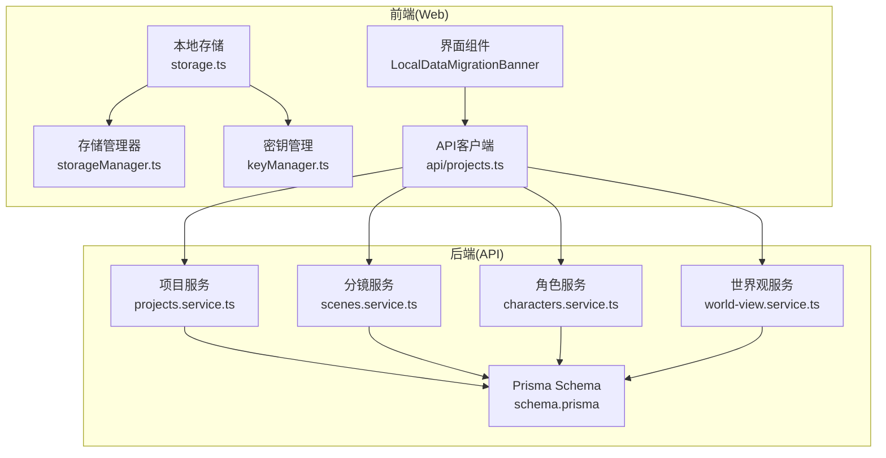
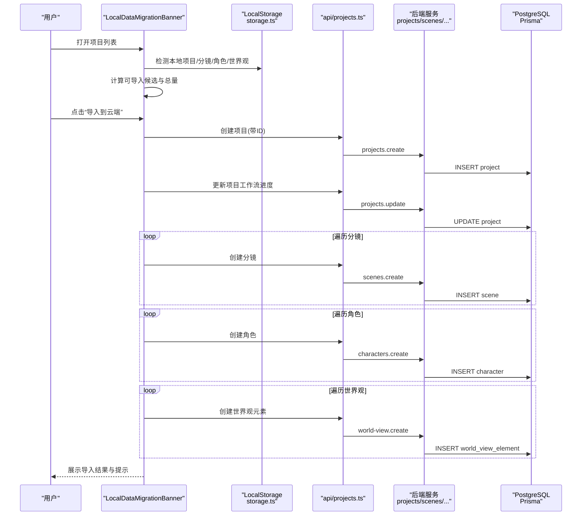
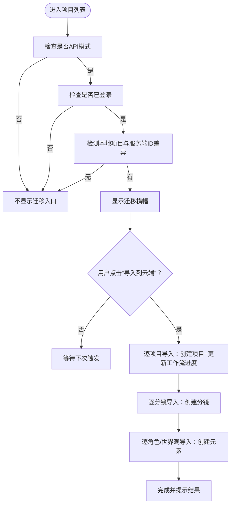
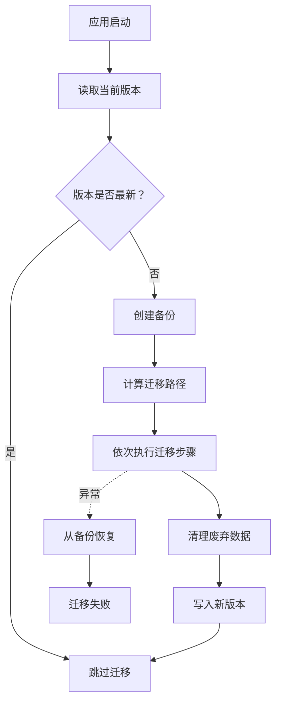
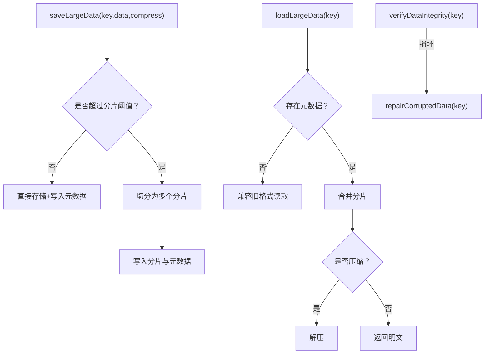
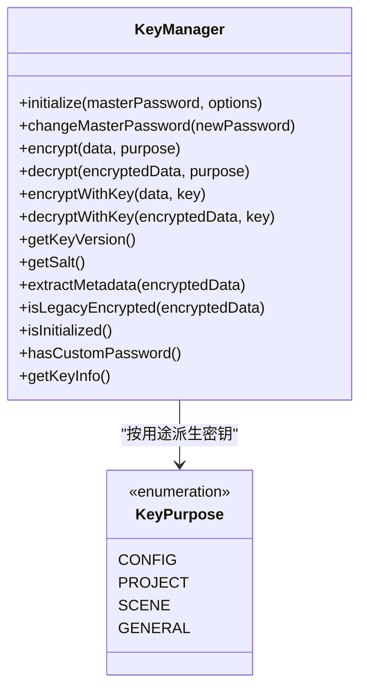
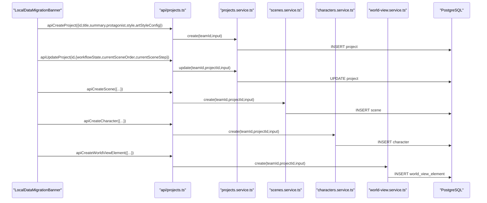
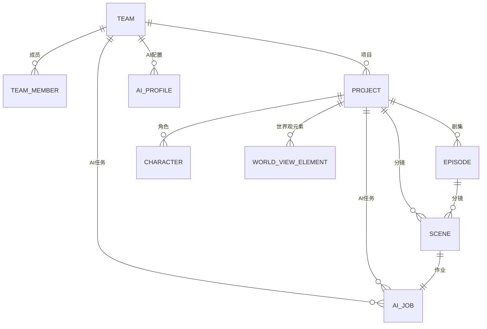
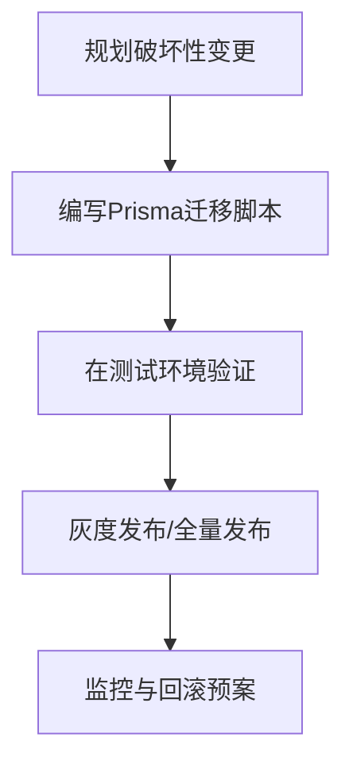
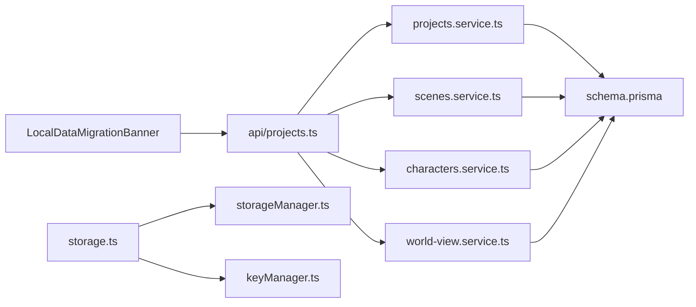

# 迁移文档

<cite>
**本文档引用的文件**
- [apps/web/src/components/LocalDataMigrationBanner.tsx](file://apps/web/src/components/LocalDataMigrationBanner.tsx)
- [apps/web/src/lib/storage.ts](file://apps/web/src/lib/storage.ts)
- [apps/web/src/lib/storageManager.ts](file://apps/web/src/lib/storageManager.ts)
- [apps/web/src/lib/keyManager.ts](file://apps/web/src/lib/keyManager.ts)
- [apps/web/src/lib/api/projects.ts](file://apps/web/src/lib/api/projects.ts)
- [apps/api/src/projects/projects.service.ts](file://apps/api/src/projects/projects.service.ts)
- [apps/api/src/scenes/scenes.service.ts](file://apps/api/src/scenes/scenes.service.ts)
- [apps/api/src/characters/characters.service.ts](file://apps/api/src/characters/characters.service.ts)
- [apps/api/src/world-view/world-view.service.ts](file://apps/api/src/world-view/world-view.service.ts)
- [apps/api/prisma/schema.prisma](file://apps/api/prisma/schema.prisma)
- [apps/api/prisma/migrations/20251228173657_v2/migration.sql](file://apps/api/prisma/migrations/20251228173657_v2/migration.sql)
- [apps/api/prisma/migrations/20260107190000_add_action_beats/migration.sql](file://apps/api/prisma/migrations/20260107190000_add_action_beats/migration.sql)
- [packages/shared/src/schemas/project.ts](file://packages/shared/src/schemas/project.ts)
- [packages/shared/src/schemas/scene.ts](file://packages/shared/src/schemas/scene.ts)
- [apps/web/src/types/index.ts](file://apps/web/src/types/index.ts)
- [docs/migration/local-to-api.md](file://docs/migration/local-to-api.md)
</cite>

## 目录

1. [简介](#简介)
2. [项目结构](#项目结构)
3. [核心组件](#核心组件)
4. [架构总览](#架构总览)
5. [详细组件分析](#详细组件分析)
6. [依赖关系分析](#依赖关系分析)
7. [性能考量](#性能考量)
8. [故障排查指南](#故障排查指南)
9. [结论](#结论)
10. [附录](#附录)

## 简介

本迁移文档面向AIXSSS项目，聚焦“本地数据到API服务”的迁移流程与保障机制，涵盖：

- 迁移范围与触发条件
- 数据映射与转换规则
- 数据完整性、冲突处理与回滚机制
- 版本升级策略、向后兼容与破坏性变更管理
- 自动化迁移工具、手动迁移步骤与验证方法
- 存储层演进、数据结构变化与迁移脚本管理
- 迁移前准备、风险评估与应急预案
- 实际迁移示例、常见问题与解决方案

## 项目结构

AIXSSS采用前后端分离架构：

- 前端（Web）负责本地数据持久化、迁移UI与API调用
- 后端（API）提供REST接口与数据库（PostgreSQL）持久化
- 共享包（Shared）定义前后端一致的数据模型与校验规则

图表来源

- [apps/web/src/components/LocalDataMigrationBanner.tsx](file://apps/web/src/components/LocalDataMigrationBanner.tsx#L1-L286)
- [apps/web/src/lib/storage.ts](file://apps/web/src/lib/storage.ts#L1-L800)
- [apps/web/src/lib/storageManager.ts](file://apps/web/src/lib/storageManager.ts#L1-L369)
- [apps/web/src/lib/keyManager.ts](file://apps/web/src/lib/keyManager.ts#L1-L460)
- [apps/web/src/lib/api/projects.ts](file://apps/web/src/lib/api/projects.ts#L1-L53)
- [apps/api/src/projects/projects.service.ts](file://apps/api/src/projects/projects.service.ts#L1-L215)
- [apps/api/src/scenes/scenes.service.ts](file://apps/api/src/scenes/scenes.service.ts#L1-L365)
- [apps/api/src/characters/characters.service.ts](file://apps/api/src/characters/characters.service.ts#L1-L118)
- [apps/api/src/world-view/world-view.service.ts](file://apps/api/src/world-view/world-view.service.ts#L1-L129)
- [apps/api/prisma/schema.prisma](file://apps/api/prisma/schema.prisma#L1-L351)

章节来源

- [apps/web/src/components/LocalDataMigrationBanner.tsx](file://apps/web/src/components/LocalDataMigrationBanner.tsx#L1-L286)
- [apps/api/prisma/schema.prisma](file://apps/api/prisma/schema.prisma#L1-L351)

## 核心组件

- 本地数据迁移入口与UI：LocalDataMigrationBanner
- 本地存储与版本迁移：storage.ts（版本迁移、备份/恢复、批量写入）
- 大数据分片与压缩：storageManager.ts（分片、压缩、完整性校验）
- 密钥管理与加密：keyManager.ts（PBKDF2派生、用途隔离、完整性校验）
- API客户端：api/projects.ts（项目/分镜/角色/世界观的创建与更新）
- 后端服务：projects/scenes/characters/world-view services（数据持久化与业务规则）
- 数据模型与校验：schema.prisma、shared schemas、types/index.ts

章节来源

- [apps/web/src/components/LocalDataMigrationBanner.tsx](file://apps/web/src/components/LocalDataMigrationBanner.tsx#L1-L286)
- [apps/web/src/lib/storage.ts](file://apps/web/src/lib/storage.ts#L1-L800)
- [apps/web/src/lib/storageManager.ts](file://apps/web/src/lib/storageManager.ts#L1-L369)
- [apps/web/src/lib/keyManager.ts](file://apps/web/src/lib/keyManager.ts#L1-L460)
- [apps/web/src/lib/api/projects.ts](file://apps/web/src/lib/api/projects.ts#L1-L53)
- [apps/api/src/projects/projects.service.ts](file://apps/api/src/projects/projects.service.ts#L1-L215)
- [apps/api/src/scenes/scenes.service.ts](file://apps/api/src/scenes/scenes.service.ts#L1-L365)
- [apps/api/src/characters/characters.service.ts](file://apps/api/src/characters/characters.service.ts#L1-L118)
- [apps/api/src/world-view/world-view.service.ts](file://apps/api/src/world-view/world-view.service.ts#L1-L129)
- [apps/api/prisma/schema.prisma](file://apps/api/prisma/schema.prisma#L1-L351)
- [packages/shared/src/schemas/project.ts](file://packages/shared/src/schemas/project.ts#L1-L33)
- [packages/shared/src/schemas/scene.ts](file://packages/shared/src/schemas/scene.ts#L1-L56)
- [apps/web/src/types/index.ts](file://apps/web/src/types/index.ts#L1-L800)

## 架构总览

本地数据迁移采用“前端检测—后端导入—最佳努力推进”的策略。前端在API模式下检测到本地项目且服务端不存在同ID项目时，弹出迁移提示；用户确认后，前端逐项目、逐分镜、逐角色/世界观元素进行导入，同时尽力恢复工作流进度。

图表来源

- [apps/web/src/components/LocalDataMigrationBanner.tsx](file://apps/web/src/components/LocalDataMigrationBanner.tsx#L121-L255)
- [apps/web/src/lib/api/projects.ts](file://apps/web/src/lib/api/projects.ts#L14-L46)
- [apps/api/src/projects/projects.service.ts](file://apps/api/src/projects/projects.service.ts#L112-L139)
- [apps/api/src/scenes/scenes.service.ts](file://apps/api/src/scenes/scenes.service.ts#L105-L131)
- [apps/api/src/characters/characters.service.ts](file://apps/api/src/characters/characters.service.ts#L44-L68)
- [apps/api/src/world-view/world-view.service.ts](file://apps/api/src/world-view/world-view.service.ts#L44-L58)

章节来源

- [docs/migration/local-to-api.md](file://docs/migration/local-to-api.md#L1-L39)
- [apps/web/src/components/LocalDataMigrationBanner.tsx](file://apps/web/src/components/LocalDataMigrationBanner.tsx#L1-L286)

## 详细组件分析

### 本地数据迁移入口与流程

- 触发条件：API模式、已登录、浏览器存在本地项目且服务端无同ID项目
- 导入范围：项目、分镜；尽力恢复工作流进度；角色与世界观仍为本地数据
- UI行为：展示候选数量与总量，显示进度与错误，支持“以后再说”

图表来源

- [docs/migration/local-to-api.md](file://docs/migration/local-to-api.md#L9-L36)
- [apps/web/src/components/LocalDataMigrationBanner.tsx](file://apps/web/src/components/LocalDataMigrationBanner.tsx#L110-L120)

章节来源

- [docs/migration/local-to-api.md](file://docs/migration/local-to-api.md#L1-L39)
- [apps/web/src/components/LocalDataMigrationBanner.tsx](file://apps/web/src/components/LocalDataMigrationBanner.tsx#L1-L286)

### 本地存储与版本迁移（storage.ts）

- 版本迁移：基于版本号的迁移路径计算，按顺序执行迁移步骤
- 备份/恢复：迁移前创建备份，失败时从备份恢复
- 批量写入：项目与分镜采用防抖/批量队列优化写入性能
- 废弃数据清理：删除孤立分镜数据，限制备份数量

图表来源

- [apps/web/src/lib/storage.ts](file://apps/web/src/lib/storage.ts#L376-L414)

章节来源

- [apps/web/src/lib/storage.ts](file://apps/web/src/lib/storage.ts#L1-L800)

### 大数据分片与压缩（storageManager.ts）

- 分片策略：超过阈值自动分片，元数据记录压缩/分片状态
- 压缩策略：启用压缩时使用压缩算法，失败回退明文
- 完整性校验：分片缺失或损坏时修复或删除
- 空间监控与清理：定期清理过期数据

图表来源

- [apps/web/src/lib/storageManager.ts](file://apps/web/src/lib/storageManager.ts#L89-L179)
- [apps/web/src/lib/storageManager.ts](file://apps/web/src/lib/storageManager.ts#L288-L332)

章节来源

- [apps/web/src/lib/storageManager.ts](file://apps/web/src/lib/storageManager.ts#L1-L369)

### 密钥管理与加密（keyManager.ts）

- 密钥派生：PBKDF2结合盐与用途派生不同密钥，支持主密码更换
- 兼容性：遗留密钥与新格式并存，自动识别与迁移
- 完整性校验：加密数据包含HMAC校验，用途不匹配直接失败
- 密码验证：通过校验标记或解密配置判断主密码有效性

图表来源

- [apps/web/src/lib/keyManager.ts](file://apps/web/src/lib/keyManager.ts#L79-L401)

章节来源

- [apps/web/src/lib/keyManager.ts](file://apps/web/src/lib/keyManager.ts#L1-L460)

### API客户端与后端服务（数据映射与转换）

- 项目映射：前端传入ID（可选）、标题、摘要、主角、风格、画风配置；后端创建并返回ISO时间字符串
- 分镜映射：前端传入顺序、描述、提示词、生成产物、状态、备注；后端创建并返回ISO时间字符串
- 角色/世界观：前端传入必要字段，后端创建并返回ISO时间字符串
- 工作流进度：前端尽力恢复workflowState/currentSceneOrder/currentSceneStep，后端更新项目

图表来源

- [apps/web/src/lib/api/projects.ts](file://apps/web/src/lib/api/projects.ts#L14-L46)
- [apps/api/src/projects/projects.service.ts](file://apps/api/src/projects/projects.service.ts#L112-L139)
- [apps/api/src/scenes/scenes.service.ts](file://apps/api/src/scenes/scenes.service.ts#L105-L131)
- [apps/api/src/characters/characters.service.ts](file://apps/api/src/characters/characters.service.ts#L44-L68)
- [apps/api/src/world-view/world-view.service.ts](file://apps/api/src/world-view/world-view.service.ts#L44-L58)

章节来源

- [apps/web/src/lib/api/projects.ts](file://apps/web/src/lib/api/projects.ts#L1-L53)
- [apps/api/src/projects/projects.service.ts](file://apps/api/src/projects/projects.service.ts#L1-L215)
- [apps/api/src/scenes/scenes.service.ts](file://apps/api/src/scenes/scenes.service.ts#L1-L365)
- [apps/api/src/characters/characters.service.ts](file://apps/api/src/characters/characters.service.ts#L1-L118)
- [apps/api/src/world-view/world-view.service.ts](file://apps/api/src/world-view/world-view.service.ts#L1-L129)

### 数据模型与校验（Prisma Schema与Shared Schemas）

- Prisma Schema：定义团队、项目、分镜、角色、世界观、AI作业等实体与枚举
- Shared Schemas：前后端一致的输入校验（Zod），确保数据结构与约束一致
- 类型定义：前端types/index.ts定义项目、分镜、角色、世界观等核心类型

图表来源

- [apps/api/prisma/schema.prisma](file://apps/api/prisma/schema.prisma#L75-L351)

章节来源

- [apps/api/prisma/schema.prisma](file://apps/api/prisma/schema.prisma#L1-L351)
- [packages/shared/src/schemas/project.ts](file://packages/shared/src/schemas/project.ts#L1-L33)
- [packages/shared/src/schemas/scene.ts](file://packages/shared/src/schemas/scene.ts#L1-L56)
- [apps/web/src/types/index.ts](file://apps/web/src/types/index.ts#L452-L633)

### 版本升级策略、向后兼容与破坏性变更管理

- 版本迁移：基于版本号的迁移路径，按顺序执行；失败自动备份与恢复
- 向后兼容：遗留密钥与新格式并存；API字段可选更新；枚举扩展向前兼容
- 破坏性变更：通过Prisma迁移脚本管理（如新增字段、索引调整），确保数据库演进可控

图表来源

- [apps/api/prisma/migrations/20251228173657_v2/migration.sql](file://apps/api/prisma/migrations/20251228173657_v2/migration.sql#L1-L4)
- [apps/api/prisma/migrations/20260107190000_add_action_beats/migration.sql](file://apps/api/prisma/migrations/20260107190000_add_action_beats/migration.sql#L1-L7)

章节来源

- [apps/api/prisma/migrations/20251228173657_v2/migration.sql](file://apps/api/prisma/migrations/20251228173657_v2/migration.sql#L1-L4)
- [apps/api/prisma/migrations/20260107190000_add_action_beats/migration.sql](file://apps/api/prisma/migrations/20260107190000_add_action_beats/migration.sql#L1-L7)

## 依赖关系分析

- 前端依赖后端API接口，严格遵循共享Schema进行数据校验
- 后端服务依赖Prisma访问数据库，提供事务与约束保障
- 本地存储与密钥管理为迁移提供数据安全与完整性保障

图表来源

- [apps/web/src/components/LocalDataMigrationBanner.tsx](file://apps/web/src/components/LocalDataMigrationBanner.tsx#L1-L286)
- [apps/web/src/lib/api/projects.ts](file://apps/web/src/lib/api/projects.ts#L1-L53)
- [apps/api/src/projects/projects.service.ts](file://apps/api/src/projects/projects.service.ts#L1-L215)
- [apps/api/src/scenes/scenes.service.ts](file://apps/api/src/scenes/scenes.service.ts#L1-L365)
- [apps/api/src/characters/characters.service.ts](file://apps/api/src/characters/characters.service.ts#L1-L118)
- [apps/api/src/world-view/world-view.service.ts](file://apps/api/src/world-view/world-view.service.ts#L1-L129)
- [apps/api/prisma/schema.prisma](file://apps/api/prisma/schema.prisma#L1-L351)
- [apps/web/src/lib/storage.ts](file://apps/web/src/lib/storage.ts#L1-L800)
- [apps/web/src/lib/storageManager.ts](file://apps/web/src/lib/storageManager.ts#L1-L369)
- [apps/web/src/lib/keyManager.ts](file://apps/web/src/lib/keyManager.ts#L1-L460)

章节来源

- [apps/web/src/components/LocalDataMigrationBanner.tsx](file://apps/web/src/components/LocalDataMigrationBanner.tsx#L1-L286)
- [apps/web/src/lib/api/projects.ts](file://apps/web/src/lib/api/projects.ts#L1-L53)
- [apps/api/src/projects/projects.service.ts](file://apps/api/src/projects/projects.service.ts#L1-L215)
- [apps/api/src/scenes/scenes.service.ts](file://apps/api/src/scenes/scenes.service.ts#L1-L365)
- [apps/api/src/characters/characters.service.ts](file://apps/api/src/characters/characters.service.ts#L1-L118)
- [apps/api/src/world-view/world-view.service.ts](file://apps/api/src/world-view/world-view.service.ts#L1-L129)
- [apps/api/prisma/schema.prisma](file://apps/api/prisma/schema.prisma#L1-L351)
- [apps/web/src/lib/storage.ts](file://apps/web/src/lib/storage.ts#L1-L800)
- [apps/web/src/lib/storageManager.ts](file://apps/web/src/lib/storageManager.ts#L1-L369)
- [apps/web/src/lib/keyManager.ts](file://apps/web/src/lib/keyManager.ts#L1-L460)

## 性能考量

- 批量与防抖：项目与分镜写入采用防抖与批量队列，降低localStorage写入频率
- 分片与压缩：大体量数据分片与压缩，提升存储效率与传输性能
- 事务与并发：后端服务在创建项目时创建默认剧集，避免后续查询分支
- 索引与查询：Prisma Schema定义合理索引，提升查询与排序性能

## 故障排查指南

- 迁移失败：检查备份是否存在，确认是否已从备份恢复；查看控制台错误信息
- 密钥问题：确认主密码正确，检查校验标记；必要时重置密钥管理器
- 数据损坏：使用完整性校验与修复函数；必要时删除损坏键并重建
- API错误：检查网络与认证状态；关注401/403错误并重新登录

章节来源

- [apps/web/src/lib/storage.ts](file://apps/web/src/lib/storage.ts#L376-L414)
- [apps/web/src/lib/keyManager.ts](file://apps/web/src/lib/keyManager.ts#L428-L460)
- [apps/web/src/lib/storageManager.ts](file://apps/web/src/lib/storageManager.ts#L288-L332)
- [apps/web/src/components/LocalDataMigrationBanner.tsx](file://apps/web/src/components/LocalDataMigrationBanner.tsx#L244-L255)

## 结论

AIXSSS的迁移方案通过前端检测与后端导入相结合，实现了从本地localStorage到云端数据库的平滑过渡。借助版本迁移、备份/恢复、批量写入、分片压缩与密钥管理等机制，确保了迁移过程中的数据完整性、性能与安全性。破坏性变更通过Prisma迁移脚本受控演进，配合严格的校验与监控，保障系统稳定与可维护性。

## 附录

### 迁移前准备

- 确认运行在API模式并已登录
- 备份本地数据（storage.ts提供备份/恢复能力）
- 检查磁盘空间与压缩策略（storageManager.ts）

章节来源

- [docs/migration/local-to-api.md](file://docs/migration/local-to-api.md#L9-L13)
- [apps/web/src/lib/storage.ts](file://apps/web/src/lib/storage.ts#L287-L342)
- [apps/web/src/lib/storageManager.ts](file://apps/web/src/lib/storageManager.ts#L14-L16)

### 自动化迁移步骤

- 打开项目列表，出现迁移横幅
- 点击“导入到云端”，等待进度提示
- 查看导入结果与提示，确认项目/分镜/角色/世界观导入情况

章节来源

- [docs/migration/local-to-api.md](file://docs/migration/local-to-api.md#L27-L31)
- [apps/web/src/components/LocalDataMigrationBanner.tsx](file://apps/web/src/components/LocalDataMigrationBanner.tsx#L121-L255)

### 手动迁移步骤

- 导出本地数据（storage.ts提供导出功能）
- 在API环境中创建项目与分镜
- 手动恢复工作流进度（projects.service.ts支持更新）

章节来源

- [apps/web/src/lib/storage.ts](file://apps/web/src/lib/storage.ts#L258-L286)
- [apps/api/src/projects/projects.service.ts](file://apps/api/src/projects/projects.service.ts#L141-L198)

### 验证方法

- 校验项目与分镜数量与内容
- 检查工作流进度字段是否恢复
- 验证角色与世界观元素导入完整性
- 使用API接口查询并比对数据

章节来源

- [apps/web/src/components/LocalDataMigrationBanner.tsx](file://apps/web/src/components/LocalDataMigrationBanner.tsx#L238-L244)
- [apps/api/src/projects/projects.service.ts](file://apps/api/src/projects/projects.service.ts#L55-L102)
- [apps/api/src/scenes/scenes.service.ts](file://apps/api/src/scenes/scenes.service.ts#L69-L85)

### 常见问题与解决方案

- 项目ID冲突：确保前端传入的ID在服务端唯一
- 密钥错误：重置主密码或使用遗留密钥兼容
- 数据损坏：使用完整性校验与修复函数
- API权限不足：检查登录状态与权限

章节来源

- [apps/web/src/components/LocalDataMigrationBanner.tsx](file://apps/web/src/components/LocalDataMigrationBanner.tsx#L146-L149)
- [apps/web/src/lib/keyManager.ts](file://apps/web/src/lib/keyManager.ts#L428-L460)
- [apps/web/src/lib/storageManager.ts](file://apps/web/src/lib/storageManager.ts#L291-L332)
