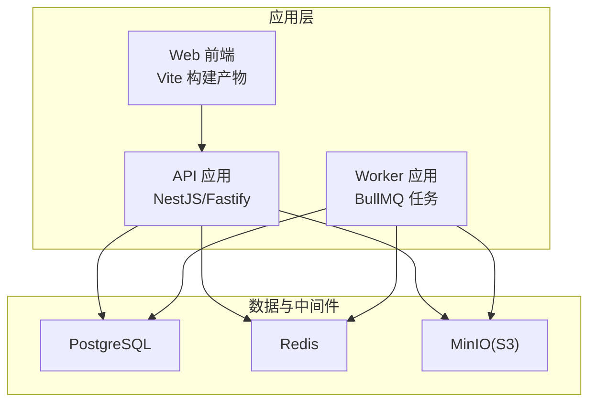
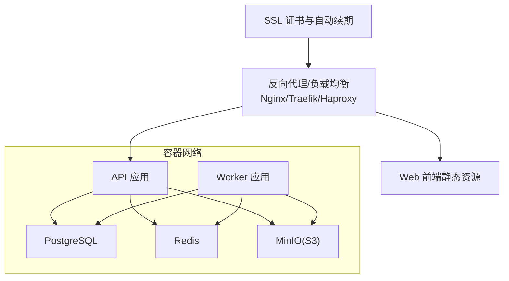
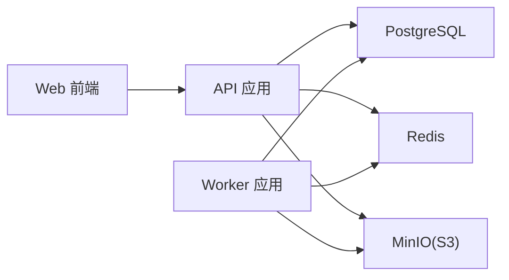

# 生产部署

<cite>
**本文引用的文件**
- [docker-compose.dev.yml](file://docker-compose.dev.yml)
- [apps/api/env.example](file://apps/api/env.example)
- [apps/api/src/config/env.ts](file://apps/api/src/config/env.ts)
- [apps/api/ENVIRONMENT.md](file://apps/api/ENVIRONMENT.md)
- [apps/worker/env.example](file://apps/worker/env.example)
- [apps/worker/src/config/env.ts](file://apps/worker/src/config/env.ts)
- [apps/worker/ENVIRONMENT.md](file://apps/worker/ENVIRONMENT.md)
- [apps/web/env.example](file://apps/web/env.example)
- [apps/web/vite.config.ts](file://apps/web/vite.config.ts)
- [apps/web/package.json](file://apps/web/package.json)
- [apps/api/package.json](file://apps/api/package.json)
- [apps/worker/package.json](file://apps/worker/package.json)
</cite>

## 目录

1. [简介](#简介)
2. [项目结构](#项目结构)
3. [核心组件](#核心组件)
4. [架构总览](#架构总览)
5. [详细组件分析](#详细组件分析)
6. [依赖分析](#依赖分析)
7. [性能考虑](#性能考虑)
8. [故障排查指南](#故障排查指南)
9. [结论](#结论)
10. [附录](#附录)

## 简介

本文件面向生产部署场景，系统化说明 AIXSSS 的容器编排与运行时配置，重点覆盖：

- Docker Compose 配置结构与参数说明（PostgreSQL、Redis、MinIO）
- 环境变量管理策略（数据库连接、认证密钥、队列与文件存储）
- 容器编排最佳实践（服务依赖、网络与数据卷）
- 负载均衡、SSL 与域名解析建议
- 多环境部署策略（开发、测试、生产）
- 部署前检查清单、部署步骤验证与常见问题处理

说明：

- 当前仓库提供的是开发态 Compose 示例，生产部署需在此基础上扩展安全与高可用配置。
- 文档中的“代码片段路径”仅用于定位实现位置，不直接展示代码内容。

## 项目结构

AIXSSS 采用多包工作区，核心服务包括：

- API 应用：基于 NestJS/Fastify，负责业务接口与队列调度
- Worker 应用：基于 BullMQ 的异步任务执行
- Web 前端：React/Vite 构建产物供 API 或独立静态托管
- 数据与缓存：PostgreSQL、Redis
- 对象存储：MinIO（兼容 S3）

图表来源

- [apps/api/package.json](file://apps/api/package.json#L1-L52)
- [apps/worker/package.json](file://apps/worker/package.json#L1-L35)
- [apps/web/package.json](file://apps/web/package.json#L1-L95)

章节来源

- [docker-compose.dev.yml](file://docker-compose.dev.yml#L1-L35)
- [apps/api/package.json](file://apps/api/package.json#L1-L52)
- [apps/worker/package.json](file://apps/worker/package.json#L1-L35)
- [apps/web/package.json](file://apps/web/package.json#L1-L95)

## 核心组件

- PostgreSQL（数据库）
  - 版本：16
  - 卷：持久化至 postgres_data
  - 端口映射：5432
- Redis（消息与队列）
  - 版本：7-alpine
  - 端口映射：6379
- MinIO（对象存储）
  - 版本：latest
  - 端口映射：9000（S3 API）、9001（控制台）
  - 卷：持久化至 minio_data

章节来源

- [docker-compose.dev.yml](file://docker-compose.dev.yml#L2-L28)

## 架构总览

生产部署建议采用“单主机多容器”或“Kubernetes 集群”两种形态之一。下图展示以 Compose 为主的单机生产拓扑（含安全加固与外部访问）：

图表来源

- [docker-compose.dev.yml](file://docker-compose.dev.yml#L1-L35)

## 详细组件分析

### 数据库（PostgreSQL）

- 运行参数
  - 镜像版本：16
  - 环境变量：POSTGRES_USER、POSTGRES_PASSWORD、POSTGRES_DB
  - 端口映射：5432
  - 数据卷：postgres_data
- 生产建议
  - 使用独立子网隔离数据库
  - 限制外网访问，仅允许内网服务访问
  - 启用 WAL 归档与定期备份策略
  - 配置只读副本与主从切换预案

章节来源

- [docker-compose.dev.yml](file://docker-compose.dev.yml#L2-L11)

### 缓存（Redis）

- 运行参数
  - 镜像版本：7-alpine
  - 端口映射：6379
- 生产建议
  - 启用持久化（RDB/AOF）与快照策略
  - 配置密码认证与 TLS
  - 使用哨兵或集群模式提升可用性
  - 限制内存与淘汰策略

章节来源

- [docker-compose.dev.yml](file://docker-compose.dev.yml#L13-L16)

### 对象存储（MinIO）

- 运行参数
  - 镜像版本：latest
  - 命令：server /data --console-address ":9001"
  - 环境变量：MINIO_ROOT_USER、MINIO_ROOT_PASSWORD
  - 端口映射：9000（S3 API）、9001（控制台）
  - 数据卷：minio_data
- 生产建议
  - 使用独立子网与防火墙规则
  - 启用 HTTPS 与访问控制策略
  - 配置桶策略与 IAM 角色
  - 启用版本控制与生命周期管理

章节来源

- [docker-compose.dev.yml](file://docker-compose.dev.yml#L18-L28)

### API 应用（NestJS/Fastify）

- 环境变量与校验
  - NODE_ENV、PORT、DATABASE_URL、JWT_SECRET、API_KEY_ENCRYPTION_KEY、REDIS_URL、AI_QUEUE_NAME、CORS_ORIGIN
  - 使用 Zod 校验并提供默认值
- 生产建议
  - 将敏感变量通过密钥管理服务注入（如 KMS/Secrets Manager）
  - 启用健康检查与优雅停机
  - 配置限流、WAF 与请求大小限制
  - 使用进程管理器（PM2/Docker 自动重启）保障可用性

章节来源

- [apps/api/src/config/env.ts](file://apps/api/src/config/env.ts#L1-L17)
- [apps/api/env.example](file://apps/api/env.example#L1-L23)
- [apps/api/ENVIRONMENT.md](file://apps/api/ENVIRONMENT.md#L1-L31)
- [apps/api/package.json](file://apps/api/package.json#L1-L52)

### Worker 应用（BullMQ）

- 环境变量与校验
  - NODE_ENV、DATABASE_URL、API_KEY_ENCRYPTION_KEY、REDIS_URL、AI_QUEUE_NAME、WORKER_CONCURRENCY
- 生产建议
  - 多实例水平扩展，共享 Redis 队列
  - 配置重试策略与死信队列
  - 监控作业耗时与积压指标
  - 与 API 保持相同的密钥配置以保证加密一致性

章节来源

- [apps/worker/src/config/env.ts](file://apps/worker/src/config/env.ts#L1-L15)
- [apps/worker/env.example](file://apps/worker/env.example#L1-L17)
- [apps/worker/ENVIRONMENT.md](file://apps/worker/ENVIRONMENT.md#L1-L25)
- [apps/worker/package.json](file://apps/worker/package.json#L1-L35)

### Web 前端（Vite）

- 构建与运行
  - 开发服务器监听 0.0.0.0，代理 /api 到后端
  - 生产构建启用代码分割与压缩
- 部署建议
  - 将构建产物部署至 Nginx/CDN，或由 API 提供静态资源
  - 配置缓存头与安全响应头
  - 与后端统一跨域策略

章节来源

- [apps/web/vite.config.ts](file://apps/web/vite.config.ts#L24-L34)
- [apps/web/vite.config.ts](file://apps/web/vite.config.ts#L36-L83)
- [apps/web/package.json](file://apps/web/package.json#L1-L95)

## 依赖分析

- 服务耦合
  - API 依赖 DB、CACHE、S3；Worker 依赖 CACHE、DB、S3
  - Web 通过 /api 访问 API
- 网络与数据卷
  - Compose 默认网络便于服务间通信
  - 数据卷确保持久化

图表来源

- [docker-compose.dev.yml](file://docker-compose.dev.yml#L1-L35)

章节来源

- [docker-compose.dev.yml](file://docker-compose.dev.yml#L1-L35)

## 性能考虑

- 数据库
  - 连接池大小与超时配置
  - 读写分离与索引优化
- 缓存
  - 合理设置过期时间与内存上限
  - 分离热数据与冷数据
- 对象存储
  - 分块上传与并发下载
  - CDN 加速与边缘缓存
- 应用
  - API 限流与熔断
  - Worker 并发与重试退避
  - 前端资源按需加载与缓存

## 故障排查指南

- 无法连接数据库
  - 检查容器网络与端口映射
  - 核对 DATABASE_URL 与凭据
- Redis 连接失败
  - 确认容器可达与密码正确
  - 检查防火墙与安全组
- MinIO 控制台不可用
  - 确认 9001 端口开放与命令参数
- API 启动报错
  - 校验 JWT_SECRET、API_KEY_ENCRYPTION_KEY 长度与格式
  - 查看日志与健康检查
- Worker 无作业执行
  - 确认队列名一致与并发配置
  - 检查 Redis 可达性与队列状态

章节来源

- [apps/api/src/config/env.ts](file://apps/api/src/config/env.ts#L1-L17)
- [apps/worker/src/config/env.ts](file://apps/worker/src/config/env.ts#L1-L15)
- [docker-compose.dev.yml](file://docker-compose.dev.yml#L1-L35)

## 结论

本部署文档基于现有开发 Compose 与应用配置，给出了生产落地的关键要点与实施建议。实际上线前应结合企业安全与合规要求，补充密钥管理、审计日志、监控告警与灾难恢复方案。

## 附录

### A. 环境变量管理策略

- 数据库连接
  - 使用 DATABASE_URL 指向生产数据库
  - 在生产中通过密钥管理服务注入，避免明文
- 认证与加密
  - JWT_SECRET 与 API_KEY_ENCRYPTION_KEY 必须满足最小长度并定期轮换
- 队列与缓存
  - REDIS_URL 指向生产 Redis，启用认证与 TLS
  - AI_QUEUE_NAME 保持前后端一致
- CORS 与前端
  - CORS_ORIGIN 与 VITE_API_BASE_PATH 与生产域名匹配

章节来源

- [apps/api/src/config/env.ts](file://apps/api/src/config/env.ts#L1-L17)
- [apps/worker/src/config/env.ts](file://apps/worker/src/config/env.ts#L1-L15)
- [apps/api/env.example](file://apps/api/env.example#L1-L23)
- [apps/worker/env.example](file://apps/worker/env.example#L1-L17)
- [apps/web/env.example](file://apps/web/env.example#L1-L14)

### B. 容器编排最佳实践

- 服务依赖
  - 使用 depends_on 并配合健康检查
  - 数据库与缓存优先就绪再启动 API/Worker
- 网络
  - 使用自定义桥接网络隔离服务
  - 限制出站访问，仅放行必要端口
- 数据卷
  - 明确挂载点与权限
  - 定期备份与容量监控

章节来源

- [docker-compose.dev.yml](file://docker-compose.dev.yml#L1-L35)

### C. 负载均衡、SSL 与域名解析

- 负载均衡
  - 使用 Nginx/Traefik/HAProxy 将流量分发至 API 实例
- SSL 证书
  - 通过 ACME 自动签发与续期（Let’s Encrypt）
- 域名解析
  - 将域名指向负载均衡器 IP
  - 配置 A/AAAA 记录与 CNAME

（本节为通用实践说明，未直接分析具体文件，故不附加章节来源）

### D. 多环境部署策略

- 开发环境
  - 使用 docker-compose.dev.yml，本地端口映射便于调试
- 测试环境
  - 独立数据库与缓存实例，启用最小权限与网络隔离
- 生产环境
  - 使用 Kubernetes 或编排平台，启用滚动更新、探针与资源配额
  - 所有敏感变量通过密钥管理服务注入

章节来源

- [docker-compose.dev.yml](file://docker-compose.dev.yml#L1-L35)

### E. 部署前检查清单

- 环境变量
  - 已生成并注入 JWT_SECRET、API_KEY_ENCRYPTION_KEY、DATABASE_URL、REDIS_URL
- 安全
  - Redis 已启用认证与 TLS；MinIO 已启用 HTTPS；数据库已限制外网
- 存储
  - 数据卷已创建并具备足够空间
- 网络
  - 服务间网络连通性已验证
- 健康检查
  - 健康检查端点可访问，日志正常

（本节为通用流程说明，未直接分析具体文件，故不附加章节来源）

### F. 部署步骤验证

- 启动顺序
  - 先 DB/Cache/S3，再 API，最后 Worker
- 功能验证
  - 登录鉴权、队列作业、文件上传与播放
- 监控
  - CPU/内存/磁盘/队列长度/错误率

（本节为通用流程说明，未直接分析具体文件，故不附加章节来源）
