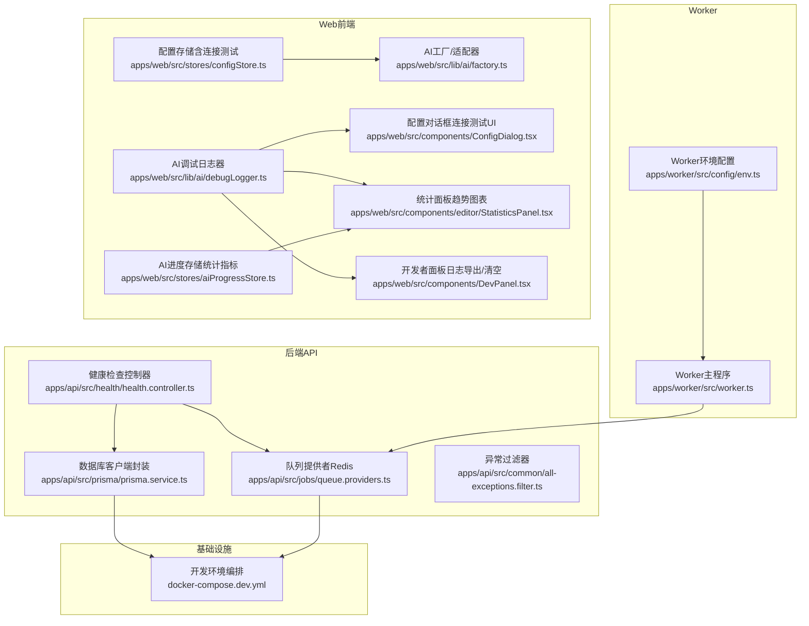
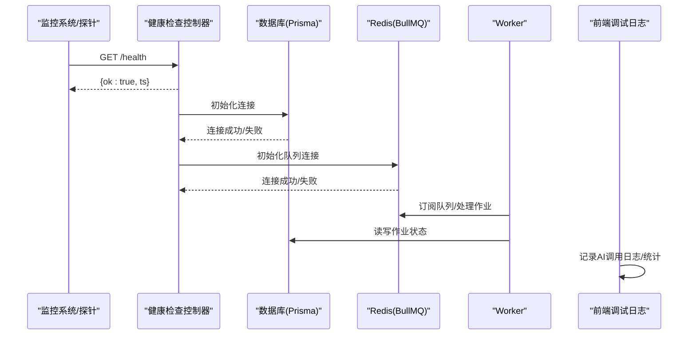
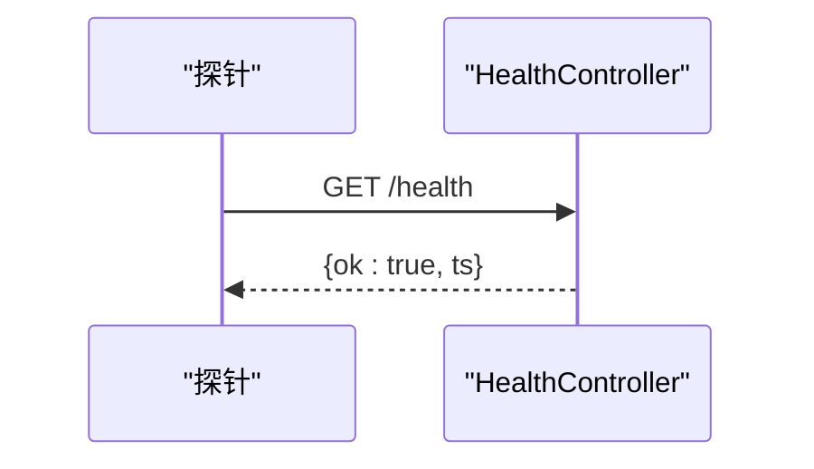
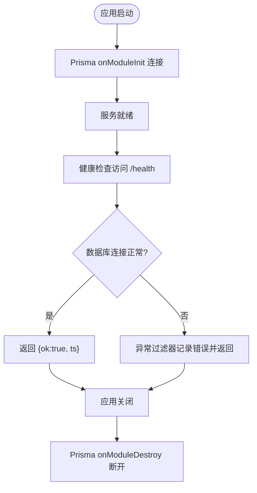
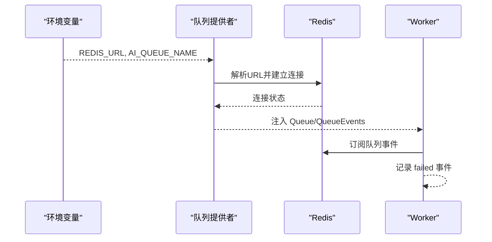
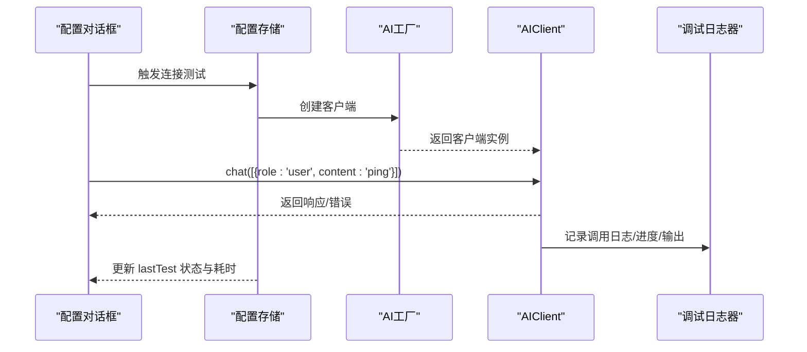
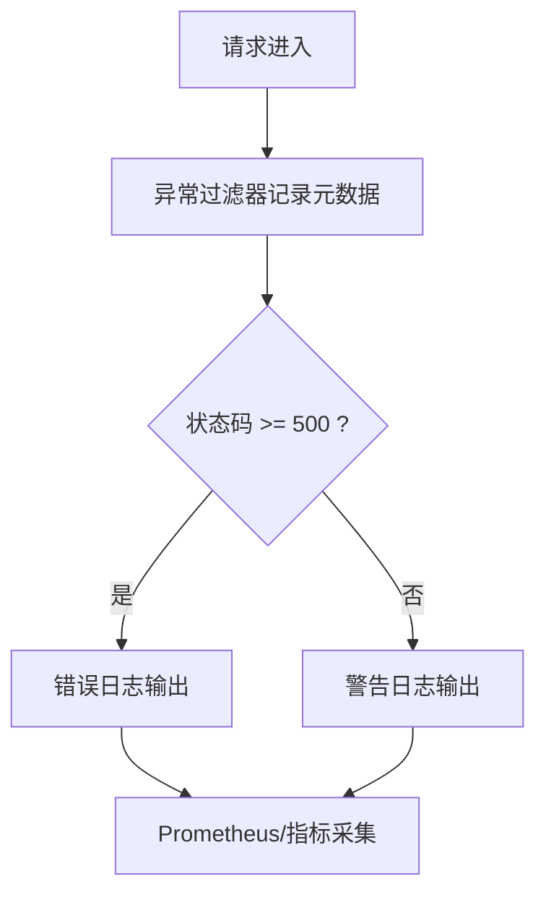
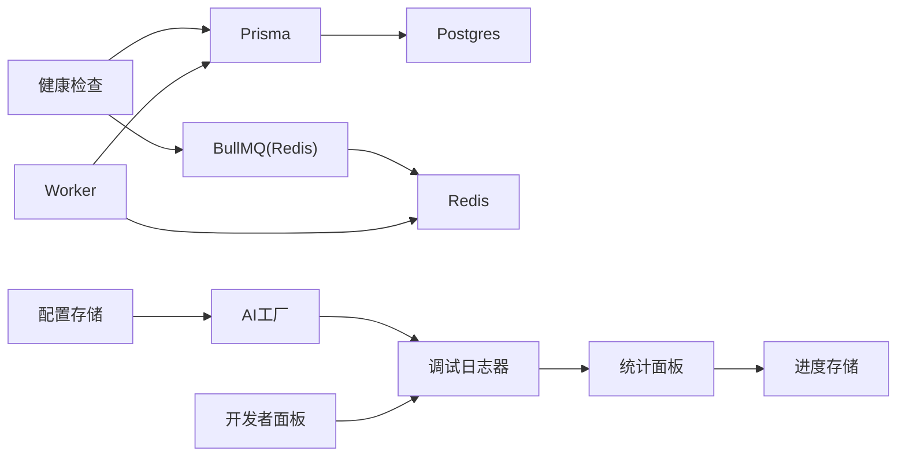

# 监控告警

<cite>
**本文引用的文件**
- [apps/api/src/health/health.controller.ts](file://apps/api/src/health/health.controller.ts)
- [apps/api/src/prisma/prisma.service.ts](file://apps/api/src/prisma/prisma.service.ts)
- [apps/api/src/jobs/queue.providers.ts](file://apps/api/src/jobs/queue.providers.ts)
- [apps/api/src/common/all-exceptions.filter.ts](file://apps/api/src/common/all-exceptions.filter.ts)
- [apps/worker/src/worker.ts](file://apps/worker/src/worker.ts)
- [apps/worker/src/config/env.ts](file://apps/worker/src/config/env.ts)
- [apps/web/src/lib/ai/debugLogger.ts](file://apps/web/src/lib/ai/debugLogger.ts)
- [apps/web/src/lib/ai/factory.ts](file://apps/web/src/lib/ai/factory.ts)
- [apps/web/src/stores/configStore.ts](file://apps/web/src/stores/configStore.ts)
- [apps/web/src/components/ConfigDialog.tsx](file://apps/web/src/components/ConfigDialog.tsx)
- [apps/web/src/components/editor/StatisticsPanel.tsx](file://apps/web/src/components/editor/StatisticsPanel.tsx)
- [apps/web/src/components/DevPanel.tsx](file://apps/web/src/components/DevPanel.tsx)
- [apps/web/src/stores/aiProgressStore.ts](file://apps/web/src/stores/aiProgressStore.ts)
- [docker-compose.dev.yml](file://docker-compose.dev.yml)
</cite>

## 目录

1. [简介](#简介)
2. [项目结构](#项目结构)
3. [核心组件](#核心组件)
4. [架构总览](#架构总览)
5. [详细组件分析](#详细组件分析)
6. [依赖关系分析](#依赖关系分析)
7. [性能考量](#性能考量)
8. [故障排查指南](#故障排查指南)
9. [结论](#结论)
10. [附录](#附录)

## 简介

本文件面向AIXSSS项目的监控与告警体系，围绕健康检查端点、数据库连接、Redis可用性、AI服务连通性等关键指标，结合前端、后端、Worker三模块的日志与性能数据，给出可落地的监控设计、告警规则与仪表板搭建建议，并提供故障排查流程与优化实践。

## 项目结构

AIXSSS采用多包结构，核心模块包括：

- 后端API（NestJS + Prisma + BullMQ队列）
- Worker（异步任务执行）
- Web前端（AI调用、调试日志、性能统计）

**图示来源**

- [apps/api/src/health/health.controller.ts](file://apps/api/src/health/health.controller.ts#L1-L9)
- [apps/api/src/prisma/prisma.service.ts](file://apps/api/src/prisma/prisma.service.ts#L1-L16)
- [apps/api/src/jobs/queue.providers.ts](file://apps/api/src/jobs/queue.providers.ts#L1-L36)
- [apps/api/src/common/all-exceptions.filter.ts](file://apps/api/src/common/all-exceptions.filter.ts#L1-L91)
- [apps/worker/src/worker.ts](file://apps/worker/src/worker.ts#L44-L754)
- [apps/worker/src/config/env.ts](file://apps/worker/src/config/env.ts#L1-L12)
- [apps/web/src/lib/ai/debugLogger.ts](file://apps/web/src/lib/ai/debugLogger.ts#L1-L624)
- [apps/web/src/lib/ai/factory.ts](file://apps/web/src/lib/ai/factory.ts#L1-L98)
- [apps/web/src/stores/configStore.ts](file://apps/web/src/stores/configStore.ts#L374-L497)
- [apps/web/src/components/ConfigDialog.tsx](file://apps/web/src/components/ConfigDialog.tsx#L801-L838)
- [apps/web/src/components/editor/StatisticsPanel.tsx](file://apps/web/src/components/editor/StatisticsPanel.tsx#L49-L907)
- [apps/web/src/components/DevPanel.tsx](file://apps/web/src/components/DevPanel.tsx#L331-L448)
- [apps/web/src/stores/aiProgressStore.ts](file://apps/web/src/stores/aiProgressStore.ts#L208-L238)
- [docker-compose.dev.yml](file://docker-compose.dev.yml#L1-L35)

**章节来源**

- [apps/api/src/health/health.controller.ts](file://apps/api/src/health/health.controller.ts#L1-L9)
- [apps/api/src/prisma/prisma.service.ts](file://apps/api/src/prisma/prisma.service.ts#L1-L16)
- [apps/api/src/jobs/queue.providers.ts](file://apps/api/src/jobs/queue.providers.ts#L1-L36)
- [apps/api/src/common/all-exceptions.filter.ts](file://apps/api/src/common/all-exceptions.filter.ts#L1-L91)
- [apps/worker/src/worker.ts](file://apps/worker/src/worker.ts#L44-L754)
- [apps/worker/src/config/env.ts](file://apps/worker/src/config/env.ts#L1-L12)
- [apps/web/src/lib/ai/debugLogger.ts](file://apps/web/src/lib/ai/debugLogger.ts#L1-L624)
- [apps/web/src/lib/ai/factory.ts](file://apps/web/src/lib/ai/factory.ts#L1-L98)
- [apps/web/src/stores/configStore.ts](file://apps/web/src/stores/configStore.ts#L374-L497)
- [apps/web/src/components/ConfigDialog.tsx](file://apps/web/src/components/ConfigDialog.tsx#L801-L838)
- [apps/web/src/components/editor/StatisticsPanel.tsx](file://apps/web/src/components/editor/StatisticsPanel.tsx#L49-L907)
- [apps/web/src/components/DevPanel.tsx](file://apps/web/src/components/DevPanel.tsx#L331-L448)
- [apps/web/src/stores/aiProgressStore.ts](file://apps/web/src/stores/aiProgressStore.ts#L208-L238)
- [docker-compose.dev.yml](file://docker-compose.dev.yml#L1-L35)

## 核心组件

- 健康检查端点：提供基础存活探测，返回系统时间戳，便于外部监控系统验证可达性。
- 数据库连接：Prisma客户端在模块初始化时建立连接，在销毁时断开，确保生命周期可控。
- Redis队列：通过BullMQ连接Redis，作为任务队列与事件总线，支持作业状态与进度上报。
- 异常过滤：统一捕获异常，输出结构化错误日志，便于问题定位与审计。
- Worker：解析环境变量，连接数据库与Redis，注册作业处理器，记录失败事件，优雅关闭。
- 前端调试日志：记录AI调用的输入、输出、Token消耗、状态变化，支持导出与统计。
- 连接测试：前端提供AI配置连接测试，记录耗时、状态与建议，辅助快速诊断。
- 性能统计：前端统计面板与进度存储计算平均响应时间、Token总量、成功率等指标。

**章节来源**

- [apps/api/src/health/health.controller.ts](file://apps/api/src/health/health.controller.ts#L1-L9)
- [apps/api/src/prisma/prisma.service.ts](file://apps/api/src/prisma/prisma.service.ts#L1-L16)
- [apps/api/src/jobs/queue.providers.ts](file://apps/api/src/jobs/queue.providers.ts#L1-L36)
- [apps/api/src/common/all-exceptions.filter.ts](file://apps/api/src/common/all-exceptions.filter.ts#L1-L91)
- [apps/worker/src/worker.ts](file://apps/worker/src/worker.ts#L44-L754)
- [apps/worker/src/config/env.ts](file://apps/worker/src/config/env.ts#L1-L12)
- [apps/web/src/lib/ai/debugLogger.ts](file://apps/web/src/lib/ai/debugLogger.ts#L1-L624)
- [apps/web/src/stores/configStore.ts](file://apps/web/src/stores/configStore.ts#L374-L497)
- [apps/web/src/components/editor/StatisticsPanel.tsx](file://apps/web/src/components/editor/StatisticsPanel.tsx#L49-L907)
- [apps/web/src/stores/aiProgressStore.ts](file://apps/web/src/stores/aiProgressStore.ts#L208-L238)

## 架构总览

下图展示健康检查、数据库、Redis队列、Worker与前端调试日志之间的交互关系。

**图示来源**

- [apps/api/src/health/health.controller.ts](file://apps/api/src/health/health.controller.ts#L1-L9)
- [apps/api/src/prisma/prisma.service.ts](file://apps/api/src/prisma/prisma.service.ts#L1-L16)
- [apps/api/src/jobs/queue.providers.ts](file://apps/api/src/jobs/queue.providers.ts#L1-L36)
- [apps/worker/src/worker.ts](file://apps/worker/src/worker.ts#L44-L754)
- [apps/web/src/lib/ai/debugLogger.ts](file://apps/web/src/lib/ai/debugLogger.ts#L1-L624)

## 详细组件分析

### 健康检查端点

- 能力：提供轻量级存活探测，返回系统时间戳，便于外部监控系统验证可达性。
- 建议：结合探针轮询频率与超时阈值，配合告警规则触发通知。

**图示来源**

- [apps/api/src/health/health.controller.ts](file://apps/api/src/health/health.controller.ts#L1-L9)

**章节来源**

- [apps/api/src/health/health.controller.ts](file://apps/api/src/health/health.controller.ts#L1-L9)

### 数据库连接状态监控

- 生命周期：Prisma在模块初始化时连接，在销毁时断开，保证资源释放。
- 建议：在健康检查中增加数据库连接状态校验；在生产环境启用连接池与超时配置；结合异常过滤器记录错误堆栈。

**图示来源**

- [apps/api/src/prisma/prisma.service.ts](file://apps/api/src/prisma/prisma.service.ts#L1-L16)
- [apps/api/src/common/all-exceptions.filter.ts](file://apps/api/src/common/all-exceptions.filter.ts#L1-L91)

**章节来源**

- [apps/api/src/prisma/prisma.service.ts](file://apps/api/src/prisma/prisma.service.ts#L1-L16)
- [apps/api/src/common/all-exceptions.filter.ts](file://apps/api/src/common/all-exceptions.filter.ts#L1-L91)

### Redis可用性与队列监控

- 连接解析：通过解析REDIS_URL构造主机、端口与密码，确保连接参数正确。
- 队列提供者：基于环境变量创建队列与事件实例，支持作业进度与状态事件。
- Worker：注册ready/failed事件，记录失败详情，便于快速定位问题。

**图示来源**

- [apps/api/src/jobs/queue.providers.ts](file://apps/api/src/jobs/queue.providers.ts#L1-L36)
- [apps/worker/src/worker.ts](file://apps/worker/src/worker.ts#L44-L754)
- [apps/worker/src/config/env.ts](file://apps/worker/src/config/env.ts#L1-L12)

**章节来源**

- [apps/api/src/jobs/queue.providers.ts](file://apps/api/src/jobs/queue.providers.ts#L1-L36)
- [apps/worker/src/worker.ts](file://apps/worker/src/worker.ts#L44-L754)
- [apps/worker/src/config/env.ts](file://apps/worker/src/config/env.ts#L1-L12)

### AI服务连通性与日志管理

- 前端连接测试：发起“ping”消息，记录耗时、状态与建议，更新配置存储中的最后测试结果。
- 调试日志器：记录每次AI调用的输入、输出、Token消耗、状态变化，支持导出与统计。
- 工厂适配器：根据配置选择后端模式或本地模式，统一聊天接口与流式输出。

**图示来源**

- [apps/web/src/stores/configStore.ts](file://apps/web/src/stores/configStore.ts#L374-L497)
- [apps/web/src/lib/ai/factory.ts](file://apps/web/src/lib/ai/factory.ts#L1-L98)
- [apps/web/src/lib/ai/debugLogger.ts](file://apps/web/src/lib/ai/debugLogger.ts#L1-L624)
- [apps/web/src/components/ConfigDialog.tsx](file://apps/web/src/components/ConfigDialog.tsx#L801-L838)

**章节来源**

- [apps/web/src/stores/configStore.ts](file://apps/web/src/stores/configStore.ts#L374-L497)
- [apps/web/src/lib/ai/factory.ts](file://apps/web/src/lib/ai/factory.ts#L1-L98)
- [apps/web/src/lib/ai/debugLogger.ts](file://apps/web/src/lib/ai/debugLogger.ts#L1-L624)
- [apps/web/src/components/ConfigDialog.tsx](file://apps/web/src/components/ConfigDialog.tsx#L801-L838)

### 性能监控指标设计

- API响应时间：由异常过滤器记录请求方法、URL、状态码与消息，可用于计算P95/P99延迟。
- 数据库查询性能：结合Prisma日志与数据库慢查询日志，识别热点SQL与索引缺失。
- AI任务处理时延：前端统计面板与进度存储计算平均响应时间、Token总量、成功率与P95耗时。

**图示来源**

- [apps/api/src/common/all-exceptions.filter.ts](file://apps/api/src/common/all-exceptions.filter.ts#L1-L91)

**章节来源**

- [apps/api/src/common/all-exceptions.filter.ts](file://apps/api/src/common/all-exceptions.filter.ts#L1-L91)
- [apps/web/src/components/editor/StatisticsPanel.tsx](file://apps/web/src/components/editor/StatisticsPanel.tsx#L49-L907)
- [apps/web/src/stores/aiProgressStore.ts](file://apps/web/src/stores/aiProgressStore.ts#L208-L238)

## 依赖关系分析

- 后端API依赖Prisma与Redis队列；Worker依赖Redis队列与数据库；前端依赖AI工厂与调试日志器。
- 健康检查端点同时反映数据库与Redis的可用性；异常过滤器统一输出错误日志。
- 前端调试日志器与统计面板形成闭环，支撑性能与质量监控。

**图示来源**

- [apps/api/src/health/health.controller.ts](file://apps/api/src/health/health.controller.ts#L1-L9)
- [apps/api/src/prisma/prisma.service.ts](file://apps/api/src/prisma/prisma.service.ts#L1-L16)
- [apps/api/src/jobs/queue.providers.ts](file://apps/api/src/jobs/queue.providers.ts#L1-L36)
- [apps/worker/src/worker.ts](file://apps/worker/src/worker.ts#L44-L754)
- [apps/web/src/lib/ai/factory.ts](file://apps/web/src/lib/ai/factory.ts#L1-L98)
- [apps/web/src/lib/ai/debugLogger.ts](file://apps/web/src/lib/ai/debugLogger.ts#L1-L624)
- [apps/web/src/stores/aiProgressStore.ts](file://apps/web/src/stores/aiProgressStore.ts#L208-L238)
- [apps/web/src/components/DevPanel.tsx](file://apps/web/src/components/DevPanel.tsx#L331-L448)

**章节来源**

- [apps/api/src/health/health.controller.ts](file://apps/api/src/health/health.controller.ts#L1-L9)
- [apps/api/src/prisma/prisma.service.ts](file://apps/api/src/prisma/prisma.service.ts#L1-L16)
- [apps/api/src/jobs/queue.providers.ts](file://apps/api/src/jobs/queue.providers.ts#L1-L36)
- [apps/worker/src/worker.ts](file://apps/worker/src/worker.ts#L44-L754)
- [apps/web/src/lib/ai/factory.ts](file://apps/web/src/lib/ai/factory.ts#L1-L98)
- [apps/web/src/lib/ai/debugLogger.ts](file://apps/web/src/lib/ai/debugLogger.ts#L1-L624)
- [apps/web/src/stores/aiProgressStore.ts](file://apps/web/src/stores/aiProgressStore.ts#L208-L238)
- [apps/web/src/components/DevPanel.tsx](file://apps/web/src/components/DevPanel.tsx#L331-L448)

## 性能考量

- API层：启用异常过滤器记录请求元数据，便于定位慢请求与错误集中时段。
- 数据库层：合理设置连接池大小与超时，开启慢查询日志，定期分析热点SQL。
- 队列层：监控队列积压、失败重试次数与处理时延，必要时扩容Worker并发或优化任务粒度。
- 前端层：利用调试日志器与统计面板观察P95耗时、Token消耗与成功率，指导提示词优化与模型选择。

[本节为通用建议，无需特定文件引用]

## 故障排查指南

- 健康检查失败
  - 检查后端进程与端口映射；确认健康端点可达。
  - 参考路径：[apps/api/src/health/health.controller.ts](file://apps/api/src/health/health.controller.ts#L1-L9)
- 数据库连接异常
  - 查看Prisma初始化与销毁日志；核对DATABASE_URL与网络连通性。
  - 参考路径：[apps/api/src/prisma/prisma.service.ts](file://apps/api/src/prisma/prisma.service.ts#L1-L16)
- Redis不可用
  - 校验REDIS_URL格式与端口；确认队列提供者解析逻辑与连接状态。
  - 参考路径：[apps/api/src/jobs/queue.providers.ts](file://apps/api/src/jobs/queue.providers.ts#L1-L36)，[apps/worker/src/config/env.ts](file://apps/worker/src/config/env.ts#L1-L12)
- Worker失败
  - 查看failed事件日志与错误堆栈；核对作业数据与依赖服务。
  - 参考路径：[apps/worker/src/worker.ts](file://apps/worker/src/worker.ts#L735-L748)
- AI连接测试失败
  - 使用配置对话框的连接测试功能，查看耗时、状态与建议；检查API Key与模型配置。
  - 参考路径：[apps/web/src/stores/configStore.ts](file://apps/web/src/stores/configStore.ts#L374-L497)，[apps/web/src/components/ConfigDialog.tsx](file://apps/web/src/components/ConfigDialog.tsx#L801-L838)
- 前端日志与导出
  - 在开发者面板导出调试日志，定位具体调用与错误片段。
  - 参考路径：[apps/web/src/components/DevPanel.tsx](file://apps/web/src/components/DevPanel.tsx#L331-L448)，[apps/web/src/lib/ai/debugLogger.ts](file://apps/web/src/lib/ai/debugLogger.ts#L479-L481)

**章节来源**

- [apps/api/src/health/health.controller.ts](file://apps/api/src/health/health.controller.ts#L1-L9)
- [apps/api/src/prisma/prisma.service.ts](file://apps/api/src/prisma/prisma.service.ts#L1-L16)
- [apps/api/src/jobs/queue.providers.ts](file://apps/api/src/jobs/queue.providers.ts#L1-L36)
- [apps/worker/src/config/env.ts](file://apps/worker/src/config/env.ts#L1-L12)
- [apps/worker/src/worker.ts](file://apps/worker/src/worker.ts#L735-L748)
- [apps/web/src/stores/configStore.ts](file://apps/web/src/stores/configStore.ts#L374-L497)
- [apps/web/src/components/ConfigDialog.tsx](file://apps/web/src/components/ConfigDialog.tsx#L801-L838)
- [apps/web/src/components/DevPanel.tsx](file://apps/web/src/components/DevPanel.tsx#L331-L448)
- [apps/web/src/lib/ai/debugLogger.ts](file://apps/web/src/lib/ai/debugLogger.ts#L479-L481)

## 结论

通过健康检查端点、数据库与Redis连接监控、Worker失败事件、前端调试日志与性能统计，AIXSSS已具备完善的可观测性基础。建议在此基础上接入Prometheus/Grafana，建立关键指标看板与告警规则，持续优化性能与稳定性。

[本节为总结，无需特定文件引用]

## 附录

### 告警规则配置建议

- 健康检查不可达：连续N次探测失败触发告警。
- 数据库连接失败：初始化/心跳检测失败触发告警。
- Redis连接失败：队列连接解析失败或连接断开触发告警。
- Worker失败率：单位时间内失败作业数占比超过阈值触发告警。
- API错误率：5xx错误占比超过阈值触发告警。
- P95响应时间：API/P95超过阈值触发告警。
- Token消耗异常：单次调用Token异常升高触发告警。

[本节为通用建议，无需特定文件引用]

### 监控仪表板搭建指南（Prometheus + Grafana）

- 指标采集
  - 后端：暴露HTTP请求指标（如请求耗时、错误数、吞吐量）。
  - 数据库：采集慢查询、连接数、锁等待等指标。
  - 队列：采集作业积压、处理时延、失败重试等指标。
  - 前端：采集AI调用耗时、Token消耗、成功率等指标。
- 仪表板
  - 实时健康：健康检查状态、数据库/Redis连接状态。
  - 性能总览：API P95/P99、数据库慢查询、队列积压。
  - AI质量：成功率、P95耗时、Token消耗、错误分布。
  - Worker健康：失败率、处理时延、并发与重试。
- 告警
  - 设置阈值与静默窗口，区分严重/警告级别，统一通知渠道（邮件/IM）。

[本节为通用建议，无需特定文件引用]
